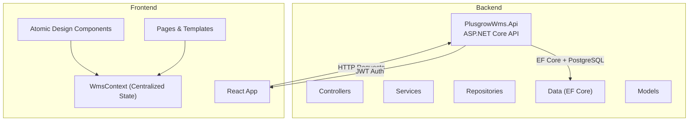
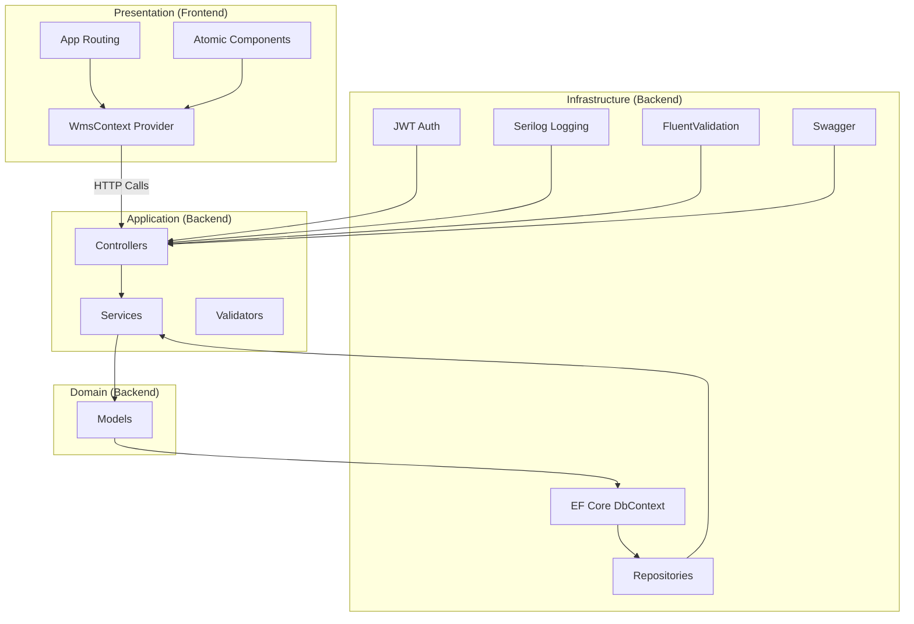
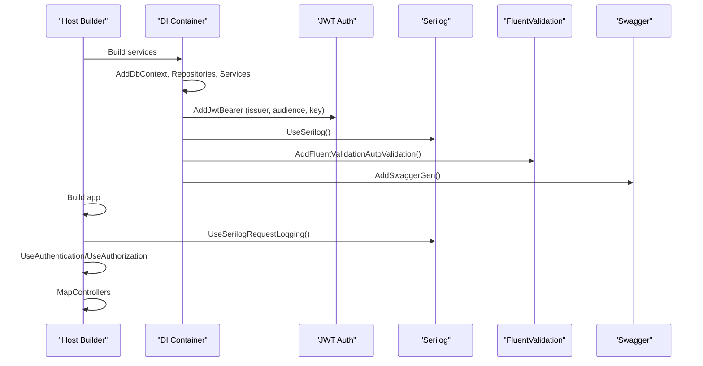
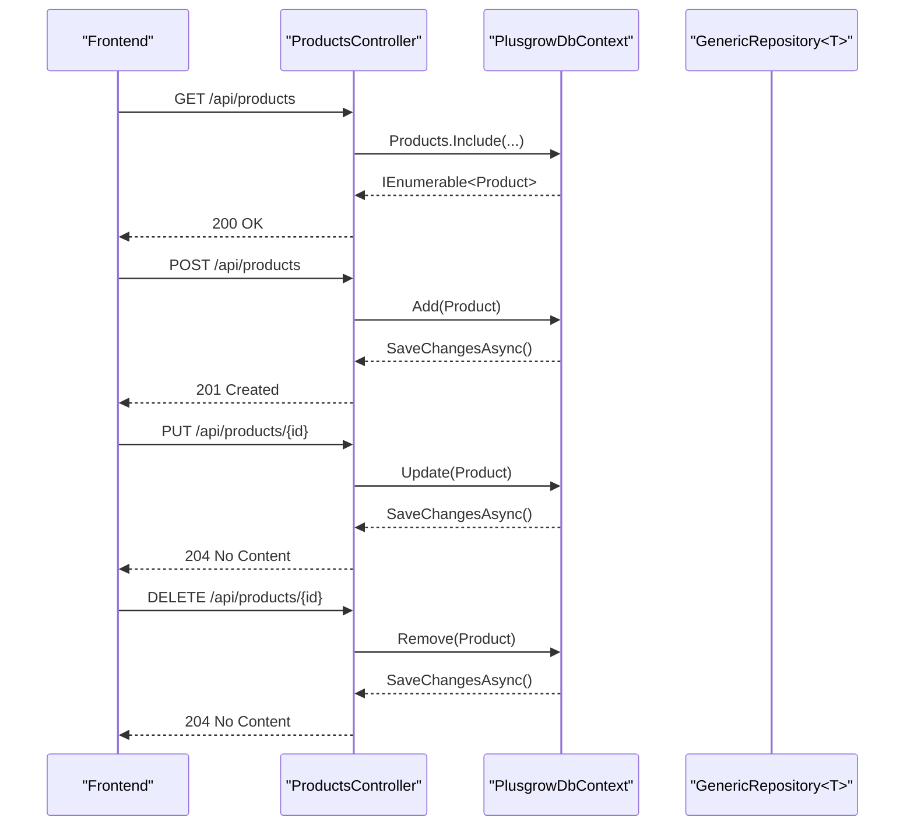
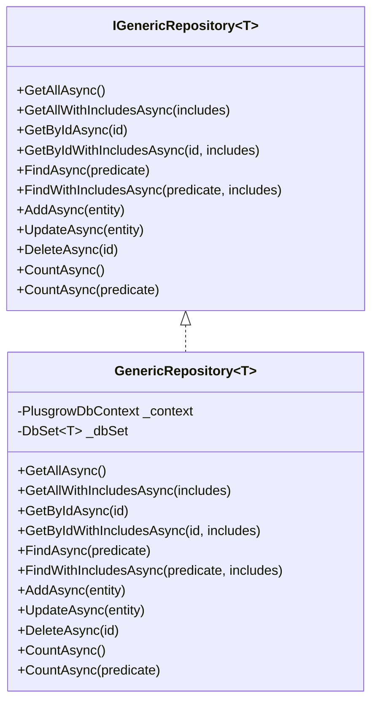
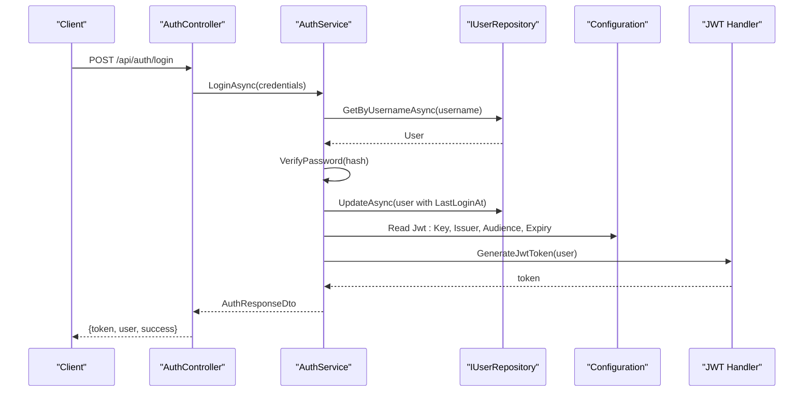
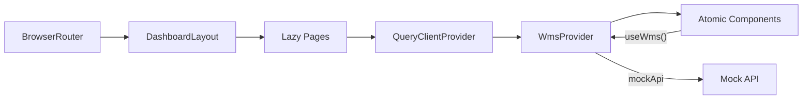
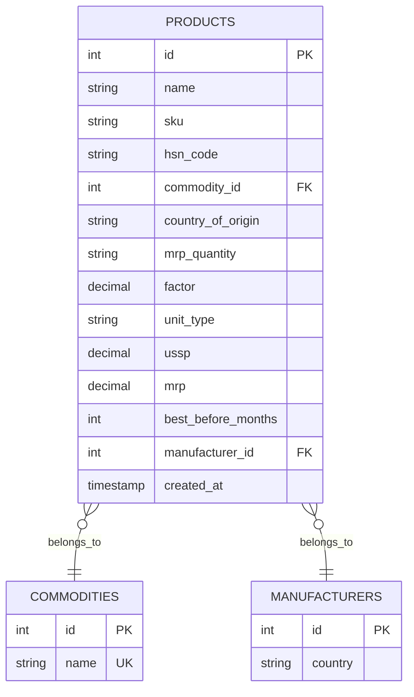
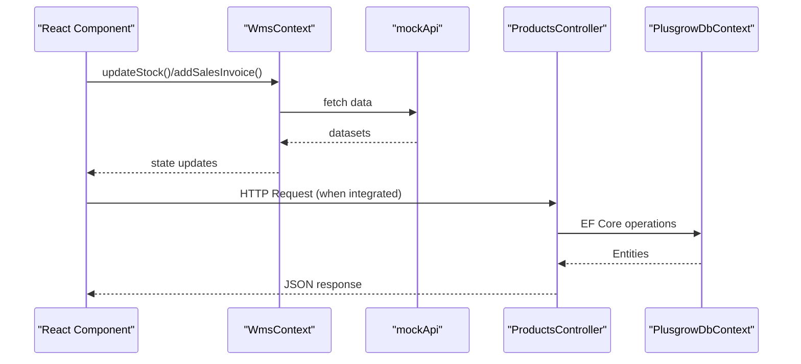
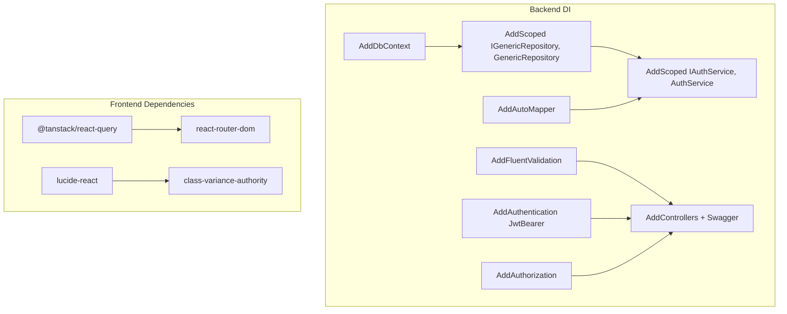

# Architecture Overview

<cite>
**Referenced Files in This Document**
- [Program.cs](file://Backend/PlusgrowWms.Api/Program.cs)
- [ProductsController.cs](file://Backend/PlusgrowWms.Api/Controllers/ProductsController.cs)
- [PlusgrowDbContext.cs](file://Backend/PlusgrowWms.Api/Data/PlusgrowDbContext.cs)
- [GenericRepository.cs](file://Backend/PlusgrowWms.Api/Repositories/GenericRepository.cs)
- [AuthService.cs](file://Backend/PlusgrowWms.Api/Services/AuthService.cs)
- [App.tsx](file://Frontend/src/App.tsx)
- [WmsContext.tsx](file://Frontend/src/context/WmsContext.tsx)
- [DataTable.tsx](file://Frontend/src/components/molecules/DataTable/DataTable.tsx)
- [Button.tsx](file://Frontend/src/components/atoms/Button/Button.tsx)
- [mockApi.ts](file://Frontend/src/services/mockApi.ts)
- [package.json](file://Frontend/package.json)
- [main.tsx](file://Frontend/src/main.tsx)
</cite>

## Table of Contents
1. [Introduction](#introduction)
2. [Project Structure](#project-structure)
3. [Core Components](#core-components)
4. [Architecture Overview](#architecture-overview)
5. [Detailed Component Analysis](#detailed-component-analysis)
6. [Dependency Analysis](#dependency-analysis)
7. [Performance Considerations](#performance-considerations)
8. [Troubleshooting Guide](#troubleshooting-guide)
9. [Conclusion](#conclusion)

## Introduction
This document presents the architectural blueprint for the PlusGrow Warehouse Management System (WMS). The system follows clean architecture principles with distinct layers:
- Presentation: React-based frontend with atomic design and centralized state via WmsContext
- Application: Service abstractions and orchestration
- Domain: Entity models and business rules
- Infrastructure: Data persistence, dependency injection, and cross-cutting concerns

It also documents the backend API built with ASP.NET Core, including dependency injection, repository pattern, JWT authentication, validation, logging, and Swagger/OpenAPI support. The document explains component interactions, data flows, system boundaries, technology stack choices, and architectural trade-offs, while emphasizing scalability and maintainability.

## Project Structure
The repository is organized into two primary areas:
- Backend: ASP.NET Core Web API implementing clean architecture with DI, repositories, services, and EF Core
- Frontend: React application with atomic design components, centralized state, routing, and data fetching

**Diagram sources**
- [Program.cs:1-107](file://Backend/PlusgrowWms.Api/Program.cs#L1-L107)
- [PlusgrowDbContext.cs:1-78](file://Backend/PlusgrowWms.Api/Data/PlusgrowDbContext.cs#L1-L78)
- [App.tsx:1-119](file://Frontend/src/App.tsx#L1-L119)
- [WmsContext.tsx:1-234](file://Frontend/src/context/WmsContext.tsx#L1-L234)

**Section sources**
- [Program.cs:1-107](file://Backend/PlusgrowWms.Api/Program.cs#L1-L107)
- [App.tsx:1-119](file://Frontend/src/App.tsx#L1-L119)

## Core Components
- Backend API bootstrap and DI container initialization
- Product resource controller with CRUD endpoints
- Generic repository pattern for data access
- Entity framework context with database model configuration and indexes
- Authentication service with JWT generation and password hashing
- Frontend React application with routing, atomic components, and centralized state
- Mock API layer simulating backend responses during development

**Section sources**
- [Program.cs:1-107](file://Backend/PlusgrowWms.Api/Program.cs#L1-L107)
- [ProductsController.cs:1-86](file://Backend/PlusgrowWms.Api/Controllers/ProductsController.cs#L1-L86)
- [GenericRepository.cs:1-117](file://Backend/PlusgrowWms.Api/Repositories/GenericRepository.cs#L1-L117)
- [PlusgrowDbContext.cs:1-78](file://Backend/PlusgrowWms.Api/Data/PlusgrowDbContext.cs#L1-L78)
- [AuthService.cs:1-236](file://Backend/PlusgrowWms.Api/Services/AuthService.cs#L1-L236)
- [App.tsx:1-119](file://Frontend/src/App.tsx#L1-L119)
- [WmsContext.tsx:1-234](file://Frontend/src/context/WmsContext.tsx#L1-L234)
- [mockApi.ts:1-32](file://Frontend/src/services/mockApi.ts#L1-L32)

## Architecture Overview
The system adheres to clean architecture with clear layer separation:
- Presentation layer (React): UI components, routing, and centralized state
- Application layer (Services): Orchestration and business workflows
- Domain layer (Entities): Data models and business rules
- Infrastructure layer (EF Core, DI, Auth): Persistence, dependency injection, JWT, logging, validation

**Diagram sources**
- [App.tsx:1-119](file://Frontend/src/App.tsx#L1-L119)
- [WmsContext.tsx:1-234](file://Frontend/src/context/WmsContext.tsx#L1-L234)
- [ProductsController.cs:1-86](file://Backend/PlusgrowWms.Api/Controllers/ProductsController.cs#L1-L86)
- [AuthService.cs:1-236](file://Backend/PlusgrowWms.Api/Services/AuthService.cs#L1-L236)
- [PlusgrowDbContext.cs:1-78](file://Backend/PlusgrowWms.Api/Data/PlusgrowDbContext.cs#L1-L78)
- [GenericRepository.cs:1-117](file://Backend/PlusgrowWms.Api/Repositories/GenericRepository.cs#L1-L117)
- [Program.cs:1-107](file://Backend/PlusgrowWms.Api/Program.cs#L1-L107)

## Detailed Component Analysis

### Backend API Bootstrap and Cross-Cutting Concerns
- Dependency Injection: DbContext, repositories, services, AutoMapper, validators, and CORS are registered
- Authentication: JWT bearer with issuer, audience, and symmetric key
- Authorization: Enforced globally
- Logging: Serilog request logging middleware
- Validation: FluentValidation auto-validation and assembly scanning
- OpenAPI: Swagger enabled in development
- CORS: Allow-list configured for frontend origin

**Diagram sources**
- [Program.cs:16-107](file://Backend/PlusgrowWms.Api/Program.cs#L16-L107)

**Section sources**
- [Program.cs:16-107](file://Backend/PlusgrowWms.Api/Program.cs#L16-L107)

### Product Resource Controller
- Endpoints: GET /api/products, GET /api/products/{id}, POST, PUT, DELETE
- Includes related entities (Commodity, Manufacturer) on retrieval
- Uses EF Core with async operations and concurrency handling

**Diagram sources**
- [ProductsController.cs:19-86](file://Backend/PlusgrowWms.Api/Controllers/ProductsController.cs#L19-L86)
- [PlusgrowDbContext.cs:12-18](file://Backend/PlusgrowWms.Api/Data/PlusgrowDbContext.cs#L12-L18)

**Section sources**
- [ProductsController.cs:1-86](file://Backend/PlusgrowWms.Api/Controllers/ProductsController.cs#L1-L86)
- [PlusgrowDbContext.cs:1-78](file://Backend/PlusgrowWms.Api/Data/PlusgrowDbContext.cs#L1-L78)

### Generic Repository Pattern
- Interface defines common CRUD and query operations
- Implementation encapsulates EF Core DbSet operations
- Supports includes and predicate-based queries
- Centralizes persistence logic and simplifies testing

**Diagram sources**
- [GenericRepository.cs:7-20](file://Backend/PlusgrowWms.Api/Repositories/GenericRepository.cs#L7-L20)
- [GenericRepository.cs:22-117](file://Backend/PlusgrowWms.Api/Repositories/GenericRepository.cs#L22-L117)

**Section sources**
- [GenericRepository.cs:1-117](file://Backend/PlusgrowWms.Api/Repositories/GenericRepository.cs#L1-L117)

### Authentication Service and JWT
- Login: Validates credentials, checks account activity, updates last login, generates JWT
- Registration: Checks uniqueness, hashes password, persists user
- Token refresh: Regenerates JWT for active users
- Password hashing: BCrypt with work factor
- Claims: NameIdentifier, Name, GivenName, Email, Role, roleId

**Diagram sources**
- [AuthService.cs:39-103](file://Backend/PlusgrowWms.Api/Services/AuthService.cs#L39-L103)
- [AuthService.cs:144-168](file://Backend/PlusgrowWms.Api/Services/AuthService.cs#L144-L168)

**Section sources**
- [AuthService.cs:1-236](file://Backend/PlusgrowWms.Api/Services/AuthService.cs#L1-L236)

### Frontend Architecture: Atomic Design and Centralized State
- Routing: React Router with lazy-loaded page components
- State: WmsContext aggregates products, customers, invoices, stock, activities
- Data fetching: mockApi simulates backend calls with delays
- UI: Atomic design with Button and DataTable components
- Data fetching library: TanStack React Query for caching and background updates

**Diagram sources**
- [App.tsx:39-118](file://Frontend/src/App.tsx#L39-L118)
- [WmsContext.tsx:28-225](file://Frontend/src/context/WmsContext.tsx#L28-L225)
- [mockApi.ts:6-31](file://Frontend/src/services/mockApi.ts#L6-L31)

**Section sources**
- [App.tsx:1-119](file://Frontend/src/App.tsx#L1-L119)
- [WmsContext.tsx:1-234](file://Frontend/src/context/WmsContext.tsx#L1-L234)
- [DataTable.tsx:1-236](file://Frontend/src/components/molecules/DataTable/DataTable.tsx#L1-L236)
- [Button.tsx:1-142](file://Frontend/src/components/atoms/Button/Button.tsx#L1-L142)
- [mockApi.ts:1-32](file://Frontend/src/services/mockApi.ts#L1-L32)
- [package.json:13-44](file://Frontend/package.json#L13-L44)

### Data Model: Product
- Entity mapped to database table with attributes for name, SKU, HSN, commodity, manufacturer, pricing, and timestamps
- Foreign keys define relationships with Commodity and Manufacturer

**Diagram sources**
- [Product.cs:6-65](file://Backend/PlusgrowWms.Api/Models/Product.cs#L6-L65)
- [PlusgrowDbContext.cs:12-18](file://Backend/PlusgrowWms.Api/Data/PlusgrowDbContext.cs#L12-L18)

**Section sources**
- [Product.cs:1-65](file://Backend/PlusgrowWms.Api/Models/Product.cs#L1-L65)
- [PlusgrowDbContext.cs:20-76](file://Backend/PlusgrowWms.Api/Data/PlusgrowDbContext.cs#L20-L76)

### Component Interactions and Data Flows
- Frontend-to-Backend: React components trigger actions that call backend endpoints via HTTP clients; currently, the frontend uses a mock API for development
- Backend-to-Database: Controllers depend on services; services use repositories; repositories use EF Core context
- Authentication flow: Clients receive JWT tokens after successful login; subsequent requests can be authorized

**Diagram sources**
- [WmsContext.tsx:37-71](file://Frontend/src/context/WmsContext.tsx#L37-L71)
- [mockApi.ts:6-31](file://Frontend/src/services/mockApi.ts#L6-L31)
- [ProductsController.cs:19-86](file://Backend/PlusgrowWms.Api/Controllers/ProductsController.cs#L19-L86)
- [PlusgrowDbContext.cs:12-18](file://Backend/PlusgrowWms.Api/Data/PlusgrowDbContext.cs#L12-L18)

**Section sources**
- [WmsContext.tsx:1-234](file://Frontend/src/context/WmsContext.tsx#L1-L234)
- [mockApi.ts:1-32](file://Frontend/src/services/mockApi.ts#L1-L32)
- [ProductsController.cs:1-86](file://Backend/PlusgrowWms.Api/Controllers/ProductsController.cs#L1-L86)

## Dependency Analysis
- Backend DI registrations bind interfaces to implementations and configure services
- Controllers depend on DbContext for data operations
- Services depend on repositories for data access
- Frontend depends on React Query for caching and state synchronization

**Diagram sources**
- [Program.cs:25-72](file://Backend/PlusgrowWms.Api/Program.cs#L25-L72)
- [package.json:13-44](file://Frontend/package.json#L13-L44)

**Section sources**
- [Program.cs:25-72](file://Backend/PlusgrowWms.Api/Program.cs#L25-L72)
- [package.json:13-44](file://Frontend/package.json#L13-L44)

## Performance Considerations
- Frontend caching: React Query default options include a stale threshold and controlled refetch behavior to balance freshness and performance
- Database indexing: Strategic unique and composite indexes improve lookup performance for entities
- Asynchronous operations: Controllers and repositories use async/await to prevent blocking I/O
- Lazy loading: Frontend routes are lazily loaded to reduce initial bundle size
- Component rendering: DataTable leverages animations and memoization to optimize re-renders

[No sources needed since this section provides general guidance]

## Troubleshooting Guide
- Authentication failures: Verify JWT issuer, audience, and signing key configuration; check user activity status
- Validation errors: Ensure FluentValidation is configured and validators are registered from the correct assembly
- Logging: Confirm Serilog is initialized and request logging middleware is enabled
- CORS: Ensure the frontend origin is included in the allow-list policy
- Database connectivity: Validate connection string and migrations applied

**Section sources**
- [Program.cs:44-83](file://Backend/PlusgrowWms.Api/Program.cs#L44-L83)
- [AuthService.cs:39-103](file://Backend/PlusgrowWms.Api/Services/AuthService.cs#L39-L103)

## Conclusion
PlusGrow WMS adopts clean architecture to achieve clear separation of concerns, testability, and maintainability. The backend leverages dependency injection, repository pattern, and service abstractions with robust cross-cutting concerns (JWT, validation, logging, OpenAPI). The frontend embraces atomic design and centralized state management, enabling scalable UI composition. The architecture supports incremental integration of real backend APIs while maintaining a consistent developer experience and strong system boundaries.