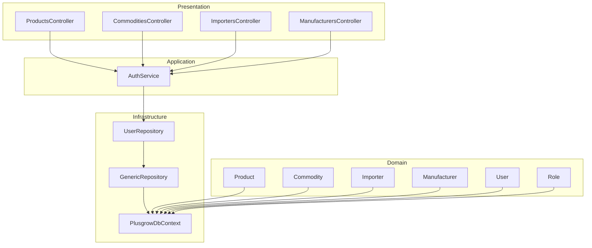
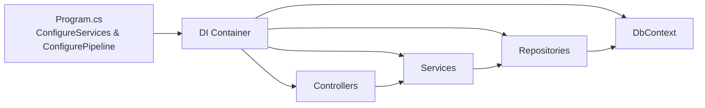
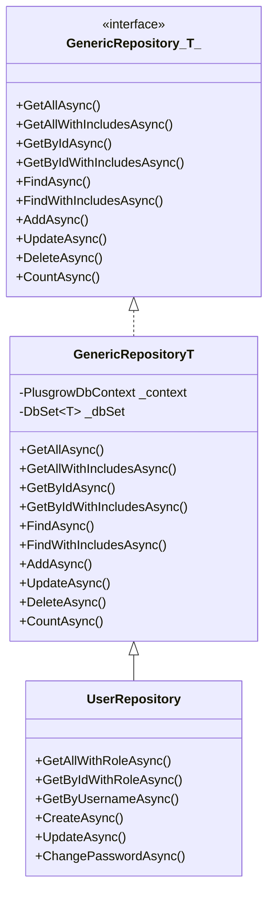
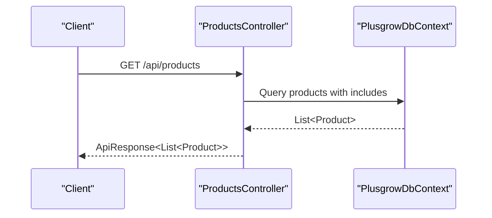
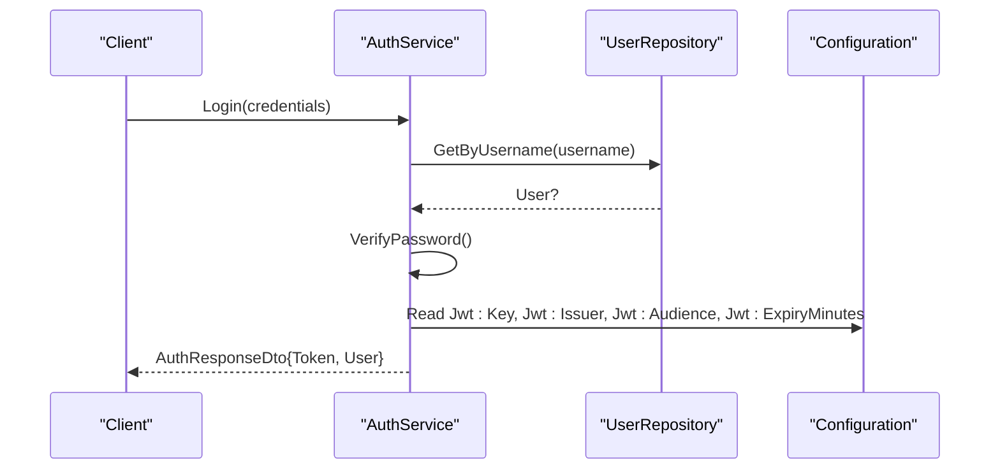
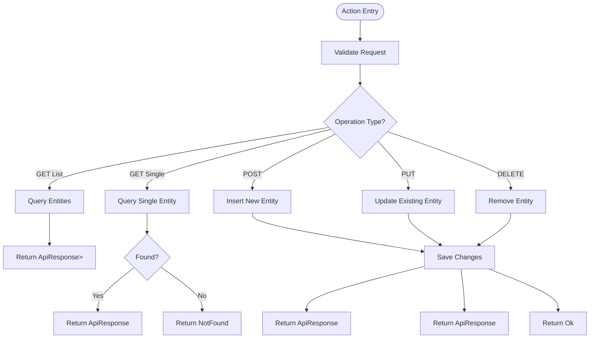
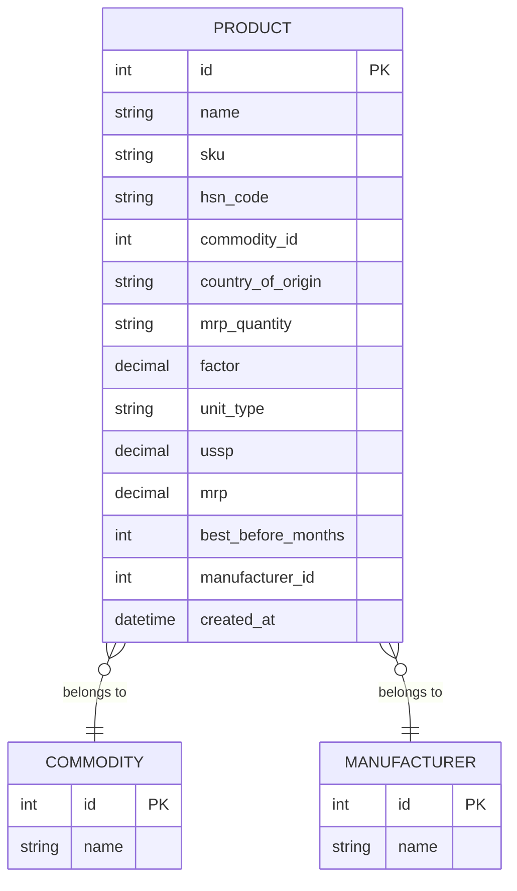
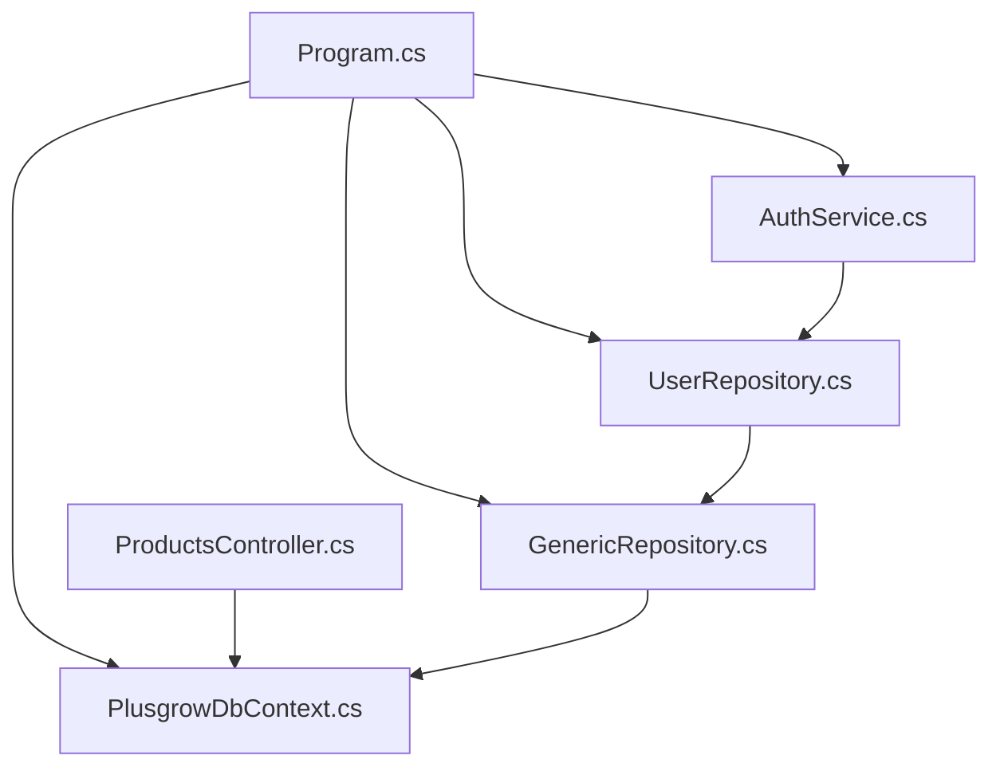

# Backend Architecture

<cite>
**Referenced Files in This Document**
- [Program.cs](file://Backend/PlusgrowWms.Api/Program.cs)
- [PlusgrowWms.Api.csproj](file://Backend/PlusgrowWms.Api/PlusgrowWms.Api.csproj)
- [PlusgrowDbContext.cs](file://Backend/PlusgrowWms.Api/Data/PlusgrowDbContext.cs)
- [GenericRepository.cs](file://Backend/PlusgrowWms.Api/Repositories/GenericRepository.cs)
- [UserRepository.cs](file://Backend/PlusgrowWms.Api/Repositories/UserRepository.cs)
- [AuthService.cs](file://Backend/PlusgrowWms.Api/Services/AuthService.cs)
- [ProductsController.cs](file://Backend/PlusgrowWms.Api/Controllers/ProductsController.cs)
- [CommoditiesController.cs](file://Backend/PlusgrowWms.Api/Controllers/CommoditiesController.cs)
- [ImportersController.cs](file://Backend/PlusgrowWms.Api/Controllers/ImportersController.cs)
- [ManufacturersController.cs](file://Backend/PlusgrowWms.Api/Controllers/ManufacturersController.cs)
- [Product.cs](file://Backend/PlusgrowWms.Api/Models/Product.cs)
- [AuthDto.cs](file://Backend/PlusgrowWms.Api/DTOs/AuthDto.cs)
- [MappingProfile.cs](file://Backend/PlusgrowWms.Api/Mappings/MappingProfile.cs)
- [ProductValidator.cs](file://Backend/PlusgrowWms.Api/Validators/ProductValidator.cs)
- [UserValidator.cs](file://Backend/PlusgrowWms.Api/Validators/UserValidator.cs)
</cite>

## Table of Contents
1. [Introduction](#introduction)
2. [Project Structure](#project-structure)
3. [Core Components](#core-components)
4. [Architecture Overview](#architecture-overview)
5. [Detailed Component Analysis](#detailed-component-analysis)
6. [Dependency Analysis](#dependency-analysis)
7. [Performance Considerations](#performance-considerations)
8. [Troubleshooting Guide](#troubleshooting-guide)
9. [Conclusion](#conclusion)

## Introduction
This document describes the backend architecture of the PlusGrow WMS ASP.NET Core API. It explains how the solution adheres to clean architecture by separating concerns into presentation (controllers), application (services), domain (models), and infrastructure (repositories and data access). It also covers dependency injection configuration, service registration patterns, the repository pattern implementation, JWT authentication and authorization, controller design patterns, response formatting, error handling, logging, and validation.

## Project Structure
The backend follows a layered architecture with clear boundaries:
- Presentation: Controllers under the Controllers folder handle HTTP requests and responses.
- Application: Services encapsulate business logic and orchestrate operations.
- Domain: Strongly-typed models define the business entities.
- Infrastructure: Entity Framework DbContext and repositories implement data access abstractions.

**Diagram sources**
- [ProductsController.cs:1-117](file://Backend/PlusgrowWms.Api/Controllers/ProductsController.cs#L1-L117)
- [AuthService.cs:1-236](file://Backend/PlusgrowWms.Api/Services/AuthService.cs#L1-L236)
- [PlusgrowDbContext.cs:1-78](file://Backend/PlusgrowWms.Api/Data/PlusgrowDbContext.cs#L1-L78)
- [GenericRepository.cs:1-117](file://Backend/PlusgrowWms.Api/Repositories/GenericRepository.cs#L1-L117)
- [UserRepository.cs:1-68](file://Backend/PlusgrowWms.Api/Repositories/UserRepository.cs#L1-L68)
- [Product.cs:1-65](file://Backend/PlusgrowWms.Api/Models/Product.cs#L1-L65)

**Section sources**
- [Program.cs:1-107](file://Backend/PlusgrowWms.Api/Program.cs#L1-L107)
- [PlusgrowWms.Api.csproj:1-29](file://Backend/PlusgrowWms.Api/PlusgrowWms.Api.csproj#L1-L29)

## Core Components
- Dependency Injection and Startup
  - DbContext registration for PostgreSQL with Entity Framework Core.
  - Repository registrations for generic and specific repositories.
  - Service registrations for application-layer services.
  - AutoMapper profile registration.
  - FluentValidation auto-validation and validator discovery.
  - JWT authentication with symmetric key signing and issuer/audience validation.
  - Authorization and CORS policies.
  - Swagger/OpenAPI enabled in development.
- Data Access Layer
  - DbContext defines entity sets and database-level indexes.
  - GenericRepository<T> provides common CRUD and query operations.
  - UserRepository extends GenericRepository<User> with user-specific queries.
- Application Layer
  - AuthService encapsulates authentication, registration, token generation, and password operations.
- Presentation Layer
  - Controllers expose REST endpoints for Products, Commodities, Importers, and Manufacturers.
  - Controllers use a consistent response wrapper via a base controller pattern and return typed ApiResponse results.

**Section sources**
- [Program.cs:25-102](file://Backend/PlusgrowWms.Api/Program.cs#L25-L102)
- [PlusgrowDbContext.cs:12-76](file://Backend/PlusgrowWms.Api/Data/PlusgrowDbContext.cs#L12-L76)
- [GenericRepository.cs:7-116](file://Backend/PlusgrowWms.Api/Repositories/GenericRepository.cs#L7-L116)
- [UserRepository.cs:7-67](file://Backend/PlusgrowWms.Api/Repositories/UserRepository.cs#L7-L67)
- [AuthService.cs:13-235](file://Backend/PlusgrowWms.Api/Services/AuthService.cs#L13-L235)
- [ProductsController.cs:20-116](file://Backend/PlusgrowWms.Api/Controllers/ProductsController.cs#L20-L116)

## Architecture Overview
The system enforces inversion of control through dependency injection. Controllers depend on application services, services depend on repositories, and repositories depend on the DbContext. This design ensures testability, maintainability, and separation of concerns.

**Diagram sources**
- [Program.cs:25-102](file://Backend/PlusgrowWms.Api/Program.cs#L25-L102)

## Detailed Component Analysis

### Dependency Injection and Service Registration
- DbContext: Registered with Npgsql provider and configured via connection string from configuration.
- Repositories: Generic repository registered as open generic; specific repositories registered explicitly.
- Services: Application services registered as scoped.
- AutoMapper: Profile assembly scanned for mapping configurations.
- Validation: FluentValidation auto-validation enabled; validators discovered from the assembly containing CreateUserValidator.
- Authentication: JWT bearer scheme configured with issuer, audience, and symmetric key validation parameters.
- Authorization: Enabled globally.
- CORS: Policy allowing frontend origin for local development.
- Swagger: Added for API documentation in development.

**Section sources**
- [Program.cs:25-102](file://Backend/PlusgrowWms.Api/Program.cs#L25-L102)
- [PlusgrowWms.Api.csproj:9-26](file://Backend/PlusgrowWms.Api/PlusgrowWms.Api.csproj#L9-L26)

### Data Access Abstraction: Repository Pattern
- GenericRepository<T>
  - Provides asynchronous CRUD and query methods.
  - Supports eager loading via include expressions.
  - Delegates persistence to the shared DbContext.
- UserRepository
  - Extends GenericRepository<User>.
  - Adds user-specific queries: fetch by username, fetch with role, update password, and filtered lists.

**Diagram sources**
- [GenericRepository.cs:7-116](file://Backend/PlusgrowWms.Api/Repositories/GenericRepository.cs#L7-L116)
- [UserRepository.cs:7-67](file://Backend/PlusgrowWms.Api/Repositories/UserRepository.cs#L7-L67)

**Section sources**
- [GenericRepository.cs:22-116](file://Backend/PlusgrowWms.Api/Repositories/GenericRepository.cs#L22-L116)
- [UserRepository.cs:17-67](file://Backend/PlusgrowWms.Api/Repositories/UserRepository.cs#L17-L67)

### Application Layer: Business Logic Encapsulation
- AuthService
  - Handles login, registration, password change, token refresh, and JWT token generation.
  - Uses bcrypt for secure password hashing and verification.
  - Updates user last login timestamps.
  - Returns structured DTOs for responses.

**Diagram sources**
- [ProductsController.cs:20-29](file://Backend/PlusgrowWms.Api/Controllers/ProductsController.cs#L20-L29)
- [PlusgrowDbContext.cs:12-18](file://Backend/PlusgrowWms.Api/Data/PlusgrowDbContext.cs#L12-L18)

**Section sources**
- [AuthService.cs:23-235](file://Backend/PlusgrowWms.Api/Services/AuthService.cs#L23-L235)

### Authentication and Authorization
- JWT Configuration
  - Symmetric key signing with HMAC SHA-256.
  - Claims include user identity, username, full name, email, role, and role identifier.
  - Token expiry configured via configuration.
- Middleware Pipeline
  - Authentication and Authorization enabled in the HTTP pipeline.
- Role-Based Access Control
  - Role claim included in JWT; authorization enabled globally.

**Diagram sources**
- [AuthService.cs:39-103](file://Backend/PlusgrowWms.Api/Services/AuthService.cs#L39-L103)
- [UserRepository.cs:38-43](file://Backend/PlusgrowWms.Api/Repositories/UserRepository.cs#L38-L43)
- [Program.cs:44-64](file://Backend/PlusgrowWms.Api/Program.cs#L44-L64)

**Section sources**
- [AuthService.cs:144-168](file://Backend/PlusgrowWms.Api/Services/AuthService.cs#L144-L168)
- [Program.cs:44-64](file://Backend/PlusgrowWms.Api/Program.cs#L44-L64)

### API Controller Design Patterns
- Base Controller Pattern
  - Controllers inherit from a base controller that provides a Success(...) helper and standardized response formatting.
- Endpoint Organization
  - Standard CRUD routes per resource with appropriate HTTP verbs.
  - Includes search endpoint with query parameter filtering.
- Response Formatting
  - Responses wrapped in a consistent ApiResponse envelope.
- Error Handling
  - Explicit NotFound, BadRequest, and Ok responses for resource operations.
  - Concurrency exceptions handled during updates.

**Diagram sources**
- [ProductsController.cs:20-98](file://Backend/PlusgrowWms.Api/Controllers/ProductsController.cs#L20-L98)

**Section sources**
- [ProductsController.cs:20-116](file://Backend/PlusgrowWms.Api/Controllers/ProductsController.cs#L20-L116)
- [CommoditiesController.cs:20-79](file://Backend/PlusgrowWms.Api/Controllers/CommoditiesController.cs#L20-L79)
- [ImportersController.cs:20-79](file://Backend/PlusgrowWms.Api/Controllers/ImportersController.cs#L20-L79)
- [ManufacturersController.cs:20-79](file://Backend/PlusgrowWms.Api/Controllers/ManufacturersController.cs#L20-L79)

### Domain Models and Data Schema
- Product model demonstrates mapped properties and foreign keys to Commodity and Manufacturer.
- DbContext configures snake_case table names and unique/performance indexes.

**Diagram sources**
- [Product.cs:6-64](file://Backend/PlusgrowWms.Api/Models/Product.cs#L6-L64)
- [PlusgrowDbContext.cs:12-18](file://Backend/PlusgrowWms.Api/Data/PlusgrowDbContext.cs#L12-L18)

**Section sources**
- [Product.cs:6-64](file://Backend/PlusgrowWms.Api/Models/Product.cs#L6-L64)
- [PlusgrowDbContext.cs:20-76](file://Backend/PlusgrowWms.Api/Data/PlusgrowDbContext.cs#L20-L76)

### DTOs, Mapping, and Validation
- DTOs
  - LoginDto, AuthResponseDto, and JwtSettingsDto define request/response contracts.
- AutoMapper
  - MappingProfile configures mappings between models and DTOs, including computed properties and ignored fields.
- Validation
  - FluentValidation validators enforce business rules for creation, update, and password change operations.

**Section sources**
- [AuthDto.cs:3-23](file://Backend/PlusgrowWms.Api/DTOs/AuthDto.cs#L3-L23)
- [MappingProfile.cs:7-55](file://Backend/PlusgrowWms.Api/Mappings/MappingProfile.cs#L7-L55)
- [ProductValidator.cs:6-32](file://Backend/PlusgrowWms.Api/Validators/ProductValidator.cs#L6-L32)
- [UserValidator.cs:6-63](file://Backend/PlusgrowWms.Api/Validators/UserValidator.cs#L6-L63)

## Dependency Analysis
The following diagram shows the primary dependencies among major components:

**Diagram sources**
- [Program.cs:25-35](file://Backend/PlusgrowWms.Api/Program.cs#L25-L35)
- [PlusgrowDbContext.cs:6-10](file://Backend/PlusgrowWms.Api/Data/PlusgrowDbContext.cs#L6-L10)
- [GenericRepository.cs:22-31](file://Backend/PlusgrowWms.Api/Repositories/GenericRepository.cs#L22-L31)
- [UserRepository.cs:17-21](file://Backend/PlusgrowWms.Api/Repositories/UserRepository.cs#L17-L21)
- [AuthService.cs:25-37](file://Backend/PlusgrowWms.Api/Services/AuthService.cs#L25-L37)
- [ProductsController.cs:13-18](file://Backend/PlusgrowWms.Api/Controllers/ProductsController.cs#L13-L18)

**Section sources**
- [Program.cs:25-35](file://Backend/PlusgrowWms.Api/Program.cs#L25-L35)

## Performance Considerations
- Indexes: Unique and composite indexes are defined in the DbContext to optimize lookups for entities such as Product SKU, Commodity name, User username, Role name, and RolePageAccess role-page combination.
- Eager Loading: Controllers and repositories use Include(...) to avoid N+1 queries; ensure includes are only applied when necessary to minimize payload size.
- Asynchronous Operations: All data access uses async/await to prevent thread blocking and improve scalability.
- DTO Mapping: AutoMapper reduces projection overhead and avoids returning unnecessary entity graph members.

**Section sources**
- [PlusgrowDbContext.cs:32-76](file://Backend/PlusgrowWms.Api/Data/PlusgrowDbContext.cs#L32-L76)
- [ProductsController.cs:23-26](file://Backend/PlusgrowWms.Api/Controllers/ProductsController.cs#L23-L26)
- [UserRepository.cs:25-35](file://Backend/PlusgrowWms.Api/Repositories/UserRepository.cs#L25-L35)

## Troubleshooting Guide
- Authentication Failures
  - Verify JWT configuration values (key, issuer, audience) and expiry minutes in configuration.
  - Ensure clients send Authorization: Bearer <token> headers.
- Authorization Issues
  - Confirm authorization is enabled and roles are present in JWT claims.
- Validation Errors
  - Review FluentValidation messages for DTOs and ensure client payloads match validator rules.
- Logging
  - Serilog is configured for console output; check logs for warnings and errors during login, registration, and data operations.
- CORS
  - Ensure frontend origin matches the configured AllowFrontend policy during development.

**Section sources**
- [Program.cs:44-102](file://Backend/PlusgrowWms.Api/Program.cs#L44-L102)
- [AuthService.cs:39-103](file://Backend/PlusgrowWms.Api/Services/AuthService.cs#L39-L103)
- [UserValidator.cs:6-63](file://Backend/PlusgrowWms.Api/Validators/UserValidator.cs#L6-L63)
- [ProductValidator.cs:6-32](file://Backend/PlusgrowWms.Api/Validators/ProductValidator.cs#L6-L32)

## Conclusion
The PlusGrow WMS backend implements a clean architecture with clear separation of concerns. Dependency injection and inversion of control are used extensively to manage dependencies across layers. The repository pattern abstracts data access, while the service layer encapsulates business logic. JWT authentication and authorization are integrated into the middleware pipeline, and controllers follow consistent response formatting. Validation and mapping layers further enhance type safety and data shaping. Together, these patterns provide a robust foundation for maintainability, scalability, and testability.