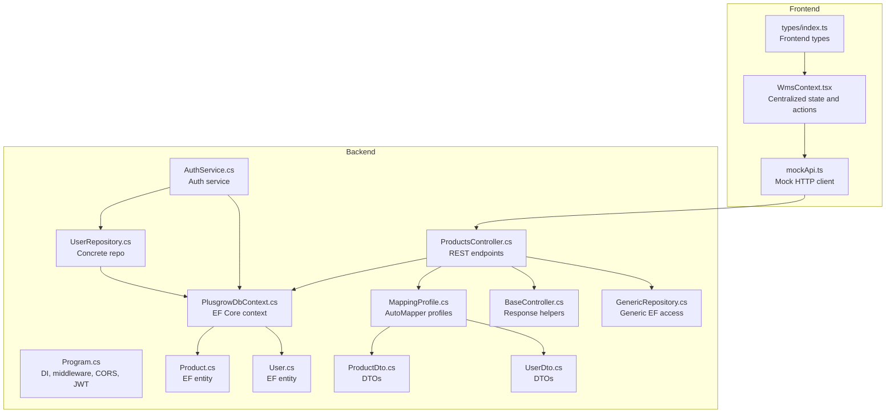
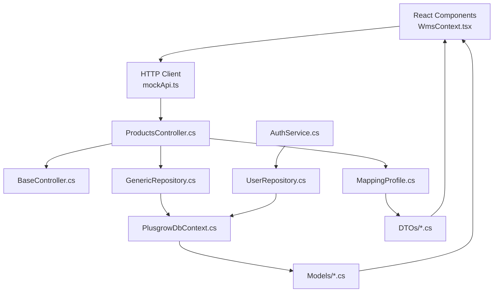
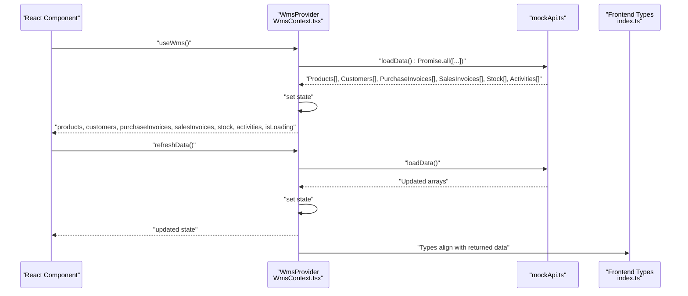
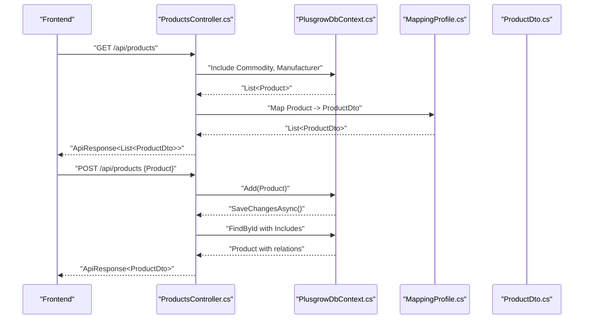
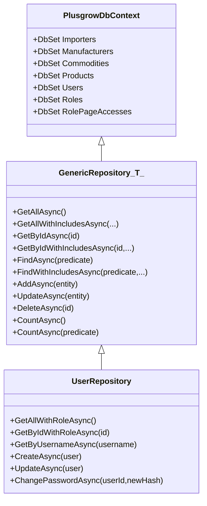
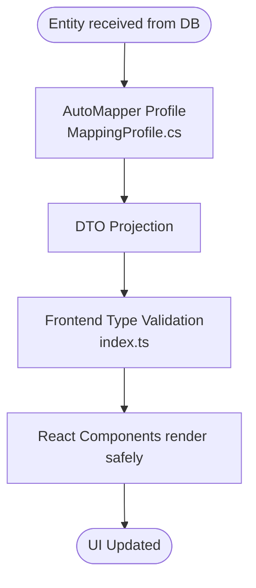
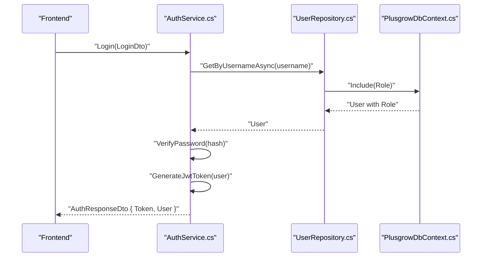
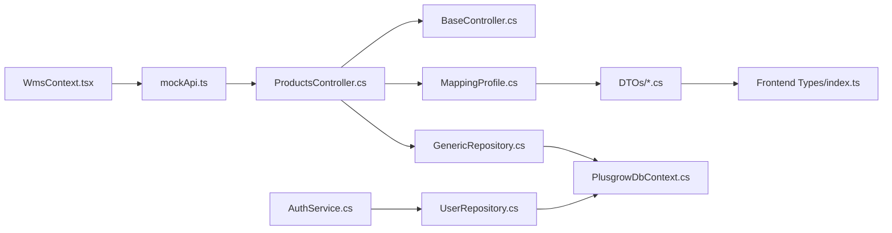

# Data Flow and Integration

<cite>
**Referenced Files in This Document**
- [Program.cs](file://Backend/PlusgrowWms.Api/Program.cs)
- [PlusgrowDbContext.cs](file://Backend/PlusgrowWms.Api/Data/PlusgrowDbContext.cs)
- [MappingProfile.cs](file://Backend/PlusgrowWms.Api/Mappings/MappingProfile.cs)
- [ProductsController.cs](file://Backend/PlusgrowWms.Api/Controllers/ProductsController.cs)
- [BaseController.cs](file://Backend/PlusgrowWms.Api/Controllers/BaseController.cs)
- [GenericRepository.cs](file://Backend/PlusgrowWms.Api/Repositories/GenericRepository.cs)
- [UserRepository.cs](file://Backend/PlusgrowWms.Api/Repositories/UserRepository.cs)
- [AuthService.cs](file://Backend/PlusgrowWms.Api/Services/AuthService.cs)
- [Product.cs](file://Backend/PlusgrowWms.Api/Models/Product.cs)
- [User.cs](file://Backend/PlusgrowWms.Api/Models/User.cs)
- [ProductDto.cs](file://Backend/PlusgrowWms.Api/DTOs/ProductDto.cs)
- [UserDto.cs](file://Backend/PlusgrowWms.Api/DTOs/UserDto.cs)
- [WmsContext.tsx](file://Frontend/src/context/WmsContext.tsx)
- [mockApi.ts](file://Frontend/src/services/mockApi.ts)
- [index.ts](file://Frontend/src/types/index.ts)
</cite>

## Table of Contents
1. [Introduction](#introduction)
2. [Project Structure](#project-structure)
3. [Core Components](#core-components)
4. [Architecture Overview](#architecture-overview)
5. [Detailed Component Analysis](#detailed-component-analysis)
6. [Dependency Analysis](#dependency-analysis)
7. [Performance Considerations](#performance-considerations)
8. [Troubleshooting Guide](#troubleshooting-guide)
9. [Conclusion](#conclusion)

## Introduction
This document explains the data flow patterns and integration mechanisms in PlusGrow WMS. It covers:
- Frontend-backend communication via RESTful APIs and request-response patterns
- Centralized state management through WmsContext and its role in coordinating UI state
- Data transformation pipeline from database entities to DTOs and to frontend components
- Entity Framework Core data access patterns, including LINQ queries, eager loading, and change tracking
- AutoMapper configuration for object-to-object mapping across layers
- Error handling and retry strategies, caching, and offline synchronization patterns
- Real-time update considerations, WebSocket integration possibilities, and data consistency mechanisms

## Project Structure
The solution is split into two primary parts:
- Backend: ASP.NET Core web API with Entity Framework Core, AutoMapper, FluentValidation, and JWT authentication
- Frontend: React application using a custom context provider for centralized state and a mock API layer

**Diagram sources**
- [Program.cs:1-107](file://Backend/PlusgrowWms.Api/Program.cs#L1-L107)
- [PlusgrowDbContext.cs:1-78](file://Backend/PlusgrowWms.Api/Data/PlusgrowDbContext.cs#L1-L78)
- [MappingProfile.cs:1-56](file://Backend/PlusgrowWms.Api/Mappings/MappingProfile.cs#L1-L56)
- [ProductsController.cs:1-117](file://Backend/PlusgrowWms.Api/Controllers/ProductsController.cs#L1-L117)
- [BaseController.cs:1-69](file://Backend/PlusgrowWms.Api/Controllers/BaseController.cs#L1-L69)
- [GenericRepository.cs:1-117](file://Backend/PlusgrowWms.Api/Repositories/GenericRepository.cs#L1-L117)
- [UserRepository.cs:1-68](file://Backend/PlusgrowWms.Api/Repositories/UserRepository.cs#L1-L68)
- [AuthService.cs:1-236](file://Backend/PlusgrowWms.Api/Services/AuthService.cs#L1-L236)
- [Product.cs:1-65](file://Backend/PlusgrowWms.Api/Models/Product.cs#L1-L65)
- [User.cs:1-51](file://Backend/PlusgrowWms.Api/Models/User.cs#L1-L51)
- [ProductDto.cs:1-55](file://Backend/PlusgrowWms.Api/DTOs/ProductDto.cs#L1-L55)
- [UserDto.cs:1-43](file://Backend/PlusgrowWms.Api/DTOs/UserDto.cs#L1-L43)
- [WmsContext.tsx:1-234](file://Frontend/src/context/WmsContext.tsx#L1-L234)
- [mockApi.ts:1-32](file://Frontend/src/services/mockApi.ts#L1-L32)
- [index.ts:1-80](file://Frontend/src/types/index.ts#L1-L80)

**Section sources**
- [Program.cs:1-107](file://Backend/PlusgrowWms.Api/Program.cs#L1-L107)
- [WmsContext.tsx:1-234](file://Frontend/src/context/WmsContext.tsx#L1-L234)

## Core Components
- Centralized state management: WmsContext orchestrates UI state and exposes actions to mutate local state and trigger refreshes.
- Mock API layer: Provides asynchronous data retrieval for frontend components during development.
- RESTful controllers: Expose endpoints for CRUD operations and search, returning standardized responses.
- Data access: Generic repository pattern with Entity Framework Core for consistent persistence operations.
- Object mapping: AutoMapper profiles transform between entities and DTOs.
- Authentication: JWT-based authentication with password hashing and token generation.

**Section sources**
- [WmsContext.tsx:1-234](file://Frontend/src/context/WmsContext.tsx#L1-L234)
- [mockApi.ts:1-32](file://Frontend/src/services/mockApi.ts#L1-L32)
- [ProductsController.cs:1-117](file://Backend/PlusgrowWms.Api/Controllers/ProductsController.cs#L1-L117)
- [GenericRepository.cs:1-117](file://Backend/PlusgrowWms.Api/Repositories/GenericRepository.cs#L1-L117)
- [MappingProfile.cs:1-56](file://Backend/PlusgrowWms.Api/Mappings/MappingProfile.cs#L1-L56)
- [AuthService.cs:1-236](file://Backend/PlusgrowWms.Api/Services/AuthService.cs#L1-L236)

## Architecture Overview
The system follows a layered architecture:
- Presentation Layer (Frontend): React components consume WmsContext and mockApi for data.
- Application Layer (Backend): Controllers expose REST endpoints; BaseController provides response helpers.
- Domain Services (Backend): AuthService encapsulates authentication logic.
- Persistence Layer (Backend): EF Core DbContext manages entities and indexes; repositories abstract data access.
- Mapping Layer (Backend): AutoMapper profiles define entity-to-DTO transformations.

**Diagram sources**
- [WmsContext.tsx:1-234](file://Frontend/src/context/WmsContext.tsx#L1-L234)
- [mockApi.ts:1-32](file://Frontend/src/services/mockApi.ts#L1-L32)
- [ProductsController.cs:1-117](file://Backend/PlusgrowWms.Api/Controllers/ProductsController.cs#L1-L117)
- [BaseController.cs:1-69](file://Backend/PlusgrowWms.Api/Controllers/BaseController.cs#L1-L69)
- [GenericRepository.cs:1-117](file://Backend/PlusgrowWms.Api/Repositories/GenericRepository.cs#L1-L117)
- [PlusgrowDbContext.cs:1-78](file://Backend/PlusgrowWms.Api/Data/PlusgrowDbContext.cs#L1-L78)
- [MappingProfile.cs:1-56](file://Backend/PlusgrowWms.Api/Mappings/MappingProfile.cs#L1-L56)
- [AuthService.cs:1-236](file://Backend/PlusgrowWms.Api/Services/AuthService.cs#L1-L236)
- [UserRepository.cs:1-68](file://Backend/PlusgrowWms.Api/Repositories/UserRepository.cs#L1-L68)

## Detailed Component Analysis

### Frontend: WmsContext and Mock API
WmsContext provides:
- Centralized state for products, customers, purchase/sales invoices, stock, and activities
- Loading state and a refreshData action
- Local-only mutation functions for stock assignment/clearing and invoice lifecycle transitions
- Toast notifications for user feedback

The mock API simulates network latency and returns static datasets for each resource.

**Diagram sources**
- [WmsContext.tsx:1-234](file://Frontend/src/context/WmsContext.tsx#L1-L234)
- [mockApi.ts:1-32](file://Frontend/src/services/mockApi.ts#L1-L32)
- [index.ts:1-80](file://Frontend/src/types/index.ts#L1-L80)

**Section sources**
- [WmsContext.tsx:1-234](file://Frontend/src/context/WmsContext.tsx#L1-L234)
- [mockApi.ts:1-32](file://Frontend/src/services/mockApi.ts#L1-L32)
- [index.ts:1-80](file://Frontend/src/types/index.ts#L1-L80)

### Backend: RESTful API and Request-Response Patterns
ProductsController implements:
- GET /api/products and GET /api/products/{id} with eager loading of related entities
- POST /api/products for creation and subsequent fetch with includes
- PUT /api/products/{id} with concurrency handling
- DELETE /api/products/{id}
- GET /api/products/search?q with filtering

BaseController centralizes response formatting for success, error, not-found, and pagination scenarios.

**Diagram sources**
- [ProductsController.cs:1-117](file://Backend/PlusgrowWms.Api/Controllers/ProductsController.cs#L1-L117)
- [PlusgrowDbContext.cs:1-78](file://Backend/PlusgrowWms.Api/Data/PlusgrowDbContext.cs#L1-L78)
- [MappingProfile.cs:1-56](file://Backend/PlusgrowWms.Api/Mappings/MappingProfile.cs#L1-L56)
- [ProductDto.cs:1-55](file://Backend/PlusgrowWms.Api/DTOs/ProductDto.cs#L1-L55)

**Section sources**
- [ProductsController.cs:1-117](file://Backend/PlusgrowWms.Api/Controllers/ProductsController.cs#L1-L117)
- [BaseController.cs:1-69](file://Backend/PlusgrowWms.Api/Controllers/BaseController.cs#L1-L69)

### Data Access Patterns: EF Core, LINQ, Eager Loading, Change Tracking
- DbContext defines DbSet properties and applies snake_case naming and unique/performance indexes.
- Controllers use Include(...) to eagerly load related entities (e.g., Commodity, Manufacturer).
- GenericRepository provides reusable async operations: GetAll, GetById, Find, Add, Update, Delete, Count, with support for includes.
- UserRepository extends GenericRepository to add role-aware queries and password updates.
- Change tracking occurs via EF Core’s context; SaveChangesAsync persists tracked changes.

**Diagram sources**
- [PlusgrowDbContext.cs:1-78](file://Backend/PlusgrowWms.Api/Data/PlusgrowDbContext.cs#L1-L78)
- [GenericRepository.cs:1-117](file://Backend/PlusgrowWms.Api/Repositories/GenericRepository.cs#L1-L117)
- [UserRepository.cs:1-68](file://Backend/PlusgrowWms.Api/Repositories/UserRepository.cs#L1-L68)

**Section sources**
- [PlusgrowDbContext.cs:1-78](file://Backend/PlusgrowWms.Api/Data/PlusgrowDbContext.cs#L1-L78)
- [GenericRepository.cs:1-117](file://Backend/PlusgrowWms.Api/Repositories/GenericRepository.cs#L1-L117)
- [UserRepository.cs:1-68](file://Backend/PlusgrowWms.Api/Repositories/UserRepository.cs#L1-L68)

### Data Transformation Pipeline: Entities → DTOs → Frontend Components
AutoMapper profiles define mappings:
- Product: maps Commodity and Manufacturer navigation properties to DTO fields
- User: maps Role navigation to RoleName; ignores derived fields during create/update
- Other entities follow similar patterns

Frontend types align with DTO shapes for safe rendering and state updates.

**Diagram sources**
- [MappingProfile.cs:1-56](file://Backend/PlusgrowWms.Api/Mappings/MappingProfile.cs#L1-L56)
- [ProductDto.cs:1-55](file://Backend/PlusgrowWms.Api/DTOs/ProductDto.cs#L1-L55)
- [UserDto.cs:1-43](file://Backend/PlusgrowWms.Api/DTOs/UserDto.cs#L1-L43)
- [index.ts:1-80](file://Frontend/src/types/index.ts#L1-L80)

**Section sources**
- [MappingProfile.cs:1-56](file://Backend/PlusgrowWms.Api/Mappings/MappingProfile.cs#L1-L56)
- [ProductDto.cs:1-55](file://Backend/PlusgrowWms.Api/DTOs/ProductDto.cs#L1-L55)
- [UserDto.cs:1-43](file://Backend/PlusgrowWms.Api/DTOs/UserDto.cs#L1-L43)
- [index.ts:1-80](file://Frontend/src/types/index.ts#L1-L80)

### Authentication and Authorization
AuthService handles:
- Login: validates credentials, checks activity, updates last login, generates JWT
- Registration: checks uniqueness, hashes password, persists user
- Token refresh: regenerates JWT for active users
- Password change: hashes and persists new password

JWT configuration is registered in Program.cs with issuer, audience, and signing key.

**Diagram sources**
- [AuthService.cs:1-236](file://Backend/PlusgrowWms.Api/Services/AuthService.cs#L1-L236)
- [UserRepository.cs:1-68](file://Backend/PlusgrowWms.Api/Repositories/UserRepository.cs#L1-L68)
- [PlusgrowDbContext.cs:1-78](file://Backend/PlusgrowWms.Api/Data/PlusgrowDbContext.cs#L1-L78)
- [Program.cs:44-62](file://Backend/PlusgrowWms.Api/Program.cs#L44-L62)

**Section sources**
- [AuthService.cs:1-236](file://Backend/PlusgrowWms.Api/Services/AuthService.cs#L1-L236)
- [UserRepository.cs:1-68](file://Backend/PlusgrowWms.Api/Repositories/UserRepository.cs#L1-L68)
- [Program.cs:44-62](file://Backend/PlusgrowWms.Api/Program.cs#L44-L62)

## Dependency Analysis
- Frontend depends on WmsContext for state and mockApi for data.
- Backend controllers depend on DbContext, AutoMapper, and BaseController helpers.
- Repositories encapsulate EF Core operations and are injected via DI.
- AuthService depends on IUserRepository and configuration for JWT.

**Diagram sources**
- [WmsContext.tsx:1-234](file://Frontend/src/context/WmsContext.tsx#L1-L234)
- [mockApi.ts:1-32](file://Frontend/src/services/mockApi.ts#L1-L32)
- [ProductsController.cs:1-117](file://Backend/PlusgrowWms.Api/Controllers/ProductsController.cs#L1-L117)
- [BaseController.cs:1-69](file://Backend/PlusgrowWms.Api/Controllers/BaseController.cs#L1-L69)
- [GenericRepository.cs:1-117](file://Backend/PlusgrowWms.Api/Repositories/GenericRepository.cs#L1-L117)
- [PlusgrowDbContext.cs:1-78](file://Backend/PlusgrowWms.Api/Data/PlusgrowDbContext.cs#L1-L78)
- [AuthService.cs:1-236](file://Backend/PlusgrowWms.Api/Services/AuthService.cs#L1-L236)
- [UserRepository.cs:1-68](file://Backend/PlusgrowWms.Api/Repositories/UserRepository.cs#L1-L68)
- [MappingProfile.cs:1-56](file://Backend/PlusgrowWms.Api/Mappings/MappingProfile.cs#L1-L56)
- [index.ts:1-80](file://Frontend/src/types/index.ts#L1-L80)

**Section sources**
- [Program.cs:25-42](file://Backend/PlusgrowWms.Api/Program.cs#L25-L42)
- [WmsContext.tsx:1-234](file://Frontend/src/context/WmsContext.tsx#L1-L234)

## Performance Considerations
- Indexes: Unique and composite indexes are defined in the DbContext to optimize lookups for entities like Product, User, Role, and Importer.
- Eager loading: Controllers use Include(...) to avoid N+1 queries for related entities.
- GenericRepository: Supports include expressions to tailor projections per endpoint needs.
- DTO mapping: AutoMapper reduces payload sizes and avoids exposing internal entity graph details.
- Frontend: Parallel loading of resources improves perceived performance; consider adding optimistic updates and local caching strategies.

[No sources needed since this section provides general guidance]

## Troubleshooting Guide
- Authentication failures: Check JWT issuer/audience/key configuration and ensure the client sends Authorization headers.
- Concurrency conflicts: ProductsController wraps updates in try/catch for DbUpdateConcurrencyException and returns NotFound when missing.
- Not found resources: Controllers return NotFound via BaseController helpers.
- Logging: Serilog request logging is enabled; review logs for detailed error traces.
- CORS: Ensure frontend origin matches the configured AllowFrontend policy.

**Section sources**
- [Program.cs:44-62](file://Backend/PlusgrowWms.Api/Program.cs#L44-L62)
- [ProductsController.cs:68-77](file://Backend/PlusgrowWms.Api/Controllers/ProductsController.cs#L68-L77)
- [BaseController.cs:32-43](file://Backend/PlusgrowWms.Api/Controllers/BaseController.cs#L32-L43)
- [Program.cs:94](file://Backend/PlusgrowWms.Api/Program.cs#L94)

## Conclusion
PlusGrow WMS employs a clean separation of concerns with a reactive frontend state managed by WmsContext and a robust backend REST API. Data flows consistently from database entities through AutoMapper-mapped DTOs to frontend components. EF Core ensures efficient queries with eager loading and indexing, while BaseController and DTOs standardize responses. Authentication is secured with JWT and password hashing. For production readiness, consider implementing retry policies, caching layers, offline synchronization strategies, and WebSocket-based real-time updates to complement the current request-response model.