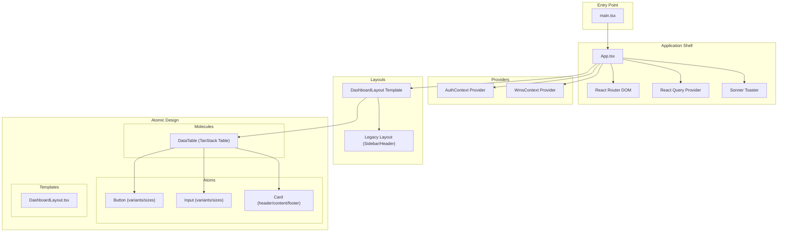
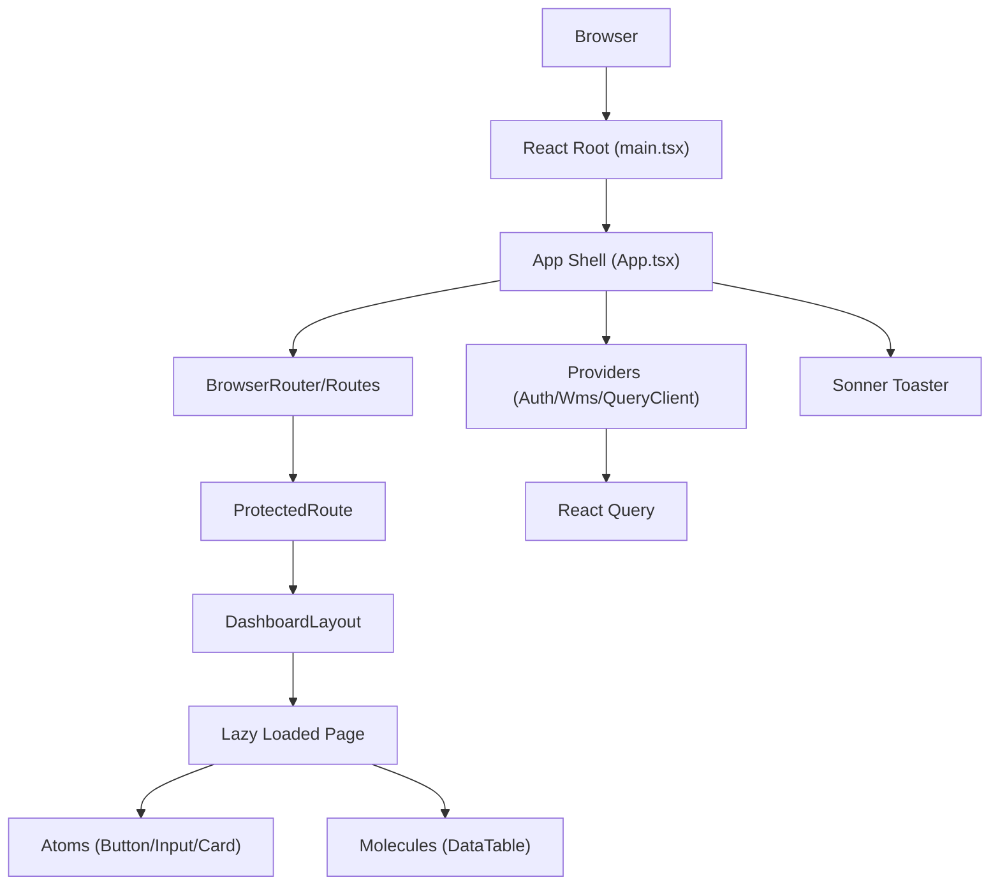
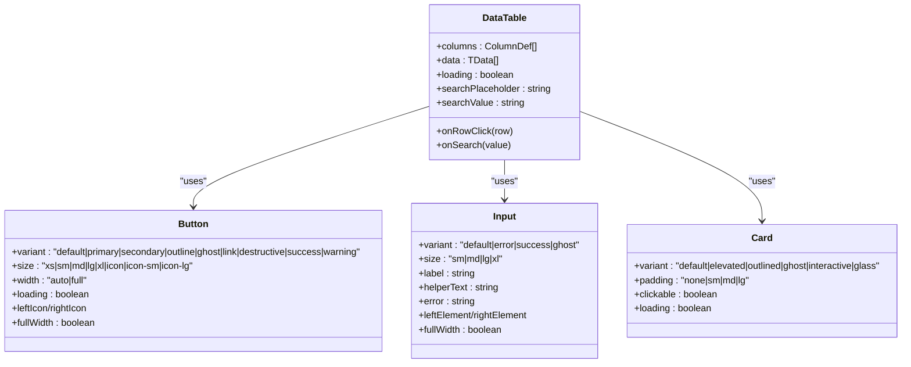
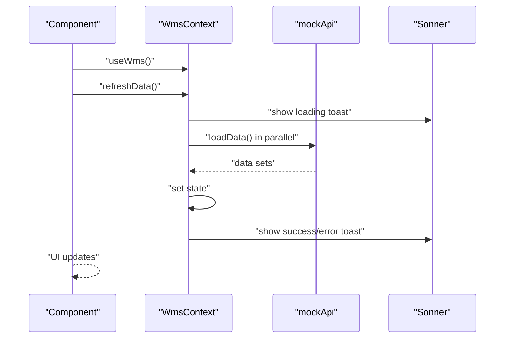
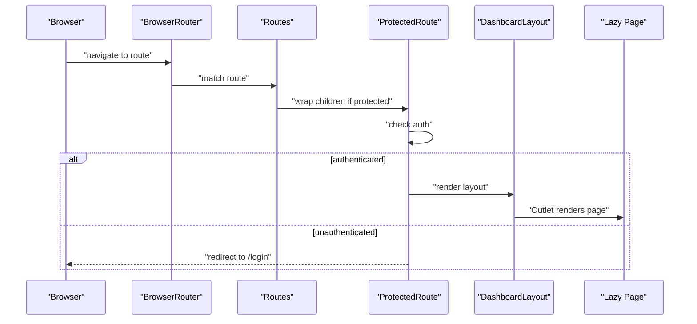
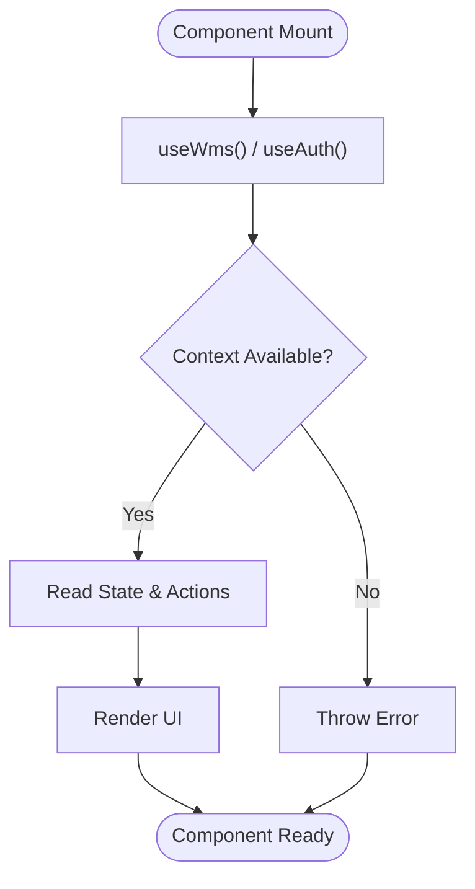
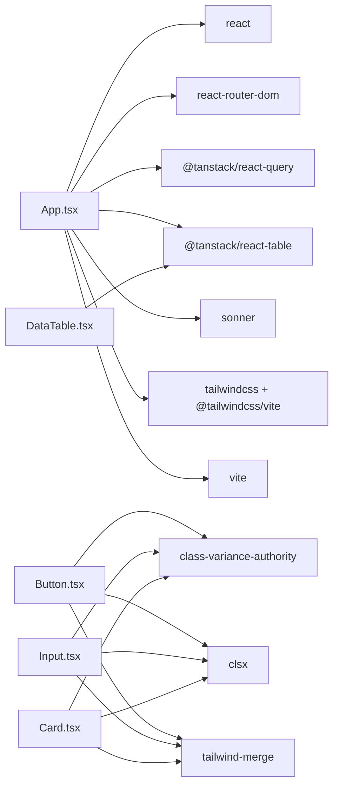

# Frontend Architecture

<cite>
**Referenced Files in This Document**
- [main.tsx](file://Frontend/src/main.tsx)
- [App.tsx](file://Frontend/src/App.tsx)
- [WmsContext.tsx](file://Frontend/src/context/WmsContext.tsx)
- [vite.config.ts](file://Frontend/vite.config.ts)
- [package.json](file://Frontend/package.json)
- [Layout.tsx](file://Frontend/src/components/layout/Layout.tsx)
- [DashboardLayout.tsx](file://Frontend/src/components/templates/DashboardLayout/DashboardLayout.tsx)
- [Button.tsx](file://Frontend/src/components/atoms/Button/Button.tsx)
- [Input.tsx](file://Frontend/src/components/atoms/Input/Input.tsx)
- [Card.tsx](file://Frontend/src/components/atoms/Card/Card.tsx)
- [DataTable.tsx](file://Frontend/src/components/molecules/DataTable/DataTable.tsx)
- [tokens.css](file://Frontend/src/styles/tokens.css)
- [index.css](file://Frontend/src/index.css)
</cite>

## Table of Contents
1. [Introduction](#introduction)
2. [Project Structure](#project-structure)
3. [Core Components](#core-components)
4. [Architecture Overview](#architecture-overview)
5. [Detailed Component Analysis](#detailed-component-analysis)
6. [Dependency Analysis](#dependency-analysis)
7. [Performance Considerations](#performance-considerations)
8. [Troubleshooting Guide](#troubleshooting-guide)
9. [Conclusion](#conclusion)
10. [Appendices](#appendices)

## Introduction
This document describes the frontend architecture of the PlusGrow WMS React application. It focuses on the atomic design system (atoms, molecules, organisms, and templates), centralized state management via React Context API, routing and navigation patterns, build configuration with Vite and TypeScript, styling architecture with Tailwind CSS and design tokens, and performance optimization strategies including code splitting and component reusability.

## Project Structure
The frontend is organized around a clear component taxonomy and a layered architecture:
- Entry point initializes the React root and mounts the application shell.
- Application shell configures routing, providers, and UI notifications.
- Atomic design components are grouped under atoms, molecules, organisms, and templates.
- Templates wrap pages with consistent layouts and navigation.
- Providers manage global state and authentication.
- Build tooling integrates Vite, React plugin, Tailwind CSS, and TypeScript.

**Diagram sources**
- [main.tsx:1-11](file://Frontend/src/main.tsx#L1-L11)
- [App.tsx:65-171](file://Frontend/src/App.tsx#L65-L171)
- [DashboardLayout.tsx:28-122](file://Frontend/src/components/templates/DashboardLayout/DashboardLayout.tsx#L28-L122)
- [Layout.tsx:45-165](file://Frontend/src/components/layout/Layout.tsx#L45-L165)
- [Button.tsx:10-46](file://Frontend/src/components/atoms/Button/Button.tsx#L10-L46)
- [Input.tsx:10-32](file://Frontend/src/components/atoms/Input/Input.tsx#L10-L32)
- [Card.tsx:10-35](file://Frontend/src/components/atoms/Card/Card.tsx#L10-L35)
- [DataTable.tsx:28-36](file://Frontend/src/components/molecules/DataTable/DataTable.tsx#L28-L36)

**Section sources**
- [main.tsx:1-11](file://Frontend/src/main.tsx#L1-L11)
- [App.tsx:65-171](file://Frontend/src/App.tsx#L65-L171)

## Core Components
- Entry point: Initializes the React root and mounts the App component.
- Application shell: Configures routing, providers, lazy-loaded pages, protected routes, and UI notifications.
- Centralized state: WmsContext manages warehouse data and actions, exposing a small API surface for stock updates, invoice lifecycle, and activity logging.
- Layouts: DashboardLayout composes Sidebar, Header, Breadcrumbs, and page content; legacy Layout provides a slim sidebar and header.
- Atomic design: Atoms (Button, Input, Card) provide reusable UI primitives with variants and sizes; molecules (DataTable) compose atoms into functional components.

Key implementation references:
- [main.tsx:1-11](file://Frontend/src/main.tsx#L1-L11)
- [App.tsx:65-171](file://Frontend/src/App.tsx#L65-L171)
- [WmsContext.tsx:28-234](file://Frontend/src/context/WmsContext.tsx#L28-L234)
- [DashboardLayout.tsx:28-122](file://Frontend/src/components/templates/DashboardLayout/DashboardLayout.tsx#L28-L122)
- [Layout.tsx:45-165](file://Frontend/src/components/layout/Layout.tsx#L45-L165)
- [Button.tsx:10-46](file://Frontend/src/components/atoms/Button/Button.tsx#L10-L46)
- [Input.tsx:10-32](file://Frontend/src/components/atoms/Input/Input.tsx#L10-L32)
- [Card.tsx:10-35](file://Frontend/src/components/atoms/Card/Card.tsx#L10-L35)
- [DataTable.tsx:28-36](file://Frontend/src/components/molecules/DataTable/DataTable.tsx#L28-L36)

**Section sources**
- [main.tsx:1-11](file://Frontend/src/main.tsx#L1-L11)
- [App.tsx:65-171](file://Frontend/src/App.tsx#L65-L171)
- [WmsContext.tsx:28-234](file://Frontend/src/context/WmsContext.tsx#L28-L234)
- [DashboardLayout.tsx:28-122](file://Frontend/src/components/templates/DashboardLayout/DashboardLayout.tsx#L28-L122)
- [Layout.tsx:45-165](file://Frontend/src/components/layout/Layout.tsx#L45-L165)
- [Button.tsx:10-46](file://Frontend/src/components/atoms/Button/Button.tsx#L10-L46)
- [Input.tsx:10-32](file://Frontend/src/components/atoms/Input/Input.tsx#L10-L32)
- [Card.tsx:10-35](file://Frontend/src/components/atoms/Card/Card.tsx#L10-L35)
- [DataTable.tsx:28-36](file://Frontend/src/components/molecules/DataTable/DataTable.tsx#L28-L36)

## Architecture Overview
The application follows a layered architecture:
- Presentation layer: Pages and templates render UI and orchestrate component composition.
- Component layer: Atomic design components encapsulate styling and behavior.
- State layer: WmsContext centralizes warehouse data and actions; AuthContext handles authentication state.
- Routing layer: React Router DOM manages public and protected routes with lazy loading and Suspense fallbacks.
- Data layer: React Query manages caching and background refetching; mock APIs supply data.

**Diagram sources**
- [main.tsx:1-11](file://Frontend/src/main.tsx#L1-L11)
- [App.tsx:65-171](file://Frontend/src/App.tsx#L65-L171)
- [DashboardLayout.tsx:28-122](file://Frontend/src/components/templates/DashboardLayout/DashboardLayout.tsx#L28-L122)
- [Button.tsx:10-46](file://Frontend/src/components/atoms/Button/Button.tsx#L10-L46)
- [Input.tsx:10-32](file://Frontend/src/components/atoms/Input/Input.tsx#L10-L32)
- [Card.tsx:10-35](file://Frontend/src/components/atoms/Card/Card.tsx#L10-L35)
- [DataTable.tsx:28-36](file://Frontend/src/components/molecules/DataTable/DataTable.tsx#L28-L36)

## Detailed Component Analysis

### Atomic Design System
The atomic design system organizes UI into reusable building blocks:
- Atoms: Button, Input, Card expose variants and sizes via class variance authority and shared utility functions.
- Molecules: DataTable composes TanStack React Table with search, sorting, pagination, and animations.
- Organisms: Navigation components (Sidebar, Header, Breadcrumbs) are composed within templates.
- Templates: DashboardLayout provides a consistent layout for pages.

**Diagram sources**
- [Button.tsx:48-65](file://Frontend/src/components/atoms/Button/Button.tsx#L48-L65)
- [Input.tsx:34-51](file://Frontend/src/components/atoms/Input/Input.tsx#L34-L51)
- [Card.tsx:37-44](file://Frontend/src/components/atoms/Card/Card.tsx#L37-L44)
- [DataTable.tsx:28-36](file://Frontend/src/components/molecules/DataTable/DataTable.tsx#L28-L36)

**Section sources**
- [Button.tsx:10-46](file://Frontend/src/components/atoms/Button/Button.tsx#L10-L46)
- [Button.tsx:90-139](file://Frontend/src/components/atoms/Button/Button.tsx#L90-L139)
- [Input.tsx:10-32](file://Frontend/src/components/atoms/Input/Input.tsx#L10-L32)
- [Input.tsx:53-129](file://Frontend/src/components/atoms/Input/Input.tsx#L53-L129)
- [Card.tsx:10-35](file://Frontend/src/components/atoms/Card/Card.tsx#L10-L35)
- [Card.tsx:46-67](file://Frontend/src/components/atoms/Card/Card.tsx#L46-L67)
- [DataTable.tsx:28-36](file://Frontend/src/components/molecules/DataTable/DataTable.tsx#L28-L36)
- [DataTable.tsx:38-235](file://Frontend/src/components/molecules/DataTable/DataTable.tsx#L38-L235)

### Centralized State Management with WmsContext
WmsContext provides a single source of truth for warehouse data and actions:
- State: Products, customers, purchase/sales invoices, stock, activities, and loading state.
- Actions: Refresh data, update stock, add/update invoices, add customer/product, assign/clear bins, and log activities.
- Composition: Exposed via a provider wrapper and consumed with a typed hook.

**Diagram sources**
- [WmsContext.tsx:28-234](file://Frontend/src/context/WmsContext.tsx#L28-L234)

**Section sources**
- [WmsContext.tsx:6-24](file://Frontend/src/context/WmsContext.tsx#L6-L24)
- [WmsContext.tsx:28-71](file://Frontend/src/context/WmsContext.tsx#L28-L71)
- [WmsContext.tsx:83-118](file://Frontend/src/context/WmsContext.tsx#L83-L118)
- [WmsContext.tsx:120-148](file://Frontend/src/context/WmsContext.tsx#L120-L148)
- [WmsContext.tsx:160-214](file://Frontend/src/context/WmsContext.tsx#L160-L214)

### Routing, Navigation, and Page Layouts
- Routing: React Router DOM defines public and protected routes; pages are lazy loaded with Suspense fallbacks.
- Navigation: Legacy Layout provides a sidebar and header; DashboardLayout composes Sidebar, Header, Breadcrumbs, and page content.
- Protected routes: A wrapper checks authentication and redirects unauthenticated users to login.

**Diagram sources**
- [App.tsx:34-53](file://Frontend/src/App.tsx#L34-L53)
- [App.tsx:72-165](file://Frontend/src/App.tsx#L72-L165)
- [DashboardLayout.tsx:28-122](file://Frontend/src/components/templates/DashboardLayout/DashboardLayout.tsx#L28-L122)
- [Layout.tsx:45-165](file://Frontend/src/components/layout/Layout.tsx#L45-L165)

**Section sources**
- [App.tsx:15-31](file://Frontend/src/App.tsx#L15-L31)
- [App.tsx:34-53](file://Frontend/src/App.tsx#L34-L53)
- [App.tsx:72-165](file://Frontend/src/App.tsx#L72-L165)
- [DashboardLayout.tsx:28-122](file://Frontend/src/components/templates/DashboardLayout/DashboardLayout.tsx#L28-L122)
- [Layout.tsx:23-43](file://Frontend/src/components/layout/Layout.tsx#L23-L43)

### Component Composition Patterns and Prop Drilling Prevention
- Provider pattern: WmsProvider and Auth providers eliminate prop drilling by placing state higher in the tree.
- Hook-based consumption: Components consume context via typed hooks, avoiding deep prop passing.
- Template composition: DashboardLayout composes navigation and content areas, reducing duplication across pages.

**Diagram sources**
- [WmsContext.tsx:227-233](file://Frontend/src/context/WmsContext.tsx#L227-L233)
- [DashboardLayout.tsx:37-38](file://Frontend/src/components/templates/DashboardLayout/DashboardLayout.tsx#L37-L38)

**Section sources**
- [WmsContext.tsx:227-233](file://Frontend/src/context/WmsContext.tsx#L227-L233)
- [DashboardLayout.tsx:37-38](file://Frontend/src/components/templates/DashboardLayout/DashboardLayout.tsx#L37-L38)

## Dependency Analysis
External libraries and their roles:
- React and React Router DOM: UI framework and routing.
- React Query: Data fetching, caching, and background refetching.
- TanStack Table: Advanced data table with sorting, filtering, and pagination.
- Sonner: Declarative toast notifications.
- Tailwind CSS and related utilities: Utility-first styling and design tokens.
- Vite: Build tool with React plugin and Tailwind integration.

**Diagram sources**
- [package.json:13-44](file://Frontend/package.json#L13-L44)
- [Button.tsx:7-8](file://Frontend/src/components/atoms/Button/Button.tsx#L7-L8)
- [Input.tsx:7-8](file://Frontend/src/components/atoms/Input/Input.tsx#L7-L8)
- [Card.tsx:7-8](file://Frontend/src/components/atoms/Card/Card.tsx#L7-L8)
- [DataTable.tsx:12-26](file://Frontend/src/components/molecules/DataTable/DataTable.tsx#L12-L26)

**Section sources**
- [package.json:13-44](file://Frontend/package.json#L13-L44)

## Performance Considerations
- Code splitting: Pages are lazy loaded to reduce initial bundle size.
- Suspense fallbacks: PageLoader provides immediate feedback while chunks load.
- React Query caching: Centralized caching with configurable stale times reduces redundant network requests.
- Component memoization: DataTable uses memoized columns/data to avoid unnecessary re-renders.
- Optimized builds: Vite provides fast dev server and optimized production builds.

Recommendations:
- Keep lazy boundaries per major feature/page.
- Use React.useMemo and React.useCallback for heavy computations.
- Prefer CSS transitions over JavaScript animations where possible.
- Monitor bundle size and split vendor libraries if needed.

**Section sources**
- [App.tsx:15-31](file://Frontend/src/App.tsx#L15-L31)
- [App.tsx:74-165](file://Frontend/src/App.tsx#L74-L165)
- [App.tsx:56-63](file://Frontend/src/App.tsx#L56-L63)
- [DataTable.tsx:54-55](file://Frontend/src/components/molecules/DataTable/DataTable.tsx#L54-L55)

## Troubleshooting Guide
Common issues and remedies:
- Context not wrapped: Ensure WmsProvider and Auth providers wrap the application root.
- Protected route failures: Verify authentication state and redirect logic.
- Toast errors: Confirm Sonner is initialized and toasts are visible.
- Styling inconsistencies: Validate Tailwind configuration and design tokens are applied.

**Section sources**
- [WmsContext.tsx:227-233](file://Frontend/src/context/WmsContext.tsx#L227-L233)
- [App.tsx:34-53](file://Frontend/src/App.tsx#L34-L53)
- [App.tsx:71-71](file://Frontend/src/App.tsx#L71-L71)

## Conclusion
The PlusGrow WMS frontend leverages a robust atomic design system, centralized state management, and modern tooling to deliver a scalable and maintainable React application. The combination of lazy loading, React Query, and Tailwind CSS enables efficient development and optimal runtime performance.

## Appendices

### Build Configuration and Development Workflow
- Vite configuration integrates React and Tailwind CSS, resolves aliases, and exposes environment variables.
- Scripts support development, build, preview, and linting.
- TypeScript integration ensures type safety across components and contexts.

**Section sources**
- [vite.config.ts:1-25](file://Frontend/vite.config.ts#L1-L25)
- [package.json:6-11](file://Frontend/package.json#L6-L11)

### Styling Architecture and Design Tokens
- Tailwind CSS provides utility classes and responsive breakpoints.
- Design tokens are exposed via a tokens stylesheet for consistent spacing, colors, and typography.
- Atomic components use class variance authority and shared utility functions for consistent styling.

**Section sources**
- [vite.config.ts:1-9](file://Frontend/vite.config.ts#L1-L9)
- [tokens.css](file://Frontend/src/styles/tokens.css)
- [index.css](file://Frontend/src/index.css)