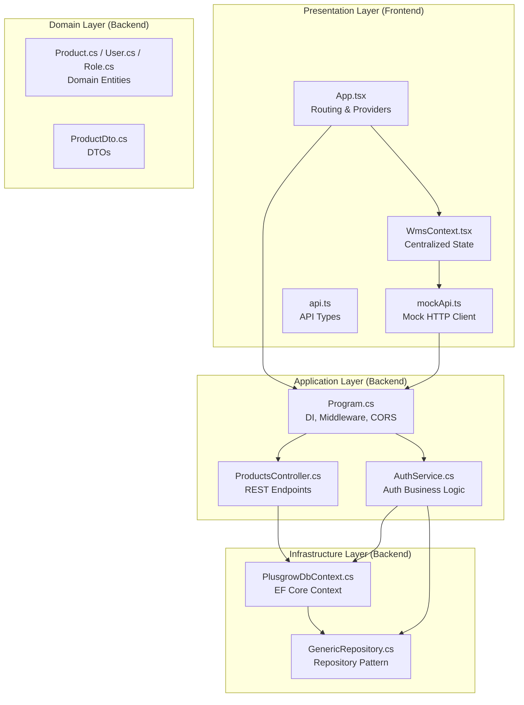
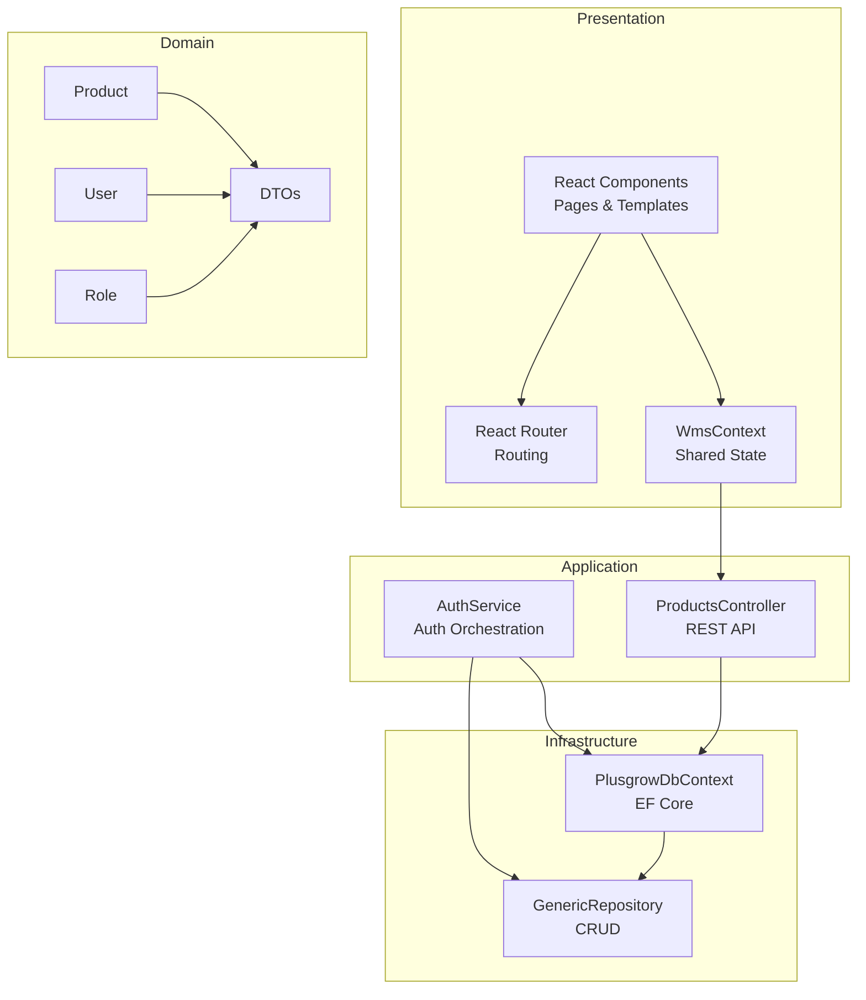
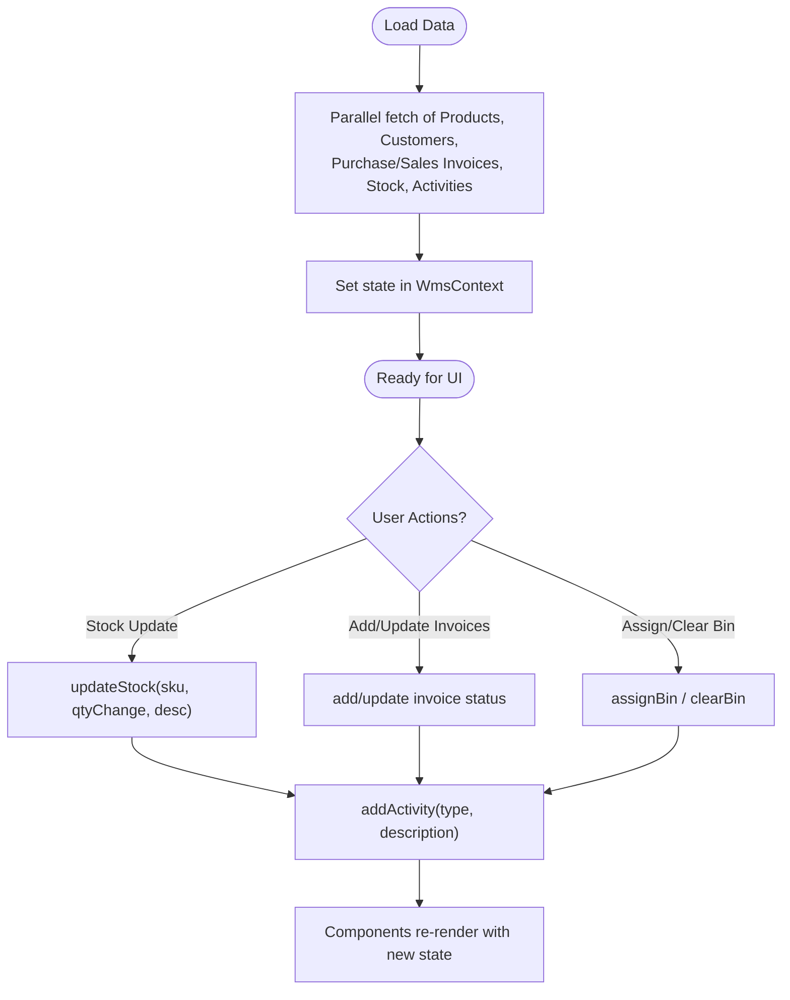
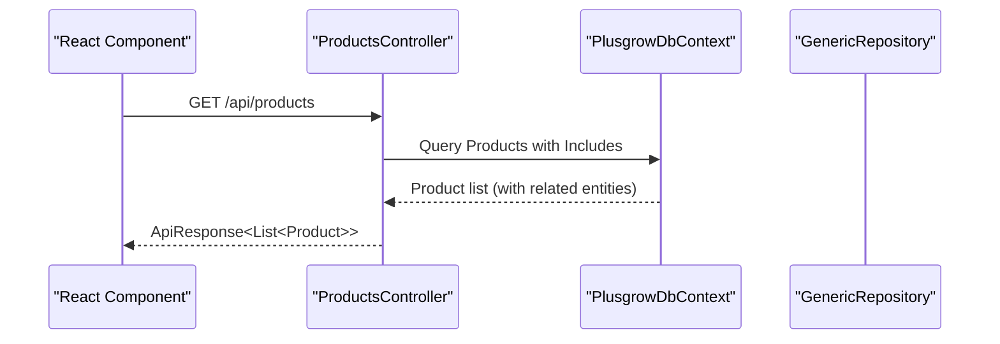
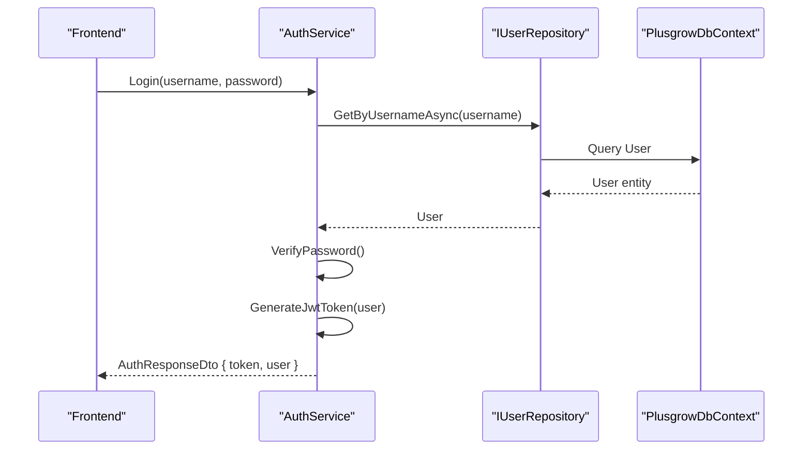
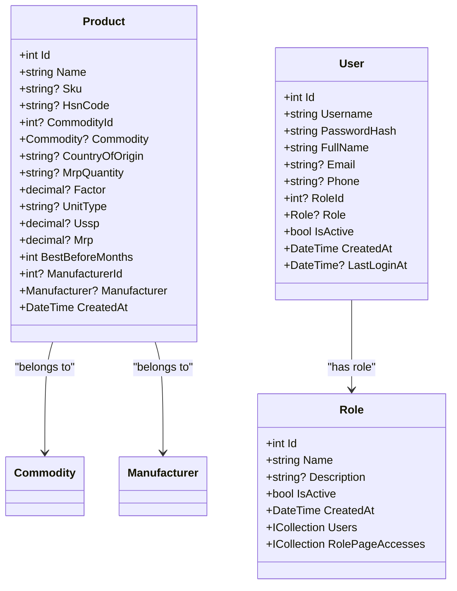
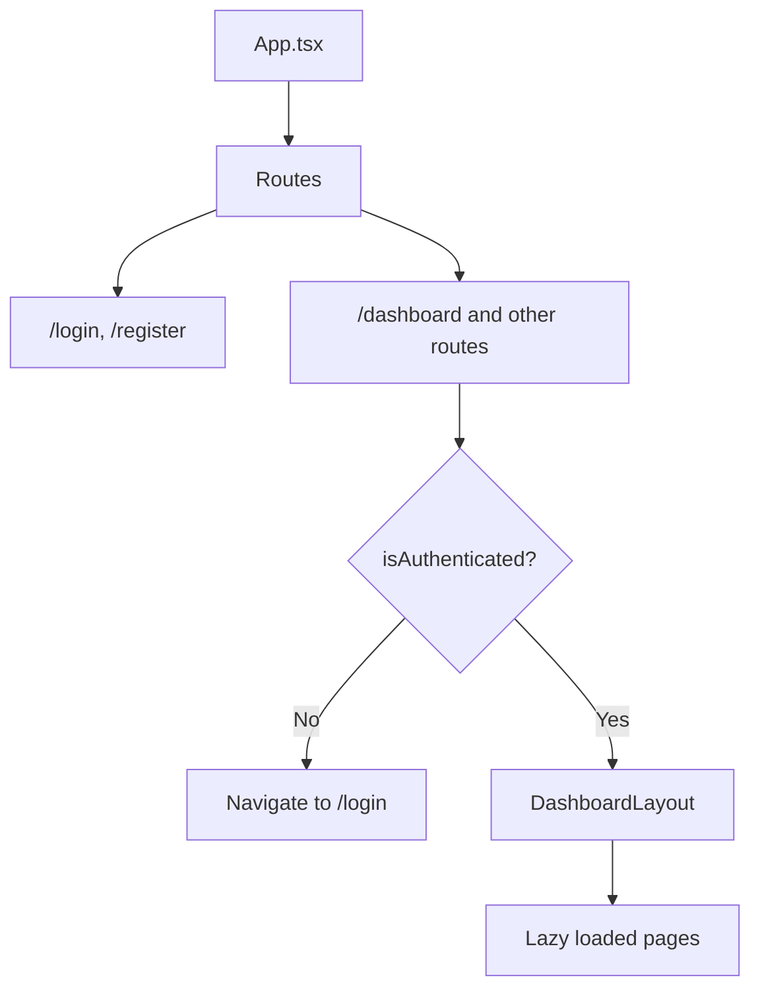
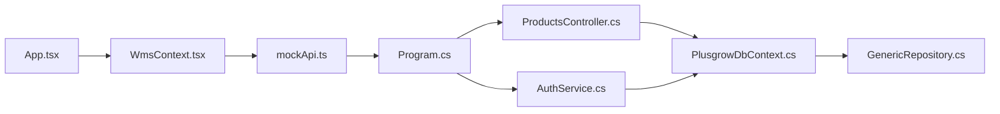

# System Design

<cite>
**Referenced Files in This Document**
- [Program.cs](file://Backend/PlusgrowWms.Api/Program.cs)
- [PlusgrowDbContext.cs](file://Backend/PlusgrowWms.Api/Data/PlusgrowDbContext.cs)
- [GenericRepository.cs](file://Backend/PlusgrowWms.Api/Repositories/GenericRepository.cs)
- [ProductsController.cs](file://Backend/PlusgrowWms.Api/Controllers/ProductsController.cs)
- [AuthService.cs](file://Backend/PlusgrowWms.Api/Services/AuthService.cs)
- [Product.cs](file://Backend/PlusgrowWms.Api/Models/Product.cs)
- [User.cs](file://Backend/PlusgrowWms.Api/Models/User.cs)
- [Role.cs](file://Backend/PlusgrowWms.Api/Models/Role.cs)
- [ProductDto.cs](file://Backend/PlusgrowWms.Api/DTOs/ProductDto.cs)
- [App.tsx](file://Frontend/src/App.tsx)
- [WmsContext.tsx](file://Frontend/src/context/WmsContext.tsx)
- [mockApi.ts](file://Frontend/src/services/mockApi.ts)
- [api.ts](file://Frontend/src/types/api.ts)
</cite>

## Table of Contents
1. [Introduction](#introduction)
2. [Project Structure](#project-structure)
3. [Core Components](#core-components)
4. [Architecture Overview](#architecture-overview)
5. [Detailed Component Analysis](#detailed-component-analysis)
6. [Dependency Analysis](#dependency-analysis)
7. [Performance Considerations](#performance-considerations)
8. [Troubleshooting Guide](#troubleshooting-guide)
9. [Conclusion](#conclusion)

## Introduction
This document describes the system design of PlusGrow WMS following clean architecture principles with four distinct layers: Presentation, Application, Domain, and Infrastructure. It explains how the React frontend communicates with the ASP.NET Core backend via RESTful APIs, documents centralized state management using WmsContext for cross-component data sharing, details the database design with Entity Framework Core and the repository pattern, and outlines system boundaries, component responsibilities, and data flow patterns. It also addresses scalability, performance optimization, and fault tolerance considerations.

## Project Structure
The solution is organized into two primary projects:
- Backend: ASP.NET Core web API implementing clean architecture layers and EF Core persistence.
- Frontend: React application with TypeScript, routing, lazy loading, and centralized state management.

**Diagram sources**
- [Program.cs:1-107](file://Backend/PlusgrowWms.Api/Program.cs#L1-L107)
- [PlusgrowDbContext.cs:1-78](file://Backend/PlusgrowWms.Api/Data/PlusgrowDbContext.cs#L1-L78)
- [GenericRepository.cs:1-117](file://Backend/PlusgrowWms.Api/Repositories/GenericRepository.cs#L1-L117)
- [ProductsController.cs:1-117](file://Backend/PlusgrowWms.Api/Controllers/ProductsController.cs#L1-L117)
- [AuthService.cs:1-236](file://Backend/PlusgrowWms.Api/Services/AuthService.cs#L1-L236)
- [Product.cs:1-65](file://Backend/PlusgrowWms.Api/Models/Product.cs#L1-L65)
- [User.cs:1-51](file://Backend/PlusgrowWms.Api/Models/User.cs#L1-L51)
- [Role.cs:1-31](file://Backend/PlusgrowWms.Api/Models/Role.cs#L1-L31)
- [ProductDto.cs:1-55](file://Backend/PlusgrowWms.Api/DTOs/ProductDto.cs#L1-L55)
- [App.tsx:1-172](file://Frontend/src/App.tsx#L1-L172)
- [WmsContext.tsx:1-234](file://Frontend/src/context/WmsContext.tsx#L1-L234)
- [mockApi.ts:1-32](file://Frontend/src/services/mockApi.ts#L1-L32)
- [api.ts:1-206](file://Frontend/src/types/api.ts#L1-L206)

**Section sources**
- [Program.cs:1-107](file://Backend/PlusgrowWms.Api/Program.cs#L1-L107)
- [App.tsx:1-172](file://Frontend/src/App.tsx#L1-L172)

## Core Components
- Presentation (Frontend):
  - Routing and navigation with React Router.
  - Centralized state via WmsContext for shared data across components.
  - Mock HTTP client for local development and testing.
  - Type-safe API response and request DTOs.

- Application (Backend):
  - Dependency injection and middleware registration.
  - Authentication service with JWT generation and password hashing.
  - REST controllers exposing CRUD and search endpoints.

- Domain (Backend):
  - Strongly typed domain entities (Product, User, Role) with EF Core attributes.
  - DTOs for request/response transfer.

- Infrastructure (Backend):
  - EF Core DbContext with snake_case table naming and unique/performance indexes.
  - Generic repository implementing common CRUD operations.

**Section sources**
- [WmsContext.tsx:1-234](file://Frontend/src/context/WmsContext.tsx#L1-L234)
- [mockApi.ts:1-32](file://Frontend/src/services/mockApi.ts#L1-L32)
- [Program.cs:1-107](file://Backend/PlusgrowWms.Api/Program.cs#L1-L107)
- [AuthService.cs:1-236](file://Backend/PlusgrowWms.Api/Services/AuthService.cs#L1-L236)
- [PlusgrowDbContext.cs:1-78](file://Backend/PlusgrowWms.Api/Data/PlusgrowDbContext.cs#L1-L78)
- [GenericRepository.cs:1-117](file://Backend/PlusgrowWms.Api/Repositories/GenericRepository.cs#L1-L117)
- [Product.cs:1-65](file://Backend/PlusgrowWms.Api/Models/Product.cs#L1-L65)
- [User.cs:1-51](file://Backend/PlusgrowWms.Api/Models/User.cs#L1-L51)
- [Role.cs:1-31](file://Backend/PlusgrowWms.Api/Models/Role.cs#L1-L31)
- [ProductDto.cs:1-55](file://Backend/PlusgrowWms.Api/DTOs/ProductDto.cs#L1-L55)

## Architecture Overview
Clean architecture layers and their responsibilities:
- Presentation: Renders UI, manages app-wide state, and orchestrates user interactions.
- Application: Encapsulates business rules, orchestrates use cases, and coordinates domain and infrastructure.
- Domain: Contains immutable business entities and invariants.
- Infrastructure: Provides persistence, external integrations, and reusable utilities.

**Diagram sources**
- [App.tsx:1-172](file://Frontend/src/App.tsx#L1-L172)
- [WmsContext.tsx:1-234](file://Frontend/src/context/WmsContext.tsx#L1-L234)
- [AuthService.cs:1-236](file://Backend/PlusgrowWms.Api/Services/AuthService.cs#L1-L236)
- [ProductsController.cs:1-117](file://Backend/PlusgrowWms.Api/Controllers/ProductsController.cs#L1-L117)
- [PlusgrowDbContext.cs:1-78](file://Backend/PlusgrowWms.Api/Data/PlusgrowDbContext.cs#L1-L78)
- [GenericRepository.cs:1-117](file://Backend/PlusgrowWms.Api/Repositories/GenericRepository.cs#L1-L117)
- [Product.cs:1-65](file://Backend/PlusgrowWms.Api/Models/Product.cs#L1-L65)
- [User.cs:1-51](file://Backend/PlusgrowWms.Api/Models/User.cs#L1-L51)
- [Role.cs:1-31](file://Backend/PlusgrowWms.Api/Models/Role.cs#L1-L31)
- [ProductDto.cs:1-55](file://Backend/PlusgrowWms.Api/DTOs/ProductDto.cs#L1-L55)

## Detailed Component Analysis

### Frontend: Centralized State Management with WmsContext
WmsContext provides a single source of truth for inventory and transactional data across components. It loads initial datasets concurrently, exposes mutation helpers for stock updates, invoice lifecycle transitions, and bin assignment/clearing, and maintains an activity log.

**Diagram sources**
- [WmsContext.tsx:37-214](file://Frontend/src/context/WmsContext.tsx#L37-L214)

**Section sources**
- [WmsContext.tsx:1-234](file://Frontend/src/context/WmsContext.tsx#L1-L234)
- [mockApi.ts:1-32](file://Frontend/src/services/mockApi.ts#L1-L32)
- [api.ts:1-206](file://Frontend/src/types/api.ts#L1-L206)

### Backend: RESTful API Communication Flow
The frontend interacts with the backend through REST endpoints. The example below illustrates the product retrieval flow.

**Diagram sources**
- [ProductsController.cs:20-29](file://Backend/PlusgrowWms.Api/Controllers/ProductsController.cs#L20-L29)
- [PlusgrowDbContext.cs:12-18](file://Backend/PlusgrowWms.Api/Data/PlusgrowDbContext.cs#L12-L18)

**Section sources**
- [ProductsController.cs:1-117](file://Backend/PlusgrowWms.Api/Controllers/ProductsController.cs#L1-L117)
- [PlusgrowDbContext.cs:1-78](file://Backend/PlusgrowWms.Api/Data/PlusgrowDbContext.cs#L1-L78)

### Backend: Authentication Service and JWT
The authentication service handles login, registration, password hashing, and JWT token generation. It integrates with the repository layer for user persistence and logging for observability.

**Diagram sources**
- [AuthService.cs:39-103](file://Backend/PlusgrowWms.Api/Services/AuthService.cs#L39-L103)
- [User.cs:1-51](file://Backend/PlusgrowWms.Api/Models/User.cs#L1-L51)

**Section sources**
- [AuthService.cs:1-236](file://Backend/PlusgrowWms.Api/Services/AuthService.cs#L1-L236)
- [User.cs:1-51](file://Backend/PlusgrowWms.Api/Models/User.cs#L1-L51)

### Backend: Entity Framework Core and Repository Pattern
The domain layer defines entities with table/column attributes. The DbContext configures snake_case naming and unique/performance indexes. The repository pattern abstracts data access for reuse across services.

**Diagram sources**
- [Product.cs:1-65](file://Backend/PlusgrowWms.Api/Models/Product.cs#L1-L65)
- [User.cs:1-51](file://Backend/PlusgrowWms.Api/Models/User.cs#L1-L51)
- [Role.cs:1-31](file://Backend/PlusgrowWms.Api/Models/Role.cs#L1-L31)

**Section sources**
- [PlusgrowDbContext.cs:1-78](file://Backend/PlusgrowWms.Api/Data/PlusgrowDbContext.cs#L1-L78)
- [GenericRepository.cs:1-117](file://Backend/PlusgrowWms.Api/Repositories/GenericRepository.cs#L1-L117)
- [Product.cs:1-65](file://Backend/PlusgrowWms.Api/Models/Product.cs#L1-L65)
- [User.cs:1-51](file://Backend/PlusgrowWms.Api/Models/User.cs#L1-L51)
- [Role.cs:1-31](file://Backend/PlusgrowWms.Api/Models/Role.cs#L1-L31)

### Frontend: Routing and Protected Routes
The frontend uses React Router with lazy-loaded routes and a ProtectedRoute wrapper that checks authentication state before rendering protected pages.

**Diagram sources**
- [App.tsx:34-53](file://Frontend/src/App.tsx#L34-L53)
- [App.tsx:65-171](file://Frontend/src/App.tsx#L65-L171)

**Section sources**
- [App.tsx:1-172](file://Frontend/src/App.tsx#L1-L172)

## Dependency Analysis
- Frontend depends on:
  - WmsContext for state.
  - mockApi for HTTP operations during development.
  - React Router for navigation.
  - TanStack React Query for caching and background fetching.

- Backend depends on:
  - EF Core for ORM and migrations.
  - FluentValidation for model validation.
  - AutoMapper for DTO mapping.
  - Serilog for structured logging.
  - JWT bearer authentication.

**Diagram sources**
- [Program.cs:1-107](file://Backend/PlusgrowWms.Api/Program.cs#L1-L107)
- [PlusgrowDbContext.cs:1-78](file://Backend/PlusgrowWms.Api/Data/PlusgrowDbContext.cs#L1-L78)
- [GenericRepository.cs:1-117](file://Backend/PlusgrowWms.Api/Repositories/GenericRepository.cs#L1-L117)
- [ProductsController.cs:1-117](file://Backend/PlusgrowWms.Api/Controllers/ProductsController.cs#L1-L117)
- [AuthService.cs:1-236](file://Backend/PlusgrowWms.Api/Services/AuthService.cs#L1-L236)
- [App.tsx:1-172](file://Frontend/src/App.tsx#L1-L172)
- [WmsContext.tsx:1-234](file://Frontend/src/context/WmsContext.tsx#L1-L234)
- [mockApi.ts:1-32](file://Frontend/src/services/mockApi.ts#L1-L32)

**Section sources**
- [Program.cs:1-107](file://Backend/PlusgrowWms.Api/Program.cs#L1-L107)
- [App.tsx:1-172](file://Frontend/src/App.tsx#L1-L172)

## Performance Considerations
- Frontend:
  - Concurrent data loading reduces initial render latency.
  - React Query caching with a 5-minute stale threshold balances freshness and performance.
  - Lazy loading pages improves bundle sizes and first paint.

- Backend:
  - Unique and composite indexes improve lookup performance for entities like Product.Sku, User.Username, Role.Name, and RolePageAccess.RoleId+PageKey.
  - Snake_case table naming aligns with PostgreSQL conventions and improves readability.
  - Generic repository centralizes common operations and reduces duplication.

- Scalability:
  - Stateless controllers and repository pattern enable horizontal scaling.
  - JWT-based authentication avoids server-side session storage.
  - CORS configured for controlled frontend origin.

- Fault Tolerance:
  - Validation via FluentValidation prevents invalid data entry.
  - Logging via Serilog supports diagnostics and monitoring.
  - Controlled middleware order ensures proper request processing.

[No sources needed since this section provides general guidance]

## Troubleshooting Guide
- Authentication failures:
  - Verify JWT issuer, audience, and signing key configuration.
  - Confirm user IsActive flag and password hash verification.

- Data inconsistencies:
  - Ensure unique indexes are respected to prevent duplicates.
  - Validate DTO mapping and entity relationships.

- Frontend state anomalies:
  - Check WmsContext mutation functions for correct state updates.
  - Confirm mockApi delays and error handling for network issues.

**Section sources**
- [Program.cs:44-62](file://Backend/PlusgrowWms.Api/Program.cs#L44-L62)
- [AuthService.cs:39-103](file://Backend/PlusgrowWms.Api/Services/AuthService.cs#L39-L103)
- [PlusgrowDbContext.cs:31-76](file://Backend/PlusgrowWms.Api/Data/PlusgrowDbContext.cs#L31-L76)
- [WmsContext.tsx:83-118](file://Frontend/src/context/WmsContext.tsx#L83-L118)

## Conclusion
PlusGrow WMS follows clean architecture with clear separation of concerns. The React frontend leverages centralized state and a mock HTTP client for development, while the ASP.NET Core backend provides robust authentication, REST endpoints, and EF Core persistence with repository abstractions. The system is designed for maintainability, scalability, and operability, with performance optimizations and fault tolerance mechanisms built-in.