# Technology Stack

<cite>
**Referenced Files in This Document**
- [PlusgrowWms.Api.csproj](file://Backend/PlusgrowWms.Api/PlusgrowWms.Api.csproj)
- [Program.cs](file://Backend/PlusgrowWms.Api/Program.cs)
- [PlusgrowDbContext.cs](file://Backend/PlusgrowWms.Api/Data/PlusgrowDbContext.cs)
- [MappingProfile.cs](file://Backend/PlusgrowWms.Api/Mappings/MappingProfile.cs)
- [GenericRepository.cs](file://Backend/PlusgrowWms.Api/Repositories/GenericRepository.cs)
- [AuthService.cs](file://Backend/PlusgrowWms.Api/Services/AuthService.cs)
- [ProductValidator.cs](file://Backend/PlusgrowWms.Api/Validators/ProductValidator.cs)
- [package.json](file://Frontend/package.json)
- [vite.config.ts](file://Frontend/vite.config.ts)
- [tsconfig.json](file://Frontend/tsconfig.json)
- [main.tsx](file://Frontend/src/main.tsx)
- [App.tsx](file://Frontend/src/App.tsx)
- [dropdown-menu.tsx](file://Frontend/src/components/ui/dropdown-menu.tsx)
- [table.tsx](file://Frontend/src/components/ui/table.tsx)
- [DataTable.tsx](file://Frontend/src/components/molecules/DataTable/DataTable.tsx)
- [tableHelpers.tsx](file://Frontend/src/components/molecules/DataTable/tableHelpers.tsx)
- [utils.ts](file://Frontend/src/lib/utils.ts)
</cite>

## Update Summary
**Changes Made**
- Updated frontend dependencies section to include new UI libraries: @radix-ui/react-dropdown-menu, @tanstack/react-table
- Added comprehensive documentation for the new Radix UI dropdown menu component
- Documented the enhanced TanStack React Table implementation with advanced features
- Updated dependency analysis to reflect the new table utilities and helper functions
- Enhanced frontend architecture overview to include the new table component ecosystem

## Table of Contents
1. [Introduction](#introduction)
2. [Project Structure](#project-structure)
3. [Core Components](#core-components)
4. [Architecture Overview](#architecture-overview)
5. [Detailed Component Analysis](#detailed-component-analysis)
6. [Dependency Analysis](#dependency-analysis)
7. [Performance Considerations](#performance-considerations)
8. [Troubleshooting Guide](#troubleshooting-guide)
9. [Conclusion](#conclusion)
10. [Appendices](#appendices)

## Introduction
This document provides comprehensive technology stack documentation for PlusGrow WMS. It covers the backend built on ASP.NET Core 10 with Entity Framework Core and PostgreSQL, supported by AutoMapper, FluentValidation, and Serilog. The frontend leverages React 19 with TypeScript, Vite, TanStack React Query, and UI libraries such as Lucide React, Recharts, Radix UI, and TanStack React Table. It explains rationale, version compatibility, upgrade paths, development tools, performance, scalability, security, licensing, and long-term maintenance considerations.

## Project Structure
The repository follows a clear separation of concerns:
- Backend: ASP.NET Core Web API project containing controllers, DTOs, models, data access, mappings, validators, services, and repositories.
- Frontend: React 19 application with TypeScript, Vite build, routing, state management via React Query, and modular UI components with enhanced table functionality and Radix UI primitives.

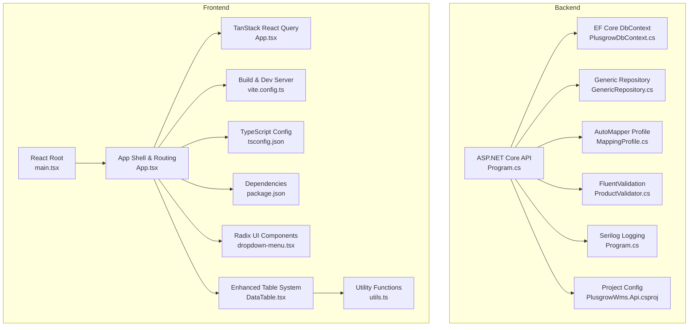

**Diagram sources**
- [Program.cs:1-107](file://Backend/PlusgrowWms.Api/Program.cs#L1-L107)
- [PlusgrowWms.Api.csproj:1-29](file://Backend/PlusgrowWms.Api/PlusgrowWms.Api.csproj#L1-L29)
- [PlusgrowDbContext.cs:1-78](file://Backend/PlusgrowWms.Api/Data/PlusgrowDbContext.cs#L1-L78)
- [GenericRepository.cs:1-117](file://Backend/PlusgrowWms.Api/Repositories/GenericRepository.cs#L1-L117)
- [MappingProfile.cs:1-56](file://Backend/PlusgrowWms.Api/Mappings/MappingProfile.cs#L1-L56)
- [ProductValidator.cs:1-33](file://Backend/PlusgrowWms.Api/Validators/ProductValidator.cs#L1-L33)
- [main.tsx:1-11](file://Frontend/src/main.tsx#L1-L11)
- [App.tsx:1-184](file://Frontend/src/App.tsx#L1-L184)
- [vite.config.ts:1-25](file://Frontend/vite.config.ts#L1-L25)
- [tsconfig.json:1-29](file://Frontend/tsconfig.json#L1-L29)
- [package.json:1-61](file://Frontend/package.json#L1-L61)
- [dropdown-menu.tsx:1-192](file://Frontend/src/components/ui/dropdown-menu.tsx#L1-L192)
- [DataTable.tsx:1-327](file://Frontend/src/components/molecules/DataTable/DataTable.tsx#L1-L327)
- [utils.ts:1-7](file://Frontend/src/lib/utils.ts#L1-L7)

**Section sources**
- [PlusgrowWms.Api.csproj:1-29](file://Backend/PlusgrowWms.Api/PlusgrowWms.Api.csproj#L1-L29)
- [Program.cs:1-107](file://Backend/PlusgrowWms.Api/Program.cs#L1-L107)
- [PlusgrowDbContext.cs:1-78](file://Backend/PlusgrowWms.Api/Data/PlusgrowDbContext.cs#L1-L78)
- [GenericRepository.cs:1-117](file://Backend/PlusgrowWms.Api/Repositories/GenericRepository.cs#L1-L117)
- [MappingProfile.cs:1-56](file://Backend/PlusgrowWms.Api/Mappings/MappingProfile.cs#L1-L56)
- [ProductValidator.cs:1-33](file://Backend/PlusgrowWms.Api/Validators/ProductValidator.cs#L1-L33)
- [package.json:1-61](file://Frontend/package.json#L1-L61)
- [vite.config.ts:1-25](file://Frontend/vite.config.ts#L1-L25)
- [tsconfig.json:1-29](file://Frontend/tsconfig.json#L1-L29)
- [main.tsx:1-11](file://Frontend/src/main.tsx#L1-L11)
- [App.tsx:1-184](file://Frontend/src/App.tsx#L1-L184)

## Core Components
- Backend framework and runtime
  - ASP.NET Core 10: Target framework and hosting model for the API.
  - Entity Framework Core 10: ORM for PostgreSQL data access.
  - PostgreSQL via Npgsql.EntityFrameworkCore.PostgreSQL 10.0.1.
  - JWT bearer authentication with Microsoft.AspNetCore.Authentication.JwtBearer 10.0.5.
  - Serilog.AspNetCore 10.0.0 for structured logging.
  - FluentValidation.AspNetCore 11.3.1 for model validation.
  - AutoMapper.Extensions.Microsoft.DependencyInjection 12.0.1 for mapping.
  - Swashbuckle.AspNetCore 10.1.7 with Newtonsoft for API docs.
  - Additional packages: bcrypt for password hashing, ClosedXML, Dapper, Newtonsoft.Json, Swashbuckle with Newtonsoft.

- Frontend framework and toolchain
  - React 19.0.0 and React DOM 19.0.0 with TypeScript ~5.8.2.
  - Vite 6.2.0 for dev server and build.
  - TanStack React Query 5.x for caching and data synchronization.
  - Enhanced UI libraries: Lucide React 0.546.0, Recharts 3.8.0, @radix-ui/react-dropdown-menu 2.1.16, @tanstack/react-table 8.21.3.
  - Advanced table system with custom components and utilities.
  - Routing via react-router-dom 7.x.
  - TailwindCSS v4 via @tailwindcss/vite 4.1.14.
  - Utility library: class-variance-authority 0.7.1, clsx 2.1.1, tailwind-merge 3.5.0.
  - Additional ecosystem: axios, date-fns, zod, react-hook-form, framer-motion, sonner, tesseract.js, @google/genai.

**Updated** Enhanced frontend with Radix UI primitives and advanced table functionality for improved accessibility and user experience.

**Section sources**
- [PlusgrowWms.Api.csproj:1-29](file://Backend/PlusgrowWms.Api/PlusgrowWms.Api.csproj#L1-L29)
- [Program.cs:1-107](file://Backend/PlusgrowWms.Api/Program.cs#L1-L107)
- [package.json:1-61](file://Frontend/package.json#L1-L61)

## Architecture Overview
The system follows a classic layered architecture with enhanced UI components:
- Presentation layer: React SPA with routing, lazy loading, TanStack React Query for data fetching and caching, and advanced table components with Radix UI primitives.
- Application layer: ASP.NET Core controllers expose REST endpoints, orchestrated by services.
- Domain and data access: EF Core models and repositories encapsulate persistence and query logic.
- Infrastructure: PostgreSQL database with indexes and snake_case naming convention.

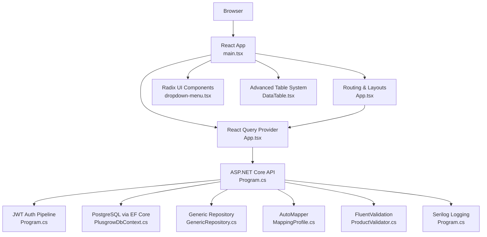

**Diagram sources**
- [Program.cs:1-107](file://Backend/PlusgrowWms.Api/Program.cs#L1-L107)
- [PlusgrowDbContext.cs:1-78](file://Backend/PlusgrowWms.Api/Data/PlusgrowDbContext.cs#L1-L78)
- [GenericRepository.cs:1-117](file://Backend/PlusgrowWms.Api/Repositories/GenericRepository.cs#L1-L117)
- [MappingProfile.cs:1-56](file://Backend/PlusgrowWms.Api/Mappings/MappingProfile.cs#L1-L56)
- [ProductValidator.cs:1-33](file://Backend/PlusgrowWms.Api/Validators/ProductValidator.cs#L1-L33)
- [main.tsx:1-11](file://Frontend/src/main.tsx#L1-L11)
- [App.tsx:1-184](file://Frontend/src/App.tsx#L1-L184)
- [dropdown-menu.tsx:1-192](file://Frontend/src/components/ui/dropdown-menu.tsx#L1-L192)
- [DataTable.tsx:1-327](file://Frontend/src/components/molecules/DataTable/DataTable.tsx#L1-L327)

## Detailed Component Analysis

### Backend: ASP.NET Core API Startup and Configuration
- Host initialization and logging: Serilog configured via builder host.
- Data access: EF Core DbContext registered with Npgsql connection string from configuration.
- DI container: Generic repository pattern registered for domain entities; services and validators registered.
- Authentication: JWT bearer scheme configured with issuer, audience, and symmetric key.
- Authorization and CORS: Authorization middleware and permissive CORS policy for frontend origin.
- API documentation: Swagger enabled with Newtonsoft JSON support.
- HTTP pipeline: HTTPS redirection, CORS, authentication, authorization, controller mapping, and request logging.

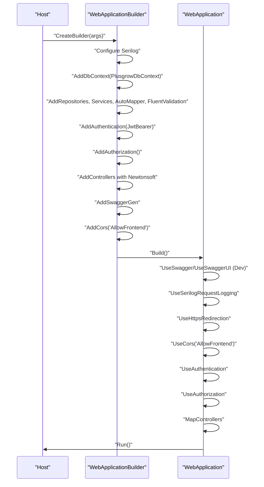

**Diagram sources**
- [Program.cs:1-107](file://Backend/PlusgrowWms.Api/Program.cs#L1-L107)

**Section sources**
- [Program.cs:16-106](file://Backend/PlusgrowWms.Api/Program.cs#L16-L106)

### Backend: Data Access Layer (EF Core + PostgreSQL)
- DbContext defines entity sets and applies snake_case table naming and multiple unique and composite indexes for performance.
- Indexes target frequent filters and joins (SKU, product commodity/manufacturer/HSN/name, user role/active status, role-page access uniqueness, importer CIN, manufacturer country).

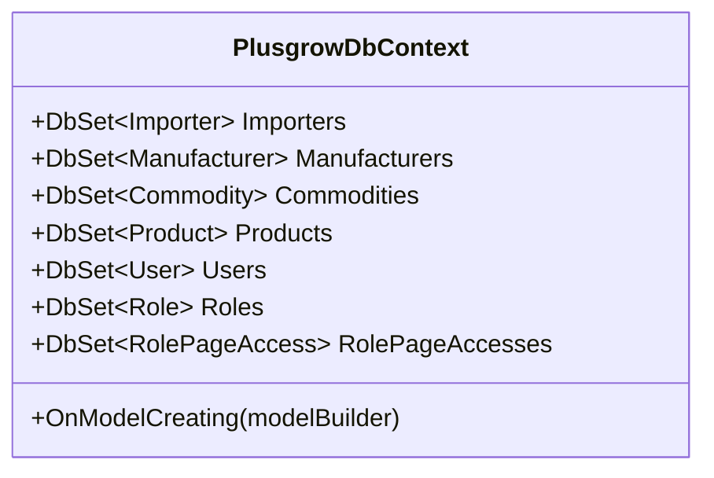

**Diagram sources**
- [PlusgrowDbContext.cs:6-77](file://Backend/PlusgrowWms.Api/Data/PlusgrowDbContext.cs#L6-L77)

**Section sources**
- [PlusgrowDbContext.cs:20-76](file://Backend/PlusgrowWms.Api/Data/PlusgrowDbContext.cs#L20-L76)

### Backend: Repository Pattern
- GenericRepository<T> implements common CRUD and query operations with include support and count helpers.
- Uses EF Core DbSet and DbContext.SaveChangesAsync after mutations.

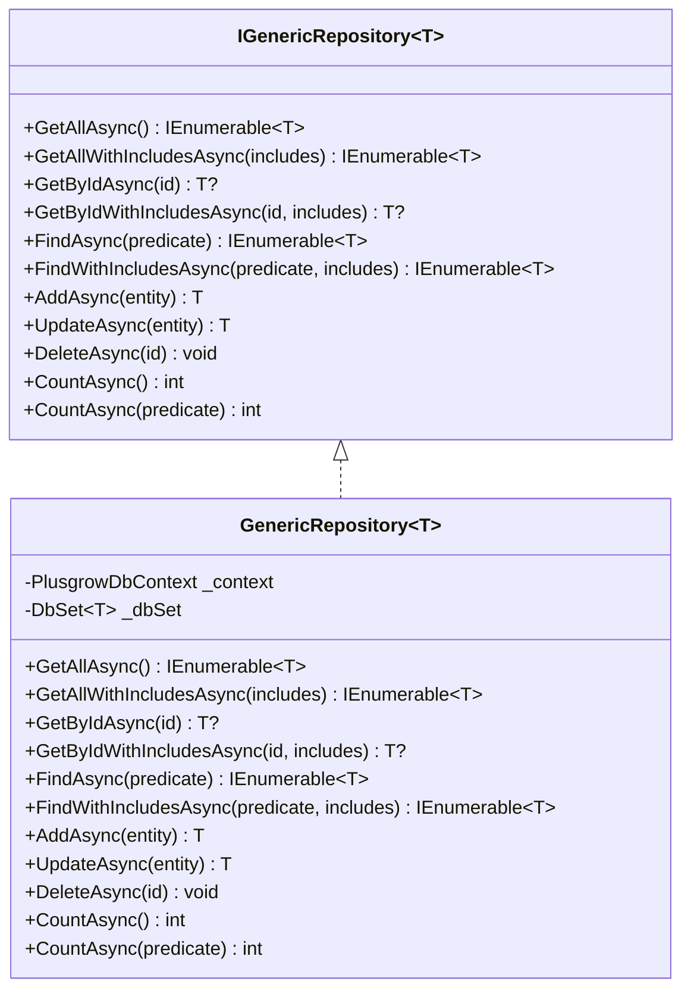

**Diagram sources**
- [GenericRepository.cs:7-116](file://Backend/PlusgrowWms.Api/Repositories/GenericRepository.cs#L7-L116)

**Section sources**
- [GenericRepository.cs:22-116](file://Backend/PlusgrowWms.Api/Repositories/GenericRepository.cs#L22-L116)

### Backend: Mapping with AutoMapper
- MappingProfile configures bidirectional mappings for User, Role, RolePageAccess, Product, Importer, and Manufacturer DTOs.
- Includes computed properties (e.g., role name, user count) and ignores for sensitive or derived fields.

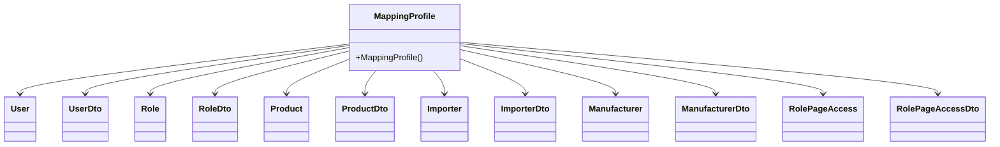

**Diagram sources**
- [MappingProfile.cs:7-55](file://Backend/PlusgrowWms.Api/Mappings/MappingProfile.cs#L7-L55)

**Section sources**
- [MappingProfile.cs:9-54](file://Backend/PlusgrowWms.Api/Mappings/MappingProfile.cs#L9-L54)

### Backend: Validation with FluentValidation
- ProductValidator enforces field constraints for product creation/update DTOs (lengths, numeric bounds, optionality).
- Validation is auto-registered in Program.cs and integrates with controllers.

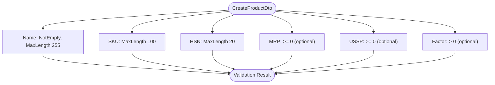

**Diagram sources**
- [ProductValidator.cs:6-32](file://Backend/PlusgrowWms.Api/Validators/ProductValidator.cs#L6-L32)

**Section sources**
- [ProductValidator.cs:6-32](file://Backend/PlusgrowWms.Api/Validators/ProductValidator.cs#L6-L32)

### Backend: Authentication Service and JWT
- AuthService handles login, registration, password hashing/verification with BCrypt, JWT token generation, and user retrieval.
- Claims include identity, name, email, role, and role ID; token expiry configured via configuration.

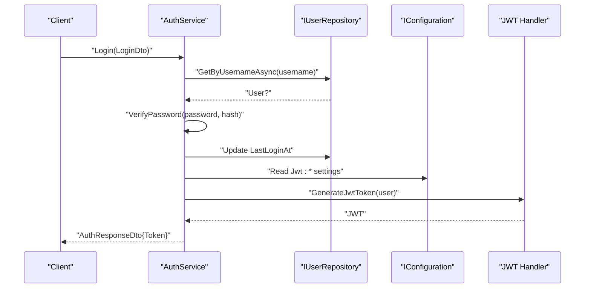

**Diagram sources**
- [AuthService.cs:39-103](file://Backend/PlusgrowWms.Api/Services/AuthService.cs#L39-L103)
- [AuthService.cs:144-168](file://Backend/PlusgrowWms.Api/Services/AuthService.cs#L144-L168)

**Section sources**
- [AuthService.cs:23-235](file://Backend/PlusgrowWms.Api/Services/AuthService.cs#L23-L235)

### Frontend: React SPA and Build Tooling
- React 19 with Strict Mode root rendering.
- App wraps routes with React Query provider, Sonner toast notifications, and lazy-loaded page components.
- Vite config enables React and TailwindCSS plugins, environment variable exposure, path aliases, and HMR toggles.
- TypeScript configured for ES2022 targets, bundler module resolution, JSX transform, and path mapping.

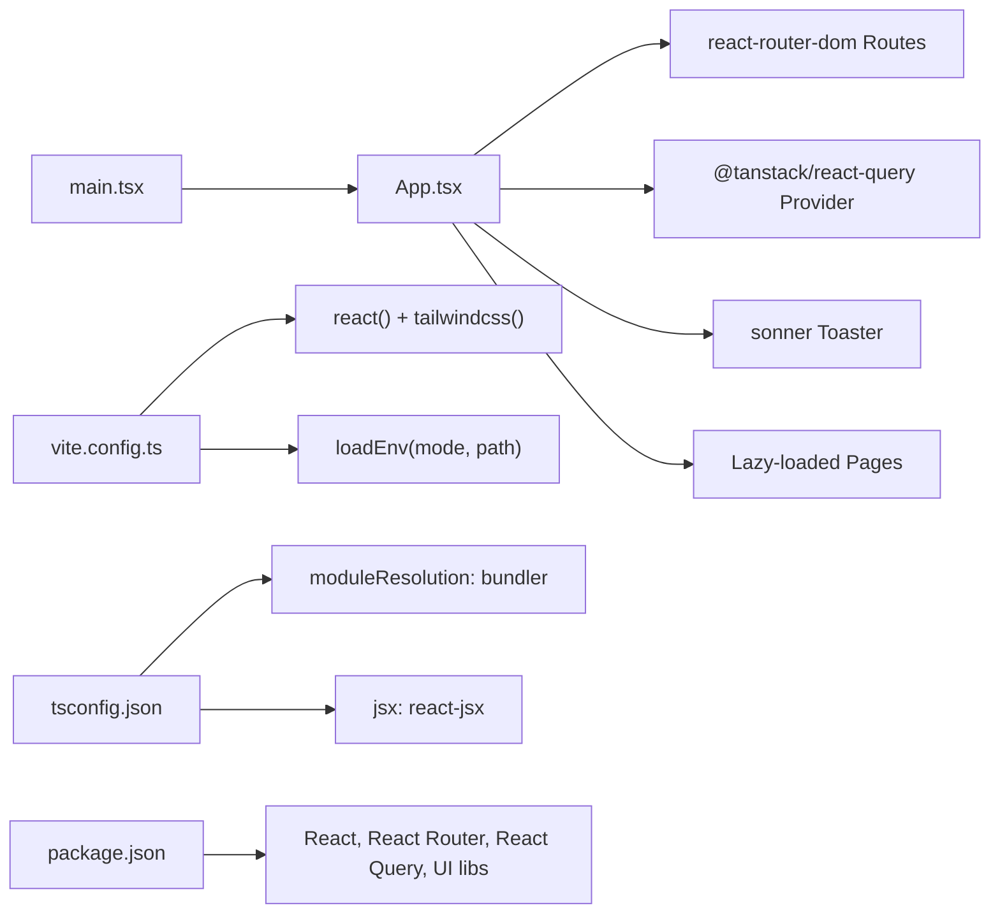

**Diagram sources**
- [main.tsx:1-11](file://Frontend/src/main.tsx#L1-L11)
- [App.tsx:67-182](file://Frontend/src/App.tsx#L67-L182)
- [vite.config.ts:6-24](file://Frontend/vite.config.ts#L6-L24)
- [tsconfig.json:1-29](file://Frontend/tsconfig.json#L1-L29)
- [package.json:1-61](file://Frontend/package.json#L1-L61)

**Section sources**
- [main.tsx:1-11](file://Frontend/src/main.tsx#L1-L11)
- [App.tsx:1-184](file://Frontend/src/App.tsx#L1-L184)
- [vite.config.ts:1-25](file://Frontend/vite.config.ts#L1-L25)
- [tsconfig.json:1-29](file://Frontend/tsconfig.json#L1-L29)
- [package.json:1-61](file://Frontend/package.json#L1-L61)

### Frontend: Radix UI Dropdown Menu Component
- Comprehensive dropdown menu system built on @radix-ui/react-dropdown-menu primitives.
- Implements accessible ARIA patterns with proper keyboard navigation and focus management.
- Supports nested menus, checkboxes, radio buttons, separators, and custom shortcuts.
- Styled with Tailwind CSS classes and integrated with the design system.

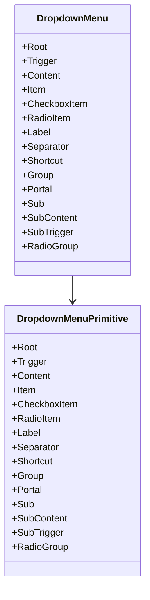

**Diagram sources**
- [dropdown-menu.tsx:1-192](file://Frontend/src/components/ui/dropdown-menu.tsx#L1-L192)

**Section sources**
- [dropdown-menu.tsx:1-192](file://Frontend/src/components/ui/dropdown-menu.tsx#L1-L192)

### Frontend: Enhanced Table System with TanStack React Table
- Advanced data table implementation using @tanstack/react-table for complex data visualization.
- Features include sorting, filtering, pagination, global search, and responsive design.
- Integrates with Radix UI dropdown for row actions and custom styling.
- Includes motion animations, loading states, and empty state handling.

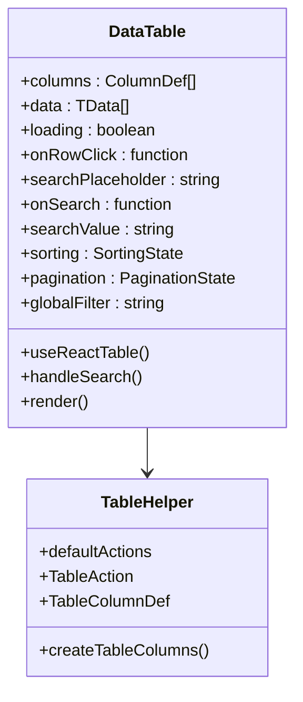

**Diagram sources**
- [DataTable.tsx:1-327](file://Frontend/src/components/molecules/DataTable/DataTable.tsx#L1-L327)
- [tableHelpers.tsx:1-109](file://Frontend/src/components/molecules/DataTable/tableHelpers.tsx#L1-L109)

**Section sources**
- [DataTable.tsx:1-327](file://Frontend/src/components/molecules/DataTable/DataTable.tsx#L1-L327)
- [tableHelpers.tsx:1-109](file://Frontend/src/components/molecules/DataTable/tableHelpers.tsx#L1-L109)

### Frontend: Utility Functions and Design System Integration
- cn utility function combining clsx and tailwind-merge for efficient class merging.
- Integrated with design system components for consistent styling across dropdown menus and tables.
- Supports responsive design patterns and accessibility best practices.

**Section sources**
- [utils.ts:1-7](file://Frontend/src/lib/utils.ts#L1-L7)

## Dependency Analysis
- Backend package dependencies and versions are declared in the project file. Key relationships:
  - EF Core 10 with Npgsql provider for PostgreSQL.
  - Serilog for logging infrastructure.
  - FluentValidation for request validation.
  - AutoMapper for DTO mapping.
  - JWT bearer for authentication.
  - Swashbuckle for API documentation.

- Frontend dependencies include React, React Router, TanStack React Query, Lucide React, Recharts, TailwindCSS, Radix UI, TanStack React Table, and related tooling.

**Updated** Enhanced frontend dependency graph with new UI libraries and table system.

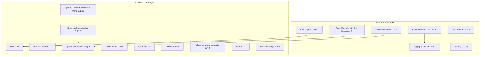

**Diagram sources**
- [PlusgrowWms.Api.csproj:9-26](file://Backend/PlusgrowWms.Api/PlusgrowWms.Api.csproj#L9-L26)
- [package.json:13-61](file://Frontend/package.json#L13-L61)

**Section sources**
- [PlusgrowWms.Api.csproj:9-26](file://Backend/PlusgrowWms.Api/PlusgrowWms.Api.csproj#L9-L26)
- [package.json:13-61](file://Frontend/package.json#L13-L61)

## Performance Considerations
- Backend
  - EF Core indexing: Unique and composite indexes on frequently filtered columns improve query performance.
  - Snake_case naming reduces PostgreSQL naming overhead and aligns with conventions.
  - JWT authentication avoids session storage overhead; consider token refresh strategy for long sessions.
  - Serilog request logging adds observability but should be tuned for production throughput.
  - Generic repository centralizes data access and simplifies testing; ensure appropriate includes to avoid N+1 queries.

- Frontend
  - TanStack React Query caching with a 5-minute stale time balances freshness and network usage.
  - Lazy loading pages reduce initial bundle size and improve perceived performance.
  - Vite's fast refresh and optimized bundling minimize dev iteration time.
  - **Updated** Enhanced table performance with virtualization and optimized rendering for large datasets.
  - **Updated** Radix UI components provide better accessibility and performance compared to custom implementations.

## Troubleshooting Guide
- Backend
  - Logging: Ensure Serilog sink configuration and log level are set appropriately for environments.
  - JWT: Verify issuer, audience, and signing key configuration; check token expiry settings.
  - Validation: Confirm FluentValidation registrations and error messages surface to clients.
  - Database: Validate connection string and migrations; review index usage with EXPLAIN plans.

- Frontend
  - Environment variables: Confirm GEMINI_API_KEY availability in Vite environment loading.
  - React Query: Inspect query client defaults and error boundaries; enable devtools for debugging.
  - Routing: Verify route paths and lazy loading fallbacks.
  - **Updated** Table components: Check column definitions and data types for TanStack React Table compatibility.
  - **Updated** Radix UI: Ensure proper portal mounting and focus management for dropdown menus.

**Section sources**
- [Program.cs:16-106](file://Backend/PlusgrowWms.Api/Program.cs#L16-L106)
- [AuthService.cs:144-168](file://Backend/PlusgrowWms.Api/Services/AuthService.cs#L144-L168)
- [ProductValidator.cs:6-32](file://Backend/PlusgrowWms.Api/Validators/ProductValidator.cs#L6-L32)
- [PlusgrowDbContext.cs:20-76](file://Backend/PlusgrowWms.Api/Data/PlusgrowDbContext.cs#L20-L76)
- [vite.config.ts:6-24](file://Frontend/vite.config.ts#L6-L24)
- [App.tsx:58-65](file://Frontend/src/App.tsx#L58-L65)

## Conclusion
PlusGrow WMS employs a modern, maintainable stack: ASP.NET Core 10 with EF Core and PostgreSQL for robust backend capabilities, complemented by AutoMapper, FluentValidation, and Serilog for clean architecture and reliability. The frontend leverages React 19, TypeScript, Vite, and TanStack React Query to deliver responsive UX with strong developer ergonomics. **Updated** The enhanced UI system now includes Radix UI primitives for improved accessibility and TanStack React Table for advanced data visualization capabilities. Together, these technologies provide a scalable, secure, and well-documented foundation suitable for enterprise warehouse management systems.

## Appendices

### Version Compatibility and Upgrade Paths
- ASP.NET Core 10 and EF Core 10: Align tooling and runtime versions; EF Core provider versions should match major EF Core releases.
- JWT Bearer 10.x: Ensure compatible IdentityModel and SecurityToken libraries.
- Serilog 10.x: Keep sinks and ASP.NET integration aligned with major versions.
- FluentValidation 11.x: Validate controller integration and pipeline behavior.
- AutoMapper 12.x: Review mapping profiles after major updates.
- React 19 and TypeScript ~5.8: Keep Vite and plugin ecosystem current; test React Router and React Query compatibility.
- TanStack React Query 5.x: Follow migration guides for breaking changes.
- **Updated** Radix UI 2.x: Maintain compatibility with React 19 and TypeScript; test accessibility features.
- **Updated** TanStack React Table 8.x: Follow migration guides for column definition changes and API updates.
- UI libraries: Pin versions to avoid unexpected behavior; test upgrades in isolation.

### Licensing, Community Support, and Maintenance
- Open source components: MIT, Apache 2.0, BSD-like licenses observed in dependencies; ensure compliance with license terms.
- Community and maintenance: Active ecosystems for .NET, EF Core, React, Vite, React Query, Radix UI, and TanStack React Table; monitor release notes and deprecation notices.
- Security: Apply regular updates; configure JWT securely; enforce HTTPS and CORS policies; sanitize inputs and validate payloads.
- **Updated** Accessibility: Radix UI components provide WCAG-compliant accessibility features; ensure proper ARIA attributes and keyboard navigation.
- **Updated** Performance: Monitor table rendering performance with large datasets; consider virtualization and pagination strategies.