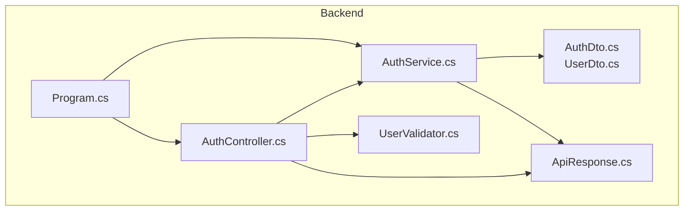
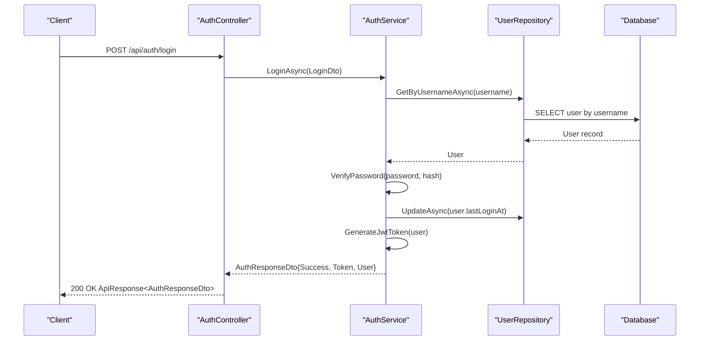
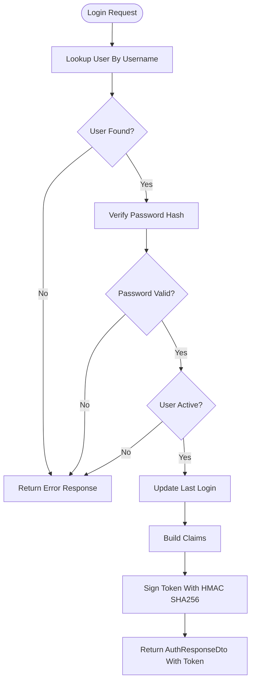
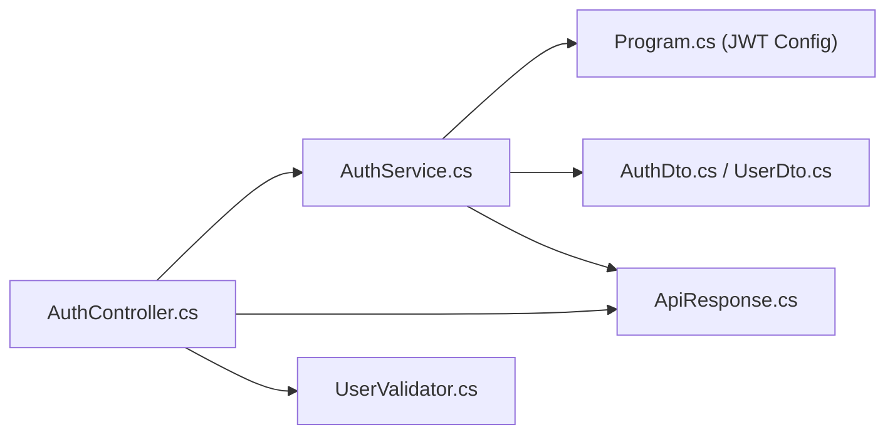

# Authentication API

<cite>
**Referenced Files in This Document**
- [AuthController.cs](file://Backend/PlusgrowWms.Api/Controllers/AuthController.cs)
- [AuthService.cs](file://Backend/PlusgrowWms.Api/Services/AuthService.cs)
- [AuthDto.cs](file://Backend/PlusgrowWms.Api/DTOs/AuthDto.cs)
- [UserDto.cs](file://Backend/PlusgrowWms.Api/DTOs/UserDto.cs)
- [ApiResponse.cs](file://Backend/PlusgrowWms.Api/Helpers/ApiResponse.cs)
- [Program.cs](file://Backend/PlusgrowWms.Api/Program.cs)
- [UserValidator.cs](file://Backend/PlusgrowWms.Api/Validators/UserValidator.cs)
</cite>

## Table of Contents
1. [Introduction](#introduction)
2. [Project Structure](#project-structure)
3. [Core Components](#core-components)
4. [Architecture Overview](#architecture-overview)
5. [Detailed Component Analysis](#detailed-component-analysis)
6. [Dependency Analysis](#dependency-analysis)
7. [Performance Considerations](#performance-considerations)
8. [Troubleshooting Guide](#troubleshooting-guide)
9. [Conclusion](#conclusion)
10. [Appendices](#appendices)

## Introduction
This document provides comprehensive API documentation for the Authentication API endpoints. It covers the login and registration endpoints, JWT token generation and validation, authentication middleware configuration, and practical usage patterns. It also documents the request/response schemas, error handling, and security headers.

## Project Structure
The authentication subsystem is implemented in the backend project under the PlusgrowWms.Api namespace. Key components include:
- Controller: handles HTTP endpoints for authentication
- Service: implements business logic for login, registration, password management, and token generation
- DTOs: define request/response schemas
- Helpers: provide a standardized API response wrapper
- Program: configures JWT authentication and authorization

**Diagram sources**
- [AuthController.cs](file://Backend/PlusgrowWms.Api/Controllers/AuthController.cs)
- [AuthService.cs](file://Backend/PlusgrowWms.Api/Services/AuthService.cs)
- [AuthDto.cs](file://Backend/PlusgrowWms.Api/DTOs/AuthDto.cs)
- [UserDto.cs](file://Backend/PlusgrowWms.Api/DTOs/UserDto.cs)
- [ApiResponse.cs](file://Backend/PlusgrowWms.Api/Helpers/ApiResponse.cs)
- [Program.cs](file://Backend/PlusgrowWms.Api/Program.cs)
- [UserValidator.cs](file://Backend/PlusgrowWms.Api/Validators/UserValidator.cs)

**Section sources**
- [AuthController.cs](file://Backend/PlusgrowWms.Api/Controllers/AuthController.cs)
- [AuthService.cs](file://Backend/PlusgrowWms.Api/Services/AuthService.cs)
- [AuthDto.cs](file://Backend/PlusgrowWms.Api/DTOs/AuthDto.cs)
- [UserDto.cs](file://Backend/PlusgrowWms.Api/DTOs/UserDto.cs)
- [ApiResponse.cs](file://Backend/PlusgrowWms.Api/Helpers/ApiResponse.cs)
- [Program.cs](file://Backend/PlusgrowWms.Api/Program.cs)
- [UserValidator.cs](file://Backend/PlusgrowWms.Api/Validators/UserValidator.cs)

## Core Components
- AuthController: Exposes authentication endpoints and delegates to the service layer. It applies authorization attributes to protect protected endpoints and uses a base controller pattern to return standardized responses via ApiResponse.
- AuthService: Implements authentication logic, including user lookup, password verification, role assignment, and JWT token generation. It also supports password changes and token refresh.
- DTOs: Define the shape of requests and responses, including LoginDto, AuthResponseDto, JwtSettingsDto, and UserDto.
- ApiResponse: Provides a consistent JSON envelope for all API responses, including success flags, messages, data payloads, timestamps, and optional pagination.
- Program: Configures JWT authentication with issuer, audience, signing key, and lifetime validation. It also sets up authorization, CORS, and Swagger.

**Section sources**
- [AuthController.cs](file://Backend/PlusgrowWms.Api/Controllers/AuthController.cs)
- [AuthService.cs](file://Backend/PlusgrowWms.Api/Services/AuthService.cs)
- [AuthDto.cs](file://Backend/PlusgrowWms.Api/DTOs/AuthDto.cs)
- [UserDto.cs](file://Backend/PlusgrowWms.Api/DTOs/UserDto.cs)
- [ApiResponse.cs](file://Backend/PlusgrowWms.Api/Helpers/ApiResponse.cs)
- [Program.cs](file://Backend/PlusgrowWms.Api/Program.cs)

## Architecture Overview
The authentication flow integrates HTTP controllers, a service layer, and JWT middleware. Requests are validated by validators and DTOs, processed by the service, and responses are wrapped consistently.

**Diagram sources**
- [AuthController.cs](file://Backend/PlusgrowWms.Api/Controllers/AuthController.cs)
- [AuthService.cs](file://Backend/PlusgrowWms.Api/Services/AuthService.cs)

## Detailed Component Analysis

### Authentication Endpoints
- Base route: api/auth
- Public endpoints (no authentication required):
  - POST /api/auth/login
  - POST /api/auth/register
- Protected endpoints (requires bearer token):
  - GET /api/auth/me
  - PUT /api/auth/change-password
  - POST /api/auth/refresh-token

Request and response schemas are defined below.

**Section sources**
- [AuthController.cs](file://Backend/PlusgrowWms.Api/Controllers/AuthController.cs)

### Request and Response Schemas

#### Login
- Method: POST
- URL: /api/auth/login
- Request body: LoginDto
  - Fields: username (string), password (string)
- Response body: ApiResponse<AuthResponseDto>
  - Success: boolean
  - Message: string
  - Data: AuthResponseDto
    - Success: boolean
    - Token: string
    - Message: string
    - User: UserDto
      - Id: integer
      - Username: string
      - FullName: string
      - Email: string?
      - Phone: string?
      - RoleId: integer?
      - RoleName: string?
      - IsActive: boolean
      - CreatedAt: datetime
      - LastLoginAt: datetime?

Behavior:
- Validates presence of username and password.
- Returns error if missing.
- On success, updates last login timestamp and returns a JWT token with user details.

**Section sources**
- [AuthController.cs](file://Backend/PlusgrowWms.Api/Controllers/AuthController.cs)
- [AuthDto.cs](file://Backend/PlusgrowWms.Api/DTOs/AuthDto.cs)
- [UserDto.cs](file://Backend/PlusgrowWms.Api/DTOs/UserDto.cs)
- [ApiResponse.cs](file://Backend/PlusgrowWms.Api/Helpers/ApiResponse.cs)

#### Registration
- Method: POST
- URL: /api/auth/register
- Request body: CreateUserDto
  - Fields: username (string), password (string), fullName (string), email (string?), phone (string?), roleId (integer?)
- Response body: ApiResponse<AuthResponseDto>
  - Success: boolean
  - Message: string
  - Data: AuthResponseDto
    - Success: boolean
    - Message: string

Behavior:
- Validates presence of username, password, and fullName.
- Enforces minimum password length.
- Checks for existing username.
- Hashes password and creates user with default active status.

**Section sources**
- [AuthController.cs](file://Backend/PlusgrowWms.Api/Controllers/AuthController.cs)
- [UserValidator.cs](file://Backend/PlusgrowWms.Api/Validators/UserValidator.cs)
- [UserDto.cs](file://Backend/PlusgrowWms.Api/DTOs/UserDto.cs)
- [ApiResponse.cs](file://Backend/PlusgrowWms.Api/Helpers/ApiResponse.cs)

#### Get Current User Profile
- Method: GET
- URL: /api/auth/me
- Headers: Authorization: Bearer {token}
- Response body: ApiResponse<UserDto>

Behavior:
- Extracts user identity from JWT claims.
- Retrieves user with role details.
- Returns user profile or 404 if not found.

**Section sources**
- [AuthController.cs](file://Backend/PlusgrowWms.Api/Controllers/AuthController.cs)
- [UserDto.cs](file://Backend/PlusgrowWms.Api/DTOs/UserDto.cs)
- [ApiResponse.cs](file://Backend/PlusgrowWms.Api/Helpers/ApiResponse.cs)

#### Change Password
- Method: PUT
- URL: /api/auth/change-password
- Headers: Authorization: Bearer {token}
- Request body: ChangePasswordDto
  - Fields: currentPassword (string), newPassword (string)
- Response body: ApiResponse

Behavior:
- Verifies current password by attempting a login with provided credentials.
- Rejects if current password is incorrect.
- Hashes new password and persists change.

**Section sources**
- [AuthController.cs](file://Backend/PlusgrowWms.Api/Controllers/AuthController.cs)
- [UserDto.cs](file://Backend/PlusgrowWms.Api/DTOs/UserDto.cs)
- [ApiResponse.cs](file://Backend/PlusgrowWms.Api/Helpers/ApiResponse.cs)

#### Refresh Token
- Method: POST
- URL: /api/auth/refresh-token
- Headers: Authorization: Bearer {token}
- Response body: ApiResponse<AuthResponseDto>

Behavior:
- Validates the current JWT and extracts user identity.
- Regenerates a new JWT for the same user.
- Returns new token with user details.

**Section sources**
- [AuthController.cs](file://Backend/PlusgrowWms.Api/Controllers/AuthController.cs)
- [AuthService.cs](file://Backend/PlusgrowWms.Api/Services/AuthService.cs)
- [AuthDto.cs](file://Backend/PlusgrowWms.Api/DTOs/AuthDto.cs)
- [UserDto.cs](file://Backend/PlusgrowWms.Api/DTOs/UserDto.cs)
- [ApiResponse.cs](file://Backend/PlusgrowWms.Api/Helpers/ApiResponse.cs)

### JWT Token Generation and Validation
- Token generation:
  - Claims include NameIdentifier, Name, GivenName, Email, Role, and roleId.
  - Issuer, audience, and expiry minutes are loaded from configuration.
  - HMAC SHA256 signing key is derived from configuration.
- Token validation:
  - Enabled via JWT Bearer authentication.
  - Validates issuer, audience, lifetime, and signing key.
  - Requires Authorization: Bearer {token} header for protected endpoints.

**Diagram sources**
- [AuthService.cs](file://Backend/PlusgrowWms.Api/Services/AuthService.cs)
- [AuthDto.cs](file://Backend/PlusgrowWms.Api/DTOs/AuthDto.cs)

**Section sources**
- [AuthService.cs](file://Backend/PlusgrowWms.Api/Services/AuthService.cs)
- [Program.cs](file://Backend/PlusgrowWms.Api/Program.cs)

### Authentication Middleware and Security Headers
- Middleware pipeline:
  - HTTPS redirection enabled.
  - CORS configured to allow frontend origin.
  - Authentication and Authorization enabled.
- Required headers:
  - Authorization: Bearer {jwtToken}
- Response envelope:
  - All responses use ApiResponse<T> with success, message, data, and timestamp.

**Section sources**
- [Program.cs](file://Backend/PlusgrowWms.Api/Program.cs)
- [ApiResponse.cs](file://Backend/PlusgrowWms.Api/Helpers/ApiResponse.cs)

### Practical Usage Examples

- Login
  - POST /api/auth/login
  - Headers: Content-Type: application/json
  - Body: {"username":"john","password":"secret"}
  - Response: ApiResponse<AuthResponseDto> with token and user info

- Register
  - POST /api/auth/register
  - Body: {"username":"jane","password":"pass123","fullName":"Jane Doe","email":"jane@example.com"}
  - Response: ApiResponse<AuthResponseDto> with success message

- Access Protected Resource
  - GET /api/auth/me
  - Headers: Authorization: Bearer eyJhbGciOi...

- Refresh Token
  - POST /api/auth/refresh-token
  - Headers: Authorization: Bearer eyJhbGciOi...

- Change Password
  - PUT /api/auth/change-password
  - Headers: Authorization: Bearer eyJhbGciOi...
  - Body: {"currentPassword":"oldPass","newPassword":"newPass"}

[No sources needed since this section provides usage examples without analyzing specific files]

## Dependency Analysis
The controller depends on the service for business logic, while the service depends on repositories and configuration. JWT configuration is centralized in Program.cs.

**Diagram sources**
- [AuthController.cs](file://Backend/PlusgrowWms.Api/Controllers/AuthController.cs)
- [AuthService.cs](file://Backend/PlusgrowWms.Api/Services/AuthService.cs)
- [Program.cs](file://Backend/PlusgrowWms.Api/Program.cs)
- [AuthDto.cs](file://Backend/PlusgrowWms.Api/DTOs/AuthDto.cs)
- [UserDto.cs](file://Backend/PlusgrowWms.Api/DTOs/UserDto.cs)
- [ApiResponse.cs](file://Backend/PlusgrowWms.Api/Helpers/ApiResponse.cs)
- [UserValidator.cs](file://Backend/PlusgrowWms.Api/Validators/UserValidator.cs)

**Section sources**
- [AuthController.cs](file://Backend/PlusgrowWms.Api/Controllers/AuthController.cs)
- [AuthService.cs](file://Backend/PlusgrowWms.Api/Services/AuthService.cs)
- [Program.cs](file://Backend/PlusgrowWms.Api/Program.cs)
- [AuthDto.cs](file://Backend/PlusgrowWms.Api/DTOs/AuthDto.cs)
- [UserDto.cs](file://Backend/PlusgrowWms.Api/DTOs/UserDto.cs)
- [ApiResponse.cs](file://Backend/PlusgrowWms.Api/Helpers/ApiResponse.cs)
- [UserValidator.cs](file://Backend/PlusgrowWms.Api/Validators/UserValidator.cs)

## Performance Considerations
- Password hashing uses BCrypt with a work factor suitable for server environments.
- Token generation is lightweight and performed per request for refresh scenarios.
- Consider caching active users or tokens for high-throughput scenarios, ensuring cache invalidation on logout or role changes.

[No sources needed since this section provides general guidance]

## Troubleshooting Guide
Common error scenarios and their likely causes:
- Invalid credentials:
  - Non-existent username or incorrect password.
  - Account inactive.
- Missing or malformed Authorization header:
  - Missing Bearer token or malformed scheme.
- Expired token:
  - Token lifetime exceeded; requires refresh or re-login.
- Unauthorized access:
  - Insufficient permissions or invalid roles.
- Validation failures during registration:
  - Username/email/phone constraints violated.

Recommended checks:
- Verify JWT configuration values (issuer, audience, key, expiry).
- Confirm HTTPS and CORS policies.
- Ensure client sends Authorization: Bearer {token} for protected endpoints.

**Section sources**
- [AuthService.cs](file://Backend/PlusgrowWms.Api/Services/AuthService.cs)
- [Program.cs](file://Backend/PlusgrowWms.Api/Program.cs)
- [UserValidator.cs](file://Backend/PlusgrowWms.Api/Validators/UserValidator.cs)

## Conclusion
The Authentication API provides robust endpoints for login, registration, profile retrieval, password changes, and token refresh. It leverages JWT for secure stateless authentication, with consistent response envelopes and middleware configuration supporting secure deployment.

[No sources needed since this section summarizes without analyzing specific files]

## Appendices

### Endpoint Reference Summary
- POST /api/auth/login
  - Request: LoginDto
  - Response: ApiResponse<AuthResponseDto>
- POST /api/auth/register
  - Request: CreateUserDto
  - Response: ApiResponse<AuthResponseDto>
- GET /api/auth/me
  - Response: ApiResponse<UserDto>
- PUT /api/auth/change-password
  - Request: ChangePasswordDto
  - Response: ApiResponse
- POST /api/auth/refresh-token
  - Response: ApiResponse<AuthResponseDto>

**Section sources**
- [AuthController.cs](file://Backend/PlusgrowWms.Api/Controllers/AuthController.cs)
- [AuthDto.cs](file://Backend/PlusgrowWms.Api/DTOs/AuthDto.cs)
- [UserDto.cs](file://Backend/PlusgrowWms.Api/DTOs/UserDto.cs)
- [ApiResponse.cs](file://Backend/PlusgrowWms.Api/Helpers/ApiResponse.cs)