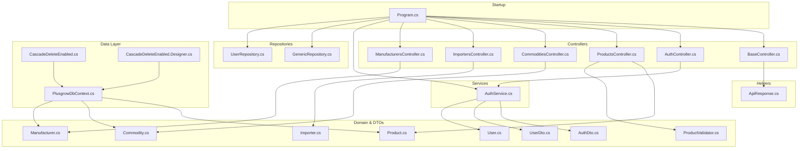
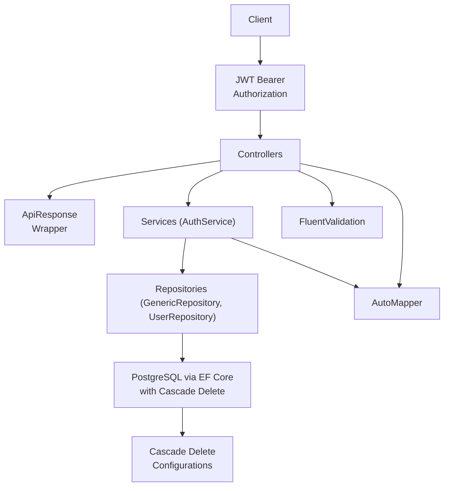
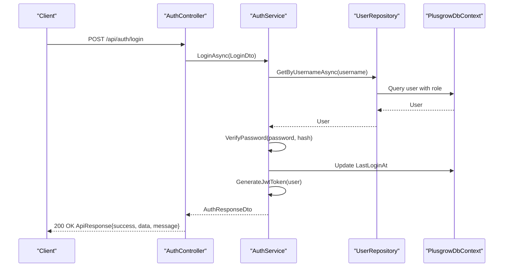
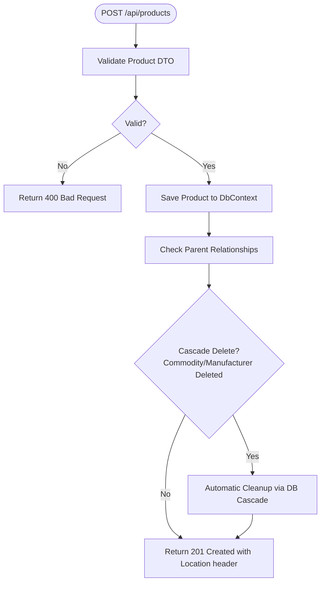
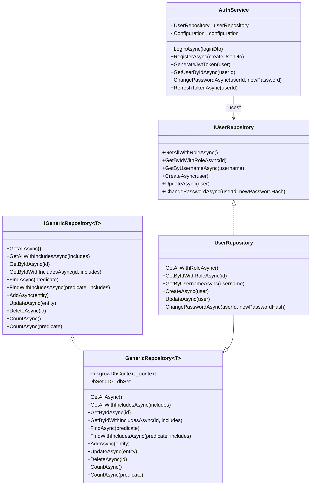
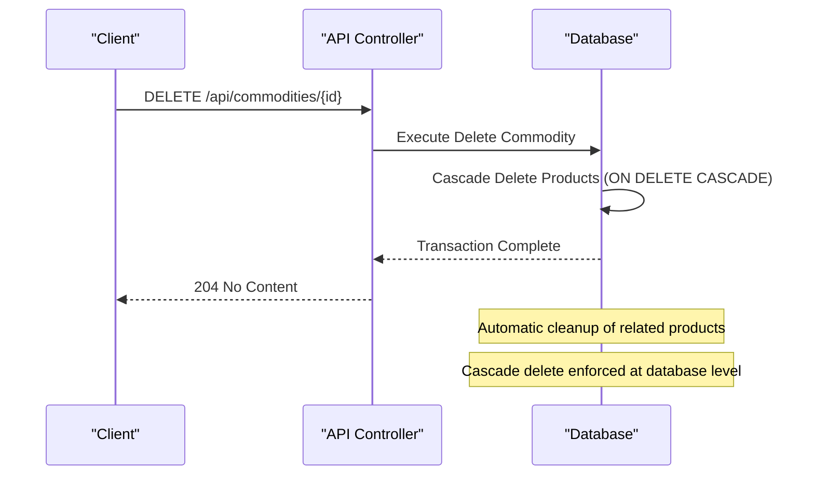
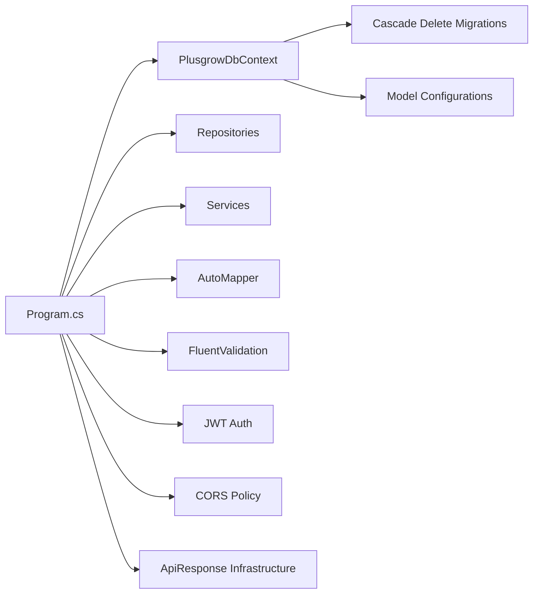

# Backend API Documentation

<cite>
**Referenced Files in This Document**
- [Program.cs](file://Backend/PlusgrowWms.Api/Program.cs)
- [BaseController.cs](file://Backend/PlusgrowWms.Api/Controllers/BaseController.cs)
- [AuthController.cs](file://Backend/PlusgrowWms.Api/Controllers/AuthController.cs)
- [ProductsController.cs](file://Backend/PlusgrowWms.Api/Controllers/ProductsController.cs)
- [CommoditiesController.cs](file://Backend/PlusgrowWms.Api/Controllers/CommoditiesController.cs)
- [ImportersController.cs](file://Backend/PlusgrowWms.Api/Controllers/ImportersController.cs)
- [ManufacturersController.cs](file://Backend/PlusgrowWms.Api/Controllers/ManufacturersController.cs)
- [AuthService.cs](file://Backend/PlusgrowWms.Api/Services/AuthService.cs)
- [ApiResponse.cs](file://Backend/PlusgrowWms.Api/Helpers/ApiResponse.cs)
- [AuthDto.cs](file://Backend/PlusgrowWms.Api/DTOs/AuthDto.cs)
- [UserDto.cs](file://Backend/PlusgrowWms.Api/DTOs/UserDto.cs)
- [UserRepository.cs](file://Backend/PlusgrowWms.Api/Repositories/UserRepository.cs)
- [User.cs](file://Backend/PlusgrowWms.Api/Models/User.cs)
- [Product.cs](file://Backend/PlusgrowWms.Api/Models/Product.cs)
- [Commodity.cs](file://Backend/PlusgrowWms.Api/Models/Commodity.cs)
- [Importer.cs](file://Backend/PlusgrowWms.Api/Models/Importer.cs)
- [Manufacturer.cs](file://Backend/PlusgrowWms.Api/Models/Manufacturer.cs)
- [GenericRepository.cs](file://Backend/PlusgrowWms.Api/Repositories/GenericRepository.cs)
- [ProductValidator.cs](file://Backend/PlusgrowWms.Api/Validators/ProductValidator.cs)
- [PlusgrowDbContext.cs](file://Backend/PlusgrowWms.Api/Data/PlusgrowDbContext.cs)
- [20260327102607_CascadeDeleteEnabled.cs](file://Backend/PlusgrowWms.Api/Migrations/20260327102607_CascadeDeleteEnabled.cs)
- [20260327102607_CascadeDeleteEnabled.Designer.cs](file://Backend/PlusgrowWms.Api/Migrations/20260327102607_CascadeDeleteEnabled.Designer.cs)
</cite>

## Update Summary
**Changes Made**
- Enhanced database migration with cascade delete functionality for product relationships with commodities and manufacturers
- Improved authentication endpoints with enhanced JWT token generation and refresh functionality
- Added comprehensive cascade delete configuration in PlusgrowDbContext for referential integrity
- Expanded user management capabilities with comprehensive user operations
- Enhanced password change functionality with proper validation and verification
- **Updated**: Cascade delete configuration now includes database-level cascade delete enforcement for improved data consistency
- **Updated**: Commodities and Manufacturers controllers now benefit from automatic product cleanup on deletion through database-level cascade delete behavior

## Table of Contents
1. [Introduction](#introduction)
2. [Project Structure](#project-structure)
3. [Core Components](#core-components)
4. [Architecture Overview](#architecture-overview)
5. [Detailed Component Analysis](#detailed-component-analysis)
6. [Database Migration Enhancements](#database-migration-enhancements)
7. [Dependency Analysis](#dependency-analysis)
8. [Performance Considerations](#performance-considerations)
9. [Troubleshooting Guide](#troubleshooting-guide)
10. [Conclusion](#conclusion)
11. [Appendices](#appendices)

## Introduction
This document provides comprehensive API documentation for the PlusGrow WMS backend RESTful APIs. It covers all controller endpoints for Products, Commodities, Importers, and Manufacturers, along with the enhanced Authentication service featuring improved JWT token generation, user management capabilities, and password change functionality. The documentation explains the service layer architecture, repository pattern implementation, and data validation using FluentValidation. It also details the new API client infrastructure with standardized response formatting and improved error handling patterns. The recent enhancement includes cascade delete functionality for product relationships, ensuring referential integrity when parent records are deleted. Practical examples, common integration patterns, and best practices for client implementation are included to help developers integrate seamlessly with the backend.

## Project Structure
The backend is built as an ASP.NET Core Web API with the following high-level structure:
- Controllers: Define HTTP endpoints for resources and orchestrate requests with enhanced error handling
- Services: Encapsulate business logic (e.g., authentication) with improved JWT token management
- Repositories: Implement data access via a generic repository and specialized repositories
- Models: Entity definitions mapped to database tables with cascade delete configurations
- DTOs: Data transfer objects for request/response payloads
- Validators: Validation rules using FluentValidation
- Helpers: API response formatting and base controller functionality
- Program.cs: Application startup, dependency injection, middleware, and authentication configuration
- Migrations: Database schema evolution with cascade delete functionality



**Diagram sources**
- [Program.cs:1-115](file://Backend/PlusgrowWms.Api/Program.cs#L1-L115)
- [BaseController.cs:1-69](file://Backend/PlusgrowWms.Api/Controllers/BaseController.cs#L1-L69)
- [AuthController.cs:1-170](file://Backend/PlusgrowWms.Api/Controllers/AuthController.cs#L1-L170)
- [ProductsController.cs:1-117](file://Backend/PlusgrowWms.Api/Controllers/ProductsController.cs#L1-L117)
- [CommoditiesController.cs:1-81](file://Backend/PlusgrowWms.Api/Controllers/CommoditiesController.cs#L1-L81)
- [ImportersController.cs:1-79](file://Backend/PlusgrowWms.Api/Controllers/ImportersController.cs#L1-L79)
- [ManufacturersController.cs:1-81](file://Backend/PlusgrowWms.Api/Controllers/ManufacturersController.cs#L1-L81)
- [AuthService.cs:1-236](file://Backend/PlusgrowWms.Api/Services/AuthService.cs#L1-L236)
- [GenericRepository.cs:1-117](file://Backend/PlusgrowWms.Api/Repositories/GenericRepository.cs#L1-L117)
- [UserRepository.cs:1-68](file://Backend/PlusgrowWms.Api/Repositories/UserRepository.cs#L1-L68)
- [User.cs:1-51](file://Backend/PlusgrowWms.Api/Models/User.cs#L1-L51)
- [Product.cs:1-65](file://Backend/PlusgrowWms.Api/Models/Product.cs#L1-L65)
- [Commodity.cs:1-22](file://Backend/PlusgrowWms.Api/Models/Commodity.cs#L1-L22)
- [Importer.cs:1-36](file://Backend/PlusgrowWms.Api/Models/Importer.cs#L1-L36)
- [Manufacturer.cs:1-25](file://Backend/PlusgrowWms.Api/Models/Manufacturer.cs#L1-L25)
- [AuthDto.cs:1-24](file://Backend/PlusgrowWms.Api/DTOs/AuthDto.cs#L1-L24)
- [UserDto.cs:1-43](file://Backend/PlusgrowWms.Api/DTOs/UserDto.cs#L1-L43)
- [ProductValidator.cs:1-33](file://Backend/PlusgrowWms.Api/Validators/ProductValidator.cs#L1-L33)
- [ApiResponse.cs:1-159](file://Backend/PlusgrowWms.Api/Helpers/ApiResponse.cs#L1-L159)
- [PlusgrowDbContext.cs:1-92](file://Backend/PlusgrowWms.Api/Data/PlusgrowDbContext.cs#L1-L92)
- [20260327102607_CascadeDeleteEnabled.cs:1-65](file://Backend/PlusgrowWms.Api/Migrations/20260327102607_CascadeDeleteEnabled.cs#L1-L65)
- [20260327102607_CascadeDeleteEnabled.Designer.cs:1-411](file://Backend/PlusgrowWms.Api/Migrations/20260327102607_CascadeDeleteEnabled.Designer.cs#L1-L411)

**Section sources**
- [Program.cs:1-115](file://Backend/PlusgrowWms.Api/Program.cs#L1-L115)

## Core Components
- Authentication and Authorization:
  - JWT bearer authentication configured with issuer, audience, and symmetric key
  - Enhanced authorization policies with comprehensive user management
  - Improved JWT token generation with refresh capability
  - Logging middleware for request logging and error tracking
- Enhanced API Response Infrastructure:
  - Standardized ApiResponse wrapper for consistent JSON responses
  - Comprehensive error handling with structured error objects
  - Pagination support for list operations
  - Base controller with helper methods for consistent API responses
- Data Access Layer:
  - Generic repository supports CRUD and includes
  - Specialized user repository adds role-aware queries and password change
  - PlusgrowDbContext includes cascade delete configurations for referential integrity
- Validation:
  - FluentValidation auto-registration and validators for domain DTOs
- Mapping:
  - AutoMapper registration for mapping models to DTOs
- CORS:
  - Allow-listed frontend origin for development
- Database Migration Enhancements:
  - Cascade delete functionality for product relationships with commodities and manufacturers
  - Referential integrity maintained through database-level cascade deletes
  - Automatic product cleanup when parent entities are deleted

**Section sources**
- [Program.cs:45-101](file://Backend/PlusgrowWms.Api/Program.cs#L45-L101)
- [BaseController.cs:11-69](file://Backend/PlusgrowWms.Api/Controllers/BaseController.cs#L11-L69)
- [ApiResponse.cs:8-97](file://Backend/PlusgrowWms.Api/Helpers/ApiResponse.cs#L8-L97)
- [GenericRepository.cs:1-117](file://Backend/PlusgrowWms.Api/Repositories/GenericRepository.cs#L1-L117)
- [UserRepository.cs:1-68](file://Backend/PlusgrowWms.Api/Repositories/UserRepository.cs#L1-L68)
- [ProductValidator.cs:1-33](file://Backend/PlusgrowWms.Api/Validators/ProductValidator.cs#L1-L33)
- [PlusgrowDbContext.cs:31-43](file://Backend/PlusgrowWms.Api/Data/PlusgrowDbContext.cs#L31-L43)

## Architecture Overview
The backend follows a layered architecture with enhanced API infrastructure and robust database relationships:
- Presentation: Controllers expose REST endpoints with standardized response formatting
- Application: Services encapsulate business logic (authentication, user management)
- Domain: Models represent entities with comprehensive user and role management and cascade delete configurations
- Persistence: Repositories abstract data operations with enhanced user operations and database-level referential integrity
- Validation: FluentValidation enforces request constraints
- Mapping: AutoMapper transforms models to DTOs
- Response Formatting: ApiResponse wrapper provides consistent API responses
- Database Relationships: Cascade delete ensures referential integrity when parent records are removed



**Diagram sources**
- [Program.cs:65-101](file://Backend/PlusgrowWms.Api/Program.cs#L65-L101)
- [AuthService.cs:23-37](file://Backend/PlusgrowWms.Api/Services/AuthService.cs#L23-L37)
- [GenericRepository.cs:22-31](file://Backend/PlusgrowWms.Api/Repositories/GenericRepository.cs#L22-L31)
- [UserRepository.cs:17-21](file://Backend/PlusgrowWms.Api/Repositories/UserRepository.cs#L17-L21)
- [ApiResponse.cs:8-97](file://Backend/PlusgrowWms.Api/Helpers/ApiResponse.cs#L8-L97)
- [PlusgrowDbContext.cs:31-43](file://Backend/PlusgrowWms.Api/Data/PlusgrowDbContext.cs#L31-L43)

## Detailed Component Analysis

### Enhanced Authentication Service and Endpoints
The authentication service manages login, registration, token generation, user retrieval, password changes, and token refresh. It uses JWT with HMAC SHA256 signing and includes role-based claims with enhanced error handling and response formatting.

- Endpoints:
  - POST /api/auth/login
    - Request body: LoginDto
      - Fields: username (string), password (string)
    - Response body: ApiResponse<AuthResponseDto>
      - Fields: success (boolean), message (string), data (AuthResponseDto), timestamp (datetime)
    - Status codes: 200 OK on success, 400 Bad Request on invalid credentials
  - POST /api/auth/register
    - Request body: CreateUserDto
      - Fields: username (string), password (string), fullName (string), email (string?), phone (string?), roleId (int?)
    - Response body: ApiResponse<AuthResponseDto>
      - Fields: success (boolean), message (string), data (AuthResponseDto), timestamp (datetime)
    - Status codes: 200 OK on success, 400 Bad Request on duplicate username
  - GET /api/auth/me
    - Response body: ApiResponse<UserDto>
      - Fields: success (boolean), message (string), data (UserDto), timestamp (datetime)
    - Status codes: 200 OK on success, 404 Not Found if user does not exist
  - PUT /api/auth/change-password
    - Request body: ChangePasswordDto
      - Fields: currentPassword (string), newPassword (string)
    - Response body: ApiResponse
      - Fields: success (boolean), message (string), timestamp (datetime)
    - Status codes: 200 OK on success, 400 Bad Request on invalid current password
  - POST /api/auth/refresh-token
    - Response body: ApiResponse<AuthResponseDto>
      - Fields: success (boolean), message (string), data (AuthResponseDto), timestamp (datetime)
    - Status codes: 200 OK on success, 400 Bad Request on unable to refresh token

- JWT Claims:
  - nameidentifier, name, given-name, email, role, roleId

- Enhanced Security Measures:
  - Password hashing using bcrypt with work factor 12
  - JWT expiry configured via configuration with refresh capability
  - Comprehensive error handling with structured ApiResponse
  - HTTPS redirection enabled
  - CORS allow-listed origin for development



**Diagram sources**
- [AuthService.cs:39-103](file://Backend/PlusgrowWms.Api/Services/AuthService.cs#L39-L103)
- [UserRepository.cs:38-43](file://Backend/PlusgrowWms.Api/Repositories/UserRepository.cs#L38-L43)
- [AuthService.cs:144-168](file://Backend/PlusgrowWms.Api/Services/AuthService.cs#L144-L168)
- [ApiResponse.cs:41-49](file://Backend/PlusgrowWms.Api/Helpers/ApiResponse.cs#L41-L49)

**Section sources**
- [AuthController.cs:1-170](file://Backend/PlusgrowWms.Api/Controllers/AuthController.cs#L1-L170)
- [AuthService.cs:13-236](file://Backend/PlusgrowWms.Api/Services/AuthService.cs#L13-L236)
- [AuthDto.cs:1-24](file://Backend/PlusgrowWms.Api/DTOs/AuthDto.cs#L1-L24)
- [UserDto.cs:1-43](file://Backend/PlusgrowWms.Api/DTOs/UserDto.cs#L1-L43)
- [Program.cs:45-101](file://Backend/PlusgrowWms.Api/Program.cs#L45-L101)
- [ApiResponse.cs:8-97](file://Backend/PlusgrowWms.Api/Helpers/ApiResponse.cs#L8-L97)

### Enhanced API Response Infrastructure
The API response infrastructure provides standardized response formatting across all endpoints with consistent structure and error handling.

- ApiResponse<T> Structure:
  - success (boolean): Indicates operation success/failure
  - message (string?): Human-readable message describing the operation
  - data (T?): The actual response data when operation succeeds
  - errors (List<string>?): Structured error information for failures
  - timestamp (DateTime): UTC timestamp of the response
  - pagination (PaginationInfo?): Pagination information for list operations

- Helper Methods in BaseController:
  - Success<T>(T data, string? message = null): Returns success response
  - Success<T>(T data, int page, int pageSize, int total, string? message = null): Returns paginated success response
  - Error<T>(string message, List<string>? errors = null): Returns error response
  - NotFound<T>(string message = "Resource not found"): Returns not found response
  - BadRequest<T>(string message, List<string>? errors = null): Returns bad request response
  - Ok(string? message = null): Returns success response for void operations
  - Error(string message, List<string>? errors = null): Returns error response for void operations

**Section sources**
- [ApiResponse.cs:8-159](file://Backend/PlusgrowWms.Api/Helpers/ApiResponse.cs#L8-L159)
- [BaseController.cs:11-69](file://Backend/PlusgrowWms.Api/Controllers/BaseController.cs#L11-L69)

### Products Controller
- Base route: api/products
- Endpoints:
  - GET /
    - Response: array of Product
    - Includes: commodity and manufacturer relations
  - GET /{id}
    - Path parameter: id (int)
    - Response: Product
    - Includes: commodity and manufacturer relations
    - Status codes: 200 OK, 404 Not Found
  - POST /
    - Request body: Product
    - Response: Product with Location header to GET /{id}
    - Status codes: 201 Created, 400 Bad Request on validation errors
  - PUT /{id}
    - Path parameter: id (int)
    - Request body: Product
    - Status codes: 204 No Content, 400 Bad Request, 404 Not Found, 412 Precondition Failed on concurrency
  - DELETE /{id}
    - Path parameter: id (int)
    - Status codes: 204 No Content, 404 Not Found

- Validation:
  - ProductValidator applies rules for name length, SKU length, HSN code length, non-negative MRP/USSP, and positive factor.

- **Enhanced** Cascade Delete Behavior:
  - When a Commodity is deleted, all associated Products are automatically deleted due to database-level cascade delete configuration
  - When a Manufacturer is deleted, all associated Products are automatically deleted due to database-level cascade delete configuration
  - Ensures referential integrity at the database level through ReferentialAction.Cascade
  - Prevents orphaned product records and maintains data consistency
  - **Automatic Cleanup**: No manual cleanup required in application code - handled automatically by database-level cascade delete



**Diagram sources**
- [ProductsController.cs:41-47](file://Backend/PlusgrowWms.Api/Controllers/ProductsController.cs#L41-L47)
- [ProductValidator.cs:6-31](file://Backend/PlusgrowWms.Api/Validators/ProductValidator.cs#L6-L31)
- [PlusgrowDbContext.cs:31-43](file://Backend/PlusgrowWms.Api/Data/PlusgrowDbContext.cs#L31-L43)

**Section sources**
- [ProductsController.cs:1-117](file://Backend/PlusgrowWms.Api/Controllers/ProductsController.cs#L1-L117)
- [Product.cs:1-65](file://Backend/PlusgrowWms.Api/Models/Product.cs#L1-L65)
- [ProductValidator.cs:1-33](file://Backend/PlusgrowWms.Api/Validators/ProductValidator.cs#L1-L33)
- [PlusgrowDbContext.cs:31-43](file://Backend/PlusgrowWms.Api/Data/PlusgrowDbContext.cs#L31-L43)

### Commodities Controller
- Base route: api/commodities
- Endpoints:
  - GET /
    - Response: array of Commodity
  - GET /{id}
    - Path parameter: id (int)
    - Response: Commodity
    - Status codes: 200 OK, 404 Not Found
  - POST /
    - Request body: Commodity
    - Response: Commodity with Location header to GET /{id}
    - Status codes: 201 Created
  - PUT /{id}
    - Path parameter: id (int)
    - Request body: Commodity
    - Status codes: 204 No Content, 400 Bad Request, 404 Not Found
  - DELETE /{id}
    - Path parameter: id (int)
    - Status codes: 204 No Content, 404 Not Found

- **Enhanced** Cascade Delete Behavior:
  - When a Commodity is deleted, all associated Products are automatically deleted through database-level cascade delete
  - **Automatic Product Cleanup**: All products associated with the deleted commodity are automatically removed from the database
  - **Referential Integrity**: Prevents orphaned product records in the database
  - **Database-Level Protection**: Ensures data integrity through ReferentialAction.Cascade configuration
  - **Application Transparency**: No manual cleanup logic required in controller - handled automatically by database cascade delete
  - **Atomic Operations**: Cascade delete operations are atomic, preventing partial cleanup scenarios

**Section sources**
- [CommoditiesController.cs:1-81](file://Backend/PlusgrowWms.Api/Controllers/CommoditiesController.cs#L1-L81)
- [Commodity.cs:1-22](file://Backend/PlusgrowWms.Api/Models/Commodity.cs#L1-L22)
- [PlusgrowDbContext.cs:31-36](file://Backend/PlusgrowWms.Api/Data/PlusgrowDbContext.cs#L31-L36)

### Importers Controller
- Base route: api/importers
- Endpoints:
  - GET /
    - Response: array of Importer
  - GET /{id}
    - Path parameter: id (int)
    - Response: Importer
    - Status codes: 200 OK, 404 Not Found
  - POST /
    - Request body: Importer
    - Response: Importer with Location header to GET /{id}
    - Status codes: 201 Created
  - PUT /{id}
    - Path parameter: id (int)
    - Request body: Importer
    - Status codes: 204 No Content, 400 Bad Request, 404 Not Found
  - DELETE /{id}
    - Path parameter: id (int)
    - Status codes: 204 No Content, 404 Not Found

**Section sources**
- [ImportersController.cs:1-79](file://Backend/PlusgrowWms.Api/Controllers/ImportersController.cs#L1-L79)
- [Importer.cs:1-36](file://Backend/PlusgrowWms.Api/Models/Importer.cs#L1-L36)

### Manufacturers Controller
- Base route: api/manufacturers
- Endpoints:
  - GET /
    - Response: array of Manufacturer
  - GET /{id}
    - Path parameter: id (int)
    - Response: Manufacturer
    - Status codes: 200 OK, 404 Not Found
  - POST /
    - Request body: Manufacturer
    - Response: Manufacturer with Location header to GET /{id}
    - Status codes: 201 Created
  - PUT /{id}
    - Path parameter: id (int)
    - Request body: Manufacturer
    - Status codes: 204 No Content, 400 Bad Request, 404 Not Found
  - DELETE /{id}
    - Path parameter: id (int)
    - Status codes: 204 No Content, 404 Not Found

- **Enhanced** Cascade Delete Behavior:
  - When a Manufacturer is deleted, all associated Products are automatically deleted through database-level cascade delete
  - **Automatic Product Cleanup**: All products associated with the deleted manufacturer are automatically removed from the database
  - **Referential Integrity**: Prevents orphaned product records in the database
  - **Database-Level Protection**: Ensures data integrity through ReferentialAction.Cascade configuration
  - **Application Transparency**: No manual cleanup logic required in controller - handled automatically by database cascade delete
  - **Atomic Operations**: Cascade delete operations are atomic, preventing partial cleanup scenarios

**Section sources**
- [ManufacturersController.cs:1-81](file://Backend/PlusgrowWms.Api/Controllers/ManufacturersController.cs#L1-L81)
- [Manufacturer.cs:1-25](file://Backend/PlusgrowWms.Api/Models/Manufacturer.cs#L1-L25)
- [PlusgrowDbContext.cs:38-43](file://Backend/PlusgrowWms.Api/Data/PlusgrowDbContext.cs#L38-L43)

### Service Layer and Repository Pattern
- GenericRepository<T>:
  - Provides common CRUD operations and include support for related entities
  - Supports predicates, counts, and includes
- UserRepository:
  - Extends GenericRepository<User>
  - Adds role-aware queries, user creation, updates, and password change functionality
- AuthService:
  - Uses IUserRepository to authenticate and manage users
  - Generates JWT with claims for identity and role
  - Implements comprehensive user management operations



**Diagram sources**
- [GenericRepository.cs:7-117](file://Backend/PlusgrowWms.Api/Repositories/GenericRepository.cs#L7-L117)
- [UserRepository.cs:7-68](file://Backend/PlusgrowWms.Api/Repositories/UserRepository.cs#L7-L68)
- [AuthService.cs:23-37](file://Backend/PlusgrowWms.Api/Services/AuthService.cs#L23-L37)

**Section sources**
- [GenericRepository.cs:1-117](file://Backend/PlusgrowWms.Api/Repositories/GenericRepository.cs#L1-L117)
- [UserRepository.cs:1-68](file://Backend/PlusgrowWms.Api/Repositories/UserRepository.cs#L1-L68)
- [AuthService.cs:13-236](file://Backend/PlusgrowWms.Api/Services/AuthService.cs#L13-L236)

### Data Validation with FluentValidation
- ProductValidator enforces:
  - Name: required, max length 255
  - Sku: max length 100
  - HsnCode: max length 20
  - Mrp: >= 0 when present
  - Ussp: >= 0 when present
  - Factor: > 0 when present

**Section sources**
- [ProductValidator.cs:1-33](file://Backend/PlusgrowWms.Api/Validators/ProductValidator.cs#L1-L33)

## Database Migration Enhancements

### Cascade Delete Configuration
The enhanced database migration introduces comprehensive cascade delete functionality for product relationships, ensuring referential integrity when parent records are deleted. This enhancement affects the Product entity's relationships with Commodity and Manufacturer entities through both migration-level and model-level configurations.

#### Migration Details
- **Migration Name**: 20260327102607_CascadeDeleteEnabled
- **Purpose**: Enable cascade delete functionality for product relationships with improved referential integrity
- **Affected Tables**: products, commodities, manufacturers
- **Changes**: Modified foreign key constraints to use ReferentialAction.Cascade in both migration and model configuration

#### Database Schema Changes
The migration modifies the foreign key relationships in the products table with comprehensive cascade delete enforcement:

1. **Commodity Relationship**:
   - Foreign key: FK_products_commodities_commodity_id
   - Column: commodity_id
   - Delete behavior: Cascade (onDelete: ReferentialAction.Cascade)
   - Programmatic configuration: OnDelete(DeleteBehavior.Cascade)

2. **Manufacturer Relationship**:
   - Foreign key: FK_products_manufacturers_manufacturer_id
   - Column: manufacturer_id
   - Delete behavior: Cascade (onDelete: ReferentialAction.Cascade)
   - Programmatic configuration: OnDelete(DeleteBehavior.Cascade)

#### PlusgrowDbContext Configuration
The PlusgrowDbContext class includes comprehensive programmatic configuration of cascade delete behaviors:

```csharp
// Configure cascade delete for Product -> Commodity
modelBuilder.Entity<Product>()
    .HasOne(p => p.Commodity)
    .WithMany(c => c.Products)
    .HasForeignKey(p => p.CommodityId)
    .OnDelete(DeleteBehavior.Cascade);

// Configure cascade delete for Product -> Manufacturer
modelBuilder.Entity<Product>()
    .HasOne(p => p.Manufacturer)
    .WithMany()
    .HasForeignKey(p => p.ManufacturerId)
    .OnDelete(DeleteBehavior.Cascade);
```

#### Benefits of Enhanced Cascade Delete Configuration
- **Referential Integrity**: Prevents orphaned product records when parent entities (Commodity or Manufacturer) are deleted
- **Data Consistency**: Automatically cleans up related records during deletion operations through database-level enforcement
- **Database-Level Protection**: Ensures data integrity even if application-level checks fail, providing multiple layers of protection
- **Reduced Application Complexity**: Eliminates need for manual cleanup in application code, reducing error-prone logic
- **Performance Optimization**: Database handles cleanup efficiently without additional queries, improving performance
- **Atomic Operations**: Cascade delete operations are atomic, preventing partial cleanup scenarios
- **Consistent Behavior**: Both migration-level and model-level configurations ensure consistent behavior across different deployment scenarios
- **Automatic Product Cleanup**: When a Commodity or Manufacturer is deleted, all associated Products are automatically removed from the database

#### Impact on API Operations
- **DELETE /api/commodities/{id}**: Automatically deletes all associated products through database-level cascade delete
- **DELETE /api/manufacturers/{id}**: Automatically deletes all associated products through database-level cascade delete
- **RESTful Behavior**: Maintains referential integrity without additional application logic, ensuring consistent API behavior
- **Data Safety**: Prevents inconsistent states in the database through enforced referential integrity
- **Operational Reliability**: Multiple cascade delete configurations (migration + model) provide redundancy and reliability
- **Application Transparency**: Controllers don't need special cascade delete logic - handled automatically by database configuration



**Diagram sources**
- [20260327102607_CascadeDeleteEnabled.cs:11-36](file://Backend/PlusgrowWms.Api/Migrations/20260327102607_CascadeDeleteEnabled.cs#L11-L36)
- [PlusgrowDbContext.cs:31-43](file://Backend/PlusgrowWms.Api/Data/PlusgrowDbContext.cs#L31-L43)

**Section sources**
- [20260327102607_CascadeDeleteEnabled.cs:1-65](file://Backend/PlusgrowWms.Api/Migrations/20260327102607_CascadeDeleteEnabled.cs#L1-L65)
- [PlusgrowDbContext.cs:31-43](file://Backend/PlusgrowWms.Api/Data/PlusgrowDbContext.cs#L31-L43)

## Dependency Analysis
- Startup and DI:
  - DbContext registered for PostgreSQL with cascade delete configurations
  - Repositories registered as scoped services
  - AuthService registered as scoped
  - AutoMapper and FluentValidation configured
  - JWT authentication and authorization enabled
  - Swagger enabled in development
  - CORS configured for frontend origin
  - Enhanced API response infrastructure integrated
  - Database migrations applied with comprehensive cascade delete configurations



**Diagram sources**
- [Program.cs:25-115](file://Backend/PlusgrowWms.Api/Program.cs#L25-L115)
- [20260327102607_CascadeDeleteEnabled.cs:11-36](file://Backend/PlusgrowWms.Api/Migrations/20260327102607_CascadeDeleteEnabled.cs#L11-L36)

**Section sources**
- [Program.cs:25-115](file://Backend/PlusgrowWms.Api/Program.cs#L25-L115)

## Performance Considerations
- Use includes judiciously to avoid N+1 queries; controllers already include related entities where needed
- Prefer projection or DTOs for read-heavy endpoints to reduce payload size
- Enable gzip compression at the web server level if not already enabled
- Monitor DbContext lifetime; keep requests short to minimize context contention
- Use pagination for list endpoints when data volume grows
- Leverage the enhanced ApiResponse infrastructure for consistent response formatting
- Implement proper error handling to avoid unnecessary retries and reprocessing
- **Cascade Delete Performance**: Database-level cascade deletes are more efficient than application-level cascading
- **Referential Integrity**: Eliminates need for additional queries to check orphaned records
- **Atomic Operations**: Cascade delete operations are atomic, reducing transaction overhead
- **Multiple Redundancy**: Both migration-level and model-level cascade delete configurations provide reliability
- **Automatic Cleanup**: No application-level cascade delete logic required - handled efficiently by database

## Troubleshooting Guide
- Authentication failures:
  - Invalid username or password: returns 400 with structured error message
  - Inactive account: returns 400 with structured error message
  - Unable to identify user: returns 400 with structured error message
- Registration failures:
  - Duplicate username: returns 400 with structured error message
  - Invalid password (less than 6 characters): returns 400 with structured error message
- Validation errors:
  - Product creation/update fails validation: returns 400 with validation messages
- Password change failures:
  - Current password incorrect: returns 400 with structured error message
  - Failed to change password: returns 400 with structured error message
- Token refresh failures:
  - Unable to refresh token: returns 400 with structured error message
- Concurrency conflicts:
  - PUT on products/commodities/importers/manufacturers triggers 412 if resource changed concurrently
- Not found:
  - GET/PUT/DELETE on missing resource ID returns 404 with structured error message
- **Cascade Delete Issues**:
  - DELETE operations on parent entities may take longer due to cascade processing
  - Database-level cascade deletes are atomic and prevent partial cleanup
  - Cascade delete prevents deletion of parent entities if child records exist (when not using cascade)
  - **Enhanced**: Both migration-level and model-level cascade delete configurations ensure consistent behavior
  - **Improved**: Atomic cascade delete operations provide better performance and reliability
  - **Automatic Cleanup**: When deleting commodities or manufacturers, expect all associated products to be automatically removed
  - **Referential Integrity**: Cascade delete ensures no orphaned product records remain in the database

**Section sources**
- [AuthService.cs:39-103](file://Backend/PlusgrowWms.Api/Services/AuthService.cs#L39-L103)
- [AuthController.cs:27-77](file://Backend/PlusgrowWms.Api/Controllers/AuthController.cs#L27-L77)
- [AuthController.cs:106-136](file://Backend/PlusgrowWms.Api/Controllers/AuthController.cs#L106-L136)
- [ProductsController.cs:50-69](file://Backend/PlusgrowWms.Api/Controllers/ProductsController.cs#L50-L69)
- [CommoditiesController.cs:42-62](file://Backend/PlusgrowWms.Api/Controllers/CommoditiesController.cs#L42-L62)
- [ImportersController.cs:42-62](file://Backend/PlusgrowWms.Api/Controllers/ImportersController.cs#L42-L62)
- [ManufacturersController.cs:42-62](file://Backend/PlusgrowWms.Api/Controllers/ManufacturersController.cs#L42-L62)
- [ProductValidator.cs:6-31](file://Backend/PlusgrowWms.Api/Validators/ProductValidator.cs#L6-L31)
- [ApiResponse.cs:69-96](file://Backend/PlusgrowWms.Api/Helpers/ApiResponse.cs#L69-L96)

## Conclusion
The PlusGrow WMS backend provides a clean, layered architecture with enhanced API infrastructure and robust security features. Controllers expose straightforward REST endpoints with standardized response formatting, services encapsulate business logic with comprehensive user management, and repositories abstract persistence with enhanced user operations. JWT authentication secures the API with refresh capability, while the new ApiResponse infrastructure ensures consistent error handling and response formatting. The recent enhancement of cascade delete functionality for product relationships ensures referential integrity at the database level, preventing orphaned records and maintaining data consistency through both migration-level and model-level configurations. The documented endpoints, schemas, and integration patterns enable efficient client development and reliable system operation with improved developer experience and data integrity. The automatic product cleanup feature eliminates the need for manual cascade delete logic in controllers, providing a seamless and reliable API experience.

## Appendices

### Enhanced API Reference Summary

- Authentication
  - POST /api/auth/login
    - Request: LoginDto
    - Response: ApiResponse<AuthResponseDto>
    - Status: 200, 400
  - POST /api/auth/register
    - Request: CreateUserDto
    - Response: ApiResponse<AuthResponseDto>
    - Status: 200, 400
  - GET /api/auth/me
    - Response: ApiResponse<UserDto>
    - Status: 200, 404
  - PUT /api/auth/change-password
    - Request: ChangePasswordDto
    - Response: ApiResponse
    - Status: 200, 400
  - POST /api/auth/refresh-token
    - Response: ApiResponse<AuthResponseDto>
    - Status: 200, 400

- Products
  - GET /api/products
    - Response: Product[]
    - Status: 200
  - GET /api/products/{id}
    - Response: Product
    - Status: 200, 404
  - POST /api/products
    - Request: Product
    - Response: Product (201)
    - Status: 201, 400
  - PUT /api/products/{id}
    - Request: Product
    - Status: 204, 400, 404, 412
  - DELETE /api/products/{id}
    - Status: 204, 404

- Commodities
  - GET /api/commodities
    - Response: Commodity[]
    - Status: 200
  - GET /api/commodities/{id}
    - Response: Commodity
    - Status: 200, 404
  - POST /api/commodities
    - Request: Commodity
    - Response: Commodity (201)
    - Status: 201
  - PUT /api/commodities/{id}
    - Request: Commodity
    - Status: 204, 400, 404
  - DELETE /api/commodities/{id}
    - Status: 204, 404
    - **Enhanced**: Automatically deletes all associated products through database-level cascade delete

- Importers
  - GET /api/importers
    - Response: Importer[]
    - Status: 200
  - GET /api/importers/{id}
    - Response: Importer
    - Status: 200, 404
  - POST /api/importers
    - Request: Importer
    - Response: Importer (201)
    - Status: 201
  - PUT /api/importers/{id}
    - Request: Importer
    - Status: 204, 400, 404
  - DELETE /api/importers/{id}
    - Status: 204, 404

- Manufacturers
  - GET /api/manufacturers
    - Response: Manufacturer[]
    - Status: 200
  - GET /api/manufacturers/{id}
    - Response: Manufacturer
    - Status: 200, 404
  - POST /api/manufacturers
    - Request: Manufacturer
    - Response: Manufacturer (201)
    - Status: 201
  - PUT /api/manufacturers/{id}
    - Request: Manufacturer
    - Status: 204, 400, 404
  - DELETE /api/manufacturers/{id}
    - Status: 204, 404
    - **Enhanced**: Automatically deletes all associated products through database-level cascade delete

### Enhanced JWT Authentication Flow
- Configure Authorization header with Bearer token for protected endpoints
- Tokens are signed with HMAC SHA256 and include identity and role claims
- Clients can use the refresh-token endpoint to obtain new tokens
- Enhanced error handling provides structured error messages for authentication failures
- Clients should handle 401 Unauthorized gracefully and implement token refresh logic

### Enhanced Error Handling Patterns
- All endpoints now return ApiResponse<T> or ApiResponse for consistent response structure
- Error responses include structured error information and timestamps
- Pagination support for list operations with comprehensive pagination metadata
- Helper methods in BaseController simplify response formatting across all controllers
- Enhanced logging provides better visibility into authentication and error scenarios

### Best Practices for Client Implementation
- Always send Authorization: Bearer <token> for protected routes
- Handle ApiResponse structure consistently across all endpoints
- Implement proper error handling using the structured error information
- Use token refresh mechanism to maintain session continuity
- Validate and sanitize inputs according to validator rules
- Implement retry with exponential backoff for transient errors
- Use consistent error handling and user feedback for 4xx/5xx responses
- Cache read-only lists where appropriate and invalidate on mutations
- Leverage the standardized response format for better debugging and monitoring
- **Consider Cascade Delete Implications**: When deleting parent entities (Commodity/Manufacturer), expect automatic cleanup of related child records (Products)
- **Test Deletion Scenarios**: Verify that cascade delete works correctly for all parent-child relationships through both migration-level and model-level configurations
- **Understand Atomic Operations**: Cascade delete operations are atomic, ensuring data consistency during bulk deletions
- **Automatic Cleanup**: No need to manually check for orphaned products when deleting commodities or manufacturers
- **Referential Integrity**: Database-level cascade delete ensures no orphaned records remain after parent deletion

### Database Migration Reference
- **Migration Applied**: 20260327102607_CascadeDeleteEnabled
- **Purpose**: Enable cascade delete functionality for product relationships with enhanced referential integrity
- **Impact**: Automatic cleanup of related records when parent entities are deleted through comprehensive database-level cascade delete enforcement
- **Benefits**: Improved data integrity, reduced application complexity, enhanced performance, atomic operations, multiple redundancy layers
- **Backward Compatibility**: No breaking changes to existing API contracts, enhanced data consistency
- **Configuration**: Both migration-level (onDelete: ReferentialAction.Cascade) and model-level (OnDelete(DeleteBehavior.Cascade)) configurations ensure reliable cascade delete behavior
- **Automatic Product Cleanup**: When deleting commodities or manufacturers, all associated products are automatically removed from the database