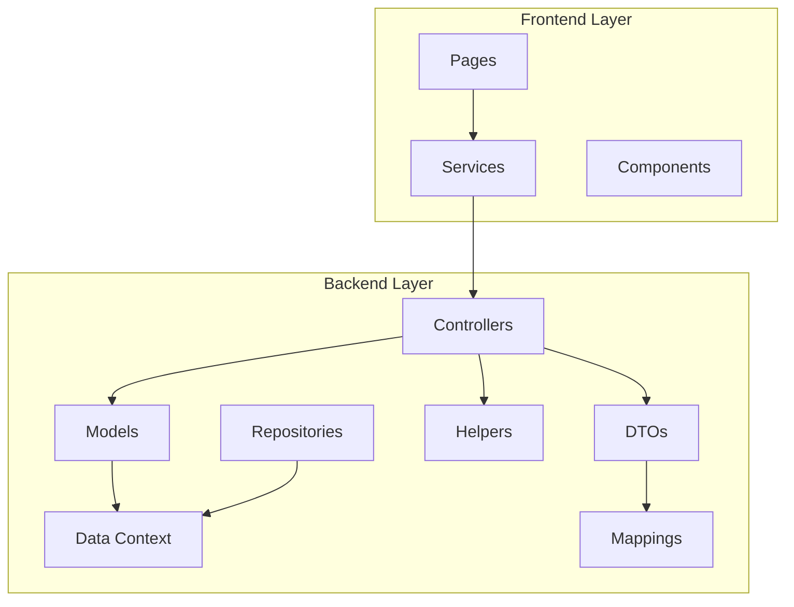
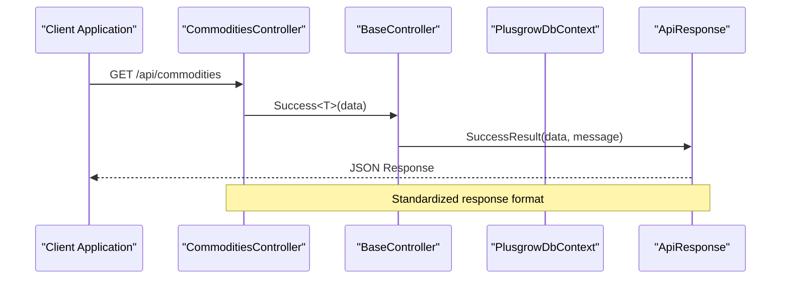
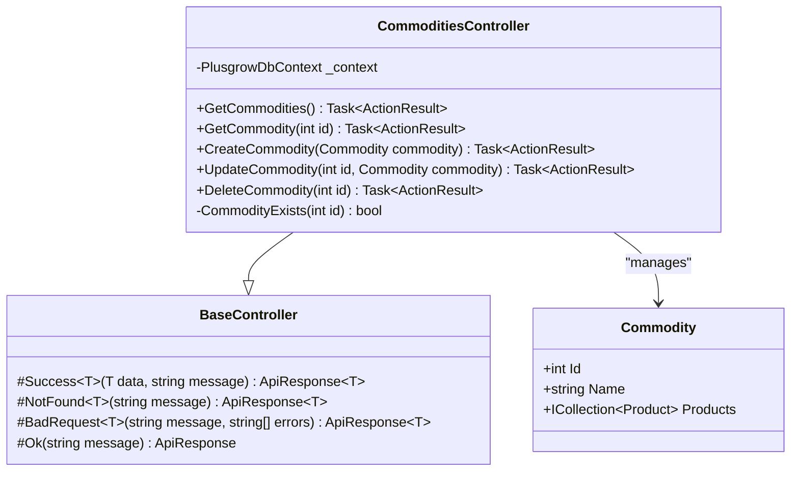
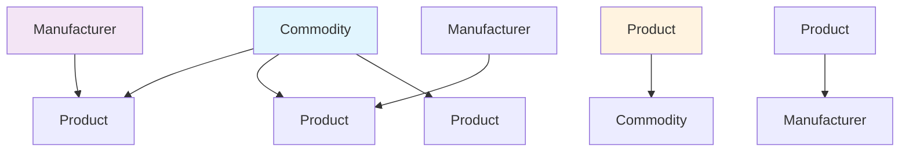
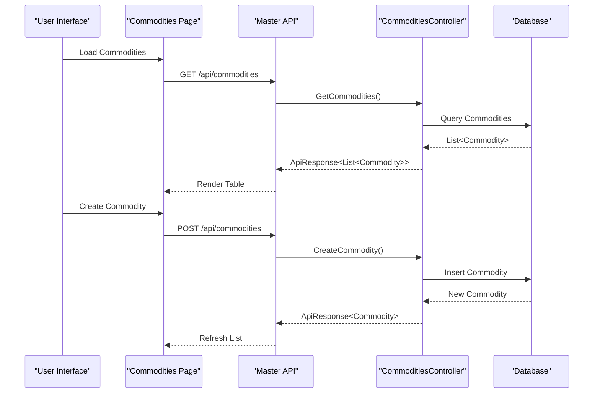

# Commodities API

<cite>
**Referenced Files in This Document**
- [CommoditiesController.cs](file://Backend/PlusgrowWms.Api/Controllers/CommoditiesController.cs)
- [BaseController.cs](file://Backend/PlusgrowWms.Api/Controllers/BaseController.cs)
- [Commodity.cs](file://Backend/PlusgrowWms.Api/Models/Commodity.cs)
- [Product.cs](file://Backend/PlusgrowWms.Api/Models/Product.cs)
- [PlusgrowDbContext.cs](file://Backend/PlusgrowWms.Api/Data/PlusgrowDbContext.cs)
- [ApiResponse.cs](file://Backend/PlusgrowWms.Api/Helpers/ApiResponse.cs)
- [MappingProfile.cs](file://Backend/PlusgrowWms.Api/Mappings/MappingProfile.cs)
- [CommonDto.cs](file://Backend/PlusgrowWms.Api/DTOs/CommonDto.cs)
- [GenericRepository.cs](file://Backend/PlusgrowWms.Api/Repositories/GenericRepository.cs)
- [Commodities.tsx](file://Frontend/src/pages/Commodities.tsx)
</cite>

## Table of Contents
1. [Introduction](#introduction)
2. [Project Structure](#project-structure)
3. [Core Components](#core-components)
4. [Architecture Overview](#architecture-overview)
5. [Detailed Component Analysis](#detailed-component-analysis)
6. [API Endpoints](#api-endpoints)
7. [Data Model Relationships](#data-model-relationships)
8. [Frontend Integration](#frontend-integration)
9. [Performance Considerations](#performance-considerations)
10. [Error Handling](#error-handling)
11. [Conclusion](#conclusion)

## Introduction

The Commodities API is a core component of the Plusgrow WMS (Warehouse Management System) that manages product categories and classifications. This API provides CRUD operations for commodities (product categories) and integrates seamlessly with the broader WMS ecosystem. The system follows modern ASP.NET Core patterns with Entity Framework Core for data persistence, AutoMapper for object mapping, and a standardized API response structure.

The commodities functionality serves as the foundation for product categorization, enabling efficient inventory management and reporting capabilities throughout the warehouse operations.

## Project Structure

The Commodities API is structured following clean architecture principles with clear separation of concerns:



**Diagram sources**
- [CommoditiesController.cs:1-81](file://Backend/PlusgrowWms.Api/Controllers/CommoditiesController.cs#L1-L81)
- [PlusgrowDbContext.cs:1-92](file://Backend/PlusgrowWms.Api/Data/PlusgrowDbContext.cs#L1-L92)

**Section sources**
- [CommoditiesController.cs:1-81](file://Backend/PlusgrowWms.Api/Controllers/CommoditiesController.cs#L1-L81)
- [PlusgrowDbContext.cs:1-92](file://Backend/PlusgrowWms.Api/Data/PlusgrowDbContext.cs#L1-L92)

## Core Components

### Controller Layer
The CommoditiesController extends BaseController to inherit standardized response handling capabilities. It implements RESTful endpoints for commodity management with proper HTTP status codes and error handling.

### Data Access Layer
The PlusgrowDbContext manages database connections and configurations, including entity relationships and indexing strategies optimized for performance.

### Model Layer
The Commodity model defines the core entity structure with validation attributes and relationship configurations for seamless integration with products.

### Response Management
The ApiResponse helper provides consistent JSON response formatting across all API endpoints, supporting both success and error scenarios with appropriate HTTP status codes.

**Section sources**
- [BaseController.cs:1-69](file://Backend/PlusgrowWms.Api/Controllers/BaseController.cs#L1-L69)
- [ApiResponse.cs:1-159](file://Backend/PlusgrowWms.Api/Helpers/ApiResponse.cs#L1-L159)

## Architecture Overview

The Commodities API follows a layered architecture pattern designed for maintainability and scalability:



**Diagram sources**
- [CommoditiesController.cs:20-25](file://Backend/PlusgrowWms.Api/Controllers/CommoditiesController.cs#L20-L25)
- [BaseController.cs:16-19](file://Backend/PlusgrowWms.Api/Controllers/BaseController.cs#L16-L19)
- [ApiResponse.cs:41-49](file://Backend/PlusgrowWms.Api/Helpers/ApiResponse.cs#L41-L49)

The architecture ensures loose coupling between components while maintaining clear responsibility boundaries and consistent error handling across all operations.

## Detailed Component Analysis

### CommoditiesController Implementation

The CommoditiesController provides comprehensive CRUD operations with built-in validation and error handling:



**Diagram sources**
- [CommoditiesController.cs:11-80](file://Backend/PlusgrowWms.Api/Controllers/CommoditiesController.cs#L11-L80)
- [BaseController.cs:11-68](file://Backend/PlusgrowWms.Api/Controllers/BaseController.cs#L11-L68)
- [Commodity.cs:8-21](file://Backend/PlusgrowWms.Api/Models/Commodity.cs#L8-L21)

### Data Model Design

The Commodity entity is designed with validation constraints and relationship mappings:

| Property | Type | Constraints | Description |
|----------|------|-------------|-------------|
| Id | int | Primary Key | Unique identifier for the commodity |
| Name | string | Required, MaxLength(150) | Display name of the commodity category |
| Products | ICollection<Product> | Navigation property | Related products in this commodity category |

**Section sources**
- [Commodity.cs:1-22](file://Backend/PlusgrowWms.Api/Models/Commodity.cs#L1-L22)

### Database Context Configuration

The PlusgrowDbContext establishes entity relationships and performance optimizations:

```mermaid
erDiagram
COMMODITIES {
int id PK
string name UK
}
PRODUCTS {
int id PK
string name
string sku UK
int? commodity_id FK
int? manufacturer_id FK
}
MANUFACTURERS {
int id PK
string name
string country
}
COMMODITIES ||--o{ PRODUCTS : "has many"
MANUFACTURERS ||--o{ PRODUCTS : "has many"
```

**Diagram sources**
- [PlusgrowDbContext.cs:12-18](file://Backend/PlusgrowWms.Api/Data/PlusgrowDbContext.cs#L12-L18)
- [PlusgrowDbContext.cs:32-43](file://Backend/PlusgrowWms.Api/Data/PlusgrowDbContext.cs#L32-L43)

**Section sources**
- [PlusgrowDbContext.cs:20-90](file://Backend/PlusgrowWms.Api/Data/PlusgrowDbContext.cs#L20-L90)

## API Endpoints

The Commodities API exposes the following RESTful endpoints:

### GET /api/commodities
Retrieves all commodities from the database with full details.

**Response Format:**
```json
{
  "success": true,
  "message": "Operation completed successfully",
  "data": [
    {
      "id": 1,
      "name": "Organic Fruits"
    }
  ],
  "timestamp": "2024-01-01T00:00:00Z"
}
```

### GET /api/commodities/{id}
Retrieves a specific commodity by its unique identifier.

**Response Format:**
```json
{
  "success": true,
  "message": "Operation completed successfully",
  "data": {
    "id": 1,
    "name": "Organic Fruits"
  },
  "timestamp": "2024-01-01T00:00:00Z"
}
```

### POST /api/commodities
Creates a new commodity with the provided details.

**Request Body:**
```json
{
  "name": "Organic Vegetables"
}
```

**Response Format:**
```json
{
  "success": true,
  "message": "Commodity created successfully",
  "data": {
    "id": 2,
    "name": "Organic Vegetables"
  },
  "timestamp": "2024-01-01T00:00:00Z"
}
```

### PUT /api/commodities/{id}
Updates an existing commodity with new information.

**Request Body:**
```json
{
  "id": 1,
  "name": "Premium Organic Fruits"
}
```

**Response Format:**
```json
{
  "success": true,
  "message": "Commodity updated successfully",
  "data": {
    "id": 1,
    "name": "Premium Organic Fruits"
  },
  "timestamp": "2024-01-01T00:00:00Z"
}
```

### DELETE /api/commodities/{id}
Removes a commodity and all associated products from the database.

**Response Format:**
```json
{
  "success": true,
  "message": "Commodity deleted successfully",
  "timestamp": "2024-01-01T00:00:00Z"
}
```

**Section sources**
- [CommoditiesController.cs:20-77](file://Backend/PlusgrowWms.Api/Controllers/CommoditiesController.cs#L20-L77)

## Data Model Relationships

The commodities system maintains relationships with products and manufacturers:



**Diagram sources**
- [Product.cs:26-60](file://Backend/PlusgrowWms.Api/Models/Product.cs#L26-L60)
- [PlusgrowDbContext.cs:32-43](file://Backend/PlusgrowWms.Api/Data/PlusgrowDbContext.cs#L32-L43)

The relationship configuration ensures referential integrity and supports cascading operations for data consistency.

**Section sources**
- [Product.cs:1-65](file://Backend/PlusgrowWms.Api/Models/Product.cs#L1-L65)
- [PlusgrowDbContext.cs:31-43](file://Backend/PlusgrowWms.Api/Data/PlusgrowDbContext.cs#L31-L43)

## Frontend Integration

The frontend Commodities page provides a comprehensive interface for managing commodity categories:



**Diagram sources**
- [Commodities.tsx:29-39](file://Frontend/src/pages/Commodities.tsx#L29-L39)
- [Commodities.tsx:41-64](file://Frontend/src/pages/Commodities.tsx#L41-L64)

The frontend implementation includes comprehensive form validation, loading states, and user feedback mechanisms.

**Section sources**
- [Commodities.tsx:1-231](file://Frontend/src/pages/Commodities.tsx#L1-L231)

## Performance Considerations

The Commodities API incorporates several performance optimizations:

### Database Indexing
- Unique index on commodity names for fast lookups
- Composite indexes on frequently queried fields
- Optimized foreign key relationships with cascade delete

### Entity Framework Optimization
- Asynchronous database operations to prevent blocking
- Efficient query patterns with minimal data transfer
- Proper connection management and pooling

### API Response Optimization
- Consistent response format reduces client-side parsing overhead
- Minimal payload sizes with only necessary fields
- Built-in pagination support for large datasets

**Section sources**
- [PlusgrowDbContext.cs:46-90](file://Backend/PlusgrowWms.Api/Data/PlusgrowDbContext.cs#L46-L90)

## Error Handling

The API implements comprehensive error handling strategies:

### Validation Errors
- Input validation using Data Annotations
- Specific error messages for invalid operations
- Proper HTTP status code responses

### Concurrency Handling
- Database concurrency conflict detection
- Graceful handling of simultaneous updates
- Clear error messaging for conflicting operations

### Resource Management
- Proper disposal of database connections
- Exception logging and monitoring
- Graceful degradation for unavailable resources

**Section sources**
- [CommoditiesController.cs:52-63](file://Backend/PlusgrowWms.Api/Controllers/CommoditiesController.cs#L52-L63)
- [BaseController.cs:32-51](file://Backend/PlusgrowWms.Api/Controllers/BaseController.cs#L32-L51)

## Conclusion

The Commodities API represents a well-architected solution for product category management within the Plusgrow WMS ecosystem. Its design emphasizes maintainability, performance, and user experience through:

- Clean separation of concerns with layered architecture
- Comprehensive CRUD operations with proper validation
- Consistent API response patterns
- Robust error handling and performance optimizations
- Seamless frontend integration with real-time updates

The system provides a solid foundation for scalable warehouse management operations while maintaining flexibility for future enhancements and extensions.