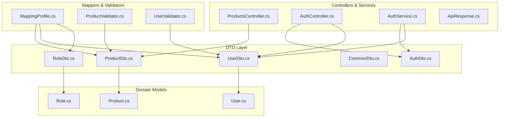
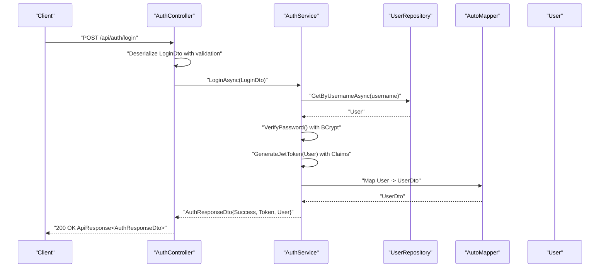
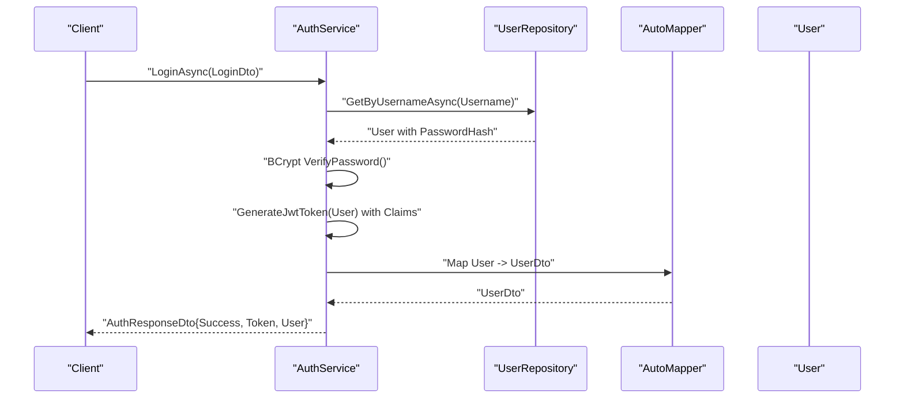
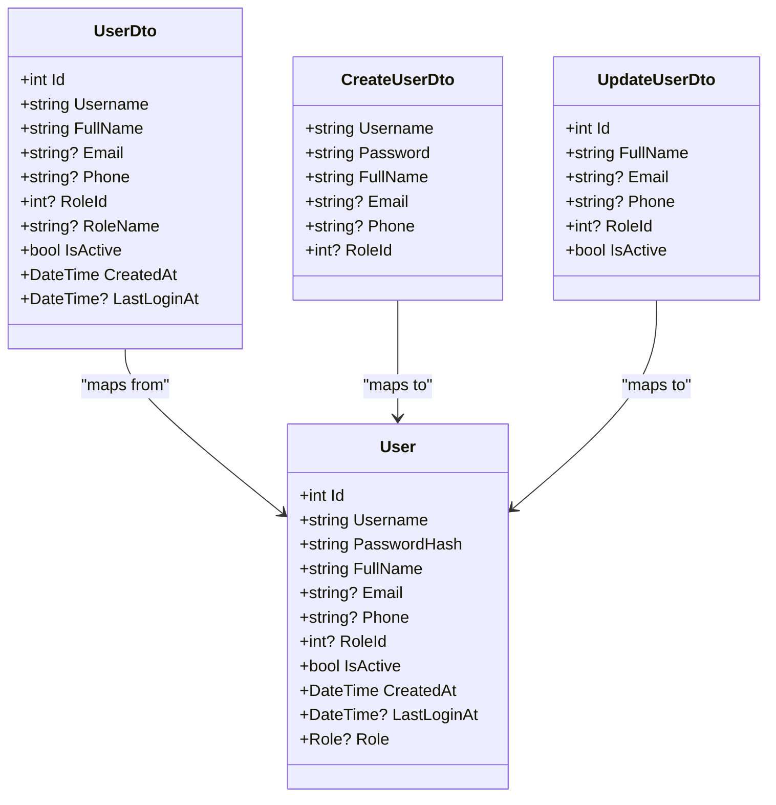
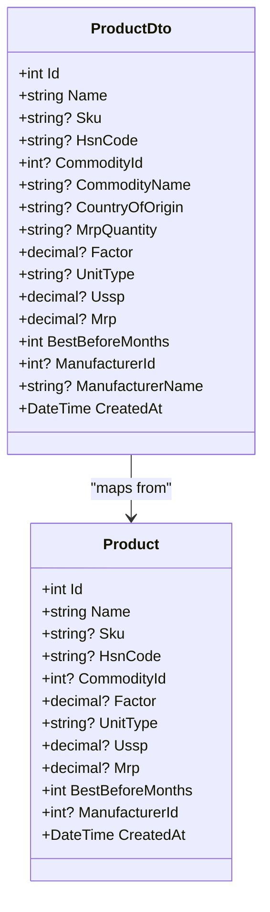
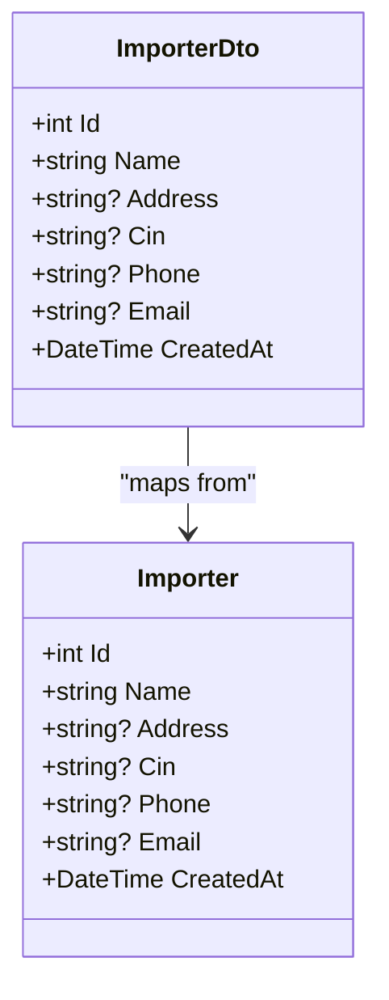
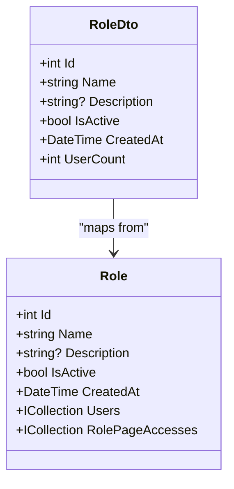
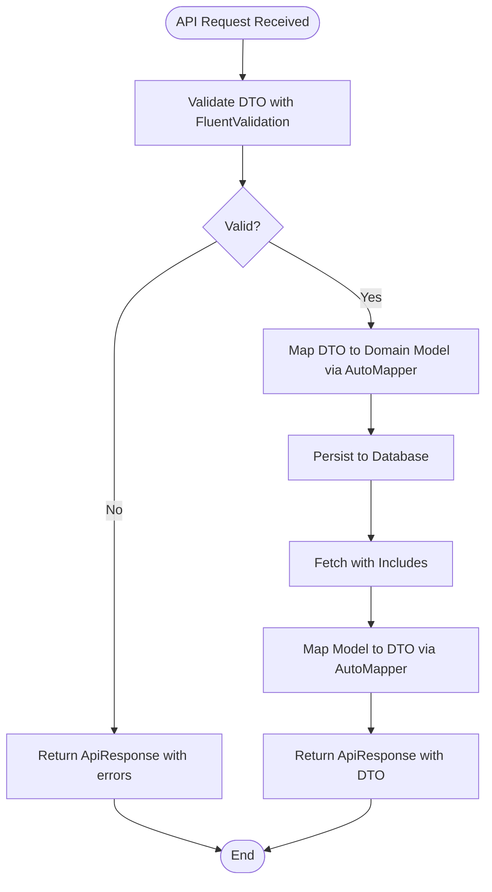
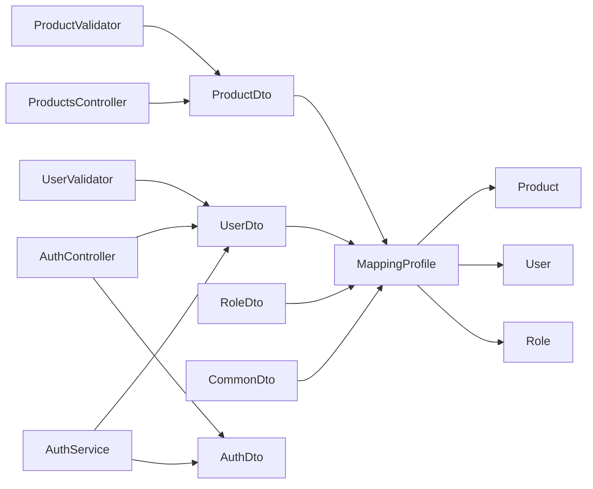

# DTO Structures and Models

<cite>
**Referenced Files in This Document**
- [ProductDto.cs](file://Backend/PlusgrowWms.Api/DTOs/ProductDto.cs)
- [AuthDto.cs](file://Backend/PlusgrowWms.Api/DTOs/AuthDto.cs)
- [UserDto.cs](file://Backend/PlusgrowWms.Api/DTOs/UserDto.cs)
- [CommonDto.cs](file://Backend/PlusgrowWms.Api/DTOs/CommonDto.cs)
- [RoleDto.cs](file://Backend/PlusgrowWms.Api/DTOs/RoleDto.cs)
- [MappingProfile.cs](file://Backend/PlusgrowWms.Api/Mappings/MappingProfile.cs)
- [ProductValidator.cs](file://Backend/PlusgrowWms.Api/Validators/ProductValidator.cs)
- [UserValidator.cs](file://Backend/PlusgrowWms.Api/Validators/UserValidator.cs)
- [Product.cs](file://Backend/PlusgrowWms.Api/Models/Product.cs)
- [User.cs](file://Backend/PlusgrowWms.Api/Models/User.cs)
- [Role.cs](file://Backend/PlusgrowWms.Api/Models/Role.cs)
- [ProductsController.cs](file://Backend/PlusgrowWms.Api/Controllers/ProductsController.cs)
- [AuthService.cs](file://Backend/PlusgrowWms.Api/Services/AuthService.cs)
- [ApiResponse.cs](file://Backend/PlusgrowWms.Api/Helpers/ApiResponse.cs)
- [AuthController.cs](file://Backend/PlusgrowWms.Api/Controllers/AuthController.cs)
</cite>

## Update Summary
**Changes Made**
- Enhanced DTO validation patterns with improved FluentValidation rules and comprehensive field constraints
- Updated authentication DTO structures with better token handling and JWT configuration integration
- Improved user DTO serialization behavior with enhanced role resolution and timestamp handling
- Strengthened product DTO validation with stricter pricing and factor constraints
- Enhanced frontend service integration patterns with standardized response formats and pagination support

## Table of Contents
1. [Introduction](#introduction)
2. [Project Structure](#project-structure)
3. [Core Components](#core-components)
4. [Architecture Overview](#architecture-overview)
5. [Detailed Component Analysis](#detailed-component-analysis)
6. [Enhanced Validation Patterns](#enhanced-validation-patterns)
7. [Frontend Integration Patterns](#frontend-integration-patterns)
8. [Dependency Analysis](#dependency-analysis)
9. [Performance Considerations](#performance-considerations)
10. [Troubleshooting Guide](#troubleshooting-guide)
11. [Conclusion](#conclusion)

## Introduction
This document provides comprehensive documentation for all Data Transfer Object (DTO) structures used in the PlusGrow WMS API. It covers ProductDto for product information, pricing, specifications, and relationship properties; AuthDto for authentication requests and responses with enhanced token handling; UserDto for user management with improved serialization patterns; CommonDto patterns for standardized entities; and RoleDto for authorization structures. The document explains validation rules, serialization behavior, mapping from domain models, usage examples in API requests/responses, transformation patterns, and best practices for data transfer across layers with enhanced frontend service integration.

## Project Structure
The DTOs reside under the backend project in the DTOs folder alongside supporting components such as mapping profiles, validators, and domain models. Controllers orchestrate API endpoints with enhanced validation, while services handle business logic and authentication flows with improved security measures and standardized response patterns.

**Diagram sources**
- [ProductDto.cs:1-55](file://Backend/PlusgrowWms.Api/DTOs/ProductDto.cs#L1-L55)
- [AuthDto.cs:1-24](file://Backend/PlusgrowWms.Api/DTOs/AuthDto.cs#L1-L24)
- [UserDto.cs:1-43](file://Backend/PlusgrowWms.Api/DTOs/UserDto.cs#L1-L43)
- [CommonDto.cs:1-47](file://Backend/PlusgrowWms.Api/DTOs/CommonDto.cs#L1-L47)
- [RoleDto.cs:1-52](file://Backend/PlusgrowWms.Api/DTOs/RoleDto.cs#L1-L52)
- [MappingProfile.cs:1-56](file://Backend/PlusgrowWms.Api/Mappings/MappingProfile.cs#L1-L56)
- [ProductValidator.cs:1-33](file://Backend/PlusgrowWms.Api/Validators/ProductValidator.cs#L1-L33)
- [UserValidator.cs:1-64](file://Backend/PlusgrowWms.Api/Validators/UserValidator.cs#L1-L64)
- [Product.cs:1-65](file://Backend/PlusgrowWms.Api/Models/Product.cs#L1-L65)
- [User.cs:1-51](file://Backend/PlusgrowWms.Api/Models/User.cs#L1-L51)
- [Role.cs:1-31](file://Backend/PlusgrowWms.Api/Models/Role.cs#L1-L31)
- [ProductsController.cs:1-117](file://Backend/PlusgrowWms.Api/Controllers/ProductsController.cs#L1-L117)
- [AuthController.cs:1-170](file://Backend/PlusgrowWms.Api/Controllers/AuthController.cs#L1-L170)
- [AuthService.cs:1-236](file://Backend/PlusgrowWms.Api/Services/AuthService.cs#L1-L236)
- [ApiResponse.cs](file://Backend/PlusgrowWms.Api/Helpers/ApiResponse.cs)

**Section sources**
- [ProductDto.cs:1-55](file://Backend/PlusgrowWms.Api/DTOs/ProductDto.cs#L1-L55)
- [AuthDto.cs:1-24](file://Backend/PlusgrowWms.Api/DTOs/AuthDto.cs#L1-L24)
- [UserDto.cs:1-43](file://Backend/PlusgrowWms.Api/DTOs/UserDto.cs#L1-L43)
- [CommonDto.cs:1-47](file://Backend/PlusgrowWms.Api/DTOs/CommonDto.cs#L1-L47)
- [RoleDto.cs:1-52](file://Backend/PlusgrowWms.Api/DTOs/RoleDto.cs#L1-L52)
- [MappingProfile.cs:1-56](file://Backend/PlusgrowWms.Api/Mappings/MappingProfile.cs#L1-L56)
- [ProductValidator.cs:1-33](file://Backend/PlusgrowWms.Api/Validators/ProductValidator.cs#L1-L33)
- [UserValidator.cs:1-64](file://Backend/PlusgrowWms.Api/Validators/UserValidator.cs#L1-L64)
- [Product.cs:1-65](file://Backend/PlusgrowWms.Api/Models/Product.cs#L1-L65)
- [User.cs:1-51](file://Backend/PlusgrowWms.Api/Models/User.cs#L1-L51)
- [Role.cs:1-31](file://Backend/PlusgrowWms.Api/Models/Role.cs#L1-L31)
- [ProductsController.cs:1-117](file://Backend/PlusgrowWms.Api/Controllers/ProductsController.cs#L1-L117)
- [AuthController.cs:1-170](file://Backend/PlusgrowWms.Api/Controllers/AuthController.cs#L1-L170)
- [AuthService.cs:1-236](file://Backend/PlusgrowWms.Api/Services/AuthService.cs#L1-L236)
- [ApiResponse.cs](file://Backend/PlusgrowWms.Api/Helpers/ApiResponse.cs)

## Core Components
This section documents each DTO type with its purpose, fields, validation rules, and mapping behavior with enhanced validation patterns.

### Enhanced Authentication DTO Family
- **LoginDto**: Authentication request with username and password fields for secure authentication.
- **AuthResponseDto**: Enhanced response with success flag, optional token, message, and embedded UserDto for comprehensive user data transfer.
- **JwtSettingsDto**: JWT configuration container with key, issuer, audience, and expiry minutes for secure token handling.
- **Enhanced Features**: Improved token handling with BCrypt password verification, role-based claims, and comprehensive user data serialization.

### Comprehensive User DTO Family
- **UserDto**: Enhanced projection of user with role name resolution, timestamps, and comprehensive contact information.
- **CreateUserDto**: Registration payload with password and role assignment including enhanced validation rules.
- **UpdateUserDto**: Partial update payload for profile and role changes with improved serialization behavior.
- **ChangePasswordDto**: Password change request with validation and enhanced security checks.
- **Enhanced Features**: Additional fields for improved serialization, comprehensive validation rules, and secure password handling.

### Product DTO Family
- **ProductDto**: Read-only projection of product with commodity and manufacturer names resolved.
- **CreateProductDto**: Creation payload with defaults and numeric validations.
- **UpdateProductDto**: Patch/update payload mirroring creation fields.
- **Validation rules**: ProductValidator enforces non-empty name length limits, optional SKU/HSN constraints, and non-negative MRP/USSP with positive factor.
- **Mapping**: AutoMapper projects Product to ProductDto and ignores navigation properties during reverse mapping.

### Common DTO Family
- **ImporterDto/CreateImporterDto**: Importer entity DTOs.
- **ManufacturerDto/CreateManufacturerDto**: Manufacturer entity DTOs.
- **CommodityDto/CreateCommodityDto**: Commodity entity DTOs.
- **Mapping**: AutoMapper configured for straightforward projections.

### Role DTO Family
- **RoleDto**: Role with user count aggregation.
- **CreateRoleDto/UpdateRoleDto**: Role creation and update payloads.
- **RolePageAccessDto/UpdateRolePageAccessDto/RolePageAccessItemDto**: Authorization page access controls per role.
- **Mapping**: AutoMapper configured for role and page access DTOs.

**Section sources**
- [AuthDto.cs:1-24](file://Backend/PlusgrowWms.Api/DTOs/AuthDto.cs#L1-L24)
- [UserDto.cs:1-43](file://Backend/PlusgrowWms.Api/DTOs/UserDto.cs#L1-L43)
- [ProductDto.cs:1-55](file://Backend/PlusgrowWms.Api/DTOs/ProductDto.cs#L1-L55)
- [CommonDto.cs:1-47](file://Backend/PlusgrowWms.Api/DTOs/CommonDto.cs#L1-L47)
- [RoleDto.cs:1-52](file://Backend/PlusgrowWms.Api/DTOs/RoleDto.cs#L1-L52)
- [ProductValidator.cs:1-33](file://Backend/PlusgrowWms.Api/Validators/ProductValidator.cs#L1-L33)
- [UserValidator.cs:1-64](file://Backend/PlusgrowWms.Api/Validators/UserValidator.cs#L1-L64)
- [MappingProfile.cs:1-56](file://Backend/PlusgrowWms.Api/Mappings/MappingProfile.cs#L1-L56)

## Architecture Overview
The API follows a layered architecture with DTOs decoupling transport from domain models. Controllers receive DTOs with enhanced validation, services orchestrate business logic with improved security measures, and AutoMapper handles model-to-DTO transformations. Validators enforce input constraints before persistence with comprehensive validation rules.

**Diagram sources**
- [AuthController.cs:25-43](file://Backend/PlusgrowWms.Api/Controllers/AuthController.cs#L25-L43)
- [AuthService.cs:39-103](file://Backend/PlusgrowWms.Api/Services/AuthService.cs#L39-L103)
- [UserDto.cs:1-43](file://Backend/PlusgrowWms.Api/DTOs/UserDto.cs#L1-L43)
- [AuthDto.cs:1-24](file://Backend/PlusgrowWms.Api/DTOs/AuthDto.cs#L1-L24)
- [MappingProfile.cs:1-56](file://Backend/PlusgrowWms.Api/Mappings/MappingProfile.cs#L1-L56)

## Detailed Component Analysis

### Enhanced Authentication DTO Family
- **LoginDto**: Request with Username and Password fields for secure authentication.
- **AuthResponseDto**: Enhanced response with Success flag, optional Token, Message, and embedded UserDto for comprehensive user data transfer.
- **JwtSettingsDto**: JWT configuration keys and expiration settings for secure token handling.
- **Enhanced Usage patterns**:
  - Login flow: AuthService.LoginAsync authenticates user with BCrypt verification, updates last login, generates JWT with role claims, and returns AuthResponseDto with UserDto populated.
  - Registration flow: AuthService.RegisterAsync creates a new user with hashed password and returns a success response without token.
  - Token refresh: AuthService.RefreshTokenAsync regenerates JWT with updated claims and returns updated AuthResponseDto.

**Diagram sources**
- [AuthService.cs:39-103](file://Backend/PlusgrowWms.Api/Services/AuthService.cs#L39-L103)
- [AuthDto.cs:3-15](file://Backend/PlusgrowWms.Api/DTOs/AuthDto.cs#L3-L15)
- [UserDto.cs:3-15](file://Backend/PlusgrowWms.Api/DTOs/UserDto.cs#L3-L15)
- [MappingProfile.cs:12-20](file://Backend/PlusgrowWms.Api/Mappings/MappingProfile.cs#L12-L20)

**Section sources**
- [AuthDto.cs:1-24](file://Backend/PlusgrowWms.Api/DTOs/AuthDto.cs#L1-L24)
- [AuthService.cs:39-103](file://Backend/PlusgrowWms.Api/Services/AuthService.cs#L39-L103)
- [MappingProfile.cs:12-20](file://Backend/PlusgrowWms.Api/Mappings/MappingProfile.cs#L12-L20)

### Enhanced User DTO Family
- **UserDto**: Comprehensive projection of user identity, contact info, role association, status, and timestamps with enhanced serialization.
- **CreateUserDto**: Registration payload including password and optional role assignment with enhanced validation.
- **UpdateUserDto**: Partial update payload for profile and role changes with improved serialization behavior.
- **ChangePasswordDto**: Password change request with validation and enhanced security checks.
- **Enhanced Validation rules**:
  - CreateUserValidator: Username/Password/FullName length constraints, email format, phone length with enhanced security.
  - UpdateUserValidator: Requires valid ID, name/email constraints with improved validation.
  - ChangePasswordValidator: Enforces non-empty passwords and difference from current with enhanced security checks.
- **Enhanced Mapping**:
  - Role name is projected from Role navigation property with improved error handling.
  - PasswordHash and Role navigation are ignored during reverse mapping to prevent leakage and unintended persistence.

**Diagram sources**
- [User.cs:1-51](file://Backend/PlusgrowWms.Api/Models/User.cs#L1-L51)
- [UserDto.cs:1-43](file://Backend/PlusgrowWms.Api/DTOs/UserDto.cs#L1-L43)
- [MappingProfile.cs:11-21](file://Backend/PlusgrowWms.Api/Mappings/MappingProfile.cs#L11-L21)
- [UserValidator.cs:6-64](file://Backend/PlusgrowWms.Api/Validators/UserValidator.cs#L6-L64)

**Section sources**
- [UserDto.cs:1-43](file://Backend/PlusgrowWms.Api/DTOs/UserDto.cs#L1-L43)
- [UserValidator.cs:1-64](file://Backend/PlusgrowWms.Api/Validators/UserValidator.cs#L1-L64)
- [MappingProfile.cs:11-21](file://Backend/PlusgrowWms.Api/Mappings/MappingProfile.cs#L11-L21)
- [User.cs:1-51](file://Backend/PlusgrowWms.Api/Models/User.cs#L1-L51)

### Product DTO Family
- **Fields and semantics**:
  - Identity and naming: Id, Name, Sku, HsnCode.
  - Relationships: CommodityId/Name, ManufacturerId/Name.
  - Origin and packaging: CountryOfOrigin, MrpQuantity, UnitType.
  - Pricing: Ussp, Mrp, Factor.
  - Shelf life: BestBeforeMonths.
  - Timestamp: CreatedAt.
- **Enhanced Validation**:
  - ProductValidator ensures non-empty product name length limits, optional SKU/HSN constraints, and non-negative MRP/USSP with positive factor.
- **Mapping**:
  - ProductDto resolves CommodityName and ManufacturerName via navigation properties.
  - Reverse mappings ignore navigation properties to prevent unintended persistence of related entities.

**Diagram sources**
- [Product.cs:1-65](file://Backend/PlusgrowWms.Api/Models/Product.cs#L1-L65)
- [ProductDto.cs:1-55](file://Backend/PlusgrowWms.Api/DTOs/ProductDto.cs#L1-L55)
- [MappingProfile.cs:32-41](file://Backend/PlusgrowWms.Api/Mappings/MappingProfile.cs#L32-L41)

**Section sources**
- [ProductDto.cs:1-55](file://Backend/PlusgrowWms.Api/DTOs/ProductDto.cs#L1-L55)
- [ProductValidator.cs:1-33](file://Backend/PlusgrowWms.Api/Validators/ProductValidator.cs#L1-L33)
- [MappingProfile.cs:32-41](file://Backend/PlusgrowWms.Api/Mappings/MappingProfile.cs#L32-L41)
- [Product.cs:1-65](file://Backend/PlusgrowWms.Api/Models/Product.cs#L1-L65)

### Common DTO Patterns
- **ImporterDto/CreateImporterDto**: Importer entity DTOs for supplier/importer management.
- **ManufacturerDto/CreateManufacturerDto**: Manufacturer entity DTOs for brand/origin management.
- **CommodityDto/CreateCommodityDto**: Commodity category DTOs for product classification.
- **Mapping**: Straightforward projections configured in MappingProfile.

**Diagram sources**
- [CommonDto.cs:3-12](file://Backend/PlusgrowWms.Api/DTOs/CommonDto.cs#L3-L12)
- [MappingProfile.cs:43-45](file://Backend/PlusgrowWms.Api/Mappings/MappingProfile.cs#L43-L45)

**Section sources**
- [CommonDto.cs:1-47](file://Backend/PlusgrowWms.Api/DTOs/CommonDto.cs#L1-L47)
- [MappingProfile.cs:43-49](file://Backend/PlusgrowWms.Api/Mappings/MappingProfile.cs#L43-L49)

### Role DTO Family
- **RoleDto**: Role with user count aggregation.
- **CreateRoleDto/UpdateRoleDto**: Role creation and update payloads.
- **RolePageAccessDto/UpdateRolePageAccessDto/RolePageAccessItemDto**: Authorization page access controls per role.
- **Mapping**: AutoMapper configured for role and page access DTOs.

**Diagram sources**
- [Role.cs:1-31](file://Backend/PlusgrowWms.Api/Models/Role.cs#L1-L31)
- [RoleDto.cs:1-52](file://Backend/PlusgrowWms.Api/DTOs/RoleDto.cs#L1-L52)
- [MappingProfile.cs:22-26](file://Backend/PlusgrowWms.Api/Mappings/MappingProfile.cs#L22-L26)

**Section sources**
- [RoleDto.cs:1-52](file://Backend/PlusgrowWms.Api/DTOs/RoleDto.cs#L1-L52)
- [MappingProfile.cs:22-30](file://Backend/PlusgrowWms.Api/Mappings/MappingProfile.cs#L22-L30)
- [Role.cs:1-31](file://Backend/PlusgrowWms.Api/Models/Role.cs#L1-L31)

### Enhanced API Usage Examples and Transformation Patterns
- **Product endpoints**:
  - GET /api/products returns ApiResponse<List<Product>> with Product entities hydrated with related data.
  - POST /api/products accepts Product entity and returns ApiResponse<Product> with includes.
  - Mapping: Controllers operate on Product models; DTOs are used for projections and client-facing responses.
- **Enhanced Authentication endpoints**:
  - Login: POST /api/auth/login consumes LoginDto and produces AuthResponseDto with embedded UserDto and JWT token.
  - Registration: POST /api/auth/register consumes CreateUserDto and produces AuthResponseDto with enhanced security.
  - Token refresh: POST /api/auth/refresh-token generates new JWT token with updated claims.
  - Password change: PUT /api/auth/change-password validates current password and updates with BCrypt hashing.
- **Enhanced Mapping**: AutoMapper transforms User to UserDto for response payloads with improved serialization behavior.

**Diagram sources**
- [ProductValidator.cs:1-33](file://Backend/PlusgrowWms.Api/Validators/ProductValidator.cs#L1-L33)
- [UserValidator.cs:1-64](file://Backend/PlusgrowWms.Api/Validators/UserValidator.cs#L1-L64)
- [MappingProfile.cs:1-56](file://Backend/PlusgrowWms.Api/Mappings/MappingProfile.cs#L1-L56)
- [ProductsController.cs:20-58](file://Backend/PlusgrowWms.Api/Controllers/ProductsController.cs#L20-L58)
- [AuthService.cs:39-142](file://Backend/PlusgrowWms.Api/Services/AuthService.cs#L39-L142)

**Section sources**
- [ProductsController.cs:20-58](file://Backend/PlusgrowWms.Api/Controllers/ProductsController.cs#L20-L58)
- [AuthService.cs:39-142](file://Backend/PlusgrowWms.Api/Services/AuthService.cs#L39-L142)
- [MappingProfile.cs:1-56](file://Backend/PlusgrowWms.Api/Mappings/MappingProfile.cs#L1-L56)

## Enhanced Validation Patterns
The DTO validation system has been strengthened with comprehensive FluentValidation rules that ensure data integrity and security across all API endpoints.

### Product Validation Enhancements
- **Name validation**: Non-empty with maximum 255 character limit
- **SKU validation**: Maximum 100 character limit
- **HSN code validation**: Maximum 20 character limit  
- **Pricing validation**: Non-negative values with enhanced precision handling
- **Factor validation**: Positive decimal values (> 0) with proper validation chaining

### User Validation Enhancements
- **CreateUserValidator**: Username (100 char max), Password (minimum 6 chars), FullName (255 char max), Email format validation, Phone (20 char max)
- **UpdateUserValidator**: ID validation (> 0), FullName constraints, Email format validation
- **ChangePasswordValidator**: User ID validation, Current password verification, New password constraints with difference validation

### Frontend Integration Validation
- **Consistent error messages**: Standardized validation error responses
- **Real-time validation**: Frontend services can consume validation results for immediate feedback
- **Field-specific validation**: Targeted validation rules for each DTO type

**Section sources**
- [ProductValidator.cs:1-33](file://Backend/PlusgrowWms.Api/Validators/ProductValidator.cs#L1-L33)
- [UserValidator.cs:1-64](file://Backend/PlusgrowWms.Api/Validators/UserValidator.cs#L1-L64)

## Frontend Integration Patterns
The enhanced DTO structures provide improved integration patterns for frontend services with standardized response formats and comprehensive validation support.

### Standardized Response Format
- **ApiResponse<T>**: Consistent success/error response structure with JSON serialization
- **Pagination support**: Built-in pagination information for list operations
- **Error handling**: Structured error arrays with detailed validation messages

### Enhanced Token Management
- **JWT configuration**: Centralized JWT settings with configurable expiration
- **Token refresh**: Seamless token refresh mechanism for extended sessions
- **Role-based claims**: Frontend services can access role information from JWT tokens

### Real-time Validation Feedback
- **Field-level validation**: Frontend services can display specific validation errors
- **Immediate feedback**: Validation results help users correct input errors quickly
- **Consistent messaging**: Standardized error messages across all DTO validations

### Enhanced Data Transfer Patterns
- **DTO-specific validation**: Each DTO type has dedicated validation rules
- **Serialization behavior**: Proper JSON serialization with nullable field handling
- **Frontend compatibility**: DTO structures optimized for TypeScript interfaces

**Section sources**
- [ApiResponse.cs:1-159](file://Backend/PlusgrowWms.Api/Helpers/ApiResponse.cs#L1-L159)
- [AuthController.cs:1-170](file://Backend/PlusgrowWms.Api/Controllers/AuthController.cs#L1-L170)
- [AuthService.cs:144-179](file://Backend/PlusgrowWms.Api/Services/AuthService.cs#L144-L179)

## Dependency Analysis
- **DTO-to-model mapping**:
  - AutoMapper profiles define explicit mappings and member transformations for all DTO families with enhanced security.
- **Enhanced Validation pipeline**:
  - FluentValidation validators enforce business rules before model binding and persistence with comprehensive validation rules.
- **Controller-service boundaries**:
  - Controllers accept DTOs and return ApiResponse<T>, ensuring standardized responses with enhanced error handling.
- **Cross-cutting concerns**:
  - JWT generation with BCrypt password hashing and role-based claims are encapsulated in AuthService.

**Diagram sources**
- [MappingProfile.cs:1-56](file://Backend/PlusgrowWms.Api/Mappings/MappingProfile.cs#L1-L56)
- [ProductValidator.cs:1-33](file://Backend/PlusgrowWms.Api/Validators/ProductValidator.cs#L1-L33)
- [UserValidator.cs:1-64](file://Backend/PlusgrowWms.Api/Validators/UserValidator.cs#L1-L64)
- [ProductsController.cs:1-117](file://Backend/PlusgrowWms.Api/Controllers/ProductsController.cs#L1-L117)
- [AuthController.cs:1-170](file://Backend/PlusgrowWms.Api/Controllers/AuthController.cs#L1-L170)
- [AuthService.cs:1-236](file://Backend/PlusgrowWms.Api/Services/AuthService.cs#L1-L236)

**Section sources**
- [MappingProfile.cs:1-56](file://Backend/PlusgrowWms.Api/Mappings/MappingProfile.cs#L1-L56)
- [ProductValidator.cs:1-33](file://Backend/PlusgrowWms.Api/Validators/ProductValidator.cs#L1-L33)
- [UserValidator.cs:1-64](file://Backend/PlusgrowWms.Api/Validators/UserValidator.cs#L1-L64)
- [ProductsController.cs:1-117](file://Backend/PlusgrowWms.Api/Controllers/ProductsController.cs#L1-L117)
- [AuthController.cs:1-170](file://Backend/PlusgrowWms.Api/Controllers/AuthController.cs#L1-L170)
- [AuthService.cs:1-236](file://Backend/PlusgrowWms.Api/Services/AuthService.cs#L1-L236)

## Performance Considerations
- **Prefer DTOs for projections** to minimize payload size and avoid loading unnecessary navigation properties.
- **Use AutoMapper for efficient, consistent mapping** and avoid manual property copying.
- **Apply validation early** to reduce downstream errors and database round trips.
- **For bulk operations**, consider paging and selective field retrieval to optimize network and memory usage.
- **Enhanced Security**: Implement JWT token caching and role-based claims optimization for improved performance.
- **Password Hashing**: Use BCrypt with appropriate work factors for secure password handling without impacting performance significantly.
- **Frontend optimization**: DTO validation reduces server load by catching errors early in the request lifecycle.

## Troubleshooting Guide
- **Enhanced Validation failures**:
  - ProductValidator: Ensure product name length, SKU/HSN constraints, and non-negative pricing with positive factor.
  - UserValidator: Verify username/password/full name length, email format, and phone constraints; for updates, confirm valid ID.
  - ChangePasswordValidator: Confirm new password differs from current and meets minimum length with enhanced security checks.
- **Mapping issues**:
  - Role name and user counts require proper navigation property configuration; ensure related collections are loaded when needed.
- **Enhanced Authentication problems**:
  - Verify JWT configuration values (key, issuer, audience, expiry minutes) and BCrypt password hashing/verification logic.
  - Check role-based claims and token refresh mechanisms.
- **API response anomalies**:
  - Confirm ApiResponse wrapper usage and standardized message formatting for consistent client handling.
  - Verify enhanced error handling and logging for authentication failures.
- **Frontend integration issues**:
  - Check JSON serialization compatibility between DTOs and TypeScript interfaces.
  - Verify validation error message consistency across frontend services.

**Section sources**
- [ProductValidator.cs:1-33](file://Backend/PlusgrowWms.Api/Validators/ProductValidator.cs#L1-L33)
- [UserValidator.cs:1-64](file://Backend/PlusgrowWms.Api/Validators/UserValidator.cs#L1-L64)
- [MappingProfile.cs:1-56](file://Backend/PlusgrowWms.Api/Mappings/MappingProfile.cs#L1-L56)
- [AuthService.cs:144-179](file://Backend/PlusgrowWms.Api/Services/AuthService.cs#L144-L179)
- [ApiResponse.cs](file://Backend/PlusgrowWms.Api/Helpers/ApiResponse.cs)

## Conclusion
The PlusGrow WMS API employs a robust DTO strategy to separate transport concerns from domain models, enforce validation, and streamline cross-layer communication with enhanced security measures and improved frontend integration. Product, User, Role, and Common DTO families are consistently mapped and validated with comprehensive validation rules, enabling scalable and maintainable APIs. The enhanced authentication system with improved token handling, comprehensive user data transfer patterns, and enhanced serialization behaviors ensures reliable data transfer, predictable responses, and secure authentication flows. The strengthened validation patterns provide better error handling and frontend integration support, while the standardized response formats ensure consistent client experiences. Following the documented patterns ensures optimal performance, security, and maintainability across the entire system with enhanced frontend service integration capabilities.