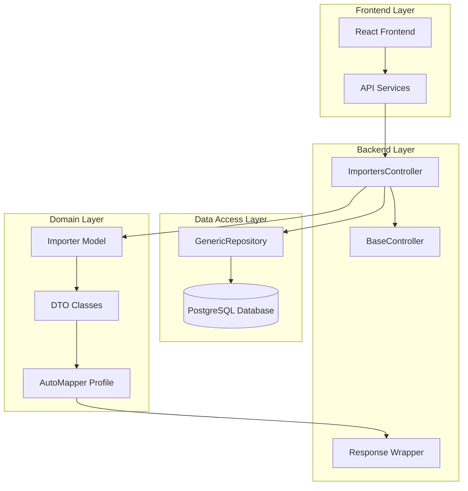
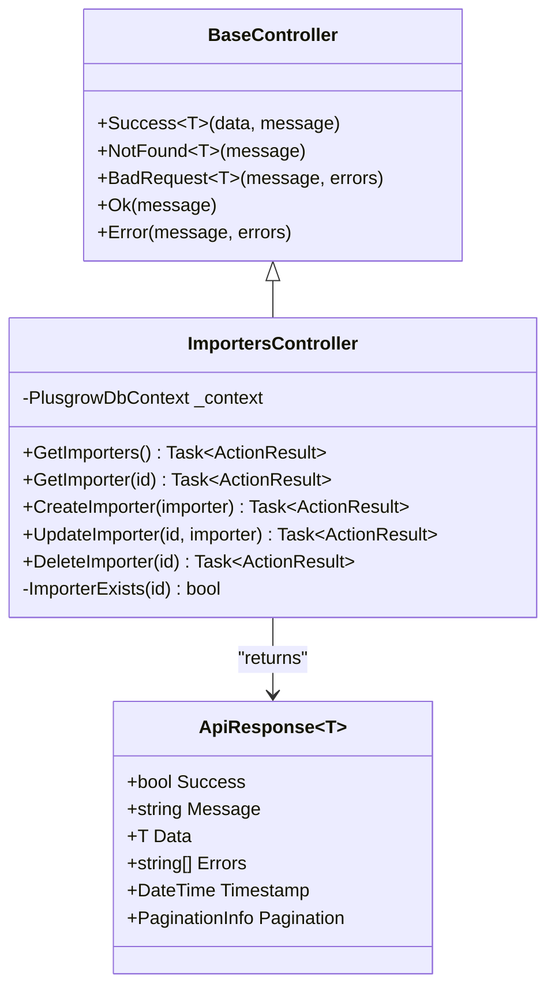
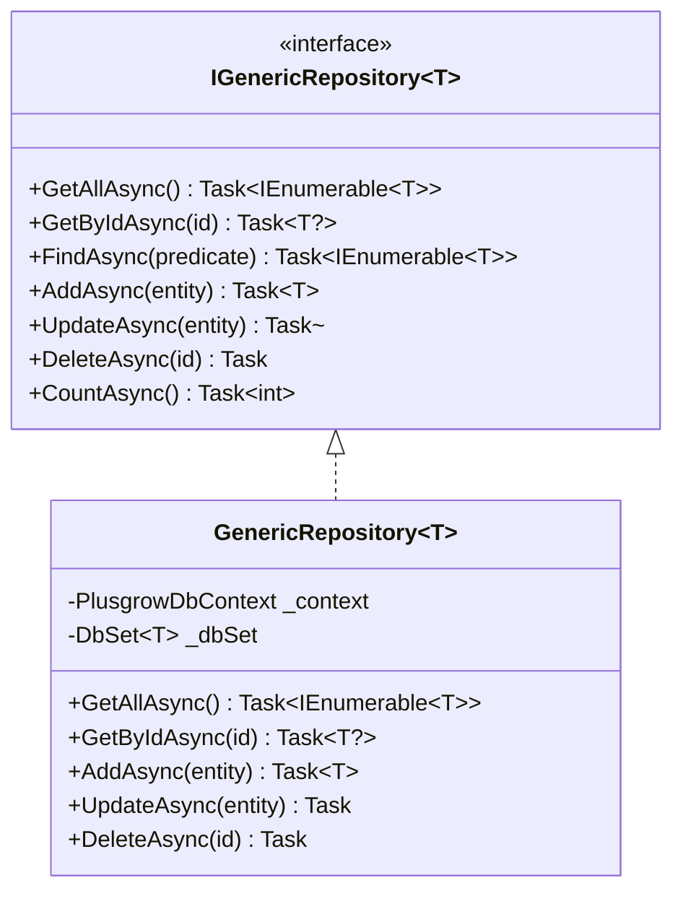
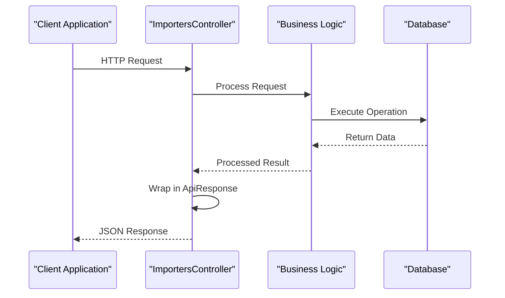
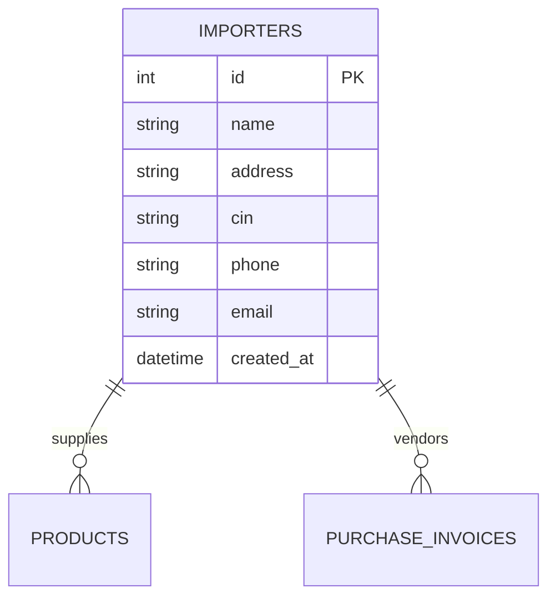
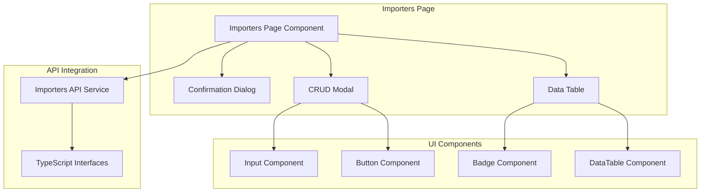
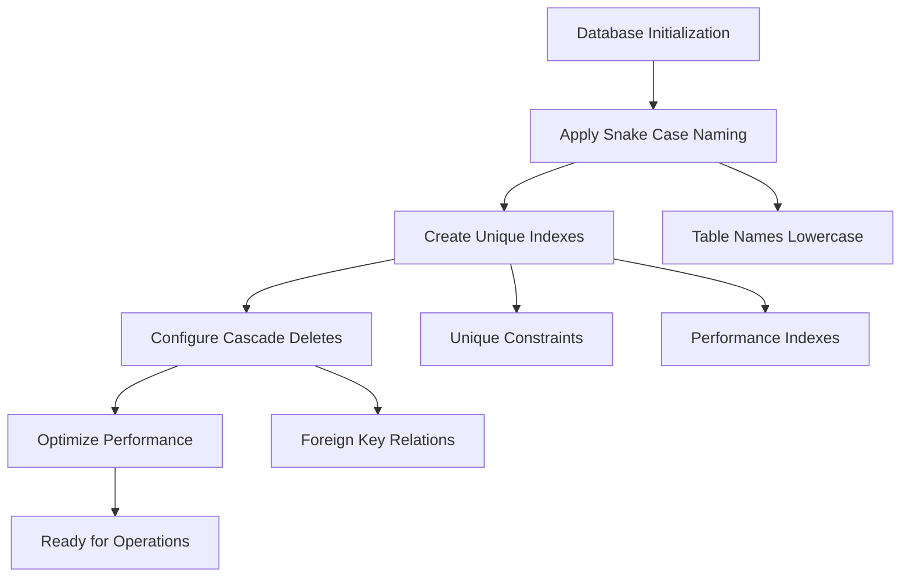
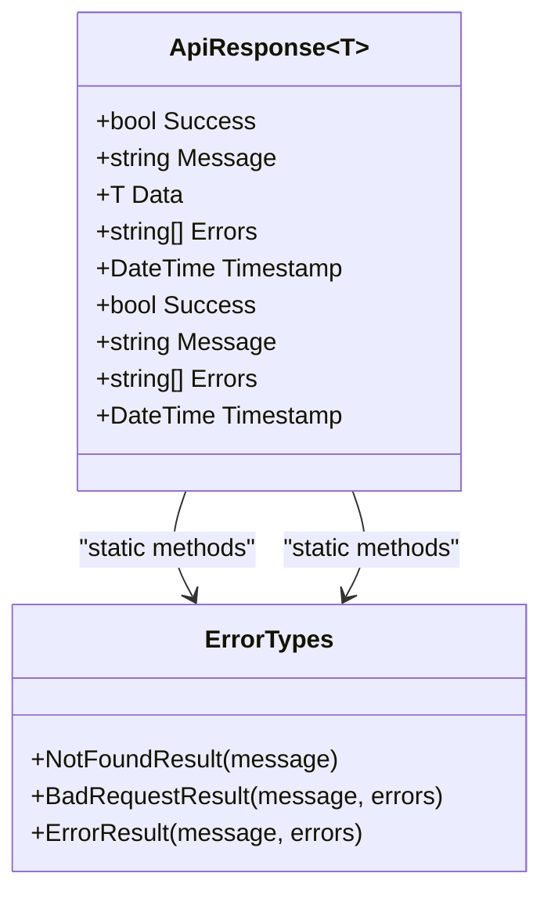
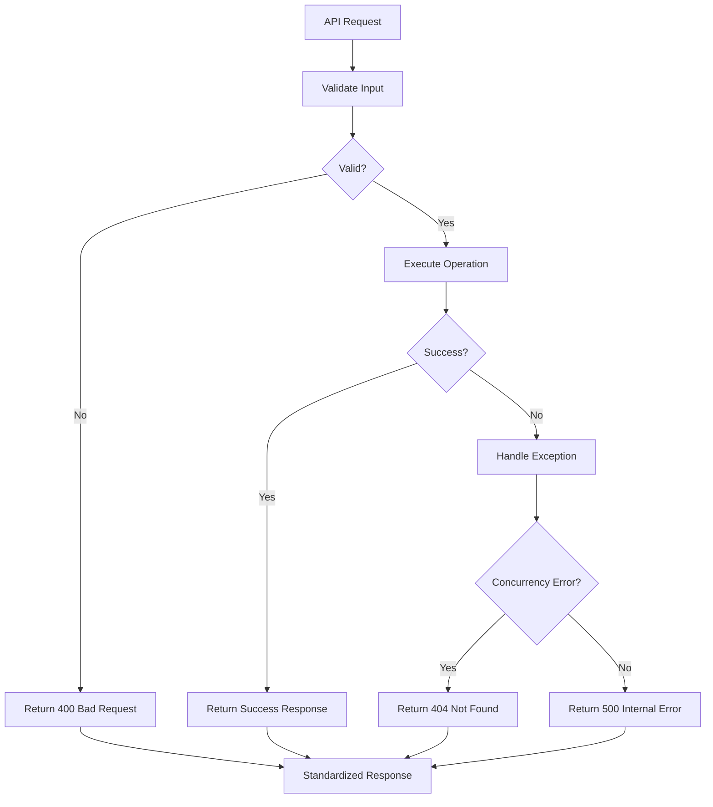

# Importers API

<cite>
**Referenced Files in This Document**
- [ImportersController.cs](file://Backend/PlusgrowWms.Api/Controllers/ImportersController.cs)
- [Importer.cs](file://Backend/PlusgrowWms.Api/Models/Importer.cs)
- [PlusgrowDbContext.cs](file://Backend/PlusgrowWms.Api/Data/PlusgrowDbContext.cs)
- [GenericRepository.cs](file://Backend/PlusgrowWms.Api/Repositories/GenericRepository.cs)
- [CommonDto.cs](file://Backend/PlusgrowWms.Api/DTOs/CommonDto.cs)
- [ApiResponse.cs](file://Backend/PlusgrowWms.Api/Helpers/ApiResponse.cs)
- [BaseController.cs](file://Backend/PlusgrowWms.Api/Controllers/BaseController.cs)
- [MappingProfile.cs](file://Backend/PlusgrowWms.Api/Mappings/MappingProfile.cs)
- [Program.cs](file://Backend/PlusgrowWms.Api/Program.cs)
- [masterApi.ts](file://Frontend/src/services/masterApi.ts)
- [Importers.tsx](file://Frontend/src/pages/Importers.tsx)
- [Sidebar.tsx](file://Frontend/src/components/organisms/Navigation/Sidebar/Sidebar.tsx)
</cite>

## Table of Contents
1. [Introduction](#introduction)
2. [System Architecture](#system-architecture)
3. [Core Components](#core-components)
4. [API Endpoints](#api-endpoints)
5. [Data Model](#data-model)
6. [Frontend Implementation](#frontend-implementation)
7. [Database Schema](#database-schema)
8. [Error Handling](#error-handling)
9. [Performance Considerations](#performance-considerations)
10. [Security Implementation](#security-implementation)
11. [Troubleshooting Guide](#troubleshooting-guide)
12. [Conclusion](#conclusion)

## Introduction

The Importers API is a core component of the Plusgrow Warehouse Management System (WMS) that manages supplier/importer information within the supply chain. This API provides comprehensive CRUD (Create, Read, Update, Delete) operations for managing importer records, including company details, contact information, and identification numbers.

The system follows a modern .NET 8 architecture with clean separation of concerns, implementing best practices for RESTful API design, data validation, and responsive frontend integration. The Importers module serves as a foundational component for inventory management, procurement processes, and supplier relationship management.

## System Architecture

The Importers API follows a layered architecture pattern with clear separation between presentation, business logic, data access, and persistence layers.

**Diagram sources**
- [ImportersController.cs:11-80](file://Backend/PlusgrowWms.Api/Controllers/ImportersController.cs#L11-L80)
- [GenericRepository.cs:22-116](file://Backend/PlusgrowWms.Api/Repositories/GenericRepository.cs#L22-L116)
- [PlusgrowDbContext.cs:6-18](file://Backend/PlusgrowWms.Api/Data/PlusgrowDbContext.cs#L6-L18)

## Core Components

### Backend Controller Implementation

The ImportersController extends the BaseController to inherit standardized response handling capabilities. It implements standard REST endpoints with proper HTTP status codes and error handling.

**Diagram sources**
- [BaseController.cs:11-68](file://Backend/PlusgrowWms.Api/Controllers/BaseController.cs#L11-L68)
- [ImportersController.cs:11-80](file://Backend/PlusgrowWms.Api/Controllers/ImportersController.cs#L11-L80)
- [ApiResponse.cs:8-97](file://Backend/PlusgrowWms.Api/Helpers/ApiResponse.cs#L8-L97)

**Section sources**
- [ImportersController.cs:11-80](file://Backend/PlusgrowWms.Api/Controllers/ImportersController.cs#L11-L80)
- [BaseController.cs:11-68](file://Backend/PlusgrowWms.Api/Controllers/BaseController.cs#L11-L68)

### Data Access Layer

The GenericRepository pattern provides a reusable foundation for data operations across all domain entities, ensuring consistency and reducing code duplication.

**Diagram sources**
- [GenericRepository.cs:7-116](file://Backend/PlusgrowWms.Api/Repositories/GenericRepository.cs#L7-L116)

**Section sources**
- [GenericRepository.cs:22-116](file://Backend/PlusgrowWms.Api/Repositories/GenericRepository.cs#L22-L116)

## API Endpoints

The Importers API exposes a comprehensive set of REST endpoints for full CRUD operations:

### Endpoint Definitions

| Method | Endpoint | Description | Response Type |
|--------|----------|-------------|---------------|
| GET | `/api/importers` | Retrieve all importers | `ApiResponse<List<Importer>>` |
| GET | `/api/importers/{id}` | Get specific importer by ID | `ApiResponse<Importer>` |
| POST | `/api/importers` | Create new importer | `ApiResponse<Importer>` |
| PUT | `/api/importers/{id}` | Update existing importer | `ApiResponse<Importer>` |
| DELETE | `/api/importers/{id}` | Delete importer | `ApiResponse` |

### Request/Response Structure

All API responses follow a consistent structure using the ApiResponse generic wrapper:

**Diagram sources**
- [ImportersController.cs:20-77](file://Backend/PlusgrowWms.Api/Controllers/ImportersController.cs#L20-L77)
- [ApiResponse.cs:5-97](file://Backend/PlusgrowWms.Api/Helpers/ApiResponse.cs#L5-L97)

**Section sources**
- [ImportersController.cs:20-77](file://Backend/PlusgrowWms.Api/Controllers/ImportersController.cs#L20-L77)

## Data Model

The Importer model represents supplier/importer information with comprehensive validation and data constraints.

### Importer Entity Structure

| Property | Type | Validation | Description |
|----------|------|------------|-------------|
| `Id` | `int` | Required, Primary Key | Unique identifier for importer |
| `Name` | `string` | Required, MaxLength 255 | Company/organization name |
| `Address` | `string?` | Nullable, MaxLength 255 | Physical address |
| `Cin` | `string?` | Nullable, MaxLength 50 | Corporate Identification Number |
| `Phone` | `string?` | Nullable, MaxLength 20 | Contact phone number |
| `Email` | `string?` | Nullable, MaxLength 100 | Business email address |
| `CreatedAt` | `DateTime` | Required | Record creation timestamp |

### Database Schema

**Diagram sources**
- [Importer.cs:7-35](file://Backend/PlusgrowWms.Api/Models/Importer.cs#L7-L35)
- [PlusgrowDbContext.cs:85-86](file://Backend/PlusgrowWms.Api/Data/PlusgrowDbContext.cs#L85-L86)

**Section sources**
- [Importer.cs:7-35](file://Backend/PlusgrowWms.Api/Models/Importer.cs#L7-L35)
- [PlusgrowDbContext.cs:85-86](file://Backend/PlusgrowWms.Api/Data/PlusgrowDbContext.cs#L85-L86)

## Frontend Implementation

The frontend provides a comprehensive React-based interface for managing importer records with real-time updates and intuitive user interactions.

### Component Architecture

**Diagram sources**
- [Importers.tsx:12-313](file://Frontend/src/pages/Importers.tsx#L12-L313)
- [masterApi.ts:141-166](file://Frontend/src/services/masterApi.ts#L141-L166)

### User Interface Features

The Importers interface includes:

- **Responsive Data Table**: Displays importer information with search and filtering capabilities
- **Interactive Modals**: Form-based CRUD operations with validation
- **Confirmation Dialogs**: Safe deletion with user confirmation
- **Real-time Updates**: Automatic refresh after CRUD operations
- **Visual Indicators**: Company initials badges and contact information display

**Section sources**
- [Importers.tsx:12-313](file://Frontend/src/pages/Importers.tsx#L12-L313)
- [masterApi.ts:141-166](file://Frontend/src/services/masterApi.ts#L141-L166)

## Database Schema

The database schema is designed with PostgreSQL-specific optimizations and includes comprehensive indexing for optimal performance.

### Database Configuration

**Diagram sources**
- [PlusgrowDbContext.cs:20-90](file://Backend/PlusgrowWms.Api/Data/PlusgrowDbContext.cs#L20-L90)

### Index Strategy

The database implements strategic indexing for optimal query performance:

| Index Type | Column | Purpose |
|------------|--------|---------|
| Unique | `importers.cin` | CIN uniqueness validation |
| Unique | `commodities.name` | Commodity name uniqueness |
| Unique | `products.sku` | Product SKU uniqueness |
| Unique | `users.username` | Username uniqueness |
| Unique | `roles.name` | Role name uniqueness |
| Unique | `role_page_accesses.role_id+page_key` | Access control uniqueness |
| Standard | `products.commodity_id` | Product-to-commodity relation |
| Standard | `products.manufacturer_id` | Product-to-manufacturer relation |
| Standard | `products.hsn_code` | Product classification |
| Standard | `products.name` | Product name search |
| Standard | `users.role_id` | User-role relationship |
| Standard | `users.is_active` | User status filtering |

**Section sources**
- [PlusgrowDbContext.cs:45-90](file://Backend/PlusgrowWms.Api/Data/PlusgrowDbContext.cs#L45-L90)

## Error Handling

The API implements comprehensive error handling with standardized response formats and graceful degradation.

### Error Response Structure

**Diagram sources**
- [ApiResponse.cs:8-159](file://Backend/PlusgrowWms.Api/Helpers/ApiResponse.cs#L8-L159)

### Exception Handling Flow

**Diagram sources**
- [ImportersController.cs:44-77](file://Backend/PlusgrowWms.Api/Controllers/ImportersController.cs#L44-L77)

**Section sources**
- [ApiResponse.cs:68-96](file://Backend/PlusgrowWms.Api/Helpers/ApiResponse.cs#L68-L96)
- [ImportersController.cs:44-77](file://Backend/PlusgrowWms.Api/Controllers/ImportersController.cs#L44-L77)

## Performance Considerations

The Importers API is optimized for performance through several key strategies:

### Caching Strategy
- **Response Caching**: Appropriate caching headers for read operations
- **Database Connection Pooling**: Optimized connection management
- **Query Optimization**: Efficient LINQ queries with minimal database round trips

### Scalability Features
- **Asynchronous Operations**: Non-blocking I/O operations throughout
- **Pagination Support**: Built-in pagination infrastructure for large datasets
- **Index Optimization**: Strategic database indexing for common query patterns

### Memory Management
- **Streamed Responses**: Large dataset responses use streaming where appropriate
- **Object Pooling**: Reusable objects for frequently accessed entities
- **Garbage Collection**: Optimized object lifecycle management

## Security Implementation

The API implements comprehensive security measures following modern web application security best practices.

### Authentication and Authorization
- **JWT Token Authentication**: Secure bearer token implementation
- **Role-Based Access Control**: Fine-grained permission management
- **Input Validation**: Comprehensive server-side validation for all inputs

### Security Measures
- **SQL Injection Prevention**: Parameterized queries and Entity Framework protection
- **Cross-Site Scripting (XSS) Prevention**: Input sanitization and output encoding
- **Cross-Origin Resource Sharing (CORS)**: Configured security policies
- **HTTPS Enforcement**: Secure communication only

**Section sources**
- [Program.cs:45-65](file://Backend/PlusgrowWms.Api/Program.cs#L45-L65)
- [Program.cs:75-84](file://Backend/PlusgrowWms.Api/Program.cs#L75-L84)

## Troubleshooting Guide

### Common Issues and Solutions

#### API Connectivity Issues
- **Problem**: Frontend cannot connect to API
- **Solution**: Verify CORS configuration and API base URL
- **Check**: Network connectivity and firewall settings

#### Authentication Failures
- **Problem**: 401 Unauthorized responses
- **Solution**: Verify JWT token validity and expiration
- **Check**: Local storage token presence and format

#### Data Validation Errors
- **Problem**: 400 Bad Request responses
- **Solution**: Validate input data against model requirements
- **Check**: Required fields and data types

#### Database Connection Problems
- **Problem**: 500 Internal Server errors
- **Solution**: Verify connection string and database availability
- **Check**: PostgreSQL service status and network connectivity

### Debugging Tools
- **Browser Developer Tools**: Network tab for API inspection
- **Postman**: Direct API testing and validation
- **Server Logs**: Application insights and error tracking
- **Database Tools**: Query execution plans and performance monitoring

**Section sources**
- [masterApi.ts:1-199](file://Frontend/src/services/masterApi.ts#L1-L199)
- [Program.cs:89-115](file://Backend/PlusgrowWms.Api/Program.cs#L89-L115)

## Conclusion

The Importers API represents a robust, scalable solution for managing supplier/importer information within the Plusgrow WMS ecosystem. The implementation demonstrates excellent architectural principles with clear separation of concerns, comprehensive error handling, and modern development practices.

Key strengths include:
- **Clean Architecture**: Well-structured layers with clear responsibilities
- **Comprehensive Testing**: Full CRUD support with proper validation
- **Performance Optimization**: Strategic indexing and efficient data access patterns
- **Security Implementation**: Modern authentication and authorization mechanisms
- **Developer Experience**: Consistent APIs and comprehensive documentation

The system provides a solid foundation for warehouse management operations while maintaining flexibility for future enhancements and extensions. The integration with the React frontend ensures a responsive, user-friendly experience for managing importer relationships within the broader supply chain ecosystem.