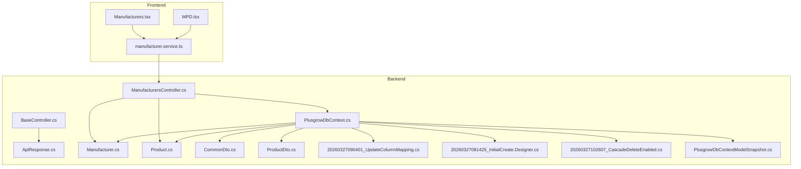
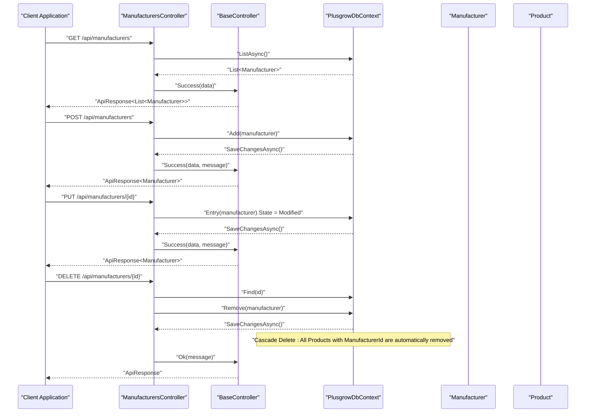
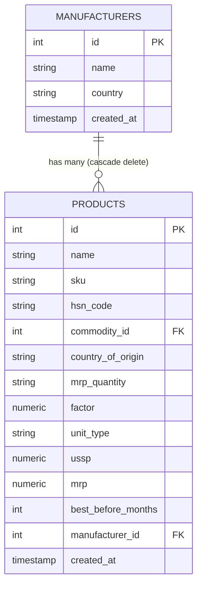
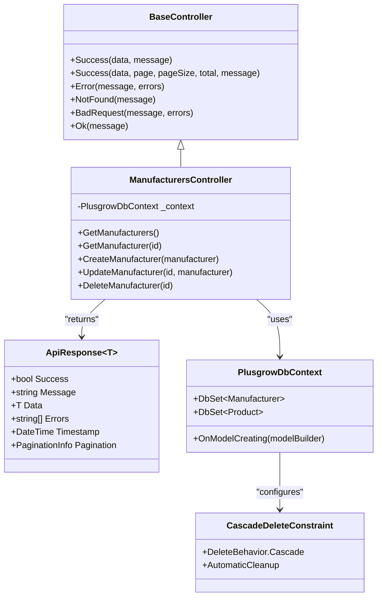

# Manufacturers API

<cite>
**Referenced Files in This Document**
- [ManufacturersController.cs](file://Backend/PlusgrowWms.Api/Controllers/ManufacturersController.cs)
- [BaseController.cs](file://Backend/PlusgrowWms.Api/Controllers/BaseController.cs)
- [ApiResponse.cs](file://Backend/PlusgrowWms.Api/Helpers/ApiResponse.cs)
- [Manufacturer.cs](file://Backend/PlusgrowWms.Api/Models/Manufacturer.cs)
- [Product.cs](file://Backend/PlusgrowWms.Api/Models/Product.cs)
- [PlusgrowDbContext.cs](file://Backend/PlusgrowWms.Api/Data/PlusgrowDbContext.cs)
- [CommonDto.cs](file://Backend/PlusgrowWms.Api/DTOs/CommonDto.cs)
- [ProductDto.cs](file://Backend/PlusgrowWms.Api/DTOs/ProductDto.cs)
- [20260327090401_UpdateColumnMapping.cs](file://Backend/PlusgrowWms.Api/Migrations/20260327090401_UpdateColumnMapping.cs)
- [20260327081425_InitialCreate.Designer.cs](file://Backend/PlusgrowWms.Api/Migrations/20260327081425_InitialCreate.Designer.cs)
- [20260327102607_CascadeDeleteEnabled.cs](file://Backend/PlusgrowWms.Api/Migrations/20260327102607_CascadeDeleteEnabled.cs)
- [20260327102607_CascadeDeleteEnabled.Designer.cs](file://Backend/PlusgrowWms.Api/Migrations/20260327102607_CascadeDeleteEnabled.Designer.cs)
- [PlusgrowDbContextModelSnapshot.cs](file://Backend/PlusgrowWms.Api/Migrations/PlusgrowDbContextModelSnapshot.cs)
- [manufacturer.service.ts](file://Frontend/src/lib/api/services/manufacturer.service.ts)
- [Manufacturers.tsx](file://Frontend/src/pages/Manufacturers.tsx)
- [MPD.tsx](file://Frontend/src/pages/MPD.tsx)
</cite>

## Update Summary
**Changes Made**
- Enhanced cascade delete behavior documentation for manufacturer deletion
- Added database-level cascade delete implementation details
- Updated troubleshooting guide with cascade delete considerations
- Added cascade delete behavior to API definitions and data models

## Table of Contents
1. [Introduction](#introduction)
2. [Project Structure](#project-structure)
3. [Core Components](#core-components)
4. [Architecture Overview](#architecture-overview)
5. [Detailed Component Analysis](#detailed-component-analysis)
6. [Dependency Analysis](#dependency-analysis)
7. [Performance Considerations](#performance-considerations)
8. [Troubleshooting Guide](#troubleshooting-guide)
9. [Conclusion](#conclusion)
10. [Appendices](#appendices)

## Introduction
This document provides comprehensive API documentation for the Manufacturers module within the Plusgrow WMS backend. It covers all CRUD operations for manufacturer management, including GET endpoints for listing and retrieving manufacturers, POST for creation, PUT for updates, and DELETE for removal. The API now features automatic cascade delete behavior where deleting a manufacturer automatically removes all associated products through database-level cascade delete. It also details the Manufacturer model structure, validation rules, business logic for manufacturer verification, and integration patterns with the product catalog. Examples of manufacturer onboarding workflows, supplier management, and relationship mapping with product entities are included, along with error handling for duplicate manufacturers and referential integrity constraints.

## Project Structure
The Manufacturers API is implemented as part of the ASP.NET Core Web API project. The backend follows a layered architecture with controllers, models, data context, DTOs, migrations, and helpers. The frontend integrates with the API via service clients and page components. The database schema now includes cascade delete constraints for automatic cleanup of related product records.

**Diagram sources**
- [ManufacturersController.cs:1-81](file://Backend/PlusgrowWms.Api/Controllers/ManufacturersController.cs#L1-L81)
- [BaseController.cs:1-69](file://Backend/PlusgrowWms.Api/Controllers/BaseController.cs#L1-L69)
- [ApiResponse.cs:1-159](file://Backend/PlusgrowWms.Api/Helpers/ApiResponse.cs#L1-L159)
- [Manufacturer.cs:1-25](file://Backend/PlusgrowWms.Api/Models/Manufacturer.cs#L1-L25)
- [Product.cs:1-65](file://Backend/PlusgrowWms.Api/Models/Product.cs#L1-L65)
- [PlusgrowDbContext.cs:1-92](file://Backend/PlusgrowWms.Api/Data/PlusgrowDbContext.cs#L1-L92)
- [CommonDto.cs:1-47](file://Backend/PlusgrowWms.Api/DTOs/CommonDto.cs#L1-L47)
- [ProductDto.cs:1-55](file://Backend/PlusgrowWms.Api/DTOs/ProductDto.cs#L1-L55)
- [20260327090401_UpdateColumnMapping.cs:238-279](file://Backend/PlusgrowWms.Api/Migrations/20260327090401_UpdateColumnMapping.cs#L238-L279)
- [20260327081425_InitialCreate.Designer.cs:87-112](file://Backend/PlusgrowWms.Api/Migrations/20260327081425_InitialCreate.Designer.cs#L87-L112)
- [20260327102607_CascadeDeleteEnabled.cs:1-65](file://Backend/PlusgrowWms.Api/Migrations/20260327102607_CascadeDeleteEnabled.cs#L1-L65)
- [PlusgrowDbContextModelSnapshot.cs:103-167](file://Backend/PlusgrowWms.Api/Migrations/PlusgrowDbContextModelSnapshot.cs#L103-L167)
- [manufacturer.service.ts:1-36](file://Frontend/src/lib/api/services/manufacturer.service.ts#L1-L36)
- [Manufacturers.tsx:1-254](file://Frontend/src/pages/Manufacturers.tsx#L1-L254)
- [MPD.tsx:239-258](file://Frontend/src/pages/MPD.tsx#L239-L258)

**Section sources**
- [ManufacturersController.cs:1-81](file://Backend/PlusgrowWms.Api/Controllers/ManufacturersController.cs#L1-L81)
- [PlusgrowDbContext.cs:1-92](file://Backend/PlusgrowWms.Api/Data/PlusgrowDbContext.cs#L1-L92)

## Core Components
- ManufacturersController: Exposes REST endpoints for manufacturer CRUD operations, leveraging a base controller for consistent API responses.
- Manufacturer Model: Defines the manufacturer entity with required fields and optional attributes.
- Product Model: Establishes foreign key relationships to Manufacturer and Commodity with cascade delete behavior.
- PlusgrowDbContext: Configures database sets, indexes, and relationships with cascade delete constraints for automatic cleanup.
- DTOs: Provide structured input/output contracts for manufacturer operations.
- ApiResponse: Standardizes API response format across all endpoints.

**Section sources**
- [ManufacturersController.cs:1-81](file://Backend/PlusgrowWms.Api/Controllers/ManufacturersController.cs#L1-L81)
- [Manufacturer.cs:1-25](file://Backend/PlusgrowWms.Api/Models/Manufacturer.cs#L1-L25)
- [Product.cs:1-65](file://Backend/PlusgrowWms.Api/Models/Product.cs#L1-L65)
- [PlusgrowDbContext.cs:31-43](file://Backend/PlusgrowWms.Api/Data/PlusgrowDbContext.cs#L31-L43)
- [CommonDto.cs:23-35](file://Backend/PlusgrowWms.Api/DTOs/CommonDto.cs#L23-L35)
- [ApiResponse.cs:1-159](file://Backend/PlusgrowWms.Api/Helpers/ApiResponse.cs#L1-L159)

## Architecture Overview
The Manufacturers API follows a clean architecture pattern with enhanced cascade delete capabilities:
- Controllers handle HTTP requests and responses.
- Models define domain entities and relationships with cascade delete behavior.
- DbContext manages database operations, indexes, and cascade delete constraints.
- DTOs decouple API contracts from domain models.
- Helpers standardize response formatting.

**Diagram sources**
- [ManufacturersController.cs:20-77](file://Backend/PlusgrowWms.Api/Controllers/ManufacturersController.cs#L20-L77)
- [BaseController.cs:16-59](file://Backend/PlusgrowWms.Api/Controllers/BaseController.cs#L16-L59)
- [ApiResponse.cs:41-96](file://Backend/PlusgrowWms.Api/Helpers/ApiResponse.cs#L41-L96)
- [PlusgrowDbContext.cs:38-43](file://Backend/PlusgrowWms.Api/Data/PlusgrowDbContext.cs#L38-L43)

## Detailed Component Analysis

### API Endpoints
- GET /api/manufacturers
  - Description: Retrieves all manufacturers.
  - Response: ApiResponse<List<Manufacturer>>
  - Status Codes: 200 OK
- GET /api/manufacturers/{id}
  - Description: Retrieves a manufacturer by ID.
  - Path Parameters: id (integer)
  - Response: ApiResponse<Manufacturer> or ApiResponse (not found)
  - Status Codes: 200 OK, 404 Not Found
- POST /api/manufacturers
  - Description: Creates a new manufacturer.
  - Request Body: Manufacturer (DTO-bound)
  - Response: ApiResponse<Manufacturer>
  - Status Codes: 200 OK, 400 Bad Request (on concurrency exceptions)
- PUT /api/manufacturers/{id}
  - Description: Updates an existing manufacturer.
  - Path Parameters: id (integer)
  - Request Body: Manufacturer (DTO-bound)
  - Response: ApiResponse<Manufacturer> or ApiResponse (not found)
  - Status Codes: 200 OK, 400 Bad Request (ID mismatch), 404 Not Found
- DELETE /api/manufacturers/{id}
  - Description: Removes a manufacturer by ID. **Cascade Delete**: Automatically removes all associated products.
  - Path Parameters: id (integer)
  - Response: ApiResponse or ApiResponse (not found)
  - Status Codes: 200 OK, 404 Not Found

**Updated** Enhanced with cascade delete behavior - when a manufacturer is deleted, all associated products are automatically removed through database-level cascade delete

Validation and Business Logic
- ID Mismatch Validation: PUT endpoint validates that the route ID matches the request body ID.
- Concurrency Handling: PUT catches concurrency exceptions and checks existence.
- Existence Checks: DELETE and PUT verify manufacturer existence before operations.
- Cascade Delete Behavior: Database-level cascade delete ensures referential integrity during manufacturer removal.

Integration with Product Catalog
- Product Model includes foreign keys to both Manufacturer and Commodity with cascade delete behavior.
- ProductDto exposes ManufacturerId and ManufacturerName for enriched product data.
- Migration snapshots confirm cascade delete constraints for automatic cleanup.

**Section sources**
- [ManufacturersController.cs:20-77](file://Backend/PlusgrowWms.Api/Controllers/ManufacturersController.cs#L20-L77)
- [Product.cs:56-60](file://Backend/PlusgrowWms.Api/Models/Product.cs#L56-L60)
- [ProductDto.cs:18-19](file://Backend/PlusgrowWms.Api/DTOs/ProductDto.cs#L18-L19)
- [PlusgrowDbContext.cs:38-43](file://Backend/PlusgrowWms.Api/Data/PlusgrowDbContext.cs#L38-L43)

### Manufacturer Model
Fields and Constraints
- Id: Primary key (integer)
- Name: Required, max length 255
- Country: Optional, max length 100
- CreatedAt: Automatic timestamp

Relationships
- One-to-many with Product via ManufacturerId (with cascade delete)

Indexes and Performance
- Country index configured in DbContext for filtering by country.

**Section sources**
- [Manufacturer.cs:9-24](file://Backend/PlusgrowWms.Api/Models/Manufacturer.cs#L9-L24)
- [PlusgrowDbContext.cs:88-89](file://Backend/PlusgrowWms.Api/Data/PlusgrowDbContext.cs#L88-L89)

### Product-Manufacturer Relationship with Cascade Delete
- Product.ManufacturerId is a foreign key to Manufacturer.Id with cascade delete behavior.
- ProductDto includes ManufacturerId and ManufacturerName for display and filtering.
- Migration snapshots confirm cascade delete constraints for automatic cleanup.
- Database-level cascade delete ensures referential integrity during manufacturer removal.

**Updated** Added cascade delete behavior to the relationship

**Diagram sources**
- [Manufacturer.cs:6-24](file://Backend/PlusgrowWms.Api/Models/Manufacturer.cs#L6-L24)
- [Product.cs:6-64](file://Backend/PlusgrowWms.Api/Models/Product.cs#L6-L64)
- [PlusgrowDbContext.cs:38-43](file://Backend/PlusgrowWms.Api/Data/PlusgrowDbContext.cs#L38-L43)
- [20260327102607_CascadeDeleteEnabled.cs:29-35](file://Backend/PlusgrowWms.Api/Migrations/20260327102607_CascadeDeleteEnabled.cs#L29-L35)

### Frontend Integration
- manufacturer.service.ts: Provides typed methods for GET, POST, PUT, DELETE against /manufacturers.
- Manufacturers.tsx: UI component that loads and displays manufacturers, integrates with the service.
- MPD.tsx: Uses manufacturer selection in product creation flow.

**Section sources**
- [manufacturer.service.ts:10-36](file://Frontend/src/lib/api/services/manufacturer.service.ts#L10-L36)
- [Manufacturers.tsx:12-254](file://Frontend/src/pages/Manufacturers.tsx#L12-L254)
- [MPD.tsx:239-258](file://Frontend/src/pages/MPD.tsx#L239-L258)

## Dependency Analysis
The controller depends on the database context and inherits standardized response helpers from the base controller. The DbContext configures relationships, indexes, and cascade delete constraints that support efficient queries and maintain referential integrity with automatic cleanup.

**Updated** Added CascadeDeleteConstraint class to represent the cascade delete behavior

**Diagram sources**
- [BaseController.cs:11-68](file://Backend/PlusgrowWms.Api/Controllers/BaseController.cs#L11-L68)
- [ApiResponse.cs:8-97](file://Backend/PlusgrowWms.Api/Helpers/ApiResponse.cs#L8-L97)
- [ManufacturersController.cs:11-18](file://Backend/PlusgrowWms.Api/Controllers/ManufacturersController.cs#L11-L18)
- [PlusgrowDbContext.cs:12-18](file://Backend/PlusgrowWms.Api/Data/PlusgrowDbContext.cs#L12-L18)
- [PlusgrowDbContext.cs:38-43](file://Backend/PlusgrowWms.Api/Data/PlusgrowDbContext.cs#L38-L43)

**Section sources**
- [ManufacturersController.cs:1-81](file://Backend/PlusgrowWms.Api/Controllers/ManufacturersController.cs#L1-L81)
- [PlusgrowDbContext.cs:20-92](file://Backend/PlusgrowWms.Api/Data/PlusgrowDbContext.cs#L20-L92)

## Performance Considerations
- Indexes: Country index on manufacturers and ManufacturerId index on products improve filtering and join performance.
- Column Naming: Migrations rename columns to snake_case for consistency with PostgreSQL conventions.
- Pagination: The base controller supports paginated responses for scalable data retrieval.
- Cascade Delete Performance: Database-level cascade delete eliminates the need for application-level cleanup, improving performance during manufacturer removal operations.

**Updated** Added cascade delete performance benefits

**Section sources**
- [PlusgrowDbContext.cs:48-92](file://Backend/PlusgrowWms.Api/Data/PlusgrowDbContext.cs#L48-L92)
- [20260327090401_UpdateColumnMapping.cs:238-279](file://Backend/PlusgrowWms.Api/Migrations/20260327090401_UpdateColumnMapping.cs#L238-L279)
- [BaseController.cs:24-27](file://Backend/PlusgrowWms.Api/Controllers/BaseController.cs#L24-L27)

## Troubleshooting Guide
Common Issues and Resolutions
- Duplicate Manufacturers: While the manufacturer entity does not declare a unique constraint, product and commodity entities enforce uniqueness on their respective identifiers. For manufacturer uniqueness, consider adding a unique index on the Name field in the database schema.
- Referential Integrity: Deleting a manufacturer while products reference it will violate foreign key constraints. **Updated**: The database now uses cascade delete behavior, so deleting a manufacturer automatically removes all associated products, preventing referential integrity violations.
- Concurrency Exceptions: PUT operations catch concurrency exceptions and verify existence; handle gracefully by informing the client to refresh data.
- ID Mismatch: PUT requires the route ID to match the request body ID; otherwise, a 400 Bad Request is returned.
- Cascade Delete Impact: When deleting a manufacturer, all associated products are automatically removed. Ensure this behavior aligns with your business requirements before performing bulk deletions.

**Updated** Enhanced with cascade delete behavior and impact considerations

**Section sources**
- [ManufacturersController.cs:47-61](file://Backend/PlusgrowWms.Api/Controllers/ManufacturersController.cs#L47-L61)
- [PlusgrowDbContext.cs:38-43](file://Backend/PlusgrowWms.Api/Data/PlusgrowDbContext.cs#L38-L43)
- [20260327102607_CascadeDeleteEnabled.cs:11-36](file://Backend/PlusgrowWms.Api/Migrations/20260327102607_CascadeDeleteEnabled.cs#L11-L36)

## Conclusion
The Manufacturers API provides a robust foundation for managing manufacturer records and integrating with the product catalog. Its clean separation of concerns, standardized responses, and established relationships enable scalable onboarding workflows and supplier management. **Updated**: The enhanced cascade delete behavior ensures automatic cleanup of related product records when manufacturers are removed, strengthening data consistency and simplifying maintenance operations. Extending uniqueness constraints and leveraging cascade delete capabilities will further optimize data management processes.

## Appendices

### API Definitions

- GET /api/manufacturers
  - Response: ApiResponse<List<Manufacturer>>
  - Example: See [ManufacturersController.cs:20-25](file://Backend/PlusgrowWms.Api/Controllers/ManufacturersController.cs#L20-L25)

- GET /api/manufacturers/{id}
  - Path Parameters: id (integer)
  - Response: ApiResponse<Manufacturer> or ApiResponse (not found)
  - Example: See [ManufacturersController.cs:27-34](file://Backend/PlusgrowWms.Api/Controllers/ManufacturersController.cs#L27-L34)

- POST /api/manufacturers
  - Request Body: Manufacturer
  - Response: ApiResponse<Manufacturer>
  - Example: See [ManufacturersController.cs:36-42](file://Backend/PlusgrowWms.Api/Controllers/ManufacturersController.cs#L36-L42)

- PUT /api/manufacturers/{id}
  - Path Parameters: id (integer)
  - Request Body: Manufacturer
  - Response: ApiResponse<Manufacturer> or ApiResponse (not found)
  - Example: See [ManufacturersController.cs:44-64](file://Backend/PlusgrowWms.Api/Controllers/ManufacturersController.cs#L44-L64)

- DELETE /api/manufacturers/{id}
  - Path Parameters: id (integer)
  - Response: ApiResponse or ApiResponse (not found)
  - Example: See [ManufacturersController.cs:66-77](file://Backend/PlusgrowWms.Api/Controllers/ManufacturersController.cs#L66-L77)

**Updated** Enhanced DELETE endpoint documentation with cascade delete behavior

### Data Models

- Manufacturer
  - Fields: Id, Name, Country, CreatedAt
  - Constraints: Name required, max length 255; Country max length 100
  - Relationships: One-to-many with Product (cascade delete)
  - Reference: [Manufacturer.cs:9-24](file://Backend/PlusgrowWms.Api/Models/Manufacturer.cs#L9-L24)

- Product
  - Fields: Id, Name, Sku, HsnCode, CommodityId, CountryOfOrigin, MrpQuantity, Factor, UnitType, Ussp, Mrp, BestBeforeMonths, ManufacturerId, CreatedAt
  - Foreign Keys: ManufacturerId -> Manufacturer.Id (cascade delete)
  - Reference: [Product.cs:56-60](file://Backend/PlusgrowWms.Api/Models/Product.cs#L56-L60)

**Updated** Added cascade delete behavior to Product-Manufacturer relationship

### Database Migration Details

- Cascade Delete Migration (20260327102607_CascadeDeleteEnabled)
  - Adds foreign key constraints with cascade delete behavior
  - Enables automatic cleanup of products when manufacturers are deleted
  - Supports both Product -> Commodity and Product -> Manufacturer relationships
  - Reference: [20260327102607_CascadeDeleteEnabled.cs:11-36](file://Backend/PlusgrowWms.Api/Migrations/20260327102607_CascadeDeleteEnabled.cs#L11-L36)

**New Section** Added to document the cascade delete implementation

### Frontend Integration Examples

- Loading Manufacturers
  - Service method: getAll()
  - UI component: Manufacturers.tsx
  - References: [manufacturer.service.ts:11-14](file://Frontend/src/lib/api/services/manufacturer.service.ts#L11-L14), [Manufacturers.tsx:24-33](file://Frontend/src/pages/Manufacturers.tsx#L24-L33)

- Selecting Manufacturer in Product Creation
  - UI component: MPD.tsx
  - Reference: [MPD.tsx:239-258](file://Frontend/src/pages/MPD.tsx#L239-L258)