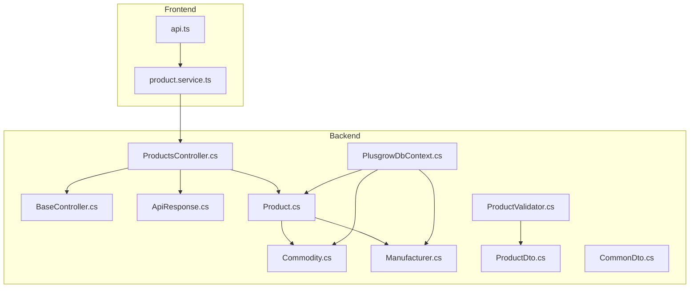
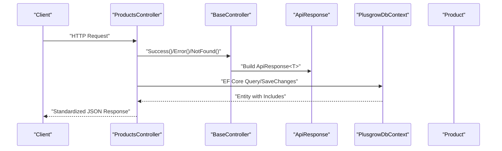
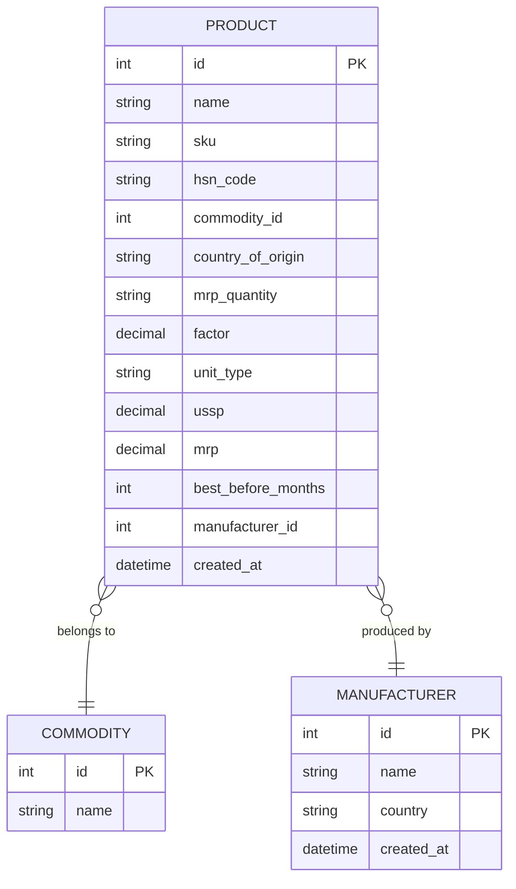
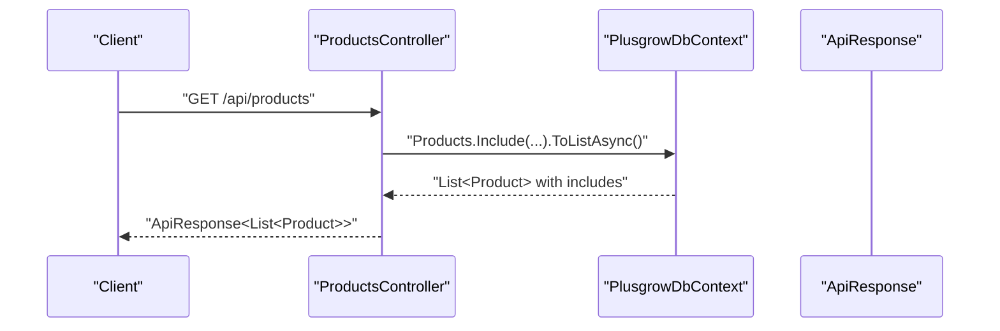
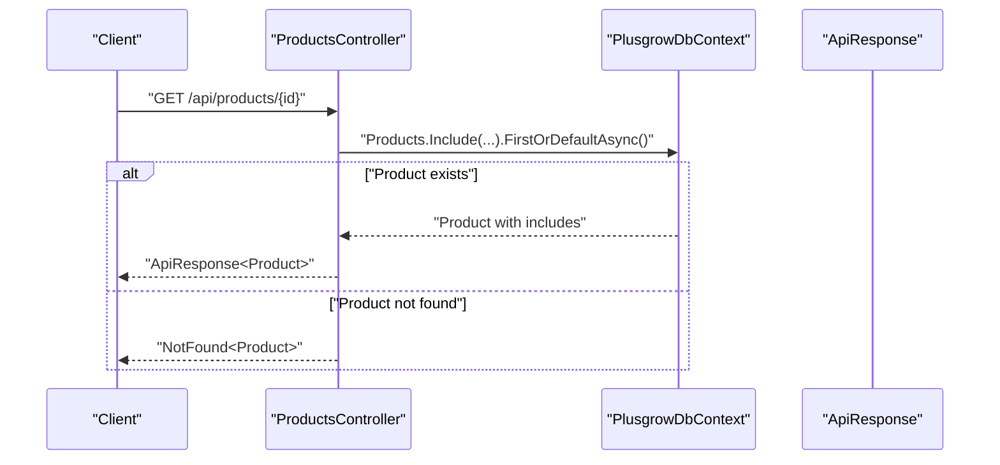
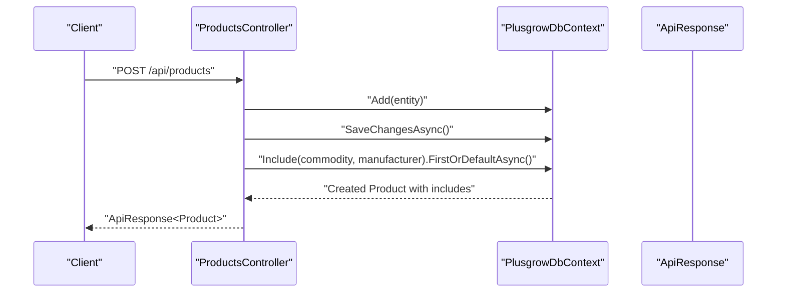
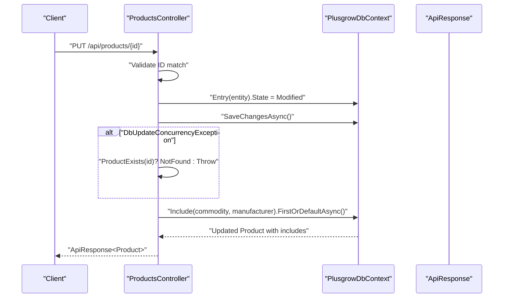
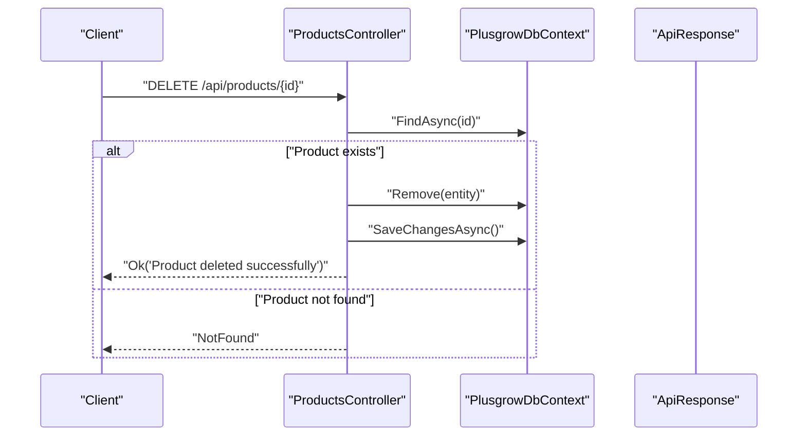
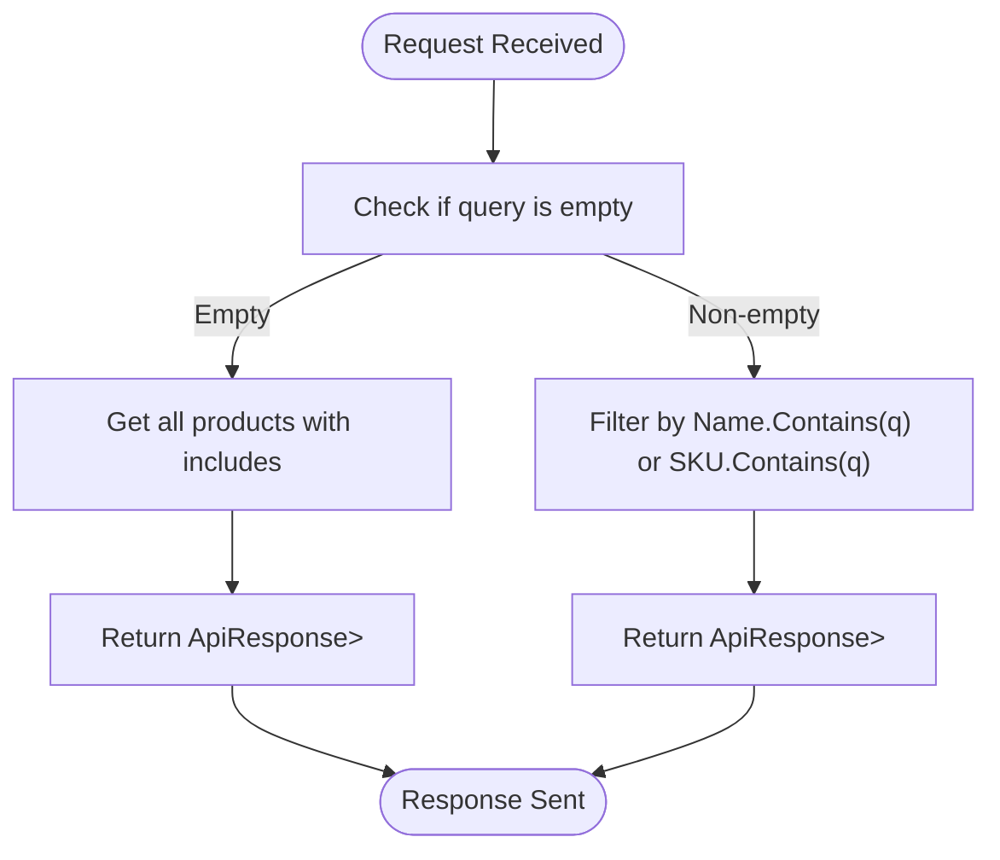
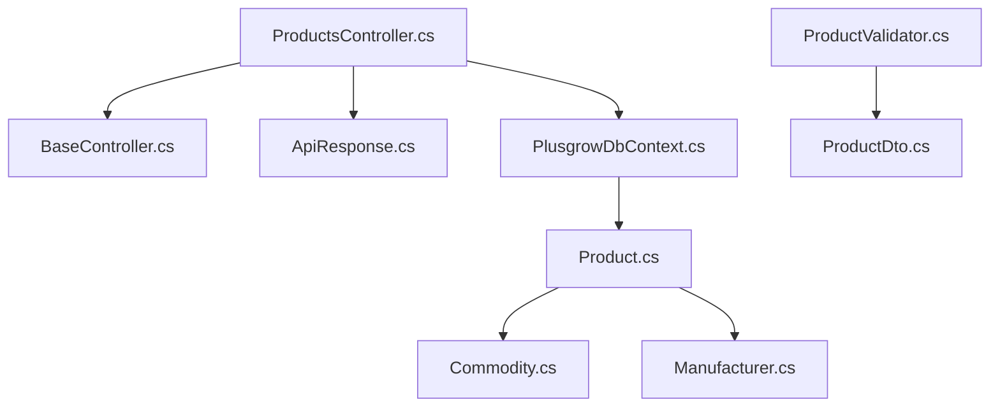

# Products API

<cite>
**Referenced Files in This Document**
- [ProductsController.cs](file://Backend/PlusgrowWms.Api/Controllers/ProductsController.cs)
- [BaseController.cs](file://Backend/PlusgrowWms.Api/Controllers/BaseController.cs)
- [ApiResponse.cs](file://Backend/PlusgrowWms.Api/Helpers/ApiResponse.cs)
- [Product.cs](file://Backend/PlusgrowWms.Api/Models/Product.cs)
- [Commodity.cs](file://Backend/PlusgrowWms.Api/Models/Commodity.cs)
- [Manufacturer.cs](file://Backend/PlusgrowWms.Api/Models/Manufacturer.cs)
- [PlusgrowDbContext.cs](file://Backend/PlusgrowWms.Api/Data/PlusgrowDbContext.cs)
- [ProductDto.cs](file://Backend/PlusgrowWms.Api/DTOs/ProductDto.cs)
- [CommonDto.cs](file://Backend/PlusgrowWms.Api/DTOs/CommonDto.cs)
- [ProductValidator.cs](file://Backend/PlusgrowWms.Api/Validators/ProductValidator.cs)
- [product.service.ts](file://Frontend/src/lib/api/services/product.service.ts)
- [api.ts](file://Frontend/src/types/api.ts)
</cite>

## Table of Contents
1. [Introduction](#introduction)
2. [Project Structure](#project-structure)
3. [Core Components](#core-components)
4. [Architecture Overview](#architecture-overview)
5. [Detailed Component Analysis](#detailed-component-analysis)
6. [Dependency Analysis](#dependency-analysis)
7. [Performance Considerations](#performance-considerations)
8. [Troubleshooting Guide](#troubleshooting-guide)
9. [Conclusion](#conclusion)

## Introduction
This document provides comprehensive API documentation for the Products API endpoints. It covers all CRUD operations, response formatting, validation rules, error handling, and integration patterns with Commodity and Manufacturer data. The documentation is designed for both technical and non-technical audiences and includes practical examples and diagrams to illustrate workflows.

## Project Structure
The Products API is implemented in the backend C# project under the Controllers, Models, DTOs, Validators, Helpers, and Data namespaces. The frontend TypeScript services consume these endpoints via a typed API client.

**Diagram sources**
- [ProductsController.cs:1-117](file://Backend/PlusgrowWms.Api/Controllers/ProductsController.cs#L1-L117)
- [BaseController.cs:1-69](file://Backend/PlusgrowWms.Api/Controllers/BaseController.cs#L1-L69)
- [ApiResponse.cs:1-159](file://Backend/PlusgrowWms.Api/Helpers/ApiResponse.cs#L1-L159)
- [Product.cs:1-65](file://Backend/PlusgrowWms.Api/Models/Product.cs#L1-L65)
- [Commodity.cs:1-20](file://Backend/PlusgrowWms.Api/Models/Commodity.cs#L1-L20)
- [Manufacturer.cs:1-25](file://Backend/PlusgrowWms.Api/Models/Manufacturer.cs#L1-L25)
- [PlusgrowDbContext.cs:1-78](file://Backend/PlusgrowWms.Api/Data/PlusgrowDbContext.cs#L1-L78)
- [ProductDto.cs:1-55](file://Backend/PlusgrowWms.Api/DTOs/ProductDto.cs#L1-L55)
- [CommonDto.cs:1-47](file://Backend/PlusgrowWms.Api/DTOs/CommonDto.cs#L1-L47)
- [ProductValidator.cs:1-33](file://Backend/PlusgrowWms.Api/Validators/ProductValidator.cs#L1-L33)
- [product.service.ts:1-42](file://Frontend/src/lib/api/services/product.service.ts#L1-L42)
- [api.ts](file://Frontend/src/types/api.ts)

**Section sources**
- [ProductsController.cs:1-117](file://Backend/PlusgrowWms.Api/Controllers/ProductsController.cs#L1-L117)
- [PlusgrowDbContext.cs:1-78](file://Backend/PlusgrowWms.Api/Data/PlusgrowDbContext.cs#L1-L78)

## Core Components
- ProductsController: Implements GET /api/products, GET /api/products/{id}, POST /api/products, PUT /api/products/{id}, DELETE /api/products/{id}, and GET /api/products/search endpoints. It includes commodity and manufacturer includes in all queries and handles concurrency conflicts during updates.
- Product model: Defines the Product entity with properties for SKU, name, description, pricing, weights, dimensions, and foreign keys to Commodity and Manufacturer.
- DTOs: ProductDto, CreateProductDto, and UpdateProductDto define request/response shapes for product operations.
- Validators: ProductValidator enforces validation rules for product creation.
- ApiResponse and BaseController: Provide standardized response formatting and helper methods for success, error, not-found, and bad-request responses.
- PlusgrowDbContext: Configures database mappings, unique indexes, and relationships.

**Section sources**
- [ProductsController.cs:20-113](file://Backend/PlusgrowWms.Api/Controllers/ProductsController.cs#L20-L113)
- [Product.cs:1-65](file://Backend/PlusgrowWms.Api/Models/Product.cs#L1-L65)
- [ProductDto.cs:1-55](file://Backend/PlusgrowWms.Api/DTOs/ProductDto.cs#L1-L55)
- [ProductValidator.cs:1-33](file://Backend/PlusgrowWms.Api/Validators/ProductValidator.cs#L1-L33)
- [ApiResponse.cs:8-97](file://Backend/PlusgrowWms.Api/Helpers/ApiResponse.cs#L8-L97)
- [BaseController.cs:16-67](file://Backend/PlusgrowWms.Api/Controllers/BaseController.cs#L16-L67)
- [PlusgrowDbContext.cs:36-56](file://Backend/PlusgrowWms.Api/Data/PlusgrowDbContext.cs#L36-L56)

## Architecture Overview
The Products API follows a layered architecture:
- Presentation: ASP.NET Core Web API controllers handle HTTP requests and responses.
- Domain: Entity models represent business entities with EF Core attributes.
- Data Access: DbContext manages database operations and relationships.
- Validation: FluentValidation validators enforce business rules.
- Response Formatting: BaseController and ApiResponse standardize response envelopes.

**Diagram sources**
- [ProductsController.cs:20-98](file://Backend/PlusgrowWms.Api/Controllers/ProductsController.cs#L20-L98)
- [BaseController.cs:16-67](file://Backend/PlusgrowWms.Api/Controllers/BaseController.cs#L16-L67)
- [ApiResponse.cs:40-96](file://Backend/PlusgrowWms.Api/Helpers/ApiResponse.cs#L40-L96)
- [PlusgrowDbContext.cs:12-18](file://Backend/PlusgrowWms.Api/Data/PlusgrowDbContext.cs#L12-L18)

## Detailed Component Analysis

### Product Entity and Relationships
The Product entity encapsulates product attributes and maintains relationships with Commodity and Manufacturer. Unique indexes on SKU and other fields improve query performance and data integrity.

**Diagram sources**
- [Product.cs:6-64](file://Backend/PlusgrowWms.Api/Models/Product.cs#L6-L64)
- [Commodity.cs:6-18](file://Backend/PlusgrowWms.Api/Models/Commodity.cs#L6-L18)
- [Manufacturer.cs:6-23](file://Backend/PlusgrowWms.Api/Models/Manufacturer.cs#L6-L23)

**Section sources**
- [Product.cs:1-65](file://Backend/PlusgrowWms.Api/Models/Product.cs#L1-L65)
- [Commodity.cs:1-20](file://Backend/PlusgrowWms.Api/Models/Commodity.cs#L1-L20)
- [Manufacturer.cs:1-25](file://Backend/PlusgrowWms.Api/Models/Manufacturer.cs#L1-L25)
- [PlusgrowDbContext.cs:36-56](file://Backend/PlusgrowWms.Api/Data/PlusgrowDbContext.cs#L36-L56)

### API Endpoints

#### GET /api/products
- Purpose: Retrieve all products with included Commodity and Manufacturer details.
- Response: ApiResponse wrapping a list of Product entities.
- Includes: Eager loading of related entities for efficient consumption.

**Diagram sources**
- [ProductsController.cs:20-29](file://Backend/PlusgrowWms.Api/Controllers/ProductsController.cs#L20-L29)
- [PlusgrowDbContext.cs:12-18](file://Backend/PlusgrowWms.Api/Data/PlusgrowDbContext.cs#L12-L18)

**Section sources**
- [ProductsController.cs:20-29](file://Backend/PlusgrowWms.Api/Controllers/ProductsController.cs#L20-L29)

#### GET /api/products/{id}
- Purpose: Retrieve a single product by ID with included Commodity and Manufacturer.
- Response: ApiResponse wrapping a Product entity or NotFound if not found.

**Diagram sources**
- [ProductsController.cs:31-43](file://Backend/PlusgrowWms.Api/Controllers/ProductsController.cs#L31-L43)
- [PlusgrowDbContext.cs:12-18](file://Backend/PlusgrowWms.Api/Data/PlusgrowDbContext.cs#L12-L18)

**Section sources**
- [ProductsController.cs:31-43](file://Backend/PlusgrowWms.Api/Controllers/ProductsController.cs#L31-L43)

#### POST /api/products
- Purpose: Create a new product.
- Request Body: Product entity (DTO shape depends on frontend service usage).
- Response: ApiResponse wrapping the created Product with includes.
- Workflow: Add entity, save changes, re-fetch with includes for consistent response.

**Diagram sources**
- [ProductsController.cs:45-58](file://Backend/PlusgrowWms.Api/Controllers/ProductsController.cs#L45-L58)
- [PlusgrowDbContext.cs:12-18](file://Backend/PlusgrowWms.Api/Data/PlusgrowDbContext.cs#L12-L18)

**Section sources**
- [ProductsController.cs:45-58](file://Backend/PlusgrowWms.Api/Controllers/ProductsController.cs#L45-L58)

#### PUT /api/products/{id}
- Purpose: Update an existing product.
- Request Path Parameter: id (must match Product.Id).
- Request Body: Product entity.
- Response: ApiResponse wrapping the updated Product with includes.
- Concurrency Handling: Catches DbUpdateConcurrencyException; returns NotFound if entity does not exist after conflict.

**Diagram sources**
- [ProductsController.cs:60-85](file://Backend/PlusgrowWms.Api/Controllers/ProductsController.cs#L60-L85)
- [PlusgrowDbContext.cs:12-18](file://Backend/PlusgrowWms.Api/Data/PlusgrowDbContext.cs#L12-L18)

**Section sources**
- [ProductsController.cs:60-85](file://Backend/PlusgrowWms.Api/Controllers/ProductsController.cs#L60-L85)

#### DELETE /api/products/{id}
- Purpose: Remove a product by ID.
- Response: Non-generic ApiResponse with success message or NotFound if not found.

**Diagram sources**
- [ProductsController.cs:87-98](file://Backend/PlusgrowWms.Api/Controllers/ProductsController.cs#L87-L98)
- [PlusgrowDbContext.cs:12-18](file://Backend/PlusgrowWms.Api/Data/PlusgrowDbContext.cs#L12-L18)

**Section sources**
- [ProductsController.cs:87-98](file://Backend/PlusgrowWms.Api/Controllers/ProductsController.cs#L87-L98)

#### GET /api/products/search?q={query}
- Purpose: Search products by name or SKU.
- Query Parameter: q (search term).
- Behavior: Returns all products if query is empty; otherwise filters by name or SKU.

**Diagram sources**
- [ProductsController.cs:100-113](file://Backend/PlusgrowWms.Api/Controllers/ProductsController.cs#L100-L113)

**Section sources**
- [ProductsController.cs:100-113](file://Backend/PlusgrowWms.Api/Controllers/ProductsController.cs#L100-L113)

### ProductDto Structure
The ProductDto defines the serialized representation for product data transfer, including optional commodity and manufacturer metadata alongside core product fields.

- Fields:
  - Id: integer identifier
  - Name: product name
  - Sku: stock keeping unit
  - HsnCode: Harmonized System Nomenclature code
  - CommodityId: foreign key to Commodity
  - CommodityName: optional display name
  - CountryOfOrigin: origin country
  - MrpQuantity: MRP quantity descriptor
  - Factor: conversion factor
  - UnitType: unit type
  - Ussp: suggested retail price
  - Mrp: maximum retail price
  - BestBeforeMonths: shelf life in months
  - ManufacturerId: foreign key to Manufacturer
  - ManufacturerName: optional display name
  - CreatedAt: timestamp

- CreateProductDto and UpdateProductDto:
  - CreateProductDto: excludes Id and sets default BestBeforeMonths to 120
  - UpdateProductDto: requires Id and mirrors create structure

**Section sources**
- [ProductDto.cs:3-54](file://Backend/PlusgrowWms.Api/DTOs/ProductDto.cs#L3-L54)

### Validation Rules
ProductValidator applies the following validation rules for CreateProductDto:
- Name: required, max length 255
- Sku: max length 100
- HsnCode: max length 20
- Mrp: must be >= 0 when provided
- Ussp: must be >= 0 when provided
- Factor: must be > 0 when provided

**Section sources**
- [ProductValidator.cs:6-31](file://Backend/PlusgrowWms.Api/Validators/ProductValidator.cs#L6-L31)

### Response Formatting
All endpoints return a standardized ApiResponse envelope:
- ApiResponse<T>: includes success flag, message, data payload, errors, timestamp, and optional pagination
- Non-generic ApiResponse: used for void operations (e.g., delete)
- BaseController helpers:
  - Success<T>(data, message?): wraps data in ApiResponse<T>
  - NotFound<T>(message?): returns not found result
  - BadRequest<T>(message?, errors?): returns bad request result
  - Ok(message?): returns success without data

**Section sources**
- [ApiResponse.cs:8-97](file://Backend/PlusgrowWms.Api/Helpers/ApiResponse.cs#L8-L97)
- [BaseController.cs:16-67](file://Backend/PlusgrowWms.Api/Controllers/BaseController.cs#L16-L67)

### Integration Patterns
Frontend integration uses a typed API client with service methods mirroring backend endpoints:
- productService.getAll(params): GET /api/products with optional query params
- productService.getById(id): GET /api/products/{id}
- productService.create(data): POST /api/products
- productService.update(id, data): PUT /api/products/{id}
- productService.delete(id): DELETE /api/products/{id}
- productService.search(query): GET /api/products/search?q={query}

These services expect ApiResponse<T> responses and map to frontend types defined in api.ts.

**Section sources**
- [product.service.ts:10-42](file://Frontend/src/lib/api/services/product.service.ts#L10-L42)
- [api.ts](file://Frontend/src/types/api.ts)

## Dependency Analysis
The ProductsController depends on PlusgrowDbContext for data access and uses BaseController for response formatting. Product entities maintain relationships with Commodity and Manufacturer through foreign keys and navigation properties. Unique indexes on SKU, Commodity.Name, and other fields optimize query performance.

**Diagram sources**
- [ProductsController.cs:1-18](file://Backend/PlusgrowWms.Api/Controllers/ProductsController.cs#L1-L18)
- [BaseController.cs:11-18](file://Backend/PlusgrowWms.Api/Controllers/BaseController.cs#L11-L18)
- [ApiResponse.cs:8-27](file://Backend/PlusgrowWms.Api/Helpers/ApiResponse.cs#L8-L27)
- [PlusgrowDbContext.cs:12-18](file://Backend/PlusgrowWms.Api/Data/PlusgrowDbContext.cs#L12-L18)
- [Product.cs:26-60](file://Backend/PlusgrowWms.Api/Models/Product.cs#L26-L60)
- [Commodity.cs:9-18](file://Backend/PlusgrowWms.Api/Models/Commodity.cs#L9-L18)
- [Manufacturer.cs:9-23](file://Backend/PlusgrowWms.Api/Models/Manufacturer.cs#L9-L23)
- [ProductValidator.cs:6-31](file://Backend/PlusgrowWms.Api/Validators/ProductValidator.cs#L6-L31)
- [ProductDto.cs:3-54](file://Backend/PlusgrowWms.Api/DTOs/ProductDto.cs#L3-L54)

**Section sources**
- [ProductsController.cs:1-18](file://Backend/PlusgrowWms.Api/Controllers/ProductsController.cs#L1-L18)
- [PlusgrowDbContext.cs:36-56](file://Backend/PlusgrowWms.Api/Data/PlusgrowDbContext.cs#L36-L56)

## Performance Considerations
- Eager Loading: Include commodity and manufacturer in all product queries to avoid N+1 problems.
- Indexes: Unique SKU index prevents duplicates; additional indexes on CommodityId, ManufacturerId, HsnCode, and Name improve filtering performance.
- Pagination: While current endpoints return full lists, consider implementing pagination for large datasets using BaseController.Success<T>(data, page, pageSize, total).

## Troubleshooting Guide
- Concurrency Conflicts:
  - Symptom: Update fails with DbUpdateConcurrencyException.
  - Resolution: Controller catches the exception and checks existence; returns NotFound if missing.
- Not Found Scenarios:
  - GET /api/products/{id}: Returns NotFound<Product> when product does not exist.
  - DELETE /api/products/{id}: Returns NotFound when attempting to remove a non-existent product.
- Validation Errors:
  - CreateProductDto validation failures return bad request responses with specific messages for Name, Sku, HsnCode, Mrp, Ussp, and Factor constraints.
- Response Envelope:
  - Verify ApiResponse<T> fields: success, message, data, errors, timestamp. Use BaseController helpers for consistent formatting.

**Section sources**
- [ProductsController.cs:72-77](file://Backend/PlusgrowWms.Api/Controllers/ProductsController.cs#L72-L77)
- [ProductsController.cs:39-40](file://Backend/PlusgrowWms.Api/Controllers/ProductsController.cs#L39-L40)
- [ProductsController.cs:90-92](file://Backend/PlusgrowWms.Api/Controllers/ProductsController.cs#L90-L92)
- [ProductValidator.cs:10-31](file://Backend/PlusgrowWms.Api/Validators/ProductValidator.cs#L10-L31)
- [ApiResponse.cs:68-96](file://Backend/PlusgrowWms.Api/Helpers/ApiResponse.cs#L68-L96)

## Conclusion
The Products API provides a robust, standardized interface for product management with consistent response formatting, strong validation, and clear integration patterns. By leveraging includes for related entities, enforcing unique constraints, and handling concurrency gracefully, the API supports reliable product operations across the application stack.