# Data Access and Repository Pattern

<cite>
**Referenced Files in This Document**
- [PlusgrowDbContext.cs](file://Backend/PlusgrowWms.Api/Data/PlusgrowDbContext.cs)
- [GenericRepository.cs](file://Backend/PlusgrowWms.Api/Repositories/GenericRepository.cs)
- [UserRepository.cs](file://Backend/PlusgrowWms.Api/Repositories/UserRepository.cs)
- [RoleRepository.cs](file://Backend/PlusgrowWms.Api/Repositories/RoleRepository.cs)
- [Program.cs](file://Backend/PlusgrowWms.Api/Program.cs)
- [DatabaseSeeder.cs](file://Backend/PlusgrowWms.Api/Services/DatabaseSeeder.cs)
- [User.cs](file://Backend/PlusgrowWms.Api/Models/User.cs)
- [Role.cs](file://Backend/PlusgrowWms.Api/Models/Role.cs)
- [RolePageAccess.cs](file://Backend/PlusgrowWms.Api/Models/RolePageAccess.cs)
- [AuthService.cs](file://Backend/PlusgrowWms.Api/Services/AuthService.cs)
- [MappingProfile.cs](file://Backend/PlusgrowWms.Api/Mappings/MappingProfile.cs)
- [UserDto.cs](file://Backend/PlusgrowWms.Api/DTOs/UserDto.cs)
- [RoleDto.cs](file://Backend/PlusgrowWms.Api/DTOs/RoleDto.cs)
- [20260327081425_InitialCreate.cs](file://Backend/PlusgrowWms.Api/Migrations/20260327081425_InitialCreate.cs)
- [20260327102607_CascadeDeleteEnabled.cs](file://Backend/PlusgrowWms.Api/Migrations/20260327102607_CascadeDeleteEnabled.cs)
- [launchSettings.json](file://Backend/PlusgrowWms.Api/Properties/launchSettings.json)
</cite>

## Update Summary
**Changes Made**
- Added new DatabaseSeeder service for automated initial data population
- Enhanced PlusgrowDbContext with cascade delete configurations for Product relationships
- Improved database initialization process with automatic seeding on startup
- Updated dependency injection configuration to include DatabaseSeeder service
- Integrated comprehensive page access permissions for Superadmin role

## Table of Contents
1. [Introduction](#introduction)
2. [Project Structure](#project-structure)
3. [Core Components](#core-components)
4. [Architecture Overview](#architecture-overview)
5. [Detailed Component Analysis](#detailed-component-analysis)
6. [Dependency Analysis](#dependency-analysis)
7. [Performance Considerations](#performance-considerations)
8. [Troubleshooting Guide](#troubleshooting-guide)
9. [Conclusion](#conclusion)
10. [Appendices](#appendices)

## Introduction
This document explains the data access layer built with Entity Framework Core and the Repository pattern in the Plusgrow WMS backend. It covers the PlusgrowDbContext configuration, connection management, and context lifecycle; the GenericRepository providing common CRUD operations; and specialized repositories for User and Role entities. It also documents dependency injection registration, transaction management, change tracking, lazy and eager loading strategies, performance considerations, caching strategies, and integration with the service layer. **Updated** to include the new DatabaseSeeder service for automated initial data population and enhanced cascade delete configurations.

## Project Structure
The data access layer resides under Backend/PlusgrowWms.Api and follows a layered architecture:
- Data: DbContext and entity models
- Repositories: Generic and specialized repositories
- Services: Business orchestration integrating repositories and database seeding
- Mappings: AutoMapper profiles for DTO conversions
- Migrations: Database schema initialization and indexing with cascade delete configurations

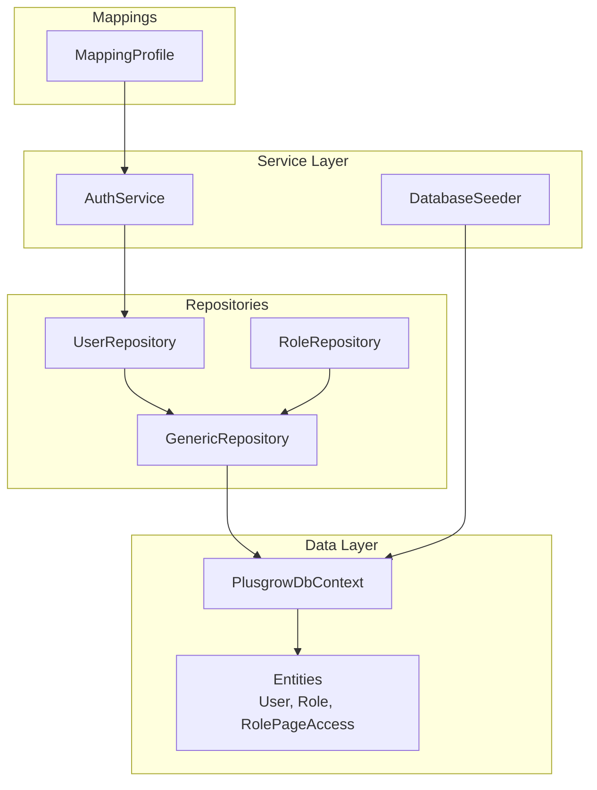

**Diagram sources**
- [PlusgrowDbContext.cs:6-92](file://Backend/PlusgrowWms.Api/Data/PlusgrowDbContext.cs#L6-L92)
- [GenericRepository.cs:22-117](file://Backend/PlusgrowWms.Api/Repositories/GenericRepository.cs#L22-L117)
- [UserRepository.cs:17-68](file://Backend/PlusgrowWms.Api/Repositories/UserRepository.cs#L17-L68)
- [RoleRepository.cs:18-71](file://Backend/PlusgrowWms.Api/Repositories/RoleRepository.cs#L18-L71)
- [AuthService.cs:23-236](file://Backend/PlusgrowWms.Api/Services/AuthService.cs#L23-L236)
- [DatabaseSeeder.cs:12-177](file://Backend/PlusgrowWms.Api/Services/DatabaseSeeder.cs#L12-L177)
- [MappingProfile.cs:7-56](file://Backend/PlusgrowWms.Api/Mappings/MappingProfile.cs#L7-L56)

**Section sources**
- [PlusgrowDbContext.cs:6-92](file://Backend/PlusgrowWms.Api/Data/PlusgrowDbContext.cs#L6-L92)
- [Program.cs:25-37](file://Backend/PlusgrowWms.Api/Program.cs#L25-L37)

## Core Components
- PlusgrowDbContext: Configures PostgreSQL via Npgsql, defines DbSet properties for all entities, applies naming and indexing conventions, and implements cascade delete configurations for Product relationships in OnModelCreating.
- GenericRepository<T>: Provides unified asynchronous CRUD and query operations with support for includes and predicates.
- UserRepository: Specializes queries for users with role inclusion, username lookup, and password updates.
- RoleRepository: Adds role-specific operations including page access updates and filtered retrieval.
- **DatabaseSeeder**: New service that handles automated initial data population including roles, superadmin user, and comprehensive page access permissions.
- Dependency Injection: Registers DbContext with scoped lifetime, generic repository, specialized repositories, and the DatabaseSeeder service.

**Section sources**
- [PlusgrowDbContext.cs:6-92](file://Backend/PlusgrowWms.Api/Data/PlusgrowDbContext.cs#L6-L92)
- [GenericRepository.cs:7-117](file://Backend/PlusgrowWms.Api/Repositories/GenericRepository.cs#L7-L117)
- [UserRepository.cs:7-68](file://Backend/PlusgrowWms.Api/Repositories/UserRepository.cs#L7-L68)
- [RoleRepository.cs:7-71](file://Backend/PlusgrowWms.Api/Repositories/RoleRepository.cs#L7-L71)
- [DatabaseSeeder.cs:7-177](file://Backend/PlusgrowWms.Api/Services/DatabaseSeeder.cs#L7-L177)
- [Program.cs:25-37](file://Backend/PlusgrowWms.Api/Program.cs#L25-L37)

## Architecture Overview
The application uses a clean separation of concerns with enhanced database initialization:
- Controllers depend on services, not repositories directly.
- Services depend on repositories for data access.
- Repositories encapsulate EF Core operations and expose domain-focused methods.
- AutoMapper converts between models and DTOs.
- **DatabaseSeeder service handles initial data population automatically on application startup**.

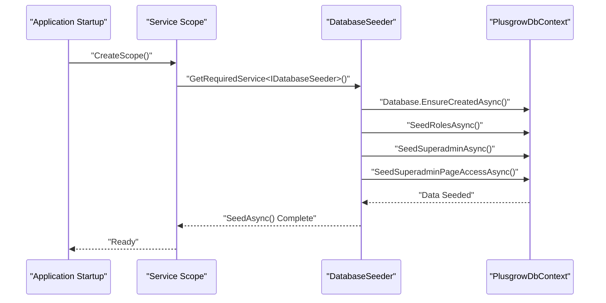

**Diagram sources**
- [Program.cs:105-110](file://Backend/PlusgrowWms.Api/Program.cs#L105-L110)
- [DatabaseSeeder.cs:23-43](file://Backend/PlusgrowWms.Api/Services/DatabaseSeeder.cs#L23-L43)
- [PlusgrowDbContext.cs:6-92](file://Backend/PlusgrowWms.Api/Data/PlusgrowDbContext.cs#L6-L92)

## Detailed Component Analysis

### PlusgrowDbContext
- Connection and provider: Configured with Npgsql for PostgreSQL using the default connection string.
- Model configuration: Applies snake_case table naming and sets unique and composite indexes for performance.
- **Cascade Delete Configurations**: Enhanced with cascade delete behaviors for Product -> Commodity and Product -> Manufacturer relationships to maintain referential integrity.
- Indexes: Unique indexes on commodity name, product SKU, user username, role name; additional indexes on product foreign keys and computed columns; composite unique index on role-page access.

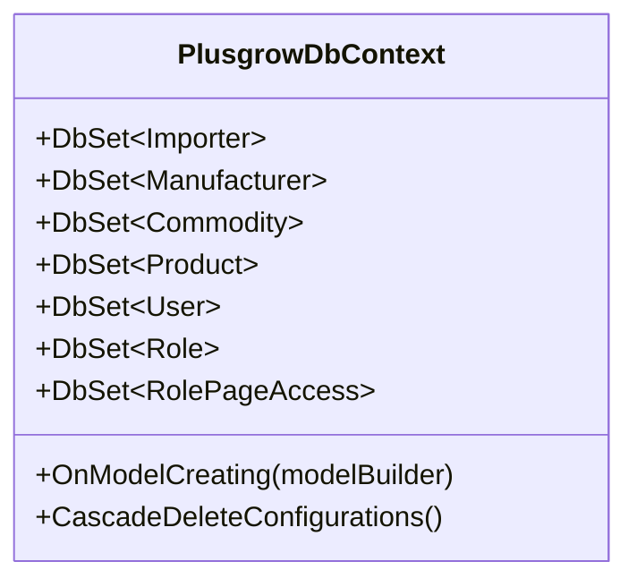

**Diagram sources**
- [PlusgrowDbContext.cs:6-92](file://Backend/PlusgrowWms.Api/Data/PlusgrowDbContext.cs#L6-L92)

**Section sources**
- [PlusgrowDbContext.cs:20-90](file://Backend/PlusgrowWms.Api/Data/PlusgrowDbContext.cs#L20-L90)
- [20260327081425_InitialCreate.cs:13-231](file://Backend/PlusgrowWms.Api/Migrations/20260327081425_InitialCreate.cs#L13-L231)
- [20260327102607_CascadeDeleteEnabled.cs:11-36](file://Backend/PlusgrowWms.Api/Migrations/20260327102607_CascadeDeleteEnabled.cs#L11-L36)

### GenericRepository<T>
- Purpose: Centralized CRUD and query operations for any entity type.
- Includes: Supports eager loading via expression-based Include chains.
- Transactions: Saves changes after add/update/delete operations.
- Extensibility: Virtual methods enable specialization in derived repositories.

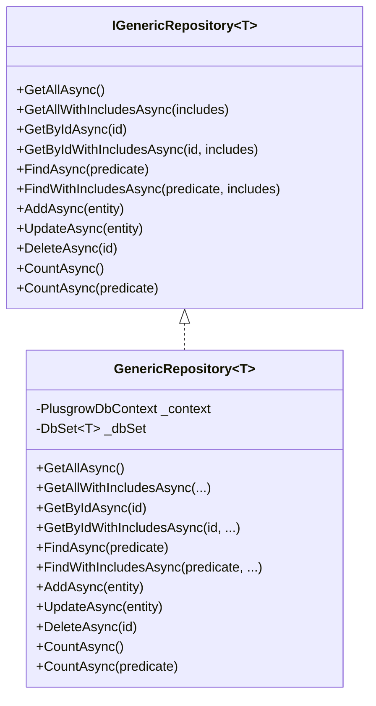

**Diagram sources**
- [GenericRepository.cs:7-117](file://Backend/PlusgrowWms.Api/Repositories/GenericRepository.cs#L7-L117)

**Section sources**
- [GenericRepository.cs:22-117](file://Backend/PlusgrowWms.Api/Repositories/GenericRepository.cs#L22-L117)

### UserRepository
- Responsibilities: Retrieve users with role, by username, create/update, and change password.
- Includes: Eager loads Role when fetching users.
- Transactionality: Persists changes after add/update operations.

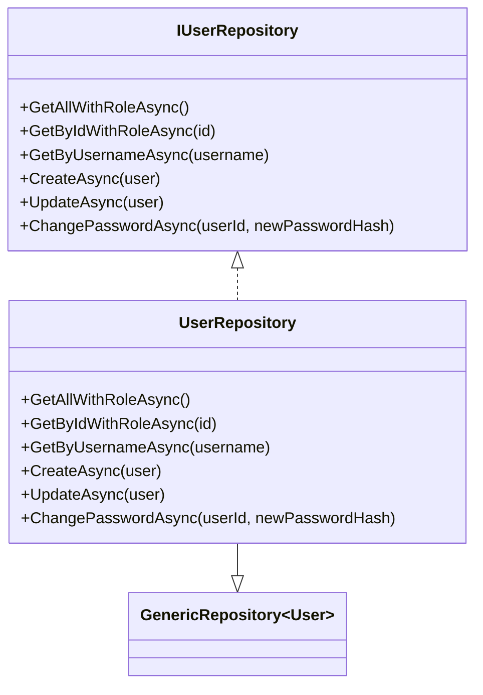

**Diagram sources**
- [UserRepository.cs:7-68](file://Backend/PlusgrowWms.Api/Repositories/UserRepository.cs#L7-L68)
- [GenericRepository.cs:22-117](file://Backend/PlusgrowWms.Api/Repositories/GenericRepository.cs#L22-L117)

**Section sources**
- [UserRepository.cs:17-68](file://Backend/PlusgrowWms.Api/Repositories/UserRepository.cs#L17-L68)
- [User.cs:6-51](file://Backend/PlusgrowWms.Api/Models/User.cs#L6-L51)

### RoleRepository
- Responsibilities: Retrieve roles with users or page access, by name, create/update, delete, and update page access entries.
- Includes: Loads related collections as needed.
- Transactionality: Persists changes after updating page access.

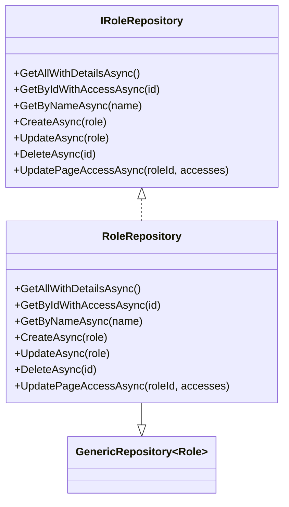

**Diagram sources**
- [RoleRepository.cs:7-71](file://Backend/PlusgrowWms.Api/Repositories/RoleRepository.cs#L7-L71)
- [GenericRepository.cs:22-117](file://Backend/PlusgrowWms.Api/Repositories/GenericRepository.cs#L22-L117)

**Section sources**
- [RoleRepository.cs:18-71](file://Backend/PlusgrowWms.Api/Repositories/RoleRepository.cs#L18-L71)
- [Role.cs:6-31](file://Backend/PlusgrowWms.Api/Models/Role.cs#L6-L31)
- [RolePageAccess.cs:6-39](file://Backend/PlusgrowWms.Api/Models/RolePageAccess.cs#L6-L39)

### DatabaseSeeder Service
- **Purpose**: Handles automated initial data population for the application.
- **Responsibilities**: Creates default roles (Superadmin, Admin), seeds a superadmin user with hashed password, and grants comprehensive page access permissions.
- **Automatic Execution**: Runs during application startup through dependency injection.
- **Error Handling**: Graceful handling of existing data scenarios without throwing exceptions.
- **Logging**: Comprehensive logging for tracking seeding progress and status.
- **Page Access Permissions**: Automatically grants full access (view, create, edit, delete) to all system pages for Superadmin role.

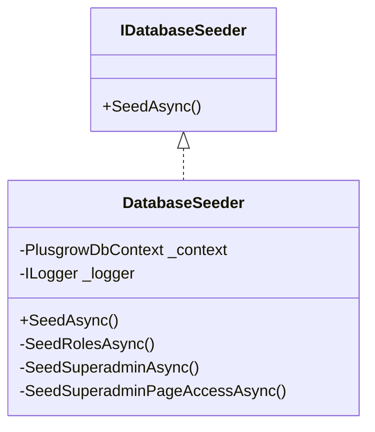

**Diagram sources**
- [DatabaseSeeder.cs:7-177](file://Backend/PlusgrowWms.Api/Services/DatabaseSeeder.cs#L7-L177)

**Section sources**
- [DatabaseSeeder.cs:12-177](file://Backend/PlusgrowWms.Api/Services/DatabaseSeeder.cs#L12-L177)

### Dependency Injection and Context Lifecycle
- Registration: DbContext is registered as scoped; repositories are registered as scoped; **DatabaseSeeder is registered as scoped**.
- Lifetime: Scoped ensures a single context per request, aligning with ASP.NET Core best practices.
- Provider: Uses Npgsql for PostgreSQL.
- **Startup Integration**: DatabaseSeeder is executed immediately after application startup to ensure database readiness.

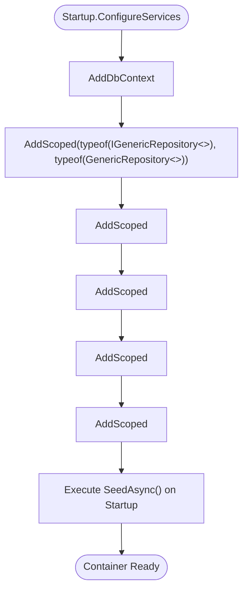

**Diagram sources**
- [Program.cs:25-37](file://Backend/PlusgrowWms.Api/Program.cs#L25-L37)
- [Program.cs:105-110](file://Backend/PlusgrowWms.Api/Program.cs#L105-L110)

**Section sources**
- [Program.cs:25-37](file://Backend/PlusgrowWms.Api/Program.cs#L25-L37)
- [Program.cs:105-110](file://Backend/PlusgrowWms.Api/Program.cs#L105-L110)

### Service Layer Integration
- AuthService depends on IUserRepository to perform authentication and user management tasks.
- Uses AutoMapper to convert models to DTOs for transport.
- **DatabaseSeeder operates independently during startup to prepare the database**.

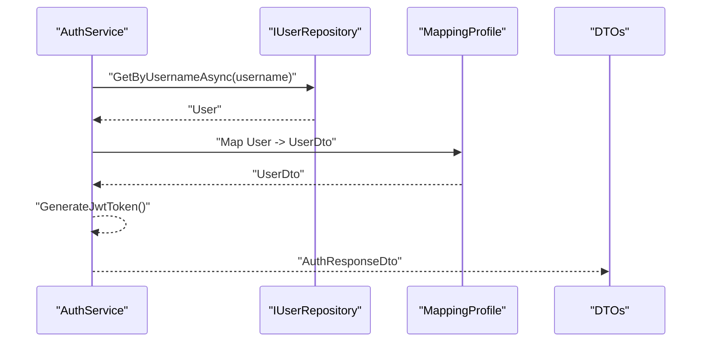

**Diagram sources**
- [AuthService.cs:23-236](file://Backend/PlusgrowWms.Api/Services/AuthService.cs#L23-L236)
- [MappingProfile.cs:7-56](file://Backend/PlusgrowWms.Api/Mappings/MappingProfile.cs#L7-L56)
- [UserDto.cs:3-15](file://Backend/PlusgrowWms.Api/DTOs/UserDto.cs#L3-L15)

**Section sources**
- [AuthService.cs:23-236](file://Backend/PlusgrowWms.Api/Services/AuthService.cs#L23-L236)
- [MappingProfile.cs:7-56](file://Backend/PlusgrowWms.Api/Mappings/MappingProfile.cs#L7-L56)
- [UserDto.cs:3-15](file://Backend/PlusgrowWms.Api/DTOs/UserDto.cs#L3-L15)

## Dependency Analysis
- Coupling: Services depend on repository interfaces, reducing coupling to concrete implementations.
- Cohesion: Repositories encapsulate persistence logic per entity.
- **DatabaseSeeder**: Independent service that prepares database state without affecting core business logic.
- External dependencies: EF Core, Npgsql, AutoMapper, FluentValidation, Serilog, BCrypt.Net for password hashing.

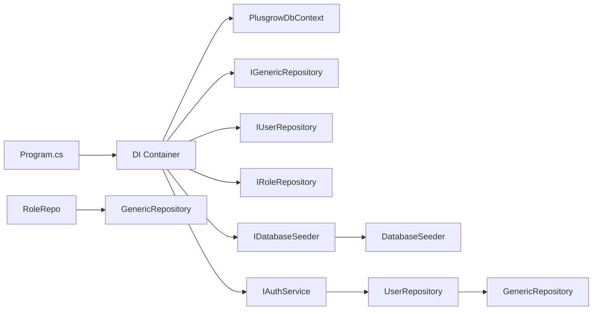

**Diagram sources**
- [Program.cs:25-37](file://Backend/PlusgrowWms.Api/Program.cs#L25-L37)
- [UserRepository.cs:17-21](file://Backend/PlusgrowWms.Api/Repositories/UserRepository.cs#L17-L21)
- [RoleRepository.cs:18-22](file://Backend/PlusgrowWms.Api/Repositories/RoleRepository.cs#L18-L22)
- [DatabaseSeeder.cs:12-177](file://Backend/PlusgrowWms.Api/Services/DatabaseSeeder.cs#L12-L177)

**Section sources**
- [Program.cs:25-37](file://Backend/PlusgrowWms.Api/Program.cs#L25-L37)

## Performance Considerations
- Indexes: Unique and composite indexes are defined in both model configuration and migrations to optimize lookups and joins.
- Includes: Use Include expressions selectively to avoid N+1 queries; UserRepository and RoleRepository demonstrate targeted eager loading.
- Asynchronous operations: All repository methods are asynchronous to prevent thread blocking.
- Change tracking: EF tracks entity changes automatically; minimize unnecessary updates to reduce overhead.
- Pagination: Consider adding Take/Skip for large datasets; implement server-side filtering and sorting.
- Caching: Introduce result caching for read-heavy, static-like data (e.g., roles, commodities) using IDistributedCache or in-memory cache with appropriate invalidation.
- **Cascade Delete Performance**: Enhanced cascade delete configurations improve referential integrity maintenance and reduce orphaned records.

## Troubleshooting Guide
- Connection failures: Verify the DefaultConnection string and PostgreSQL availability.
- Model validation errors: Ensure uniqueness constraints match DTO inputs; handle FluentValidation exceptions in controllers.
- Transaction anomalies: SaveChanges is invoked after add/update/delete in repositories; wrap higher-level operations in explicit transactions when needed.
- Logging: Serilog is configured for request logging; inspect logs for detailed error traces.
- **Database Seeding Issues**: DatabaseSeeder gracefully handles existing data scenarios; check logs for seeding progress and warnings.
- **Cascade Delete Conflicts**: Ensure cascade delete configurations are properly applied; check migration history for cascade delete enabled status.
- Environment: Development profile runs on HTTP; ensure CORS allows frontend origin during local testing.

**Section sources**
- [Program.cs:88-102](file://Backend/PlusgrowWms.Api/Program.cs#L88-L102)
- [launchSettings.json:1-15](file://Backend/PlusgrowWms.Api/Properties/launchSettings.json#L1-L15)
- [DatabaseSeeder.cs:38-43](file://Backend/PlusgrowWms.Api/Services/DatabaseSeeder.cs#L38-L43)

## Conclusion
The data access layer leverages Entity Framework Core and the Repository pattern to provide a clean, testable, and maintainable abstraction over the database. With scoped contexts, explicit repository interfaces, and careful use of includes, the system balances performance and readability. **The addition of DatabaseSeeder service enhances the system by providing automated initial data population, ensuring consistent application state across environments.** Enhanced cascade delete configurations improve data integrity and maintain referential relationships. Integrating AutoMapper and robust DI further improves developer productivity and separation of concerns.

## Appendices

### Data Models Overview
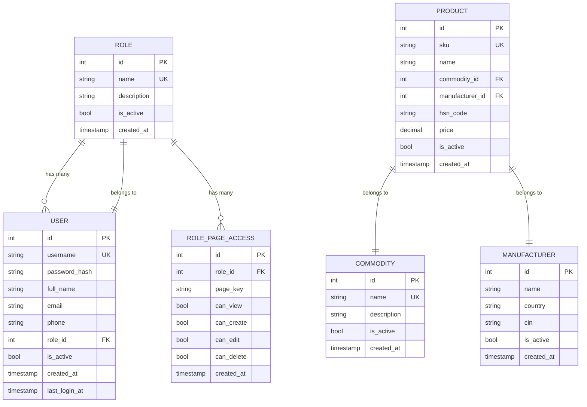

**Diagram sources**
- [Role.cs:6-31](file://Backend/PlusgrowWms.Api/Models/Role.cs#L6-L31)
- [User.cs:6-51](file://Backend/PlusgrowWms.Api/Models/User.cs#L6-L51)
- [RolePageAccess.cs:6-39](file://Backend/PlusgrowWms.Api/Models/RolePageAccess.cs#L6-L39)
- [Product.cs](file://Backend/PlusgrowWms.Api/Models/Product.cs)
- [Commodity.cs](file://Backend/PlusgrowWms.Api/Models/Commodity.cs)
- [Manufacturer.cs](file://Backend/PlusgrowWms.Api/Models/Manufacturer.cs)

### Common Data Access Scenarios
- Retrieve user with role: Use UserRepository.GetAllWithRoleAsync or GetByIdWithRoleAsync.
- Authenticate user: Use UserRepository.GetByUsernameAsync and verify password in service.
- Update role page access: Use RoleRepository.UpdatePageAccessAsync to replace related entries.
- Create user: Use UserRepository.CreateAsync; repository persists changes.
- Change password: Use UserRepository.ChangePasswordAsync; repository persists changes.
- **Seed initial data**: Use DatabaseSeeder service automatically runs on startup to populate roles and superadmin user.

**Section sources**
- [UserRepository.cs:23-66](file://Backend/PlusgrowWms.Api/Repositories/UserRepository.cs#L23-L66)
- [RoleRepository.cs:24-69](file://Backend/PlusgrowWms.Api/Repositories/RoleRepository.cs#L24-L69)
- [AuthService.cs:39-103](file://Backend/PlusgrowWms.Api/Services/AuthService.cs#L39-L103)
- [DatabaseSeeder.cs:23-43](file://Backend/PlusgrowWms.Api/Services/DatabaseSeeder.cs#L23-L43)

### Transaction Management
- Implicit transactions: SaveChanges is called after each write operation in repositories.
- Explicit transactions: Wrap multiple repository calls in a transaction scope for atomicity across operations.
- **DatabaseSeeder transactions**: Uses SaveChangesAsync for each seeding operation to maintain data consistency.

**Section sources**
- [GenericRepository.cs:84-105](file://Backend/PlusgrowWms.Api/Repositories/GenericRepository.cs#L84-L105)
- [UserRepository.cs:45-56](file://Backend/PlusgrowWms.Api/Repositories/UserRepository.cs#L45-L56)
- [RoleRepository.cs:57-69](file://Backend/PlusgrowWms.Api/Repositories/RoleRepository.cs#L57-L69)
- [DatabaseSeeder.cs:85](file://Backend/PlusgrowWms.Api/Services/DatabaseSeeder.cs#L85)
- [DatabaseSeeder.cs:122](file://Backend/PlusgrowWms.Api/Services/DatabaseSeeder.cs#L122)

### Entity Framework Features
- Change tracking: EF tracks entity modifications; UpdateAsync marks entities as modified.
- Lazy loading: Not enabled in current configuration; rely on explicit includes.
- Eager loading: Implemented via Include expressions in repository methods.
- **Cascade Delete**: Enhanced cascade delete configurations for Product -> Commodity and Product -> Manufacturer relationships.

**Section sources**
- [GenericRepository.cs:38-82](file://Backend/PlusgrowWms.Api/Repositories/GenericRepository.cs#L38-L82)
- [UserRepository.cs:23-43](file://Backend/PlusgrowWms.Api/Repositories/UserRepository.cs#L23-L43)
- [RoleRepository.cs:24-37](file://Backend/PlusgrowWms.Api/Repositories/RoleRepository.cs#L24-L37)
- [PlusgrowDbContext.cs:31-43](file://Backend/PlusgrowWms.Api/Data/PlusgrowDbContext.cs#L31-L43)

### Database Initialization Process
- **Automatic Seeding**: DatabaseSeeder executes immediately after application startup.
- **Role Creation**: Creates Superadmin and Admin roles with appropriate descriptions.
- **Superadmin Setup**: Creates default superadmin user with hashed password and comprehensive permissions.
- **Page Access**: Grants full access to all system pages for Superadmin role.
- **Idempotent Operations**: Gracefully handles existing data without throwing exceptions.

**Section sources**
- [Program.cs:105-110](file://Backend/PlusgrowWms.Api/Program.cs#L105-L110)
- [DatabaseSeeder.cs:23-43](file://Backend/PlusgrowWms.Api/Services/DatabaseSeeder.cs#L23-L43)
- [DatabaseSeeder.cs:88-140](file://Backend/PlusgrowWms.Api/Services/DatabaseSeeder.cs#L88-L140)
- [DatabaseSeeder.cs:142-175](file://Backend/PlusgrowWms.Api/Services/DatabaseSeeder.cs#L142-L175)