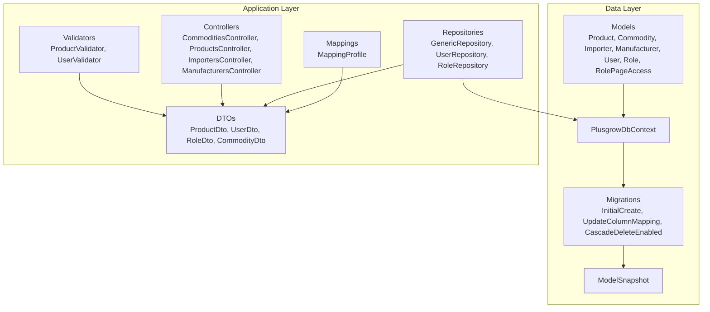
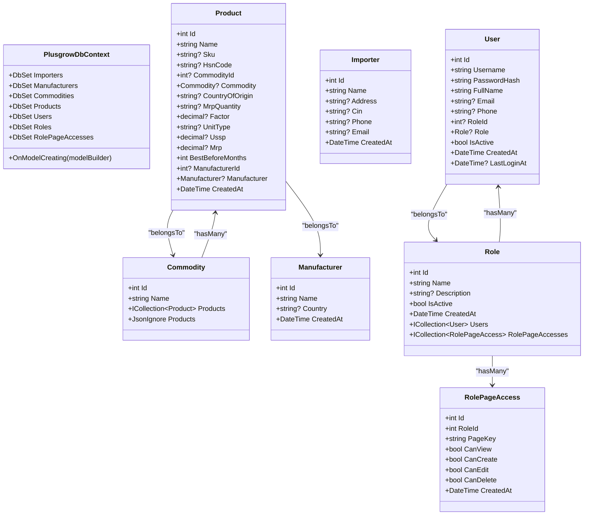
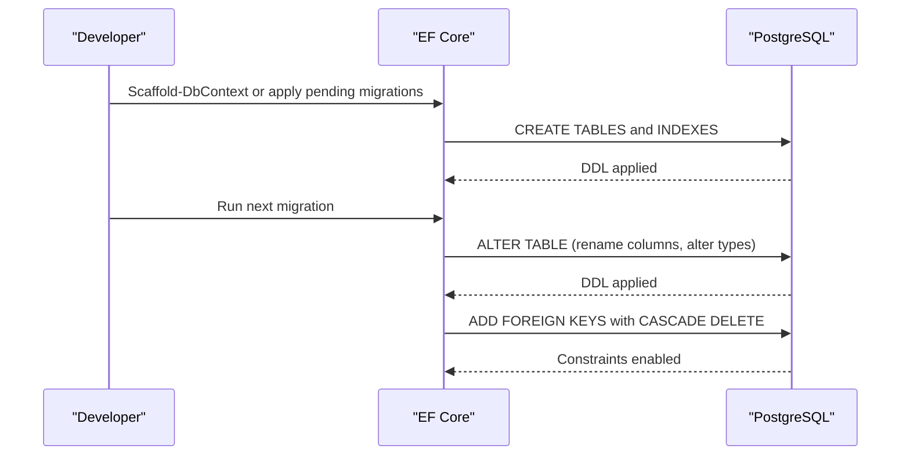
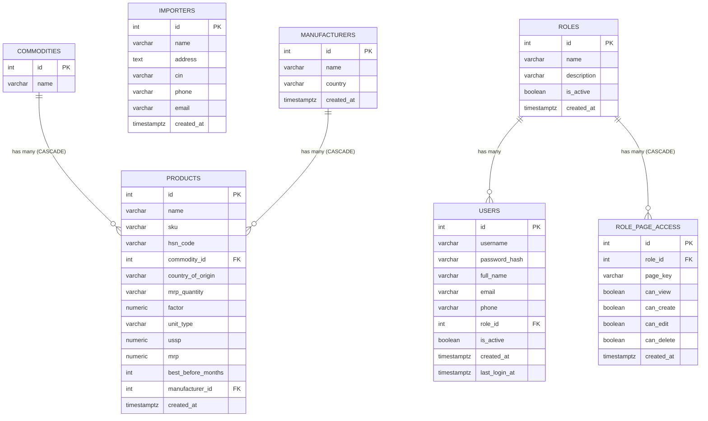
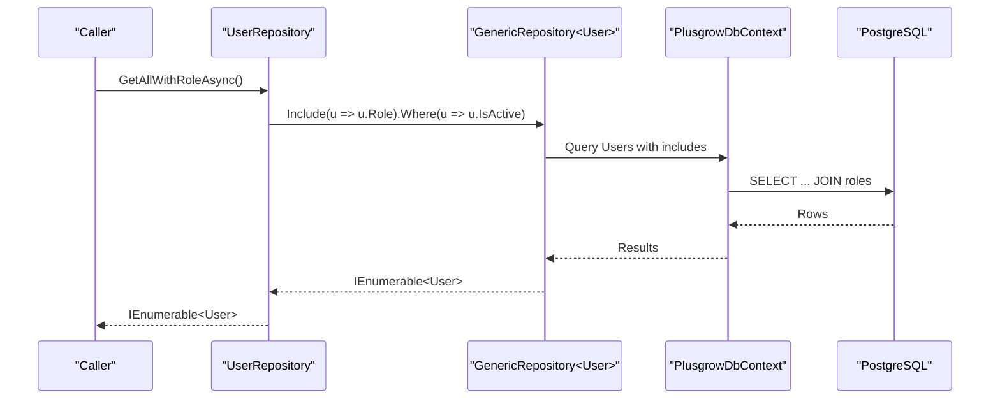
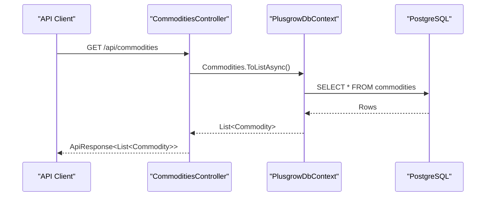
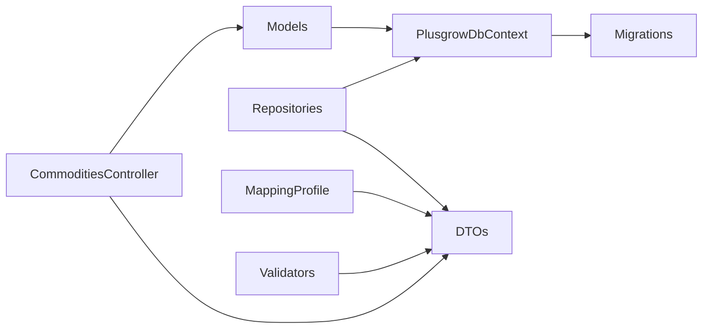

# Data Models and Database Schema

<cite>
**Referenced Files in This Document**
- [PlusgrowDbContext.cs](file://Backend/PlusgrowWms.Api/Data/PlusgrowDbContext.cs)
- [Product.cs](file://Backend/PlusgrowWms.Api/Models/Product.cs)
- [Commodity.cs](file://Backend/PlusgrowWms.Api/Models/Commodity.cs)
- [Importer.cs](file://Backend/PlusgrowWms.Api/Models/Importer.cs)
- [Manufacturer.cs](file://Backend/PlusgrowWms.Api/Models/Manufacturer.cs)
- [User.cs](file://Backend/PlusgrowWms.Api/Models/User.cs)
- [Role.cs](file://Backend/PlusgrowWms.Api/Models/Role.cs)
- [RolePageAccess.cs](file://Backend/PlusgrowWms.Api/Models/RolePageAccess.cs)
- [CommoditiesController.cs](file://Backend/PlusgrowWms.Api/Controllers/CommoditiesController.cs)
- [CommonDto.cs](file://Backend/PlusgrowWms.Api/DTOs/CommonDto.cs)
- [20260327081425_InitialCreate.cs](file://Backend/PlusgrowWms.Api/Migrations/20260327081425_InitialCreate.cs)
- [20260327090401_UpdateColumnMapping.cs](file://Backend/PlusgrowWms.Api/Migrations/20260327090401_UpdateColumnMapping.cs)
- [20260327102607_CascadeDeleteEnabled.cs](file://Backend/PlusgrowWms.Api/Migrations/20260327102607_CascadeDeleteEnabled.cs)
- [PlusgrowDbContextModelSnapshot.cs](file://Backend/PlusgrowWms.Api/Migrations/PlusgrowDbContextModelSnapshot.cs)
- [MappingProfile.cs](file://Backend/PlusgrowWms.Api/Mappings/MappingProfile.cs)
- [GenericRepository.cs](file://Backend/PlusgrowWms.Api/Repositories/GenericRepository.cs)
- [UserRepository.cs](file://Backend/PlusgrowWms.Api/Repositories/UserRepository.cs)
- [RoleRepository.cs](file://Backend/PlusgrowWms.Api/Repositories/RoleRepository.cs)
- [ProductDto.cs](file://Backend/PlusgrowWms.Api/DTOs/ProductDto.cs)
- [UserDto.cs](file://Backend/PlusgrowWms.Api/DTOs/UserDto.cs)
- [RoleDto.cs](file://Backend/PlusgrowWms.Api/DTOs/RoleDto.cs)
- [ProductValidator.cs](file://Backend/PlusgrowWms.Api/Validators/ProductValidator.cs)
- [UserValidator.cs](file://Backend/PlusgrowWms.Api/Validators/UserValidator.cs)
</cite>

## Update Summary
**Changes Made**
- Enhanced cascade delete configuration for Product -> Commodity and Product -> Manufacturer relationships with explicit cascade delete behaviors
- Improved relationship management with explicit foreign key configurations and referential integrity rules
- Enhanced Commodity entity with JsonIgnore attribute to prevent circular JSON serialization issues
- Added dedicated CommoditiesController with full CRUD operations for commodity management
- Introduced CommodityDto and CreateCommodityDto for API communication patterns
- Updated database context with explicit cascade delete behaviors for improved data consistency

## Table of Contents
1. [Introduction](#introduction)
2. [Project Structure](#project-structure)
3. [Core Components](#core-components)
4. [Architecture Overview](#architecture-overview)
5. [Detailed Component Analysis](#detailed-component-analysis)
6. [Dependency Analysis](#dependency-analysis)
7. [Performance Considerations](#performance-considerations)
8. [Troubleshooting Guide](#troubleshooting-guide)
9. [Conclusion](#conclusion)
10. [Appendices](#appendices)

## Introduction
This document provides comprehensive data model documentation for the PlusGrow WMS database schema and entity relationships. It covers domain entities (Product, Commodity, Importer, Manufacturer, User, Role, RolePageAccess), their properties, data types, constraints, and relationships. It also documents database context configuration, Entity Framework mappings, migration management, indexing strategies, performance considerations, validation rules, and repository-based data access patterns.

## Project Structure
The backend data layer is organized around:
- Models: POCOs representing database entities
- Data: DbContext and migrations
- Mappings: AutoMapper profiles for DTO conversions
- Repositories: Generic and specialized repositories implementing CRUD and advanced queries
- Controllers: REST API endpoints for entity management
- DTOs and Validators: Data transfer objects and validation rules for API-bound data

**Diagram sources**
- [PlusgrowDbContext.cs:6-78](file://Backend/PlusgrowWms.Api/Data/PlusgrowDbContext.cs#L6-L78)
- [GenericRepository.cs:22-117](file://Backend/PlusgrowWms.Api/Repositories/GenericRepository.cs#L22-L117)
- [UserRepository.cs:17-68](file://Backend/PlusgrowWms.Api/Repositories/UserRepository.cs#L17-L68)
- [RoleRepository.cs:18-71](file://Backend/PlusgrowWms.Api/Repositories/RoleRepository.cs#L18-L71)
- [CommoditiesController.cs:11-81](file://Backend/PlusgrowWms.Api/Controllers/CommoditiesController.cs#L11-L81)
- [MappingProfile.cs:7-56](file://Backend/PlusgrowWms.Api/Mappings/MappingProfile.cs#L7-L56)
- [CommonDto.cs:37-46](file://Backend/PlusgrowWms.Api/DTOs/CommonDto.cs#L37-L46)
- [ProductDto.cs:1-55](file://Backend/PlusgrowWms.Api/DTOs/ProductDto.cs#L1-L55)
- [UserDto.cs:1-43](file://Backend/PlusgrowWms.Api/DTOs/UserDto.cs#L1-L43)
- [RoleDto.cs:1-52](file://Backend/PlusgrowWms.Api/DTOs/RoleDto.cs#L1-L52)
- [ProductValidator.cs:6-33](file://Backend/PlusgrowWms.Api/Validators/ProductValidator.cs#L6-L33)
- [UserValidator.cs:6-64](file://Backend/PlusgrowWms.Api/Validators/UserValidator.cs#L6-L64)

**Section sources**
- [PlusgrowDbContext.cs:6-78](file://Backend/PlusgrowWms.Api/Data/PlusgrowDbContext.cs#L6-L78)
- [GenericRepository.cs:7-117](file://Backend/PlusgrowWms.Api/Repositories/GenericRepository.cs#L7-L117)
- [CommoditiesController.cs:11-81](file://Backend/PlusgrowWms.Api/Controllers/CommoditiesController.cs#L11-L81)

## Core Components
This section documents each domain entity, its properties, data types, constraints, and relationships.

- Product
  - Purpose: Represents stockable items with commodity and manufacturer associations, pricing, unit factors, and shelf life.
  - Key properties and constraints:
    - Id: integer, primary key
    - Name: string, required, max length 255
    - Sku: string, optional, max length 100
    - HsnCode: string, optional, max length 20
    - CommodityId: integer, foreign key to Commodity
    - CountryOfOrigin: string, optional, max length 100
    - MrpQuantity: string, optional, max length 50
    - Factor: decimal, optional
    - UnitType: string, optional, max length 20
    - Ussp: decimal, optional
    - Mrp: decimal, optional
    - BestBeforeMonths: integer, default 120
    - ManufacturerId: integer, foreign key to Manufacturer
    - CreatedAt: datetime, default UTC now
  - Relationships:
    - Belongs to Commodity (optional)
    - Belongs to Manufacturer (optional)

- Commodity
  - Purpose: Categorization of products with enhanced JSON serialization handling.
  - Key properties and constraints:
    - Id: integer, primary key
    - Name: string, required, max length 150
  - Relationships:
    - One-to-many with Product
  - **Enhanced** Added JsonIgnore attribute to prevent circular JSON serialization issues in API responses.

- Importer
  - Purpose: Records import-related information for products.
  - Key properties and constraints:
    - Id: integer, primary key
    - Name: string, required, max length 255
    - Address: string, optional
    - Cin: string, optional, max length 50
    - Phone: string, optional, max length 20
    - Email: string, optional, max length 100
    - CreatedAt: datetime, default UTC now

- Manufacturer
  - Purpose: Manufacturer metadata.
  - Key properties and constraints:
    - Id: integer, primary key
    - Name: string, required, max length 255
    - Country: string, optional, max length 100
    - CreatedAt: datetime, default UTC now

- User
  - Purpose: Application users with roles and authentication attributes.
  - Key properties and constraints:
    - Id: integer, primary key
    - Username: string, required, max length 100
    - PasswordHash: string, required, max length 255
    - FullName: string, required, max length 255
    - Email: string, optional, max length 100
    - Phone: string, optional, max length 20
    - RoleId: integer, foreign key to Role
    - IsActive: boolean, default true
    - CreatedAt: datetime, default UTC now
    - LastLoginAt: datetime, optional
  - Relationships:
    - Belongs to Role (optional)

- Role
  - Purpose: User role with page access permissions.
  - Key properties and constraints:
    - Id: integer, primary key
    - Name: string, required, max length 50
    - Description: string, optional, max length 255
    - IsActive: boolean, default true
    - CreatedAt: datetime, default UTC now
  - Relationships:
    - One-to-many with User
    - One-to-many with RolePageAccess

- RolePageAccess
  - Purpose: Defines granular page-level permissions per role.
  - Key properties and constraints:
    - Id: integer, primary key
    - RoleId: integer, foreign key to Role
    - PageKey: string, required, max length 50
    - CanView, CanCreate, CanEdit, CanDelete: booleans
    - CreatedAt: datetime, default UTC now

**Section sources**
- [Product.cs:6-65](file://Backend/PlusgrowWms.Api/Models/Product.cs#L6-L65)
- [Commodity.cs:6-22](file://Backend/PlusgrowWms.Api/Models/Commodity.cs#L6-L22)
- [Importer.cs:6-36](file://Backend/PlusgrowWms.Api/Models/Importer.cs#L6-L36)
- [Manufacturer.cs:6-25](file://Backend/PlusgrowWms.Api/Models/Manufacturer.cs#L6-L25)
- [User.cs:6-51](file://Backend/PlusgrowWms.Api/Models/User.cs#L6-L51)
- [Role.cs:6-31](file://Backend/PlusgrowWms.Api/Models/Role.cs#L6-L31)
- [RolePageAccess.cs](file://Backend/PlusgrowWms.Api/Models/RolePageAccess.cs)

## Architecture Overview
The data model is backed by Entity Framework Core with PostgreSQL via Npgsql. The DbContext configures naming conventions, unique indexes, and foreign keys. Migrations define the evolving schema, while repositories encapsulate data access and AutoMapper profiles handle DTO mapping. REST API controllers provide CRUD operations for all entities including the new Commodity management functionality.

**Diagram sources**
- [PlusgrowDbContext.cs:12-18](file://Backend/PlusgrowWms.Api/Data/PlusgrowDbContext.cs#L12-L18)
- [Product.cs:6-65](file://Backend/PlusgrowWms.Api/Models/Product.cs#L6-L65)
- [Commodity.cs:6-22](file://Backend/PlusgrowWms.Api/Models/Commodity.cs#L6-L22)
- [Importer.cs:6-36](file://Backend/PlusgrowWms.Api/Models/Importer.cs#L6-L36)
- [Manufacturer.cs:6-25](file://Backend/PlusgrowWms.Api/Models/Manufacturer.cs#L6-L25)
- [User.cs:6-51](file://Backend/PlusgrowWms.Api/Models/User.cs#L6-L51)
- [Role.cs:6-31](file://Backend/PlusgrowWms.Api/Models/Role.cs#L6-L31)
- [RolePageAccess.cs](file://Backend/PlusgrowWms.Api/Models/RolePageAccess.cs)

## Detailed Component Analysis

### Database Context and Indexing
- Naming convention: All table names are normalized to lowercase.
- Unique indexes:
  - Commodity.Name
  - Product.Sku
  - User.Username
  - Role.Name
  - RolePageAccess.RoleId + PageKey (composite unique)
- Additional performance indexes:
  - Product.CommodityId, Product.ManufacturerId, Product.HsnCode, Product.Name
  - User.RoleId, User.IsActive
  - Importer.Cin
  - Manufacturer.Country
- **Enhanced Cascade Delete Relationships**:
  - Product.CommodityId -> Commodity.Id (CASCADE DELETE)
  - Product.ManufacturerId -> Manufacturer.Id (CASCADE DELETE)
  - RolePageAccess.RoleId -> Role.Id (CASCADE DELETE)

These cascade delete relationships ensure referential integrity by automatically removing dependent records when parent records are deleted.

**Section sources**
- [PlusgrowDbContext.cs:20-76](file://Backend/PlusgrowWms.Api/Data/PlusgrowDbContext.cs#L20-L76)
- [PlusgrowDbContext.cs:31-43](file://Backend/PlusgrowWms.Api/Data/PlusgrowDbContext.cs#L31-L43)

### Migrations and Schema Evolution
- InitialCreate migration establishes all tables with primary keys, foreign keys, and unique indexes.
- UpdateColumnMapping migration renames columns to snake_case and adjusts numeric precision for price fields, then re-establishes foreign keys with corrected column names.
- **CascadeDeleteEnabled migration adds cascade delete behaviors to critical foreign key relationships**, enhancing referential integrity and data consistency.

**Diagram sources**
- [20260327081425_InitialCreate.cs:13-257](file://Backend/PlusgrowWms.Api/Migrations/20260327081425_InitialCreate.cs#L13-L257)
- [20260327090401_UpdateColumnMapping.cs:11-399](file://Backend/PlusgrowWms.Api/Migrations/20260327090401_UpdateColumnMapping.cs#L11-L399)
- [20260327102607_CascadeDeleteEnabled.cs:11-36](file://Backend/PlusgrowWms.Api/Migrations/20260327102607_CascadeDeleteEnabled.cs#L11-L36)

**Section sources**
- [20260327081425_InitialCreate.cs:13-257](file://Backend/PlusgrowWms.Api/Migrations/20260327081425_InitialCreate.cs#L13-L257)
- [20260327090401_UpdateColumnMapping.cs:11-399](file://Backend/PlusgrowWms.Api/Migrations/20260327090401_UpdateColumnMapping.cs#L11-L399)
- [20260327102607_CascadeDeleteEnabled.cs:11-36](file://Backend/PlusgrowWms.Api/Migrations/20260327102607_CascadeDeleteEnabled.cs#L11-L36)

### Entity Relationships and Referential Integrity
- Product.CommodityId -> Commodity.Id (optional to optional) with CASCADE DELETE
- Product.ManufacturerId -> Manufacturer.Id (optional to optional) with CASCADE DELETE
- User.RoleId -> Role.Id (optional to optional)
- RolePageAccess.RoleId -> Role.Id (with cascade delete on role removal)

**Enhanced** Enhanced with cascade delete behaviors that automatically remove dependent records when parent entities are deleted, improving data consistency and preventing orphaned records. The Commodity entity now includes proper JSON serialization handling to prevent circular reference issues.

**Diagram sources**
- [20260327081425_InitialCreate.cs:15-135](file://Backend/PlusgrowWms.Api/Migrations/20260327081425_InitialCreate.cs#L15-L135)
- [PlusgrowDbContext.cs:12-18](file://Backend/PlusgrowWms.Api/Data/PlusgrowDbContext.cs#L12-L18)
- [20260327102607_CascadeDeleteEnabled.cs:21-35](file://Backend/PlusgrowWms.Api/Migrations/20260327102607_CascadeDeleteEnabled.cs#L21-L35)

**Section sources**
- [20260327081425_InitialCreate.cs:100-134](file://Backend/PlusgrowWms.Api/Migrations/20260327081425_InitialCreate.cs#L100-L134)
- [PlusgrowDbContext.cs:12-18](file://Backend/PlusgrowWms.Api/Data/PlusgrowDbContext.cs#L12-L18)
- [20260327102607_CascadeDeleteEnabled.cs:21-35](file://Backend/PlusgrowWms.Api/Migrations/20260327102607_CascadeDeleteEnabled.cs#L21-L35)

### Data Access Patterns and Repository Integration
- GenericRepository<T>: Provides standard CRUD and query operations with include support.
- UserRepository: Adds role-aware retrieval and password change operations.
- RoleRepository: Adds role details, page access updates, and filtered queries.

**Diagram sources**
- [UserRepository.cs:23-28](file://Backend/PlusgrowWms.Api/Repositories/UserRepository.cs#L23-L28)
- [GenericRepository.cs:38-47](file://Backend/PlusgrowWms.Api/Repositories/GenericRepository.cs#L38-L47)

**Section sources**
- [GenericRepository.cs:7-117](file://Backend/PlusgrowWms.Api/Repositories/GenericRepository.cs#L7-L117)
- [UserRepository.cs:7-68](file://Backend/PlusgrowWms.Api/Repositories/UserRepository.cs#L7-L68)
- [RoleRepository.cs:7-71](file://Backend/PlusgrowWms.Api/Repositories/RoleRepository.cs#L7-L71)

### DTOs and Mapping Strategy
AutoMapper profiles convert between domain models and DTOs:
- UserDto: Includes RoleName derived from related Role
- RoleDto: Includes computed UserCount
- ProductDto: Includes CommodityName and ManufacturerName derived from related entities
- **CommodityDto**: Simple DTO for commodity management with Id and Name properties
- Create/Update DTOs exclude sensitive fields (e.g., PasswordHash) and navigation properties

**Section sources**
- [MappingProfile.cs:7-56](file://Backend/PlusgrowWms.Api/Mappings/MappingProfile.cs#L7-L56)
- [ProductDto.cs:1-55](file://Backend/PlusgrowWms.Api/DTOs/ProductDto.cs#L1-L55)
- [UserDto.cs:1-43](file://Backend/PlusgrowWms.Api/DTOs/UserDto.cs#L1-L43)
- [RoleDto.cs:1-52](file://Backend/PlusgrowWms.Api/DTOs/RoleDto.cs#L1-L52)
- [CommonDto.cs:37-46](file://Backend/PlusgrowWms.Api/DTOs/CommonDto.cs#L37-L46)

### Validation Rules and Business Constraints
- Product validation:
  - Name required, max length 255
  - Sku max length 100
  - HSN code max length 20
  - MRP >= 0 (when present)
  - USSP >= 0 (when present)
  - Factor > 0 (when present)
- User creation/update validation:
  - Username required, max length 100
  - Password required for create, min length 6
  - Full name required, max length 255
  - Email format when present
  - Phone max length 20
  - ChangePasswordDto enforces new password differs from current and meets length requirements

**Section sources**
- [ProductValidator.cs:6-33](file://Backend/PlusgrowWms.Api/Validators/ProductValidator.cs#L6-L33)
- [UserValidator.cs:6-64](file://Backend/PlusgrowWms.Api/Validators/UserValidator.cs#L6-L64)

### REST API Controllers
**Enhanced** Added dedicated CommoditiesController with full CRUD operations for commodity management:
- GET /api/commodities: Retrieve all commodities
- GET /api/commodities/{id}: Retrieve specific commodity
- POST /api/commodities: Create new commodity
- PUT /api/commodities/{id}: Update existing commodity
- DELETE /api/commodities/{id}: Delete commodity

**Diagram sources**
- [CommoditiesController.cs:20-25](file://Backend/PlusgrowWms.Api/Controllers/CommoditiesController.cs#L20-L25)

**Section sources**
- [CommoditiesController.cs:11-81](file://Backend/PlusgrowWms.Api/Controllers/CommoditiesController.cs#L11-L81)

## Dependency Analysis
- Models depend on System.ComponentModel.DataAnnotations for validation attributes.
- DbContext depends on Microsoft.EntityFrameworkCore and all model types.
- Repositories depend on DbContext and DbSet<T>.
- Mappings depend on AutoMapper and DTOs.
- Validators depend on FluentValidation and DTOs.
- **Controllers depend on Models, DTOs, and DbContext for API operations**.

**Diagram sources**
- [PlusgrowDbContext.cs:6-78](file://Backend/PlusgrowWms.Api/Data/PlusgrowDbContext.cs#L6-L78)
- [GenericRepository.cs:22-117](file://Backend/PlusgrowWms.Api/Repositories/GenericRepository.cs#L22-L117)
- [MappingProfile.cs:7-56](file://Backend/PlusgrowWms.Api/Mappings/MappingProfile.cs#L7-L56)
- [ProductValidator.cs:6-33](file://Backend/PlusgrowWms.Api/Validators/ProductValidator.cs#L6-L33)
- [UserValidator.cs:6-64](file://Backend/PlusgrowWms.Api/Validators/UserValidator.cs#L6-L64)
- [CommoditiesController.cs:11-81](file://Backend/PlusgrowWms.Api/Controllers/CommoditiesController.cs#L11-L81)

**Section sources**
- [PlusgrowDbContext.cs:6-78](file://Backend/PlusgrowWms.Api/Data/PlusgrowDbContext.cs#L6-L78)
- [GenericRepository.cs:22-117](file://Backend/PlusgrowWms.Api/Repositories/GenericRepository.cs#L22-L117)
- [MappingProfile.cs:7-56](file://Backend/PlusgrowWms.Api/Mappings/MappingProfile.cs#L7-L56)
- [ProductValidator.cs:6-33](file://Backend/PlusgrowWms.Api/Validators/ProductValidator.cs#L6-L33)
- [UserValidator.cs:6-64](file://Backend/PlusgrowWms.Api/Validators/UserValidator.cs#L6-L64)
- [CommoditiesController.cs:11-81](file://Backend/PlusgrowWms.Api/Controllers/CommoditiesController.cs#L11-L81)

## Performance Considerations
- Indexes:
  - Unique indexes on high-selectivity fields (SKU, Username, Role.Name, Commodity.Name, composite RoleId+PageKey)
  - Additional indexes on foreign keys and frequently filtered columns (Product.CommodityId, Product.ManufacturerId, Product.HsnCode, Product.Name; User.RoleId, User.IsActive; Importer.Cin; Manufacturer.Country)
- Numeric precision:
  - Price fields adjusted to generic numeric to avoid unnecessary precision constraints
- Query patterns:
  - Use includes selectively to minimize N+1 scenarios
  - Prefer filtered queries with indexes (e.g., by SKU, Username, RoleId)
- Concurrency:
  - Consider optimistic concurrency tokens if applicable
- Caching:
  - Cache static reference data (Roles, Commodities) with invalidation on changes
- **Enhanced Cascade Delete Performance**:
  - Cascade delete operations can trigger cascading deletes across multiple levels
  - Monitor performance impact when deleting parent entities with many dependent records
  - Consider batch deletion strategies for large datasets
  - **Cascade delete behaviors are now explicitly configured for Product -> Commodity and Product -> Manufacturer relationships**
- **JSON Serialization Optimization**:
  - Commodity Products collection uses JsonIgnore to prevent circular reference serialization
  - This improves API response performance and prevents stack overflow during serialization

## Troubleshooting Guide
- Migration errors:
  - Ensure foreign keys are dropped before renaming columns and re-added afterward
  - Verify index names match after rename operations
  - **Cascade delete migrations require careful handling of foreign key constraints**
- Index conflicts:
  - Unique index violations occur when inserting duplicate values in indexed columns (SKU, Username, Role.Name, Commodity.Name, RoleId+PageKey)
- Validation failures:
  - DTO validation exceptions indicate constraint violations (length, format, range)
- Repository issues:
  - Missing includes may cause null navigation properties; use GetByIdWithIncludesAsync or repository-specific include methods
- **Enhanced Cascade Delete Issues**:
  - Deleting a Commodity will automatically delete all associated Products (CASCADE DELETE)
  - Deleting a Manufacturer will automatically delete all associated Products (CASCADE DELETE)
  - Deleting a Role will automatically delete all associated RolePageAccess records
  - Be cautious when deleting parent entities that have cascade delete configured
- **API Controller Issues**:
  - Commodity CRUD operations are handled by CommoditiesController
  - Ensure proper DTO mapping for CreateCommodityDto and CommodityDto
  - Handle ID mismatch errors in PUT requests

**Section sources**
- [20260327090401_UpdateColumnMapping.cs:11-399](file://Backend/PlusgrowWms.Api/Migrations/20260327090401_UpdateColumnMapping.cs#L11-L399)
- [20260327102607_CascadeDeleteEnabled.cs:11-36](file://Backend/PlusgrowWms.Api/Migrations/20260327102607_CascadeDeleteEnabled.cs#L11-L36)
- [ProductValidator.cs:6-33](file://Backend/PlusgrowWms.Api/Validators/ProductValidator.cs#L6-L33)
- [UserValidator.cs:6-64](file://Backend/PlusgrowWms.Api/Validators/UserValidator.cs#L6-L64)
- [CommoditiesController.cs:47-48](file://Backend/PlusgrowWms.Api/Controllers/CommoditiesController.cs#L47-L48)

## Conclusion
The PlusGrow WMS data model is designed around clean entity relationships with explicit foreign keys and a robust indexing strategy. Recent enhancements include cascade delete relationships that improve referential integrity and prevent orphaned records, enhanced Commodity entity with proper JSON serialization handling, and dedicated REST API controllers for comprehensive CRUD operations. Entity Framework handles schema evolution through migrations, while repositories and DTOs provide structured data access and validation. The combination of unique and composite indexes, along with careful query design, cascade delete behaviors, and proper API endpoint management, supports efficient read and write operations across product catalog, user management, role-based access control, and commodity management.

## Appendices

### Common Queries and Operations
- Retrieve active users with role details:
  - Use UserRepository.GetAllWithRoleAsync to include Role and filter by IsActive
- Update role page access:
  - Use RoleRepository.UpdatePageAccessAsync to replace existing access entries for a role
- Product search by SKU or name:
  - Use GenericRepository.FindAsync with predicates on Product.Sku or Product.Name
- Create product with commodity/manufacturer:
  - Map CreateProductDto to Product, set CommodityId and ManufacturerId, then AddAsync via GenericRepository
- **Enhanced Commodity Management**:
  - CRUD operations via CommoditiesController endpoints
  - Create commodity using CreateCommodityDto
  - Retrieve commodity details with CommodityDto
  - **Cascade delete ensures automatic cleanup when commodities are removed**
- **Enhanced Cascade Delete Operations**:
  - Deleting a Commodity automatically deletes all associated Products (CASCADE DELETE)
  - Deleting a Manufacturer automatically deletes all associated Products (CASCADE DELETE)
  - Deleting a Role automatically deletes all associated RolePageAccess records

**Section sources**
- [UserRepository.cs:23-28](file://Backend/PlusgrowWms.Api/Repositories/UserRepository.cs#L23-L28)
- [RoleRepository.cs:57-69](file://Backend/PlusgrowWms.Api/Repositories/RoleRepository.cs#L57-L69)
- [GenericRepository.cs:67-82](file://Backend/PlusgrowWms.Api/Repositories/GenericRepository.cs#L67-L82)
- [ProductDto.cs:23-37](file://Backend/PlusgrowWms.Api/DTOs/ProductDto.cs#L23-L37)
- [CommoditiesController.cs:20-77](file://Backend/PlusgrowWms.Api/Controllers/CommoditiesController.cs#L20-L77)
- [20260327102607_CascadeDeleteEnabled.cs:21-35](file://Backend/PlusgrowWms.Api/Migrations/20260327102607_CascadeDeleteEnabled.cs#L21-L35)

### Migration Procedures
- To add a new index:
  - Define the index in PlusgrowDbContext.OnModelCreating
  - Scaffold a new migration and apply
- To rename a column:
  - Drop foreign keys, rename column, adjust indexes, re-add foreign keys, then apply migration
- To alter numeric precision:
  - Use AlterColumn in migration and update model snapshot
- **To add cascade delete relationships**:
  - Configure cascade delete in PlusgrowDbContext.OnModelCreating using OnDelete(DeleteBehavior.Cascade)
  - Add foreign key constraints with explicit cascade behavior
  - Generate and apply migration
  - Test cascade delete behavior with sample data
- **To update Commodity entity**:
  - Add JsonIgnore attribute to Products collection
  - Ensure proper cascade delete configuration in OnModelCreating
  - Update DTOs if needed for API communication

**Section sources**
- [PlusgrowDbContext.cs:20-76](file://Backend/PlusgrowWms.Api/Data/PlusgrowDbContext.cs#L20-L76)
- [20260327090401_UpdateColumnMapping.cs:344-369](file://Backend/PlusgrowWms.Api/Migrations/20260327090401_UpdateColumnMapping.cs#L344-L369)
- [20260327102607_CascadeDeleteEnabled.cs:11-36](file://Backend/PlusgrowWms.Api/Migrations/20260327102607_CascadeDeleteEnabled.cs#L11-L36)
- [Commodity.cs:19-20](file://Backend/PlusgrowWms.Api/Models/Commodity.cs#L19-L20)