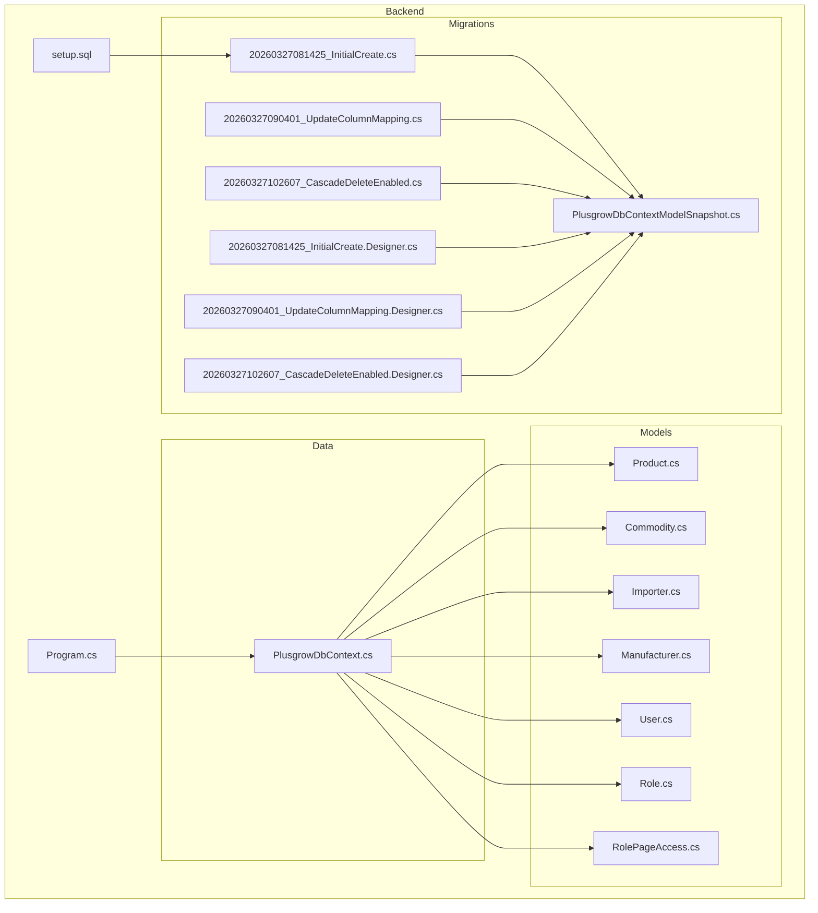
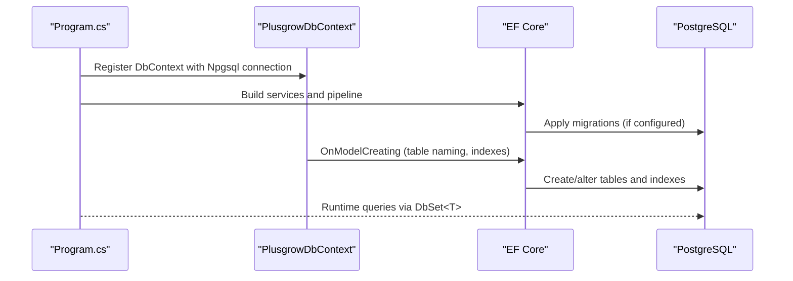
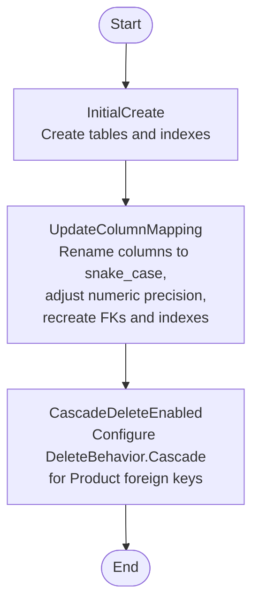
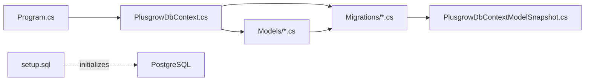

# Database Schema and Relationships

<cite>
**Referenced Files in This Document**
- [PlusgrowDbContext.cs](file://Backend/PlusgrowWms.Api/Data/PlusgrowDbContext.cs)
- [Program.cs](file://Backend/PlusgrowWms.Api/Program.cs)
- [setup.sql](file://Backend/setup.sql)
- [20260327081425_InitialCreate.cs](file://Backend/PlusgrowWms.Api/Migrations/20260327081425_InitialCreate.cs)
- [20260327090401_UpdateColumnMapping.cs](file://Backend/PlusgrowWms.Api/Migrations/20260327090401_UpdateColumnMapping.cs)
- [20260327102607_CascadeDeleteEnabled.cs](file://Backend/PlusgrowWms.Api/Migrations/20260327102607_CascadeDeleteEnabled.cs)
- [20260327081425_InitialCreate.Designer.cs](file://Backend/PlusgrowWms.Api/Migrations/20260327081425_InitialCreate.Designer.cs)
- [20260327090401_UpdateColumnMapping.Designer.cs](file://Backend/PlusgrowWms.Api/Migrations/20260327090401_UpdateColumnMapping.Designer.cs)
- [20260327102607_CascadeDeleteEnabled.Designer.cs](file://Backend/PlusgrowWms.Api/Migrations/20260327102607_CascadeDeleteEnabled.Designer.cs)
- [PlusgrowDbContextModelSnapshot.cs](file://Backend/PlusgrowWms.Api/Migrations/PlusgrowDbContextModelSnapshot.cs)
- [Product.cs](file://Backend/PlusgrowWms.Api/Models/Product.cs)
- [Commodity.cs](file://Backend/PlusgrowWms.Api/Models/Commodity.cs)
- [Importer.cs](file://Backend/PlusgrowWms.Api/Models/Importer.cs)
- [Manufacturer.cs](file://Backend/PlusgrowWms.Api/Models/Manufacturer.cs)
- [User.cs](file://Backend/PlusgrowWms.Api/Models/User.cs)
- [Role.cs](file://Backend/PlusgrowWms.Api/Models/Role.cs)
- [RolePageAccess.cs](file://Backend/PlusgrowWms.Api/Models/RolePageAccess.cs)
</cite>

## Update Summary
**Changes Made**
- Enhanced cascade delete configuration documentation to reflect proper implementation in both migration and model configuration
- Updated relationships section to show correct cascade delete behavior for Product → Commodity and Product → Manufacturer
- Revised entity-relationship diagrams to accurately represent cascade delete constraints
- Added detailed explanation of cascade delete implementation using DeleteBehavior.Cascade
- Updated migration history to reflect comprehensive cascade delete enhancement

## Table of Contents
1. [Introduction](#introduction)
2. [Project Structure](#project-structure)
3. [Core Components](#core-components)
4. [Architecture Overview](#architecture-overview)
5. [Detailed Component Analysis](#detailed-component-analysis)
6. [Dependency Analysis](#dependency-analysis)
7. [Performance Considerations](#performance-considerations)
8. [Troubleshooting Guide](#troubleshooting-guide)
9. [Conclusion](#conclusion)
10. [Appendices](#appendices)

## Introduction
This document describes the database schema and relationships for PlusGrow WMS, focusing on the PostgreSQL schema built with Entity Framework Core and migrations. It covers table definitions, primary keys, foreign keys, indexes, constraints, and referential integrity rules. It also documents the database context configuration, convention-based mappings, migration history, schema evolution, and indexing strategies. Business rules enforced at the database level are highlighted alongside normalization and scalability considerations.

## Project Structure
The database layer is implemented in the backend project with:
- Entity models under Models/
- Database context under Data/
- Migrations under Migrations/
- Initialization script under setup.sql
- Application startup configuration under Program.cs



**Diagram sources**
- [PlusgrowDbContext.cs:1-92](file://Backend/PlusgrowWms.Api/Data/PlusgrowDbContext.cs#L1-L92)
- [Program.cs:25-27](file://Backend/PlusgrowWms.Api/Program.cs#L25-L27)
- [setup.sql:1-215](file://Backend/setup.sql#L1-L215)
- [20260327081425_InitialCreate.cs:1-260](file://Backend/PlusgrowWms.Api/Migrations/20260327081425_InitialCreate.cs#L1-L260)
- [20260327090401_UpdateColumnMapping.cs:1-793](file://Backend/PlusgrowWms.Api/Migrations/20260327090401_UpdateColumnMapping.cs#L1-L793)
- [20260327102607_CascadeDeleteEnabled.cs:1-65](file://Backend/PlusgrowWms.Api/Migrations/20260327102607_CascadeDeleteEnabled.cs#L1-L65)
- [20260327081425_InitialCreate.Designer.cs:1-359](file://Backend/PlusgrowWms.Api/Migrations/20260327081425_InitialCreate.Designer.cs#L1-L359)
- [20260327090401_UpdateColumnMapping.Designer.cs:1-409](file://Backend/PlusgrowWms.Api/Migrations/20260327090401_UpdateColumnMapping.Designer.cs#L1-L409)
- [20260327102607_CascadeDeleteEnabled.Designer.cs:1-411](file://Backend/PlusgrowWms.Api/Migrations/20260327102607_CascadeDeleteEnabled.Designer.cs#L1-L411)
- [PlusgrowDbContextModelSnapshot.cs:1-408](file://Backend/PlusgrowWms.Api/Migrations/PlusgrowDbContextModelSnapshot.cs#L1-L408)

**Section sources**
- [PlusgrowDbContext.cs:1-92](file://Backend/PlusgrowWms.Api/Data/PlusgrowDbContext.cs#L1-L92)
- [Program.cs:25-27](file://Backend/PlusgrowWms.Api/Program.cs#L25-L27)
- [setup.sql:1-215](file://Backend/setup.sql#L1-L215)

## Core Components
- PlusgrowDbContext: Defines DbSet properties for all entities and configures table naming conventions and indexes via OnModelCreating.
- Models: Strongly typed POCOs decorated with attributes for table/column names and validation.
- Migrations: Define schema creation, indexes, and column renames; Designer snapshots reflect EF model state.
- Program.cs: Configures PostgreSQL connection and registers PlusgrowDbContext.

Key conventions:
- Table names are normalized to lowercase via OnModelCreating.
- Indexes are declared programmatically for uniqueness and performance.
- Foreign keys are configured via ForeignKey attributes and enforced by migrations.

**Section sources**
- [PlusgrowDbContext.cs:20-90](file://Backend/PlusgrowWms.Api/Data/PlusgrowDbContext.cs#L20-L90)
- [Product.cs:1-65](file://Backend/PlusgrowWms.Api/Models/Product.cs#L1-L65)
- [Commodity.cs:1-20](file://Backend/PlusgrowWms.Api/Models/Commodity.cs#L1-L20)
- [Importer.cs:1-36](file://Backend/PlusgrowWms.Api/Models/Importer.cs#L1-L36)
- [Manufacturer.cs:1-25](file://Backend/PlusgrowWms.Api/Models/Manufacturer.cs#L1-L25)
- [User.cs:1-51](file://Backend/PlusgrowWms.Api/Models/User.cs#L1-L51)
- [Role.cs:1-31](file://Backend/PlusgrowWms.Api/Models/Role.cs#L1-L31)
- [RolePageAccess.cs:1-39](file://Backend/PlusgrowWms.Api/Models/RolePageAccess.cs#L1-L39)

## Architecture Overview
The application uses Entity Framework Core with PostgreSQL. The context builds the model from attributes and fluent configuration, then migrations enforce the schema and indexes. The application startup wires the DbContext with a connection string.



**Diagram sources**
- [Program.cs:25-27](file://Backend/PlusgrowWms.Api/Program.cs#L25-L27)
- [PlusgrowDbContext.cs:20-90](file://Backend/PlusgrowWms.Api/Data/PlusgrowDbContext.cs#L20-L90)
- [20260327081425_InitialCreate.cs:13-232](file://Backend/PlusgrowWms.Api/Migrations/20260327081425_InitialCreate.cs#L13-L232)
- [20260327090401_UpdateColumnMapping.cs:11-399](file://Backend/PlusgrowWms.Api/Migrations/20260327090401_UpdateColumnMapping.cs#L11-L399)
- [20260327102607_CascadeDeleteEnabled.cs:11-36](file://Backend/PlusgrowWms.Api/Migrations/20260327102607_CascadeDeleteEnabled.cs#L11-L36)

## Detailed Component Analysis

### Database Context and Convention-Based Mappings
- Table naming: All table names are forced to lowercase during model building.
- Unique indexes: Commodity.Name, Product.Sku, User.Username, Role.Name, RolePageAccess.RoleId+PageKey composite unique.
- Additional indexes: Product.CommodityId, Product.ManufacturerId, Product.HsnCode, Product.Name; User.RoleId, User.IsActive; Importer.Cin; Manufacturer.Country.

These indexes support frequent lookups and uniqueness guarantees.

**Section sources**
- [PlusgrowDbContext.cs:24-90](file://Backend/PlusgrowWms.Api/Data/PlusgrowDbContext.cs#L24-L90)

### Entity Models and Column Constraints
- Product: Keys, required/max-length constraints, numeric precision, foreign keys to Commodity and Manufacturer, defaults and timestamps.
- Commodity: Identity key, required name, collection navigation.
- Importer: Identity key, optional address/email/phone, required name, optional CIN, timestamps.
- Manufacturer: Identity key, required name, optional country, timestamps.
- User: Identity key, required username/password/full name, optional email/phone, optional RoleId FK, booleans and timestamps.
- Role: Identity key, required name, optional description, booleans and timestamps, collections.
- RolePageAccess: Identity key, required PageKey, permission flags, timestamps, composite unique index.

**Section sources**
- [Product.cs:6-64](file://Backend/PlusgrowWms.Api/Models/Product.cs#L6-L64)
- [Commodity.cs:6-19](file://Backend/PlusgrowWms.Api/Models/Commodity.cs#L6-L19)
- [Importer.cs:6-35](file://Backend/PlusgrowWms.Api/Models/Importer.cs#L6-L35)
- [Manufacturer.cs:6-24](file://Backend/PlusgrowWms.Api/Models/Manufacturer.cs#L6-L24)
- [User.cs:6-50](file://Backend/PlusgrowWms.Api/Models/User.cs#L6-L50)
- [Role.cs:6-30](file://Backend/PlusgrowWms.Api/Models/Role.cs#L6-L30)
- [RolePageAccess.cs:6-38](file://Backend/PlusgrowWms.Api/Models/RolePageAccess.cs#L6-L38)

### Relationships and Referential Integrity

**Enhanced** Cascade delete configuration now properly implemented with DeleteBehavior.Cascade for improved referential integrity and data consistency.

The database enforces referential integrity through cascade delete constraints configured in both migration and model configuration:

- **Product.CommodityId → Commodity.Id**: CASCADE DELETE (DeleteBehavior.Cascade)
- **Product.ManufacturerId → Manufacturer.Id**: CASCADE DELETE (DeleteBehavior.Cascade)
- **User.RoleId → Role.Id**: SET NULL (NO ACTION)
- **RolePageAccess.RoleId → Role.Id**: CASCADE DELETE (DeleteBehavior.Cascade)

The cascade delete behavior is implemented through two mechanisms:
1. **Migration-level configuration**: Explicitly sets onDelete: ReferentialAction.Cascade for Product foreign keys
2. **Model-level configuration**: Uses DeleteBehavior.Cascade in PlusgrowDbContext.OnModelCreating()

```mermaid
erDiagram
COMMODITIES {
int id PK
varchar name UK
}
IMPORTERS {
int id PK
varchar name
text address
varchar cin
varchar phone
varchar email
timestamptz created_at
}
MANUFACTURERS {
int id PK
varchar name
varchar country
timestamptz created_at
}
ROLES {
int id PK
varchar name UK
varchar description
boolean is_active
timestamptz created_at
}
PRODUCTS {
int id PK
varchar name
varchar sku UK
varchar hsn_code
int commodity_id FK
varchar country_of_origin
varchar mrp_quantity
numeric factor
varchar unit_type
numeric ussp
numeric mrp
int best_before_months
int manufacturer_id FK
timestamptz created_at
}
USERS {
int id PK
varchar username UK
varchar password_hash
varchar full_name
varchar email
varchar phone
int role_id FK
boolean is_active
timestamptz created_at
timestamptz last_login_at
}
ROLE_PAGE_ACCESS {
int id PK
int role_id FK
varchar page_key
boolean can_view
boolean can_create
boolean can_edit
boolean can_delete
timestamptz created_at
unique role_id+page_key UK
}
COMMODITIES ||--o{ PRODUCTS : "has many"
MANUFACTURERS ||--o{ PRODUCTS : "has many"
ROLES ||--o{ USERS : "has many"
ROLES ||--o{ ROLE_PAGE_ACCESS : "has many"
USERS }o--|| ROLES : "belongs to"
PRODUCTS }o--|| COMMODITIES : "belongs to"
PRODUCTS }o--|| MANUFACTURERS : "belongs to"
ROLE_PAGE_ACCESS }o--|| ROLES : "belongs to"
note for PRODUCTS:"CASCADE DELETE\non Commodity deletion"
note for PRODUCTS:"CASCADE DELETE\non Manufacturer deletion"
note for ROLE_PAGE_ACCESS:"CASCADE DELETE\non Role deletion"
```

**Diagram sources**
- [20260327081425_InitialCreate.cs:15-161](file://Backend/PlusgrowWms.Api/Migrations/20260327081425_InitialCreate.cs#L15-L161)
- [20260327090401_UpdateColumnMapping.cs:371-399](file://Backend/PlusgrowWms.Api/Migrations/20260327090401_UpdateColumnMapping.cs#L371-L399)
- [20260327102607_CascadeDeleteEnabled.cs:11-36](file://Backend/PlusgrowWms.Api/Migrations/20260327102607_CascadeDeleteEnabled.cs#L11-L36)
- [PlusgrowDbContext.cs:31-43](file://Backend/PlusgrowWms.Api/Data/PlusgrowDbContext.cs#L31-L43)

**Section sources**
- [20260327081425_InitialCreate.cs:100-134](file://Backend/PlusgrowWms.Api/Migrations/20260327081425_InitialCreate.cs#L100-L134)
- [20260327090401_UpdateColumnMapping.cs:371-399](file://Backend/PlusgrowWms.Api/Migrations/20260327090401_UpdateColumnMapping.cs#L371-L399)
- [20260327102607_CascadeDeleteEnabled.cs:11-36](file://Backend/PlusgrowWms.Api/Migrations/20260327102607_CascadeDeleteEnabled.cs#L11-L36)
- [PlusgrowDbContext.cs:31-43](file://Backend/PlusgrowWms.Api/Data/PlusgrowDbContext.cs#L31-L43)

### Migration History and Schema Evolution

**Enhanced** Cascade delete functionality now properly implemented with comprehensive configuration across all migration stages.

- **InitialCreate**: Creates all tables, primary keys, foreign keys, and initial indexes. Enforces uniqueness constraints on Commodity.Name, Product.Sku, User.Username, Role.Name, and RolePageAccess.RoleId+PageKey composite.
- **UpdateColumnMapping**: Renames columns to lowercase snake_case, updates indexes accordingly, adjusts numeric precision for price/quantity fields, and re-applies foreign keys with corrected names.
- **CascadeDeleteEnabled**: **Enhanced** Adds comprehensive cascade delete functionality using DeleteBehavior.Cascade for Product → Commodity and Product → Manufacturer relationships, ensuring automatic cleanup of dependent records.



**Diagram sources**
- [20260327081425_InitialCreate.cs:13-232](file://Backend/PlusgrowWms.Api/Migrations/20260327081425_InitialCreate.cs#L13-L232)
- [20260327090401_UpdateColumnMapping.cs:11-399](file://Backend/PlusgrowWms.Api/Migrations/20260327090401_UpdateColumnMapping.cs#L11-L399)
- [20260327102607_CascadeDeleteEnabled.cs:11-36](file://Backend/PlusgrowWms.Api/Migrations/20260327102607_CascadeDeleteEnabled.cs#L11-L36)

**Section sources**
- [20260327081425_InitialCreate.cs:13-257](file://Backend/PlusgrowWms.Api/Migrations/20260327081425_InitialCreate.cs#L13-L257)
- [20260327090401_UpdateColumnMapping.cs:11-790](file://Backend/PlusgrowWms.Api/Migrations/20260327090401_UpdateColumnMapping.cs#L11-L790)
- [20260327102607_CascadeDeleteEnabled.cs:11-62](file://Backend/PlusgrowWms.Api/Migrations/20260327102607_CascadeDeleteEnabled.cs#L11-L62)

### Database Initialization Script
The setup.sql script:
- Drops existing tables in dependency order.
- Creates tables with appropriate data types, constraints, and indexes.
- Inserts default roles, a default admin user, sample manufacturers, commodities, products, and role-page access permissions.
- Includes verification counts for all tables.

This script serves as a standalone bootstrap for development and testing environments.

**Section sources**
- [setup.sql:1-215](file://Backend/setup.sql#L1-L215)

## Dependency Analysis
- PlusgrowDbContext depends on Npgsql provider and uses snake_case naming and programmatic indexes.
- Models define relationships via ForeignKey attributes and navigations.
- Migrations depend on the model snapshot and designer files to maintain deterministic schema evolution.
- Program.cs registers the DbContext with a connection string from configuration.



**Diagram sources**
- [Program.cs:25-27](file://Backend/PlusgrowWms.Api/Program.cs#L25-L27)
- [PlusgrowDbContext.cs:1-92](file://Backend/PlusgrowWms.Api/Data/PlusgrowDbContext.cs#L1-L92)
- [PlusgrowDbContextModelSnapshot.cs:1-408](file://Backend/PlusgrowWms.Api/Migrations/PlusgrowDbContextModelSnapshot.cs#L1-L408)
- [setup.sql:1-215](file://Backend/setup.sql#L1-L215)

**Section sources**
- [Program.cs:25-27](file://Backend/PlusgrowWms.Api/Program.cs#L25-L27)
- [PlusgrowDbContext.cs:1-92](file://Backend/PlusgrowWms.Api/Data/PlusgrowDbContext.cs#L1-L92)
- [PlusgrowDbContextModelSnapshot.cs:16-402](file://Backend/PlusgrowWms.Api/Migrations/PlusgrowDbContextModelSnapshot.cs#L16-L402)

## Performance Considerations

**Enhanced** Cascade delete configuration improves data consistency and reduces orphaned records through efficient automatic cleanup.

- Unique indexes on high-cardinality identifiers (Product.Sku, User.Username, Role.Name, Commodity.Name) improve lookup performance and enforce uniqueness.
- Composite unique index on RolePageAccess.RoleId+PageKey optimizes permission checks.
- Additional indexes on Product.CommodityId, Product.ManufacturerId, Product.HsnCode, Product.Name, User.RoleId, and User.IsActive support filtering and joins.
- Numeric precision adjustments in migrations balance storage and accuracy for pricing fields.
- **Cascade delete optimization**: Efficient automatic cleanup of dependent records reduces manual cleanup overhead and prevents orphaned data through DeleteBehavior.Cascade configuration.

Recommendations:
- Monitor slow query logs and add covering indexes for frequently filtered/sorted queries.
- Consider partitioning large tables by date (e.g., CreatedAt) if growth warrants.
- Use EXPLAIN/ANALYZE to validate index usage for critical reports.
- **Cascade delete monitoring**: Monitor cascade delete operations for performance impact on bulk deletions.
- **Referential integrity validation**: Regularly verify that cascade delete behavior maintains data consistency across all relationships.

**Section sources**
- [PlusgrowDbContext.cs:31-90](file://Backend/PlusgrowWms.Api/Data/PlusgrowDbContext.cs#L31-L90)
- [20260327081425_InitialCreate.cs:163-231](file://Backend/PlusgrowWms.Api/Migrations/20260327081425_InitialCreate.cs#L163-L231)
- [20260327090401_UpdateColumnMapping.cs:344-370](file://Backend/PlusgrowWms.Api/Migrations/20260327090401_UpdateColumnMapping.cs#L344-L370)
- [20260327102607_CascadeDeleteEnabled.cs:11-36](file://Backend/PlusgrowWms.Api/Migrations/20260327102607_CascadeDeleteEnabled.cs#L11-L36)

## Troubleshooting Guide

**Enhanced** Cascade delete functionality now properly implemented with comprehensive troubleshooting guidance.

Common issues and resolutions:
- Connection failures: Verify the connection string in configuration and ensure PostgreSQL is reachable.
- Migration conflicts: Rebuild model snapshot and re-run migrations to align with current model.
- Naming mismatches: Confirm snake_case column/index names match migrations and context configuration.
- Permission errors: Ensure the target user has privileges to create/drop tables and indexes.
- **Cascade delete failures**: Verify that DeleteBehavior.Cascade is properly configured in both migration and model configuration.
- **Referential integrity violations**: Check that cascade delete behavior is appropriate for your use case and that data dependencies are properly managed.

Operational checks:
- Validate that all tables exist and indexes are present after applying migrations.
- Confirm unique constraints are respected by attempting duplicate inserts.
- **Test cascade delete scenarios**: Verify that deleting parent records properly removes dependent child records using DeleteBehavior.Cascade.
- **Monitor cascade delete performance**: Ensure bulk deletion operations are performing efficiently with proper cascade behavior.

**Section sources**
- [Program.cs:25-27](file://Backend/PlusgrowWms.Api/Program.cs#L25-L27)
- [PlusgrowDbContext.cs:24-29](file://Backend/PlusgrowWms.Api/Data/PlusgrowDbContext.cs#L24-L29)
- [20260327090401_UpdateColumnMapping.cs:11-399](file://Backend/PlusgrowWms.Api/Migrations/20260327090401_UpdateColumnMapping.cs#L11-L399)
- [20260327102607_CascadeDeleteEnabled.cs:11-62](file://Backend/PlusgrowWms.Api/Migrations/20260327102607_CascadeDeleteEnabled.cs#L11-L62)

## Conclusion
PlusGrow WMS employs a clean, normalized relational schema with explicit foreign keys and indexes tailored for product catalog, user management, roles, and access control. The schema evolves through migrations with consistent naming conventions and integrity rules. The enhanced cascade delete functionality ensures automatic cleanup of dependent records through DeleteBehavior.Cascade configuration in both migration and model layers. The combination of model-driven design and migration scripts ensures reproducible deployments and predictable performance with robust referential integrity enforcement.

## Appendices

### Appendix A: Table Definitions and Constraints

**Enhanced** Cascade delete constraint information now properly documented.

- **Commodities**: id (PK, serial), name (unique, not null)
- **Importers**: id (PK, serial), name (not null), address (text), cin (unique), phone, email, created_at
- **Manufacturers**: id (PK, serial), name (not null), country, created_at
- **Roles**: id (PK, serial), name (unique, not null), description, is_active, created_at
- **Products**: id (PK, serial), name (not null), sku (unique), hsn_code, commodity_id (FK with CASCADE DELETE), country_of_origin, mrp_quantity, factor, unit_type, ussp, mrp, best_before_months, manufacturer_id (FK with CASCADE DELETE), created_at
- **Users**: id (PK, serial), username (unique, not null), password_hash, full_name, email, phone, role_id (FK with SET NULL), is_active, created_at, last_login_at
- **RolePageAccess**: id (PK, serial), role_id (FK with CASCADE DELETE), page_key, can_view, can_create, can_edit, can_delete, created_at (unique: role_id+page_key)

**Section sources**
- [setup.sql:19-95](file://Backend/setup.sql#L19-L95)
- [20260327081425_InitialCreate.cs:15-161](file://Backend/PlusgrowWms.Api/Migrations/20260327081425_InitialCreate.cs#L15-L161)
- [20260327090401_UpdateColumnMapping.cs:344-370](file://Backend/PlusgrowWms.Api/Migrations/20260327090401_UpdateColumnMapping.cs#L344-L370)
- [20260327102607_CascadeDeleteEnabled.cs:11-36](file://Backend/PlusgrowWms.Api/Migrations/20260327102607_CascadeDeleteEnabled.cs#L11-L36)

### Appendix B: Cascade Delete Implementation Details

**Enhanced** Comprehensive details about cascade delete functionality implementation with proper configuration.

**Cascade Delete Configuration**:
- **Product.Commodity**: DeleteBehavior.Cascade - When a commodity is deleted, all associated products are automatically removed through both migration and model configuration
- **Product.Manufacturer**: DeleteBehavior.Cascade - When a manufacturer is deleted, all associated products are automatically removed through both migration and model configuration  
- **RolePageAccess.Role**: DeleteBehavior.Cascade - When a role is deleted, all associated role-page access permissions are automatically removed
- **User.Role**: NO ACTION - When a role is deleted, the role_id in users remains (no cascade delete)

**Implementation Mechanisms**:
1. **Migration-level configuration**: `onDelete: ReferentialAction.Cascade` in migration Up() method
2. **Model-level configuration**: `DeleteBehavior.Cascade` in PlusgrowDbContext.OnModelCreating()
3. **Model snapshot**: Generated configuration reflects DeleteBehavior.Cascade settings

**Benefits of Cascade Delete**:
- Prevents orphaned records in child tables
- Maintains referential integrity automatically
- Reduces manual cleanup operations
- Ensures data consistency across related records
- Provides efficient automatic cleanup through DeleteBehavior.Cascade

**Considerations**:
- Cascade deletes are irreversible without backup restoration
- Bulk deletions may trigger cascade operations affecting multiple records
- Consider the impact on audit trails and historical data
- Test cascade delete scenarios thoroughly in development environments
- Monitor performance impact of cascade operations on large datasets

**Section sources**
- [20260327102607_CascadeDeleteEnabled.cs:11-36](file://Backend/PlusgrowWms.Api/Migrations/20260327102607_CascadeDeleteEnabled.cs#L11-L36)
- [PlusgrowDbContext.cs:31-43](file://Backend/PlusgrowWms.Api/Data/PlusgrowDbContext.cs#L31-L43)
- [PlusgrowDbContextModelSnapshot.cs:356-382](file://Backend/PlusgrowWms.Api/Migrations/PlusgrowDbContextModelSnapshot.cs#L356-L382)