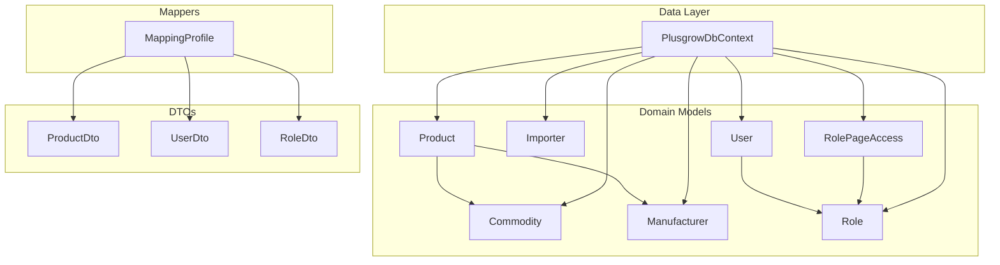
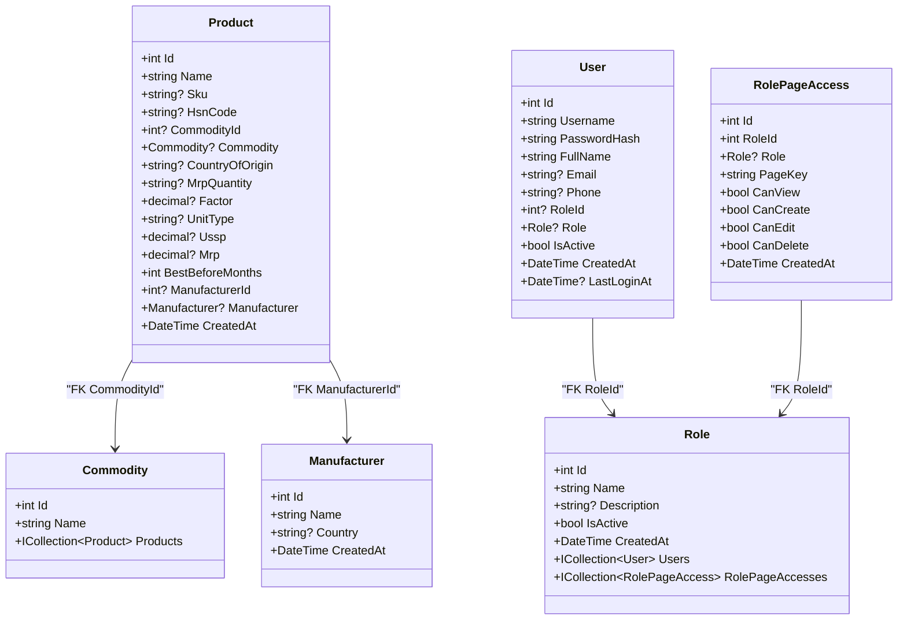
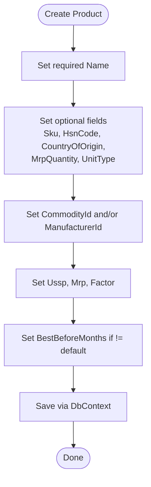
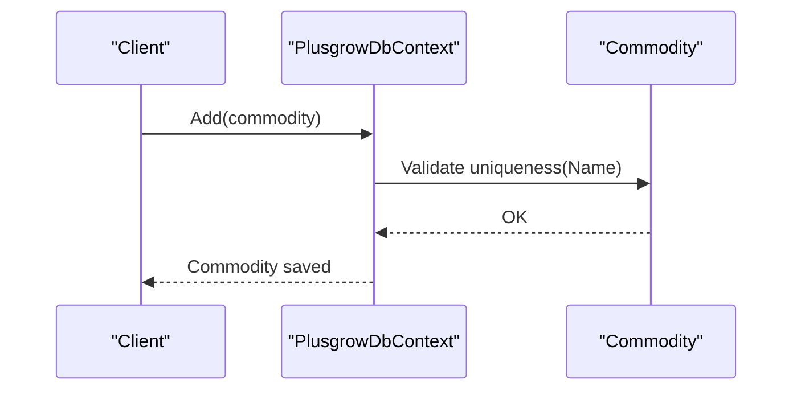
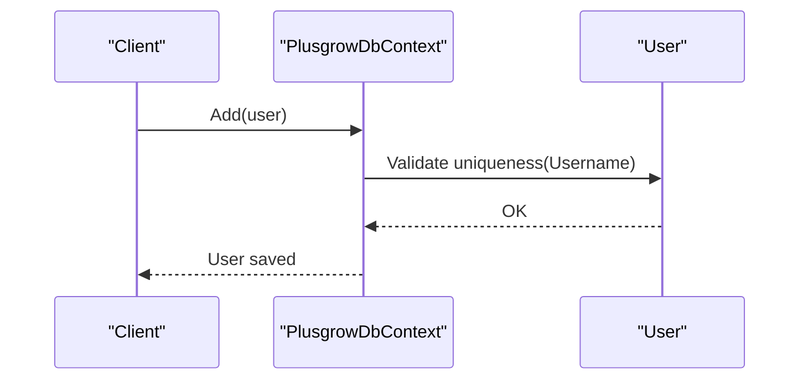
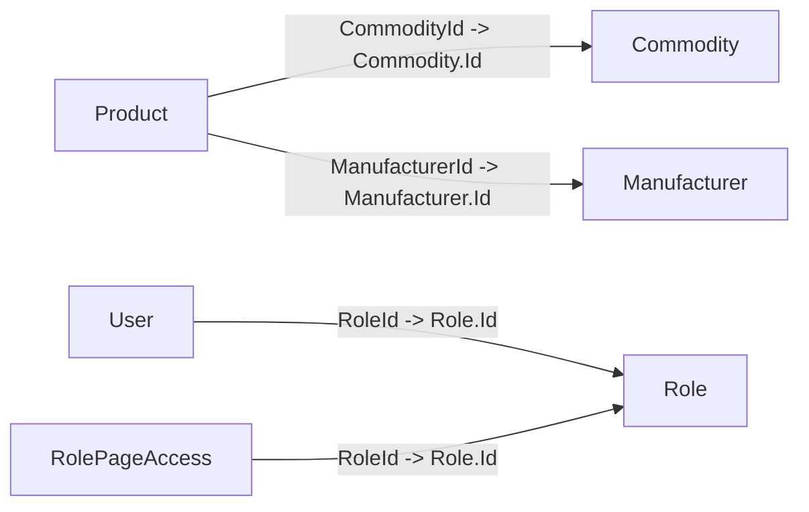

# Entity Models and Properties

<cite>
**Referenced Files in This Document**
- [Product.cs](file://Backend/PlusgrowWms.Api/Models/Product.cs)
- [Commodity.cs](file://Backend/PlusgrowWms.Api/Models/Commodity.cs)
- [Importer.cs](file://Backend/PlusgrowWms.Api/Models/Importer.cs)
- [Manufacturer.cs](file://Backend/PlusgrowWms.Api/Models/Manufacturer.cs)
- [User.cs](file://Backend/PlusgrowWms.Api/Models/User.cs)
- [Role.cs](file://Backend/PlusgrowWms.Api/Models/Role.cs)
- [RolePageAccess.cs](file://Backend/PlusgrowWms.Api/Models/RolePageAccess.cs)
- [PlusgrowDbContext.cs](file://Backend/PlusgrowWms.Api/Data/PlusgrowDbContext.cs)
- [MappingProfile.cs](file://Backend/PlusgrowWms.Api/Mappings/MappingProfile.cs)
- [ProductDto.cs](file://Backend/PlusgrowWms.Api/DTOs/ProductDto.cs)
- [UserDto.cs](file://Backend/PlusgrowWms.Api/DTOs/UserDto.cs)
- [RoleDto.cs](file://Backend/PlusgrowWms.Api/DTOs/RoleDto.cs)
- [ProductValidator.cs](file://Backend/PlusgrowWms.Api/Validators/ProductValidator.cs)
- [UserValidator.cs](file://Backend/PlusgrowWms.Api/Validators/UserValidator.cs)
</cite>

## Table of Contents
1. [Introduction](#introduction)
2. [Project Structure](#project-structure)
3. [Core Components](#core-components)
4. [Architecture Overview](#architecture-overview)
5. [Detailed Component Analysis](#detailed-component-analysis)
6. [Dependency Analysis](#dependency-analysis)
7. [Performance Considerations](#performance-considerations)
8. [Troubleshooting Guide](#troubleshooting-guide)
9. [Conclusion](#conclusion)

## Introduction
This document provides comprehensive documentation for the domain entity models in the PlusGrow WMS system. It covers the Product, Commodity, Importer, Manufacturer, User, and Role models, detailing their properties, data types, validation rules, Entity Framework annotations, and relationships. It also explains default values, required vs optional fields, and how these entities integrate with the database context and DTOs.

## Project Structure
The entity models reside under the Models folder and are mapped via Entity Framework in the PlusgrowDbContext. Data transfer objects (DTOs) are defined under DTOs, and mapping between entities and DTOs is handled by AutoMapper profiles. Validation rules are enforced using FluentValidation.

**Diagram sources**
- [PlusgrowDbContext.cs:12-18](file://Backend/PlusgrowWms.Api/Data/PlusgrowDbContext.cs#L12-L18)
- [Product.cs:6-64](file://Backend/PlusgrowWms.Api/Models/Product.cs#L6-L64)
- [Commodity.cs:6-19](file://Backend/PlusgrowWms.Api/Models/Commodity.cs#L6-L19)
- [Importer.cs:6-36](file://Backend/PlusgrowWms.Api/Models/Importer.cs#L6-L36)
- [Manufacturer.cs:6-25](file://Backend/PlusgrowWms.Api/Models/Manufacturer.cs#L6-L25)
- [User.cs:6-51](file://Backend/PlusgrowWms.Api/Models/User.cs#L6-L51)
- [Role.cs:6-31](file://Backend/PlusgrowWms.Api/Models/Role.cs#L6-L31)
- [RolePageAccess.cs:6-39](file://Backend/PlusgrowWms.Api/Models/RolePageAccess.cs#L6-L39)
- [MappingProfile.cs:7-55](file://Backend/PlusgrowWms.Api/Mappings/MappingProfile.cs#L7-L55)

**Section sources**
- [PlusgrowDbContext.cs:12-76](file://Backend/PlusgrowWms.Api/Data/PlusgrowDbContext.cs#L12-L76)
- [MappingProfile.cs:7-55](file://Backend/PlusgrowWms.Api/Mappings/MappingProfile.cs#L7-L55)

## Core Components
This section documents each entity’s purpose, properties, annotations, defaults, and constraints.

- Product
  - Purpose: Represents tradeable items with pricing, packaging, tax code, commodity classification, manufacturer association, shelf life, and creation timestamp.
  - Key properties and annotations:
    - Id: integer, primary key, mapped to table column "id".
    - Name: required string, max length 255, mapped to "name".
    - Sku: optional string, max length 100, mapped to "sku".
    - HsnCode: optional string, max length 20, mapped to "hsn_code".
    - CommodityId: optional integer, mapped to "commodity_id", foreign key to Commodity.
    - Commodity: navigation property to Commodity.
    - CountryOfOrigin: optional string, max length 100, mapped to "country_of_origin".
    - MrpQuantity: optional string, max length 50, mapped to "mrp_quantity".
    - Factor: optional decimal, mapped to "factor".
    - UnitType: optional string, max length 20, mapped to "unit_type".
    - Ussp: optional decimal, mapped to "ussp".
    - Mrp: optional decimal, mapped to "mrp".
    - BestBeforeMonths: integer, default 120, mapped to "best_before_months".
    - ManufacturerId: optional integer, mapped to "manufacturer_id", foreign key to Manufacturer.
    - Manufacturer: navigation property to Manufacturer.
    - CreatedAt: DateTime, default UtcNow, mapped to "created_at".
  - Business significance:
    - CommodityId links products to categories for reporting and categorization.
    - ManufacturerId supports supplier and brand tracking.
    - BestBeforeMonths governs expiry-based inventory controls.
    - Pricing fields (Ussp, Mrp) support financial calculations.
  - Defaults and required fields:
    - Required: Name.
    - Optional: Sku, HsnCode, CommodityId, CountryOfOrigin, MrpQuantity, Factor, UnitType, Ussp, Mrp, ManufacturerId, Email, Phone, LastLoginAt.
    - Defaults: BestBeforeMonths=120, CreatedAt=UtcNow, IsActive=true for related entities, CreatedAt=UtcNow for Product.
  - Validation and constraints:
    - EF Indexes: Unique Sku, Unique Commodity.Name, Unique User.Username, Unique Role.Name; additional indexes on Product.CommodityId, Product.ManufacturerId, Product.HsnCode, Product.Name, User.RoleId, User.IsActive, RolePageAccess.RoleId+PageKey; Importer.Cin, Manufacturer.Country.
    - DTO-level validation: ProductValidator enforces non-empty Name and length limits; non-negative USSP and MRP; positive Factor when present.
    - DTO-level validation: UserValidator enforces non-empty Username, Password min length, Full name length, optional Email format, optional Phone length.

- Commodity
  - Purpose: Defines product categories or classifications.
  - Key properties:
    - Id: integer, primary key, mapped to "id".
    - Name: required string, max length 150, mapped to "name".
    - Products: collection navigation to Product.
  - Defaults and required fields:
    - Required: Name.
    - Defaults: None.
  - Constraints:
    - Unique index on Name.

- Importer
  - Purpose: Stores importer company details for supply chain tracking.
  - Key properties:
    - Id: integer, primary key, mapped to "id".
    - Name: required string, max length 255, mapped to "name".
    - Address: optional string, mapped to "address".
    - Cin: optional string, max length 50, mapped to "cin".
    - Phone: optional string, max length 20, mapped to "phone".
    - Email: optional string, max length 100, mapped to "email".
    - CreatedAt: DateTime, default UtcNow, mapped to "created_at".
  - Defaults and required fields:
    - Required: Name.
    - Optional: Address, Cin, Phone, Email.
    - Defaults: CreatedAt=UtcNow.

- Manufacturer
  - Purpose: Stores manufacturer details for product origin and quality tracking.
  - Key properties:
    - Id: integer, primary key, mapped to "id".
    - Name: required string, max length 255, mapped to "name".
    - Country: optional string, max length 100, mapped to "country".
    - CreatedAt: DateTime, default UtcNow, mapped to "created_at".
  - Defaults and required fields:
    - Required: Name.
    - Optional: Country.
    - Defaults: CreatedAt=UtcNow.

- User
  - Purpose: Represents system users with authentication credentials, profile info, role assignment, activity status, timestamps, and last login tracking.
  - Key properties:
    - Id: integer, primary key, mapped to "id".
    - Username: required string, max length 100, mapped to "username".
    - PasswordHash: required string, max length 255, mapped to "password_hash".
    - FullName: required string, max length 255, mapped to "full_name".
    - Email: optional string, max length 100, mapped to "email".
    - Phone: optional string, max length 20, mapped to "phone".
    - RoleId: optional integer, mapped to "role_id", foreign key to Role.
    - Role: navigation property to Role.
    - IsActive: boolean, default true, mapped to "is_active".
    - CreatedAt: DateTime, default UtcNow, mapped to "created_at".
    - LastLoginAt: optional DateTime, mapped to "last_login_at".
  - Defaults and required fields:
    - Required: Username, PasswordHash, FullName.
    - Optional: Email, Phone, RoleId, LastLoginAt.
    - Defaults: IsActive=true, CreatedAt=UtcNow.
  - Constraints:
    - Unique index on Username.
    - Index on RoleId and IsActive.

- Role
  - Purpose: Defines user roles with permissions and counts of assigned users.
  - Key properties:
    - Id: integer, primary key, mapped to "id".
    - Name: required string, max length 50, mapped to "name".
    - Description: optional string, max length 255, mapped to "description".
    - IsActive: boolean, default true, mapped to "is_active".
    - CreatedAt: DateTime, default UtcNow, mapped to "created_at".
    - Users: collection navigation to User.
    - RolePageAccesses: collection navigation to RolePageAccess.
  - Defaults and required fields:
    - Required: Name.
    - Optional: Description.
    - Defaults: IsActive=true, CreatedAt=UtcNow.
  - Constraints:
    - Unique index on Name.

- RolePageAccess
  - Purpose: Manages per-role page-level permissions (view, create, edit, delete).
  - Key properties:
    - Id: integer, primary key, mapped to "id".
    - RoleId: integer, mapped to "role_id", foreign key to Role.
    - Role: navigation property to Role.
    - PageKey: required string, max length 50, mapped to "page_key".
    - CanView: boolean, default true, mapped to "can_view".
    - CanCreate: boolean, default false, mapped to "can_create".
    - CanEdit: boolean, default false, mapped to "can_edit".
    - CanDelete: boolean, default false, mapped to "can_delete".
    - CreatedAt: DateTime, default UtcNow, mapped to "created_at".
  - Defaults and required fields:
    - Required: PageKey.
    - Defaults: CanView=true, others false, CreatedAt=UtcNow.
  - Constraints:
    - Unique composite index on RoleId+PageKey.

**Section sources**
- [Product.cs:6-64](file://Backend/PlusgrowWms.Api/Models/Product.cs#L6-L64)
- [Commodity.cs:6-19](file://Backend/PlusgrowWms.Api/Models/Commodity.cs#L6-L19)
- [Importer.cs:6-36](file://Backend/PlusgrowWms.Api/Models/Importer.cs#L6-L36)
- [Manufacturer.cs:6-25](file://Backend/PlusgrowWms.Api/Models/Manufacturer.cs#L6-L25)
- [User.cs:6-51](file://Backend/PlusgrowWms.Api/Models/User.cs#L6-L51)
- [Role.cs:6-31](file://Backend/PlusgrowWms.Api/Models/Role.cs#L6-L31)
- [RolePageAccess.cs:6-39](file://Backend/PlusgrowWms.Api/Models/RolePageAccess.cs#L6-L39)
- [PlusgrowDbContext.cs:20-76](file://Backend/PlusgrowWms.Api/Data/PlusgrowDbContext.cs#L20-L76)
- [ProductValidator.cs:6-32](file://Backend/PlusgrowWms.Api/Validators/ProductValidator.cs#L6-L32)
- [UserValidator.cs:6-63](file://Backend/PlusgrowWms.Api/Validators/UserValidator.cs#L6-L63)

## Architecture Overview
The domain models are mapped to database tables via Entity Framework attributes and configured in the DbContext. Indexes are defined in OnModelCreating for uniqueness and performance. DTOs decouple API contracts from domain models, and AutoMapper profiles define mappings. Validation is applied at the DTO level using FluentValidation.

**Diagram sources**
- [Product.cs:6-64](file://Backend/PlusgrowWms.Api/Models/Product.cs#L6-L64)
- [Commodity.cs:6-19](file://Backend/PlusgrowWms.Api/Models/Commodity.cs#L6-L19)
- [Manufacturer.cs:6-25](file://Backend/PlusgrowWms.Api/Models/Manufacturer.cs#L6-L25)
- [User.cs:6-51](file://Backend/PlusgrowWms.Api/Models/User.cs#L6-L51)
- [Role.cs:6-31](file://Backend/PlusgrowWms.Api/Models/Role.cs#L6-L31)
- [RolePageAccess.cs:6-39](file://Backend/PlusgrowWms.Api/Models/RolePageAccess.cs#L6-L39)

## Detailed Component Analysis

### Product Model
- Property definitions and annotations:
  - Identity and audit: Id, CreatedAt.
  - Catalog: Name, Sku, HsnCode, CountryOfOrigin, MrpQuantity, UnitType.
  - Quantities and conversions: Factor, BestBeforeMonths.
  - Pricing: Ussp, Mrp.
  - Associations: CommodityId (FK), ManufacturerId (FK).
- Defaults and required:
  - Required: Name.
  - Optional: Sku, HsnCode, CommodityId, CountryOfOrigin, MrpQuantity, Factor, UnitType, Ussp, Mrp, ManufacturerId, Email, Phone, LastLoginAt.
  - Defaults: BestBeforeMonths=120, CreatedAt=UtcNow.
- Validation:
  - DTO validator enforces Name length, optional Sku/HsnCode lengths, non-negative USSP/MRP, positive Factor when provided.
- Typical operations:
  - Create: Initialize Name, optional Sku/HsnCode; set CommodityId/ManufacturerId; set pricing and factor; set BestBeforeMonths if different from default.
  - Update: Modify pricing, quantities, or associations; update timestamps implicitly via ORM.
  - Query: Filter by Sku (unique), Name, CommodityId, ManufacturerId, HsnCode; sort by CreatedAt.

**Diagram sources**
- [Product.cs:6-64](file://Backend/PlusgrowWms.Api/Models/Product.cs#L6-L64)
- [ProductValidator.cs:6-32](file://Backend/PlusgrowWms.Api/Validators/ProductValidator.cs#L6-L32)

**Section sources**
- [Product.cs:6-64](file://Backend/PlusgrowWms.Api/Models/Product.cs#L6-L64)
- [PlusgrowDbContext.cs:36-59](file://Backend/PlusgrowWms.Api/Data/PlusgrowDbContext.cs#L36-L59)
- [ProductValidator.cs:6-32](file://Backend/PlusgrowWms.Api/Validators/ProductValidator.cs#L6-L32)
- [ProductDto.cs:3-54](file://Backend/PlusgrowWms.Api/DTOs/ProductDto.cs#L3-L54)
- [MappingProfile.cs:32-41](file://Backend/PlusgrowWms.Api/Mappings/MappingProfile.cs#L32-L41)

### Commodity Model
- Property definitions:
  - Id, Name, Products navigation.
- Defaults and required:
  - Required: Name.
- Constraints:
  - Unique index on Name.

**Diagram sources**
- [Commodity.cs:6-19](file://Backend/PlusgrowWms.Api/Models/Commodity.cs#L6-L19)
- [PlusgrowDbContext.cs:32-34](file://Backend/PlusgrowWms.Api/Data/PlusgrowDbContext.cs#L32-L34)

**Section sources**
- [Commodity.cs:6-19](file://Backend/PlusgrowWms.Api/Models/Commodity.cs#L6-L19)
- [PlusgrowDbContext.cs:32-34](file://Backend/PlusgrowWms.Api/Data/PlusgrowDbContext.cs#L32-L34)

### Importer Model
- Property definitions:
  - Id, Name, Address, Cin, Phone, Email, CreatedAt.
- Defaults and required:
  - Required: Name.
  - Optional: Address, Cin, Phone, Email.
  - Defaults: CreatedAt=UtcNow.
- Constraints:
  - Index on Cin.

**Section sources**
- [Importer.cs:6-36](file://Backend/PlusgrowWms.Api/Models/Importer.cs#L6-L36)
- [PlusgrowDbContext.cs:71-72](file://Backend/PlusgrowWms.Api/Data/PlusgrowDbContext.cs#L71-L72)

### Manufacturer Model
- Property definitions:
  - Id, Name, Country, CreatedAt.
- Defaults and required:
  - Required: Name.
  - Optional: Country.
  - Defaults: CreatedAt=UtcNow.
- Constraints:
  - Index on Country.

**Section sources**
- [Manufacturer.cs:6-25](file://Backend/PlusgrowWms.Api/Models/Manufacturer.cs#L6-L25)
- [PlusgrowDbContext.cs:74-75](file://Backend/PlusgrowWms.Api/Data/PlusgrowDbContext.cs#L74-L75)

### User Model
- Property definitions:
  - Id, Username, PasswordHash, FullName, Email, Phone, RoleId (FK), Role, IsActive, CreatedAt, LastLoginAt.
- Defaults and required:
  - Required: Username, PasswordHash, FullName.
  - Optional: Email, Phone, RoleId, LastLoginAt.
  - Defaults: IsActive=true, CreatedAt=UtcNow.
- Constraints:
  - Unique index on Username.
  - Index on RoleId and IsActive.

**Diagram sources**
- [User.cs:6-51](file://Backend/PlusgrowWms.Api/Models/User.cs#L6-L51)
- [PlusgrowDbContext.cs:40-42](file://Backend/PlusgrowWms.Api/Data/PlusgrowDbContext.cs#L40-L42)

**Section sources**
- [User.cs:6-51](file://Backend/PlusgrowWms.Api/Models/User.cs#L6-L51)
- [PlusgrowDbContext.cs:40-42](file://Backend/PlusgrowWms.Api/Data/PlusgrowDbContext.cs#L40-L42)
- [UserDto.cs:3-42](file://Backend/PlusgrowWms.Api/DTOs/UserDto.cs#L3-L42)
- [MappingProfile.cs:11-20](file://Backend/PlusgrowWms.Api/Mappings/MappingProfile.cs#L11-L20)
- [UserValidator.cs:6-63](file://Backend/PlusgrowWms.Api/Validators/UserValidator.cs#L6-L63)

### Role Model
- Property definitions:
  - Id, Name, Description, IsActive, CreatedAt, Users, RolePageAccesses.
- Defaults and required:
  - Required: Name.
  - Optional: Description.
  - Defaults: IsActive=true, CreatedAt=UtcNow.
- Constraints:
  - Unique index on Name.

**Section sources**
- [Role.cs:6-31](file://Backend/PlusgrowWms.Api/Models/Role.cs#L6-L31)
- [PlusgrowDbContext.cs:44-46](file://Backend/PlusgrowWms.Api/Data/PlusgrowDbContext.cs#L44-L46)
- [RoleDto.cs:3-25](file://Backend/PlusgrowWms.Api/DTOs/RoleDto.cs#L3-L25)
- [MappingProfile.cs:22-26](file://Backend/PlusgrowWms.Api/Mappings/MappingProfile.cs#L22-L26)

### RolePageAccess Model
- Property definitions:
  - Id, RoleId (FK), Role, PageKey, CanView, CanCreate, CanEdit, CanDelete, CreatedAt.
- Defaults and required:
  - Required: PageKey.
  - Defaults: CanView=true, others false, CreatedAt=UtcNow.
- Constraints:
  - Unique composite index on RoleId+PageKey.

**Section sources**
- [RolePageAccess.cs:6-39](file://Backend/PlusgrowWms.Api/Models/RolePageAccess.cs#L6-L39)
- [PlusgrowDbContext.cs:67-69](file://Backend/PlusgrowWms.Api/Data/PlusgrowDbContext.cs#L67-L69)
- [RoleDto.cs:27-51](file://Backend/PlusgrowWms.Api/DTOs/RoleDto.cs#L27-L51)
- [MappingProfile.cs:28-30](file://Backend/PlusgrowWms.Api/Mappings/MappingProfile.cs#L28-L30)

## Dependency Analysis
- Foreign keys and relationships:
  - Product.CommodityId -> Commodity.Id.
  - Product.ManufacturerId -> Manufacturer.Id.
  - User.RoleId -> Role.Id.
  - RolePageAccess.RoleId -> Role.Id.
- Indexes and uniqueness:
  - Unique: Commodity.Name, Product.Sku, User.Username, Role.Name.
  - Composite unique: RolePageAccess.RoleId+PageKey.
  - Additional performance indexes: Product.CommodityId, Product.ManufacturerId, Product.HsnCode, Product.Name; User.RoleId, User.IsActive; Importer.Cin; Manufacturer.Country.
- DTO and mapping:
  - ProductDto exposes CommodityName and ManufacturerName derived from navigation properties via MappingProfile.
  - UserDto exposes RoleName; RoleDto exposes UserCount computed from navigation properties.

**Diagram sources**
- [Product.cs:26-30](file://Backend/PlusgrowWms.Api/Models/Product.cs#L26-L30)
- [Product.cs:56-60](file://Backend/PlusgrowWms.Api/Models/Product.cs#L56-L60)
- [User.cs:36-40](file://Backend/PlusgrowWms.Api/Models/User.cs#L36-L40)
- [RolePageAccess.cs:13-17](file://Backend/PlusgrowWms.Api/Models/RolePageAccess.cs#L13-L17)

**Section sources**
- [PlusgrowDbContext.cs:31-76](file://Backend/PlusgrowWms.Api/Data/PlusgrowDbContext.cs#L31-L76)
- [MappingProfile.cs:32-41](file://Backend/PlusgrowWms.Api/Mappings/MappingProfile.cs#L32-L41)

## Performance Considerations
- Index utilization:
  - Unique indexes prevent duplicates and accelerate lookups for Name, Sku, Username, Role.Name, and RolePageAccess.RoleId+PageKey combinations.
  - Additional indexes on foreign keys and frequently filtered columns improve query performance for joins and filters.
- Data types and precision:
  - Decimal fields (Ussp, Mrp, Factor) should be used judiciously; ensure appropriate scale/precision in the database to avoid rounding errors.
- Defaults:
  - Setting default values at the model level reduces variability and simplifies queries.

## Troubleshooting Guide
- Duplicate key errors:
  - Unique index violations on Commodity.Name, Product.Sku, User.Username, Role.Name, and RolePageAccess.RoleId+PageKey will cause exceptions during save. Validate inputs before persisting.
- Validation failures:
  - ProductValidator: Ensure Name length <= 255, optional Sku/HsnCode length limits, non-negative USSP/MRP, positive Factor when provided.
  - UserValidator: Ensure Username length <= 100, Password length >= 6, FullName length <= 255, optional Email format, optional Phone length <= 20.
- Navigation property issues:
  - When mapping DTOs to entities, ensure foreign keys are set correctly; ignore navigations in AutoMapper mappings to avoid unintended updates.

**Section sources**
- [PlusgrowDbContext.cs:31-76](file://Backend/PlusgrowWms.Api/Data/PlusgrowDbContext.cs#L31-L76)
- [ProductValidator.cs:6-32](file://Backend/PlusgrowWms.Api/Validators/ProductValidator.cs#L6-L32)
- [UserValidator.cs:6-63](file://Backend/PlusgrowWms.Api/Validators/UserValidator.cs#L6-L63)
- [MappingProfile.cs:14-20](file://Backend/PlusgrowWms.Api/Mappings/MappingProfile.cs#L14-L20)

## Conclusion
The PlusGrow WMS domain models are designed with clear responsibilities, explicit validations, and robust EF mappings. Unique and composite indexes optimize data integrity and query performance. DTOs and AutoMapper profiles separate API concerns from domain logic, while FluentValidation ensures consistent input validation. Understanding these models and their relationships is essential for extending functionality, adding new validations, or optimizing queries.