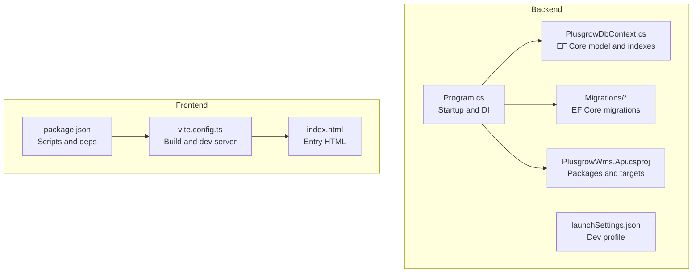
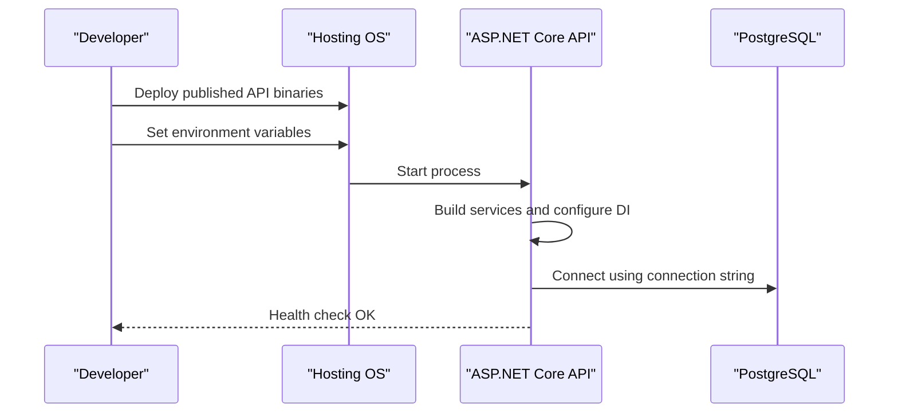
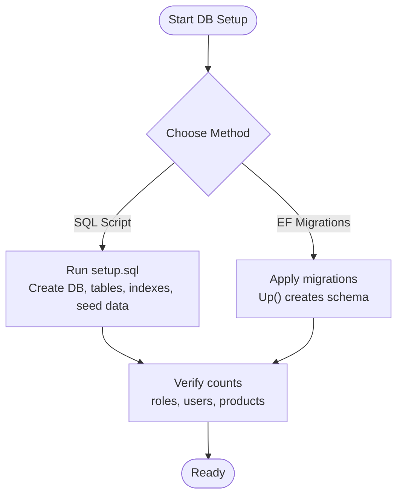
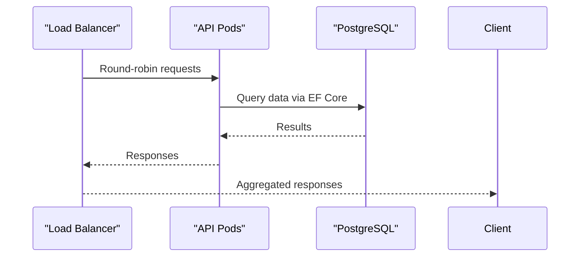
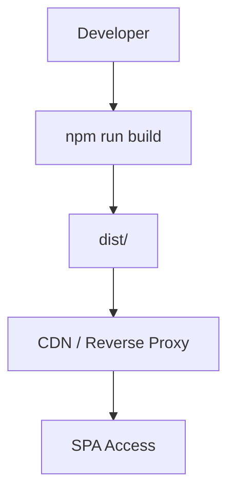
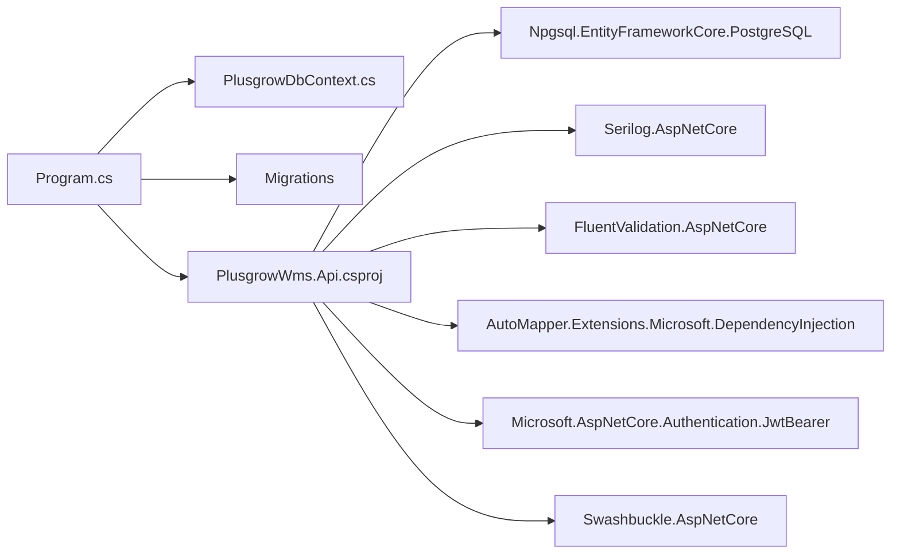

# Deployment and Operations

<cite>
**Referenced Files in This Document**
- [Program.cs](file://Backend/PlusgrowWms.Api/Program.cs)
- [PlusgrowWms.Api.csproj](file://Backend/PlusgrowWms.Api/PlusgrowWms.Api.csproj)
- [PlusgrowDbContext.cs](file://Backend/PlusgrowWms.Api/Data/PlusgrowDbContext.cs)
- [20260327081425_InitialCreate.cs](file://Backend/PlusgrowWms.Api/Migrations/20260327081425_InitialCreate.cs)
- [launchSettings.json](file://Backend/PlusgrowWms.Api/Properties/launchSettings.json)
- [setup.sql](file://Backend/setup.sql)
- [package.json](file://Frontend/package.json)
- [vite.config.ts](file://Frontend/vite.config.ts)
- [index.html](file://Frontend/index.html)
</cite>

## Table of Contents
1. [Introduction](#introduction)
2. [Project Structure](#project-structure)
3. [Core Components](#core-components)
4. [Architecture Overview](#architecture-overview)
5. [Detailed Component Analysis](#detailed-component-analysis)
6. [Dependency Analysis](#dependency-analysis)
7. [Performance Considerations](#performance-considerations)
8. [Troubleshooting Guide](#troubleshooting-guide)
9. [Conclusion](#conclusion)
10. [Appendices](#appendices)

## Introduction
This document provides comprehensive deployment and operations guidance for PlusGrow WMS. It covers backend and frontend deployment, environment configuration, database provisioning and migrations, API deployment strategies, static asset management, production readiness, scaling, monitoring, security, and operational procedures including backups, disaster recovery, and rollback protocols.

## Project Structure
PlusGrow WMS consists of:
- Backend: ASP.NET Core web API using Entity Framework Core with PostgreSQL via Npgsql, Swagger/OpenAPI, JWT authentication, Serilog logging, and FluentValidation.
- Frontend: React application built with Vite, TypeScript, TailwindCSS, and React Router.



**Diagram sources**
- [Program.cs:1-107](file://Backend/PlusgrowWms.Api/Program.cs#L1-L107)
- [PlusgrowWms.Api.csproj:1-29](file://Backend/PlusgrowWms.Api/PlusgrowWms.Api.csproj#L1-L29)
- [PlusgrowDbContext.cs:1-78](file://Backend/PlusgrowWms.Api/Data/PlusgrowDbContext.cs#L1-L78)
- [20260327081425_InitialCreate.cs:1-260](file://Backend/PlusgrowWms.Api/Migrations/20260327081425_InitialCreate.cs#L1-L260)
- [launchSettings.json:1-15](file://Backend/PlusgrowWms.Api/Properties/launchSettings.json#L1-L15)
- [package.json:1-59](file://Frontend/package.json#L1-L59)
- [vite.config.ts:1-25](file://Frontend/vite.config.ts#L1-L25)
- [index.html:1-15](file://Frontend/index.html#L1-L15)

**Section sources**
- [Program.cs:1-107](file://Backend/PlusgrowWms.Api/Program.cs#L1-L107)
- [PlusgrowWms.Api.csproj:1-29](file://Backend/PlusgrowWms.Api/PlusgrowWms.Api.csproj#L1-L29)
- [PlusgrowDbContext.cs:1-78](file://Backend/PlusgrowWms.Api/Data/PlusgrowDbContext.cs#L1-L78)
- [20260327081425_InitialCreate.cs:1-260](file://Backend/PlusgrowWms.Api/Migrations/20260327081425_InitialCreate.cs#L1-L260)
- [launchSettings.json:1-15](file://Backend/PlusgrowWms.Api/Properties/launchSettings.json#L1-L15)
- [package.json:1-59](file://Frontend/package.json#L1-L59)
- [vite.config.ts:1-25](file://Frontend/vite.config.ts#L1-L25)
- [index.html:1-15](file://Frontend/index.html#L1-L15)

## Core Components
- Backend runtime and DI container: registers Serilog, EF Core with Npgsql, repositories, services, validators, AutoMapper, JWT authentication, Swagger, and CORS.
- Database model: defines entities and indexes; migrations create schema and seed roles, users, and sample data.
- Frontend build and dev server: Vite-based build with React and TailwindCSS; development server runs on port 3000; production build outputs static assets.

Key operational implications:
- Environment configuration drives connection strings, JWT issuer/audience/key, and CORS origin.
- Database initialization can be performed via SQL script or EF Core migrations.
- Static assets are served by the frontend build output; backend serves API routes.

**Section sources**
- [Program.cs:20-107](file://Backend/PlusgrowWms.Api/Program.cs#L20-L107)
- [PlusgrowWms.Api.csproj:9-26](file://Backend/PlusgrowWms.Api/PlusgrowWms.Api.csproj#L9-L26)
- [PlusgrowDbContext.cs:20-76](file://Backend/PlusgrowWms.Api/Data/PlusgrowDbContext.cs#L20-L76)
- [20260327081425_InitialCreate.cs:13-257](file://Backend/PlusgrowWms.Api/Migrations/20260327081425_InitialCreate.cs#L13-L257)
- [package.json:6-12](file://Frontend/package.json#L6-L12)
- [vite.config.ts:6-24](file://Frontend/vite.config.ts#L6-L24)

## Architecture Overview
The system follows a classic three-tier architecture:
- Presentation tier: React SPA served statically by a reverse proxy or CDN.
- API tier: ASP.NET Core REST API with JWT authentication and Swagger UI.
- Data tier: PostgreSQL with EF Core migrations and indexes.

```mermaid
graph TB
subgraph "Client"
FE["React SPA<br/>Vite build"]
end
subgraph "Edge"
RP["Reverse Proxy / CDN"]
end
subgraph "API"
API["ASP.NET Core API<br/>JWT Auth, Swagger, Serilog"]
DB["PostgreSQL"]
end
FE --> RP
RP --> API
API --> DB
```

[No sources needed since this diagram shows conceptual architecture, not a direct code mapping]

## Detailed Component Analysis

### Backend Deployment and Environment Configuration
- Target framework and packages: .NET 10 with EF Core, Npgsql, Serilog, FluentValidation, Swashbuckle, JWT Bearer.
- Database provider: Npgsql for PostgreSQL; connection string resolved from configuration.
- Authentication: JWT Bearer with configurable issuer, audience, and signing key.
- Logging: Serilog configured via host builder.
- OpenAPI: Swagger enabled in development.
- CORS: Allow origin for frontend development host.
- HTTPS redirection enabled.

Operational steps:
- Set environment variables for connection string and JWT settings.
- Choose hosting model: self-contained or framework-dependent publish.
- Configure reverse proxy to terminate TLS and forward to API.



**Diagram sources**
- [Program.cs:20-107](file://Backend/PlusgrowWms.Api/Program.cs#L20-L107)
- [PlusgrowWms.Api.csproj:1-29](file://Backend/PlusgrowWms.Api/PlusgrowWms.Api.csproj#L1-L29)

**Section sources**
- [Program.cs:20-107](file://Backend/PlusgrowWms.Api/Program.cs#L20-L107)
- [PlusgrowWms.Api.csproj:1-29](file://Backend/PlusgrowWms.Api/PlusgrowWms.Api.csproj#L1-L29)
- [launchSettings.json:1-15](file://Backend/PlusgrowWms.Api/Properties/launchSettings.json#L1-L15)

### Database Deployment and Migration Setup
- Model and indexes: Entities and indexes defined in the EF Core model; snake_case applied to table names.
- Migrations: Initial migration creates schema and seeds roles, users, and sample data.
- SQL script: Full setup script drops and recreates tables, creates indexes, inserts defaults, and verifies counts.
- Indexes: Unique and composite indexes for performance on usernames, SKUs, product attributes, and role-page access.



**Diagram sources**
- [PlusgrowDbContext.cs:20-76](file://Backend/PlusgrowWms.Api/Data/PlusgrowDbContext.cs#L20-L76)
- [20260327081425_InitialCreate.cs:13-257](file://Backend/PlusgrowWms.Api/Migrations/20260327081425_InitialCreate.cs#L13-L257)
- [setup.sql:1-215](file://Backend/setup.sql#L1-L215)

**Section sources**
- [PlusgrowDbContext.cs:20-76](file://Backend/PlusgrowWms.Api/Data/PlusgrowDbContext.cs#L20-L76)
- [20260327081425_InitialCreate.cs:13-257](file://Backend/PlusgrowWms.Api/Migrations/20260327081425_InitialCreate.cs#L13-L257)
- [setup.sql:1-215](file://Backend/setup.sql#L1-L215)

### API Deployment Strategies
- Development: dotnet run with launch settings pointing to a local HTTP endpoint.
- Production: Publish self-contained or framework-dependent; run behind a reverse proxy.
- Health checks: Implement a lightweight GET endpoint returning service status.
- Load balancing: Stateless API supports horizontal scaling; scale replicas behind a load balancer.



[No sources needed since this diagram shows conceptual deployment, not a direct code mapping]

**Section sources**
- [launchSettings.json:1-15](file://Backend/PlusgrowWms.Api/Properties/launchSettings.json#L1-L15)
- [Program.cs:88-102](file://Backend/PlusgrowWms.Api/Program.cs#L88-L102)

### Frontend Deployment, Build Optimization, and Static Assets
- Build command generates optimized static assets.
- Development server runs on port 3000 with optional HMR toggle.
- Aliases configured for module resolution.
- Environment variable injection for external APIs.



**Diagram sources**
- [package.json:6-12](file://Frontend/package.json#L6-L12)
- [vite.config.ts:6-24](file://Frontend/vite.config.ts#L6-L24)
- [index.html:1-15](file://Frontend/index.html#L1-L15)

**Section sources**
- [package.json:6-12](file://Frontend/package.json#L6-L12)
- [vite.config.ts:6-24](file://Frontend/vite.config.ts#L6-L24)
- [index.html:1-15](file://Frontend/index.html#L1-L15)

### Containerization Options
- Container image: Multi-stage build to produce minimal runtime image.
- Entrypoint: Start the ASP.NET Core application.
- Ports: Expose API port; serve frontend static assets via reverse proxy inside container.
- Secrets: Store connection strings and JWT keys in environment variables or secret managers.

[No sources needed since this section provides general guidance]

### Cloud Deployment Configurations
- Platform: Kubernetes, Azure App Service, AWS ECS/EKS, or similar.
- Networking: TLS termination at ingress/controller; internal communication over HTTPS.
- Scaling: Horizontal pod autoscaling based on CPU/memory or custom metrics.
- Storage: Persistent volumes for logs; consider managed PostgreSQL.

[No sources needed since this section provides general guidance]

### Monitoring and Logging Setup
- Request logging: Serilog request logging middleware enabled.
- Observability: Add structured logs, metrics, and traces (e.g., OpenTelemetry).
- Health checks: Implement GET /health returning 200 with service info.
- Alerting: Monitor error rates, latency, and resource utilization.

**Section sources**
- [Program.cs:16-18](file://Backend/PlusgrowWms.Api/Program.cs#L16-L18)
- [Program.cs:94-100](file://Backend/PlusgrowWms.Api/Program.cs#L94-L100)

### Security Considerations
- Transport security: Enforce HTTPS redirection and TLS termination at edge.
- Authentication: Use strong JWT issuer/audience/key; rotate secrets regularly.
- Authorization: Centralize policies and enforce role-based access.
- CORS: Restrict origins in production; avoid wildcard origins.
- Secrets: Never bake credentials into containers or images.

**Section sources**
- [Program.cs:44-62](file://Backend/PlusgrowWms.Api/Program.cs#L44-L62)
- [Program.cs:75-83](file://Backend/PlusgrowWms.Api/Program.cs#L75-L83)
- [Program.cs:96-97](file://Backend/PlusgrowWms.Api/Program.cs#L96-L97)

### Backup and Disaster Recovery
- Database backups: Schedule regular logical backups of PostgreSQL; test restore procedures.
- Point-in-time recovery: Enable WAL archiving for granular recovery.
- DR site: Maintain a secondary region with automated failover.
- Secrets rotation: Update environment variables and redeploy with zero-downtime strategy.

[No sources needed since this section provides general guidance]

### Rollback Procedures and Emergency Response
- Blue-green or canary deployments: Keep previous release ready for immediate switch.
- Database migrations: Maintain down migration capability; test rollback scenarios.
- Health gates: Require successful health checks before switching traffic.
- Runbooks: Document steps to revert to last known good configuration.

[No sources needed since this section provides general guidance]

## Dependency Analysis
Backend dependencies include EF Core, Npgsql, Serilog, FluentValidation, AutoMapper, JWT Bearer, and Swashbuckle. These drive database connectivity, logging, validation, authentication, and API documentation.



**Diagram sources**
- [Program.cs:1-107](file://Backend/PlusgrowWms.Api/Program.cs#L1-L107)
- [PlusgrowDbContext.cs:1-78](file://Backend/PlusgrowWms.Api/Data/PlusgrowDbContext.cs#L1-L78)
- [PlusgrowWms.Api.csproj:9-26](file://Backend/PlusgrowWms.Api/PlusgrowWms.Api.csproj#L9-L26)

**Section sources**
- [PlusgrowWms.Api.csproj:9-26](file://Backend/PlusgrowWms.Api/PlusgrowWms.Api.csproj#L9-L26)
- [Program.cs:1-107](file://Backend/PlusgrowWms.Api/Program.cs#L1-L107)

## Performance Considerations
- Database: Use indexes defined in model and migrations; monitor slow queries; consider read replicas.
- API: Enable gzip/brotli compression; cache static assets aggressively; tune GC and Kestrel settings.
- Frontend: Code-splitting, lazy loading, and tree-shaking reduce bundle size; precompress assets.

[No sources needed since this section provides general guidance]

## Troubleshooting Guide
Common issues and resolutions:
- Database connection failures: Verify connection string and network access; confirm PostgreSQL is reachable.
- JWT validation errors: Confirm issuer, audience, and signing key match configuration.
- CORS blocked requests: Align allowed origin with frontend host; remove wildcards in production.
- Swagger not visible: Ensure development mode or appropriate middleware order.
- Health check failures: Implement and expose a simple health endpoint; verify dependencies.

**Section sources**
- [Program.cs:25-27](file://Backend/PlusgrowWms.Api/Program.cs#L25-L27)
- [Program.cs:49-62](file://Backend/PlusgrowWms.Api/Program.cs#L49-L62)
- [Program.cs:75-83](file://Backend/PlusgrowWms.Api/Program.cs#L75-L83)
- [Program.cs:88-92](file://Backend/PlusgrowWms.Api/Program.cs#L88-L92)

## Conclusion
PlusGrow WMS is structured for straightforward deployment across environments. The backend leverages modern .NET tooling and PostgreSQL, while the frontend is optimized for fast builds and runtime performance. By following the outlined deployment, security, monitoring, and operational practices, teams can achieve reliable, scalable, and maintainable production operations.

## Appendices
- Environment variables to configure:
  - Connection string for PostgreSQL
  - JWT issuer, audience, and signing key
  - CORS origin for frontend host
- Scripts:
  - Backend: dotnet publish
  - Frontend: npm run build

[No sources needed since this section provides general guidance]