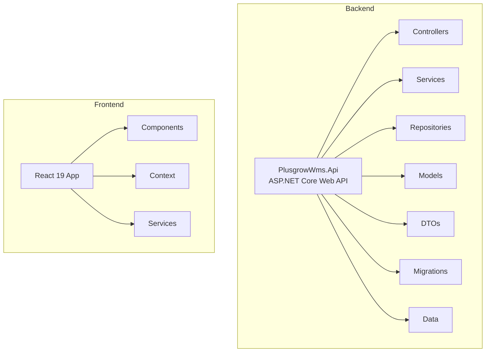
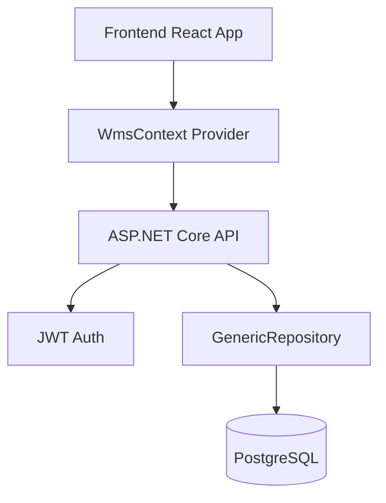
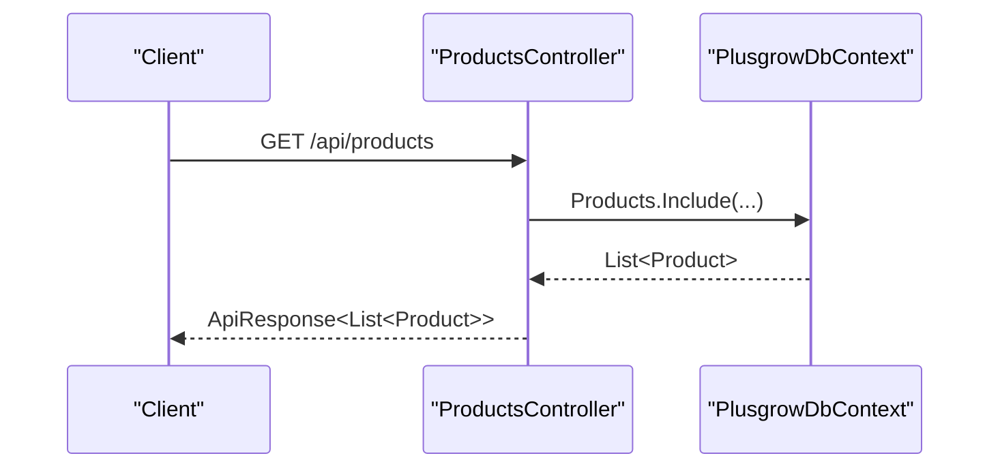
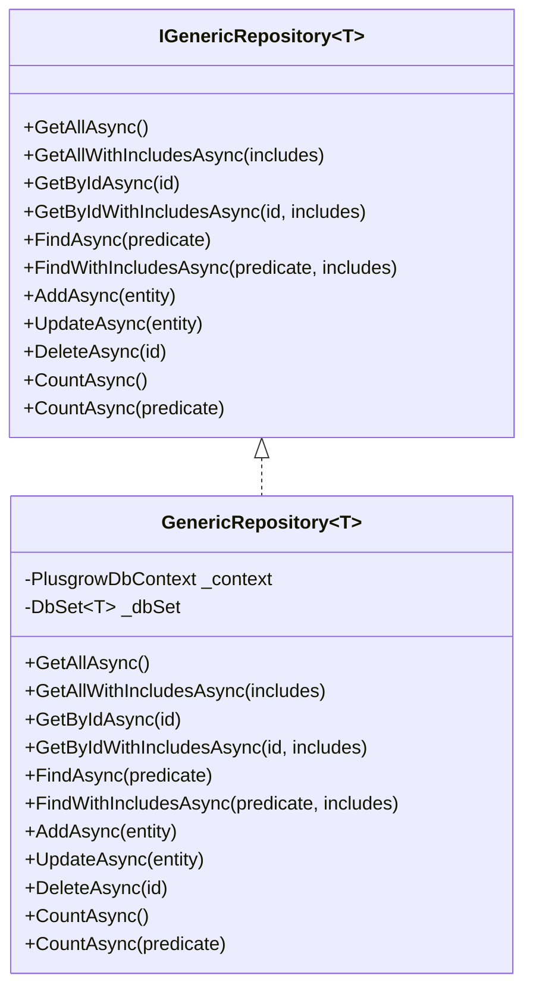
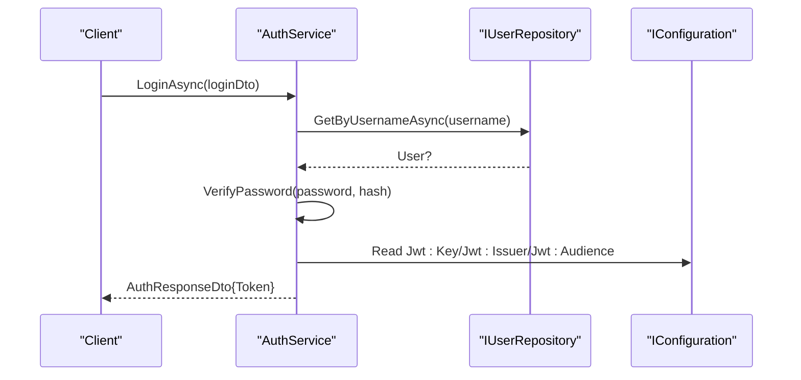
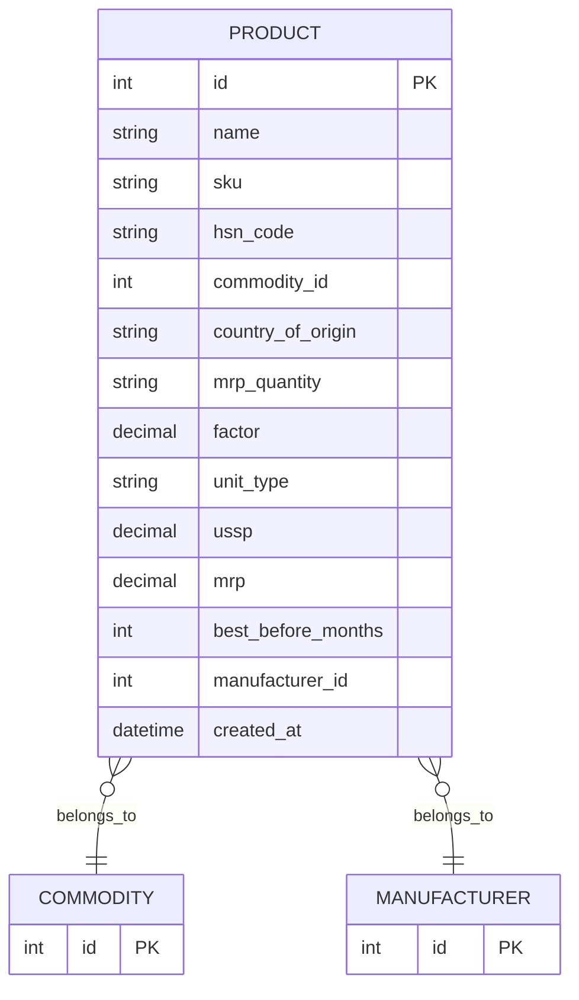
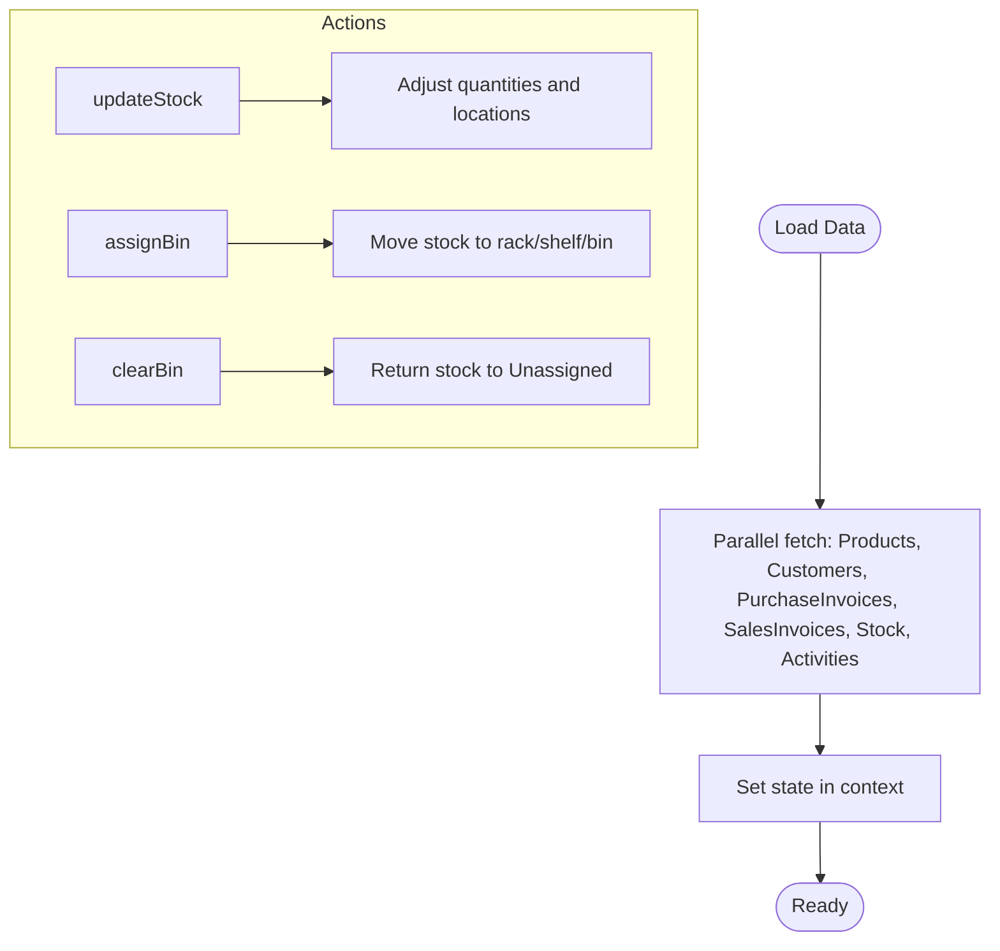
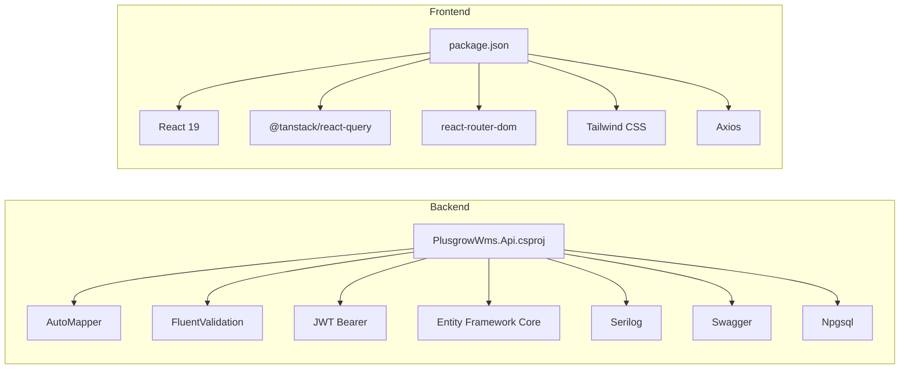

# Development Guidelines and Best Practices

<cite>
**Referenced Files in This Document**
- [PlusgrowWms.Api.csproj](file://Backend/PlusgrowWms.Api/PlusgrowWms.Api.csproj)
- [Program.cs](file://Backend/PlusgrowWms.Api/Program.cs)
- [launchSettings.json](file://Backend/PlusgrowWms.Api/Properties/launchSettings.json)
- [ProductsController.cs](file://Backend/PlusgrowWms.Api/Controllers/ProductsController.cs)
- [GenericRepository.cs](file://Backend/PlusgrowWms.Api/Repositories/GenericRepository.cs)
- [AuthService.cs](file://Backend/PlusgrowWms.Api/Services/AuthService.cs)
- [Product.cs](file://Backend/PlusgrowWms.Api/Models/Product.cs)
- [package.json](file://Frontend/package.json)
- [vite.config.ts](file://Frontend/vite.config.ts)
- [tsconfig.json](file://Frontend/tsconfig.json)
- [utils.ts](file://Frontend/src/lib/utils.ts)
- [WmsContext.tsx](file://Frontend/src/context/WmsContext.tsx)
- [mockApi.ts](file://Frontend/src/services/mockApi.ts)
</cite>

## Table of Contents
1. [Introduction](#introduction)
2. [Project Structure](#project-structure)
3. [Core Components](#core-components)
4. [Architecture Overview](#architecture-overview)
5. [Detailed Component Analysis](#detailed-component-analysis)
6. [Dependency Analysis](#dependency-analysis)
7. [Performance Considerations](#performance-considerations)
8. [Testing Strategy](#testing-strategy)
9. [Development Workflow](#development-workflow)
10. [Build Configuration and Environment Setup](#build-configuration-and-environment-setup)
11. [Deployment Procedures](#deployment-procedures)
12. [Debugging Techniques and Troubleshooting](#debugging-techniques-and-troubleshooting)
13. [Extending Functionality and Maintaining Consistency](#extending-functionality-and-maintaining-consistency)
14. [Conclusion](#conclusion)

## Introduction
This document provides comprehensive development guidelines for the PlusGrow WMS project. It covers coding standards and conventions for C# backend and TypeScript frontend, project structure organization, naming conventions, architectural patterns, testing strategy, development workflow, build configuration, environment setup, deployment procedures, modern development tools, linting configurations, code quality measures, extension guidelines, debugging techniques, performance optimization, and troubleshooting.

## Project Structure
The project follows a clear separation of concerns:
- Backend: ASP.NET Core web API with Entity Framework Core, JWT authentication, Swagger, and Serilog logging.
- Frontend: React 19 application using Vite, Tailwind CSS, React Query, and TypeScript.

**Diagram sources**
- [Program.cs:1-107](file://Backend/PlusgrowWms.Api/Program.cs#L1-L107)
- [ProductsController.cs:1-117](file://Backend/PlusgrowWms.Api/Controllers/ProductsController.cs#L1-L117)
- [WmsContext.tsx:1-234](file://Frontend/src/context/WmsContext.tsx#L1-L234)

**Section sources**
- [PlusgrowWms.Api.csproj:1-29](file://Backend/PlusgrowWms.Api/PlusgrowWms.Api.csproj#L1-L29)
- [Program.cs:1-107](file://Backend/PlusgrowWms.Api/Program.cs#L1-L107)
- [package.json:1-59](file://Frontend/package.json#L1-L59)
- [vite.config.ts:1-25](file://Frontend/vite.config.ts#L1-L25)

## Core Components
- Backend API: Configured with Serilog, JWT authentication, FluentValidation, AutoMapper, Swagger, and PostgreSQL via Npgsql.
- Generic Repository pattern: Provides reusable CRUD operations for entities.
- Product domain model: Defines product attributes and relationships.
- Frontend Context: Centralized state management for mock data and business logic.
- Mock API: Simulates backend endpoints for local development.

**Section sources**
- [Program.cs:16-106](file://Backend/PlusgrowWms.Api/Program.cs#L16-L106)
- [GenericRepository.cs:1-117](file://Backend/PlusgrowWms.Api/Repositories/GenericRepository.cs#L1-L117)
- [Product.cs:1-65](file://Backend/PlusgrowWms.Api/Models/Product.cs#L1-L65)
- [WmsContext.tsx:1-234](file://Frontend/src/context/WmsContext.tsx#L1-L234)
- [mockApi.ts:1-32](file://Frontend/src/services/mockApi.ts#L1-L32)

## Architecture Overview
The system uses a layered architecture:
- Presentation Layer (Frontend): React components and context providers.
- Application Layer (Backend): Controllers, Services, and Validators.
- Domain Layer (Backend): Models and business entities.
- Infrastructure Layer (Backend): Repositories, DbContext, and external integrations.

**Diagram sources**
- [WmsContext.tsx:1-234](file://Frontend/src/context/WmsContext.tsx#L1-L234)
- [Program.cs:25-102](file://Backend/PlusgrowWms.Api/Program.cs#L25-L102)
- [GenericRepository.cs:22-116](file://Backend/PlusgrowWms.Api/Repositories/GenericRepository.cs#L22-L116)

## Detailed Component Analysis

### Backend API Configuration
- Logging: Serilog configured via builder host.
- Database: PostgreSQL connection configured with Entity Framework Core.
- DI Container: Repositories and services registered as scoped.
- Validation: FluentValidation auto-validation enabled.
- Authentication: JWT Bearer tokens with symmetric key signing.
- API Exposure: Controllers mapped with Newtonsoft JSON support.
- Documentation: Swagger enabled for development.
- CORS: Allow origin for frontend development.

**Section sources**
- [Program.cs:16-106](file://Backend/PlusgrowWms.Api/Program.cs#L16-L106)

### Product Controller
- Endpoints: GET /api/products, GET /api/products/{id}, POST, PUT, DELETE, GET /api/products/search.
- Includes: Eagerly loads related Commodity and Manufacturer entities.
- Validation: Uses ApiResponse helpers and NotFound/BadRequest responses.
- Search: Filters by product name or SKU.

**Diagram sources**
- [ProductsController.cs:20-29](file://Backend/PlusgrowWms.Api/Controllers/ProductsController.cs#L20-L29)

**Section sources**
- [ProductsController.cs:1-117](file://Backend/PlusgrowWms.Api/Controllers/ProductsController.cs#L1-L117)

### Generic Repository Pattern
- Interface defines asynchronous CRUD operations with optional includes.
- Implementation supports includes, filtering, counting, and entity updates/deletes.
- Centralizes EF Core usage and ensures consistent behavior.

**Diagram sources**
- [GenericRepository.cs:7-20](file://Backend/PlusgrowWms.Api/Repositories/GenericRepository.cs#L7-L20)
- [GenericRepository.cs:22-116](file://Backend/PlusgrowWms.Api/Repositories/GenericRepository.cs#L22-L116)

**Section sources**
- [GenericRepository.cs:1-117](file://Backend/PlusgrowWms.Api/Repositories/GenericRepository.cs#L1-L117)

### Authentication Service
- Responsibilities: Login, registration, password hashing/verification, JWT token generation, user retrieval, password change, token refresh.
- Security: Uses BCrypt for password hashing and symmetric JWT signing.
- Logging: Comprehensive logs for audit trails.

**Diagram sources**
- [AuthService.cs:39-103](file://Backend/PlusgrowWms.Api/Services/AuthService.cs#L39-L103)

**Section sources**
- [AuthService.cs:1-236](file://Backend/PlusgrowWms.Api/Services/AuthService.cs#L1-L236)

### Product Domain Model
- Attributes: Id, Name, Sku, HsnCode, CommodityId, CountryOfOrigin, MrpQuantity, Factor, UnitType, Ussp, Mrp, BestBeforeMonths, ManufacturerId, CreatedAt.
- Relationships: Many-to-one with Commodity and Manufacturer via foreign keys.

**Diagram sources**
- [Product.cs:6-64](file://Backend/PlusgrowWms.Api/Models/Product.cs#L6-L64)

**Section sources**
- [Product.cs:1-65](file://Backend/PlusgrowWms.Api/Models/Product.cs#L1-L65)

### Frontend Context and Mock API
- WmsContext: Central state for products, customers, purchase/sales invoices, stock, and activities; provides actions to update state and trigger notifications.
- Mock API: Simulates backend endpoints with artificial delays to mimic network latency.

**Diagram sources**
- [WmsContext.tsx:37-59](file://Frontend/src/context/WmsContext.tsx#L37-L59)
- [mockApi.ts:6-31](file://Frontend/src/services/mockApi.ts#L6-L31)

**Section sources**
- [WmsContext.tsx:1-234](file://Frontend/src/context/WmsContext.tsx#L1-L234)
- [mockApi.ts:1-32](file://Frontend/src/services/mockApi.ts#L1-L32)

## Dependency Analysis
- Backend packages include AutoMapper, FluentValidation, JWT bearer, Entity Framework Core, Serilog, Swashbuckle, and Npgsql.
- Frontend dependencies include React 19, React Router, TanStack React Query/Table, Tailwind CSS, Axios, and various UI/utility libraries.

**Diagram sources**
- [PlusgrowWms.Api.csproj:9-26](file://Backend/PlusgrowWms.Api/PlusgrowWms.Api.csproj#L9-L26)
- [package.json:13-44](file://Frontend/package.json#L13-L44)

**Section sources**
- [PlusgrowWms.Api.csproj:1-29](file://Backend/PlusgrowWms.Api/PlusgrowWms.Api.csproj#L1-L29)
- [package.json:1-59](file://Frontend/package.json#L1-L59)

## Performance Considerations
- Backend
  - Use includes judiciously to avoid N+1 queries; consider projection DTOs for read-heavy endpoints.
  - Enable logging middleware for observability; ensure log levels are tuned for production.
  - Consider pagination for large datasets in list endpoints.
  - Use connection pooling and minimize long-lived contexts.
- Frontend
  - Debounce search inputs and use React Query caching effectively.
  - Virtualize large lists to reduce DOM nodes.
  - Split bundles and lazy-load heavy components.
  - Use memoization for derived data and expensive computations.

## Testing Strategy
- Backend
  - Unit tests: Validate service logic, validators, and repository methods in isolation using in-memory databases or test doubles.
  - Integration tests: Test controller endpoints with a test server and real database migrations applied.
  - Mock data: Use DTOs and factories to simulate domain objects in tests.
- Frontend
  - Unit tests: Jest/React Testing Library for components and hooks; mock React Query and context providers.
  - Integration tests: Component tests with user interactions; use test environments similar to production.
  - Mock data management: Centralize mock data and APIs for deterministic tests; maintain stable identifiers and timestamps.

## Development Workflow
- Branching strategy: Feature branches per task; rebase or merge after review.
- Code review: Enforce mandatory reviews; check style, tests, and documentation.
- CI: Build, lint, test, and security scans on pull requests; deploy previews for UI changes.
- Local setup: Use dotnet run for backend and npm run dev for frontend; configure environment variables as needed.

## Build Configuration and Environment Setup
- Backend
  - Target framework: net10.0; nullable and implicit usings enabled.
  - Launch settings profile for Development environment.
- Frontend
  - Vite configuration: React plugin, Tailwind CSS plugin, path aliases, and environment variable exposure.
  - TypeScript configuration: ESNext modules, JSX transform, DOM libs, path aliases, and type roots.

**Section sources**
- [PlusgrowWms.Api.csproj:3-7](file://Backend/PlusgrowWms.Api/PlusgrowWms.Api.csproj#L3-L7)
- [launchSettings.json:1-15](file://Backend/PlusgrowWms.Api/Properties/launchSettings.json#L1-L15)
- [vite.config.ts:1-25](file://Frontend/vite.config.ts#L1-L25)
- [tsconfig.json:1-29](file://Frontend/tsconfig.json#L1-L29)

## Deployment Procedures
- Backend
  - Publish self-contained or framework-dependent depending on runtime availability; configure connection strings and JWT settings via environment variables.
  - Apply migrations at startup or via a separate migration step.
- Frontend
  - Build with Vite; serve static assets behind a reverse proxy or CDN; configure base path if hosted under a subpath.

## Debugging Techniques and Troubleshooting
- Backend
  - Enable Serilog request logging; inspect logs for authentication failures, validation errors, and exceptions.
  - Use Swagger UI to test endpoints and inspect payloads.
  - Validate JWT configuration and token expiration.
- Frontend
  - Inspect React DevTools and React Query Devtools; verify context state and query keys.
  - Confirm mock API delays and toast notifications for user feedback.
  - Check browser console for network errors and CORS issues.

**Section sources**
- [Program.cs:94-102](file://Backend/PlusgrowWms.Api/Program.cs#L94-L102)
- [WmsContext.tsx:37-71](file://Frontend/src/context/WmsContext.tsx#L37-L71)
- [mockApi.ts:4-31](file://Frontend/src/services/mockApi.ts#L4-L31)

## Extending Functionality and Maintaining Consistency
- Backend
  - Follow repository pattern for data access; add new controllers with clear routes and DTOs.
  - Keep services focused and inject dependencies via constructor injection.
  - Add FluentValidation rules alongside models; keep DTOs cohesive.
- Frontend
  - Use the existing context pattern for state; add new actions and selectors.
  - Maintain consistent component composition using atoms/molecules/organisms/templates.
  - Centralize shared utilities (e.g., cn) and theme tokens.

**Section sources**
- [GenericRepository.cs:22-116](file://Backend/PlusgrowWms.Api/Repositories/GenericRepository.cs#L22-L116)
- [WmsContext.tsx:26-225](file://Frontend/src/context/WmsContext.tsx#L26-L225)
- [utils.ts:1-7](file://Frontend/src/lib/utils.ts#L1-L7)

## Conclusion
These guidelines establish a consistent foundation for developing, testing, building, and deploying the PlusGrow WMS solution. By adhering to the outlined patterns and practices, teams can maintain code quality, improve developer productivity, and ensure reliable operation across environments.