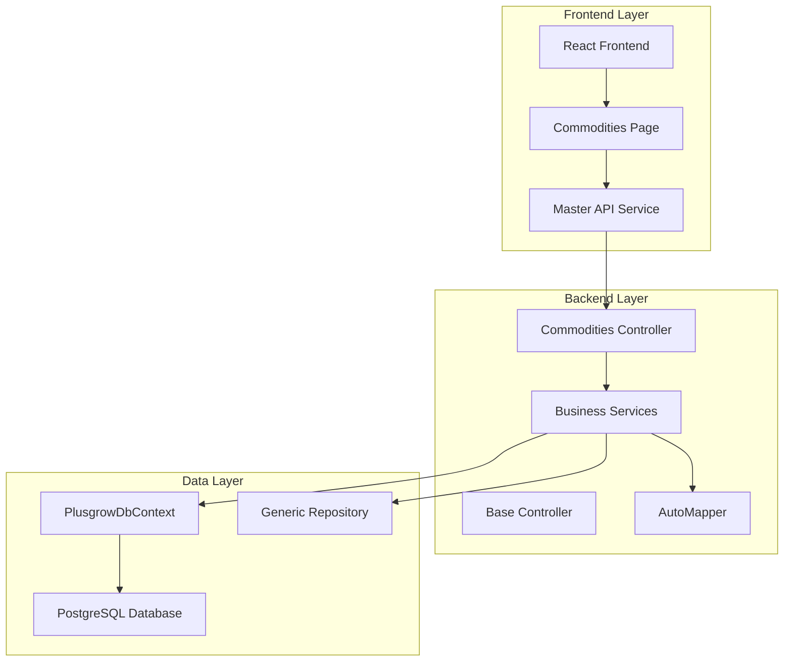
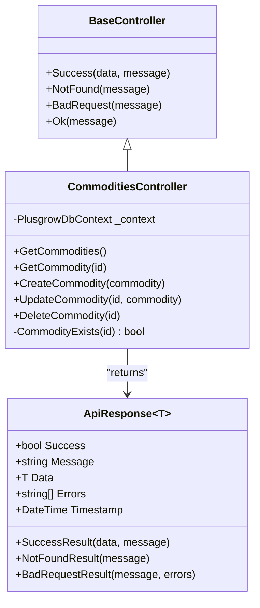
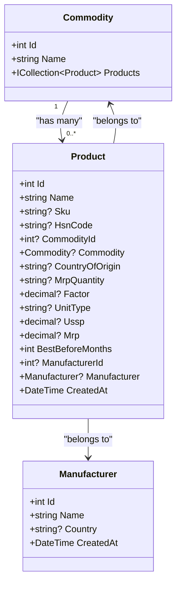
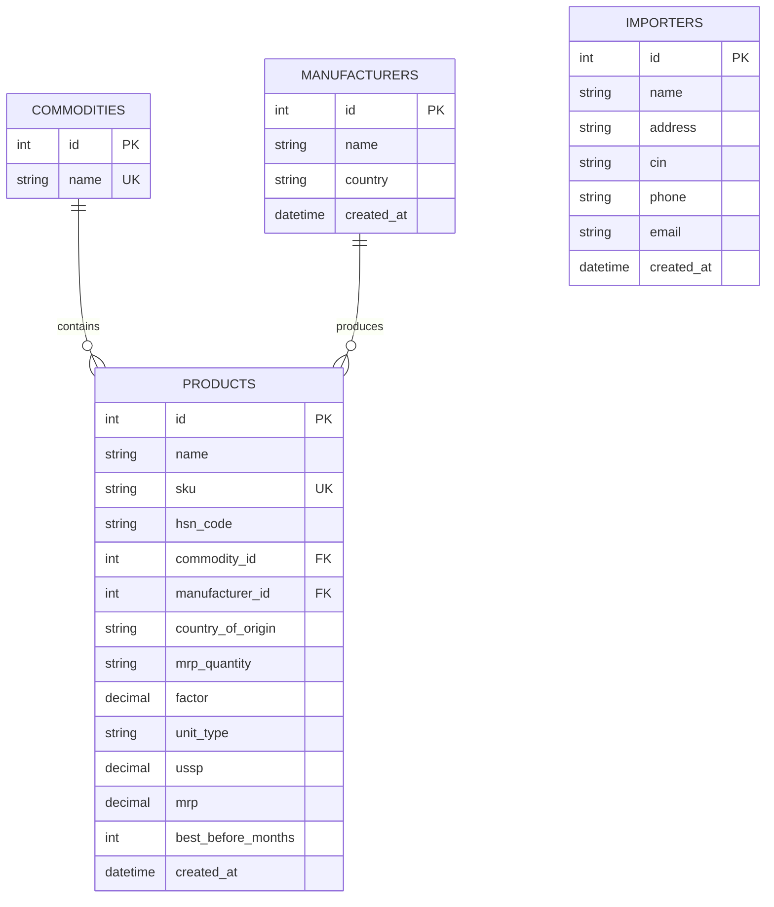
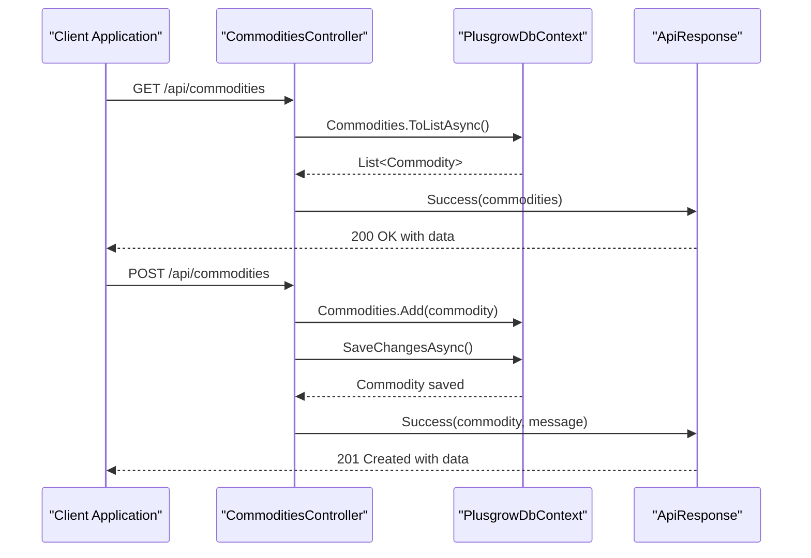
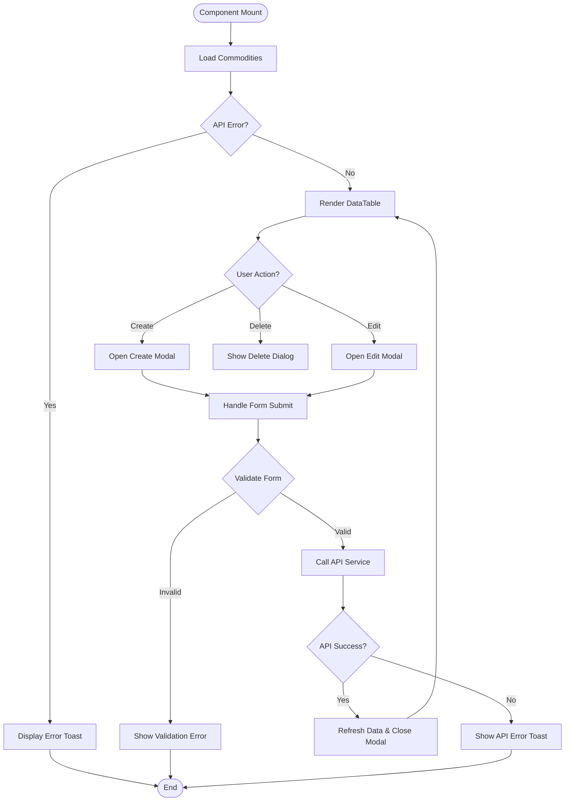
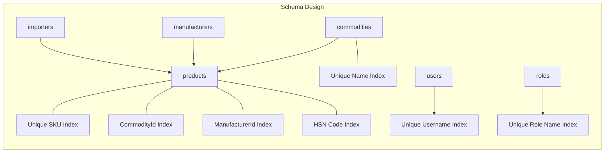
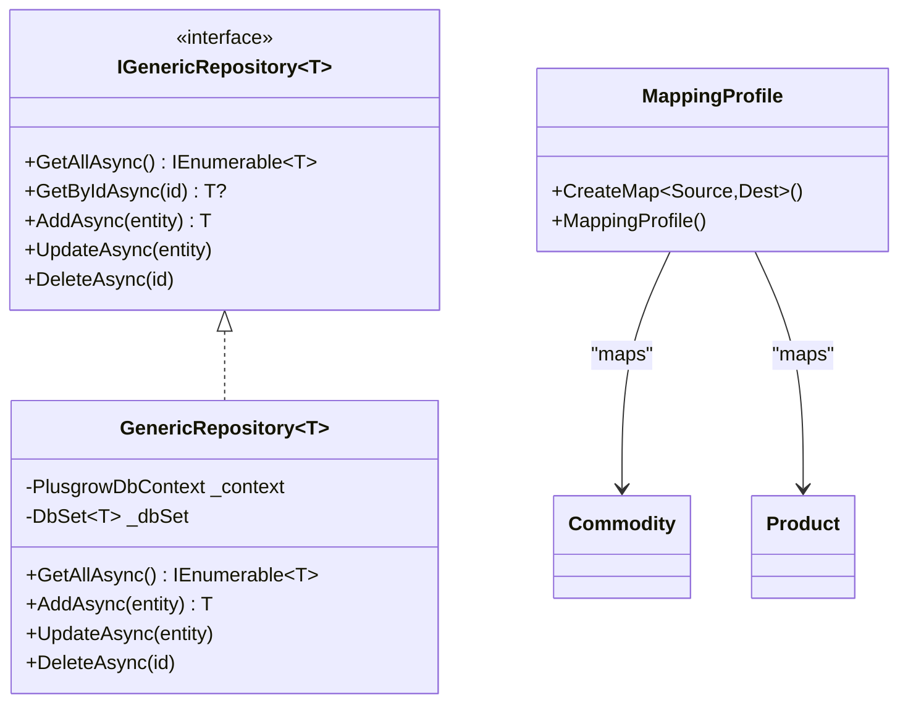
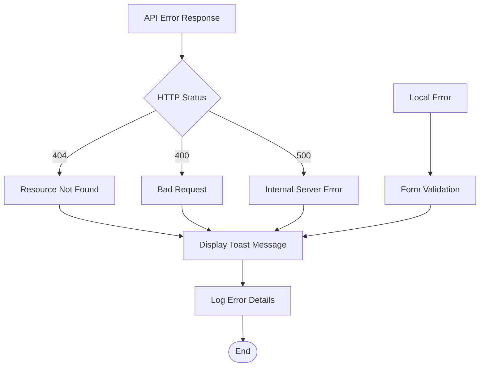

# Commodities Master Data

<cite>
**Referenced Files in This Document**
- [Commodity.cs](file://Backend/PlusgrowWms.Api/Models/Commodity.cs)
- [CommoditiesController.cs](file://Backend/PlusgrowWms.Api/Controllers/CommoditiesController.cs)
- [PlusgrowDbContext.cs](file://Backend/PlusgrowWms.Api/Data/PlusgrowDbContext.cs)
- [MappingProfile.cs](file://Backend/PlusgrowWms.Api/Mappings/MappingProfile.cs)
- [Commodities.tsx](file://Frontend/src/pages/Commodities.tsx)
- [masterApi.ts](file://Frontend/src/services/masterApi.ts)
- [Product.cs](file://Backend/PlusgrowWms.Api/Models/Product.cs)
- [CommonDto.cs](file://Backend/PlusgrowWms.Api/DTOs/CommonDto.cs)
- [GenericRepository.cs](file://Backend/PlusgrowWms.Api/Repositories/GenericRepository.cs)
- [ApiResponse.cs](file://Backend/PlusgrowWms.Api/Helpers/ApiResponse.cs)
- [BaseController.cs](file://Backend/PlusgrowWms.Api/Controllers/BaseController.cs)
- [20260327081425_InitialCreate.cs](file://Backend/PlusgrowWms.Api/Migrations/20260327081425_InitialCreate.cs)
- [Program.cs](file://Backend/PlusgrowWms.Api/Program.cs)
</cite>

## Table of Contents
1. [Introduction](#introduction)
2. [System Architecture](#system-architecture)
3. [Core Components](#core-components)
4. [Data Model](#data-model)
5. [API Endpoints](#api-endpoints)
6. [Frontend Implementation](#frontend-implementation)
7. [Database Design](#database-design)
8. [Integration Patterns](#integration-patterns)
9. [Performance Considerations](#performance-considerations)
10. [Error Handling](#error-handling)
11. [Conclusion](#conclusion)

## Introduction

The Commodities Master Data system is a core component of the Plusgrow Warehouse Management System (WMS) that manages product categories and classifications. This system enables organizations to define and maintain commodity types that serve as the foundation for product categorization, inventory management, and reporting capabilities.

The system follows a modern layered architecture with clear separation between frontend presentation, backend API services, and database persistence. It leverages Entity Framework Core for data access, AutoMapper for object mapping, and follows RESTful API design principles for seamless integration.

## System Architecture

The Commodities Master Data system is built on a three-tier architecture pattern that ensures scalability, maintainability, and clear separation of concerns.

**Diagram sources**
- [Program.cs:20-85](file://Backend/PlusgrowWms.Api/Program.cs#L20-L85)
- [CommoditiesController.cs:9-18](file://Backend/PlusgrowWms.Api/Controllers/CommoditiesController.cs#L9-L18)
- [PlusgrowDbContext.cs:6-18](file://Backend/PlusgrowWms.Api/Data/PlusgrowDbContext.cs#L6-L18)

The architecture follows these key principles:
- **Layered Architecture**: Clear separation between presentation, business logic, and data access layers
- **RESTful API Design**: Standardized HTTP endpoints for CRUD operations
- **Dependency Injection**: Loose coupling through service registration and injection
- **Repository Pattern**: Abstraction over data access logic
- **Automapper Integration**: Seamless object-to-object mapping

## Core Components

### Backend Controllers

The CommoditiesController serves as the primary entry point for all commodity-related operations, implementing standard CRUD functionality with comprehensive error handling and validation.

**Diagram sources**
- [BaseController.cs:11-68](file://Backend/PlusgrowWms.Api/Controllers/BaseController.cs#L11-L68)
- [CommoditiesController.cs:11-80](file://Backend/PlusgrowWms.Api/Controllers/CommoditiesController.cs#L11-L80)
- [ApiResponse.cs:8-97](file://Backend/PlusgrowWms.Api/Helpers/ApiResponse.cs#L8-L97)

### Data Models

The system utilizes strongly-typed models with comprehensive validation attributes and Entity Framework configurations.

**Diagram sources**
- [Commodity.cs:8-21](file://Backend/PlusgrowWms.Api/Models/Commodity.cs#L8-L21)
- [Product.cs:7-64](file://Backend/PlusgrowWms.Api/Models/Product.cs#L7-L64)
- [Manufacturer.cs:7-24](file://Backend/PlusgrowWms.Api/Models/Manufacturer.cs#L7-L24)

**Section sources**
- [CommoditiesController.cs:11-80](file://Backend/PlusgrowWms.Api/Controllers/CommoditiesController.cs#L11-L80)
- [Commodity.cs:8-21](file://Backend/PlusgrowWms.Api/Models/Commodity.cs#L8-L21)
- [Product.cs:7-64](file://Backend/PlusgrowWms.Api/Models/Product.cs#L7-L64)

## Data Model

### Entity Relationships

The commodities system establishes clear relationships with products while maintaining referential integrity and cascading delete behavior.

**Diagram sources**
- [PlusgrowDbContext.cs:32-43](file://Backend/PlusgrowWms.Api/Data/PlusgrowDbContext.cs#L32-L43)
- [Product.cs:26-60](file://Backend/PlusgrowWms.Api/Models/Product.cs#L26-L60)
- [20260327081425_InitialCreate.cs:15-110](file://Backend/PlusgrowWms.Api/Migrations/20260327081425_InitialCreate.cs#L15-L110)

### Validation and Constraints

The data model enforces comprehensive validation rules and database constraints:

- **Commodity Validation**: Required name field with 150-character maximum length
- **Product Validation**: SKU uniqueness constraint, optional HSN code, and comprehensive product attributes
- **Foreign Key Relationships**: Cascade delete from products to commodities
- **Unique Indexes**: Name uniqueness for commodities, SKUs for products, and usernames for users

**Section sources**
- [Commodity.cs:14-17](file://Backend/PlusgrowWms.Api/Models/Commodity.cs#L14-L17)
- [Product.cs:13-24](file://Backend/PlusgrowWms.Api/Models/Product.cs#L13-L24)
- [PlusgrowDbContext.cs:46-52](file://Backend/PlusgrowWms.Api/Data/PlusgrowDbContext.cs#L46-L52)

## API Endpoints

### RESTful Endpoint Design

The Commodities API follows RESTful conventions with standardized endpoint patterns and HTTP status codes.

**Diagram sources**
- [CommoditiesController.cs:20-42](file://Backend/PlusgrowWms.Api/Controllers/CommoditiesController.cs#L20-L42)
- [ApiResponse.cs:41-49](file://Backend/PlusgrowWms.Api/Helpers/ApiResponse.cs#L41-L49)

### Endpoint Specifications

| Method | Endpoint | Description | Response |
|--------|----------|-------------|----------|
| GET | `/api/commodities` | Retrieve all commodities | Array of commodity objects |
| GET | `/api/commodities/{id}` | Retrieve specific commodity | Single commodity object |
| POST | `/api/commodities` | Create new commodity | Created commodity object |
| PUT | `/api/commodities/{id}` | Update existing commodity | Updated commodity object |
| DELETE | `/api/commodities/{id}` | Remove commodity | Success message |

**Section sources**
- [CommoditiesController.cs:20-77](file://Backend/PlusgrowWms.Api/Controllers/CommoditiesController.cs#L20-L77)

## Frontend Implementation

### React Component Architecture

The frontend implementation uses React with TypeScript and follows modern component patterns for optimal user experience.

**Diagram sources**
- [Commodities.tsx:25-97](file://Frontend/src/pages/Commodities.tsx#L25-L97)

### Component Features

The Commodities page provides comprehensive functionality including:

- **Data Table**: Interactive table with sorting, filtering, and pagination
- **Modal Forms**: Responsive forms for create/edit operations
- **Confirmation Dialogs**: Safe deletion with user confirmation
- **Real-time Updates**: Automatic data refresh after operations
- **Loading States**: Visual feedback during API operations
- **Error Handling**: Comprehensive error messaging and user feedback

**Section sources**
- [Commodities.tsx:12-231](file://Frontend/src/pages/Commodities.tsx#L12-L231)

## Database Design

### Schema Evolution

The database design follows a clean schema with proper indexing and relationship management.

**Diagram sources**
- [PlusgrowDbContext.cs:12-18](file://Backend/PlusgrowWms.Api/Data/PlusgrowDbContext.cs#L12-L18)
- [PlusgrowDbContext.cs:46-90](file://Backend/PlusgrowWms.Api/Data/PlusgrowDbContext.cs#L46-L90)
- [20260327081425_InitialCreate.cs:163-231](file://Backend/PlusgrowWms.Api/Migrations/20260327081425_InitialCreate.cs#L163-L231)

### Migration Strategy

The system uses Entity Framework migrations for database schema management:

- **Initial Creation**: Complete schema definition with all tables and relationships
- **Column Mapping**: Proper snake_case conversion for PostgreSQL compatibility
- **Cascade Behavior**: Configured cascade deletes for referential integrity
- **Index Optimization**: Strategic indexing for query performance

**Section sources**
- [PlusgrowDbContext.cs:24-29](file://Backend/PlusgrowWms.Api/Data/PlusgrowDbContext.cs#L24-L29)
- [PlusgrowDbContext.cs:31-43](file://Backend/PlusgrowWms.Api/Data/PlusgrowDbContext.cs#L31-L43)
- [20260327081425_InitialCreate.cs:13-260](file://Backend/PlusgrowWms.Api/Migrations/20260327081425_InitialCreate.cs#L13-L260)

## Integration Patterns

### Service Layer Architecture

The system implements a robust service layer pattern for business logic encapsulation.

**Diagram sources**
- [GenericRepository.cs:7-116](file://Backend/PlusgrowWms.Api/Repositories/GenericRepository.cs#L7-L116)
- [MappingProfile.cs:7-54](file://Backend/PlusgrowWms.Api/Mappings/MappingProfile.cs#L7-L54)

### API Communication

The frontend communicates with the backend through a well-defined API service layer:

- **Axios Integration**: HTTP client with automatic JSON serialization
- **Type Safety**: Strongly-typed interfaces for all API operations
- **Error Handling**: Consistent error response handling
- **Environment Configuration**: Flexible API base URL configuration

**Section sources**
- [masterApi.ts:115-139](file://Frontend/src/services/masterApi.ts#L115-L139)
- [Program.cs:26-27](file://Backend/PlusgrowWms.Api/Program.cs#L26-L27)

## Performance Considerations

### Database Optimization

The system implements several performance optimization strategies:

- **Strategic Indexing**: Unique indexes on frequently queried columns (names, SKUs, usernames)
- **Foreign Key Optimization**: Proper indexing on foreign key relationships
- **Cascade Configuration**: Efficient cascade delete behavior
- **Snake_case Naming**: Optimized for PostgreSQL performance characteristics

### Frontend Performance

The frontend implementation focuses on responsive user experience:

- **Memoization**: React.memo for component optimization
- **Loading States**: Visual feedback during data operations
- **Efficient State Management**: Minimal re-renders through proper state updates
- **Toast Notifications**: Non-blocking user feedback

## Error Handling

### Comprehensive Error Management

The system implements layered error handling across all components:

**Diagram sources**
- [CommoditiesController.cs:31-61](file://Backend/PlusgrowWms.Api/Controllers/CommoditiesController.cs#L31-L61)
- [ApiResponse.cs:68-96](file://Backend/PlusgrowWms.Api/Helpers/ApiResponse.cs#L68-L96)

### Error Response Structure

All error responses follow a consistent structure:

- **Success Flag**: Boolean indicating operation outcome
- **Message Field**: Human-readable error description
- **Errors Array**: Detailed validation errors when applicable
- **Timestamp**: UTC timestamp for audit purposes

**Section sources**
- [ApiResponse.cs:8-27](file://Backend/PlusgrowWms.Api/Helpers/ApiResponse.cs#L8-L27)
- [CommoditiesController.cs:31-76](file://Backend/PlusgrowWms.Api/Controllers/CommoditiesController.cs#L31-L76)

## Conclusion

The Commodities Master Data system represents a well-architected solution for managing product categories within the Plusgrow WMS ecosystem. The system successfully balances functionality, maintainability, and performance through its layered architecture, comprehensive validation, and thoughtful design patterns.

Key strengths of the implementation include:

- **Clean Architecture**: Clear separation of concerns with proper layering
- **Robust Data Model**: Well-designed entities with appropriate relationships
- **RESTful API**: Standardized endpoints with consistent response patterns
- **Modern Frontend**: React-based interface with excellent user experience
- **Performance Optimization**: Strategic indexing and efficient data access patterns
- **Comprehensive Error Handling**: Consistent error management across all layers

The system provides a solid foundation for future enhancements and can easily accommodate additional commodity-related features as the business requirements evolve. The modular design ensures that new functionality can be added without disrupting existing operations, making it a scalable solution for growing organizational needs.