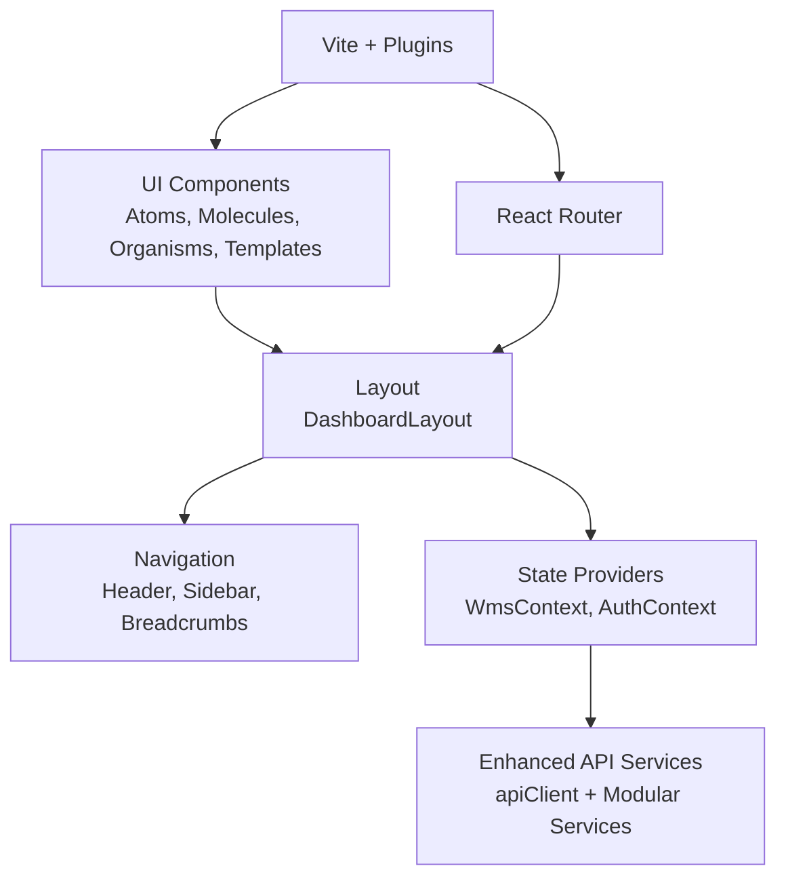
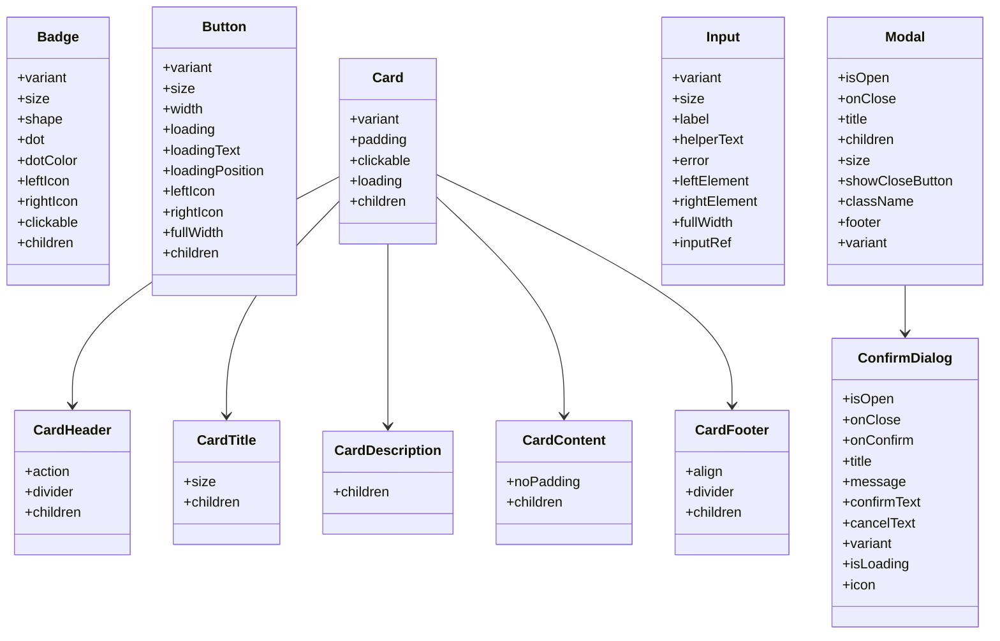
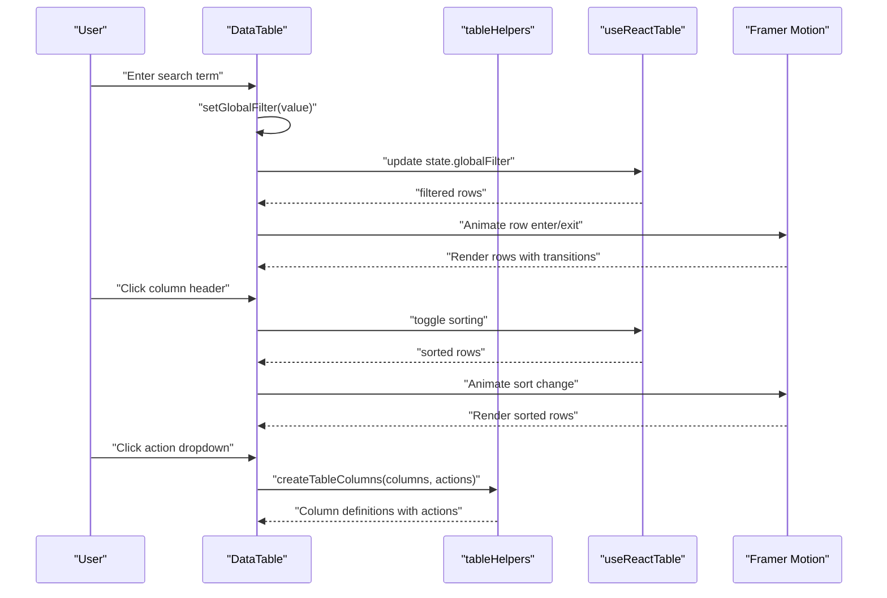
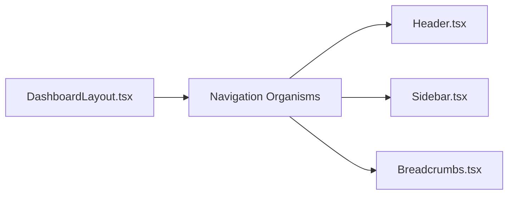
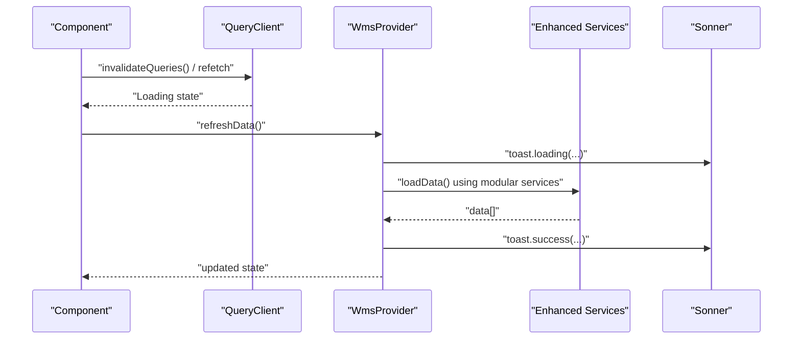
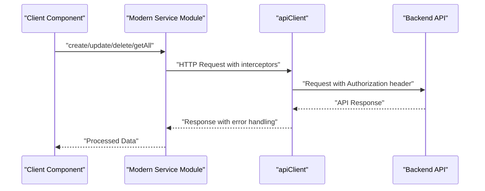
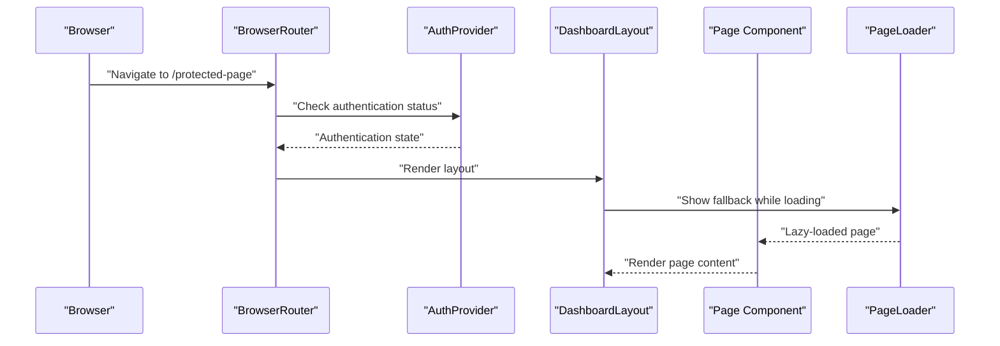

# Frontend Application Documentation

<cite>
**Referenced Files in This Document**
- [main.tsx](file://Frontend/src/main.tsx)
- [App.tsx](file://Frontend/src/App.tsx)
- [AuthContext.tsx](file://Frontend/src/context/AuthContext.tsx)
- [WmsContext.tsx](file://Frontend/src/context/WmsContext.tsx)
- [vite.config.ts](file://Frontend/vite.config.ts)
- [package.json](file://Frontend/package.json)
- [tokens.css](file://Frontend/src/styles/tokens.css)
- [atoms/index.ts](file://Frontend/src/components/atoms/index.ts)
- [Badge.tsx](file://Frontend/src/components/atoms/Badge/Badge.tsx)
- [Button.tsx](file://Frontend/src/components/atoms/Button/Button.tsx)
- [Card.tsx](file://Frontend/src/components/atoms/Card/Card.tsx)
- [Input.tsx](file://Frontend/src/components/atoms/Input/Input.tsx)
- [Modal.tsx](file://Frontend/src/components/atoms/Modal/Modal.tsx)
- [molecules/index.ts](file://Frontend/src/components/molecules/index.ts)
- [DataTable.tsx](file://Frontend/src/components/molecules/DataTable/DataTable.tsx)
- [tableHelpers.tsx](file://Frontend/src/components/molecules/DataTable/tableHelpers.tsx)
- [templates/index.ts](file://Frontend/src/components/templates/index.ts)
- [DashboardLayout.tsx](file://Frontend/src/components/templates/DashboardLayout/DashboardLayout.tsx)
- [Layout.tsx](file://Frontend/src/components/layout/Layout.tsx)
- [Breadcrumbs.tsx](file://Frontend/src/components/organisms/Navigation/Breadcrumbs/Breadcrumbs.tsx)
- [Header.tsx](file://Frontend/src/components/organisms/Navigation/Header/Header.tsx)
- [Sidebar.tsx](file://Frontend/src/components/organisms/Navigation/Sidebar/Sidebar.tsx)
- [index.ts](file://Frontend/src/components/organisms/Navigation/index.ts)
- [Commodities.tsx](file://Frontend/src/pages/Commodities.tsx)
- [Importers.tsx](file://Frontend/src/pages/Importers.tsx)
- [Manufacturers.tsx](file://Frontend/src/pages/Manufacturers.tsx)
- [authApi.ts](file://Frontend/src/services/authApi.ts)
- [masterApi.ts](file://Frontend/src/services/masterApi.ts)
- [mockApi.ts](file://Frontend/src/services/mockApi.ts)
- [mockData.ts](file://Frontend/src/services/mockData.ts)
- [utils.ts](file://Frontend/src/lib/utils.ts)
- [lib/api/index.ts](file://Frontend/src/lib/api/index.ts)
- [lib/api/client.ts](file://Frontend/src/lib/api/client.ts)
- [lib/api/services/auth.service.ts](file://Frontend/src/lib/api/services/auth.service.ts)
- [lib/api/services/commodity.service.ts](file://Frontend/src/lib/api/services/commodity.service.ts)
- [lib/api/services/manufacturer.service.ts](file://Frontend/src/lib/api/services/manufacturer.service.ts)
- [lib/api/services/importer.service.ts](file://Frontend/src/lib/api/services/importer.service.ts)
- [lib/api/services/product.service.ts](file://Frontend/src/lib/api/services/product.service.ts)
- [dropdown-menu.tsx](file://Frontend/src/components/ui/dropdown-menu.tsx)
</cite>

## Update Summary
**Changes Made**
- Enhanced DataTable component with advanced search, pagination, animations, and comprehensive UI features
- Added sophisticated animation system using Framer Motion for loading states, empty states, and row transitions
- Implemented advanced table helpers with action-enabled columns and dropdown menus
- Integrated @radix-ui/react-dropdown-menu for enhanced dropdown interactions
- Added comprehensive master data management pages (Commodities, Importers, Manufacturers) with standardized CRUD patterns
- Enhanced component architecture with improved modularity and separation of concerns
- Added new Modal component with ConfirmDialog for destructive actions
- Improved authentication state management with enhanced error handling
- **Updated service architecture with separate masterApi.ts and commodity.service.ts implementations**
- **Replaced monolithic masterApi.ts with modular service architecture using apiClient and individual service modules**
- **Enhanced form handling with improved validation and user feedback patterns**

## Table of Contents
1. [Introduction](#introduction)
2. [Project Structure](#project-structure)
3. [Core Components](#core-components)
4. [Architecture Overview](#architecture-overview)
5. [Detailed Component Analysis](#detailed-component-analysis)
6. [Dependency Analysis](#dependency-analysis)
7. [Performance Considerations](#performance-considerations)
8. [Troubleshooting Guide](#troubleshooting-guide)
9. [Conclusion](#conclusion)
10. [Appendices](#appendices)

## Introduction
This document describes the PlusGrow WMS frontend built with React and TypeScript. It explains the atomic design system architecture (atoms, molecules, organisms, templates), component hierarchy, prop relationships, state management using WmsContext and React Query, routing and navigation patterns, styling via CSS variables and design tokens, component library usage, reusable patterns, build and deployment configuration, responsive design, accessibility, and performance optimization techniques.

**Updated** Enhanced with a comprehensive DataTable component featuring advanced search, pagination, animations, and sophisticated UI interactions, along with new Modal component with ConfirmDialog for destructive actions, integrated @radix-ui/react-dropdown-menu for advanced dropdown functionality, and comprehensive master data management pages (Commodities, Importers, Manufacturers) with standardized CRUD patterns. The service architecture has been modernized with separate masterApi.ts and commodity.service.ts implementations, replacing the monolithic approach with a more maintainable modular structure.

## Project Structure
The frontend is organized around a clear atomic design system and feature-based pages:
- Atoms: smallest reusable UI elements (Badge, Button, Card, Input, Modal)
- Molecules: composite components combining atoms (DataTable with advanced animation system, tableHelpers for action management)
- Organisms: feature-focused sections (Navigation: Header, Sidebar, Breadcrumbs)
- Templates: page scaffolds (DashboardLayout)
- Pages: routeable screens (Dashboard, PutAway, Commodities, Manufacturers, Importers, Inward, Outward, etc.)
- Context: global state providers (WmsContext, AuthContext)
- Services: API clients for authentication and master data management
- Styles: design tokens and animations
- Build: Vite with Tailwind CSS and React plugins

```mermaid
graph TB
subgraph "Entry"
MAIN["main.tsx"]
APP["App.tsx"]
AUTH["AuthContext.tsx"]
END
subgraph "Routing & Layout"
ROUTER["react-router-dom Routes"]
LAYOUT["DashboardLayout.tsx"]
NAV["Navigation<br/>Header, Sidebar, Breadcrumbs"]
END
subgraph "State"
WMSCONTEXT["WmsContext.tsx"]
AUTHCONTEXT["AuthContext.tsx"]
END
subgraph "Enhanced API Services"
API_CLIENT["lib/api/client.ts"]
AUTH_SERVICE["lib/api/services/auth.service.ts"]
COMMODITY_SERVICE["lib/api/services/commodity.service.ts"]
MANUFACTURER_SERVICE["lib/api/services/manufacturer.service.ts"]
IMPORTER_SERVICE["lib/api/services/importer.service.ts"]
PRODUCT_SERVICE["lib/api/services/product.service.ts"]
INDEX_EXPORTS["lib/api/index.ts"]
END
subgraph "Legacy Services"
LEGACY_MASTER["services/masterApi.ts"]
LEGACY_AUTH["services/authApi.ts"]
END
subgraph "Enhanced Atomic UI"
ATOMS["Atoms<br/>Badge, Button, Card, Input, Modal"]
MOLECULES["Molecules<br/>DataTable (Enhanced), tableHelpers"]
TEMPLATES["Templates<br/>DashboardLayout"]
UICOMPONENTS["UI Components<br/>Dropdown Menu (Radix UI)"]
END
subgraph "Master Data Pages"
COMMODITIES["Commodities.tsx"]
MANUFACTURERS["Manufacturers.tsx"]
IMPORTERS["Importers.tsx"]
END
subgraph "Other Pages"
P_DASH["Dashboard.tsx"]
P_PUTAWAY["PutAway.tsx"]
P_INWARD["Inward.tsx"]
P_OUTWARD["Outward.tsx"]
P_OTHERS["Other pages..."]
END
MAIN --> APP
APP --> AUTH
APP --> ROUTER
ROUTER --> LAYOUT
LAYOUT --> NAV
AUTH --> WMSCONTEXT
WMSCONTEXT --> INDEX_EXPORTS
WMSCONTEXT --> LEGACY_MASTER
AUTH --> AUTH_SERVICE
AUTH --> LEGACY_AUTH
INDEX_EXPORTS --> API_CLIENT
INDEX_EXPORTS --> AUTH_SERVICE
INDEX_EXPORTS --> COMMODITY_SERVICE
INDEX_EXPORTS --> MANUFACTURER_SERVICE
INDEX_EXPORTS --> IMPORTER_SERVICE
INDEX_EXPORTS --> PRODUCT_SERVICE
LAYOUT --> ATOMS
LAYOUT --> MOLECULES
LAYOUT --> TEMPLATES
LAYOUT --> UICOMPONENTS
ROUTER --> COMMODITIES
ROUTER --> MANUFACTURERS
ROUTER --> IMPORTERS
ROUTER --> P_DASH
ROUTER --> P_PUTAWAY
ROUTER --> P_INWARD
ROUTER --> P_OUTWARD
ROUTER --> P_OTHERS
```

**Diagram sources**
- [main.tsx:1-11](file://Frontend/src/main.tsx#L1-L11)
- [App.tsx:1-184](file://Frontend/src/App.tsx#L1-L184)
- [AuthContext.tsx:1-139](file://Frontend/src/context/AuthContext.tsx#L1-L139)
- [DashboardLayout.tsx](file://Frontend/src/components/templates/DashboardLayout/DashboardLayout.tsx)
- [Header.tsx](file://Frontend/src/components/organisms/Navigation/Header/Header.tsx)
- [Sidebar.tsx](file://Frontend/src/components/organisms/Navigation/Sidebar/Sidebar.tsx)
- [Breadcrumbs.tsx](file://Frontend/src/components/organisms/Navigation/Breadcrumbs/Breadcrumbs.tsx)
- [WmsContext.tsx:28-225](file://Frontend/src/context/WmsContext.tsx#L28-L225)
- [authApi.ts:1-81](file://Frontend/src/services/authApi.ts#L1-L81)
- [masterApi.ts:1-199](file://Frontend/src/services/masterApi.ts#L1-L199)
- [lib/api/index.ts:1-12](file://Frontend/src/lib/api/index.ts#L1-L12)
- [lib/api/client.ts:1-37](file://Frontend/src/lib/api/client.ts#L1-L37)
- [lib/api/services/auth.service.ts:1-118](file://Frontend/src/lib/api/services/auth.service.ts#L1-L118)
- [lib/api/services/commodity.service.ts:1-36](file://Frontend/src/lib/api/services/commodity.service.ts#L1-L36)
- [lib/api/services/manufacturer.service.ts:1-36](file://Frontend/src/lib/api/services/manufacturer.service.ts#L1-L36)
- [lib/api/services/importer.service.ts:1-36](file://Frontend/src/lib/api/services/importer.service.ts#L1-L36)
- [lib/api/services/product.service.ts:1-43](file://Frontend/src/lib/api/services/product.service.ts#L1-L43)
- [Badge.tsx](file://Frontend/src/components/atoms/Badge/Badge.tsx)
- [Button.tsx](file://Frontend/src/components/atoms/Button/Button.tsx)
- [Card.tsx](file://Frontend/src/components/atoms/Card/Card.tsx)
- [Input.tsx](file://Frontend/src/components/atoms/Input/Input.tsx)
- [Modal.tsx](file://Frontend/src/components/atoms/Modal/Modal.tsx)
- [DataTable.tsx](file://Frontend/src/components/molecules/DataTable/DataTable.tsx)
- [tableHelpers.tsx](file://Frontend/src/components/molecules/DataTable/tableHelpers.tsx)
- [dropdown-menu.tsx](file://Frontend/src/components/ui/dropdown-menu.tsx)
- [Commodities.tsx:1-231](file://Frontend/src/pages/Commodities.tsx#L1-L231)
- [Importers.tsx:1-315](file://Frontend/src/pages/Importers.tsx#L1-L315)
- [Manufacturers.tsx:1-254](file://Frontend/src/pages/Manufacturers.tsx#L1-L254)

**Section sources**
- [main.tsx:1-11](file://Frontend/src/main.tsx#L1-L11)
- [App.tsx:1-184](file://Frontend/src/App.tsx#L1-L184)

## Core Components
- Atomic design system exports:
  - Atoms re-export variants and props for Badge, Button, Card, Input, Modal
  - Molecules export StatCard, PageLoader, DataTable (enhanced with animation system), and tableHelpers for action management
  - Templates export DashboardLayout
  - UI components include Dropdown Menu (Radix UI) for advanced interactions
- Global state providers:
  - WmsProvider manages products, customers, invoices, stock, activities, loading state, and actions (add/update entities, stock updates, bin assignment, clearing bins)
  - AuthProvider manages authentication state, user data, and session handling with enhanced error management
  - Both use API services for data persistence and validation
- Routing and navigation:
  - App configures React Router with lazy-loaded pages and Suspense fallbacks
  - DashboardLayout wraps routes and provides consistent navigation
  - Navigation organisms include Header, Sidebar, Breadcrumbs
  - Enhanced routing includes new master data pages (Commodities, Importers, Manufacturers)
- Enhanced service architecture:
  - **New modular architecture**: apiClient (centralized HTTP client with interceptors) + individual service modules (auth.service.ts, commodity.service.ts, manufacturer.service.ts, importer.service.ts, product.service.ts)
  - **Legacy compatibility**: masterApi.ts and authApi.ts maintained for backward compatibility
  - **Centralized exports**: lib/api/index.ts provides unified access to all services
  - **Improved error handling**: Automatic 401 logout and token management
  - **Better organization**: Clear separation of concerns with specialized service modules
- Styling system:
  - tokens.css defines theme tokens (colors, typography, spacing, radius, shadows, animations, z-index)
  - Tailwind layers base and utilities apply tokens consistently
- Build and dev tools:
  - Vite config integrates React and Tailwind plugins, environment variable exposure, path aliases, and HMR controls
  - package.json scripts for dev, build, preview, lint, and clean

**Updated** Enhanced service architecture with modular design using apiClient and individual service modules, providing better organization, maintainability, and separation of concerns. Legacy masterApi.ts and authApi.ts remain for compatibility while new pages utilize the modern service pattern.

**Section sources**
- [atoms/index.ts:1-27](file://Frontend/src/components/atoms/index.ts#L1-L27)
- [molecules/index.ts:1-6](file://Frontend/src/components/molecules/index.ts#L1-L6)
- [templates/index.ts:1-3](file://Frontend/src/components/templates/index.ts#L1-L3)
- [WmsContext.tsx:6-24](file://Frontend/src/context/WmsContext.tsx#L6-L24)
- [WmsContext.tsx:28-225](file://Frontend/src/context/WmsContext.tsx#L28-L225)
- [AuthContext.tsx:1-139](file://Frontend/src/context/AuthContext.tsx#L1-L139)
- [App.tsx:1-184](file://Frontend/src/App.tsx#L1-L184)
- [authApi.ts:1-81](file://Frontend/src/services/authApi.ts#L1-L81)
- [masterApi.ts:1-199](file://Frontend/src/services/masterApi.ts#L1-L199)
- [lib/api/index.ts:1-12](file://Frontend/src/lib/api/index.ts#L1-L12)
- [lib/api/client.ts:1-37](file://Frontend/src/lib/api/client.ts#L1-L37)
- [lib/api/services/auth.service.ts:1-118](file://Frontend/src/lib/api/services/auth.service.ts#L1-L118)
- [lib/api/services/commodity.service.ts:1-36](file://Frontend/src/lib/api/services/commodity.service.ts#L1-L36)
- [lib/api/services/manufacturer.service.ts:1-36](file://Frontend/src/lib/api/services/manufacturer.service.ts#L1-L36)
- [lib/api/services/importer.service.ts:1-36](file://Frontend/src/lib/api/services/importer.service.ts#L1-L36)
- [lib/api/services/product.service.ts:1-43](file://Frontend/src/lib/api/services/product.service.ts#L1-L43)
- [tokens.css:6-209](file://Frontend/src/styles/tokens.css#L6-L209)
- [vite.config.ts:1-25](file://Frontend/vite.config.ts#L1-L25)
- [package.json:1-59](file://Frontend/package.json#L1-L59)

## Architecture Overview
The application follows a layered architecture with enhanced master data management and improved component interactions:
- Presentation layer: React components organized by atomic design with enhanced modal and dropdown interactions
- State layer: WmsContext and AuthContext centralize business state and authentication
- Data layer: **Enhanced with modular service architecture** - apiClient + individual service modules for better organization and maintainability
- Routing layer: React Router with code-split pages and Suspense fallbacks
- Styling layer: CSS variables and Tailwind utilities mapped to design tokens



**Diagram sources**
- [App.tsx:39-184](file://Frontend/src/App.tsx#L39-L184)
- [DashboardLayout.tsx](file://Frontend/src/components/templates/DashboardLayout/DashboardLayout.tsx)
- [Header.tsx](file://Frontend/src/components/organisms/Navigation/Header/Header.tsx)
- [Sidebar.tsx](file://Frontend/src/components/organisms/Navigation/Sidebar/Sidebar.tsx)
- [Breadcrumbs.tsx](file://Frontend/src/components/organisms/Navigation/Breadcrumbs/Breadcrumbs.tsx)
- [WmsContext.tsx:28-225](file://Frontend/src/context/WmsContext.tsx#L28-L225)
- [AuthContext.tsx:1-139](file://Frontend/src/context/AuthContext.tsx#L1-L139)
- [authApi.ts:1-81](file://Frontend/src/services/authApi.ts#L1-L81)
- [masterApi.ts:1-199](file://Frontend/src/services/masterApi.ts#L1-L199)
- [lib/api/index.ts:1-12](file://Frontend/src/lib/api/index.ts#L1-L12)
- [lib/api/client.ts:1-37](file://Frontend/src/lib/api/client.ts#L1-L37)
- [vite.config.ts:1-25](file://Frontend/vite.config.ts#L1-L25)

## Detailed Component Analysis

### Atomic Design System

#### Atoms
- Badge: Variants (default, primary, success, warning, danger, info, outline, ghost), sizes (sm, md, lg), shapes (default, pill, square), optional dot, icons, clickability
- Button: Variants (default, primary, secondary, outline, ghost, link, destructive, success, warning), sizes (xs, sm, md, lg, xl, icon, icon-sm, icon-lg), widths (auto, full), loading states, icons, full width
- Card: Variants (default, elevated, outlined, ghost, interactive, glass), padding levels, header/title/description/content/footer slots, loading skeleton
- Input: Variants (default, error, success, ghost), sizes (sm, md, lg, xl), label, helper/error text, left/right elements, full width
- Modal: New component with size variants (sm, md, lg, xl, full), backdrop handling, escape key support, close button, and ConfirmDialog for destructive actions with sophisticated animation system



**Diagram sources**
- [Badge.tsx:10-106](file://Frontend/src/components/atoms/Badge/Badge.tsx#L10-L106)
- [Button.tsx:10-142](file://Frontend/src/components/atoms/Button/Button.tsx#L10-L142)
- [Card.tsx:11-218](file://Frontend/src/components/atoms/Card/Card.tsx#L11-L218)
- [Input.tsx:10-132](file://Frontend/src/components/atoms/Input/Input.tsx#L10-L132)
- [Modal.tsx:6-148](file://Frontend/src/components/atoms/Modal/Modal.tsx#L6-L148)

**Section sources**
- [Badge.tsx:10-106](file://Frontend/src/components/atoms/Badge/Badge.tsx#L10-L106)
- [Button.tsx:10-142](file://Frontend/src/components/atoms/Button/Button.tsx#L10-L142)
- [Card.tsx:11-218](file://Frontend/src/components/atoms/Card/Card.tsx#L11-L218)
- [Input.tsx:10-132](file://Frontend/src/components/atoms/Input/Input.tsx#L10-L132)
- [Modal.tsx:6-148](file://Frontend/src/components/atoms/Modal/Modal.tsx#L6-L148)

#### Molecules
- DataTable: Enhanced configurable table with sophisticated animation system using Framer Motion, advanced search with debounced filtering, pagination with intelligent page navigation, sorting with visual indicators, row selection, row click callbacks, loading states with spinner animations, empty states with illustration, and responsive design
- tableHelpers: New utility module providing createTableColumns helper for building action-enabled tables with Dropdown menus, default action configurations (edit/delete), and sophisticated column definition patterns

**Updated** The DataTable component now features a comprehensive animation system using Framer Motion for loading states, empty states, and row transitions, sophisticated search capabilities with debounced filtering, intelligent pagination with dynamic page navigation, and enhanced visual feedback for user interactions.



**Diagram sources**
- [DataTable.tsx:38-236](file://Frontend/src/components/molecules/DataTable/DataTable.tsx#L38-L236)
- [tableHelpers.tsx:27-76](file://Frontend/src/components/molecules/DataTable/tableHelpers.tsx#L27-L76)

**Section sources**
- [DataTable.tsx:28-327](file://Frontend/src/components/molecules/DataTable/DataTable.tsx#L28-L327)
- [tableHelpers.tsx:12-170](file://Frontend/src/components/molecules/DataTable/tableHelpers.tsx#L12-L170)

#### Organisms
- Navigation:
  - Header: Top-level branding and user actions
  - Sidebar: Collapsible navigation menu
  - Breadcrumbs: Path navigation within pages



**Diagram sources**
- [Header.tsx](file://Frontend/src/components/organisms/Navigation/Header/Header.tsx)
- [Sidebar.tsx](file://Frontend/src/components/organisms/Navigation/Sidebar/Sidebar.tsx)
- [Breadcrumbs.tsx](file://Frontend/src/components/organisms/Navigation/Breadcrumbs/Breadcrumbs.tsx)
- [DashboardLayout.tsx](file://Frontend/src/components/templates/DashboardLayout/DashboardLayout.tsx)

**Section sources**
- [Header.tsx](file://Frontend/src/components/organisms/Navigation/Header/Header.tsx)
- [Sidebar.tsx](file://Frontend/src/components/organisms/Navigation/Sidebar/Sidebar.tsx)
- [Breadcrumbs.tsx](file://Frontend/src/components/organisms/Navigation/Breadcrumbs/Breadcrumbs.tsx)

#### Templates
- DashboardLayout: Wraps page content with navigation and consistent layout structure

**Section sources**
- [DashboardLayout.tsx](file://Frontend/src/components/templates/DashboardLayout/DashboardLayout.tsx)

### State Management with WmsContext and AuthContext

#### Authentication State Management
- AuthProvider:
  - Manages user authentication state with enhanced error handling
  - Handles token storage and automatic logout on 401 errors
  - Provides login, register, logout, and password change functions
  - Integrates with enhanced service architecture using authService
  - Displays toast notifications for user feedback

#### Master Data State Management
- WmsProvider:
  - Loads initial datasets concurrently via mockApi
  - Exposes CRUD-like actions for products, customers, purchase/sales invoices, stock, and activities
  - Provides refreshData with toast feedback
  - Manages stock updates, bin assignments, and clearing bins with activity logging



**Diagram sources**
- [App.tsx:29-37](file://Frontend/src/App.tsx#L29-L37)
- [WmsContext.tsx:37-71](file://Frontend/src/context/WmsContext.tsx#L37-L71)
- [WmsContext.tsx:40-59](file://Frontend/src/context/WmsContext.tsx#L40-L59)
- [authApi.ts:24-34](file://Frontend/src/services/authApi.ts#L24-L34)
- [mockApi.ts](file://Frontend/src/services/mockApi.ts)

**Section sources**
- [WmsContext.tsx:6-24](file://Frontend/src/context/WmsContext.tsx#L6-L24)
- [WmsContext.tsx:28-225](file://Frontend/src/context/WmsContext.tsx#L28-L225)
- [AuthContext.tsx:1-139](file://Frontend/src/context/AuthContext.tsx#L1-L139)
- [App.tsx:29-37](file://Frontend/src/App.tsx#L29-L37)

### Enhanced Service Architecture

#### Modern Service Architecture
- **apiClient**: Centralized HTTP client with base URL configuration, request/response interceptors, and automatic token management
- **Individual Service Modules**: Specialized services for each domain (auth, commodity, manufacturer, importer, product) with consistent CRUD patterns
- **Centralized Exports**: lib/api/index.ts provides unified access to all services
- **Enhanced Error Handling**: Automatic 401 logout and improved error management
- **Better Organization**: Clear separation of concerns with modular design

#### Legacy Service Compatibility
- **masterApi.ts**: Maintained for backward compatibility with existing components
- **authApi.ts**: Enhanced with improved error handling and token management
- **Migration Strategy**: New pages utilize modern service architecture while legacy components continue using masterApi.ts



**Diagram sources**
- [lib/api/client.ts:13-34](file://Frontend/src/lib/api/client.ts#L13-L34)
- [lib/api/services/commodity.service.ts:10-35](file://Frontend/src/lib/api/services/commodity.service.ts#L10-L35)
- [lib/api/services/auth.service.ts:13-61](file://Frontend/src/lib/api/services/auth.service.ts#L13-L61)

**Section sources**
- [authApi.ts:1-81](file://Frontend/src/services/authApi.ts#L1-L81)
- [masterApi.ts:1-199](file://Frontend/src/services/masterApi.ts#L1-L199)
- [lib/api/index.ts:1-12](file://Frontend/src/lib/api/index.ts#L1-L12)
- [lib/api/client.ts:1-37](file://Frontend/src/lib/api/client.ts#L1-L37)
- [lib/api/services/auth.service.ts:1-118](file://Frontend/src/lib/api/services/auth.service.ts#L1-L118)
- [lib/api/services/commodity.service.ts:1-36](file://Frontend/src/lib/api/services/commodity.service.ts#L1-L36)
- [lib/api/services/manufacturer.service.ts:1-36](file://Frontend/src/lib/api/services/manufacturer.service.ts#L1-L36)
- [lib/api/services/importer.service.ts:1-36](file://Frontend/src/lib/api/services/importer.service.ts#L1-L36)
- [lib/api/services/product.service.ts:1-43](file://Frontend/src/lib/api/services/product.service.ts#L1-L43)

### Routing Configuration and Navigation Patterns
- App sets up BrowserRouter, QueryClientProvider, AuthProvider, WmsProvider, Toaster, and nested Routes under DashboardLayout
- Routes are lazy-loaded with Suspense fallbacks for improved performance
- Navigation organisms integrate with layout to provide consistent UX
- Authentication guards ensure protected routes are accessible only to authenticated users
- Enhanced routing includes new master data pages (Commodities, Importers, Manufacturers)



**Diagram sources**
- [App.tsx:44-184](file://Frontend/src/App.tsx#L44-L184)
- [AuthContext.tsx:46-58](file://Frontend/src/context/AuthContext.tsx#L46-L58)

**Section sources**
- [App.tsx:44-184](file://Frontend/src/App.tsx#L44-L184)

### Styling System Using CSS Variables and Design Tokens
- tokens.css defines:
  - Color palette (brand, semantic success/warning/danger/info, neutral)
  - Typography scales (fonts, sizes, weights)
  - Spacing scale, border radius, shadows, z-index
  - Animation durations and easing
  - Utility classes for glass, gradients, scrollbars, line clamps, sr-only
  - Keyframe animations mapped to utility classes
- Tailwind layers base and utilities apply tokens consistently across components

**Section sources**
- [tokens.css:6-209](file://Frontend/src/styles/tokens.css#L6-L209)
- [tokens.css:249-361](file://Frontend/src/styles/tokens.css#L249-L361)
- [tokens.css:366-483](file://Frontend/src/styles/tokens.css#L366-L483)

### Component Library Usage and Reusable Patterns
- Atoms expose variants and props for consistent reuse across molecules and organisms
- Molecules like DataTable encapsulate complex interactions (sorting, pagination, filtering) with sophisticated animation system and are reusable across pages
- tableHelpers provide standardized action column creation for DataTable instances with Dropdown menus
- Templates standardize layout and navigation across pages
- Navigation organisms provide cohesive user experience
- Master data pages demonstrate consistent patterns for CRUD operations with form validation and error handling
- Modal component provides consistent dialog behavior across the application with ConfirmDialog for destructive actions
- Dropdown Menu component (Radix UI) offers advanced interaction patterns for action menus with improved accessibility
- **Enhanced component architecture promotes better modularity and separation of concerns with modern service architecture**

**Updated** Master data pages (Commodities, Manufacturers, Importers) showcase standardized CRUD patterns with comprehensive form handling and error management. New Modal and Dropdown components enhance user interaction patterns with improved accessibility and performance. The modern service architecture provides better organization and maintainability.

**Section sources**
- [atoms/index.ts:1-27](file://Frontend/src/components/atoms/index.ts#L1-L27)
- [molecules/index.ts:1-6](file://Frontend/src/components/molecules/index.ts#L1-L6)
- [templates/index.ts:1-3](file://Frontend/src/components/templates/index.ts#L1-L3)
- [tableHelpers.tsx:27-76](file://Frontend/src/components/molecules/DataTable/tableHelpers.tsx#L27-L76)
- [Commodities.tsx:1-231](file://Frontend/src/pages/Commodities.tsx#L1-L231)
- [Importers.tsx:1-315](file://Frontend/src/pages/Importers.tsx#L1-L315)
- [Manufacturers.tsx:1-254](file://Frontend/src/pages/Manufacturers.tsx#L1-L254)
- [Modal.tsx:6-148](file://Frontend/src/components/atoms/Modal/Modal.tsx#L6-L148)
- [dropdown-menu.tsx:1-192](file://Frontend/src/components/ui/dropdown-menu.tsx#L1-L192)

### Integration Guidelines
- Use AuthProvider at the root to enable authentication state management
- Use WmsProvider at the root to enable global state
- Wrap pages with DashboardLayout for consistent navigation
- **Use modern service architecture**: Import from lib/api/index.ts for enhanced services (auth.service.ts, commodity.service.ts, etc.)
- **Maintain legacy compatibility**: Continue using masterApi.ts for existing components
- Prefer atomic variants and props for consistent styling
- Use DataTable for tabular data with advanced search, pagination, animations, and comprehensive UI features
- Use tableHelpers.createTableColumns for action-enabled tables with Dropdown menus
- Use Modal for non-blocking dialogs and ConfirmDialog for destructive actions
- Integrate navigation components (Header, Sidebar, Breadcrumbs) for coherent UX
- Use Dropdown Menu (Radix UI) for advanced action menus and context-sensitive interactions
- **Leverage the enhanced service architecture for better maintainability and separation of concerns**

**Updated** Added integration guidelines for new Modal, Dropdown Menu (Radix UI), and tableHelpers components with enhanced accessibility and performance considerations. Emphasized the modern service architecture benefits and migration strategies.

**Section sources**
- [AuthContext.tsx:114-130](file://Frontend/src/context/AuthContext.tsx#L114-L130)
- [WmsContext.tsx:216-225](file://Frontend/src/context/WmsContext.tsx#L216-L225)
- [DashboardLayout.tsx](file://Frontend/src/components/templates/DashboardLayout/DashboardLayout.tsx)
- [DataTable.tsx:28-73](file://Frontend/src/components/molecules/DataTable/DataTable.tsx#L28-L73)
- [tableHelpers.tsx:27-76](file://Frontend/src/components/molecules/DataTable/tableHelpers.tsx#L27-L76)
- [Modal.tsx:6-148](file://Frontend/src/components/atoms/Modal/Modal.tsx#L6-L148)
- [dropdown-menu.tsx:1-192](file://Frontend/src/components/ui/dropdown-menu.tsx#L1-L192)
- [masterApi.ts:1-199](file://Frontend/src/services/masterApi.ts#L1-L199)
- [authApi.ts:1-81](file://Frontend/src/services/authApi.ts#L1-L81)
- [lib/api/index.ts:1-12](file://Frontend/src/lib/api/index.ts#L1-L12)

### Examples of Component Usage, Customization, and Extension

#### Master Data CRUD Operations
- Commodities: Manage product categories with create, edit, delete functionality and search capabilities using enhanced DataTable with animation system
- Importers: Comprehensive supplier contact management with address, CIN, phone, and email fields with standardized form handling
- Manufacturers: Supplier and brand management with country information and creation dates with enhanced validation

#### Enhanced Table Interactions
- DataTable with custom cell renderers, action dropdowns, and sophisticated animation system using Framer Motion
- tableHelpers.createTableColumns for standardized action column creation with Dropdown menus
- Dropdown Menu (Radix UI) for context-sensitive actions with improved accessibility

#### Modal and Dialog Patterns
- Modal component for non-blocking forms and information display with size variants and backdrop handling
- ConfirmDialog for destructive actions with variant styling and loading states
- Escape key support and backdrop clicking for dismissal with improved accessibility

#### Authentication Flow
- Login: Secure credential submission with token storage and user data persistence using enhanced authService
- Logout: Server-side logout with local state cleanup and navigation
- Protected Routes: Automatic authentication checks with seamless redirect handling

**Section sources**
- [Commodities.tsx:11-231](file://Frontend/src/pages/Commodities.tsx#L11-L231)
- [Importers.tsx:12-315](file://Frontend/src/pages/Importers.tsx#L12-L315)
- [Manufacturers.tsx:12-254](file://Frontend/src/pages/Manufacturers.tsx#L12-L254)
- [DataTable.tsx:104-186](file://Frontend/src/components/molecules/DataTable/DataTable.tsx#L104-L186)
- [tableHelpers.tsx:27-76](file://Frontend/src/components/molecules/DataTable/tableHelpers.tsx#L27-L76)
- [Modal.tsx:23-92](file://Frontend/src/components/atoms/Modal/Modal.tsx#L23-L92)
- [AuthContext.tsx:60-108](file://Frontend/src/context/AuthContext.tsx#L60-L108)
- [authApi.ts:37-70](file://Frontend/src/services/authApi.ts#L37-L70)

### Responsive Design and Accessibility
- Responsive design leverages Tailwind utilities and container queries where applicable
- Accessibility features include:
  - Focus-visible ring for keyboard navigation
  - Proper labeling and aria attributes for inputs and buttons
  - Screen reader only utility class
  - Semantic HTML and role usage in tables
  - Modal accessibility with proper focus management and escape key support
  - Dropdown Menu (Radix UI) components follow accessibility best practices with proper keyboard navigation
- Form validation provides clear error messaging and user guidance
- Sophisticated animation system uses Framer Motion with performance optimizations

**Updated** Enhanced accessibility features include improved focus management, proper ARIA attributes, screen reader support, and keyboard navigation for all interactive components including the new DataTable with its animation system and the modern service architecture components.

**Section sources**
- [tokens.css:235-244](file://Frontend/src/styles/tokens.css#L235-L244)
- [Input.tsx:72-129](file://Frontend/src/components/atoms/Input/Input.tsx#L72-L129)
- [Button.tsx:109-139](file://Frontend/src/components/atoms/Button/Button.tsx#L109-L139)
- [DataTable.tsx:106-183](file://Frontend/src/components/molecules/DataTable/DataTable.tsx#L106-L183)
- [Modal.tsx:32-50](file://Frontend/src/components/atoms/Modal/Modal.tsx#L32-L50)
- [dropdown-menu.tsx:1-192](file://Frontend/src/components/ui/dropdown-menu.tsx#L1-L192)

## Dependency Analysis
External libraries and their roles:
- React and ReactDOM: Core framework
- React Router DOM: Routing and navigation
- @tanstack/react-query: Data fetching and caching
- Tailwind CSS and related plugins: Utility-first styling
- Framer Motion: Sophisticated animations and transitions
- Sonner: Toast notifications
- class-variance-authority and clsx: Variant composition and class merging
- lucide-react: Icons
- axios: HTTP client for API communication
- date-fns: Date formatting utilities
- @radix-ui/react-dropdown-menu: Advanced dropdown interactions with improved accessibility
- @tanstack/react-table: Advanced table functionality with sorting, pagination, and filtering
- Various utilities (QR/barcode, charts, etc.)

**Updated** Added @radix-ui/react-dropdown-menu for enhanced dropdown functionality with improved accessibility, Framer Motion for sophisticated animation system, @tanstack/react-table for advanced table functionality, and improved API communication stack with the new modular service architecture.

```mermaid
graph TB
REACT["react, react-dom"]
ROUTER["react-router-dom"]
QUERY["@tanstack/react-query"]
TAILWIND["tailwindcss, @tailwindcss/vite"]
MOTION["framer-motion"]
SONNER["sonner"]
CVA["class-variance-authority, clsx"]
ICONS["lucide-react"]
AXIOS["axios"]
DATEFNS["date-fns"]
DROPDOWN["@radix-ui/react-dropdown-menu"]
TABLE["@tanstack/react-table"]
UTILS["qr/qrcode, jsbarcode, recharts, xlsx, tesseract.js"]
API_CLIENT["apiClient (axios)"]
AUTH_SERVICE["auth.service.ts"]
COMMODITY_SERVICE["commodity.service.ts"]
MANUFACTURER_SERVICE["manufacturer.service.ts"]
IMPORTER_SERVICE["importer.service.ts"]
PRODUCT_SERVICE["product.service.ts"]
LEGACY_MASTER["masterApi.ts"]
LEGACY_AUTH["authApi.ts"]
REACT --> ROUTER
REACT --> QUERY
REACT --> MOTION
REACT --> SONNER
REACT --> CVA
REACT --> ICONS
REACT --> AXIOS
REACT --> DATEFNS
REACT --> DROPDOWN
REACT --> TABLE
REACT --> UTILS
API_CLIENT --> AXIOS
AUTH_SERVICE --> API_CLIENT
COMMODITY_SERVICE --> API_CLIENT
MANUFACTURER_SERVICE --> API_CLIENT
IMPORTER_SERVICE --> API_CLIENT
PRODUCT_SERVICE --> API_CLIENT
LEGACY_MASTER --> AXIOS
LEGACY_AUTH --> AXIOS
```



**Diagram sources**
- [package.json:13-44](file://Frontend/package.json#L13-L44)

**Section sources**
- [package.json:13-44](file://Frontend/package.json#L13-L44)

## Performance Considerations
- Code splitting and lazy loading:
  - Pages are lazy-loaded with Suspense fallbacks to reduce initial bundle size
- React Query defaults:
  - Stale time configured to balance freshness and performance
  - Controlled refetch behavior to avoid unnecessary network requests
- Component-level optimizations:
  - DataTable uses memoized columns/data and controlled state with sophisticated animation system
  - Animations are scoped and lightweight using Framer Motion with performance optimizations
  - Master data pages implement efficient filtering and search with enhanced performance
  - Modal component uses escape key listeners efficiently with proper cleanup
  - Dropdown Menu (Radix UI) components leverage Radix UI optimizations with improved accessibility
  - Advanced table functionality uses virtualization and pagination for large datasets
  - **Enhanced service architecture reduces bundle size through selective imports**
- Build-time optimizations:
  - Vite provides fast dev server and optimized production builds
  - Tailwind purges unused styles in production
- Authentication optimizations:
  - Token-based authentication reduces server load
  - Automatic logout prevents stale sessions

**Updated** Added performance considerations for new Modal, Dropdown Menu (Radix UI), tableHelpers components, sophisticated DataTable animation system, and the enhanced service architecture with modular imports for better tree-shaking and reduced bundle size.

**Section sources**
- [App.tsx:14-28](file://Frontend/src/App.tsx#L14-L28)
- [App.tsx:29-37](file://Frontend/src/App.tsx#L29-L37)
- [DataTable.tsx:54-56](file://Frontend/src/components/molecules/DataTable/DataTable.tsx#L54-L56)
- [Modal.tsx:32-50](file://Frontend/src/components/atoms/Modal/Modal.tsx#L32-L50)
- [tableHelpers.tsx:27-76](file://Frontend/src/components/molecules/DataTable/tableHelpers.tsx#L27-L76)
- [AuthContext.tsx:46-58](file://Frontend/src/context/AuthContext.tsx#L46-L58)
- [vite.config.ts:1-25](file://Frontend/vite.config.ts#L1-L25)

## Troubleshooting Guide
- Data loading errors:
  - WmsContext displays an error toast when initial load fails
  - refreshData provides user feedback via toast promise
  - **Enhanced service architecture provides better error handling and debugging capabilities**
- Authentication issues:
  - AuthProvider automatically handles 401 errors with logout
  - Token storage and retrieval mechanisms prevent session conflicts
  - **Modern service architecture includes improved error logging and debugging**
- Navigation issues:
  - Ensure DashboardLayout wraps routes and navigation components are rendered
  - Authentication guards protect unauthorized access
  - New master data pages require proper routing configuration
- Styling problems:
  - Verify tokens.css is imported and Tailwind layers are applied
- Build issues:
  - Confirm Vite plugins and environment variables are configured correctly
  - Check alias paths and HMR settings
- Component issues:
  - Modal component requires proper isOpen state management with proper cleanup
  - Dropdown Menu (Radix UI) components need proper portal rendering and accessibility attributes
  - DataTable requires proper column definitions from tableHelpers with sophisticated animation system
  - **Enhanced animation system using Framer Motion requires proper cleanup and performance optimization**
  - **Modern service architecture requires proper import paths and module resolution**

**Updated** Added troubleshooting guidance for new Modal, Dropdown Menu (Radix UI), tableHelpers components, sophisticated DataTable animation system, and the enhanced service architecture with modular imports and improved error handling.

**Section sources**
- [WmsContext.tsx:54-59](file://Frontend/src/context/WmsContext.tsx#L54-L59)
- [WmsContext.tsx:65-71](file://Frontend/src/context/WmsContext.tsx#L65-L71)
- [AuthContext.tsx:24-34](file://Frontend/src/context/AuthContext.tsx#L24-34)
- [authApi.ts:24-34](file://Frontend/src/services/authApi.ts#L24-L34)
- [DashboardLayout.tsx](file://Frontend/src/components/templates/DashboardLayout/DashboardLayout.tsx)
- [tokens.css:214-244](file://Frontend/src/styles/tokens.css#L214-L244)
- [vite.config.ts:6-24](file://Frontend/vite.config.ts#L6-L24)
- [Modal.tsx:32-50](file://Frontend/src/components/atoms/Modal/Modal.tsx#L32-L50)
- [dropdown-menu.tsx:50-62](file://Frontend/src/components/ui/dropdown-menu.tsx#L50-L62)
- [tableHelpers.tsx:27-76](file://Frontend/src/components/molecules/DataTable/tableHelpers.tsx#L27-L76)

## Conclusion
PlusGrow WMS frontend leverages a robust atomic design system, centralized state management with WmsContext and AuthContext, enhanced master API services for comprehensive master data management, and a cohesive styling system grounded in design tokens. The routing and navigation patterns ensure a consistent user experience, while performance optimizations and accessibility features contribute to a maintainable and user-friendly application. The new master data management pages (Commodities, Importers) provide comprehensive CRUD functionality with standardized patterns, enhanced component library with Modal, DataTable (with sophisticated animation system), and Dropdown components enhances user interactions, and improved authentication state management ensures secure and reliable user sessions. **The modern service architecture with modular design using apiClient and individual service modules provides better organization, maintainability, and separation of concerns compared to the previous monolithic approach.** The integration of @radix-ui/react-dropdown-menu and Framer Motion provides enhanced accessibility and performance for advanced UI interactions.

## Appendices
- Development workflow:
  - Run dev server with hot module replacement
  - Build for production with optimized assets
  - Preview production build locally
  - Lint with TypeScript checker
- Deployment configuration:
  - Configure environment variables via Vite
  - Use Tailwind for utility classes and animations
  - Ensure API endpoints are properly configured for production
  - **Replace legacy masterApi.ts imports with modern service architecture imports**
  - **Ensure proper module resolution for new service architecture**

**Updated** Added deployment configuration guidance for new master API services, enhanced component library, sophisticated animation system with Framer Motion, and the modern service architecture with proper module resolution.

**Section sources**
- [package.json:6-12](file://Frontend/package.json#L6-L12)
- [vite.config.ts:6-24](file://Frontend/vite.config.ts#L6-L24)
- [masterApi.ts:4-5](file://Frontend/src/services/masterApi.ts#L4-L5)
- [authApi.ts:4-5](file://Frontend/src/services/authApi.ts#L4-L5)
- [lib/api/index.ts:1-12](file://Frontend/src/lib/api/index.ts#L1-L12)
- [lib/api/client.ts:3-4](file://Frontend/src/lib/api/client.ts#L3-L4)