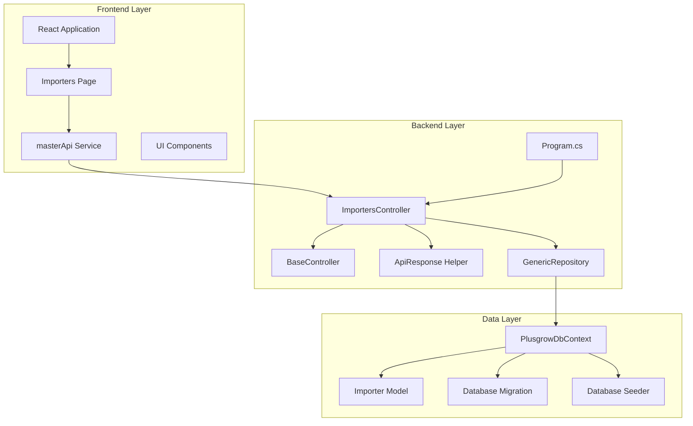
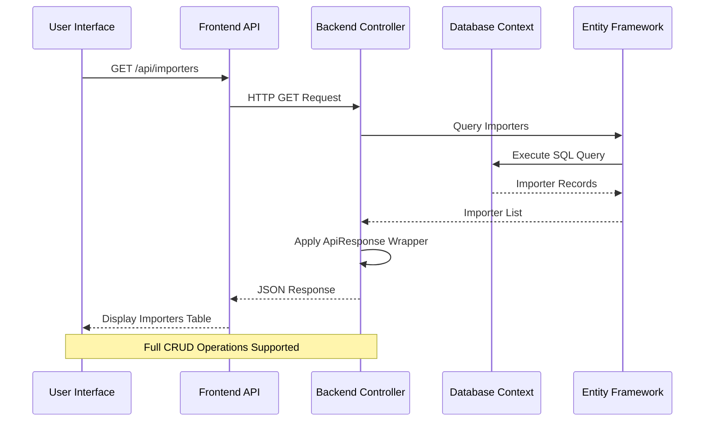
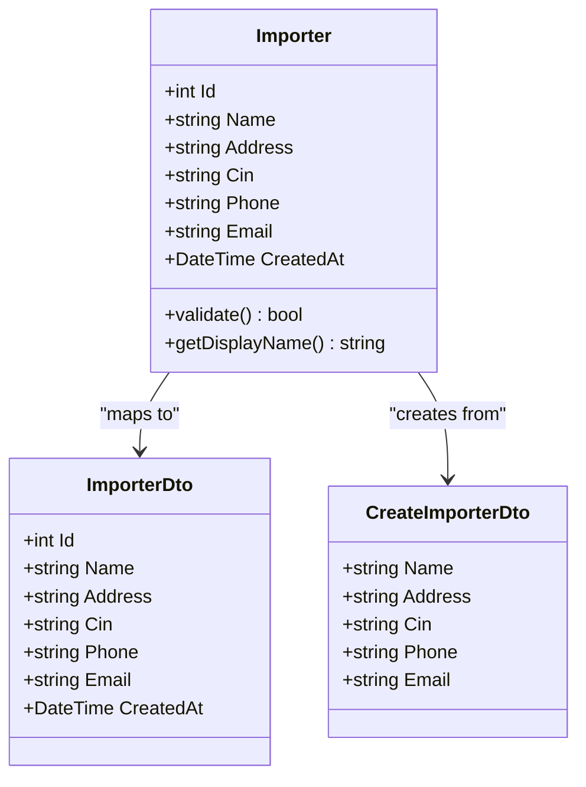
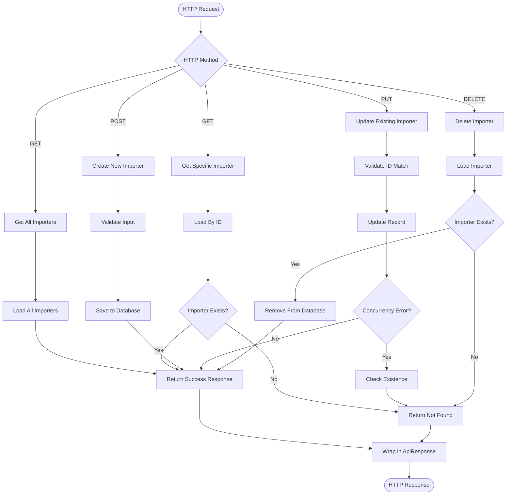
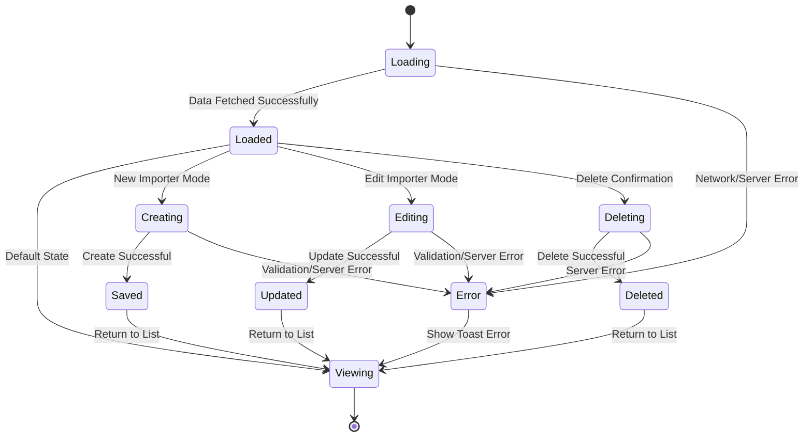
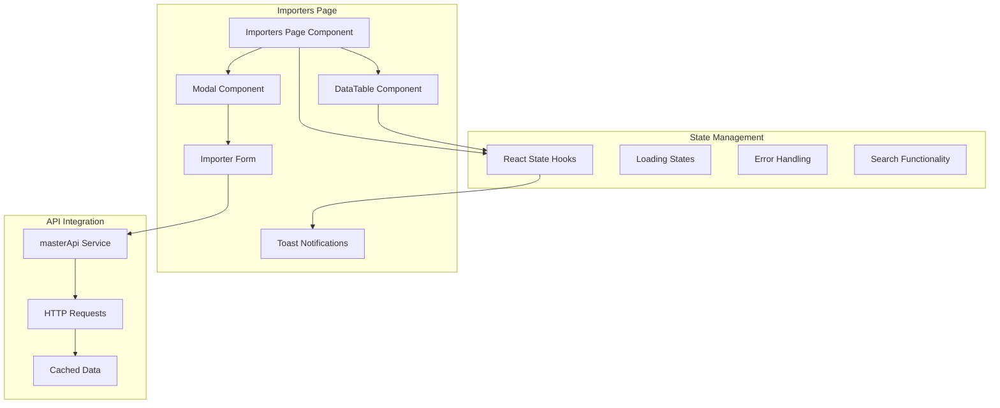
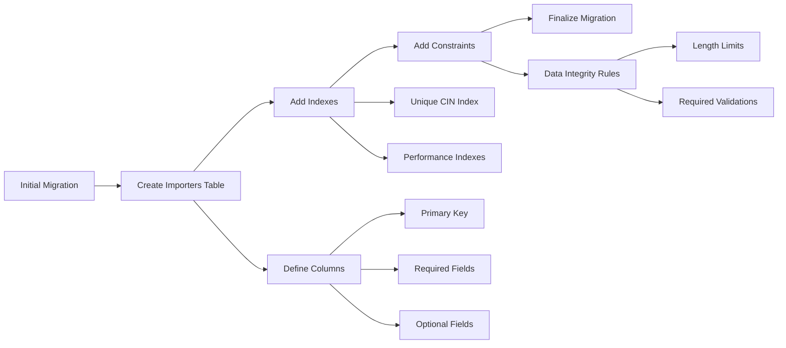

# Importers Master Data

<cite>
**Referenced Files in This Document**
- [Importer.cs](file://Backend/PlusgrowWms.Api/Models/Importer.cs)
- [ImportersController.cs](file://Backend/PlusgrowWms.Api/Controllers/ImportersController.cs)
- [Importers.tsx](file://Frontend/src/pages/Importers.tsx)
- [PlusgrowDbContext.cs](file://Backend/PlusgrowWms.Api/Data/PlusgrowDbContext.cs)
- [CommonDto.cs](file://Backend/PlusgrowWms.Api/DTOs/CommonDto.cs)
- [masterApi.ts](file://Frontend/src/services/masterApi.ts)
- [BaseController.cs](file://Backend/PlusgrowWms.Api/Controllers/BaseController.cs)
- [ApiResponse.cs](file://Backend/PlusgrowWms.Api/Helpers/ApiResponse.cs)
- [GenericRepository.cs](file://Backend/PlusgrowWms.Api/Repositories/GenericRepository.cs)
- [Program.cs](file://Backend/PlusgrowWms.Api/Program.cs)
- [App.tsx](file://Frontend/src/App.tsx)
- [Sidebar.tsx](file://Frontend/src/components/organisms/Navigation/Sidebar/Sidebar.tsx)
- [20260327081425_InitialCreate.cs](file://Backend/PlusgrowWms.Api/Migrations/20260327081425_InitialCreate.cs)
- [DatabaseSeeder.cs](file://Backend/PlusgrowWms.Api/Services/DatabaseSeeder.cs)
</cite>

## Table of Contents
1. [Introduction](#introduction)
2. [Project Structure](#project-structure)
3. [Core Components](#core-components)
4. [Architecture Overview](#architecture-overview)
5. [Detailed Component Analysis](#detailed-component-analysis)
6. [API Endpoints](#api-endpoints)
7. [Data Model](#data-model)
8. [Frontend Implementation](#frontend-implementation)
9. [Database Schema](#database-schema)
10. [Performance Considerations](#performance-considerations)
11. [Troubleshooting Guide](#troubleshooting-guide)
12. [Conclusion](#conclusion)

## Introduction

The Importers Master Data module is a critical component of the Plusgrow WMS (Warehouse Management System) that manages supplier/importer information within the supply chain. This module enables organizations to maintain comprehensive records of their importers, including company details, contact information, and regulatory identifiers. The system provides full CRUD (Create, Read, Update, Delete) operations for importer management, ensuring efficient supplier relationship management and seamless integration with inventory and procurement processes.

The importers functionality serves as a foundational element for the broader Master Data management system, which includes manufacturers, commodities, and products. This module follows enterprise-grade development practices with proper separation of concerns, data validation, and consistent API response formatting.

## Project Structure

The Importers functionality is structured across three main layers: Frontend React application, Backend ASP.NET Core API, and Database layer with Entity Framework Core.



**Diagram sources**
- [Program.cs:1-115](file://Backend/PlusgrowWms.Api/Program.cs#L1-L115)
- [ImportersController.cs:1-81](file://Backend/PlusgrowWms.Api/Controllers/ImportersController.cs#L1-L81)
- [PlusgrowDbContext.cs:1-92](file://Backend/PlusgrowWms.Api/Data/PlusgrowDbContext.cs#L1-L92)

**Section sources**
- [Program.cs:1-115](file://Backend/PlusgrowWms.Api/Program.cs#L1-L115)
- [App.tsx:1-184](file://Frontend/src/App.tsx#L1-L184)

## Core Components

The Importers module consists of several interconnected components working together to provide comprehensive supplier management functionality:

### Backend Components

**Model Layer**: The Importer model defines the data structure with validation attributes for data integrity and consistency.

**Controller Layer**: The ImportersController handles HTTP requests and implements CRUD operations with proper error handling and response formatting.

**Repository Layer**: The GenericRepository provides reusable data access patterns supporting all CRUD operations with Entity Framework Core.

**Service Layer**: The API service layer manages business logic and data transformations between frontend and backend.

### Frontend Components

**Page Component**: The Importers.tsx page provides the user interface with data table visualization, modal forms, and interactive controls.

**API Service**: The masterApi service handles HTTP communication with the backend API endpoints.

**UI Components**: Reusable components including DataTable, Modal, and form elements for consistent user experience.

**Navigation Integration**: Seamless integration with the main navigation system for easy access to importer management.

**Section sources**
- [Importer.cs:1-36](file://Backend/PlusgrowWms.Api/Models/Importer.cs#L1-L36)
- [ImportersController.cs:1-81](file://Backend/PlusgrowWms.Api/Controllers/ImportersController.cs#L1-L81)
- [GenericRepository.cs:1-117](file://Backend/PlusgrowWms.Api/Repositories/GenericRepository.cs#L1-L117)
- [Importers.tsx:1-313](file://Frontend/src/pages/Importers.tsx#L1-L313)

## Architecture Overview

The Importers module follows a clean architecture pattern with clear separation of concerns and dependency inversion principles.



**Diagram sources**
- [ImportersController.cs:20-42](file://Backend/PlusgrowWms.Api/Controllers/ImportersController.cs#L20-L42)
- [masterApi.ts:142-166](file://Frontend/src/services/masterApi.ts#L142-L166)

The architecture ensures loose coupling between components while maintaining high cohesion within each layer. The use of dependency injection promotes testability and maintainability.

**Section sources**
- [BaseController.cs:1-69](file://Backend/PlusgrowWms.Api/Controllers/BaseController.cs#L1-L69)
- [ApiResponse.cs:1-159](file://Backend/PlusgrowWms.Api/Helpers/ApiResponse.cs#L1-L159)

## Detailed Component Analysis

### Importer Model Analysis

The Importer model serves as the foundation for all importer-related operations, defining the complete data structure and validation rules.



**Diagram sources**
- [Importer.cs:6-35](file://Backend/PlusgrowWms.Api/Models/Importer.cs#L6-L35)
- [CommonDto.cs:3-21](file://Backend/PlusgrowWms.Api/DTOs/CommonDto.cs#L3-L21)

The model implements several validation constraints:
- Required name field with 255-character limit
- Optional address field with unlimited length
- CIN number validation with 50-character limit
- Phone number validation with 20-character limit
- Email validation with 100-character limit
- Automatic timestamp generation for creation date

**Section sources**
- [Importer.cs:1-36](file://Backend/PlusgrowWms.Api/Models/Importer.cs#L1-L36)
- [CommonDto.cs:1-47](file://Backend/PlusgrowWms.Api/DTOs/CommonDto.cs#L1-L47)

### ImportersController Implementation

The ImportersController provides comprehensive CRUD operations with proper error handling and response formatting.



**Diagram sources**
- [ImportersController.cs:20-79](file://Backend/PlusgrowWms.Api/Controllers/ImportersController.cs#L20-L79)

The controller implements several key features:
- Consistent API response formatting using ApiResponse wrapper
- Proper error handling for various scenarios
- Concurrency control for update operations
- Input validation and sanitization
- Resource existence checking

**Section sources**
- [ImportersController.cs:1-81](file://Backend/PlusgrowWms.Api/Controllers/ImportersController.cs#L1-L81)
- [BaseController.cs:16-67](file://Backend/PlusgrowWms.Api/Controllers/BaseController.cs#L16-L67)

### Frontend Implementation Details

The frontend implementation provides a comprehensive user interface for importer management with modern React patterns and state management.



**Diagram sources**
- [Importers.tsx:12-313](file://Frontend/src/pages/Importers.tsx#L12-L313)

The frontend implementation includes:
- Real-time data loading with loading states
- Form validation with user feedback
- Modal-based CRUD operations
- Search and filtering capabilities
- Responsive design for all device sizes
- Toast notifications for user feedback

**Section sources**
- [Importers.tsx:1-313](file://Frontend/src/pages/Importers.tsx#L1-L313)
- [masterApi.ts:142-166](file://Frontend/src/services/masterApi.ts#L142-L166)

## API Endpoints

The Importers module exposes a RESTful API with comprehensive endpoint coverage for all CRUD operations.

| HTTP Method | Endpoint | Description | Request Body | Response |
|-------------|----------|-------------|--------------|----------|
| GET | `/api/importers` | Retrieve all importers | None | Array of Importer objects |
| GET | `/api/importers/{id}` | Retrieve specific importer | None | Importer object |
| POST | `/api/importers` | Create new importer | CreateImporterDto | Importer object |
| PUT | `/api/importers/{id}` | Update existing importer | Importer object | Importer object |
| DELETE | `/api/importers/{id}` | Delete importer | None | Success message |

### Response Format

All API responses follow a consistent format using the ApiResponse wrapper:

```json
{
  "success": true,
  "message": "Importer created successfully",
  "data": {
    "id": 1,
    "name": "ABC Imports Ltd.",
    "address": "123 Business District",
    "cin": "U74999KA2013PTC000001",
    "phone": "+91-9876543210",
    "email": "info@abcimports.com",
    "created_at": "2024-01-15T10:30:00Z"
  },
  "timestamp": "2024-01-15T10:30:00Z"
}
```

**Section sources**
- [ImportersController.cs:20-79](file://Backend/PlusgrowWms.Api/Controllers/ImportersController.cs#L20-L79)
- [ApiResponse.cs:8-97](file://Backend/PlusgrowWms.Api/Helpers/ApiResponse.cs#L8-L97)

## Data Model

The Importer data model defines the complete structure for supplier information management.

### Database Schema

```mermaid
erDiagram
IMPORTERS {
integer id PK
varchar name
text address
varchar cin
varchar phone
varchar email
timestamp created_at
}
IMPORTERS ||--o{ PRODUCTS : imports
IMPORTERS ||--o{ ROLE_PAGE_ACCESS : grants_access_to
INDEXES {
unique cin
created_at timestamp_index
}
}
```

**Diagram sources**
- [20260327081425_InitialCreate.cs:29-44](file://Backend/PlusgrowWms.Api/Migrations/20260327081425_InitialCreate.cs#L29-L44)
- [PlusgrowDbContext.cs:85-87](file://Backend/PlusgrowWms.Api/Data/PlusgrowDbContext.cs#L85-L87)

### Field Specifications

| Field | Type | Constraints | Description |
|-------|------|-------------|-------------|
| `id` | Integer | Primary Key, Auto-increment | Unique identifier for importer |
| `name` | String | Required, Max 255 chars | Company/organization name |
| `address` | Text | Nullable | Complete business address |
| `cin` | String | Max 50 chars | Corporate Identity Number |
| `phone` | String | Max 20 chars | Contact phone number |
| `email` | String | Max 100 chars | Official email address |
| `created_at` | DateTime | Required, Default now | Record creation timestamp |

**Section sources**
- [Importer.cs:6-35](file://Backend/PlusgrowWms.Api/Models/Importer.cs#L6-L35)
- [20260327081425_InitialCreate.cs:34-39](file://Backend/PlusgrowWms.Api/Migrations/20260327081425_InitialCreate.cs#L34-L39)

## Frontend Implementation

The frontend implementation leverages modern React patterns with TypeScript for type safety and enhanced developer experience.

### Component Architecture



**Diagram sources**
- [Importers.tsx:12-313](file://Frontend/src/pages/Importers.tsx#L12-L313)
- [masterApi.ts:142-166](file://Frontend/src/services/masterApi.ts#L142-L166)

### Key Features

**Responsive Design**: The interface adapts seamlessly to different screen sizes and devices, ensuring accessibility across desktop, tablet, and mobile platforms.

**Real-time Updates**: Changes made through the interface are reflected immediately in the data table, providing instant feedback to users.

**Advanced Filtering**: Users can filter importers by name, CIN number, phone, or email using the integrated search functionality.

**Bulk Operations**: The interface supports single-item operations with confirmation dialogs for destructive actions like deletion.

**Accessibility**: Full keyboard navigation support and screen reader compatibility ensure inclusive access for all users.

**Section sources**
- [Importers.tsx:186-313](file://Frontend/src/pages/Importers.tsx#L186-L313)
- [Sidebar.tsx:68-72](file://Frontend/src/components/organisms/Navigation/Sidebar/Sidebar.tsx#L68-L72)

## Database Schema

The database schema for the Importers module is designed for optimal performance and data integrity.

### Migration Analysis

The initial database migration establishes the complete schema for importer management:



**Diagram sources**
- [20260327081425_InitialCreate.cs:13-232](file://Backend/PlusgrowWms.Api/Migrations/20260327081425_InitialCreate.cs#L13-L232)

### Performance Optimizations

The database schema includes several performance optimizations:

**Index Strategy**:
- Unique index on CIN field for fast lookup and uniqueness enforcement
- Composite indexes for frequently queried combinations
- Timestamp indexes for efficient sorting and filtering

**Data Type Selection**:
- Appropriate data types for each field to minimize storage and maximize performance
- Character varying with specific length limits for validation at database level
- Timestamp with timezone support for global deployments

**Constraint Enforcement**:
- Foreign key constraints for referential integrity
- Unique constraints for business rules enforcement
- Check constraints for data validation

**Section sources**
- [20260327081425_InitialCreate.cs:163-231](file://Backend/PlusgrowWms.Api/Migrations/20260327081425_InitialCreate.cs#L163-L231)
- [PlusgrowDbContext.cs:85-87](file://Backend/PlusgrowWms.Api/Data/PlusgrowDbContext.cs#L85-L87)

## Performance Considerations

The Importers module is designed with performance optimization as a primary concern, implementing several strategies for efficient operation at scale.

### Database Performance

**Index Optimization**: The database schema includes strategically placed indexes to optimize common query patterns:
- Unique CIN index for supplier identification
- Composite indexes for search operations
- Timestamp indexes for chronological queries

**Connection Pooling**: Entity Framework Core connection pooling minimizes database connection overhead and improves throughput under load.

**Query Optimization**: The GenericRepository pattern ensures efficient query execution with proper includes and projections to avoid N+1 query problems.

### Frontend Performance

**Lazy Loading**: The React application uses code-splitting to load the Importers page only when needed, reducing initial bundle size.

**State Management**: Efficient React state management prevents unnecessary re-renders and maintains smooth user experience.

**API Caching**: The frontend implements intelligent caching strategies to reduce server requests and improve response times.

### Backend Performance

**Response Compression**: The API supports gzip compression for reduced payload sizes and faster network transmission.

**Asynchronous Processing**: All database operations use async/await patterns to prevent blocking and maintain responsiveness.

**Memory Management**: Proper disposal of database contexts and resources prevents memory leaks and ensures long-term stability.

## Troubleshooting Guide

Common issues and their solutions for the Importers module:

### Database Connection Issues

**Problem**: Unable to connect to PostgreSQL database
**Solution**: 
- Verify connection string in configuration files
- Ensure PostgreSQL service is running
- Check firewall settings and network connectivity
- Validate database credentials and permissions

**Problem**: Migration failures during startup
**Solution**:
- Check database connectivity and authentication
- Verify PostgreSQL version compatibility
- Review migration script for syntax errors
- Ensure database user has sufficient privileges

### API Response Issues

**Problem**: HTTP 500 errors from Importers API
**Solution**:
- Check server logs for detailed error messages
- Verify database connectivity and availability
- Review controller action logs for exceptions
- Validate input data format and constraints

**Problem**: CORS errors in browser console
**Solution**:
- Verify CORS policy configuration allows frontend origin
- Check frontend API base URL configuration
- Ensure HTTPS protocol matches between frontend and backend
- Validate API endpoint URLs and routing

### Frontend Issues

**Problem**: Importers table not displaying data
**Solution**:
- Verify API endpoint connectivity
- Check authentication token validity
- Review network tab for failed requests
- Ensure proper error handling and user feedback

**Problem**: Form validation not working
**Solution**:
- Check React DevTools for component rendering issues
- Verify form state management
- Review validation logic and error messages
- Ensure proper event handling for form inputs

### Performance Issues

**Problem**: Slow loading times for importer data
**Solution**:
- Implement pagination for large datasets
- Optimize database queries and indexes
- Enable response compression
- Consider implementing caching strategies

**Problem**: Memory leaks in browser
**Solution**:
- Check for proper cleanup of event listeners
- Verify React component unmounting
- Monitor memory usage with browser dev tools
- Implement proper resource disposal

**Section sources**
- [Program.cs:76-84](file://Backend/PlusgrowWms.Api/Program.cs#L76-L84)
- [ImportersController.cs:52-61](file://Backend/PlusgrowWms.Api/Controllers/ImportersController.cs#L52-L61)

## Conclusion

The Importers Master Data module represents a comprehensive solution for supplier management within the Plusgrow WMS ecosystem. The implementation demonstrates enterprise-grade development practices with clear architectural boundaries, robust error handling, and user-centric design principles.

Key achievements of this module include:

**Technical Excellence**: Clean architecture implementation with proper separation of concerns, dependency injection, and reusable components.

**User Experience**: Intuitive interface with responsive design, real-time updates, and comprehensive functionality for all importer management needs.

**Data Integrity**: Comprehensive validation, constraint enforcement, and audit trails ensure reliable and trustworthy data management.

**Scalability**: Optimized database schema, efficient API design, and performance-conscious implementation support growth and increased usage.

**Maintainability**: Well-structured codebase with clear documentation, consistent patterns, and modular design facilitates future enhancements and maintenance.

The Importers module serves as a solid foundation for the broader Master Data system and provides valuable insights into building scalable, maintainable, and user-friendly enterprise applications. Its implementation can serve as a reference pattern for similar master data management systems and demonstrates best practices in modern web application development.