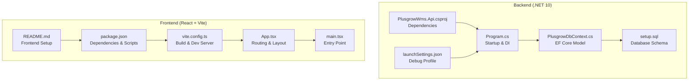

# Getting Started

<cite>
**Referenced Files in This Document**
- [Program.cs](file://Backend/PlusgrowWms.Api/Program.cs)
- [PlusgrowWms.Api.csproj](file://Backend/PlusgrowWms.Api/PlusgrowWms.Api.csproj)
- [PlusgrowDbContext.cs](file://Backend/PlusgrowWms.Api/Data/PlusgrowDbContext.cs)
- [setup.sql](file://Backend/setup.sql)
- [launchSettings.json](file://Backend/PlusgrowWms.Api/Properties/launchSettings.json)
- [package.json](file://Frontend/package.json)
- [vite.config.ts](file://Frontend/vite.config.ts)
- [App.tsx](file://Frontend/src/App.tsx)
- [main.tsx](file://Frontend/src/main.tsx)
- [README.md](file://Frontend/README.md)
</cite>

## Table of Contents
1. [Introduction](#introduction)
2. [Project Structure](#project-structure)
3. [Prerequisites](#prerequisites)
4. [Installation](#installation)
5. [Environment Setup](#environment-setup)
6. [First-Time Setup](#first-time-setup)
7. [Application Startup](#application-startup)
8. [Basic Usage](#basic-usage)
9. [Troubleshooting](#troubleshooting)
10. [Verification Checklist](#verification-checklist)
11. [Conclusion](#conclusion)

## Introduction
PlusGrow WMS is a modern warehouse management system built with a .NET 10 backend and a React + Vite frontend. The backend provides a REST API with JWT authentication, PostgreSQL persistence, and Swagger documentation. The frontend offers a responsive dashboard with navigation for core WMS operations including inbound/outbound flows, stock checks, and product management.

## Project Structure
The repository is organized into two primary areas:
- Backend: ASP.NET Core web API with Entity Framework Core, PostgreSQL, JWT authentication, and Swagger
- Frontend: React application using Vite, React Router, TanStack Query for data fetching, and Tailwind CSS for styling

**Diagram sources**
- [Program.cs:1-107](file://Backend/PlusgrowWms.Api/Program.cs#L1-L107)
- [PlusgrowWms.Api.csproj:1-29](file://Backend/PlusgrowWms.Api/PlusgrowWms.Api.csproj#L1-L29)
- [PlusgrowDbContext.cs:1-78](file://Backend/PlusgrowWms.Api/Data/PlusgrowDbContext.cs#L1-L78)
- [setup.sql:1-215](file://Backend/setup.sql#L1-L215)
- [launchSettings.json:1-15](file://Backend/PlusgrowWms.Api/Properties/launchSettings.json#L1-L15)
- [package.json:1-59](file://Frontend/package.json#L1-L59)
- [vite.config.ts:1-25](file://Frontend/vite.config.ts#L1-L25)
- [App.tsx:1-119](file://Frontend/src/App.tsx#L1-L119)
- [main.tsx:1-11](file://Frontend/src/main.tsx#L1-L11)
- [README.md:1-21](file://Frontend/README.md#L1-L21)

**Section sources**
- [Program.cs:1-107](file://Backend/PlusgrowWms.Api/Program.cs#L1-L107)
- [PlusgrowWms.Api.csproj:1-29](file://Backend/PlusgrowWms.Api/PlusgrowWms.Api.csproj#L1-L29)
- [PlusgrowDbContext.cs:1-78](file://Backend/PlusgrowWms.Api/Data/PlusgrowDbContext.cs#L1-L78)
- [setup.sql:1-215](file://Backend/setup.sql#L1-L215)
- [launchSettings.json:1-15](file://Backend/PlusgrowWms.Api/Properties/launchSettings.json#L1-L15)
- [package.json:1-59](file://Frontend/package.json#L1-L59)
- [vite.config.ts:1-25](file://Frontend/vite.config.ts#L1-L25)
- [App.tsx:1-119](file://Frontend/src/App.tsx#L1-L119)
- [main.tsx:1-11](file://Frontend/src/main.tsx#L1-L11)
- [README.md:1-21](file://Frontend/README.md#L1-L21)

## Prerequisites
Before installing PlusGrow WMS, ensure your development environment meets the following requirements:

- .NET 10 SDK
  - Used by the backend API project for compilation and runtime
  - Reference: [TargetFramework net10.0](file://Backend/PlusgrowWms.Api/PlusgrowWms.Api.csproj#L4)

- Node.js and npm
  - Required for frontend development server and build scripts
  - Reference: [Frontend scripts and dependencies:6-12](file://Frontend/package.json#L6-L12)

- PostgreSQL
  - Database engine for persistent storage
  - EF Core configuration and migrations are supported
  - References:
    - [PostgreSQL provider usage](file://Backend/PlusgrowWms.Api/PlusgrowWms.Api.csproj#L21)
    - [DbContext model configuration:1-78](file://Backend/PlusgrowWms.Api/Data/PlusgrowDbContext.cs#L1-L78)
    - [Database schema script:1-215](file://Backend/setup.sql#L1-L215)

- Development Tools
  - IDE with C#/.NET support for backend
  - IDE with JavaScript/TypeScript support for frontend
  - Postman or similar for API testing
  - pgAdmin or psql for database administration

**Section sources**
- [PlusgrowWms.Api.csproj](file://Backend/PlusgrowWms.Api/PlusgrowWms.Api.csproj#L4)
- [package.json:6-12](file://Frontend/package.json#L6-L12)
- [PlusgrowWms.Api.csproj](file://Backend/PlusgrowWms.Api/PlusgrowWms.Api.csproj#L21)
- [PlusgrowDbContext.cs:1-78](file://Backend/PlusgrowWms.Api/Data/PlusgrowDbContext.cs#L1-L78)
- [setup.sql:1-215](file://Backend/setup.sql#L1-L215)

## Installation
Follow these step-by-step instructions to install both backend and frontend components:

### Backend Installation
1. Open a terminal in the backend directory
   - Path: Backend/PlusgrowWms.Api

2. Restore NuGet packages
   - Command: dotnet restore

3. Build the project
   - Command: dotnet build

4. Apply database migrations
   - Command: dotnet ef database update
   - Notes:
     - Ensure Entity Framework tools are installed globally or use the package reference
     - The project references EF tools for design-time support
     - Reference: [EF tools package reference:16-19](file://Backend/PlusgrowWms.Api/PlusgrowWms.Api.csproj#L16-L19)

5. Verify the development profile
   - Launch settings configure HTTP on localhost with Development environment
   - Reference: [Launch settings:4-12](file://Backend/PlusgrowWms.Api/Properties/launchSettings.json#L4-L12)

### Frontend Installation
1. Open a terminal in the frontend directory
   - Path: Frontend

2. Install dependencies
   - Command: npm install
   - Reference: [Install script](file://Frontend/package.json#L16)

3. Configure environment variables
   - Create .env.local in the frontend root
   - Set GEMINI_API_KEY to your Gemini API key
   - Reference: [Frontend README instructions](file://Frontend/README.md#L18)

4. Start the development server
   - Command: npm run dev
   - The frontend runs on http://localhost:3000
   - Reference: [Dev script](file://Frontend/package.json#L7)

**Section sources**
- [PlusgrowWms.Api.csproj:16-19](file://Backend/PlusgrowWms.Api/PlusgrowWms.Api.csproj#L16-L19)
- [launchSettings.json:4-12](file://Backend/PlusgrowWms.Api/Properties/launchSettings.json#L4-L12)
- [package.json:6-12](file://Frontend/package.json#L6-L12)
- [README.md](file://Frontend/README.md#L18)

## Environment Setup
Configure environment-specific settings for both backend and frontend:

### Backend Environment Variables
- Connection String
  - Key: DefaultConnection
  - Purpose: PostgreSQL connection string for PlusgrowDbContext
  - Reference: [DbContext registration:26-27](file://Backend/PlusgrowWms.Api/Program.cs#L26-L27)

- JWT Settings
  - Keys: Jwt:Key, Jwt:Issuer, Jwt:Audience
  - Defaults are embedded if keys are missing
  - Reference: [JWT configuration:44-62](file://Backend/PlusgrowWms.Api/Program.cs#L44-L62)

- Logging
  - Serilog console logging is enabled
  - Reference: [Serilog setup:16-18](file://Backend/PlusgrowWms.Api/Program.cs#L16-L18)

### Frontend Environment Variables
- GEMINI_API_KEY
  - Location: .env.local in frontend root
  - Purpose: Enables AI features in the frontend
  - Reference: [Vite config usage](file://Frontend/vite.config.ts#L11)

- Port Configuration
  - Frontend runs on port 3000
  - Reference: [Dev script](file://Frontend/package.json#L7)

**Section sources**
- [Program.cs:26-27](file://Backend/PlusgrowWms.Api/Program.cs#L26-L27)
- [Program.cs:44-62](file://Backend/PlusgrowWms.Api/Program.cs#L44-L62)
- [Program.cs:16-18](file://Backend/PlusgrowWms.Api/Program.cs#L16-L18)
- [vite.config.ts](file://Frontend/vite.config.ts#L11)
- [package.json](file://Frontend/package.json#L7)

## First-Time Setup
Complete these essential steps for a fresh installation:

### Database Initialization
1. Create PostgreSQL database
   - Use the provided SQL script to set up schema and seed data
   - Reference: [Schema and seed script:1-215](file://Backend/setup.sql#L1-L215)

2. Configure connection string
   - Set DefaultConnection in backend environment
   - Example pattern: Host=localhost;Database=plusgrow_db;Username=your_user;Password=your_password
   - Reference: [Connection string usage:26-27](file://Backend/PlusgrowWms.Api/Program.cs#L26-L27)

3. Run migrations
   - Apply EF Core migrations to create tables
   - Reference: [Migration command note:16-19](file://Backend/PlusgrowWms.Api/PlusgrowWms.Api.csproj#L16-L19)

### Initial Data
- The setup script seeds:
  - Roles (Admin, Manager, Operator, Viewer)
  - Default admin user (credentials provided in script)
  - Sample manufacturers, commodities, and products
  - Role-page access permissions
  - Reference: [Seed data:110-201](file://Backend/setup.sql#L110-L201)

### CORS Configuration
- Frontend origin is configured for local development
- Origin: http://localhost:3000
- Reference: [CORS policy:75-83](file://Backend/PlusgrowWms.Api/Program.cs#L75-L83)

**Section sources**
- [setup.sql:1-215](file://Backend/setup.sql#L1-L215)
- [Program.cs:26-27](file://Backend/PlusgrowWms.Api/Program.cs#L26-L27)
- [PlusgrowWms.Api.csproj:16-19](file://Backend/PlusgrowWms.Api/PlusgrowWms.Api.csproj#L16-L19)
- [setup.sql:110-201](file://Backend/setup.sql#L110-L201)
- [Program.cs:75-83](file://Backend/PlusgrowWms.Api/Program.cs#L75-L83)

## Application Startup
Start both backend and frontend services:

### Backend Startup
1. Navigate to Backend/PlusgrowWms.Api
2. Run: dotnet run
3. Access Swagger UI at: https://localhost:5179/swagger (HTTP profile shown in launch settings)
4. Reference: [Program entry point:88-106](file://Backend/PlusgrowWms.Api/Program.cs#L88-L106)

### Frontend Startup
1. Navigate to Frontend
2. Run: npm run dev
3. Access the dashboard at: http://localhost:3000
4. Reference: [Dev script](file://Frontend/package.json#L7)

### API Testing
- Use Swagger UI to explore endpoints
- Test authentication with JWT bearer tokens
- Reference: [Swagger configuration:70-72](file://Backend/PlusgrowWms.Api/Program.cs#L70-L72)

**Section sources**
- [Program.cs:88-106](file://Backend/PlusgrowWms.Api/Program.cs#L88-L106)
- [package.json](file://Frontend/package.json#L7)
- [Program.cs:70-72](file://Backend/PlusgrowWms.Api/Program.cs#L70-L72)

## Basic Usage
Navigate the PlusGrow WMS interface and perform common operations:

### Dashboard Access
- Login with default admin credentials (from seed script)
- Access the main dashboard after successful authentication
- Reference: [Routing configuration:46-51](file://Frontend/src/App.tsx#L46-L51)

### Core Workflows
- Inward: Record incoming goods and create purchase orders
- Receiving: Verify and receive items against POs
- Put Away: Move received items to designated storage locations
- Outward: Process outbound shipments and dispatch
- Stock Check: Conduct inventory counts and adjustments
- Stock Movement: Transfer items between locations
- Packing: Prepare items for outbound shipment
- Dispatch: Finalize outbound deliveries
- MCD/MPD: Manage material consumption/distribution
- Warehouse Map: Visualize storage locations and inventory

### Navigation
- Use sidebar navigation to switch between modules
- Lazy-loaded routes improve initial load performance
- Reference: [Route definitions:15-112](file://Frontend/src/App.tsx#L15-L112)

**Section sources**
- [App.tsx:46-51](file://Frontend/src/App.tsx#L46-L51)
- [App.tsx:15-112](file://Frontend/src/App.tsx#L15-L112)

## Troubleshooting
Common setup and runtime issues:

### Backend Issues
- PostgreSQL Connection Failures
  - Verify DefaultConnection string format and credentials
  - Ensure PostgreSQL service is running
  - Reference: [Connection string usage:26-27](file://Backend/PlusgrowWms.Api/Program.cs#L26-L27)

- Migration Errors
  - Ensure Entity Framework tools are installed
  - Check database permissions for schema updates
  - Reference: [EF tools reference:16-19](file://Backend/PlusgrowWms.Api/PlusgrowWms.Api.csproj#L16-L19)

- JWT Validation Problems
  - Confirm Jwt:Key, Jwt:Issuer, and Jwt:Audience are set consistently
  - Reference: [JWT configuration:44-62](file://Backend/PlusgrowWms.Api/Program.cs#L44-L62)

### Frontend Issues
- Port Conflicts
  - Change port in package.json dev script if 3000 is in use
  - Reference: [Dev script](file://Frontend/package.json#L7)

- Missing Environment Variables
  - Ensure .env.local exists with GEMINI_API_KEY
  - Reference: [Vite config usage](file://Frontend/vite.config.ts#L11)

- CORS Errors
  - Verify backend allows http://localhost:3000 origin
  - Reference: [CORS policy:75-83](file://Backend/PlusgrowWms.Api/Program.cs#L75-L83)

### Database Issues
- Schema Not Found
  - Run setup.sql to create tables and indexes
  - Reference: [Setup script:1-215](file://Backend/setup.sql#L1-L215)

- Seed Data Missing
  - Confirm seed inserts executed successfully
  - Reference: [Seed data:110-201](file://Backend/setup.sql#L110-L201)

**Section sources**
- [Program.cs:26-27](file://Backend/PlusgrowWms.Api/Program.cs#L26-L27)
- [PlusgrowWms.Api.csproj:16-19](file://Backend/PlusgrowWms.Api/PlusgrowWms.Api.csproj#L16-L19)
- [Program.cs:44-62](file://Backend/PlusgrowWms.Api/Program.cs#L44-L62)
- [package.json](file://Frontend/package.json#L7)
- [vite.config.ts](file://Frontend/vite.config.ts#L11)
- [Program.cs:75-83](file://Backend/PlusgrowWms.Api/Program.cs#L75-L83)
- [setup.sql:1-215](file://Backend/setup.sql#L1-L215)
- [setup.sql:110-201](file://Backend/setup.sql#L110-L201)

## Verification Checklist
Ensure a successful installation:

### Backend Verification
- [ ] dotnet build succeeds without errors
- [ ] PostgreSQL connection established (DefaultConnection)
- [ ] Database migrations applied successfully
- [ ] Swagger UI accessible at configured endpoint
- [ ] JWT authentication configured and logging active

### Frontend Verification
- [ ] npm install completes successfully
- [ ] .env.local with GEMINI_API_KEY present
- [ ] Vite dev server starts on port 3000
- [ ] Dashboard loads without console errors
- [ ] React Router routes render properly

### End-to-End Verification
- [ ] Login with default admin credentials
- [ ] Access all main navigation modules
- [ ] Perform basic CRUD operations
- [ ] View Swagger documentation
- [ ] Check database records created/updated

**Section sources**
- [PlusgrowWms.Api.csproj:1-29](file://Backend/PlusgrowWms.Api/PlusgrowWms.Api.csproj#L1-L29)
- [Program.cs:26-27](file://Backend/PlusgrowWms.Api/Program.cs#L26-L27)
- [Program.cs:70-72](file://Backend/PlusgrowWms.Api/Program.cs#L70-L72)
- [Program.cs:44-62](file://Backend/PlusgrowWms.Api/Program.cs#L44-L62)
- [package.json:6-12](file://Frontend/package.json#L6-L12)
- [vite.config.ts](file://Frontend/vite.config.ts#L11)
- [App.tsx:46-51](file://Frontend/src/App.tsx#L46-L51)

## Conclusion
You have successfully installed and configured PlusGrow WMS. The backend provides a robust API with JWT authentication and PostgreSQL persistence, while the frontend delivers a responsive dashboard for warehouse operations. Use the verification checklist to confirm your setup and refer to the troubleshooting section for common issues. For further customization, adjust environment variables, extend database models, and add new frontend routes as needed.