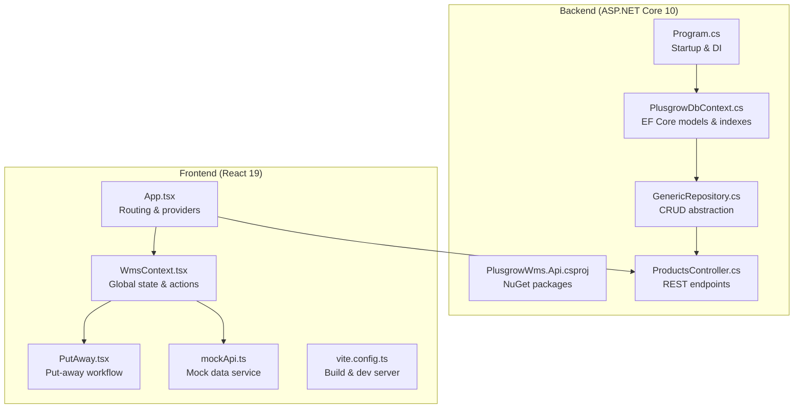
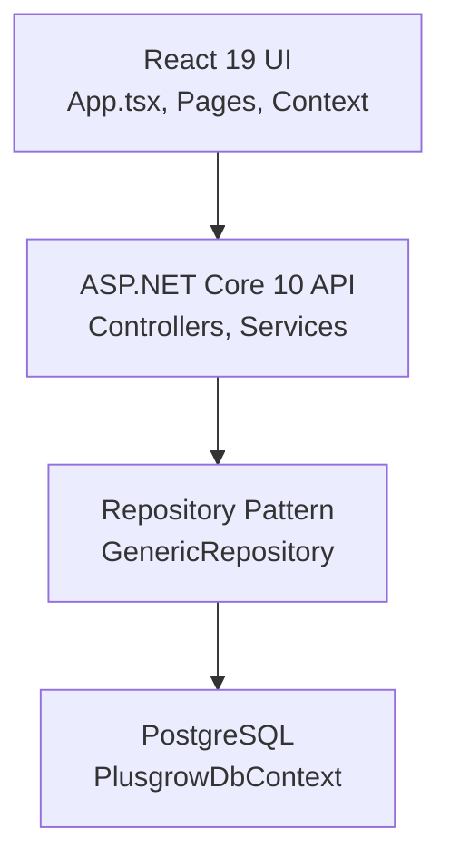
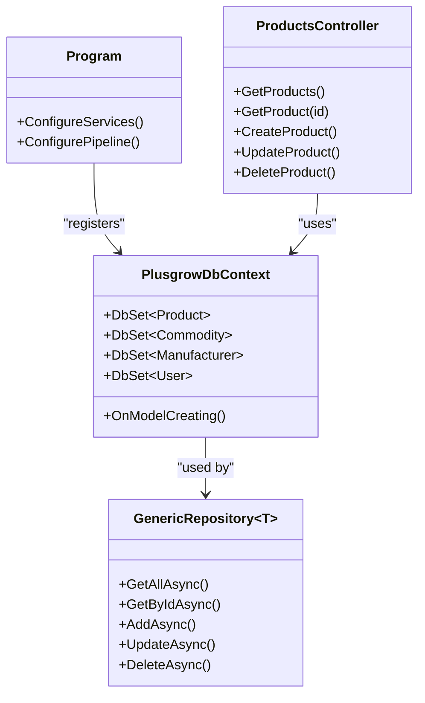
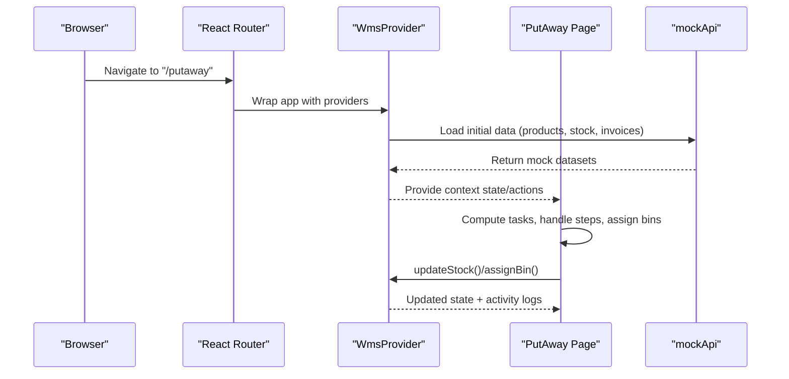
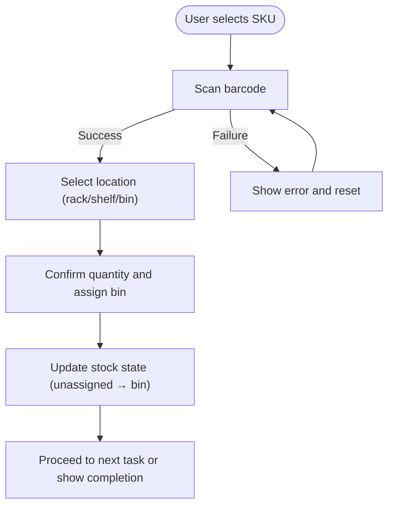
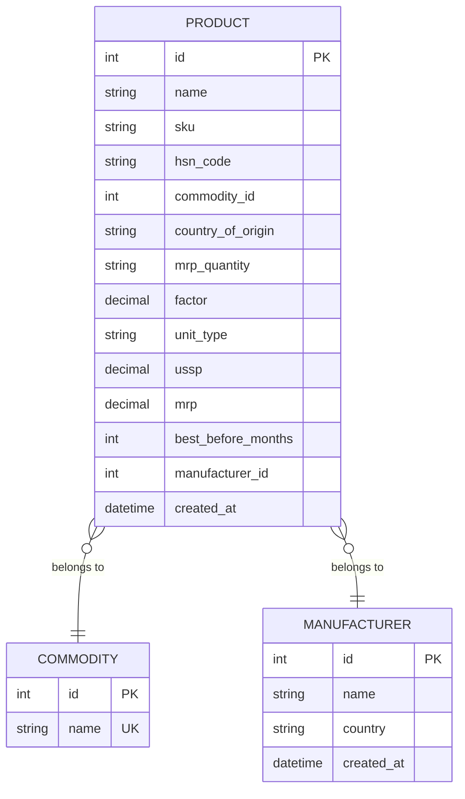
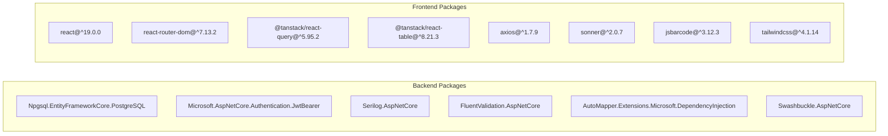

# Project Overview

<cite>
**Referenced Files in This Document**
- [Program.cs](file://Backend/PlusgrowWms.Api/Program.cs)
- [PlusgrowWms.Api.csproj](file://Backend/PlusgrowWms.Api/PlusgrowWms.Api.csproj)
- [ProductsController.cs](file://Backend/PlusgrowWms.Api/Controllers/ProductsController.cs)
- [PlusgrowDbContext.cs](file://Backend/PlusgrowWms.Api/Data/PlusgrowDbContext.cs)
- [GenericRepository.cs](file://Backend/PlusgrowWms.Api/Repositories/GenericRepository.cs)
- [App.tsx](file://Frontend/src/App.tsx)
- [package.json](file://Frontend/package.json)
- [PutAway.tsx](file://Frontend/src/pages/PutAway/PutAway.tsx)
- [WmsContext.tsx](file://Frontend/src/context/WmsContext.tsx)
- [mockApi.ts](file://Frontend/src/services/mockApi.ts)
- [vite.config.ts](file://Frontend/vite.config.ts)
- [Product.cs](file://Backend/PlusgrowWms.Api/Models/Product.cs)
- [api.ts](file://Frontend/src/lib/api/index.ts)
- [api.ts](file://Frontend/src/types/api.ts)
</cite>

## Table of Contents
1. [Introduction](#introduction)
2. [Project Structure](#project-structure)
3. [Core Components](#core-components)
4. [Architecture Overview](#architecture-overview)
5. [Detailed Component Analysis](#detailed-component-analysis)
6. [Dependency Analysis](#dependency-analysis)
7. [Performance Considerations](#performance-considerations)
8. [Troubleshooting Guide](#troubleshooting-guide)
9. [Conclusion](#conclusion)

## Introduction
PlusGrow WMS is a modern warehouse management system designed to streamline logistics and inventory operations for distribution centers and warehouses. The platform focuses on operational excellence through real-time inventory tracking, efficient put-away workflows, stock movement management, and seamless barcode integration. Built with a clean separation between a robust ASP.NET Core 10 backend and a responsive React 19 frontend, PlusGrow WMS delivers a scalable, maintainable, and developer-friendly solution tailored for warehouse environments.

The system targets logistics managers, warehouse supervisors, and operations teams who need reliable tools to manage inbound/outbound flows, optimize storage allocation, and maintain accurate inventory visibility. It supports practical workflows such as receiving goods, assigning storage locations, tracking stock movements, and generating actionable insights through integrated dashboards and reports.

## Project Structure
The repository follows a clear separation of concerns:
- Backend: ASP.NET Core 10 web API with Entity Framework Core, PostgreSQL persistence, JWT authentication, and Swagger documentation.
- Frontend: React 19 application with TypeScript, Vite build tooling, TanStack React Query for data fetching, and a modular component architecture.

**Diagram sources**
- [Program.cs:1-107](file://Backend/PlusgrowWms.Api/Program.cs#L1-L107)
- [PlusgrowWms.Api.csproj:1-29](file://Backend/PlusgrowWms.Api/PlusgrowWms.Api.csproj#L1-L29)
- [PlusgrowDbContext.cs:1-78](file://Backend/PlusgrowWms.Api/Data/PlusgrowDbContext.cs#L1-L78)
- [GenericRepository.cs:1-117](file://Backend/PlusgrowWms.Api/Repositories/GenericRepository.cs#L1-L117)
- [ProductsController.cs:1-86](file://Backend/PlusgrowWms.Api/Controllers/ProductsController.cs#L1-L86)
- [App.tsx:1-119](file://Frontend/src/App.tsx#L1-L119)
- [PutAway.tsx:1-462](file://Frontend/src/pages/PutAway/PutAway.tsx#L1-L462)
- [WmsContext.tsx:1-234](file://Frontend/src/context/WmsContext.tsx#L1-L234)
- [mockApi.ts:1-32](file://Frontend/src/services/mockApi.ts#L1-L32)
- [vite.config.ts:1-25](file://Frontend/vite.config.ts#L1-L25)

**Section sources**
- [Program.cs:1-107](file://Backend/PlusgrowWms.Api/Program.cs#L1-L107)
- [PlusgrowWms.Api.csproj:1-29](file://Backend/PlusgrowWms.Api/PlusgrowWms.Api.csproj#L1-L29)
- [App.tsx:1-119](file://Frontend/src/App.tsx#L1-L119)
- [vite.config.ts:1-25](file://Frontend/vite.config.ts#L1-L25)

## Core Components
- Real-time inventory tracking: The frontend maintains a centralized stock state and updates it in response to warehouse actions (inward receipts, dispatches, and put-away assignments). Activities are logged for auditability.
- Put-away operations: The PutAway workflow guides users through selecting SKUs, scanning barcodes, choosing storage locations, and confirming allocations with immediate visual feedback.
- Stock movement management: The system supports adding and removing stock quantities, moving between unassigned and bin locations, and clearing bins back to unassigned stock.
- Barcode integration: The PutAway page simulates barcode scanning and verification, enabling quick and accurate identification of inventory items during put-away.
- Master data management: REST endpoints expose CRUD operations for products, manufacturers, importers, commodities, roles, and users, backed by a strongly typed model layer and EF Core.

Practical examples:
- Receiving inbound goods: Create a purchase invoice, mark it as completed, and watch stock quantities update in real time.
- Optimizing storage: Assign unassigned inventory to specific racks/shelves/bins to improve picking efficiency.
- Dispatch fulfillment: Create a sales invoice, mark it as dispatched, and observe stock reductions across the warehouse.

**Section sources**
- [WmsContext.tsx:83-194](file://Frontend/src/context/WmsContext.tsx#L83-L194)
- [PutAway.tsx:139-202](file://Frontend/src/pages/PutAway/PutAway.tsx#L139-L202)
- [ProductsController.cs:19-82](file://Backend/PlusgrowWms.Api/Controllers/ProductsController.cs#L19-L82)
- [Product.cs:6-64](file://Backend/PlusgrowWms.Api/Models/Product.cs#L6-L64)

## Architecture Overview
PlusGrow WMS employs a layered architecture separating presentation, business logic, and data access:
- Presentation Layer (React 19): Handles routing, UI composition, state management, and user interactions.
- Application Layer (ASP.NET Core): Provides REST APIs, authentication, validation, and logging.
- Data Access Layer (EF Core + PostgreSQL): Manages entity models, database schema, and repository abstractions.

**Diagram sources**
- [App.tsx:39-118](file://Frontend/src/App.tsx#L39-L118)
- [Program.cs:25-42](file://Backend/PlusgrowWms.Api/Program.cs#L25-L42)
- [GenericRepository.cs:22-116](file://Backend/PlusgrowWms.Api/Repositories/GenericRepository.cs#L22-L116)
- [PlusgrowDbContext.cs:6-18](file://Backend/PlusgrowWms.Api/Data/PlusgrowDbContext.cs#L6-L18)

**Section sources**
- [Program.cs:25-102](file://Backend/PlusgrowWms.Api/Program.cs#L25-L102)
- [PlusgrowDbContext.cs:20-76](file://Backend/PlusgrowWms.Api/Data/PlusgrowDbContext.cs#L20-L76)
- [GenericRepository.cs:7-20](file://Backend/PlusgrowWms.Api/Repositories/GenericRepository.cs#L7-L20)

## Detailed Component Analysis

### Backend Technology Stack and Setup
- ASP.NET Core 10: Minimal hosting model with Serilog logging, JWT Bearer authentication, FluentValidation, AutoMapper, and Swagger/OpenAPI.
- Entity Framework Core: PostgreSQL provider with custom model configuration and unique/performance indexes.
- Dependency Injection: Scoped services for repositories and business services; generic repository pattern for reusable data access.

**Diagram sources**
- [Program.cs:25-102](file://Backend/PlusgrowWms.Api/Program.cs#L25-L102)
- [PlusgrowDbContext.cs:6-76](file://Backend/PlusgrowWms.Api/Data/PlusgrowDbContext.cs#L6-L76)
- [GenericRepository.cs:22-116](file://Backend/PlusgrowWms.Api/Repositories/GenericRepository.cs#L22-L116)
- [ProductsController.cs:10-85](file://Backend/PlusgrowWms.Api/Controllers/ProductsController.cs#L10-85)

**Section sources**
- [Program.cs:16-106](file://Backend/PlusgrowWms.Api/Program.cs#L16-L106)
- [PlusgrowWms.Api.csproj:9-26](file://Backend/PlusgrowWms.Api/PlusgrowWms.Api.csproj#L9-L26)
- [PlusgrowDbContext.cs:20-76](file://Backend/PlusgrowWms.Api/Data/PlusgrowDbContext.cs#L20-L76)
- [GenericRepository.cs:7-116](file://Backend/PlusgrowWms.Api/Repositories/GenericRepository.cs#L7-L116)

### Frontend Technology Stack and Routing
- React 19 with TypeScript: Strongly typed models mirror backend entities and DTOs.
- Vite: Fast development server and optimized builds with Tailwind CSS integration.
- TanStack React Query: Centralized caching, background updates, and optimistic UI patterns.
- Mock API: Standalone service simulating backend responses during development.

**Diagram sources**
- [App.tsx:39-118](file://Frontend/src/App.tsx#L39-L118)
- [WmsContext.tsx:37-71](file://Frontend/src/context/WmsContext.tsx#L37-L71)
- [PutAway.tsx:65-101](file://Frontend/src/pages/PutAway/PutAway.tsx#L65-L101)
- [mockApi.ts:6-31](file://Frontend/src/services/mockApi.ts#L6-L31)

**Section sources**
- [App.tsx:14-118](file://Frontend/src/App.tsx#L14-L118)
- [package.json:13-59](file://Frontend/package.json#L13-L59)
- [vite.config.ts:6-24](file://Frontend/vite.config.ts#L6-L24)
- [WmsContext.tsx:28-224](file://Frontend/src/context/WmsContext.tsx#L28-L224)
- [PutAway.tsx:47-219](file://Frontend/src/pages/PutAway/PutAway.tsx#L47-L219)

### Put-Away Workflow Logic
The PutAway page orchestrates a four-step workflow:
1. Select a task (SKU with pending unassigned quantity).
2. Scan barcode (simulated verification).
3. Choose a storage location (rack/shelf/bin).
4. Confirm assignment with quantity selection and immediate feedback.

**Diagram sources**
- [PutAway.tsx:139-202](file://Frontend/src/pages/PutAway/PutAway.tsx#L139-L202)
- [WmsContext.tsx:160-194](file://Frontend/src/context/WmsContext.tsx#L160-L194)

**Section sources**
- [PutAway.tsx:139-202](file://Frontend/src/pages/PutAway/PutAway.tsx#L139-L202)
- [WmsContext.tsx:160-194](file://Frontend/src/context/WmsContext.tsx#L160-L194)

### Data Model Alignment
The frontend types align with backend models and database column naming conventions, ensuring consistent serialization/deserialization across the API boundary.

**Diagram sources**
- [Product.cs:6-64](file://Backend/PlusgrowWms.Api/Models/Product.cs#L6-L64)
- [api.ts:60-94](file://Frontend/src/types/api.ts#L60-L94)

**Section sources**
- [Product.cs:6-64](file://Backend/PlusgrowWms.Api/Models/Product.cs#L6-L64)
- [api.ts:60-94](file://Frontend/src/types/api.ts#L60-L94)

## Dependency Analysis
- Backend dependencies include EF Core, Npgsql, Serilog, FluentValidation, AutoMapper, JWT Bearer, and Swashbuckle for API documentation.
- Frontend dependencies include React 19, React Router, TanStack React Query/Table, Axios, Sonner for notifications, JSBarcode for barcode rendering, and Tailwind CSS for styling.

**Diagram sources**
- [PlusgrowWms.Api.csproj:9-26](file://Backend/PlusgrowWms.Api/PlusgrowWms.Api.csproj#L9-L26)
- [package.json:13-59](file://Frontend/package.json#L13-L59)

**Section sources**
- [PlusgrowWms.Api.csproj:9-26](file://Backend/PlusgrowWms.Api/PlusgrowWms.Api.csproj#L9-L26)
- [package.json:13-59](file://Frontend/package.json#L13-L59)

## Performance Considerations
- Database indexing: Unique and composite indexes on frequently queried columns (SKU, commodity ID, manufacturer ID, user role, etc.) improve query performance.
- Caching and stale-time: React Query is configured with a moderate stale time to balance freshness and network usage.
- Lazy loading: React Router lazy routes reduce initial bundle size and improve startup performance.
- Build optimization: Vite provides fast HMR and optimized production builds.

[No sources needed since this section provides general guidance]

## Troubleshooting Guide
- Authentication failures: Verify JWT issuer, audience, and signing key configuration in the backend and ensure the frontend sends Authorization headers correctly.
- CORS issues: Confirm the frontend origin is allowed in the backend CORS policy.
- Database connectivity: Ensure the connection string is present and the PostgreSQL service is reachable.
- API documentation: Swagger UI is enabled in development; validate endpoint availability and request/response shapes.
- Frontend data loading: If mock data does not appear, check the mock API delays and console errors for promise rejections.

**Section sources**
- [Program.cs:44-83](file://Backend/PlusgrowWms.Api/Program.cs#L44-L83)
- [Program.cs:87-102](file://Backend/PlusgrowWms.Api/Program.cs#L87-L102)
- [vite.config.ts:18-22](file://Frontend/vite.config.ts#L18-L22)

## Conclusion
PlusGrow WMS delivers a pragmatic, scalable solution for warehouse operations by combining a modern ASP.NET Core 10 backend with a responsive React 19 frontend. Its emphasis on real-time inventory tracking, streamlined put-away workflows, and barcode-assisted operations addresses core warehouse challenges while maintaining developer productivity through clean architecture, strong typing, and reusable patterns. The system is ready for extension to integrate with real backend services and production databases, supporting growth from small distribution centers to enterprise-scale logistics networks.