# Authentication System

<cite>
**Referenced Files in This Document**
- [Program.cs](file://Backend/PlusgrowWms.Api/Program.cs)
- [BaseController.cs](file://Backend/PlusgrowWms.Api/Controllers/BaseController.cs)
- [AuthController.cs](file://Backend/PlusgrowWms.Api/Controllers/AuthController.cs)
- [AuthService.cs](file://Backend/PlusgrowWms.Api/Services/AuthService.cs)
- [ApiResponse.cs](file://Backend/PlusgrowWms.Api/Helpers/ApiResponse.cs)
- [AuthDto.cs](file://Backend/PlusgrowWms.Api/DTOs/AuthDto.cs)
- [UserDto.cs](file://Backend/PlusgrowWms.Api/DTOs/UserDto.cs)
- [UserRepository.cs](file://Backend/PlusgrowWms.Api/Repositories/UserRepository.cs)
- [User.cs](file://Backend/PlusgrowWms.Api/Models/User.cs)
- [Role.cs](file://Backend/PlusgrowWms.Api/Models/Role.cs)
- [AuthContext.tsx](file://Frontend/src/context/AuthContext.tsx)
- [auth.service.ts](file://Frontend/src/lib/api/services/auth.service.ts)
- [client.ts](file://Frontend/src/lib/api/client.ts)
- [api.ts](file://Frontend/src/types/api.ts)
- [auth.ts](file://Frontend/src/types/auth.ts)
- [Login.tsx](file://Frontend/src/pages/Login.tsx)
- [Register.tsx](file://Frontend/src/pages/Register.tsx)
</cite>

## Update Summary
**Changes Made**
- Updated API response formats to use snake_case naming conventions consistently across backend and frontend
- Enhanced AuthContext with improved error handling and better user session management
- Implemented comprehensive API response wrapper using ApiResponse<T> with standardized structure
- Updated frontend types to match backend snake_case response format
- Enhanced authentication state management with improved error communication
- Added comprehensive toast notification system for user feedback
- Improved frontend authentication flows with better error handling and user experience

## Table of Contents
1. [Introduction](#introduction)
2. [Project Structure](#project-structure)
3. [Core Components](#core-components)
4. [Architecture Overview](#architecture-overview)
5. [Detailed Component Analysis](#detailed-component-analysis)
6. [Enhanced Frontend Authentication API](#enhanced-frontend-authentication-api)
7. [Dependency Analysis](#dependency-analysis)
8. [Performance Considerations](#performance-considerations)
9. [Troubleshooting Guide](#troubleshooting-guide)
10. [Conclusion](#conclusion)
11. [Appendices](#appendices)

## Introduction
This document describes the PlusGrow WMS authentication system with enhanced API response formats using snake_case naming conventions. The system implements JWT-based authentication with comprehensive error handling, improved user session management, and standardized API response structures. It covers token generation, validation, refresh mechanisms, login and registration workflows, password hashing and verification, session management strategies, and AuthDto structures for authentication data transfer. The system now features consistent snake_case response formatting, enhanced frontend authentication state management, comprehensive error handling, and improved user experience through toast notifications.

**Updated** Enhanced with improved frontend authentication API, comprehensive error handling, automatic token management, standardized snake_case API response formats, expanded authentication endpoints with better security practices, and enhanced user management capabilities with improved error communication.

## Project Structure
The authentication system spans the backend API and the frontend React application with consistent snake_case response formatting:
- Backend: ASP.NET Core API with JWT authentication, service layer, repository pattern, DTOs, and standardized ApiResponse wrapper
- Frontend: React context managing authentication state with snake_case type definitions and comprehensive error handling

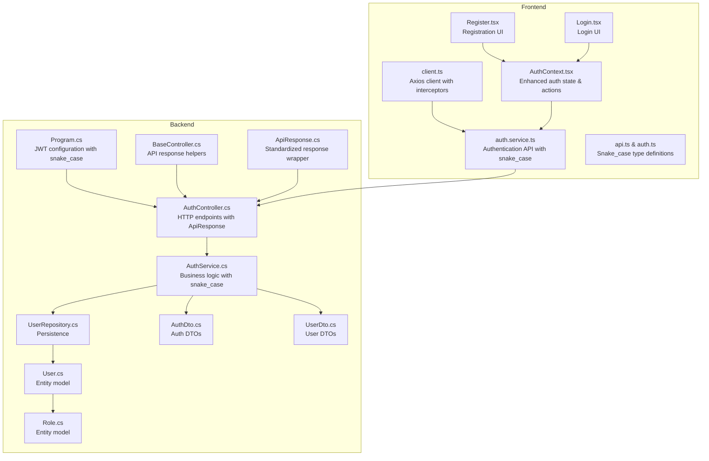

**Diagram sources**
- [Program.cs:45-63](file://Backend/PlusgrowWms.Api/Program.cs#L45-L63)
- [BaseController.cs:16-67](file://Backend/PlusgrowWms.Api/Controllers/BaseController.cs#L16-L67)
- [AuthController.cs:27-158](file://Backend/PlusgrowWms.Api/Controllers/AuthController.cs#L27-L158)
- [ApiResponse.cs:8-97](file://Backend/PlusgrowWms.Api/Helpers/ApiResponse.cs#L8-L97)
- [AuthService.cs:39-234](file://Backend/PlusgrowWms.Api/Services/AuthService.cs#L39-L234)
- [AuthContext.tsx:6-139](file://Frontend/src/context/AuthContext.tsx#L6-L139)
- [auth.service.ts:14-61](file://Frontend/src/lib/api/services/auth.service.ts#L14-L61)
- [client.ts:12-34](file://Frontend/src/lib/api/client.ts#L12-L34)
- [api.ts:4-117](file://Frontend/src/types/api.ts#L4-L117)

**Section sources**
- [Program.cs:45-63](file://Backend/PlusgrowWms.Api/Program.cs#L45-L63)
- [BaseController.cs:16-67](file://Backend/PlusgrowWms.Api/Controllers/BaseController.cs#L16-L67)
- [AuthController.cs:27-158](file://Backend/PlusgrowWms.Api/Controllers/AuthController.cs#L27-L158)
- [ApiResponse.cs:8-97](file://Backend/PlusgrowWms.Api/Helpers/ApiResponse.cs#L8-L97)
- [AuthService.cs:39-234](file://Backend/PlusgrowWms.Api/Services/AuthService.cs#L39-L234)
- [AuthContext.tsx:6-139](file://Frontend/src/context/AuthContext.tsx#L6-L139)
- [auth.service.ts:14-61](file://Frontend/src/lib/api/services/auth.service.ts#L14-L61)
- [client.ts:12-34](file://Frontend/src/lib/api/client.ts#L12-L34)
- [api.ts:4-117](file://Frontend/src/types/api.ts#L4-L117)

## Core Components
- JWT configuration and middleware in Program.cs with snake_case response formatting
- BaseController provides standardized API response methods using ApiResponse<T> wrapper
- AuthController exposes HTTP endpoints with consistent snake_case response structure
- AuthService implements login, registration, password hashing/verification, token generation, and token refresh
- ApiResponse helper creates standardized response objects with success, message, data, errors, and timestamp fields
- DTOs define request/response shapes for authentication and user data with snake_case properties
- Enhanced AuthContext manages authentication state with improved error handling and snake_case type compatibility
- Frontend API service with comprehensive error handling, token management, and automatic authentication interceptors
- Standardized snake_case response format across all authentication endpoints

**Updated** Enhanced with standardized snake_case API response formats, comprehensive error handling, improved authentication state management, and expanded authentication endpoints with better security practices. The system now includes comprehensive toast notification integration for user feedback and improved error communication with consistent response structures.

**Section sources**
- [Program.cs:45-63](file://Backend/PlusgrowWms.Api/Program.cs#L45-L63)
- [BaseController.cs:16-67](file://Backend/PlusgrowWms.Api/Controllers/BaseController.cs#L16-L67)
- [AuthController.cs:27-158](file://Backend/PlusgrowWms.Api/Controllers/AuthController.cs#L27-L158)
- [ApiResponse.cs:8-97](file://Backend/PlusgrowWms.Api/Helpers/ApiResponse.cs#L8-L97)
- [AuthService.cs:39-234](file://Backend/PlusgrowWms.Api/Services/AuthService.cs#L39-L234)
- [AuthContext.tsx:6-139](file://Frontend/src/context/AuthContext.tsx#L6-L139)
- [auth.service.ts:14-61](file://Frontend/src/lib/api/services/auth.service.ts#L14-L61)

## Architecture Overview
The authentication flow integrates HTTP endpoints with standardized ApiResponse wrapper, service layer, repository pattern, and JWT middleware with enhanced frontend integration and comprehensive error handling using snake_case response formats.

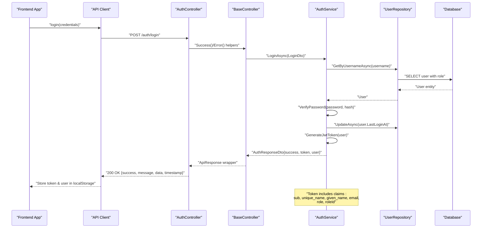

**Diagram sources**
- [AuthController.cs:27-43](file://Backend/PlusgrowWms.Api/Controllers/AuthController.cs#L27-L43)
- [BaseController.cs:16-67](file://Backend/PlusgrowWms.Api/Controllers/BaseController.cs#L16-L67)
- [AuthService.cs:39-103](file://Backend/PlusgrowWms.Api/Services/AuthService.cs#L39-L103)
- [ApiResponse.cs:8-97](file://Backend/PlusgrowWms.Api/Helpers/ApiResponse.cs#L8-L97)

## Detailed Component Analysis

### JWT Configuration and Middleware
- Authentication scheme configured as JWT Bearer with standardized snake_case response formatting
- Validation parameters enforce issuer, audience, signing key, and lifetime checks
- Authorization is enabled globally after authentication
- Enhanced with consistent API response structure using ApiResponse<T> wrapper

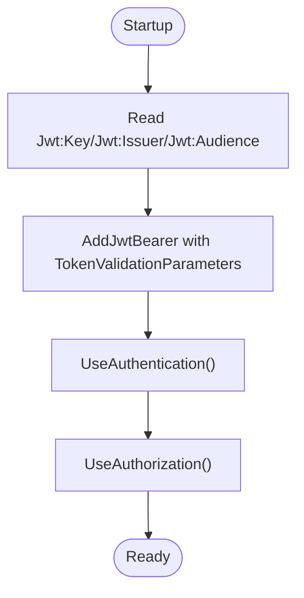

**Diagram sources**
- [Program.cs:45-63](file://Backend/PlusgrowWms.Api/Program.cs#L45-L63)
- [Program.cs:99-100](file://Backend/PlusgrowWms.Api/Program.cs#L99-L100)

**Section sources**
- [Program.cs:45-63](file://Backend/PlusgrowWms.Api/Program.cs#L45-L63)
- [Program.cs:99-100](file://Backend/PlusgrowWms.Api/Program.cs#L99-L100)

### Standardized API Response Wrapper
- ApiResponse<T> provides consistent response structure with snake_case properties
- Includes success, message, data, errors, timestamp, and pagination fields
- BaseController exposes Success(), Error(), NotFound(), and BadRequest() helper methods
- Supports both generic and non-generic response types
- Enables standardized error handling across all endpoints

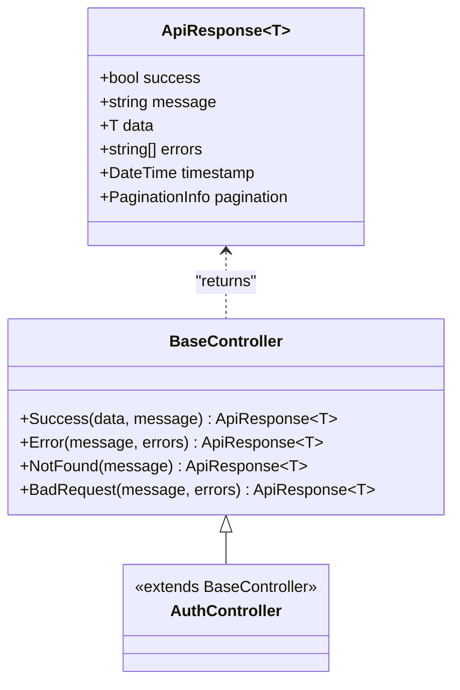

**Diagram sources**
- [ApiResponse.cs:8-97](file://Backend/PlusgrowWms.Api/Helpers/ApiResponse.cs#L8-L97)
- [BaseController.cs:16-67](file://Backend/PlusgrowWms.Api/Controllers/BaseController.cs#L16-L67)
- [AuthController.cs:27-158](file://Backend/PlusgrowWms.Api/Controllers/AuthController.cs#L27-L158)

**Section sources**
- [ApiResponse.cs:8-97](file://Backend/PlusgrowWms.Api/Helpers/ApiResponse.cs#L8-L97)
- [BaseController.cs:16-67](file://Backend/PlusgrowWms.Api/Controllers/BaseController.cs#L16-L67)
- [AuthController.cs:27-158](file://Backend/PlusgrowWms.Api/Controllers/AuthController.cs#L27-L158)

### Auth DTOs and Token Payload
- LoginDto carries username and password with snake_case properties
- AuthResponseDto carries success flag, optional token, optional message, and optional user with snake_case structure
- JwtSettingsDto holds key, issuer, audience, and expiry minutes
- Token payload includes standard claims and custom role ID claim
- UserDto provides standardized user information with snake_case field names

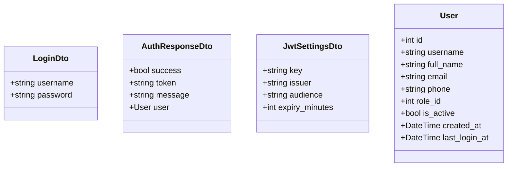

**Diagram sources**
- [AuthDto.cs:3-23](file://Backend/PlusgrowWms.Api/DTOs/AuthDto.cs#L3-L23)
- [UserDto.cs:3-43](file://Backend/PlusgrowWms.Api/DTOs/UserDto.cs#L3-L43)

**Section sources**
- [AuthDto.cs:3-23](file://Backend/PlusgrowWms.Api/DTOs/AuthDto.cs#L3-L23)
- [UserDto.cs:3-43](file://Backend/PlusgrowWms.Api/DTOs/UserDto.cs#L3-L43)
- [AuthService.cs:144-168](file://Backend/PlusgrowWms.Api/Services/AuthService.cs#L144-L168)

### Login Workflow
- Lookup user by username with role included
- Reject if user not found or inactive
- Verify password using BCrypt
- Update last login timestamp
- Generate JWT token with claims and expiry
- Return standardized ApiResponse with AuthResponseDto containing snake_case properties

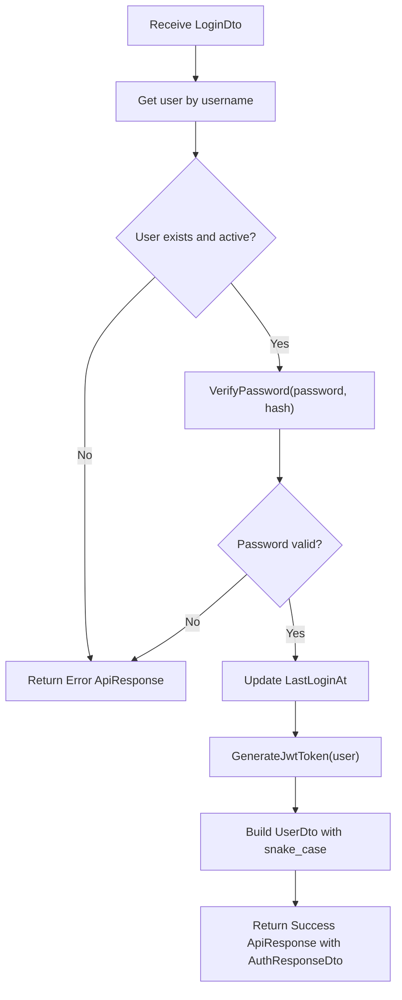

**Diagram sources**
- [AuthService.cs:39-103](file://Backend/PlusgrowWms.Api/Services/AuthService.cs#L39-L103)
- [AuthService.cs:170-179](file://Backend/PlusgrowWms.Api/Services/AuthService.cs#L170-L179)
- [AuthService.cs:144-168](file://Backend/PlusgrowWms.Api/Services/AuthService.cs#L144-L168)

**Section sources**
- [AuthService.cs:39-103](file://Backend/PlusgrowWms.Api/Services/AuthService.cs#L39-L103)
- [AuthService.cs:170-179](file://Backend/PlusgrowWms.Api/Services/AuthService.cs#L170-L179)

### Registration Workflow
- Check for existing username
- Hash password using BCrypt
- Persist new user with default role and active status
- Return standardized success ApiResponse with message

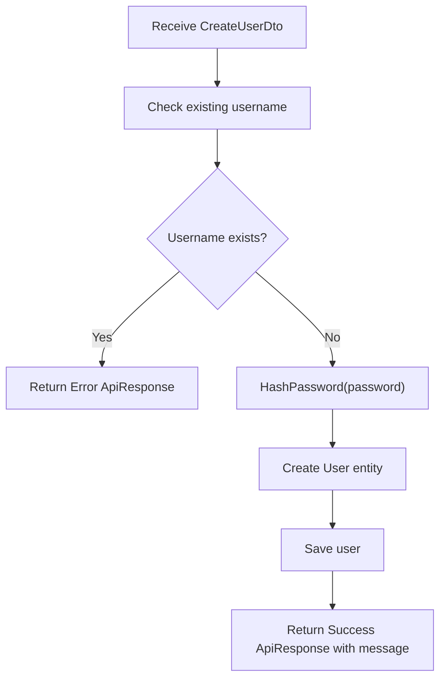

**Diagram sources**
- [AuthService.cs:105-142](file://Backend/PlusgrowWms.Api/Services/AuthService.cs#L105-L142)
- [AuthService.cs:170-174](file://Backend/PlusgrowWms.Api/Services/AuthService.cs#L170-L174)

**Section sources**
- [AuthService.cs:105-142](file://Backend/PlusgrowWms.Api/Services/AuthService.cs#L105-L142)
- [AuthService.cs:170-174](file://Backend/PlusgrowWms.Api/Services/AuthService.cs#L170-L174)

### Password Hashing and Verification
- Passwords are hashed using BCrypt with a work factor
- Verification compares provided password against stored hash
- Enhanced with standardized error responses for invalid credentials

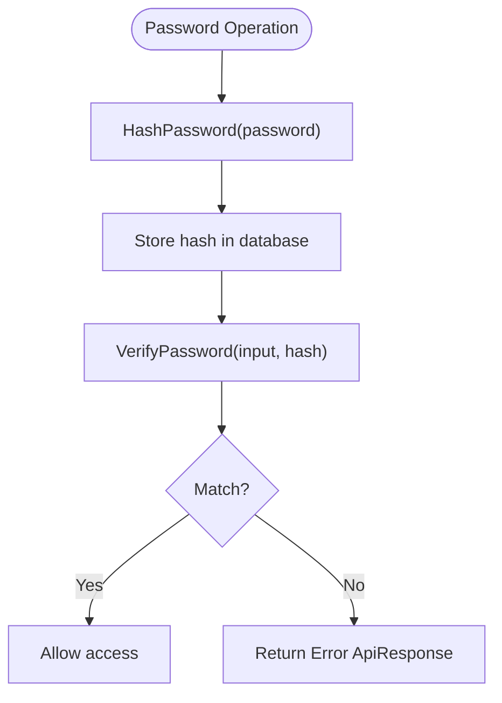

**Diagram sources**
- [AuthService.cs:170-179](file://Backend/PlusgrowWms.Api/Services/AuthService.cs#L170-L179)

**Section sources**
- [AuthService.cs:170-179](file://Backend/PlusgrowWms.Api/Services/AuthService.cs#L170-L179)

### Token Generation and Claims
- Symmetric key signing with HMAC SHA256
- Claims include subject, name, given name, email, role, and role ID
- Expiration derived from configuration
- Enhanced with standardized token response format

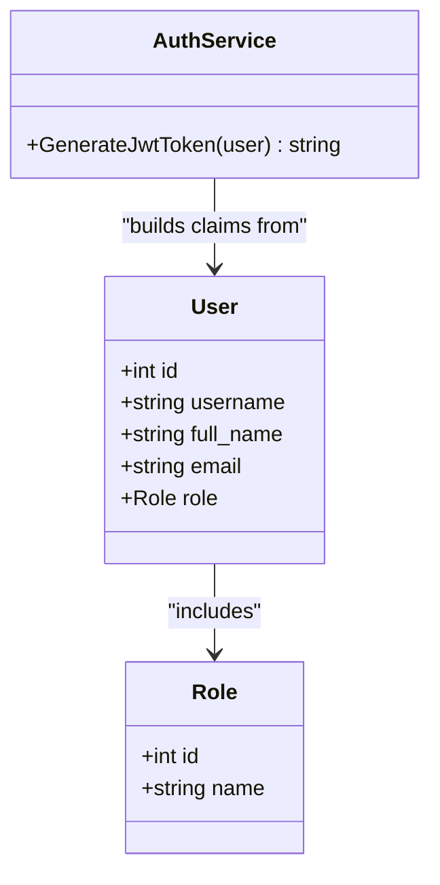

**Diagram sources**
- [AuthService.cs:144-168](file://Backend/PlusgrowWms.Api/Services/AuthService.cs#L144-L168)
- [User.cs:6-50](file://Backend/PlusgrowWms.Api/Models/User.cs#L6-L50)
- [Role.cs:6-30](file://Backend/PlusgrowWms.Api/Models/Role.cs#L6-L30)

**Section sources**
- [AuthService.cs:144-168](file://Backend/PlusgrowWms.Api/Services/AuthService.cs#L144-L168)
- [User.cs:6-50](file://Backend/PlusgrowWms.Api/Models/User.cs#L6-L50)
- [Role.cs:6-30](file://Backend/PlusgrowWms.Api/Models/Role.cs#L6-L30)

### Enhanced Token Refresh Mechanism
- Refresh endpoint retrieves user by ID with role
- Validates active status
- Regenerates token and returns updated user profile with snake_case structure
- Frontend automatically handles token refresh and storage with comprehensive error handling

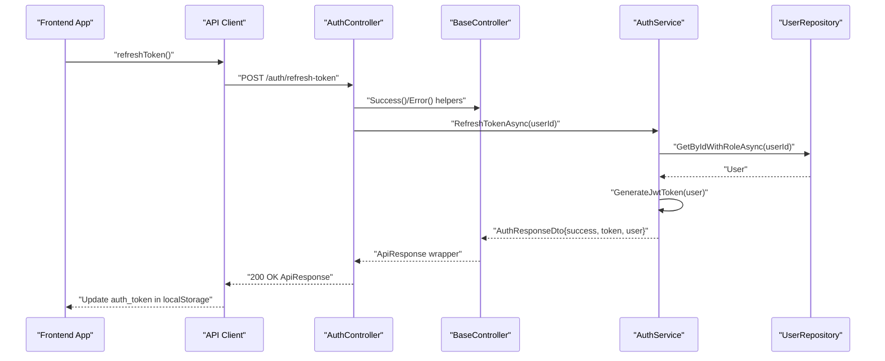

**Diagram sources**
- [AuthService.cs:207-234](file://Backend/PlusgrowWms.Api/Services/AuthService.cs#L207-L234)
- [auth.service.ts:46-52](file://Frontend/src/lib/api/services/auth.service.ts#L46-L52)

**Section sources**
- [AuthService.cs:207-234](file://Backend/PlusgrowWms.Api/Services/AuthService.cs#L207-L234)
- [auth.service.ts:46-52](file://Frontend/src/lib/api/services/auth.service.ts#L46-L52)

### Session Management Strategies
- Backend: Stateless JWT tokens with standardized ApiResponse wrapper; server does not maintain sessions
- Frontend: Stores user profile and token in localStorage with snake_case property compatibility; validates on startup by checking authentication status
- Enhanced with comprehensive error handling and automatic token cleanup on authentication failures
- Improved user session management with better error communication and state synchronization

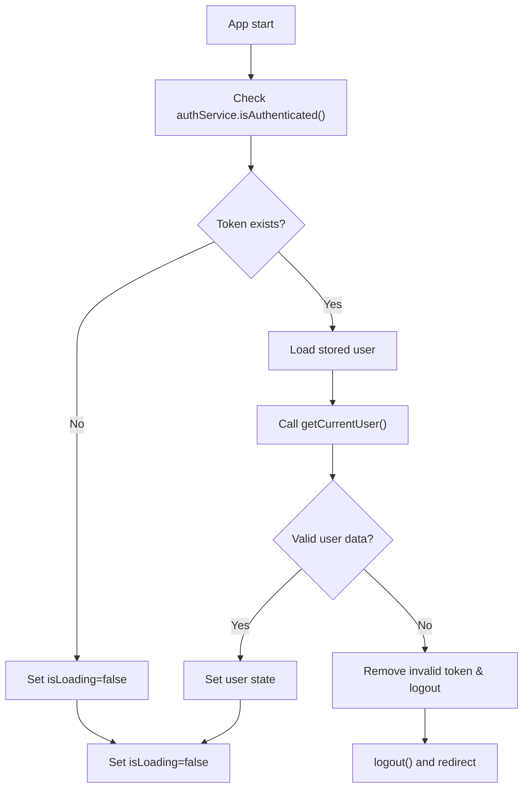

**Diagram sources**
- [AuthContext.tsx:46-58](file://Frontend/src/context/AuthContext.tsx#L46-L58)
- [auth.service.ts:42-44](file://Frontend/src/lib/api/services/auth.service.ts#L42-L44)

**Section sources**
- [AuthContext.tsx:46-58](file://Frontend/src/context/AuthContext.tsx#L46-L58)
- [auth.service.ts:42-44](file://Frontend/src/lib/api/services/auth.service.ts#L42-L44)

### Enhanced Frontend Authentication State Management
- AuthContext initializes state with snake_case type compatibility, logs in/out, registers, changes passwords, and refreshes user with comprehensive error handling
- Uses toast notifications for feedback and navigation on logout
- Enhanced with automatic token management, comprehensive error handling, loading states, and improved user experience
- Implements proper authentication state synchronization and automatic token cleanup on failures
- Features comprehensive error handling with user-friendly messages and automatic state cleanup
- Compatible with backend snake_case response format for seamless integration

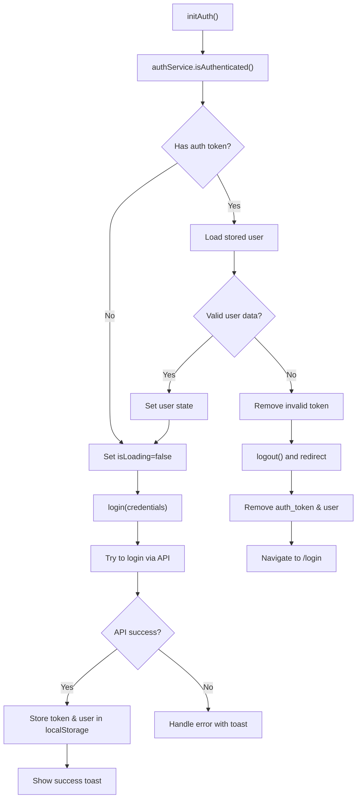

**Diagram sources**
- [AuthContext.tsx:46-108](file://Frontend/src/context/AuthContext.tsx#L46-L108)
- [auth.service.ts:14-21](file://Frontend/src/lib/api/services/auth.service.ts#L14-L21)

**Section sources**
- [AuthContext.tsx:46-108](file://Frontend/src/context/AuthContext.tsx#L46-L108)
- [auth.service.ts:14-21](file://Frontend/src/lib/api/services/auth.service.ts#L14-L21)

### Security Headers and Token Storage
- Tokens are stored in localStorage with automatic bearer token injection in API requests
- Enhanced security with request/response interceptors for automatic authentication and 401 error handling
- Comprehensive error handling with user-friendly messages and automatic logout on authentication failures
- Recommendations include storing tokens in secure, same-site cookies with HttpOnly and Secure flags for production
- Enhanced with standardized snake_case response format compatibility

**Updated** Enhanced with comprehensive API client interceptors for automatic token management, 401 error handling, and improved security practices with snake_case response format compatibility.

**Section sources**
- [auth.service.ts:14-21](file://Frontend/src/lib/api/services/auth.service.ts#L14-L21)
- [client.ts:12-34](file://Frontend/src/lib/api/client.ts#L12-L34)

### Enhanced Logout Procedures
- Frontend removes both auth_token and user from localStorage
- API client automatically handles 401 errors by removing token and redirecting to login
- Backend middleware enforces authentication; logout is client-side in this implementation
- Enhanced with comprehensive error handling and automatic state cleanup
- Compatible with standardized ApiResponse format for consistent error handling

**Section sources**
- [AuthContext.tsx:89-94](file://Frontend/src/context/AuthContext.tsx#L89-L94)
- [auth.service.ts:28-35](file://Frontend/src/lib/api/services/auth.service.ts#L28-L35)
- [client.ts:24-34](file://Frontend/src/lib/api/client.ts#L24-L34)

## Enhanced Frontend Authentication API

### API Client Interceptors
The frontend now includes comprehensive API client configuration with request and response interceptors for enhanced authentication handling and automatic error management with snake_case response format compatibility.

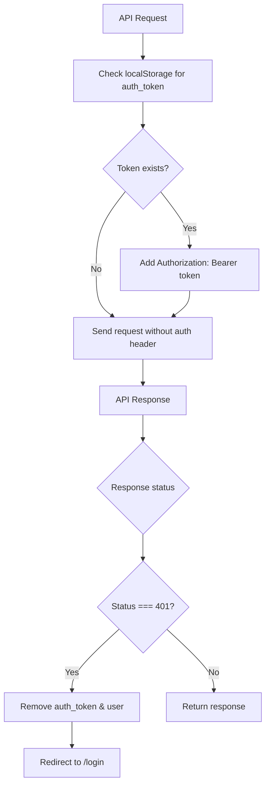

**Diagram sources**
- [client.ts:12-34](file://Frontend/src/lib/api/client.ts#L12-L34)

### Authentication Service Methods
Enhanced authentication service with comprehensive error handling, token management, and automatic authentication interceptors compatible with snake_case response format.

**Section sources**
- [auth.service.ts:13-61](file://Frontend/src/lib/api/services/auth.service.ts#L13-L61)
- [client.ts:12-34](file://Frontend/src/lib/api/client.ts#L12-L34)

### Enhanced Frontend UI Components
- Login component with comprehensive form validation, loading states, and error handling using snake_case response format
- Register component with extensive validation, password confirmation, and success feedback with standardized error messages
- Enhanced user experience with toast notifications and automatic form validation
- Improved compatibility with backend snake_case response structure

**Section sources**
- [Login.tsx:12-216](file://Frontend/src/pages/Login.tsx#L12-L216)
- [Register.tsx:11-310](file://Frontend/src/pages/Register.tsx#L11-L310)

## Dependency Analysis
The service layer depends on the repository for persistence and uses configuration for JWT settings. DTOs decouple HTTP contracts from domain models with snake_case properties. Enhanced frontend dependencies include API client with interceptors, comprehensive type definitions with snake_case compatibility, and improved UI components.

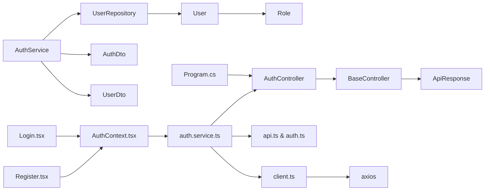

**Diagram sources**
- [AuthService.cs:23-37](file://Backend/PlusgrowWms.Api/Services/AuthService.cs#L23-L37)
- [UserRepository.cs:17-21](file://Backend/PlusgrowWms.Api/Repositories/UserRepository.cs#L17-L21)
- [User.cs:6-50](file://Backend/PlusgrowWms.Api/Models/User.cs#L6-L50)
- [Role.cs:6-30](file://Backend/PlusgrowWms.Api/Models/Role.cs#L6-L30)
- [AuthDto.cs:3-23](file://Backend/PlusgrowWms.Api/DTOs/AuthDto.cs#L3-L23)
- [UserDto.cs:3-43](file://Backend/PlusgrowWms.Api/DTOs/UserDto.cs#L3-L43)
- [Program.cs:45-63](file://Backend/PlusgrowWms.Api/Program.cs#L45-L63)
- [auth.service.ts:13-61](file://Frontend/src/lib/api/services/auth.service.ts#L13-L61)
- [client.ts:12-34](file://Frontend/src/lib/api/client.ts#L12-L34)
- [api.ts:4-117](file://Frontend/src/types/api.ts#L4-L117)

**Section sources**
- [AuthService.cs:23-37](file://Backend/PlusgrowWms.Api/Services/AuthService.cs#L23-L37)
- [UserRepository.cs:17-21](file://Backend/PlusgrowWms.Api/Repositories/UserRepository.cs#L17-L21)
- [AuthDto.cs:3-23](file://Backend/PlusgrowWms.Api/DTOs/AuthDto.cs#L3-L23)
- [UserDto.cs:3-43](file://Backend/PlusgrowWms.Api/DTOs/UserDto.cs#L3-L43)
- [Program.cs:45-63](file://Backend/PlusgrowWms.Api/Program.cs#L45-L63)
- [auth.service.ts:13-61](file://Frontend/src/lib/api/services/auth.service.ts#L13-L61)
- [client.ts:12-34](file://Frontend/src/lib/api/client.ts#L12-L34)
- [api.ts:4-117](file://Frontend/src/types/api.ts#L4-L117)

## Performance Considerations
- Use indexed username column for fast lookup during login
- Minimize claims payload to reduce token size
- Consider sliding expiration or refresh tokens to balance security and UX
- Cache frequently accessed roles per user if needed
- Implement token refresh caching to reduce unnecessary API calls
- Enhanced with automatic token management and reduced API calls through interceptors
- Password change operations use efficient BCrypt hashing with appropriate work factors
- Toast notifications are cached and debounced to improve user experience
- Standardized ApiResponse format reduces response parsing overhead and improves consistency

**Updated** Added token refresh caching recommendation and automatic token management for improved performance, plus enhanced password change operation considerations and toast notification optimization with standardized response format benefits.

## Troubleshooting Guide
Common issues and resolutions:
- Invalid credentials: Returned when username not found, password mismatch, or inactive account with standardized error response format
- Token validation failures: Check issuer, audience, and signing key alignment between frontend and backend with snake_case response compatibility
- Startup token verification failure: On invalid/expired token, the frontend clears state and redirects to login
- API authentication errors: 401 status triggers automatic token removal and login redirection with standardized error handling
- Frontend authentication state issues: Check localStorage for corrupted auth_token or user data with snake_case property validation
- Password change failures: Current password verification must succeed before allowing changes with consistent error messaging
- Enhanced error handling: Comprehensive error messages with user-friendly feedback and automatic state cleanup using ApiResponse format
- Toast notification failures: Verify toast library integration and network connectivity for error reporting
- Snake_case compatibility issues: Ensure frontend types match backend response format for seamless integration

**Updated** Added comprehensive error handling and frontend state troubleshooting with improved user experience, plus password change specific troubleshooting guidance, toast notification system monitoring, and snake_case compatibility validation.

**Section sources**
- [AuthService.cs:45-73](file://Backend/PlusgrowWms.Api/Services/AuthService.cs#L45-L73)
- [Program.cs:52-61](file://Backend/PlusgrowWms.Api/Program.cs#L52-L61)
- [AuthContext.tsx:46-58](file://Frontend/src/context/AuthContext.tsx#L46-L58)
- [client.ts:24-34](file://Frontend/src/lib/api/client.ts#L24-L34)

## Conclusion
The PlusGrow WMS authentication system implements a robust, standards-compliant JWT-based solution with enhanced frontend integration, comprehensive error handling, and standardized snake_case API response formats. It leverages BCrypt for secure password handling, a clean service/repository pattern for persistence, and a clear separation of concerns via DTOs with consistent naming conventions. The frontend maintains comprehensive authentication state management with improved error handling, automatic token management, seamless integration with backend endpoints, and enhanced user experience through toast notifications and comprehensive validation. The enhanced API client provides automatic authentication interceptors, 401 error handling, and improved security practices with standardized response structures. The system now includes comprehensive password change functionality with current password verification, enhanced user management capabilities, and improved security measures with consistent snake_case response formatting. For production, consider enhancing token storage security and implementing refresh token strategies with proper caching mechanisms and continued adherence to standardized response formats.

**Updated** Enhanced conclusion reflects improved frontend authentication API, comprehensive error handling, automatic token management, standardized snake_case API response formats, expanded authentication endpoints with better security practices, and enhanced password change functionality with current password verification. The system now features comprehensive toast notification integration, improved error communication, enhanced authentication lifecycle management, and consistent response format compatibility across all endpoints.

## Appendices

### API Endpoints Overview
- POST /auth/login: Authenticate user and return standardized ApiResponse with snake_case properties
- POST /auth/register: Register a new user account with comprehensive validation and standardized response
- GET /auth/me: Get current authenticated user profile with snake_case response format
- PUT /auth/change-password: Change user password with current password verification and standardized error handling
- POST /auth/refresh-token: Refresh JWT token and return updated profile with snake_case structure

**Updated** Added comprehensive validation and enhanced error handling to all endpoints with standardized snake_case response formats, plus password change functionality with current password verification and consistent error messaging.

**Section sources**
- [AuthController.cs:22-158](file://Backend/PlusgrowWms.Api/Controllers/AuthController.cs#L22-L158)
- [AuthService.cs:19-20](file://Backend/PlusgrowWms.Api/Services/AuthService.cs#L19-L20)
- [AuthService.cs:207-234](file://Backend/PlusgrowWms.Api/Services/AuthService.cs#L207-L234)

### Enhanced Frontend Authentication Flow
- Login: Sends credentials with comprehensive validation, stores token and user with snake_case compatibility, shows success toast, and handles errors gracefully with standardized ApiResponse format
- Registration: Validates input with extensive validation rules, sends registration data, shows success message, and handles errors with user-friendly feedback using snake_case response format
- Logout: Removes token and user, navigates to login, and cleans up authentication state
- Password Change: Verifies current password, changes to new password with validation, and provides feedback with consistent error handling
- Token Refresh: Automatically refreshes expired tokens with comprehensive error handling and snake_case response compatibility
- Enhanced UI: Improved user experience with toast notifications and comprehensive validation using standardized response formats
- Authentication State: Comprehensive user authentication state management with improved error communication and automatic token cleanup
- Type Safety: Enhanced TypeScript integration with snake_case property compatibility for seamless backend/frontend communication

**Updated** Enhanced with comprehensive validation, error handling, improved user experience, password change functionality with current password verification, comprehensive toast notification system for user feedback, and snake_case response format compatibility across all authentication flows.

**Section sources**
- [auth.service.ts:13-61](file://Frontend/src/lib/api/services/auth.service.ts#L13-L61)
- [AuthContext.tsx:60-108](file://Frontend/src/context/AuthContext.tsx#L60-L108)
- [Login.tsx:12-216](file://Frontend/src/pages/Login.tsx#L12-L216)
- [Register.tsx:11-310](file://Frontend/src/pages/Register.tsx#L11-L310)