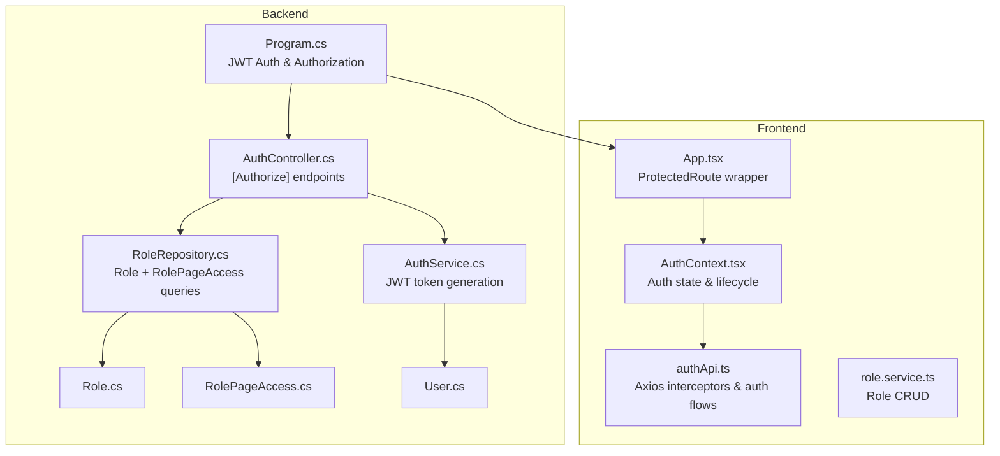
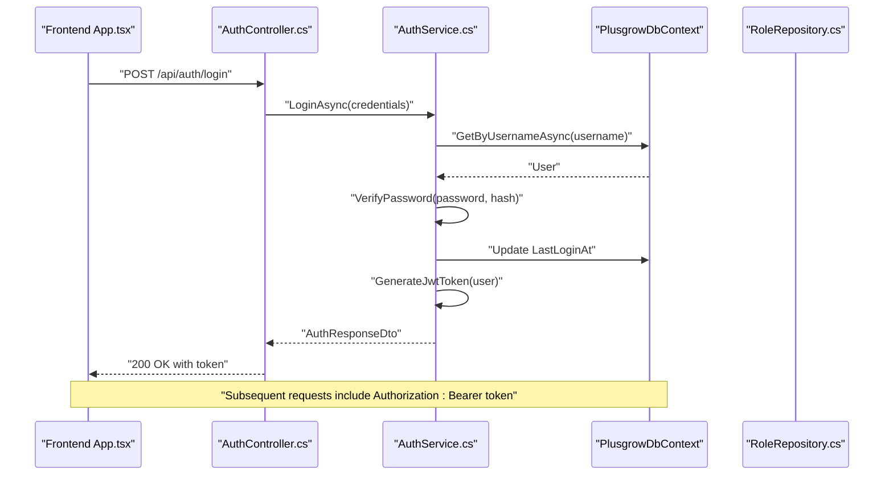
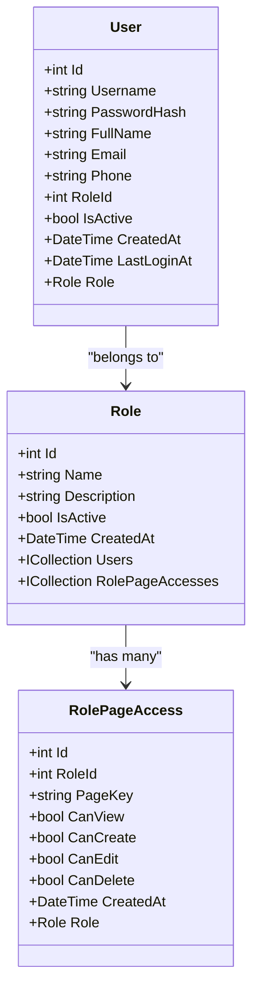
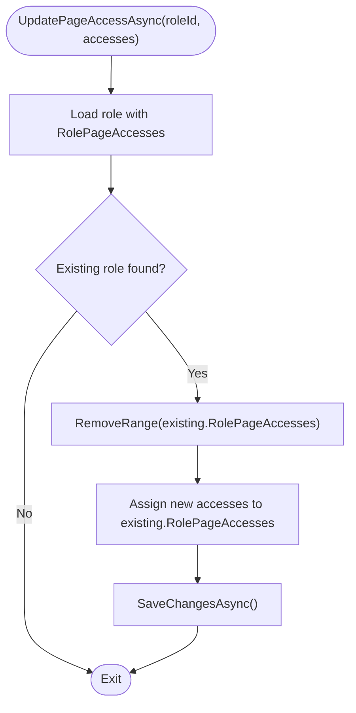
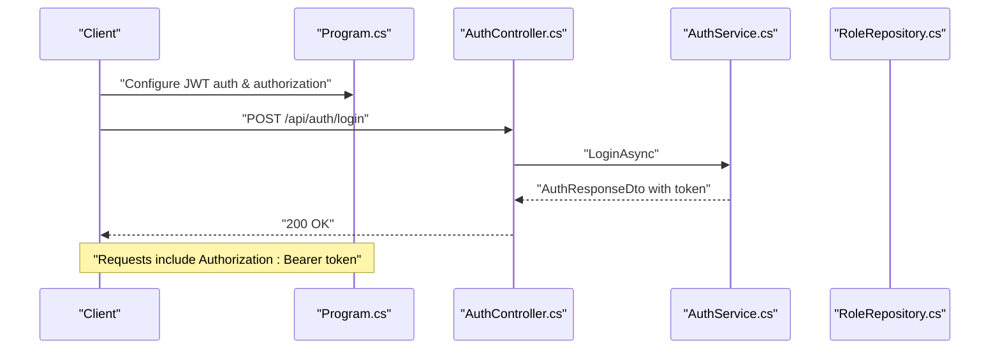
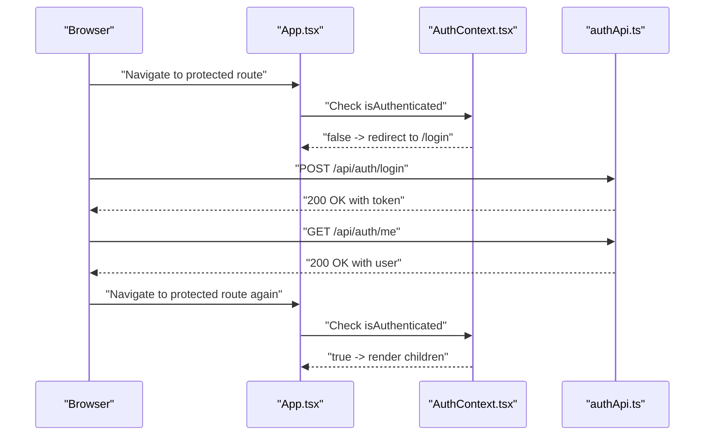
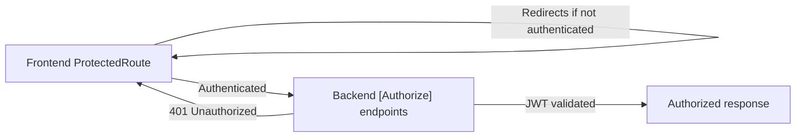
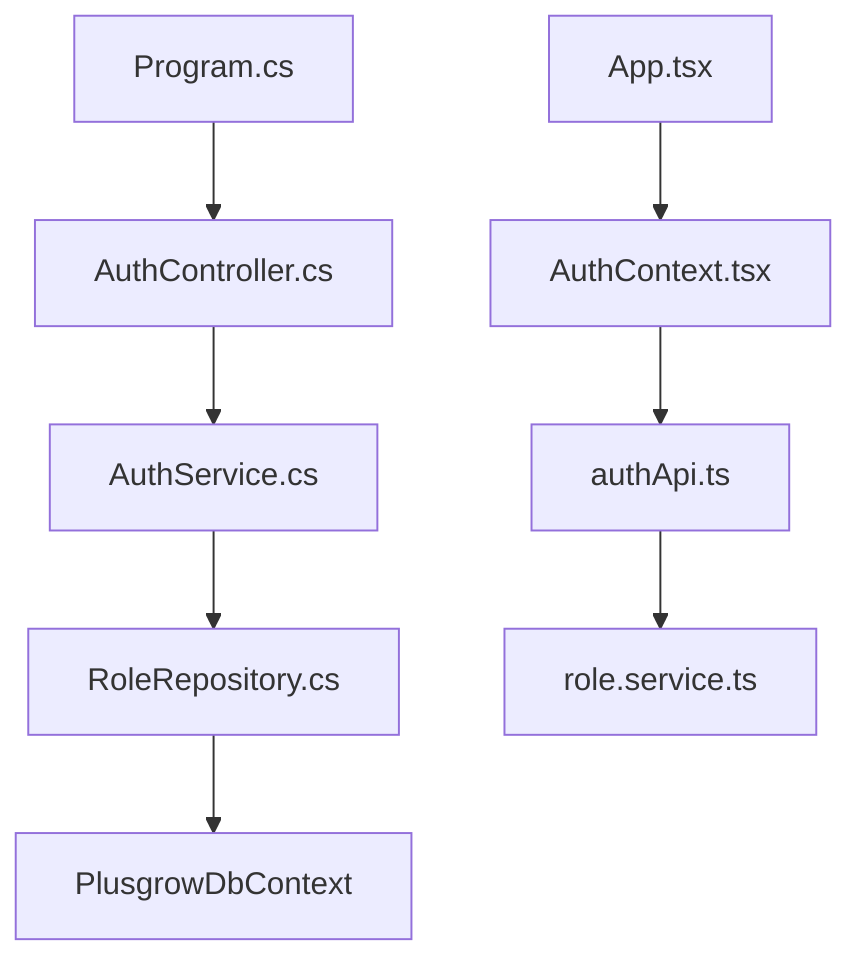

# Authorization and RBAC

<cite>
**Referenced Files in This Document**
- [Role.cs](file://Backend/PlusgrowWms.Api/Models/Role.cs)
- [RolePageAccess.cs](file://Backend/PlusgrowWms.Api/Models/RolePageAccess.cs)
- [User.cs](file://Backend/PlusgrowWms.Api/Models/User.cs)
- [RoleRepository.cs](file://Backend/PlusgrowWms.Api/Repositories/RoleRepository.cs)
- [RoleDto.cs](file://Backend/PlusgrowWms.Api/DTOs/RoleDto.cs)
- [AuthService.cs](file://Backend/PlusgrowWms.Api/Services/AuthService.cs)
- [AuthController.cs](file://Backend/PlusgrowWms.Api/Controllers/AuthController.cs)
- [Program.cs](file://Backend/PlusgrowWms.Api/Program.cs)
- [App.tsx](file://Frontend/src/App.tsx)
- [AuthContext.tsx](file://Frontend/src/context/AuthContext.tsx)
- [authApi.ts](file://Frontend/src/services/authApi.ts)
- [role.service.ts](file://Frontend/src/lib/api/services/role.service.ts)
- [ProductsController.cs](file://Backend/PlusgrowWms.Api/Controllers/ProductsController.cs)
</cite>

## Table of Contents
1. [Introduction](#introduction)
2. [Project Structure](#project-structure)
3. [Core Components](#core-components)
4. [Architecture Overview](#architecture-overview)
5. [Detailed Component Analysis](#detailed-component-analysis)
6. [Dependency Analysis](#dependency-analysis)
7. [Performance Considerations](#performance-considerations)
8. [Troubleshooting Guide](#troubleshooting-guide)
9. [Conclusion](#conclusion)
10. [Appendices](#appendices)

## Introduction
This document explains the role-based access control (RBAC) system in PlusGrow WMS. It covers the role hierarchy, permission model, page-level access controls, and the integration between frontend route protection and backend authorization checks. It documents the Role and RolePageAccess entities, their relationships, and the authorization logic implemented in the backend. It also details user-role assignments, permission inheritance, dynamic access control mechanisms, and provides examples of role configurations, permission checking patterns, and authorization decorators. Finally, it addresses common authorization scenarios, troubleshooting access issues, and security considerations for role management, including the RoleRepository implementation and efficient permission lookup patterns.

## Project Structure
The RBAC system spans both backend and frontend:
- Backend: Entity models (Role, RolePageAccess, User), repositories (RoleRepository), services (AuthService), controllers (AuthController), and program configuration for JWT authentication and authorization.
- Frontend: Route protection wrappers, authentication context/provider, and API clients that enforce token-based access and redirect unauthenticated users.

**Diagram sources**
- [Program.cs:44-106](file://Backend/PlusgrowWms.Api/Program.cs#L44-L106)
- [AuthController.cs:1-169](file://Backend/PlusgrowWms.Api/Controllers/AuthController.cs#L1-L169)
- [AuthService.cs:1-236](file://Backend/PlusgrowWms.Api/Services/AuthService.cs#L1-L236)
- [RoleRepository.cs:1-71](file://Backend/PlusgrowWms.Api/Repositories/RoleRepository.cs#L1-L71)
- [Role.cs:1-31](file://Backend/PlusgrowWms.Api/Models/Role.cs#L1-L31)
- [RolePageAccess.cs:1-39](file://Backend/PlusgrowWms.Api/Models/RolePageAccess.cs#L1-L39)
- [User.cs:1-51](file://Backend/PlusgrowWms.Api/Models/User.cs#L1-L51)
- [App.tsx:33-53](file://Frontend/src/App.tsx#L33-L53)
- [AuthContext.tsx:1-138](file://Frontend/src/context/AuthContext.tsx#L1-L138)
- [authApi.ts:1-101](file://Frontend/src/services/authApi.ts#L1-L101)
- [role.service.ts:1-38](file://Frontend/src/lib/api/services/role.service.ts#L1-L38)

**Section sources**
- [Program.cs:44-106](file://Backend/PlusgrowWms.Api/Program.cs#L44-L106)
- [App.tsx:33-53](file://Frontend/src/App.tsx#L33-L53)

## Core Components
- Role entity defines roles with activation flag and collections for users and page access permissions.
- RolePageAccess entity defines per-page permissions (view, create, edit, delete) keyed by a page identifier.
- User entity links to a single Role via foreign key.
- RoleRepository provides role queries including eager loading of users and page access entries.
- AuthService generates JWT tokens embedding role claims and refreshes tokens for active users.
- AuthController exposes login, registration, profile retrieval, password change, and token refresh endpoints, protected by [Authorize] where appropriate.
- Frontend App.tsx defines ProtectedRoute wrapper enforcing authentication at the routing level.
- Frontend authApi.ts attaches Bearer tokens to outgoing requests and redirects to login on 401 responses.

**Section sources**
- [Role.cs:1-31](file://Backend/PlusgrowWms.Api/Models/Role.cs#L1-L31)
- [RolePageAccess.cs:1-39](file://Backend/PlusgrowWms.Api/Models/RolePageAccess.cs#L1-L39)
- [User.cs:1-51](file://Backend/PlusgrowWms.Api/Models/User.cs#L1-L51)
- [RoleRepository.cs:18-71](file://Backend/PlusgrowWms.Api/Repositories/RoleRepository.cs#L18-L71)
- [AuthService.cs:144-168](file://Backend/PlusgrowWms.Api/Services/AuthService.cs#L144-L168)
- [AuthController.cs:25-99](file://Backend/PlusgrowWms.Api/Controllers/AuthController.cs#L25-L99)
- [App.tsx:33-53](file://Frontend/src/App.tsx#L33-L53)
- [authApi.ts:14-34](file://Frontend/src/services/authApi.ts#L14-L34)

## Architecture Overview
The RBAC architecture combines JWT-based identity with page-level permissions:
- Authentication: Clients authenticate via AuthController endpoints; AuthService generates JWT tokens containing role claims.
- Authorization: Program.cs configures JWT bearer authentication and ASP.NET Core authorization policies. Controllers and endpoints use [Authorize] attributes.
- Page-level access: RolePageAccess entries define granular permissions per page key; RoleRepository loads these for role-aware logic.
- Frontend protection: ProtectedRoute enforces client-side route protection; authApi.ts ensures authenticated requests and handles 401 responses.

**Diagram sources**
- [AuthController.cs:25-43](file://Backend/PlusgrowWms.Api/Controllers/AuthController.cs#L25-L43)
- [AuthService.cs:39-103](file://Backend/PlusgrowWms.Api/Services/AuthService.cs#L39-L103)
- [AuthService.cs:144-168](file://Backend/PlusgrowWms.Api/Services/AuthService.cs#L144-L168)
- [Program.cs:49-62](file://Backend/PlusgrowWms.Api/Program.cs#L49-L62)

## Detailed Component Analysis

### Entities and Relationships
The Role and RolePageAccess entities form the backbone of the page-level permission model. Users are assigned to a single Role, which determines their page access.

- User.RoleId is a foreign key to Role.Id.
- Role.RolePageAccesses holds per-page permissions keyed by PageKey.
- Defaults: CanView is enabled by default; others disabled by default.

**Diagram sources**
- [User.cs:1-51](file://Backend/PlusgrowWms.Api/Models/User.cs#L1-L51)
- [Role.cs:1-31](file://Backend/PlusgrowWms.Api/Models/Role.cs#L1-L31)
- [RolePageAccess.cs:1-39](file://Backend/PlusgrowWms.Api/Models/RolePageAccess.cs#L1-L39)

**Section sources**
- [User.cs:36-40](file://Backend/PlusgrowWms.Api/Models/User.cs#L36-L40)
- [Role.cs:28-29](file://Backend/PlusgrowWms.Api/Models/Role.cs#L28-L29)
- [RolePageAccess.cs:24-34](file://Backend/PlusgrowWms.Api/Models/RolePageAccess.cs#L24-L34)

### RoleRepository Implementation and Permission Lookups
RoleRepository supports:
- Loading roles with users and page access entries.
- Updating page access entries for a role by replacing existing entries.

- Efficient permission lookups: RoleRepository exposes GetByIdWithAccessAsync to fetch a role with RolePageAccesses preloaded, enabling fast permission checks without additional roundtrips.

**Diagram sources**
- [RoleRepository.cs:57-69](file://Backend/PlusgrowWms.Api/Repositories/RoleRepository.cs#L57-L69)

**Section sources**
- [RoleRepository.cs:24-42](file://Backend/PlusgrowWms.Api/Repositories/RoleRepository.cs#L24-L42)
- [RoleRepository.cs:32-37](file://Backend/PlusgrowWms.Api/Repositories/RoleRepository.cs#L32-L37)
- [RoleRepository.cs:57-69](file://Backend/PlusgrowWms.Api/Repositories/RoleRepository.cs#L57-L69)

### JWT Claims and Authorization Decorators
- AuthService.GenerateJwtToken adds claims including role name and roleId, enabling downstream authorization decisions.
- Program.cs configures JWT bearer authentication and ASP.NET Core authorization.
- AuthController endpoints use [Authorize] for protected actions and [AllowAnonymous] for login/register.

**Diagram sources**
- [AuthService.cs:144-168](file://Backend/PlusgrowWms.Api/Services/AuthService.cs#L144-L168)
- [Program.cs:49-62](file://Backend/PlusgrowWms.Api/Program.cs#L49-L62)
- [AuthController.cs:25-43](file://Backend/PlusgrowWms.Api/Controllers/AuthController.cs#L25-L43)

**Section sources**
- [AuthService.cs:144-168](file://Backend/PlusgrowWms.Api/Services/AuthService.cs#L144-L168)
- [Program.cs:49-62](file://Backend/PlusgrowWms.Api/Program.cs#L49-L62)
- [AuthController.cs:25-43](file://Backend/PlusgrowWms.Api/Controllers/AuthController.cs#L25-L43)

### Frontend Route Protection and Token Management
- App.tsx defines ProtectedRoute to block unauthenticated users from accessing protected routes.
- AuthContext.tsx manages user state and lifecycle, refreshing user info after authentication.
- authApi.ts attaches Bearer tokens to requests and automatically redirects to login on 401 responses.

**Diagram sources**
- [App.tsx:33-53](file://Frontend/src/App.tsx#L33-L53)
- [AuthContext.tsx:20-130](file://Frontend/src/context/AuthContext.tsx#L20-L130)
- [authApi.ts:14-34](file://Frontend/src/services/authApi.ts#L14-L34)

**Section sources**
- [App.tsx:33-53](file://Frontend/src/App.tsx#L33-L53)
- [AuthContext.tsx:20-130](file://Frontend/src/context/AuthContext.tsx#L20-L130)
- [authApi.ts:14-34](file://Frontend/src/services/authApi.ts#L14-L34)

### Permission Model and Inheritance
- Single-role assignment: Each User belongs to exactly one Role via RoleId.
- Permission inheritance: RolePageAccess entries define per-page capabilities (CanView, CanCreate, CanEdit, CanDelete) keyed by PageKey.
- Defaults: CanView defaults to true; other permissions default to false.
- Dynamic access control: RoleRepository.UpdatePageAccessAsync replaces all existing page access entries for a role, enabling dynamic updates without manual joins.

**Section sources**
- [User.cs:36-40](file://Backend/PlusgrowWms.Api/Models/User.cs#L36-L40)
- [RolePageAccess.cs:24-34](file://Backend/PlusgrowWms.Api/Models/RolePageAccess.cs#L24-L34)
- [RoleRepository.cs:57-69](file://Backend/PlusgrowWms.Api/Repositories/RoleRepository.cs#L57-L69)

### Examples of Role Configurations and Permission Checking Patterns
- Example role configuration:
  - Create a Role with Name and optional Description.
  - Assign RoleId to users during registration or admin updates.
  - Define RolePageAccess entries for each page key with desired permissions (e.g., CanView true, CanCreate false).
- Permission checking pattern:
  - On the backend, load a role with RolePageAccesses via RoleRepository.GetByIdWithAccessAsync.
  - Match the incoming request’s page key against RolePageAccess entries to decide access.
- Authorization decorators:
  - Use [Authorize] on controllers/endpoints that require authentication.
  - Combine with policy-based authorization if needed (e.g., [Authorize(Policy = "RequireAdmin")]).
- Frontend examples:
  - ProtectedRoute wraps dashboard layouts and nested routes.
  - authApi.ts ensures all authenticated routes send Authorization headers.

**Section sources**
- [RoleRepository.cs:32-37](file://Backend/PlusgrowWms.Api/Repositories/RoleRepository.cs#L32-L37)
- [AuthController.cs:82-99](file://Backend/PlusgrowWms.Api/Controllers/AuthController.cs#L82-L99)
- [App.tsx:85-161](file://Frontend/src/App.tsx#L85-L161)
- [authApi.ts:14-34](file://Frontend/src/services/authApi.ts#L14-L34)

### Integration Between Frontend Route Protection and Backend Authorization
- Frontend: ProtectedRoute prevents navigation to protected pages without authentication.
- Backend: Program.cs enables JWT authentication and authorization; AuthController endpoints enforce [Authorize] where applicable.
- Token propagation: authApi.ts injects Authorization: Bearer headers; 401 responses trigger automatic logout and redirect to login.

**Diagram sources**
- [App.tsx:33-53](file://Frontend/src/App.tsx#L33-L53)
- [Program.cs:49-62](file://Backend/PlusgrowWms.Api/Program.cs#L49-L62)
- [AuthController.cs:25-43](file://Backend/PlusgrowWms.Api/Controllers/AuthController.cs#L25-L43)
- [authApi.ts:24-34](file://Frontend/src/services/authApi.ts#L24-L34)

**Section sources**
- [App.tsx:33-53](file://Frontend/src/App.tsx#L33-L53)
- [Program.cs:49-62](file://Backend/PlusgrowWms.Api/Program.cs#L49-L62)
- [AuthController.cs:25-43](file://Backend/PlusgrowWms.Api/Controllers/AuthController.cs#L25-L43)
- [authApi.ts:24-34](file://Frontend/src/services/authApi.ts#L24-L34)

## Dependency Analysis
- Backend dependencies:
  - AuthController depends on IAuthService.
  - AuthService depends on IUserRepository and configuration for JWT.
  - RoleRepository depends on PlusgrowDbContext and implements IRoleRepository.
  - Program.cs wires JWT authentication and authorization.
- Frontend dependencies:
  - App.tsx depends on AuthContext.tsx for authentication state.
  - authApi.ts depends on axios and environment variables for API base URL.
  - role.service.ts consumes the backend roles endpoint.

**Diagram sources**
- [AuthController.cs:16-18](file://Backend/PlusgrowWms.Api/Controllers/AuthController.cs#L16-L18)
- [AuthService.cs:25-36](file://Backend/PlusgrowWms.Api/Services/AuthService.cs#L25-L36)
- [RoleRepository.cs:20-22](file://Backend/PlusgrowWms.Api/Repositories/RoleRepository.cs#L20-L22)
- [Program.cs:49-62](file://Backend/PlusgrowWms.Api/Program.cs#L49-L62)
- [App.tsx:10-12](file://Frontend/src/App.tsx#L10-L12)
- [AuthContext.tsx:18-23](file://Frontend/src/context/AuthContext.tsx#L18-L23)
- [authApi.ts:14-21](file://Frontend/src/services/authApi.ts#L14-L21)
- [role.service.ts:11-36](file://Frontend/src/lib/api/services/role.service.ts#L11-L36)

**Section sources**
- [AuthController.cs:16-18](file://Backend/PlusgrowWms.Api/Controllers/AuthController.cs#L16-L18)
- [AuthService.cs:25-36](file://Backend/PlusgrowWms.Api/Services/AuthService.cs#L25-L36)
- [RoleRepository.cs:20-22](file://Backend/PlusgrowWms.Api/Repositories/RoleRepository.cs#L20-L22)
- [Program.cs:49-62](file://Backend/PlusgrowWms.Api/Program.cs#L49-L62)
- [App.tsx:10-12](file://Frontend/src/App.tsx#L10-L12)
- [AuthContext.tsx:18-23](file://Frontend/src/context/AuthContext.tsx#L18-L23)
- [authApi.ts:14-21](file://Frontend/src/services/authApi.ts#L14-L21)
- [role.service.ts:11-36](file://Frontend/src/lib/api/services/role.service.ts#L11-L36)

## Performance Considerations
- Eager loading: RoleRepository.GetByIdWithAccessAsync includes RolePageAccesses to avoid N+1 queries when evaluating permissions.
- Minimal DTOs: RoleDto excludes heavy navigation properties; use only required fields for role listings.
- Token reuse: Avoid unnecessary token refreshes; refresh only when nearing expiry.
- Frontend caching: Use React Query to cache authenticated user and role data to reduce repeated network calls.

[No sources needed since this section provides general guidance]

## Troubleshooting Guide
Common authorization scenarios and resolutions:
- Login fails with invalid credentials:
  - Verify username exists and password hash matches; ensure user IsActive is true.
- 401 Unauthorized on protected routes:
  - Confirm Authorization header is present; ensure token is valid and not expired; check JWT issuer/audience/signing key configuration.
- Cannot access a page despite having a role:
  - Ensure RolePageAccess entries exist for the page key with required permissions (e.g., CanView true).
  - Verify the role is active and the user’s RoleId points to the intended role.
- Frontend route not protected:
  - Ensure ProtectedRoute wraps the layout and nested routes; confirm AuthContext.isAuthenticated reflects stored token presence.
- Token refresh issues:
  - Confirm AuthController.RefreshToken endpoint is called and AuthService.RefreshTokenAsync returns a valid token for an active user.

**Section sources**
- [AuthService.cs:39-103](file://Backend/PlusgrowWms.Api/Services/AuthService.cs#L39-L103)
- [Program.cs:49-62](file://Backend/PlusgrowWms.Api/Program.cs#L49-L62)
- [RoleRepository.cs:32-37](file://Backend/PlusgrowWms.Api/Repositories/RoleRepository.cs#L32-L37)
- [App.tsx:33-53](file://Frontend/src/App.tsx#L33-L53)
- [authApi.ts:24-34](file://Frontend/src/services/authApi.ts#L24-L34)

## Conclusion
PlusGrow WMS implements a clear RBAC model centered on Role and RolePageAccess entities, with JWT-based authentication and authorization. The RoleRepository enables efficient permission lookups, while frontend route protection and token management ensure consistent access control across the application. By leveraging single-role assignment, page-level permissions, and robust token handling, the system provides a maintainable and secure foundation for role-based access control.

[No sources needed since this section summarizes without analyzing specific files]

## Appendices

### Appendix A: DTOs Related to Roles
- RoleDto: Lightweight representation of roles for listing and summaries.
- RolePageAccessDto and UpdateRolePageAccessDto: Transfer objects for managing page-level permissions.

**Section sources**
- [RoleDto.cs:3-11](file://Backend/PlusgrowWms.Api/DTOs/RoleDto.cs#L3-L11)
- [RoleDto.cs:27-51](file://Backend/PlusgrowWms.Api/DTOs/RoleDto.cs#L27-L51)

### Appendix B: Example Controller-Level Authorization
- ProductsController demonstrates standard CRUD endpoints without explicit authorization decorators, indicating open access for demonstration purposes. For production, apply [Authorize] and implement role-based checks around sensitive operations.

**Section sources**
- [ProductsController.cs:20-98](file://Backend/PlusgrowWms.Api/Controllers/ProductsController.cs#L20-L98)