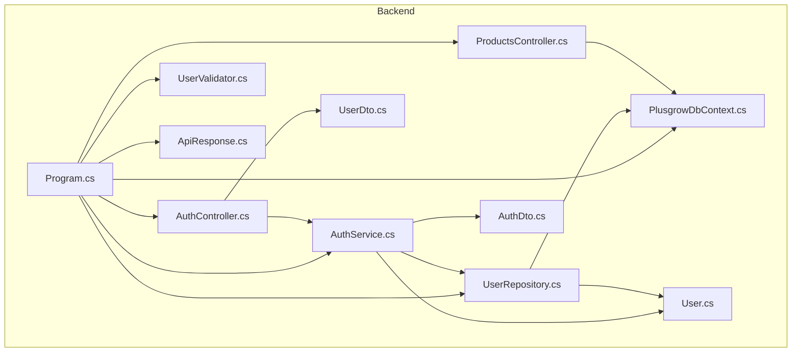
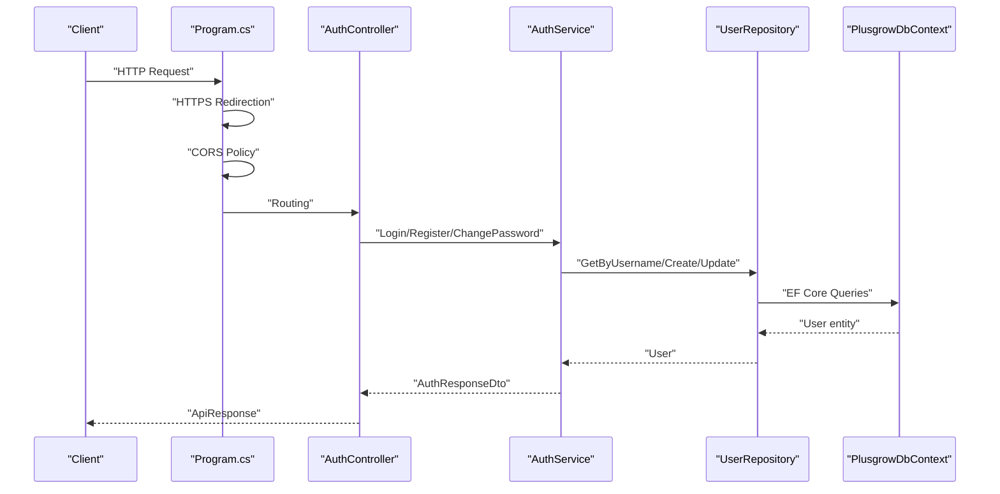
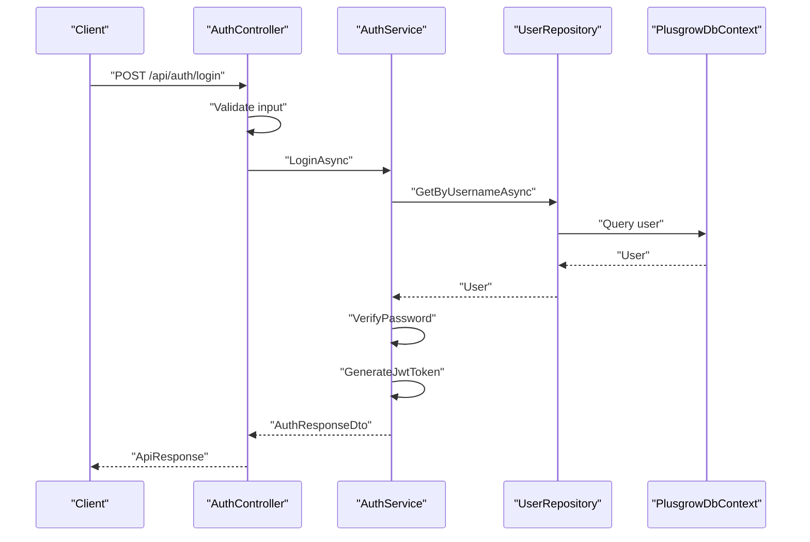
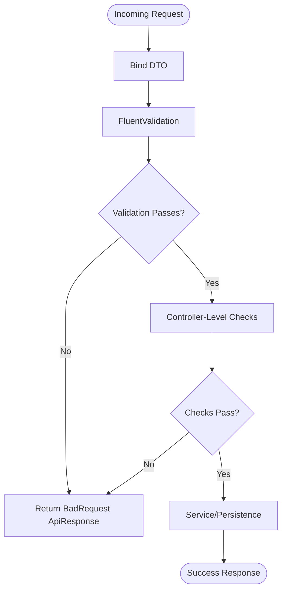
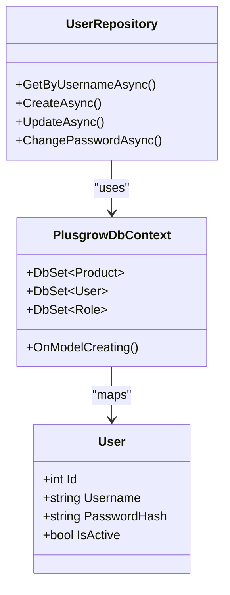
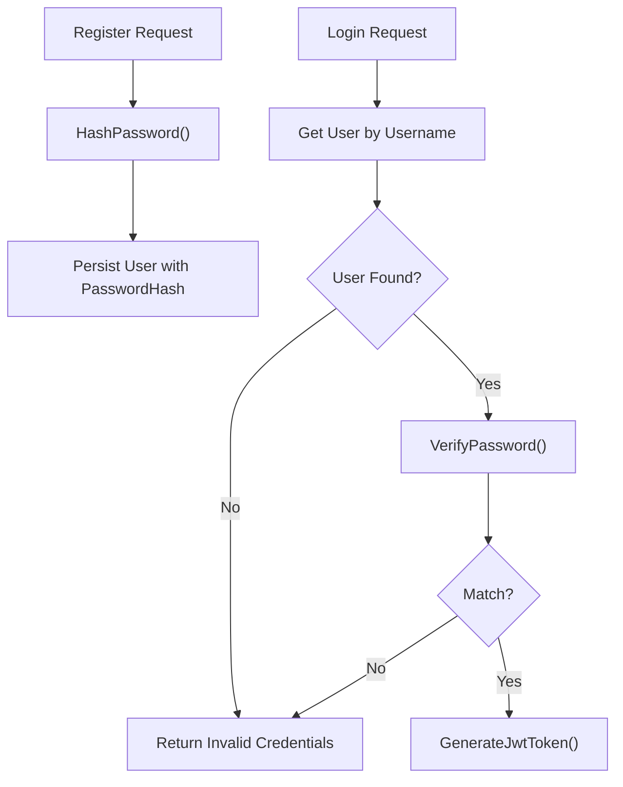
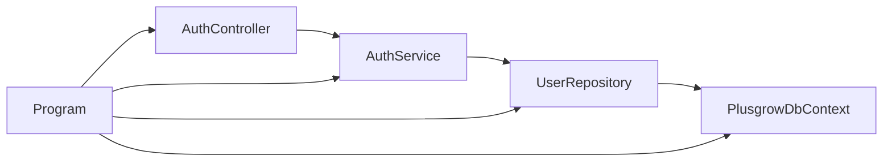

# Security Best Practices

<cite>
**Referenced Files in This Document**
- [Program.cs](file://Backend/PlusgrowWms.Api/Program.cs)
- [AuthController.cs](file://Backend/PlusgrowWms.Api/Controllers/AuthController.cs)
- [ProductsController.cs](file://Backend/PlusgrowWms.Api/Controllers/ProductsController.cs)
- [AuthService.cs](file://Backend/PlusgrowWms.Api/Services/AuthService.cs)
- [UserRepository.cs](file://Backend/PlusgrowWms.Api/Repositories/UserRepository.cs)
- [PlusgrowDbContext.cs](file://Backend/PlusgrowWms.Api/Data/PlusgrowDbContext.cs)
- [UserValidator.cs](file://Backend/PlusgrowWms.Api/Validators/UserValidator.cs)
- [ApiResponse.cs](file://Backend/PlusgrowWms.Api/Helpers/ApiResponse.cs)
- [User.cs](file://Backend/PlusgrowWms.Api/Models/User.cs)
- [AuthDto.cs](file://Backend/PlusgrowWms.Api/DTOs/AuthDto.cs)
- [UserDto.cs](file://Backend/PlusgrowWms.Api/DTOs/UserDto.cs)
- [launchSettings.json](file://Backend/PlusgrowWms.Api/Properties/launchSettings.json)
</cite>

## Table of Contents
1. [Introduction](#introduction)
2. [Project Structure](#project-structure)
3. [Core Components](#core-components)
4. [Architecture Overview](#architecture-overview)
5. [Detailed Component Analysis](#detailed-component-analysis)
6. [Dependency Analysis](#dependency-analysis)
7. [Performance Considerations](#performance-considerations)
8. [Troubleshooting Guide](#troubleshooting-guide)
9. [Conclusion](#conclusion)
10. [Appendices](#appendices)

## Introduction
This document provides comprehensive security best practices and implementation guidelines for the PlusGrow WMS application. It focuses on input validation, SQL injection prevention, cross-site scripting (XSS) protection, cross-site request forgery (CSRF) mitigation, password security, secure data transmission, CORS policies, security headers, rate limiting, brute-force attack prevention, audit logging, compliance considerations, secure coding practices, dependency management, and vulnerability assessment. The guidance is grounded in the current implementation and highlights areas for improvement to meet enterprise-grade security standards.

## Project Structure
The backend is a .NET Web API project organized into layers:
- Entry point and middleware configuration
- Controllers exposing REST endpoints
- Services implementing business logic
- Repositories handling persistence
- Data layer with Entity Framework Core
- DTOs and validators for input shaping
- Helpers for standardized responses

**Diagram sources**
- [Program.cs](file://Backend/PlusgrowWms.Api/Program.cs)
- [AuthController.cs](file://Backend/PlusgrowWms.Api/Controllers/AuthController.cs)
- [ProductsController.cs](file://Backend/PlusgrowWms.Api/Controllers/ProductsController.cs)
- [AuthService.cs](file://Backend/PlusgrowWms.Api/Services/AuthService.cs)
- [UserRepository.cs](file://Backend/PlusgrowWms.Api/Repositories/UserRepository.cs)
- [PlusgrowDbContext.cs](file://Backend/PlusgrowWms.Api/Data/PlusgrowDbContext.cs)
- [UserValidator.cs](file://Backend/PlusgrowWms.Api/Validators/UserValidator.cs)
- [ApiResponse.cs](file://Backend/PlusgrowWms.Api/Helpers/ApiResponse.cs)
- [User.cs](file://Backend/PlusgrowWms.Api/Models/User.cs)
- [UserDto.cs](file://Backend/PlusgrowWms.Api/DTOs/UserDto.cs)
- [AuthDto.cs](file://Backend/PlusgrowWms.Api/DTOs/AuthDto.cs)

**Section sources**
- [Program.cs](file://Backend/PlusgrowWms.Api/Program.cs)
- [AuthController.cs](file://Backend/PlusgrowWms.Api/Controllers/AuthController.cs)
- [ProductsController.cs](file://Backend/PlusgrowWms.Api/Controllers/ProductsController.cs)
- [AuthService.cs](file://Backend/PlusgrowWms.Api/Services/AuthService.cs)
- [UserRepository.cs](file://Backend/PlusgrowWms.Api/Repositories/UserRepository.cs)
- [PlusgrowDbContext.cs](file://Backend/PlusgrowWms.Api/Data/PlusgrowDbContext.cs)
- [UserValidator.cs](file://Backend/PlusgrowWms.Api/Validators/UserValidator.cs)
- [ApiResponse.cs](file://Backend/PlusgrowWms.Api/Helpers/ApiResponse.cs)
- [User.cs](file://Backend/PlusgrowWms.Api/Models/User.cs)
- [UserDto.cs](file://Backend/PlusgrowWms.Api/DTOs/UserDto.cs)
- [AuthDto.cs](file://Backend/PlusgrowWms.Api/DTOs/AuthDto.cs)

## Core Components
- Authentication and Authorization: JWT bearer authentication configured with issuer, audience, and symmetric key validation.
- Input Validation: FluentValidation validators for user creation and updates; controller-level checks for required fields.
- Data Access: EF Core with unique indexes and snake_case naming; repositories encapsulate persistence logic.
- Logging: Serilog request logging middleware enabled.
- Transport Security: HTTPS redirection enabled; CORS policy configured for frontend origin.
- Response Standardization: Consistent ApiResponse wrapper for all endpoints.

Security-relevant implementation highlights:
- JWT configuration and token generation
- Password hashing with BCrypt
- Controller-level input checks and validation
- Repository and model constraints
- Serilog request logging

**Section sources**
- [Program.cs](file://Backend/PlusgrowWms.Api/Program.cs)
- [AuthService.cs](file://Backend/PlusgrowWms.Api/Services/AuthService.cs)
- [AuthController.cs](file://Backend/PlusgrowWms.Api/Controllers/AuthController.cs)
- [UserValidator.cs](file://Backend/PlusgrowWms.Api/Validators/UserValidator.cs)
- [PlusgrowDbContext.cs](file://Backend/PlusgrowWms.Api/Data/PlusgrowDbContext.cs)
- [ApiResponse.cs](file://Backend/PlusgrowWms.Api/Helpers/ApiResponse.cs)

## Architecture Overview
The runtime security architecture integrates middleware, authentication, authorization, validation, and persistence layers.

**Diagram sources**
- [Program.cs](file://Backend/PlusgrowWms.Api/Program.cs)
- [AuthController.cs](file://Backend/PlusgrowWms.Api/Controllers/AuthController.cs)
- [AuthService.cs](file://Backend/PlusgrowWms.Api/Services/AuthService.cs)
- [UserRepository.cs](file://Backend/PlusgrowWms.Api/Repositories/UserRepository.cs)
- [PlusgrowDbContext.cs](file://Backend/PlusgrowWms.Api/Data/PlusgrowDbContext.cs)

## Detailed Component Analysis

### Authentication and Authorization
- JWT Bearer configuration validates issuer, audience, lifetime, and signing key.
- Token generation includes standard claims and role information.
- Authorization attributes applied on protected endpoints.
- Login and registration endpoints are publicly accessible but validated.

Security considerations:
- Use environment-specific secrets for JWT key, issuer, and audience.
- Enforce HTTPS in production to protect tokens in transit.
- Implement refresh token rotation and short-lived access tokens.

**Diagram sources**
- [AuthController.cs](file://Backend/PlusgrowWms.Api/Controllers/AuthController.cs)
- [AuthService.cs](file://Backend/PlusgrowWms.Api/Services/AuthService.cs)
- [UserRepository.cs](file://Backend/PlusgrowWms.Api/Repositories/UserRepository.cs)
- [PlusgrowDbContext.cs](file://Backend/PlusgrowWms.Api/Data/PlusgrowDbContext.cs)

**Section sources**
- [Program.cs](file://Backend/PlusgrowWms.Api/Program.cs)
- [AuthController.cs](file://Backend/PlusgrowWms.Api/Controllers/AuthController.cs)
- [AuthService.cs](file://Backend/PlusgrowWms.Api/Services/AuthService.cs)
- [AuthDto.cs](file://Backend/PlusgrowWms.Api/DTOs/AuthDto.cs)

### Input Validation Strategies
- FluentValidation validators enforce field presence, lengths, and formats for user creation and updates.
- Controllers perform additional checks for required fields and minimum password length.
- DTOs define shape and constraints for incoming requests.

Recommendations:
- Centralize validation logic in validators; avoid duplicating rules in controllers.
- Use model binding validation alongside FluentValidation.
- Apply whitelist validation for enums and constrained fields.

**Diagram sources**
- [UserValidator.cs](file://Backend/PlusgrowWms.Api/Validators/UserValidator.cs)
- [AuthController.cs](file://Backend/PlusgrowWms.Api/Controllers/AuthController.cs)
- [UserDto.cs](file://Backend/PlusgrowWms.Api/DTOs/UserDto.cs)

**Section sources**
- [UserValidator.cs](file://Backend/PlusgrowWms.Api/Validators/UserValidator.cs)
- [AuthController.cs](file://Backend/PlusgrowWms.Api/Controllers/AuthController.cs)
- [UserDto.cs](file://Backend/PlusgrowWms.Api/DTOs/UserDto.cs)

### SQL Injection Prevention
- EF Core query methods and LINQ prevent raw SQL injection.
- Unique and composite indexes enforced via model configuration.
- No dynamic SQL construction observed in controllers or services.

Recommendations:
- Continue using EF Core strongly-typed queries.
- Avoid string concatenation for SQL; prefer parameterized queries if raw SQL is unavoidable.
- Regularly review migrations and indexes for performance and security.

**Diagram sources**
- [PlusgrowDbContext.cs](file://Backend/PlusgrowWms.Api/Data/PlusgrowDbContext.cs)
- [UserRepository.cs](file://Backend/PlusgrowWms.Api/Repositories/UserRepository.cs)
- [User.cs](file://Backend/PlusgrowWms.Api/Models/User.cs)

**Section sources**
- [PlusgrowDbContext.cs](file://Backend/PlusgrowWms.Api/Data/PlusgrowDbContext.cs)
- [UserRepository.cs](file://Backend/PlusgrowWms.Api/Repositories/UserRepository.cs)
- [ProductsController.cs](file://Backend/PlusgrowWms.Api/Controllers/ProductsController.cs)

### XSS Protection
- JSON serialization is handled by ASP.NET Core; ensure HTML encoding is not re-applied unnecessarily.
- Avoid rendering untrusted input directly into HTML without sanitization.
- Use Content-Security-Policy header to restrict script execution.

Recommendations:
- Implement CSP header with strict directives.
- Sanitize user-generated content before storage/retrieval.
- Avoid inline scripts and eval.

[No sources needed since this section provides general guidance]

### CSRF Mitigation
- Stateless JWT authentication reduces CSRF risk compared to session-based auth.
- For form submissions, consider anti-CSRF tokens if maintaining sessions is required.
- Ensure SameSite cookies and secure flags for tokens.

Recommendations:
- Prefer token-based auth; avoid CSRF tokens for JWT.
- Enforce HTTPS and secure cookie flags.
- Validate referrer and origin headers for state-changing requests.

[No sources needed since this section provides general guidance]

### Password Security Measures
- Password hashing uses BCrypt with a strong work factor.
- Password verification leverages BCrypt comparison.
- Registration endpoint stores hashed passwords; change password endpoint verifies current password before updating.

Recommendations:
- Enforce strong password policies (length, complexity, expiry).
- Implement account lockout after failed attempts.
- Store only hashed passwords; never log plaintext.

**Diagram sources**
- [AuthService.cs](file://Backend/PlusgrowWms.Api/Services/AuthService.cs)
- [UserRepository.cs](file://Backend/PlusgrowWms.Api/Repositories/UserRepository.cs)

**Section sources**
- [AuthService.cs](file://Backend/PlusgrowWms.Api/Services/AuthService.cs)
- [UserValidator.cs](file://Backend/PlusgrowWms.Api/Validators/UserValidator.cs)

### Secure Data Transmission, HTTPS, and CORS
- HTTPS redirection is enabled in the pipeline.
- CORS policy allows a specific origin with any header/method for development.
- JWT transport requires HTTPS to prevent interception.

Recommendations:
- Enforce HTTPS in production environments.
- Restrict CORS origins to trusted domains only.
- Use HSTS header in production.

**Section sources**
- [Program.cs](file://Backend/PlusgrowWms.Api/Program.cs)
- [launchSettings.json](file://Backend/PlusgrowWms.Api/Properties/launchSettings.json)

### Security Headers Configuration
- Implement Content-Security-Policy, X-Content-Type-Options, X-Frame-Options, Referrer-Policy, Permissions-Policy, and HSTS.
- Configure headers per environment and route groups as needed.

[No sources needed since this section provides general guidance]

### Rate Limiting and Brute Force Prevention
- Implement sliding window or token bucket rate limiting for login/register endpoints.
- Enforce account lockout after N failed attempts.
- Use external caching for counters and consider IP-based or user-based limits.

[No sources needed since this section provides general guidance]

### Audit Logging and Security Event Tracking
- Serilog request logging captures request details; expand to include security events (failed logins, password changes, role changes).
- Log sensitive actions with minimal data exposure.
- Ship logs securely to centralized systems with retention policies.

**Section sources**
- [Program.cs](file://Backend/PlusgrowWms.Api/Program.cs)
- [AuthService.cs](file://Backend/PlusgrowWms.Api/Services/AuthService.cs)
- [AuthController.cs](file://Backend/PlusgrowWms.Api/Controllers/AuthController.cs)

### Compliance Considerations
- Align with data protection regulations (e.g., GDPR) for user data handling.
- Maintain audit trails for privileged actions.
- Implement data retention and deletion policies.

[No sources needed since this section provides general guidance]

### Secure Coding Practices
- Validate and sanitize all inputs; avoid reflection misuse.
- Use least privilege for database connections.
- Avoid hardcoding secrets; use secret managers or environment variables.
- Employ dependency review tools and keep packages updated.

[No sources needed since this section provides general guidance]

### Dependency Management and Vulnerability Assessment
- Scan NuGet packages for known vulnerabilities.
- Pin versions and monitor advisories.
- Automate dependency updates with pull requests and CI scans.

[No sources needed since this section provides general guidance]

## Dependency Analysis
The authentication service depends on the user repository, which in turn depends on the EF Core context. Controllers depend on services for business logic, while middleware and configuration tie the system together.

**Diagram sources**
- [Program.cs](file://Backend/PlusgrowWms.Api/Program.cs)
- [AuthController.cs](file://Backend/PlusgrowWms.Api/Controllers/AuthController.cs)
- [AuthService.cs](file://Backend/PlusgrowWms.Api/Services/AuthService.cs)
- [UserRepository.cs](file://Backend/PlusgrowWms.Api/Repositories/UserRepository.cs)
- [PlusgrowDbContext.cs](file://Backend/PlusgrowWms.Api/Data/PlusgrowDbContext.cs)

**Section sources**
- [Program.cs](file://Backend/PlusgrowWms.Api/Program.cs)
- [AuthService.cs](file://Backend/PlusgrowWms.Api/Services/AuthService.cs)
- [UserRepository.cs](file://Backend/PlusgrowWms.Api/Repositories/UserRepository.cs)
- [PlusgrowDbContext.cs](file://Backend/PlusgrowWms.Api/Data/PlusgrowDbContext.cs)

## Performance Considerations
- Indexes on unique and frequently queried columns improve lookup performance.
- Avoid N+1 queries by using includes judiciously.
- Use pagination for large datasets.

[No sources needed since this section provides general guidance]

## Troubleshooting Guide
Common issues and mitigations:
- Authentication failures: Verify JWT key, issuer, audience configuration and HTTPS enforcement.
- Validation errors: Ensure FluentValidation is registered and DTOs match validator rules.
- Database connection issues: Confirm connection string and migration status.
- CORS errors: Align frontend origin with configured policy.

**Section sources**
- [Program.cs](file://Backend/PlusgrowWms.Api/Program.cs)
- [UserValidator.cs](file://Backend/PlusgrowWms.Api/Validators/UserValidator.cs)
- [PlusgrowDbContext.cs](file://Backend/PlusgrowWms.Api/Data/PlusgrowDbContext.cs)

## Conclusion
The PlusGrow WMS backend establishes a solid foundation for security with JWT authentication, input validation, and EF Core. To achieve enterprise-grade security, strengthen transport security, implement robust rate limiting and brute-force protections, harden CORS and security headers, expand audit logging, and adopt secure coding and dependency management practices. These improvements will enhance resilience against common web application vulnerabilities and support compliance requirements.

## Appendices
- Endpoint coverage and security posture mapping
- Checklist for production hardening
- Reference to DTOs and models for input/output validation

[No sources needed since this section provides general guidance]