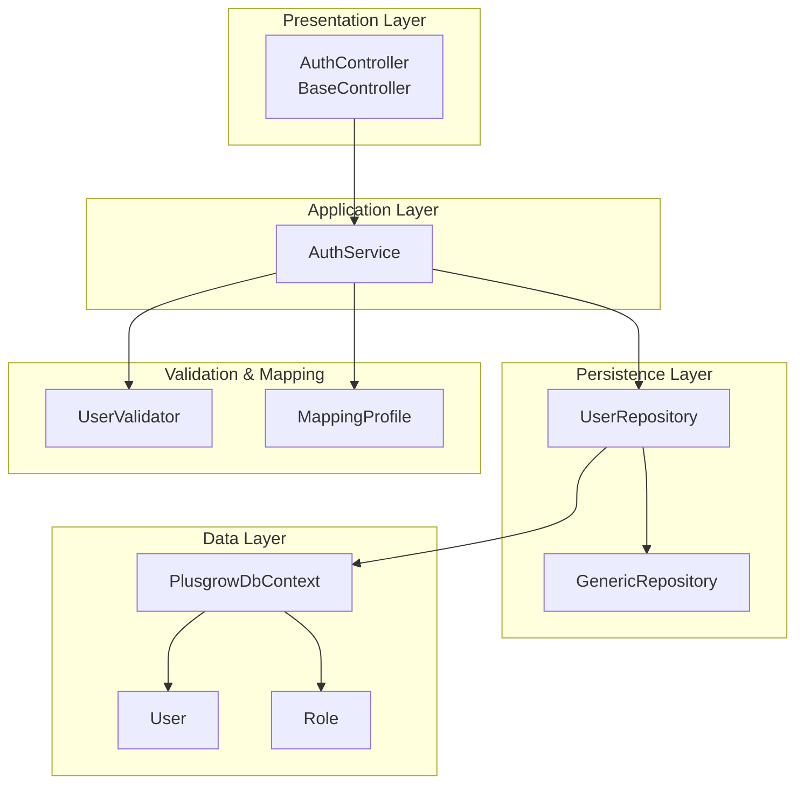
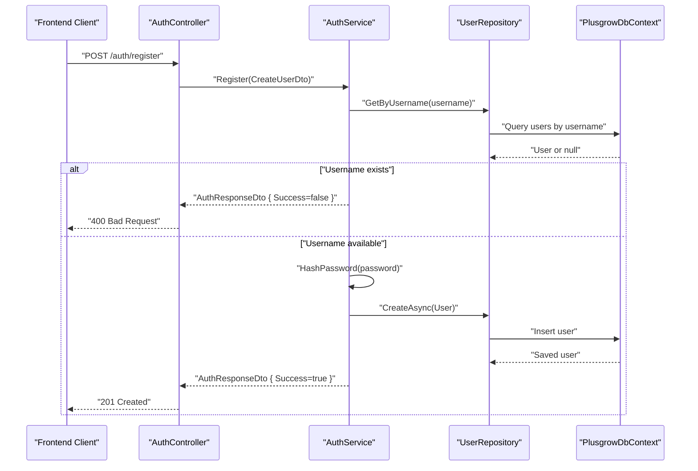
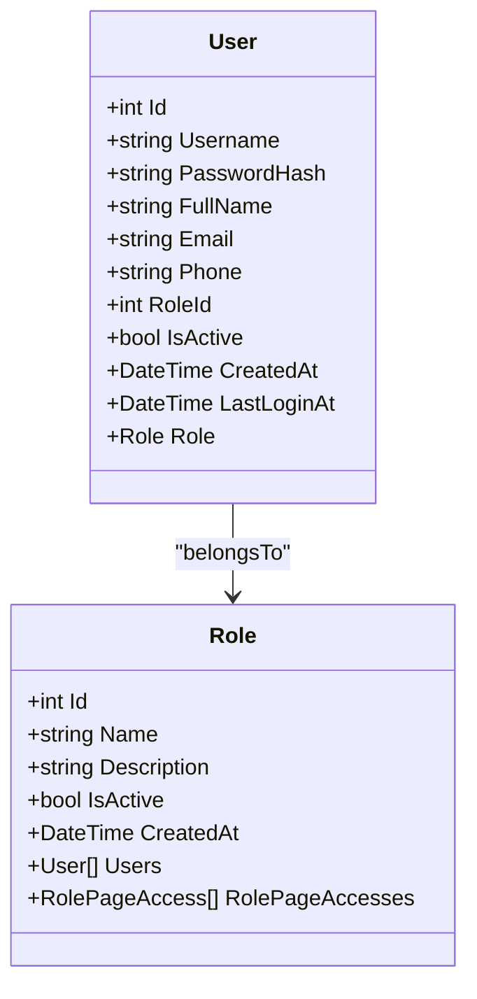
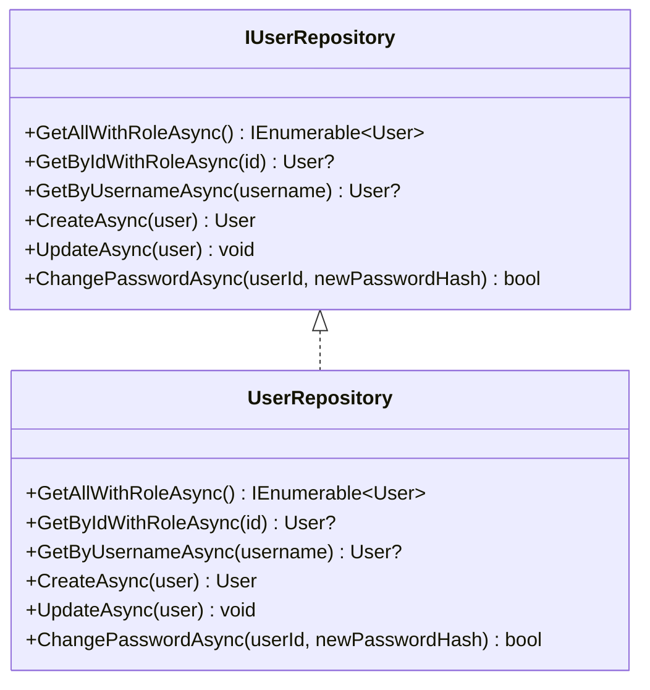
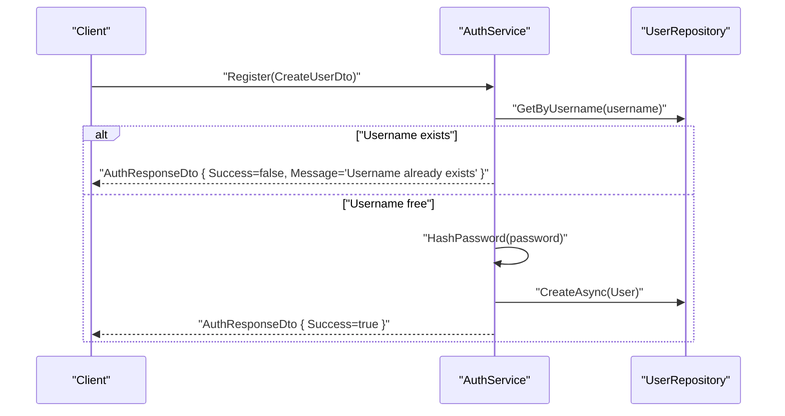
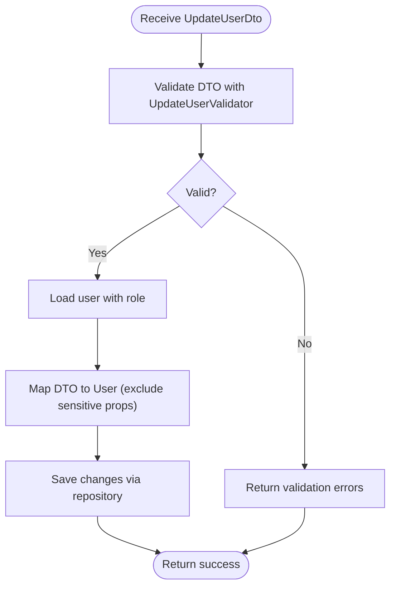
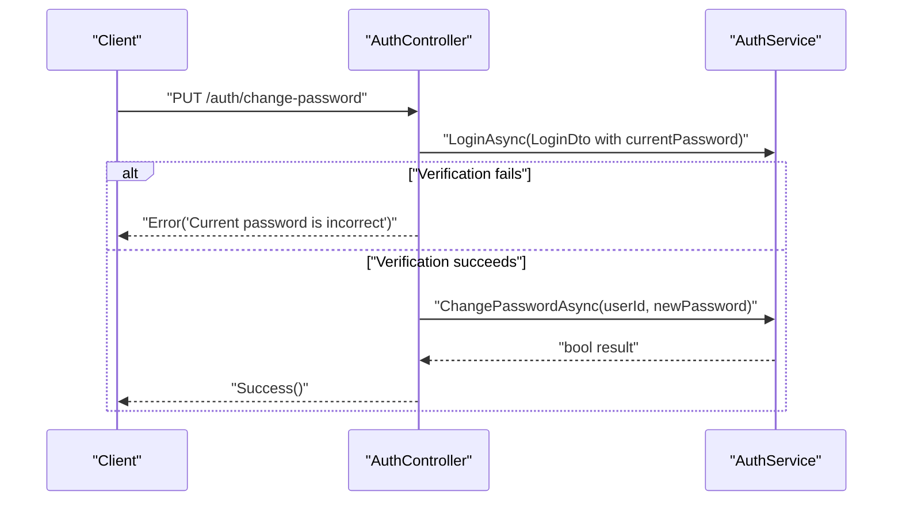
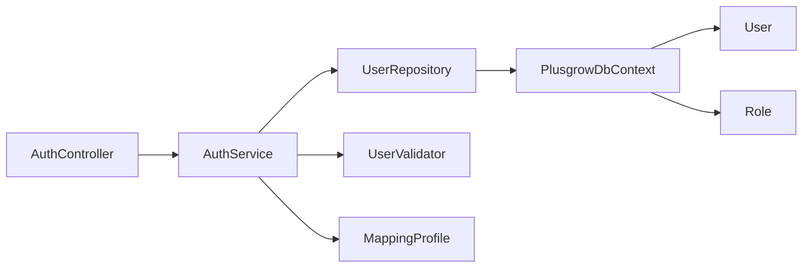

# User Account Management

<cite>
**Referenced Files in This Document**
- [User.cs](file://Backend/PlusgrowWms.Api/Models/User.cs)
- [Role.cs](file://Backend/PlusgrowWms.Api/Models/Role.cs)
- [PlusgrowDbContext.cs](file://Backend/PlusgrowWms.Api/Data/PlusgrowDbContext.cs)
- [UserDto.cs](file://Backend/PlusgrowWms.Api/DTOs/UserDto.cs)
- [AuthDto.cs](file://Backend/PlusgrowWms.Api/DTOs/AuthDto.cs)
- [CommonDto.cs](file://Backend/PlusgrowWms.Api/DTOs/CommonDto.cs)
- [UserRepository.cs](file://Backend/PlusgrowWms.Api/Repositories/UserRepository.cs)
- [GenericRepository.cs](file://Backend/PlusgrowWms.Api/Repositories/GenericRepository.cs)
- [UserValidator.cs](file://Backend/PlusgrowWms.Api/Validators/UserValidator.cs)
- [MappingProfile.cs](file://Backend/PlusgrowWms.Api/Mappings/MappingProfile.cs)
- [AuthService.cs](file://Backend/PlusgrowWms.Api/Services/AuthService.cs)
- [BaseController.cs](file://Backend/PlusgrowWms.Api/Controllers/BaseController.cs)
- [auth.service.ts](file://Frontend/src/lib/api/services/auth.service.ts)
</cite>

## Table of Contents
1. [Introduction](#introduction)
2. [Project Structure](#project-structure)
3. [Core Components](#core-components)
4. [Architecture Overview](#architecture-overview)
5. [Detailed Component Analysis](#detailed-component-analysis)
6. [Dependency Analysis](#dependency-analysis)
7. [Performance Considerations](#performance-considerations)
8. [Troubleshooting Guide](#troubleshooting-guide)
9. [Conclusion](#conclusion)
10. [Appendices](#appendices)

## Introduction
This document provides comprehensive documentation for PlusGrow WMS user account management functionality. It covers the User entity and its relationship with Role, the DTOs used for different operations, the repository pattern implementation, data validation via FluentValidation, and secure password handling. It also explains user lifecycle management including registration, profile updates, account activation/deactivation, and password changes. Administrative capabilities such as user search/filtering, bulk operations, and compliance-related audit logging are addressed alongside practical examples and troubleshooting guidance.

## Project Structure
The user account management feature spans several layers:
- Data layer: Entity models and database context
- Persistence layer: Repository interfaces and implementations
- Application layer: Services orchestrating business logic
- Presentation layer: Controllers and DTOs for API communication
- Validation: FluentValidation rules for DTOs
- Mapping: AutoMapper profiles for DTO-to-entity transformations

**Diagram sources**
- [AuthService.cs:13-236](file://Backend/PlusgrowWms.Api/Services/AuthService.cs#L13-L236)
- [UserRepository.cs:7-68](file://Backend/PlusgrowWms.Api/Repositories/UserRepository.cs#L7-L68)
- [PlusgrowDbContext.cs:6-78](file://Backend/PlusgrowWms.Api/Data/PlusgrowDbContext.cs#L6-L78)
- [User.cs:6-51](file://Backend/PlusgrowWms.Api/Models/User.cs#L6-L51)
- [Role.cs:6-31](file://Backend/PlusgrowWms.Api/Models/Role.cs#L6-L31)
- [UserValidator.cs:6-64](file://Backend/PlusgrowWms.Api/Validators/UserValidator.cs#L6-L64)
- [MappingProfile.cs:7-56](file://Backend/PlusgrowWms.Api/Mappings/MappingProfile.cs#L7-L56)

**Section sources**
- [PlusgrowDbContext.cs:12-18](file://Backend/PlusgrowWms.Api/Data/PlusgrowDbContext.cs#L12-L18)
- [UserRepository.cs:17-68](file://Backend/PlusgrowWms.Api/Repositories/UserRepository.cs#L17-L68)
- [AuthService.cs:23-236](file://Backend/PlusgrowWms.Api/Services/AuthService.cs#L23-L236)

## Core Components
- User entity: Defines identity, credentials, contact info, role association, activity status, timestamps, and last login tracking.
- Role entity: Defines roles with name, description, activity status, and creation timestamp, linked to users.
- DTOs: UserDto for read-only views, CreateUserDto and UpdateUserDto for registration and updates, ChangePasswordDto for password changes, and AuthResponseDto/LoginDto for authentication flows.
- Repository: IUserRepository and UserRepository implement CRUD and specialized queries including password changes.
- Service: AuthService encapsulates authentication, registration, JWT generation, password hashing/verification, and user retrieval.
- Validation: FluentValidation rules enforce field requirements, lengths, formats, and constraints for user DTOs.
- Mapping: AutoMapper profiles transform between entities and DTOs, including role name resolution and selective property mapping.

**Section sources**
- [User.cs:6-51](file://Backend/PlusgrowWms.Api/Models/User.cs#L6-L51)
- [Role.cs:6-31](file://Backend/PlusgrowWms.Api/Models/Role.cs#L6-L31)
- [UserDto.cs:3-43](file://Backend/PlusgrowWms.Api/DTOs/UserDto.cs#L3-L43)
- [UserRepository.cs:7-68](file://Backend/PlusgrowWms.Api/Repositories/UserRepository.cs#L7-L68)
- [AuthService.cs:13-236](file://Backend/PlusgrowWms.Api/Services/AuthService.cs#L13-L236)
- [UserValidator.cs:6-64](file://Backend/PlusgrowWms.Api/Validators/UserValidator.cs#L6-L64)
- [MappingProfile.cs:7-56](file://Backend/PlusgrowWms.Api/Mappings/MappingProfile.cs#L7-L56)

## Architecture Overview
The user management architecture follows layered separation of concerns:
- Controllers receive requests and delegate to services.
- Services coordinate repositories and apply business rules.
- Repositories interact with the database via Entity Framework.
- DTOs decouple API contracts from domain models.
- Validation and mapping layers ensure clean, consistent data handling.

**Diagram sources**
- [AuthService.cs:105-142](file://Backend/PlusgrowWms.Api/Services/AuthService.cs#L105-L142)
- [UserRepository.cs:45-50](file://Backend/PlusgrowWms.Api/Repositories/UserRepository.cs#L45-L50)
- [PlusgrowDbContext.cs:16](file://Backend/PlusgrowWms.Api/Data/PlusgrowDbContext.cs#L16)

## Detailed Component Analysis

### User Entity and Relationships
The User entity defines the core attributes for user accounts, including identifiers, credentials, personal details, role foreign key, activity flag, timestamps, and last login. The Role entity defines roles with unique names and links to users. The database context configures unique indexes for usernames and role names, and additional indexes for performance on role_id and isActive.

**Diagram sources**
- [User.cs:6-51](file://Backend/PlusgrowWms.Api/Models/User.cs#L6-L51)
- [Role.cs:6-31](file://Backend/PlusgrowWms.Api/Models/Role.cs#L6-L31)
- [PlusgrowDbContext.cs:40-69](file://Backend/PlusgrowWms.Api/Data/PlusgrowDbContext.cs#L40-L69)

**Section sources**
- [User.cs:6-51](file://Backend/PlusgrowWms.Api/Models/User.cs#L6-L51)
- [Role.cs:6-31](file://Backend/PlusgrowWms.Api/Models/Role.cs#L6-L31)
- [PlusgrowDbContext.cs:40-69](file://Backend/PlusgrowWms.Api/Data/PlusgrowDbContext.cs#L40-L69)

### DTOs and Their Purpose
- UserDto: Read-only representation for listing and profile display, including role name resolution.
- CreateUserDto: Registration payload with username, password, personal details, and optional role assignment.
- UpdateUserDto: Profile update payload supporting full name, contact info, role assignment, and activity toggle.
- ChangePasswordDto: Password change request with user identifier, current password verification, and new password enforcement.
- AuthResponseDto/LoginDto: Authentication response and login request DTOs.

These DTOs ensure clean separation between persistence models and API contracts, enabling controlled serialization and validation.

**Section sources**
- [UserDto.cs:3-43](file://Backend/PlusgrowWms.Api/DTOs/UserDto.cs#L3-L43)
- [AuthDto.cs:3-24](file://Backend/PlusgrowWms.Api/DTOs/AuthDto.cs#L3-L24)

### Repository Implementation and Data Access
The IUserRepository interface defines methods for retrieving users with role inclusion, by username, and for creating/updating users. The UserRepository extends a generic repository and adds a ChangePasswordAsync method. It leverages Entity Framework to include related roles and applies filters such as active status for listings.

**Diagram sources**
- [UserRepository.cs:7-68](file://Backend/PlusgrowWms.Api/Repositories/UserRepository.cs#L7-L68)

**Section sources**
- [UserRepository.cs:7-68](file://Backend/PlusgrowWms.Api/Repositories/UserRepository.cs#L7-L68)
- [GenericRepository.cs](file://Backend/PlusgrowWms.Api/Repositories/GenericRepository.cs)

### Data Validation with FluentValidation
FluentValidation enforces strict rules for user DTOs:
- CreateUserValidator: Validates username length, password minimum length, full name length, optional email format, and phone length.
- UpdateUserValidator: Validates positive user ID, full name constraints, and optional email format.
- ChangePasswordValidator: Validates positive user ID, non-empty current/new passwords, minimum length for new password, and ensures new password differs from current.

These validators provide immediate feedback and prevent invalid data from entering the system.

**Section sources**
- [UserValidator.cs:6-64](file://Backend/PlusgrowWms.Api/Validators/UserValidator.cs#L6-L64)

### Secure Data Handling Practices
- Password hashing: The service hashes passwords using a strong hashing algorithm before storage and verifies during login.
- JWT token generation: Tokens include user identity, role, and role ID claims, with configurable issuer, audience, and expiry.
- Logging: Comprehensive logging for login attempts, failures, registration outcomes, and password changes aids auditing and troubleshooting.

**Section sources**
- [AuthService.cs:170-179](file://Backend/PlusgrowWms.Api/Services/AuthService.cs#L170-L179)
- [AuthService.cs:144-168](file://Backend/PlusgrowWms.Api/Services/AuthService.cs#L144-L168)
- [AuthService.cs:41-103](file://Backend/PlusgrowWms.Api/Services/AuthService.cs#L41-L103)

### User Lifecycle Management

#### Registration Workflow
- Input: CreateUserDto validated by CreateUserValidator.
- Process: Check for existing username, hash password, create User entity, persist via repository.
- Output: AuthResponseDto indicating success or failure.

**Diagram sources**
- [AuthService.cs:105-142](file://Backend/PlusgrowWms.Api/Services/AuthService.cs#L105-L142)
- [UserRepository.cs:45-50](file://Backend/PlusgrowWms.Api/Repositories/UserRepository.cs#L45-L50)

**Section sources**
- [AuthService.cs:105-142](file://Backend/PlusgrowWms.Api/Services/AuthService.cs#L105-L142)

#### Profile Updates
- Input: UpdateUserDto validated by UpdateUserValidator.
- Process: Retrieve user with role, map DTO to entity (excluding password and role navigation), update and save.
- Output: Success response with updated user data.

**Diagram sources**
- [UserValidator.cs:31-46](file://Backend/PlusgrowWms.Api/Validators/UserValidator.cs#L31-L46)
- [MappingProfile.cs:18-20](file://Backend/PlusgrowWms.Api/Mappings/MappingProfile.cs#L18-L20)
- [UserRepository.cs:52-56](file://Backend/PlusgrowWms.Api/Repositories/UserRepository.cs#L52-L56)

**Section sources**
- [UserValidator.cs:31-46](file://Backend/PlusgrowWms.Api/Validators/UserValidator.cs#L31-L46)
- [MappingProfile.cs:18-20](file://Backend/PlusgrowWms.Api/Mappings/MappingProfile.cs#L18-L20)
- [UserRepository.cs:52-56](file://Backend/PlusgrowWms.Api/Repositories/UserRepository.cs#L52-L56)

#### Account Activation/Deactivation
- Toggle IsActive flag on the User entity.
- Repository persists the change; subsequent login attempts are blocked for inactive accounts.

**Section sources**
- [User.cs:42-43](file://Backend/PlusgrowWms.Api/Models/User.cs#L42-L43)
- [AuthService.cs:65-73](file://Backend/PlusgrowWms.Api/Services/AuthService.cs#L65-L73)

#### Password Change Workflow
- Input: ChangePasswordDto validated by ChangePasswordValidator.
- Process: Verify current password via login attempt, hash new password, update via repository.
- Output: Success or error response depending on verification outcome.

**Diagram sources**
- [AuthService.cs:120-125](file://Backend/PlusgrowWms.Api/Services/AuthService.cs#L120-L125)
- [AuthService.cs:201-205](file://Backend/PlusgrowWms.Api/Services/AuthService.cs#L201-L205)

**Section sources**
- [UserValidator.cs:48-63](file://Backend/PlusgrowWms.Api/Validators/UserValidator.cs#L48-L63)
- [AuthService.cs:120-125](file://Backend/PlusgrowWms.Api/Services/AuthService.cs#L120-L125)
- [AuthService.cs:201-205](file://Backend/PlusgrowWms.Api/Services/AuthService.cs#L201-L205)

### User Search and Filtering
- GetAllWithRoleAsync returns active users with role included, suitable for admin dashboards and dropdowns.
- GetByIdWithRoleAsync retrieves a single user by ID for detailed views.
- GetByUsernameAsync supports login and duplicate checks.

Administrative filtering can be extended by adding query parameters and repository methods for role-based or status-based filtering.

**Section sources**
- [UserRepository.cs:23-43](file://Backend/PlusgrowWms.Api/Repositories/UserRepository.cs#L23-L43)

### Bulk User Operations
Bulk operations are not currently implemented in the repository. To support bulk actions (e.g., activate/deactivate multiple users), introduce batch methods in the repository and service layer, ensuring transactional safety and audit logging.

[No sources needed since this section provides general guidance]

### Administrative User Management Features
- Listing active users with roles for administrative views.
- Retrieving user details by ID for editing or deactivation.
- Role assignment via RoleId mapping during creation/update.

**Section sources**
- [UserRepository.cs:23-36](file://Backend/PlusgrowWms.Api/Repositories/UserRepository.cs#L23-L36)
- [MappingProfile.cs:14-20](file://Backend/PlusgrowWms.Api/Mappings/MappingProfile.cs#L14-L20)

### Data Privacy, Audit Logging, and Compliance
- Logging: The service logs login attempts, failures, registration outcomes, and password changes. These logs support audit trails and incident investigations.
- Data retention: Consider implementing policies for automatic deactivation or anonymization of inactive accounts per compliance requirements.
- Token security: Ensure JWT configuration includes secure signing, short expiry windows, and HTTPS enforcement.

**Section sources**
- [AuthService.cs:41-103](file://Backend/PlusgrowWms.Api/Services/AuthService.cs#L41-L103)
- [AuthService.cs:135-142](file://Backend/PlusgrowWms.Api/Services/AuthService.cs#L135-L142)

## Dependency Analysis
The following diagram shows key dependencies among components involved in user management:

**Diagram sources**
- [AuthService.cs:23-236](file://Backend/PlusgrowWms.Api/Services/AuthService.cs#L23-L236)
- [UserRepository.cs:17-68](file://Backend/PlusgrowWms.Api/Repositories/UserRepository.cs#L17-L68)
- [PlusgrowDbContext.cs:16](file://Backend/PlusgrowWms.Api/Data/PlusgrowDbContext.cs#L16)
- [UserValidator.cs:6-64](file://Backend/PlusgrowWms.Api/Validators/UserValidator.cs#L6-L64)
- [MappingProfile.cs:7-56](file://Backend/PlusgrowWms.Api/Mappings/MappingProfile.cs#L7-L56)

**Section sources**
- [AuthService.cs:23-236](file://Backend/PlusgrowWms.Api/Services/AuthService.cs#L23-L236)
- [UserRepository.cs:17-68](file://Backend/PlusgrowWms.Api/Repositories/UserRepository.cs#L17-L68)

## Performance Considerations
- Indexes: Unique indexes on usernames and role names, plus indexes on role_id and isActive improve query performance for common operations.
- Eager loading: Include role data when retrieving users to avoid N+1 queries.
- Pagination: For large user lists, implement pagination in controllers and services to limit payload sizes.
- Caching: Cache frequently accessed role data to reduce database load.

**Section sources**
- [PlusgrowDbContext.cs:40-69](file://Backend/PlusgrowWms.Api/Data/PlusgrowDbContext.cs#L40-L69)
- [UserRepository.cs:23-36](file://Backend/PlusgrowWms.Api/Repositories/UserRepository.cs#L23-L36)

## Troubleshooting Guide
- Validation errors: FluentValidation returns structured errors for invalid DTOs. Inspect error lists in API responses to identify missing or invalid fields.
- Duplicate username: Registration fails if the username already exists; adjust input or inform the user accordingly.
- Login failures: Invalid credentials or inactive accounts return explicit messages; verify account status and reattempt login.
- Password change failures: Ensure current password matches; new password must differ and meet length requirements.
- Frontend integration: Confirm endpoint URLs and payload shapes align with backend DTOs.

**Section sources**
- [UserValidator.cs:6-64](file://Backend/PlusgrowWms.Api/Validators/UserValidator.cs#L6-L64)
- [AuthService.cs:45-73](file://Backend/PlusgrowWms.Api/Services/AuthService.cs#L45-L73)
- [AuthService.cs:110-117](file://Backend/PlusgrowWms.Api/Services/AuthService.cs#L110-L117)
- [auth.service.ts:54-61](file://Frontend/src/lib/api/services/auth.service.ts#L54-L61)
- [auth.service.ts:64-89](file://Frontend/src/lib/api/services/auth.service.ts#L64-L89)

## Conclusion
PlusGrow WMS implements a robust, layered user account management system with clear separation of concerns, strong validation, secure password handling, and comprehensive logging. The design supports essential workflows such as registration, profile updates, activation/deactivation, and password changes, while providing a foundation for advanced administrative features like filtering, bulk operations, and compliance-driven audits.

## Appendices

### Common User Management Scenarios
- Register a new user: Submit CreateUserDto; expect AuthResponseDto with success or failure message.
- Update user profile: Send UpdateUserDto; ensure validations pass and role mapping is handled.
- Change password: Provide ChangePasswordDto; current password verified via login attempt; new password hashed and saved.
- Deactivate user: Set IsActive to false; subsequent login attempts will fail.

**Section sources**
- [AuthService.cs:105-142](file://Backend/PlusgrowWms.Api/Services/AuthService.cs#L105-L142)
- [AuthService.cs:201-205](file://Backend/PlusgrowWms.Api/Services/AuthService.cs#L201-L205)
- [UserRepository.cs:52-56](file://Backend/PlusgrowWms.Api/Repositories/UserRepository.cs#L52-L56)