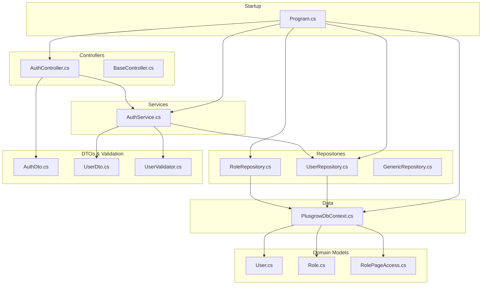
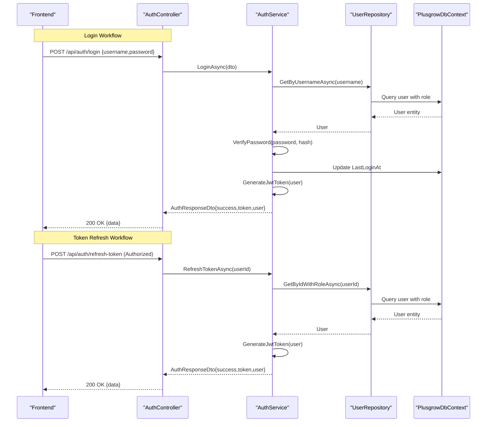
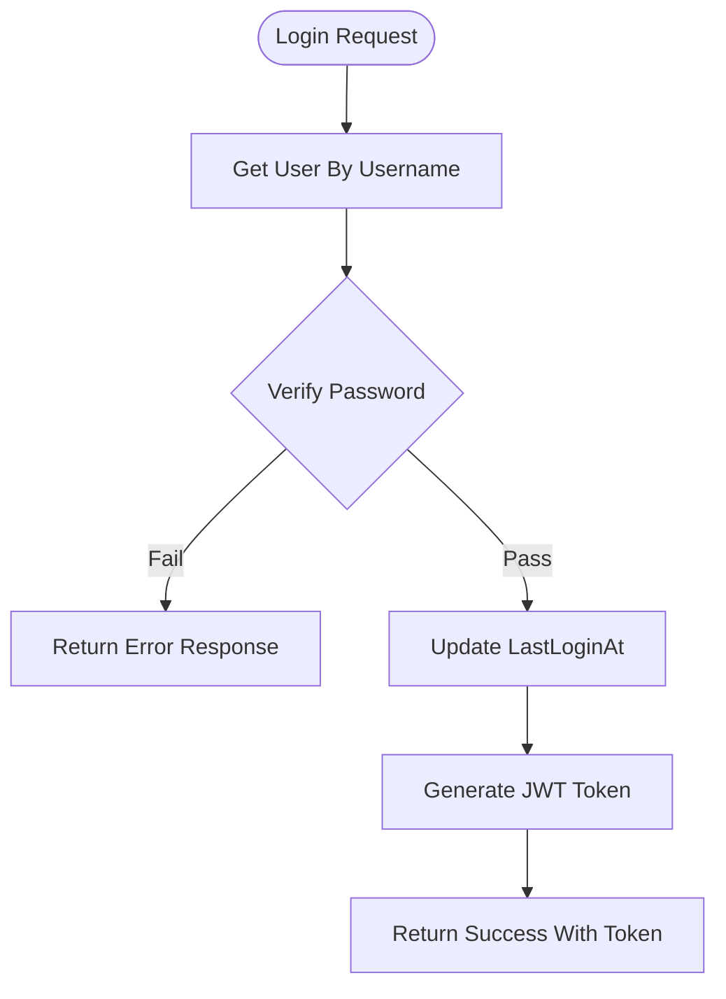
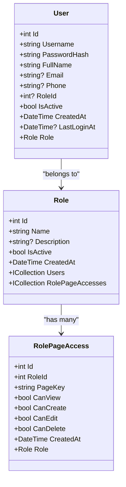
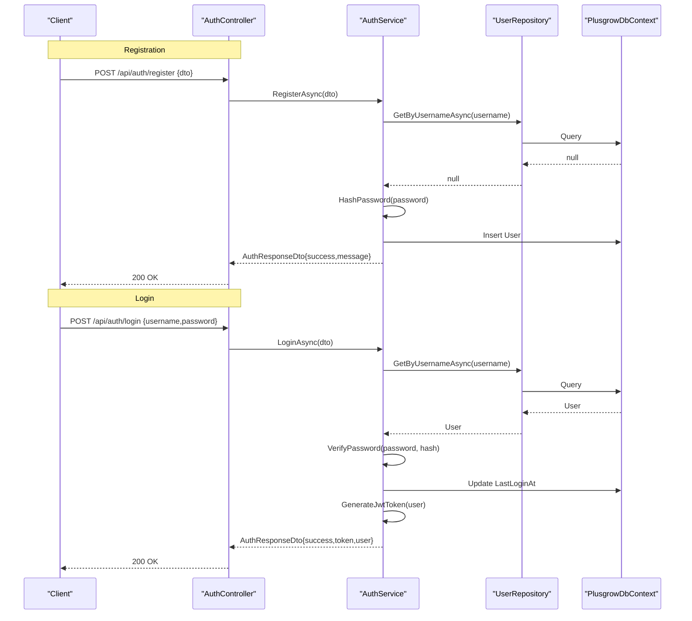
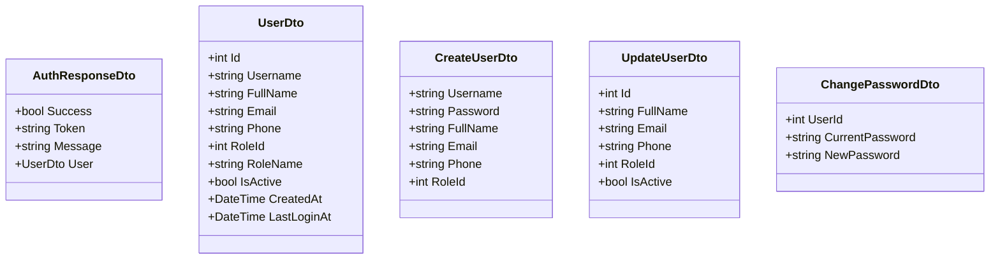
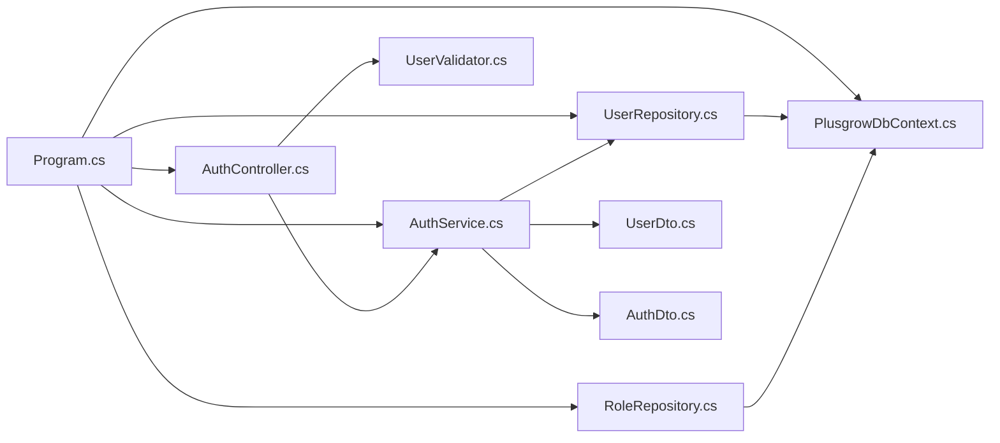

# User Management and Security

<cite>
**Referenced Files in This Document**
- [Program.cs](file://Backend/PlusgrowWms.Api/Program.cs)
- [AuthController.cs](file://Backend/PlusgrowWms.Api/Controllers/AuthController.cs)
- [BaseController.cs](file://Backend/PlusgrowWms.Api/Controllers/BaseController.cs)
- [AuthService.cs](file://Backend/PlusgrowWms.Api/Services/AuthService.cs)
- [UserRepository.cs](file://Backend/PlusgrowWms.Api/Repositories/UserRepository.cs)
- [RoleRepository.cs](file://Backend/PlusgrowWms.Api/Repositories/RoleRepository.cs)
- [GenericRepository.cs](file://Backend/PlusgrowWms.Api/Repositories/GenericRepository.cs)
- [PlusgrowDbContext.cs](file://Backend/PlusgrowWms.Api/Data/PlusgrowDbContext.cs)
- [AuthDto.cs](file://Backend/PlusgrowWms.Api/DTOs/AuthDto.cs)
- [UserDto.cs](file://Backend/PlusgrowWms.Api/DTOs/UserDto.cs)
- [UserValidator.cs](file://Backend/PlusgrowWms.Api/Validators/UserValidator.cs)
- [User.cs](file://Backend/PlusgrowWms.Api/Models/User.cs)
- [Role.cs](file://Backend/PlusgrowWms.Api/Models/Role.cs)
- [RolePageAccess.cs](file://Backend/PlusgrowWms.Api/Models/RolePageAccess.cs)
</cite>

## Table of Contents
1. [Introduction](#introduction)
2. [Project Structure](#project-structure)
3. [Core Components](#core-components)
4. [Architecture Overview](#architecture-overview)
5. [Detailed Component Analysis](#detailed-component-analysis)
6. [Dependency Analysis](#dependency-analysis)
7. [Performance Considerations](#performance-considerations)
8. [Troubleshooting Guide](#troubleshooting-guide)
9. [Conclusion](#conclusion)
10. [Appendices](#appendices)

## Introduction
This document provides comprehensive documentation for the PlusGrow WMS user management and security systems. It covers JWT authentication (token generation, validation, and refresh), role-based access control (RBAC) with roles and page-level permissions, user registration and login workflows, password security, session management, DTO structures, validation rules, and secure data handling. It also explains how frontend authentication state integrates with backend authorization and outlines best practices, input validation, data protection, and audit trail considerations.

## Project Structure
The backend follows a layered architecture:
- Entry point configures services, authentication, authorization, and middleware pipeline.
- Controllers expose endpoints for authentication and user-related operations.
- Services encapsulate business logic for authentication and user management.
- Repositories handle data access with generic and specialized implementations.
- Models define domain entities and relationships.
- DTOs standardize data transfer and validation rules via FluentValidation.
- DbContext configures database schema, indexes, and relationships.

**Diagram sources**
- [Program.cs:1-107](file://Backend/PlusgrowWms.Api/Program.cs#L1-L107)
- [AuthController.cs:1-170](file://Backend/PlusgrowWms.Api/Controllers/AuthController.cs#L1-L170)
- [BaseController.cs:1-69](file://Backend/PlusgrowWms.Api/Controllers/BaseController.cs#L1-L69)
- [AuthService.cs:1-236](file://Backend/PlusgrowWms.Api/Services/AuthService.cs#L1-L236)
- [UserRepository.cs:1-68](file://Backend/PlusgrowWms.Api/Repositories/UserRepository.cs#L1-L68)
- [RoleRepository.cs:1-71](file://Backend/PlusgrowWms.Api/Repositories/RoleRepository.cs#L1-L71)
- [GenericRepository.cs:1-117](file://Backend/PlusgrowWms.Api/Repositories/GenericRepository.cs#L1-L117)
- [PlusgrowDbContext.cs:1-78](file://Backend/PlusgrowWms.Api/Data/PlusgrowDbContext.cs#L1-L78)
- [AuthDto.cs:1-24](file://Backend/PlusgrowWms.Api/DTOs/AuthDto.cs#L1-L24)
- [UserDto.cs:1-43](file://Backend/PlusgrowWms.Api/DTOs/UserDto.cs#L1-L43)
- [UserValidator.cs:1-64](file://Backend/PlusgrowWms.Api/Validators/UserValidator.cs#L1-L64)

**Section sources**
- [Program.cs:1-107](file://Backend/PlusgrowWms.Api/Program.cs#L1-L107)

## Core Components
- JWT Authentication: Configured in the startup pipeline with issuer, audience, signing key, and lifetime validation. Tokens are generated by the service and validated by the framework.
- Auth Controller: Exposes login, register, profile retrieval, password change, and token refresh endpoints with appropriate authorization attributes.
- Auth Service: Implements login, registration, password hashing/verification, token generation, and token refresh. Also retrieves user info with role details.
- Repositories: Generic repository pattern plus specialized repositories for users and roles. Includes role-page access management.
- Domain Models: User, Role, and RolePageAccess define RBAC and page-level permissions.
- DTOs and Validation: Strongly typed DTOs for requests/responses and FluentValidation rules for input validation.
- Data Access: DbContext defines schema, indexes, and relationships.

**Section sources**
- [Program.cs:44-64](file://Backend/PlusgrowWms.Api/Program.cs#L44-L64)
- [AuthController.cs:22-170](file://Backend/PlusgrowWms.Api/Controllers/AuthController.cs#L22-L170)
- [AuthService.cs:39-234](file://Backend/PlusgrowWms.Api/Services/AuthService.cs#L39-L234)
- [UserRepository.cs:7-68](file://Backend/PlusgrowWms.Api/Repositories/UserRepository.cs#L7-L68)
- [RoleRepository.cs:7-71](file://Backend/PlusgrowWms.Api/Repositories/RoleRepository.cs#L7-L71)
- [User.cs:6-51](file://Backend/PlusgrowWms.Api/Models/User.cs#L6-L51)
- [Role.cs:6-31](file://Backend/PlusgrowWms.Api/Models/Role.cs#L6-L31)
- [RolePageAccess.cs:6-39](file://Backend/PlusgrowWms.Api/Models/RolePageAccess.cs#L6-L39)
- [AuthDto.cs:3-24](file://Backend/PlusgrowWms.Api/DTOs/AuthDto.cs#L3-L24)
- [UserDto.cs:3-43](file://Backend/PlusgrowWms.Api/DTOs/UserDto.cs#L3-L43)
- [UserValidator.cs:6-64](file://Backend/PlusgrowWms.Api/Validators/UserValidator.cs#L6-L64)
- [PlusgrowDbContext.cs:20-78](file://Backend/PlusgrowWms.Api/Data/PlusgrowDbContext.cs#L20-L78)

## Architecture Overview
The system enforces authentication and authorization at the application level:
- Startup configures JWT bearer authentication and global authorization.
- Controllers require authorization for protected endpoints and allow anonymous for login/register.
- Services encapsulate business logic and rely on repositories for persistence.
- DTOs and validators ensure clean, validated data transfer.

**Diagram sources**
- [AuthController.cs:25-43](file://Backend/PlusgrowWms.Api/Controllers/AuthController.cs#L25-L43)
- [AuthController.cs:141-158](file://Backend/PlusgrowWms.Api/Controllers/AuthController.cs#L141-L158)
- [AuthService.cs:39-103](file://Backend/PlusgrowWms.Api/Services/AuthService.cs#L39-L103)
- [AuthService.cs:207-234](file://Backend/PlusgrowWms.Api/Services/AuthService.cs#L207-L234)
- [UserRepository.cs:31-43](file://Backend/PlusgrowWms.Api/Repositories/UserRepository.cs#L31-L43)
- [PlusgrowDbContext.cs:16-18](file://Backend/PlusgrowWms.Api/Data/PlusgrowDbContext.cs#L16-L18)

## Detailed Component Analysis

### JWT Authentication Implementation
- Configuration: Startup sets issuer, audience, signing key, and validation parameters for JWT bearer authentication.
- Token Generation: Service constructs claims including user identity, role, and role ID, then signs and issues a JWT with configured expiry.
- Token Validation: Middleware validates issuer, audience, signature, and lifetime during request processing.
- Token Refresh: Controller endpoint accepts an authorized request and regenerates a new token for the current user.

**Diagram sources**
- [AuthService.cs:39-103](file://Backend/PlusgrowWms.Api/Services/AuthService.cs#L39-L103)
- [AuthService.cs:144-168](file://Backend/PlusgrowWms.Api/Services/AuthService.cs#L144-L168)
- [UserRepository.cs:38-43](file://Backend/PlusgrowWms.Api/Repositories/UserRepository.cs#L38-L43)

**Section sources**
- [Program.cs:44-64](file://Backend/PlusgrowWms.Api/Program.cs#L44-L64)
- [AuthService.cs:144-168](file://Backend/PlusgrowWms.Api/Services/AuthService.cs#L144-L168)
- [AuthService.cs:39-103](file://Backend/PlusgrowWms.Api/Services/AuthService.cs#L39-L103)

### Role-Based Access Control (RBAC)
- Roles and Users: Many-to-one relationship from User to Role.
- Page-Level Permissions: RolePageAccess defines granular permissions per role and page key.
- Authorization Model: Claims include role name and role ID; page-level checks can be enforced by controllers or services using RolePageAccess data.

**Diagram sources**
- [User.cs:6-51](file://Backend/PlusgrowWms.Api/Models/User.cs#L6-L51)
- [Role.cs:6-31](file://Backend/PlusgrowWms.Api/Models/Role.cs#L6-L31)
- [RolePageAccess.cs:6-39](file://Backend/PlusgrowWms.Api/Models/RolePageAccess.cs#L6-L39)

**Section sources**
- [PlusgrowDbContext.cs:16-18](file://Backend/PlusgrowWms.Api/Data/PlusgrowDbContext.cs#L16-L18)
- [RoleRepository.cs:32-37](file://Backend/PlusgrowWms.Api/Repositories/RoleRepository.cs#L32-L37)
- [RoleRepository.cs:57-69](file://Backend/PlusgrowWms.Api/Repositories/RoleRepository.cs#L57-L69)

### User Registration and Login Workflows
- Registration: Validates DTO via FluentValidation, checks uniqueness, hashes password, persists user, and returns success.
- Login: Finds user by username, verifies password, updates last login, generates token, and returns user info with token.
- Password Security: Uses BCrypt with a strong work factor for hashing and verification.

**Diagram sources**
- [AuthController.cs:48-77](file://Backend/PlusgrowWms.Api/Controllers/AuthController.cs#L48-L77)
- [AuthController.cs:25-43](file://Backend/PlusgrowWms.Api/Controllers/AuthController.cs#L25-L43)
- [AuthService.cs:105-142](file://Backend/PlusgrowWms.Api/Services/AuthService.cs#L105-L142)
- [AuthService.cs:39-103](file://Backend/PlusgrowWms.Api/Services/AuthService.cs#L39-L103)
- [UserRepository.cs:38-43](file://Backend/PlusgrowWms.Api/Repositories/UserRepository.cs#L38-L43)

**Section sources**
- [AuthController.cs:48-77](file://Backend/PlusgrowWms.Api/Controllers/AuthController.cs#L48-L77)
- [AuthController.cs:25-43](file://Backend/PlusgrowWms.Api/Controllers/AuthController.cs#L25-L43)
- [AuthService.cs:105-142](file://Backend/PlusgrowWms.Api/Services/AuthService.cs#L105-L142)
- [AuthService.cs:39-103](file://Backend/PlusgrowWms.Api/Services/AuthService.cs#L39-L103)
- [UserValidator.cs:6-64](file://Backend/PlusgrowWms.Api/Validators/UserValidator.cs#L6-L64)

### Password Security Measures
- Hashing: BCrypt with a high work factor ensures robust password hashing.
- Verification: During login and password change verification, BCrypt compares provided password against stored hash.
- Storage: Only password hashes are persisted; raw passwords are never stored.

**Section sources**
- [AuthService.cs:170-179](file://Backend/PlusgrowWms.Api/Services/AuthService.cs#L170-L179)
- [AuthService.cs:201-205](file://Backend/PlusgrowWms.Api/Services/AuthService.cs#L201-L205)

### Session Management
- Stateless JWT: Authentication is stateless; server does not maintain sessions. Token expiration is enforced by the framework.
- Refresh Token: Endpoint allows authorized users to obtain a new token without re-authenticating.
- Last Login Tracking: On successful login, the last login timestamp is updated for auditing.

**Section sources**
- [AuthService.cs:75-78](file://Backend/PlusgrowWms.Api/Services/AuthService.cs#L75-L78)
- [AuthController.cs:141-158](file://Backend/PlusgrowWms.Api/Controllers/AuthController.cs#L141-L158)
- [AuthService.cs:207-234](file://Backend/PlusgrowWms.Api/Services/AuthService.cs#L207-L234)

### DTO Structures and Validation
- DTOs:
  - Login, AuthResponse, JwtSettings
  - User, CreateUser, UpdateUser, ChangePassword
- Validation:
  - FluentValidation rules enforce field presence, length, format, and constraints.
  - Auto-validation is enabled in startup.

**Diagram sources**
- [AuthDto.cs:3-24](file://Backend/PlusgrowWms.Api/DTOs/AuthDto.cs#L3-L24)
- [UserDto.cs:3-43](file://Backend/PlusgrowWms.Api/DTOs/UserDto.cs#L3-L43)

**Section sources**
- [AuthDto.cs:3-24](file://Backend/PlusgrowWms.Api/DTOs/AuthDto.cs#L3-L24)
- [UserDto.cs:3-43](file://Backend/PlusgrowWms.Api/DTOs/UserDto.cs#L3-L43)
- [UserValidator.cs:6-64](file://Backend/PlusgrowWms.Api/Validators/UserValidator.cs#L6-L64)
- [Program.cs:40-42](file://Backend/PlusgrowWms.Api/Program.cs#L40-L42)

### Secure Data Handling Practices
- Input Validation: DTOs validated via FluentValidation; controllers also apply basic checks.
- Password Handling: Hashing with BCrypt; no logging of raw passwords.
- Logging: Structured logging with sensitive data redacted; failures logged with minimal details.
- Indexes: Unique indexes on usernames and role names; composite unique index on role-page access.

**Section sources**
- [UserValidator.cs:6-64](file://Backend/PlusgrowWms.Api/Validators/UserValidator.cs#L6-L64)
- [AuthService.cs:41-102](file://Backend/PlusgrowWms.Api/Services/AuthService.cs#L41-L102)
- [PlusgrowDbContext.cs:40-69](file://Backend/PlusgrowWms.Api/Data/PlusgrowDbContext.cs#L40-L69)

### Administrative Functions and Profile Editing
- Profile Retrieval: Authorized endpoint returns current user profile.
- Password Change: Requires current password verification via login, then updates hash.
- User Management: Role and page access management via RoleRepository supports administrative control.

**Section sources**
- [AuthController.cs:82-99](file://Backend/PlusgrowWms.Api/Controllers/AuthController.cs#L82-L99)
- [AuthController.cs:104-136](file://Backend/PlusgrowWms.Api/Controllers/AuthController.cs#L104-L136)
- [RoleRepository.cs:57-69](file://Backend/PlusgrowWms.Api/Repositories/RoleRepository.cs#L57-L69)

### Frontend-Backend Authorization Integration
- Authorization Attribute: Controllers use [Authorize] to protect endpoints; [AllowAnonymous] for login/register.
- Frontend State: Typically stores JWT returned by login; attaches Authorization header for protected requests; handles token refresh on expiration.

[No sources needed since this section explains conceptual integration without analyzing specific files]

## Dependency Analysis
The system exhibits clear separation of concerns:
- Startup depends on configuration and registers services, repositories, JWT, and validation.
- Controllers depend on services for business logic.
- Services depend on repositories for persistence.
- Repositories depend on DbContext for data operations.
- DTOs and validators are decoupled and reusable.

**Diagram sources**
- [Program.cs:25-42](file://Backend/PlusgrowWms.Api/Program.cs#L25-L42)
- [AuthController.cs:13-20](file://Backend/PlusgrowWms.Api/Controllers/AuthController.cs#L13-L20)
- [AuthService.cs:25-37](file://Backend/PlusgrowWms.Api/Services/AuthService.cs#L25-L37)
- [UserRepository.cs:17-21](file://Backend/PlusgrowWms.Api/Repositories/UserRepository.cs#L17-L21)
- [RoleRepository.cs:18-22](file://Backend/PlusgrowWms.Api/Repositories/RoleRepository.cs#L18-L22)
- [PlusgrowDbContext.cs:6-18](file://Backend/PlusgrowWms.Api/Data/PlusgrowDbContext.cs#L6-L18)
- [UserDto.cs:1-43](file://Backend/PlusgrowWms.Api/DTOs/UserDto.cs#L1-L43)
- [AuthDto.cs:1-24](file://Backend/PlusgrowWms.Api/DTOs/AuthDto.cs#L1-L24)
- [UserValidator.cs:1-64](file://Backend/PlusgrowWms.Api/Validators/UserValidator.cs#L1-L64)

**Section sources**
- [Program.cs:25-42](file://Backend/PlusgrowWms.Api/Program.cs#L25-L42)
- [AuthService.cs:25-37](file://Backend/PlusgrowWms.Api/Services/AuthService.cs#L25-L37)
- [UserRepository.cs:17-21](file://Backend/PlusgrowWms.Api/Repositories/UserRepository.cs#L17-L21)
- [RoleRepository.cs:18-22](file://Backend/PlusgrowWms.Api/Repositories/RoleRepository.cs#L18-L22)

## Performance Considerations
- Indexes: Unique indexes on usernames, role names, and composite role-page access improve lookup performance.
- Lazy Loading: Role navigation is included in queries; consider projection to DTOs to reduce payload size.
- Token Expiry: Short to moderate expiry reduces long-lived token risk; refresh endpoint minimizes re-auth frequency.
- Logging: Structured logging avoids excessive I/O; sensitive fields are not logged.

[No sources needed since this section provides general guidance]

## Troubleshooting Guide
Common issues and resolutions:
- Invalid Credentials: Login returns failure; verify username/password and ensure account is active.
- Account Inactive: Login blocked if IsActive is false; contact administrator to activate.
- Password Change Failure: Ensure current password matches; new password must differ and meet minimum length.
- Token Validation Errors: Confirm issuer, audience, and signing key match configuration; check clock skew.
- Registration Conflicts: Username must be unique; resolve duplicates before retrying.
- Authorization Failures: Ensure Authorization header is present for protected endpoints; refresh token if expired.

**Section sources**
- [AuthService.cs:45-73](file://Backend/PlusgrowWms.Api/Services/AuthService.cs#L45-L73)
- [AuthService.cs:110-117](file://Backend/PlusgrowWms.Api/Services/AuthService.cs#L110-L117)
- [AuthController.cs:114-125](file://Backend/PlusgrowWms.Api/Controllers/AuthController.cs#L114-L125)
- [Program.cs:49-62](file://Backend/PlusgrowWms.Api/Program.cs#L49-L62)

## Conclusion
PlusGrow WMS implements a robust, standards-compliant authentication and authorization system. JWT provides stateless, scalable authentication with secure password handling and structured DTOs with validation. RBAC with role-page access enables fine-grained permissions. The layered architecture promotes maintainability, testability, and clear separation of concerns. Following the outlined best practices ensures secure, reliable user management and seamless frontend-backend integration.

## Appendices
- Audit Trail: Track login attempts, password changes, and token refreshes via structured logs.
- Configuration: Ensure Jwt settings are externalized and rotated periodically.
- Testing: Unit tests for validators and service methods; integration tests for controller endpoints.

[No sources needed since this section provides general guidance]