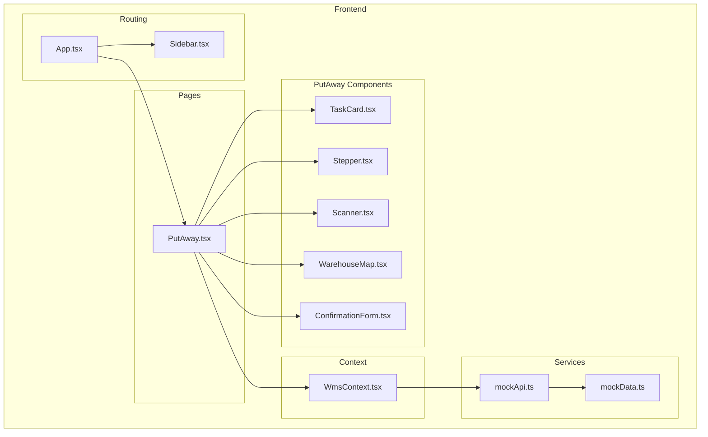
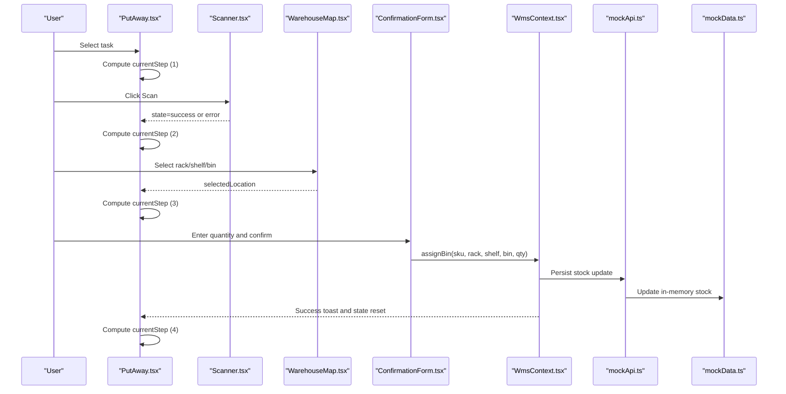
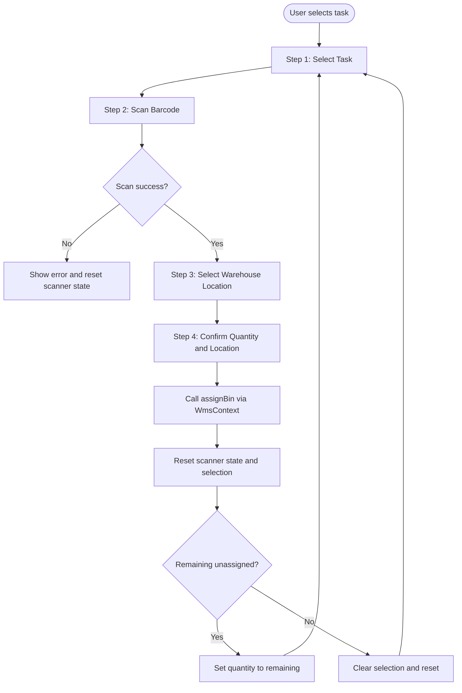
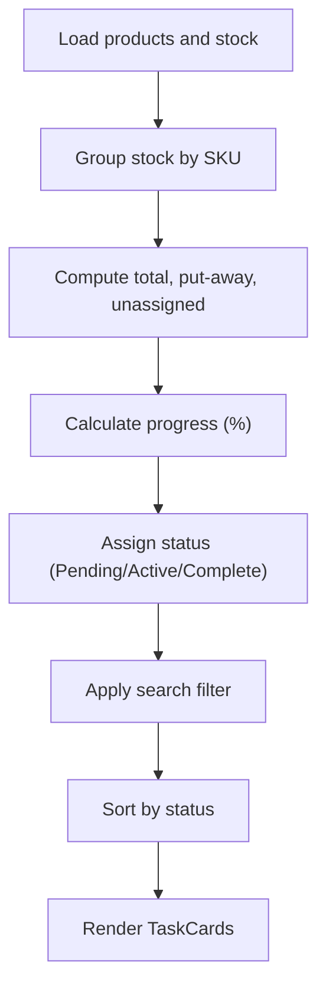
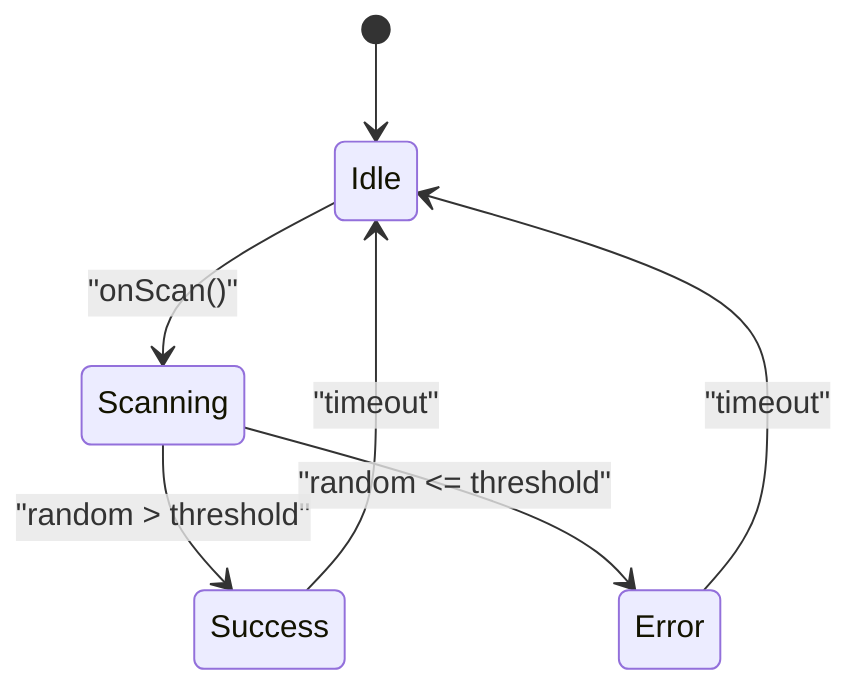
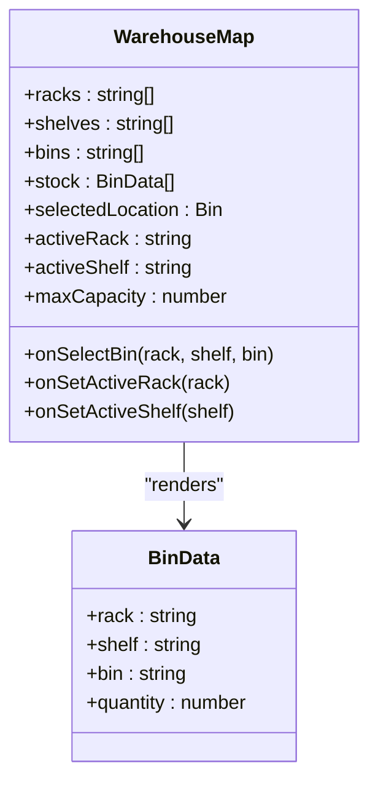
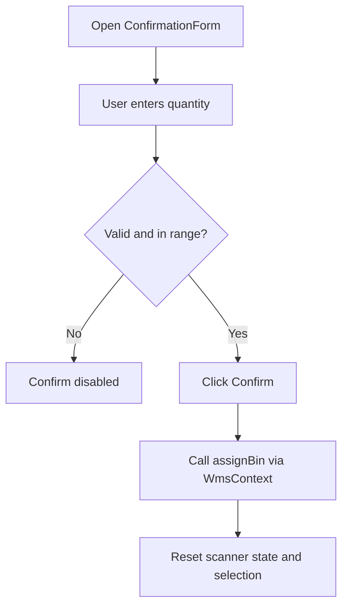
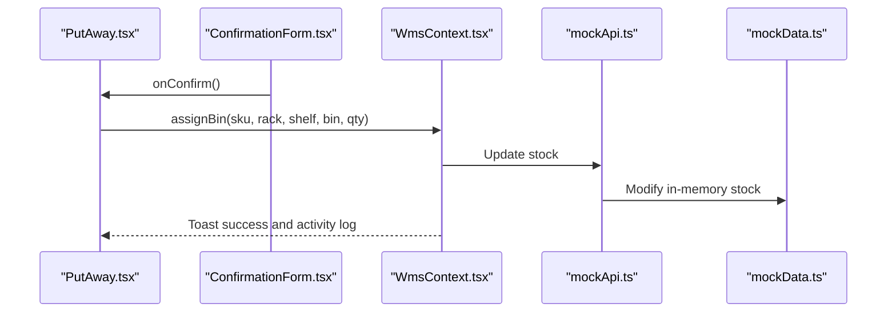
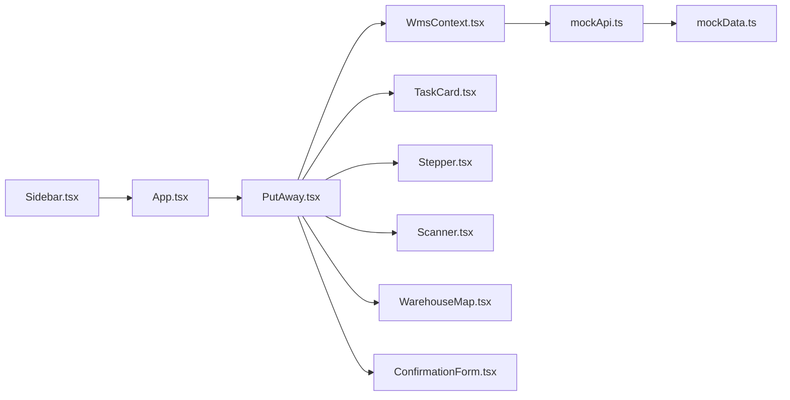

# Put-Away Operations

<cite>
**Referenced Files in This Document**
- [PutAway.tsx](file://Frontend/src/pages/PutAway/PutAway.tsx)
- [TaskCard.tsx](file://Frontend/src/pages/PutAway/components/TaskCard.tsx)
- [Stepper.tsx](file://Frontend/src/pages/PutAway/components/Stepper.tsx)
- [Scanner.tsx](file://Frontend/src/pages/PutAway/components/Scanner.tsx)
- [WarehouseMap.tsx](file://Frontend/src/pages/PutAway/components/WarehouseMap.tsx)
- [ConfirmationForm.tsx](file://Frontend/src/pages/PutAway/components/ConfirmationForm.tsx)
- [WmsContext.tsx](file://Frontend/src/context/WmsContext.tsx)
- [mockApi.ts](file://Frontend/src/services/mockApi.ts)
- [mockData.ts](file://Frontend/src/services/mockData.ts)
- [App.tsx](file://Frontend/src/App.tsx)
- [Sidebar.tsx](file://Frontend/src/components/organisms/Navigation/Sidebar/Sidebar.tsx)
- [index.ts](file://Frontend/src/pages/PutAway/components/index.ts)
</cite>

## Table of Contents
1. [Introduction](#introduction)
2. [Project Structure](#project-structure)
3. [Core Components](#core-components)
4. [Architecture Overview](#architecture-overview)
5. [Detailed Component Analysis](#detailed-component-analysis)
6. [Dependency Analysis](#dependency-analysis)
7. [Performance Considerations](#performance-considerations)
8. [Troubleshooting Guide](#troubleshooting-guide)
9. [Conclusion](#conclusion)
10. [Appendices](#appendices)

## Introduction
This document explains the put-away operations workflow in PlusGrow WMS. It covers the four-step process: task selection, barcode scanning verification, warehouse location assignment, and confirmation. It documents the task management system that tracks pending items, calculates progress percentages, and manages workflow states. It also describes the barcode scanning integration with simulated scanning logic, error handling, and success/failure states; the warehouse mapping interface for rack/shelf/bin allocation with capacity management and visual feedback; and the confirmation form for quantity assignment, location verification, and finalization. Finally, it outlines user workflows, state management patterns, component interactions, and integration with the WMS context for data persistence.

## Project Structure
The put-away feature is implemented as a dedicated page with modular components and a shared WMS context provider. The page orchestrates state, renders the task directory, and drives the workflow canvas. Components encapsulate UI and behavior for scanning, warehouse mapping, and confirmation.

**Diagram sources**
- [PutAway.tsx:1-462](file://Frontend/src/pages/PutAway/PutAway.tsx#L1-L462)
- [TaskCard.tsx:1-143](file://Frontend/src/pages/PutAway/components/TaskCard.tsx#L1-L143)
- [Stepper.tsx:1-93](file://Frontend/src/pages/PutAway/components/Stepper.tsx#L1-L93)
- [Scanner.tsx:1-118](file://Frontend/src/pages/PutAway/components/Scanner.tsx#L1-L118)
- [WarehouseMap.tsx:1-217](file://Frontend/src/pages/PutAway/components/WarehouseMap.tsx#L1-L217)
- [ConfirmationForm.tsx:1-141](file://Frontend/src/pages/PutAway/components/ConfirmationForm.tsx#L1-L141)
- [WmsContext.tsx:1-234](file://Frontend/src/context/WmsContext.tsx#L1-L234)
- [mockApi.ts:1-32](file://Frontend/src/services/mockApi.ts#L1-L32)
- [mockData.ts:1-39](file://Frontend/src/services/mockData.ts#L1-L39)
- [App.tsx:1-172](file://Frontend/src/App.tsx#L1-L172)
- [Sidebar.tsx:1-331](file://Frontend/src/components/organisms/Navigation/Sidebar/Sidebar.tsx#L1-L331)

**Section sources**
- [PutAway.tsx:1-462](file://Frontend/src/pages/PutAway/PutAway.tsx#L1-L462)
- [index.ts:1-12](file://Frontend/src/pages/PutAway/components/index.ts#L1-L12)
- [App.tsx:111-115](file://Frontend/src/App.tsx#L111-L115)
- [Sidebar.tsx:77](file://Frontend/src/components/organisms/Navigation/Sidebar/Sidebar.tsx#L77)

## Core Components
- PutAway page orchestrates state, computes tasks, determines current step, and renders the workflow canvas.
- TaskCard displays pending items with status, progress bar, and stats.
- Stepper visually indicates the current step in the four-step workflow.
- Scanner simulates barcode scanning with idle/scanning/success/error states and visual feedback.
- WarehouseMap shows rack/shelf/bin grid with capacity indicators and selection UX.
- ConfirmationForm validates quantity, shows product/location details, and triggers finalization.

**Section sources**
- [PutAway.tsx:47-220](file://Frontend/src/pages/PutAway/PutAway.tsx#L47-L220)
- [TaskCard.tsx:11-143](file://Frontend/src/pages/PutAway/components/TaskCard.tsx#L11-L143)
- [Stepper.tsx:16-92](file://Frontend/src/pages/PutAway/components/Stepper.tsx#L16-L92)
- [Scanner.tsx:11-117](file://Frontend/src/pages/PutAway/components/Scanner.tsx#L11-L117)
- [WarehouseMap.tsx:24-216](file://Frontend/src/pages/PutAway/components/WarehouseMap.tsx#L24-L216)
- [ConfirmationForm.tsx:20-140](file://Frontend/src/pages/PutAway/components/ConfirmationForm.tsx#L20-L140)

## Architecture Overview
The put-away workflow is driven by the PutAway page, which composes smaller components and interacts with the WMS context for data updates. The context exposes assignBin to persist changes to stock. Mock APIs and mock data simulate backend behavior during development.

**Diagram sources**
- [PutAway.tsx:132-202](file://Frontend/src/pages/PutAway/PutAway.tsx#L132-L202)
- [Scanner.tsx:54-117](file://Frontend/src/pages/PutAway/components/Scanner.tsx#L54-L117)
- [WarehouseMap.tsx:47-216](file://Frontend/src/pages/PutAway/components/WarehouseMap.tsx#L47-L216)
- [ConfirmationForm.tsx:36-140](file://Frontend/src/pages/PutAway/components/ConfirmationForm.tsx#L36-L140)
- [WmsContext.tsx:160-194](file://Frontend/src/context/WmsContext.tsx#L160-L194)
- [mockApi.ts:6-31](file://Frontend/src/services/mockApi.ts#L6-L31)
- [mockData.ts:24-33](file://Frontend/src/services/mockData.ts#L24-L33)

## Detailed Component Analysis

### PutAway Page (Workflow Orchestrator)
- State management:
  - Tracks view mode, search query, selected SKU, scanner state, active rack/shelf, selected location, and assigned quantity.
- Task computation:
  - Builds tasks from products and stock, computing totals, unassigned quantities, put-away amounts, progress percentages, and status.
  - Filters and sorts tasks by status order.
- Workflow state:
  - Determines current step based on selected SKU, scanner state, and selected location.
  - Computes overall pipeline progress across all tasks.
- Handlers:
  - Select task resets scanner state and clears selection.
  - Scan simulates verification with random success probability and shows toasts.
  - Select bin updates active rack/shelf and selection.
  - Confirm validates quantity, calls assignBin, triggers animations, and resets state.
  - Rescan resets scanner state and quantity to unassigned.
- Rendering:
  - Shows empty state when no tasks are pending.
  - Renders header with progress and search controls.
  - Renders task directory and workflow canvas with dynamic step content.

**Diagram sources**
- [PutAway.tsx:132-202](file://Frontend/src/pages/PutAway/PutAway.tsx#L132-L202)
- [WmsContext.tsx:160-194](file://Frontend/src/context/WmsContext.tsx#L160-L194)

**Section sources**
- [PutAway.tsx:47-220](file://Frontend/src/pages/PutAway/PutAway.tsx#L47-L220)
- [PutAway.tsx:204-219](file://Frontend/src/pages/PutAway/PutAway.tsx#L204-L219)
- [PutAway.tsx:221-459](file://Frontend/src/pages/PutAway/PutAway.tsx#L221-L459)

### Task Management System
- Task calculation:
  - Aggregates stock by SKU to compute total, put-away, and unassigned quantities.
  - Calculates progress percentage and assigns status (Pending, Active, Complete).
- Sorting and filtering:
  - Filters by search query on title or SKU.
  - Sorts by status precedence: Pending > Active > Complete.
- Progress tracking:
  - Provides per-task progress and overall pipeline progress across all tasks.

**Diagram sources**
- [PutAway.tsx:65-101](file://Frontend/src/pages/PutAway/PutAway.tsx#L65-L101)

**Section sources**
- [PutAway.tsx:65-101](file://Frontend/src/pages/PutAway/PutAway.tsx#L65-L101)
- [TaskCard.tsx:28-50](file://Frontend/src/pages/PutAway/components/TaskCard.tsx#L28-L50)

### Barcode Scanning Integration
- States:
  - idle: Prompt to scan with manual entry option.
  - scanning: Animated scanning overlay with spinner.
  - success: Verified match with bounce animation.
  - error: Invalid barcode with retry prompt.
- Simulated logic:
  - Random success probability with delayed state transitions.
  - Toast notifications for success and error.
- UX:
  - Disabled interactions during scanning.
  - Visual feedback for each state.

**Diagram sources**
- [Scanner.tsx:19-52](file://Frontend/src/pages/PutAway/components/Scanner.tsx#L19-L52)
- [PutAway.tsx:139-152](file://Frontend/src/pages/PutAway/PutAway.tsx#L139-L152)

**Section sources**
- [Scanner.tsx:11-117](file://Frontend/src/pages/PutAway/components/Scanner.tsx#L11-L117)
- [PutAway.tsx:139-152](file://Frontend/src/pages/PutAway/PutAway.tsx#L139-L152)

### Warehouse Mapping Interface
- Grid layout:
  - Rack selector buttons.
  - Shelf headers with active state indication.
  - Bin grid with capacity visualization and quantity badges.
- Capacity management:
  - Color-coded capacity bands (0–50%, 51–80%, 81%+).
  - Horizontal capacity bar inside each bin.
- Interaction:
  - Selecting a bin sets the selected location and highlights selection.
  - Active shelf affects visibility and interactivity of bins.
  - Selected location display confirms chosen rack/shelf/bin.

**Diagram sources**
- [WarehouseMap.tsx:24-60](file://Frontend/src/pages/PutAway/components/WarehouseMap.tsx#L24-L60)
- [WarehouseMap.tsx:11-22](file://Frontend/src/pages/PutAway/components/WarehouseMap.tsx#L11-L22)

**Section sources**
- [WarehouseMap.tsx:24-216](file://Frontend/src/pages/PutAway/components/WarehouseMap.tsx#L24-L216)

### Confirmation Form
- Inputs:
  - Product info card with SKU and title.
  - Location display showing rack/shelf/bin path.
  - Quantity input with min/max validation and “Max” shortcut.
- Actions:
  - Rescan: resets scanner state and quantity to unassigned.
  - Confirm: validates quantity bounds and triggers assignBin.
- Validation:
  - Disabled when quantity is invalid or out of bounds.

**Diagram sources**
- [ConfirmationForm.tsx:36-140](file://Frontend/src/pages/PutAway/components/ConfirmationForm.tsx#L36-L140)
- [PutAway.tsx:163-196](file://Frontend/src/pages/PutAway/PutAway.tsx#L163-L196)

**Section sources**
- [ConfirmationForm.tsx:20-140](file://Frontend/src/pages/PutAway/components/ConfirmationForm.tsx#L20-L140)
- [PutAway.tsx:163-196](file://Frontend/src/pages/PutAway/PutAway.tsx#L163-L196)

### Data Persistence and Context Integration
- WMS context:
  - Provides assignBin to persist stock movements.
  - Updates stock by moving from unassigned to target bin, merging if SKU already exists in bin.
  - Emits activity logs and shows success toasts.
- Mock integration:
  - mockApi loads initial datasets with delays.
  - mockData defines initial stock with unassigned entries for put-away.
- Routing and navigation:
  - PutAway route is registered under the “Inward Operations” group.
  - Sidebar links to the put-away page.

**Diagram sources**
- [WmsContext.tsx:160-194](file://Frontend/src/context/WmsContext.tsx#L160-L194)
- [mockApi.ts:6-31](file://Frontend/src/services/mockApi.ts#L6-L31)
- [mockData.ts:24-33](file://Frontend/src/services/mockData.ts#L24-L33)
- [App.tsx:111-115](file://Frontend/src/App.tsx#L111-L115)
- [Sidebar.tsx:77](file://Frontend/src/components/organisms/Navigation/Sidebar/Sidebar.tsx#L77)

**Section sources**
- [WmsContext.tsx:160-194](file://Frontend/src/context/WmsContext.tsx#L160-L194)
- [mockApi.ts:6-31](file://Frontend/src/services/mockApi.ts#L6-L31)
- [mockData.ts:24-33](file://Frontend/src/services/mockData.ts#L24-L33)
- [App.tsx:111-115](file://Frontend/src/App.tsx#L111-L115)
- [Sidebar.tsx:77](file://Frontend/src/components/organisms/Navigation/Sidebar/Sidebar.tsx#L77)

## Dependency Analysis
- PutAway depends on:
  - WmsContext for stock updates and data.
  - Components for rendering and user interactions.
- Components depend on:
  - Shared utilities and styling helpers.
  - Icons from lucide-react.
- Context depends on:
  - mockApi for data loading and updates.
  - mockData for initial state.
- Routing depends on:
  - App routing configuration and Sidebar navigation.

**Diagram sources**
- [PutAway.tsx:16-24](file://Frontend/src/pages/PutAway/PutAway.tsx#L16-L24)
- [WmsContext.tsx:1-4](file://Frontend/src/context/WmsContext.tsx#L1-L4)
- [mockApi.ts:1](file://Frontend/src/services/mockApi.ts#L1)
- [mockData.ts:1](file://Frontend/src/services/mockData.ts#L1)
- [App.tsx:111-115](file://Frontend/src/App.tsx#L111-L115)
- [Sidebar.tsx:77](file://Frontend/src/components/organisms/Navigation/Sidebar/Sidebar.tsx#L77)

**Section sources**
- [PutAway.tsx:16-24](file://Frontend/src/pages/PutAway/PutAway.tsx#L16-L24)
- [WmsContext.tsx:1-4](file://Frontend/src/context/WmsContext.tsx#L1-L4)
- [mockApi.ts:1](file://Frontend/src/services/mockApi.ts#L1)
- [mockData.ts:1](file://Frontend/src/services/mockData.ts#L1)
- [App.tsx:111-115](file://Frontend/src/App.tsx#L111-L115)
- [Sidebar.tsx:77](file://Frontend/src/components/organisms/Navigation/Sidebar/Sidebar.tsx#L77)

## Performance Considerations
- Memoization:
  - Tasks and active task are computed with useMemo to avoid unnecessary recalculations.
  - Individual components use memoization to prevent re-renders.
- Asynchronous data:
  - Initial data loading uses Promise.all to parallelize requests.
  - Delays simulate network latency; consider caching or pagination for larger datasets.
- Rendering:
  - Grid/list view toggles reduce DOM density for large task lists.
  - Virtualized lists could improve performance for very large inventories.
- Scrolling and overlays:
  - Sticky headers and overlays are used sparingly to minimize layout thrashing.
- Toast notifications:
  - Use lightweight toasts to avoid heavy UI updates.

[No sources needed since this section provides general guidance]

## Troubleshooting Guide
- No pending items:
  - The page shows an empty state when all items are complete. Verify stock contains unassigned entries.
- Barcode scanning errors:
  - Random failure rate is simulated. If scanning fails repeatedly, ensure the correct item is selected and try again.
- Invalid quantity:
  - The confirmation form disables confirm when quantity is invalid or out of range. Adjust quantity to match available unassigned units.
- Location selection:
  - Ensure an active shelf is selected before choosing bins. Selected location must be confirmed before proceeding to confirmation.
- Data not updating:
  - Confirm that assignBin is invoked and that the context is properly wrapped around the application.

**Section sources**
- [PutAway.tsx:204-219](file://Frontend/src/pages/PutAway/PutAway.tsx#L204-L219)
- [PutAway.tsx:139-152](file://Frontend/src/pages/PutAway/PutAway.tsx#L139-L152)
- [ConfirmationForm.tsx:133](file://Frontend/src/pages/PutAway/components/ConfirmationForm.tsx#L133)
- [WarehouseMap.tsx:166-205](file://Frontend/src/pages/PutAway/components/WarehouseMap.tsx#L166-L205)
- [WmsContext.tsx:160-194](file://Frontend/src/context/WmsContext.tsx#L160-L194)

## Conclusion
The put-away workflow in PlusGrow WMS is a streamlined, state-driven process that guides users through selecting tasks, verifying barcodes, assigning locations, and confirming quantities. The modular component architecture, combined with a robust WMS context and mock backend integration, ensures clear separation of concerns and reliable data persistence. The visual feedback, progress tracking, and capacity-aware warehouse mapping enhance operational efficiency and reduce errors.

[No sources needed since this section summarizes without analyzing specific files]

## Appendices

### User Workflows

#### Workflow 1: Complete Put-Away for a Single SKU
- Select a pending task from the directory.
- Scan the barcode; on success, proceed to location selection.
- Choose a rack/shelf/bin; review capacity and selection.
- Enter quantity and confirm; the system persists the change and resets state.

**Section sources**
- [PutAway.tsx:132-196](file://Frontend/src/pages/PutAway/PutAway.tsx#L132-L196)
- [Scanner.tsx:54-117](file://Frontend/src/pages/PutAway/components/Scanner.tsx#L54-L117)
- [WarehouseMap.tsx:166-205](file://Frontend/src/pages/PutAway/components/WarehouseMap.tsx#L166-L205)
- [ConfirmationForm.tsx:133](file://Frontend/src/pages/PutAway/components/ConfirmationForm.tsx#L133)

#### Workflow 2: Rescanning After Failure
- On scanning error, rescan to retry.
- If successful, continue to location selection and confirmation.

**Section sources**
- [PutAway.tsx:198-202](file://Frontend/src/pages/PutAway/PutAway.tsx#L198-L202)
- [Scanner.tsx:44-51](file://Frontend/src/pages/PutAway/components/Scanner.tsx#L44-L51)

#### Workflow 3: Partial Allocation
- Enter a quantity less than the unassigned amount.
- The system moves partial units and retains remaining unassigned stock.

**Section sources**
- [PutAway.tsx:163-196](file://Frontend/src/pages/PutAway/PutAway.tsx#L163-L196)
- [WmsContext.tsx:179-189](file://Frontend/src/context/WmsContext.tsx#L179-L189)

### State Management Patterns
- Controlled state updates via callbacks passed down to child components.
- Derived state computed with useMemo to optimize rendering.
- Centralized stock mutations in WmsContext for predictable updates.

**Section sources**
- [PutAway.tsx:124-129](file://Frontend/src/pages/PutAway/PutAway.tsx#L124-L129)
- [PutAway.tsx:132-196](file://Frontend/src/pages/PutAway/PutAway.tsx#L132-L196)
- [WmsContext.tsx:160-194](file://Frontend/src/context/WmsContext.tsx#L160-L194)

### Integration Notes
- The PutAway route is registered under the “Inward Operations” group in navigation.
- Sidebar provides quick access to the put-away page.

**Section sources**
- [App.tsx:111-115](file://Frontend/src/App.tsx#L111-L115)
- [Sidebar.tsx:77](file://Frontend/src/components/organisms/Navigation/Sidebar/Sidebar.tsx#L77)