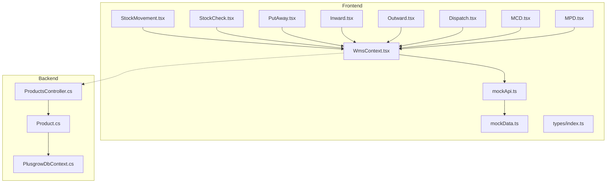
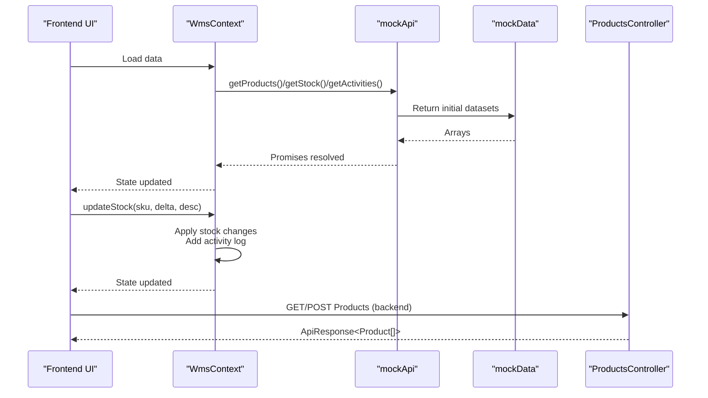
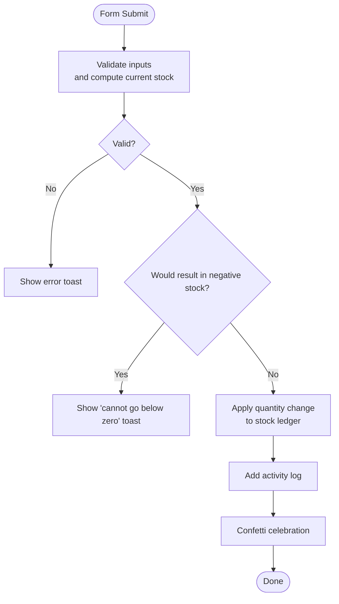
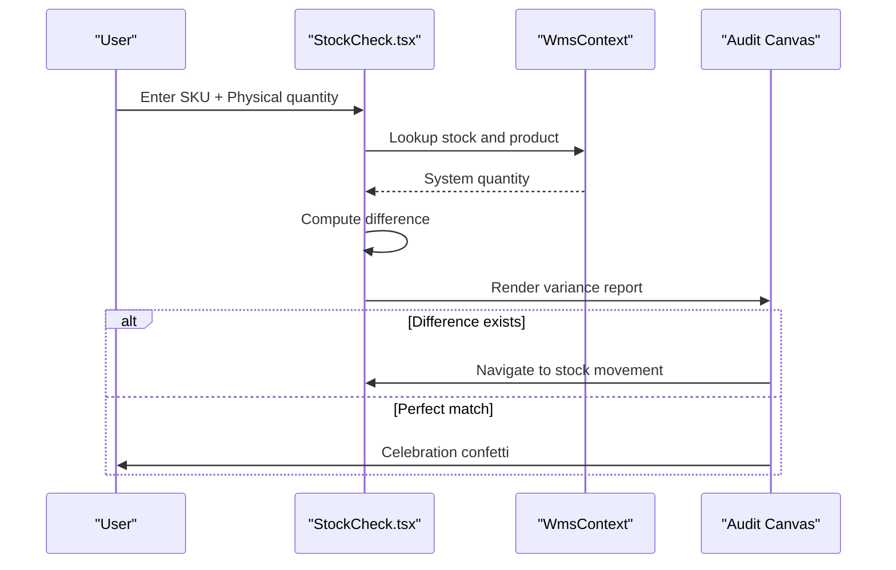
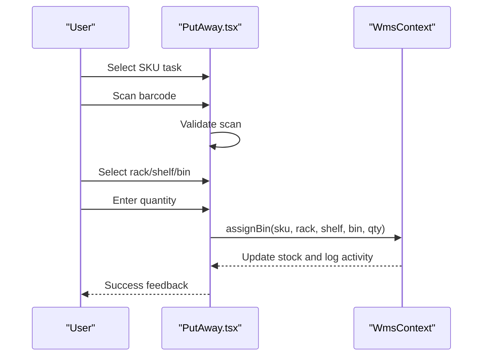
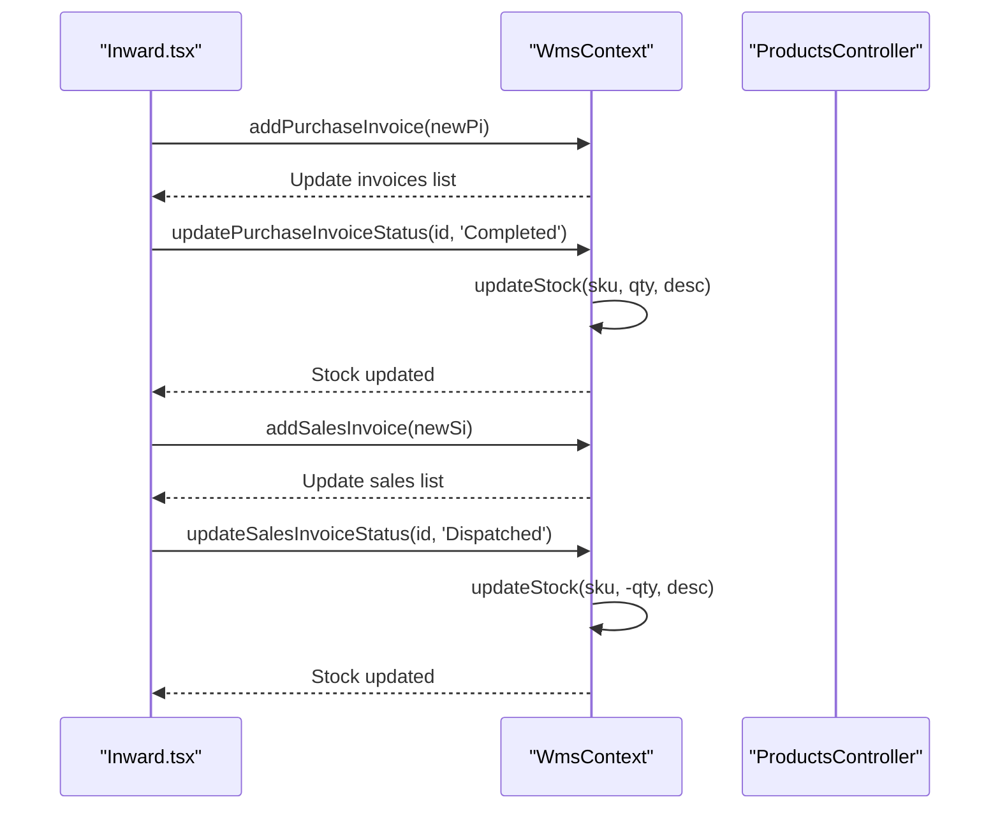
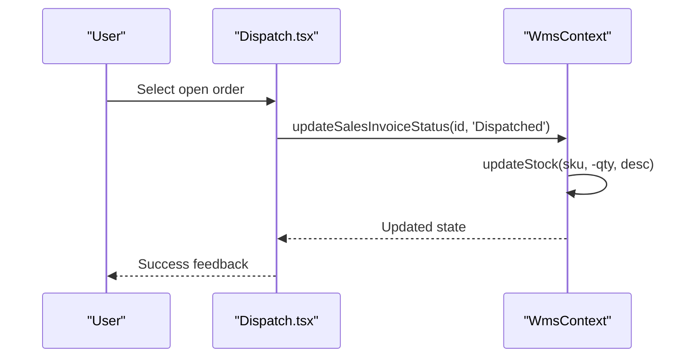
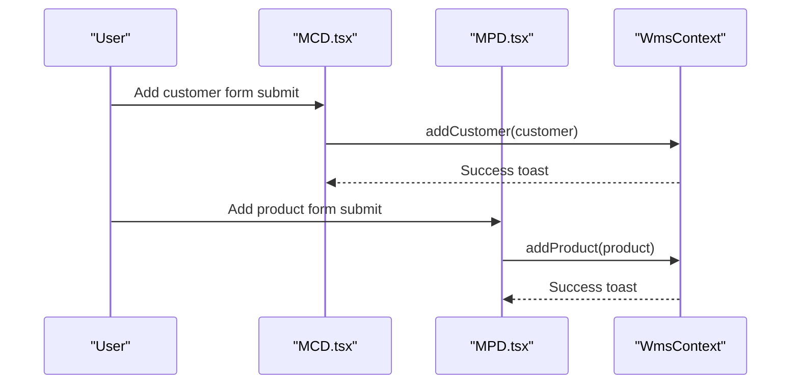
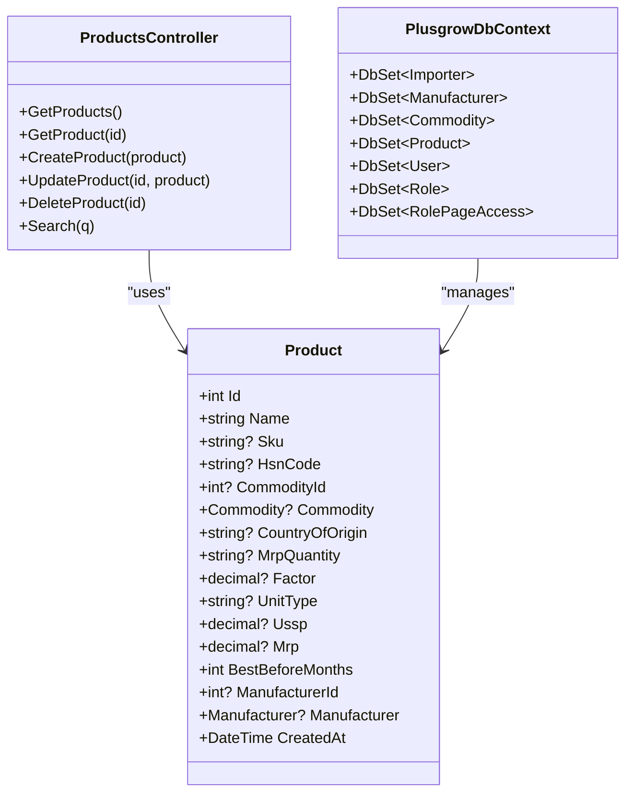
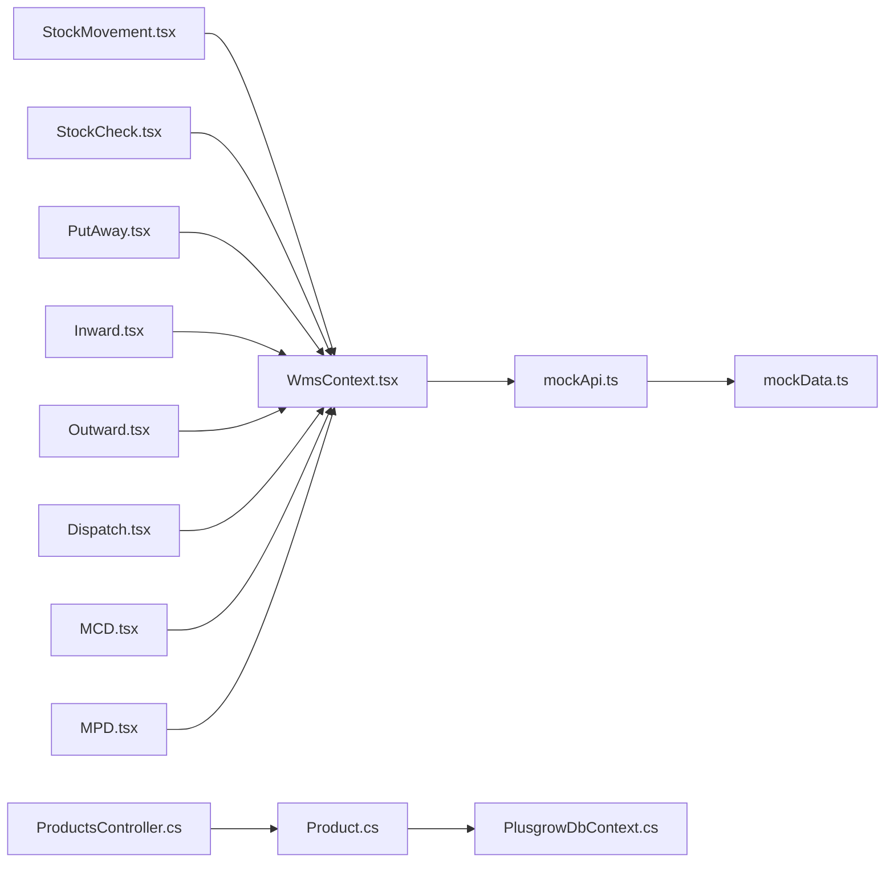

# Stock Movement Management

<cite>
**Referenced Files in This Document**
- [StockMovement.tsx](file://Frontend/src/pages/StockMovement.tsx)
- [StockCheck.tsx](file://Frontend/src/pages/StockCheck.tsx)
- [Dispatch.tsx](file://Frontend/src/pages/Dispatch.tsx)
- [PutAway.tsx](file://Frontend/src/pages/PutAway/PutAway.tsx)
- [Inward.tsx](file://Frontend/src/pages/Inward.tsx)
- [Outward.tsx](file://Frontend/src/pages/Outward.tsx)
- [MCD.tsx](file://Frontend/src/pages/MCD.tsx)
- [MPD.tsx](file://Frontend/src/pages/MPD.tsx)
- [WmsContext.tsx](file://Frontend/src/context/WmsContext.tsx)
- [mockApi.ts](file://Frontend/src/services/mockApi.ts)
- [mockData.ts](file://Frontend/src/services/mockData.ts)
- [index.ts](file://Frontend/src/types/index.ts)
- [ProductsController.cs](file://Backend/PlusgrowWms.Api/Controllers/ProductsController.cs)
- [Product.cs](file://Backend/PlusgrowWms.Api/Models/Product.cs)
- [PlusgrowDbContext.cs](file://Backend/PlusgrowWms.Api/Data/PlusgrowDbContext.cs)
</cite>

## Table of Contents
1. [Introduction](#introduction)
2. [Project Structure](#project-structure)
3. [Core Components](#core-components)
4. [Architecture Overview](#architecture-overview)
5. [Detailed Component Analysis](#detailed-component-analysis)
6. [Dependency Analysis](#dependency-analysis)
7. [Performance Considerations](#performance-considerations)
8. [Troubleshooting Guide](#troubleshooting-guide)
9. [Conclusion](#conclusion)
10. [Appendices](#appendices)

## Introduction
This document describes the stock movement management operations in PlusGrow WMS, covering inbound and outbound workflows, real-time inventory tracking, cycle counting, and discrepancy resolution. It also documents the Material Control Department (MCD) and Material Planning Department (MPD) master data management features, and outlines integration with warehouse mapping for location-based operations. The system supports manual stock adjustments, put-away assignments, dispatch confirmations, and audit trail generation through activity logging.

## Project Structure
The system comprises:
- Frontend (React) pages for stock movement, put-away, inward/outward processing, dispatch, and master data management
- A shared WMS context managing state, mock APIs, and activity logging
- Backend (ASP.NET Core) with a Products controller and EF Core model for product master data

**Diagram sources**
- [StockMovement.tsx:1-276](file://Frontend/src/pages/StockMovement.tsx#L1-L276)
- [StockCheck.tsx:1-284](file://Frontend/src/pages/StockCheck.tsx#L1-L284)
- [PutAway.tsx:1-462](file://Frontend/src/pages/PutAway/PutAway.tsx#L1-L462)
- [Inward.tsx:1-258](file://Frontend/src/pages/Inward.tsx#L1-L258)
- [Outward.tsx:1-272](file://Frontend/src/pages/Outward.tsx#L1-L272)
- [Dispatch.tsx:1-296](file://Frontend/src/pages/Dispatch.tsx#L1-L296)
- [MCD.tsx:1-311](file://Frontend/src/pages/MCD.tsx#L1-L311)
- [MPD.tsx:1-357](file://Frontend/src/pages/MPD.tsx#L1-L357)
- [WmsContext.tsx:1-234](file://Frontend/src/context/WmsContext.tsx#L1-L234)
- [mockApi.ts:1-32](file://Frontend/src/services/mockApi.ts#L1-L32)
- [mockData.ts:1-39](file://Frontend/src/services/mockData.ts#L1-L39)
- [ProductsController.cs:1-117](file://Backend/PlusgrowWms.Api/Controllers/ProductsController.cs#L1-L117)
- [Product.cs:1-65](file://Backend/PlusgrowWms.Api/Models/Product.cs#L1-L65)
- [PlusgrowDbContext.cs:1-78](file://Backend/PlusgrowWms.Api/Data/PlusgrowDbContext.cs#L1-L78)

**Section sources**
- [StockMovement.tsx:1-276](file://Frontend/src/pages/StockMovement.tsx#L1-L276)
- [WmsContext.tsx:1-234](file://Frontend/src/context/WmsContext.tsx#L1-L234)
- [ProductsController.cs:1-117](file://Backend/PlusgrowWms.Api/Controllers/ProductsController.cs#L1-L117)

## Core Components
- Stock Movement page: Executes manual quantity adjustments with reason categorization and live ledger filtering
- Stock Check page: Performs cycle counting and variance detection with guided remediation
- Put Away workflow: Scans, selects storage locations, and assigns inventory to warehouse bins
- Inward/Outward pages: Pull external ERP data, manage purchase/sales invoices, and track lifecycle status
- Dispatch page: Confirms outbound logistics and updates stock accordingly
- MCD/MPD pages: Manage customer and product master data for accurate inventory and order processing
- WMS Context: Central state management, mock API integration, and activity logging

**Section sources**
- [StockMovement.tsx:12-49](file://Frontend/src/pages/StockMovement.tsx#L12-L49)
- [StockCheck.tsx:33-63](file://Frontend/src/pages/StockCheck.tsx#L33-L63)
- [PutAway.tsx:47-203](file://Frontend/src/pages/PutAway/PutAway.tsx#L47-L203)
- [Inward.tsx:13-54](file://Frontend/src/pages/Inward.tsx#L13-L54)
- [Outward.tsx:14-55](file://Frontend/src/pages/Outward.tsx#L14-L55)
- [Dispatch.tsx:12-42](file://Frontend/src/pages/Dispatch.tsx#L12-L42)
- [MCD.tsx:12-46](file://Frontend/src/pages/MCD.tsx#L12-L46)
- [MPD.tsx:12-50](file://Frontend/src/pages/MPD.tsx#L12-L50)
- [WmsContext.tsx:28-234](file://Frontend/src/context/WmsContext.tsx#L28-L234)

## Architecture Overview
The frontend uses a centralized context to manage state and mock APIs. Pages trigger actions that update stock, invoice statuses, and master data. The backend exposes a Products controller for product master data retrieval and creation.

**Diagram sources**
- [WmsContext.tsx:37-118](file://Frontend/src/context/WmsContext.tsx#L37-L118)
- [mockApi.ts:6-31](file://Frontend/src/services/mockApi.ts#L6-L31)
- [mockData.ts:1-39](file://Frontend/src/services/mockData.ts#L1-L39)
- [ProductsController.cs:20-58](file://Backend/PlusgrowWms.Api/Controllers/ProductsController.cs#L20-L58)

## Detailed Component Analysis

### Stock Movement Operations
- Purpose: Manually adjust stock quantities for reconciliation and corrections
- Inputs: Target SKU, quantity delta, reason category
- Validation: Prevents negative stock across all locations for the SKU
- Effects: Updates stock ledger and logs an activity

**Diagram sources**
- [StockMovement.tsx:19-49](file://Frontend/src/pages/StockMovement.tsx#L19-L49)
- [WmsContext.tsx:83-118](file://Frontend/src/context/WmsContext.tsx#L83-L118)

**Section sources**
- [StockMovement.tsx:19-49](file://Frontend/src/pages/StockMovement.tsx#L19-L49)
- [WmsContext.tsx:83-118](file://Frontend/src/context/WmsContext.tsx#L83-L118)

### Stock Checking and Cycle Counting
- Purpose: Reconcile physical counts against system records
- Workflow: Scan SKU, enter physical quantity, compare, and guide remediation
- Outputs: Variance report and optional navigation to stock movement

**Diagram sources**
- [StockCheck.tsx:33-63](file://Frontend/src/pages/StockCheck.tsx#L33-L63)
- [WmsContext.tsx:135-148](file://Frontend/src/context/WmsContext.tsx#L135-L148)

**Section sources**
- [StockCheck.tsx:33-63](file://Frontend/src/pages/StockCheck.tsx#L33-L63)
- [WmsContext.tsx:135-148](file://Frontend/src/context/WmsContext.tsx#L135-L148)

### Put Away and Warehouse Mapping
- Purpose: Assign received inventory to designated warehouse locations
- Workflow: Select task → Scan barcode → Select location → Confirm quantity
- Integration: Uses warehouse constants and bin capacity checks

**Diagram sources**
- [PutAway.tsx:139-196](file://Frontend/src/pages/PutAway/PutAway.tsx#L139-L196)
- [WmsContext.tsx:160-194](file://Frontend/src/context/WmsContext.tsx#L160-L194)

**Section sources**
- [PutAway.tsx:47-203](file://Frontend/src/pages/PutAway/PutAway.tsx#L47-L203)
- [WmsContext.tsx:160-194](file://Frontend/src/context/WmsContext.tsx#L160-L194)

### Inward and Outward Processing
- Inward: Pull purchase invoices from ERP, track status, and trigger stock receipt on completion
- Outward: Pull sales orders from ERP, track status, and trigger dispatch and stock deduction

**Diagram sources**
- [Inward.tsx:18-54](file://Frontend/src/pages/Inward.tsx#L18-L54)
- [Outward.tsx:21-55](file://Frontend/src/pages/Outward.tsx#L21-L55)
- [WmsContext.tsx:120-148](file://Frontend/src/context/WmsContext.tsx#L120-L148)
- [ProductsController.cs:20-58](file://Backend/PlusgrowWms.Api/Controllers/ProductsController.cs#L20-L58)

**Section sources**
- [Inward.tsx:13-54](file://Frontend/src/pages/Inward.tsx#L13-L54)
- [Outward.tsx:14-55](file://Frontend/src/pages/Outward.tsx#L14-L55)
- [WmsContext.tsx:120-148](file://Frontend/src/context/WmsContext.tsx#L120-L148)

### Dispatch Operations
- Purpose: Confirm outbound logistics and finalize order lifecycle
- Workflow: Select open order, review outbound docket, confirm dispatch to decrement stock

**Diagram sources**
- [Dispatch.tsx:26-42](file://Frontend/src/pages/Dispatch.tsx#L26-L42)
- [WmsContext.tsx:140-148](file://Frontend/src/context/WmsContext.tsx#L140-L148)

**Section sources**
- [Dispatch.tsx:12-42](file://Frontend/src/pages/Dispatch.tsx#L12-L42)
- [WmsContext.tsx:140-148](file://Frontend/src/context/WmsContext.tsx#L140-L148)

### Material Control Department (MCD) and Material Planning Department (MPD)
- MCD: Manage customer master data (name, address, contact, relationship type)
- MPD: Manage product master data (SKU, title, vendor, pricing, packaging, origin, warranty)

**Diagram sources**
- [MCD.tsx:24-46](file://Frontend/src/pages/MCD.tsx#L24-L46)
- [MPD.tsx:28-50](file://Frontend/src/pages/MPD.tsx#L28-L50)
- [WmsContext.tsx:150-158](file://Frontend/src/context/WmsContext.tsx#L150-L158)

**Section sources**
- [MCD.tsx:12-46](file://Frontend/src/pages/MCD.tsx#L12-L46)
- [MPD.tsx:12-50](file://Frontend/src/pages/MPD.tsx#L12-L50)
- [WmsContext.tsx:150-158](file://Frontend/src/context/WmsContext.tsx#L150-L158)

### Backend Product Master Data
- ProductsController: CRUD operations for products with search capability
- Product model: Defines product attributes and relationships
- PlusgrowDbContext: Configures entity sets and indexes

**Diagram sources**
- [ProductsController.cs:11-117](file://Backend/PlusgrowWms.Api/Controllers/ProductsController.cs#L11-L117)
- [Product.cs:6-65](file://Backend/PlusgrowWms.Api/Models/Product.cs#L6-L65)
- [PlusgrowDbContext.cs:6-78](file://Backend/PlusgrowWms.Api/Data/PlusgrowDbContext.cs#L6-L78)

**Section sources**
- [ProductsController.cs:20-113](file://Backend/PlusgrowWms.Api/Controllers/ProductsController.cs#L20-L113)
- [Product.cs:6-65](file://Backend/PlusgrowWms.Api/Models/Product.cs#L6-L65)
- [PlusgrowDbContext.cs:20-76](file://Backend/PlusgrowWms.Api/Data/PlusgrowDbContext.cs#L20-L76)

## Dependency Analysis
- Frontend pages depend on WmsContext for state and actions
- WmsContext depends on mockApi and mockData for initial datasets
- Backend ProductsController depends on Product model and PlusgrowDbContext
- Types define shared interfaces across frontend and backend

**Diagram sources**
- [WmsContext.tsx:28-234](file://Frontend/src/context/WmsContext.tsx#L28-L234)
- [mockApi.ts:6-31](file://Frontend/src/services/mockApi.ts#L6-L31)
- [mockData.ts:1-39](file://Frontend/src/services/mockData.ts#L1-L39)
- [ProductsController.cs:11-117](file://Backend/PlusgrowWms.Api/Controllers/ProductsController.cs#L11-L117)
- [Product.cs:6-65](file://Backend/PlusgrowWms.Api/Models/Product.cs#L6-L65)
- [PlusgrowDbContext.cs:6-78](file://Backend/PlusgrowWms.Api/Data/PlusgrowDbContext.cs#L6-L78)

**Section sources**
- [WmsContext.tsx:28-234](file://Frontend/src/context/WmsContext.tsx#L28-L234)
- [ProductsController.cs:11-117](file://Backend/PlusgrowWms.Api/Controllers/ProductsController.cs#L11-L117)

## Performance Considerations
- Frontend uses memoization and efficient state updates to minimize re-renders
- Batched data loading reduces network overhead
- Local state management avoids frequent backend round trips during UI interactions
- Consider pagination and virtualized lists for large datasets in future enhancements

## Troubleshooting Guide
Common issues and resolutions:
- Negative stock prevention: The system prevents reductions that would drop total stock below zero; verify SKU and quantity before adjustment
- Scan failures: Re-scan or re-enter SKU manually; ensure barcode validity
- Location capacity: Confirm bin capacity limits before assigning quantities
- ERP sync errors: Retry synchronization; check connectivity and backend availability
- Audit trail: Use activity logs to trace stock changes and reconciliations

**Section sources**
- [StockMovement.tsx:29-32](file://Frontend/src/pages/StockMovement.tsx#L29-L32)
- [PutAway.tsx:163-169](file://Frontend/src/pages/PutAway/PutAway.tsx#L163-L169)
- [WmsContext.tsx:73-81](file://Frontend/src/context/WmsContext.tsx#L73-L81)

## Conclusion
PlusGrow WMS provides a comprehensive stock movement management solution with integrated inbound/outbound workflows, cycle counting, manual adjustments, and master data management. The modular frontend pages, centralized context, and backend product controller enable real-time inventory tracking, location-based operations, and robust audit trails suitable for warehouse environments.

## Appendices

### Example Scenarios
- Manual stock adjustment: Enter SKU, quantity delta, select reason, apply adjustment
- Cycle count reconciliation: Scan SKU, enter physical count, resolve variance via movement
- Put away allocation: Scan item, select bin, confirm quantity assignment
- Inward receipt: Pull purchase invoice, mark as completed to receive stock
- Outbound dispatch: Pull sales order, pack, dispatch to reduce stock
- Master data updates: Add or edit customer/product records for accurate operations

### Validation Rules
- Stock adjustments must not result in negative totals per SKU
- Put away quantity must not exceed unassigned stock for the SKU
- Dispatch requires an open order with sufficient stock availability
- ERP sync requires successful communication and valid response

### Reporting Capabilities
- Live inventory ledger with filtering and sorting
- Activities log for audit trail
- KPI dashboards for inward/outward progress
- Variance reports for cycle counting outcomes