# Warehouse Mapping System

<cite>
**Referenced Files in This Document**
- [WarehouseMap.tsx](file://Frontend/src/pages/WarehouseMap.tsx)
- [WarehouseMap.tsx](file://Frontend/src/pages/PutAway/components/WarehouseMap.tsx)
- [PutAway.tsx](file://Frontend/src/pages/PutAway/PutAway.tsx)
- [WmsContext.tsx](file://Frontend/src/context/WmsContext.tsx)
- [mockData.ts](file://Frontend/src/services/mockData.ts)
- [Sidebar.tsx](file://Frontend/src/components/organisms/Navigation/Sidebar/Sidebar.tsx)
- [Dispatch.tsx](file://Frontend/src/pages/Dispatch.tsx)
- [StockCheck.tsx](file://Frontend/src/pages/StockCheck.tsx)
- [StockMovement.tsx](file://Frontend/src/pages/StockMovement.tsx)
- [TaskCard.tsx](file://Frontend/src/pages/PutAway/components/TaskCard.tsx)
- [Stepper.tsx](file://Frontend/src/pages/PutAway/components/Stepper.tsx)
- [Scanner.tsx](file://Frontend/src/pages/PutAway/components/Scanner.tsx)
- [ConfirmationForm.tsx](file://Frontend/src/pages/PutAway/components/ConfirmationForm.tsx)
</cite>

## Table of Contents
1. [Introduction](#introduction)
2. [Project Structure](#project-structure)
3. [Core Components](#core-components)
4. [Architecture Overview](#architecture-overview)
5. [Detailed Component Analysis](#detailed-component-analysis)
6. [Dependency Analysis](#dependency-analysis)
7. [Performance Considerations](#performance-considerations)
8. [Troubleshooting Guide](#troubleshooting-guide)
9. [Conclusion](#conclusion)
10. [Appendices](#appendices)

## Introduction
This document describes the warehouse mapping system in PlusGrow WMS, focusing on the 3D visualization interface for warehouse layout, capacity management, location assignment, and operational integrations. It covers:
- Interactive grid-based bin selection with capacity indicators
- Real-time bin utilization and maximum capacity visualization
- Location assignment workflows integrated with put-away operations
- Filtering and search for locating products or empty storage locations
- Integration with dispatch and stock checking systems
- Examples of layout configurations, capacity planning, and optimization strategies

## Project Structure
The warehouse mapping system spans frontend pages, components, and shared context/state management. Key areas:
- Warehouse visualization pages: main facility map and compact bin selector
- Put-away workflow: task cards, scanner, stepper, and confirmation form
- Shared state: WMS context managing stock, products, invoices, and activities
- Operational integrations: dispatch, stock check, and stock movement

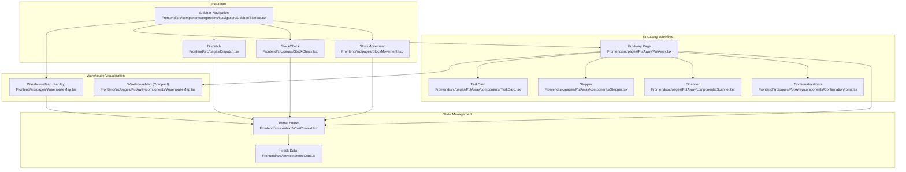

**Diagram sources**
- [WarehouseMap.tsx:24-296](file://Frontend/src/pages/WarehouseMap.tsx#L24-L296)
- [WarehouseMap.tsx:47-216](file://Frontend/src/pages/PutAway/components/WarehouseMap.tsx#L47-L216)
- [PutAway.tsx:47-423](file://Frontend/src/pages/PutAway/PutAway.tsx#L47-L423)
- [TaskCard.tsx:52-142](file://Frontend/src/pages/PutAway/components/TaskCard.tsx#L52-L142)
- [Stepper.tsx:28-92](file://Frontend/src/pages/PutAway/components/Stepper.tsx#L28-L92)
- [Scanner.tsx:54-117](file://Frontend/src/pages/PutAway/components/Scanner.tsx#L54-L117)
- [ConfirmationForm.tsx:36-140](file://Frontend/src/pages/PutAway/components/ConfirmationForm.tsx#L36-L140)
- [WmsContext.tsx:28-224](file://Frontend/src/context/WmsContext.tsx#L28-L224)
- [mockData.ts:24-33](file://Frontend/src/services/mockData.ts#L24-L33)
- [Dispatch.tsx:12-293](file://Frontend/src/pages/Dispatch.tsx#L12-L293)
- [StockCheck.tsx:12-281](file://Frontend/src/pages/StockCheck.tsx#L12-L281)
- [StockMovement.tsx:12-275](file://Frontend/src/pages/StockMovement.tsx#L12-L275)
- [Sidebar.tsx:91-113](file://Frontend/src/components/organisms/Navigation/Sidebar/Sidebar.tsx#L91-L113)

**Section sources**
- [WarehouseMap.tsx:24-296](file://Frontend/src/pages/WarehouseMap.tsx#L24-L296)
- [WarehouseMap.tsx:47-216](file://Frontend/src/pages/PutAway/components/WarehouseMap.tsx#L47-L216)
- [PutAway.tsx:47-423](file://Frontend/src/pages/PutAway/PutAway.tsx#L47-L423)
- [WmsContext.tsx:28-224](file://Frontend/src/context/WmsContext.tsx#L28-L224)
- [mockData.ts:24-33](file://Frontend/src/services/mockData.ts#L24-L33)
- [Sidebar.tsx:91-113](file://Frontend/src/components/organisms/Navigation/Sidebar/Sidebar.tsx#L91-L113)

## Core Components
- WarehouseMap (Facility): Full-screen interactive facility canvas with racks, shelves, and bin summaries; supports SKU search and highlighting.
- WarehouseMap (Compact): Bin selection grid for put-away with capacity bars, legends, and selection feedback.
- PutAway workflow: Task cards, scanner, stepper, and confirmation form orchestrate the put-away process.
- WmsContext: Centralized state for stock, products, invoices, and activities; exposes assignBin and updateStock.
- Operations: Dispatch, StockCheck, and StockMovement integrate with the mapping system via shared state.

**Section sources**
- [WarehouseMap.tsx:24-296](file://Frontend/src/pages/WarehouseMap.tsx#L24-L296)
- [WarehouseMap.tsx:47-216](file://Frontend/src/pages/PutAway/components/WarehouseMap.tsx#L47-L216)
- [PutAway.tsx:47-423](file://Frontend/src/pages/PutAway/PutAway.tsx#L47-L423)
- [WmsContext.tsx:83-194](file://Frontend/src/context/WmsContext.tsx#L83-L194)

## Architecture Overview
The system follows a React-based frontend architecture with a centralized WMS context providing reactive state. The warehouse mapping UIs render based on stock data and product metadata, enabling real-time visibility and actions.

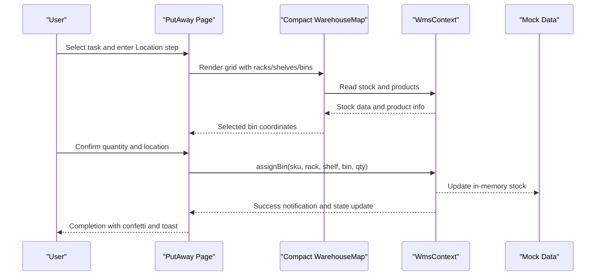

**Diagram sources**
- [PutAway.tsx:171-196](file://Frontend/src/pages/PutAway/PutAway.tsx#L171-L196)
- [WarehouseMap.tsx:47-216](file://Frontend/src/pages/PutAway/components/WarehouseMap.tsx#L47-L216)
- [WmsContext.tsx:160-194](file://Frontend/src/context/WmsContext.tsx#L160-L194)
- [mockData.ts:24-33](file://Frontend/src/services/mockData.ts#L24-L33)

## Detailed Component Analysis

### 3D Visualization Interface (WarehouseMap - Facility)
- Purpose: Provide a live, searchable view of the warehouse with racks and bins.
- Features:
  - Rack-level highlighting and summary
  - Shelf-level visual cues
  - SKU list with quantity and location
  - Search by SKU, product title, or rack
  - Selection overlay with target details
- Data model:
  - Racks: configurable list with names
  - Stock: assigned items with rack/shelf/bin and quantity
  - Products: mapped to enrich stock with titles

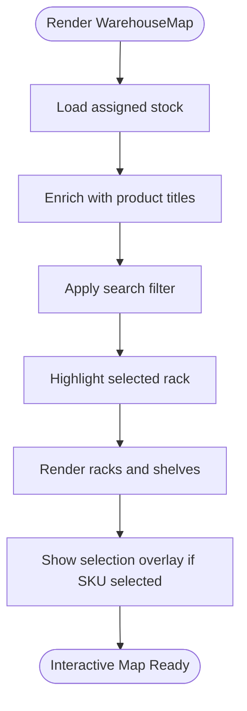

**Diagram sources**
- [WarehouseMap.tsx:24-296](file://Frontend/src/pages/WarehouseMap.tsx#L24-L296)

**Section sources**
- [WarehouseMap.tsx:24-296](file://Frontend/src/pages/WarehouseMap.tsx#L24-L296)

### 3D Visualization Interface (WarehouseMap - Compact Bin Selector)
- Purpose: Enable precise bin selection during put-away with capacity visualization.
- Features:
  - Rack and shelf selectors
  - Bin grid with capacity bars and quantity badges
  - Color-coded capacity legend (0–50%, 51–80%, 81%+)
  - Selected location display and confirmation prompt
- Data model:
  - Racks, shelves, bins: arrays of identifiers
  - Stock: array of {rack, shelf, bin, quantity}
  - Capacity threshold: configurable maximum per bin

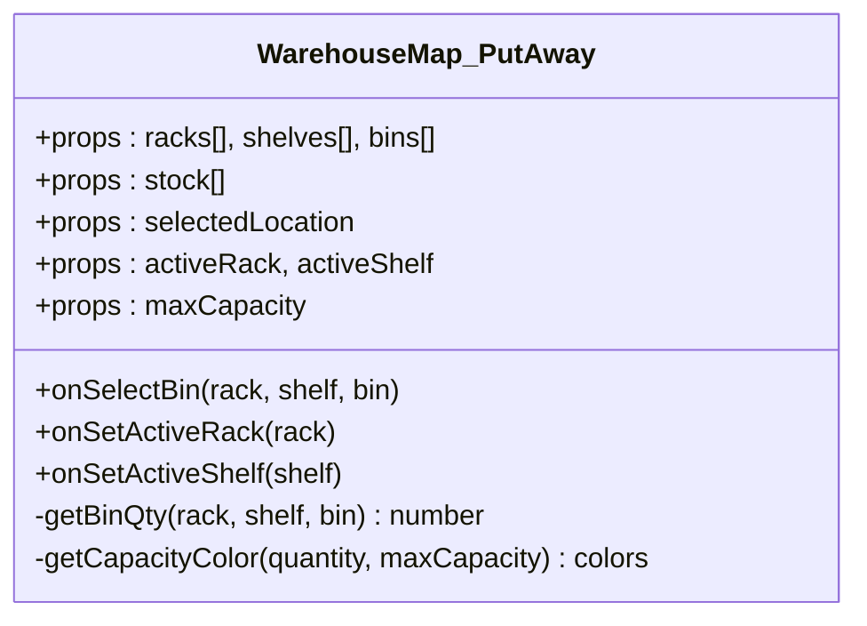

**Diagram sources**
- [WarehouseMap.tsx:24-60](file://Frontend/src/pages/PutAway/components/WarehouseMap.tsx#L24-L60)

**Section sources**
- [WarehouseMap.tsx:47-216](file://Frontend/src/pages/PutAway/components/WarehouseMap.tsx#L47-L216)

### Capacity Management and Visual Indicators
- Capacity calculation: percentage of current quantity vs. maximum capacity.
- Visual indicators:
  - Background color: neutral (empty), success (0–50%), warning (51–80%), danger (81%+)
  - Border color: matches background tone
  - Dot bar: horizontal indicator reflecting percentage
  - Quantity badge: overlays bin label when > 0
- Example thresholds:
  - 0%: empty bin
  - ≤50%: low utilization
  - ≤80%: moderate utilization
  - 81%+: high utilization

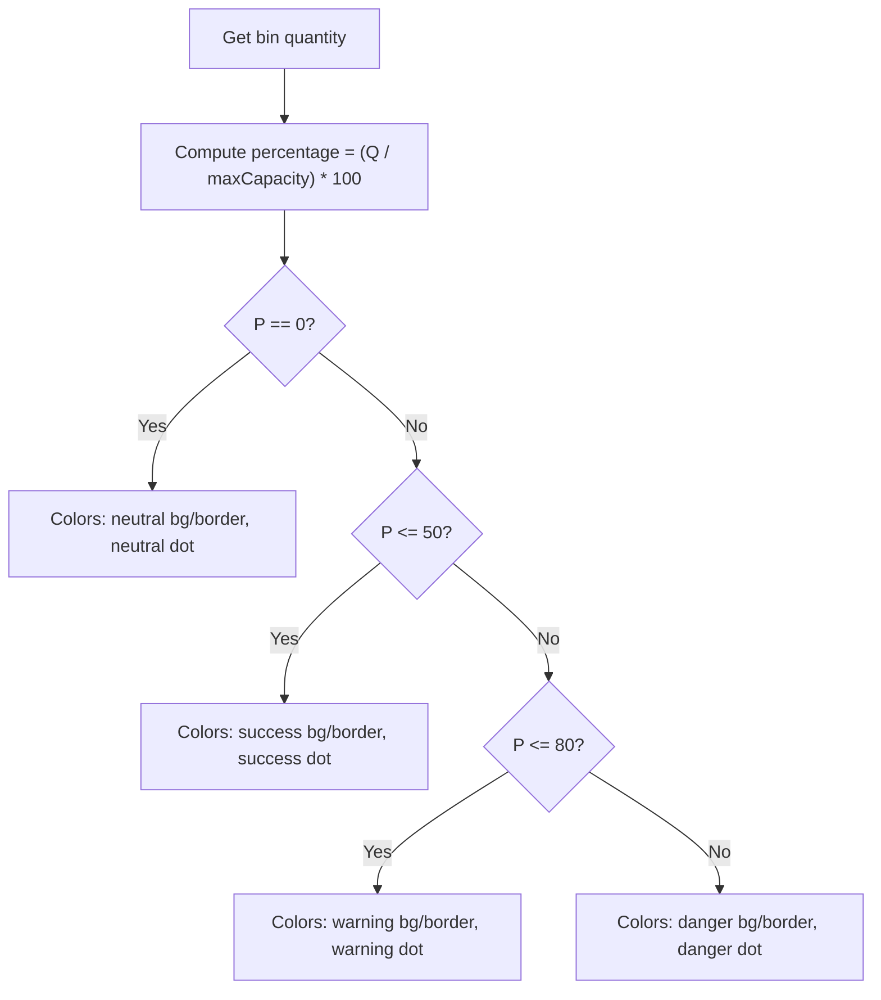

**Diagram sources**
- [WarehouseMap.tsx:39-45](file://Frontend/src/pages/PutAway/components/WarehouseMap.tsx#L39-L45)

**Section sources**
- [WarehouseMap.tsx:39-45](file://Frontend/src/pages/PutAway/components/WarehouseMap.tsx#L39-L45)

### Location Assignment Algorithms (Put-Away)
- Algorithm overview:
  - Identify unassigned stock for the selected SKU
  - Compute maximum assignable quantity (unassigned amount)
  - Allow user to select bin and quantity
  - On confirmation, merge or move stock into the bin
  - Update activity log and show success feedback
- Edge cases:
  - If requested quantity equals or exceeds unassigned, move entire unassigned entry
  - If partial, reduce unassigned and add to bin; merge if bin already contains the SKU

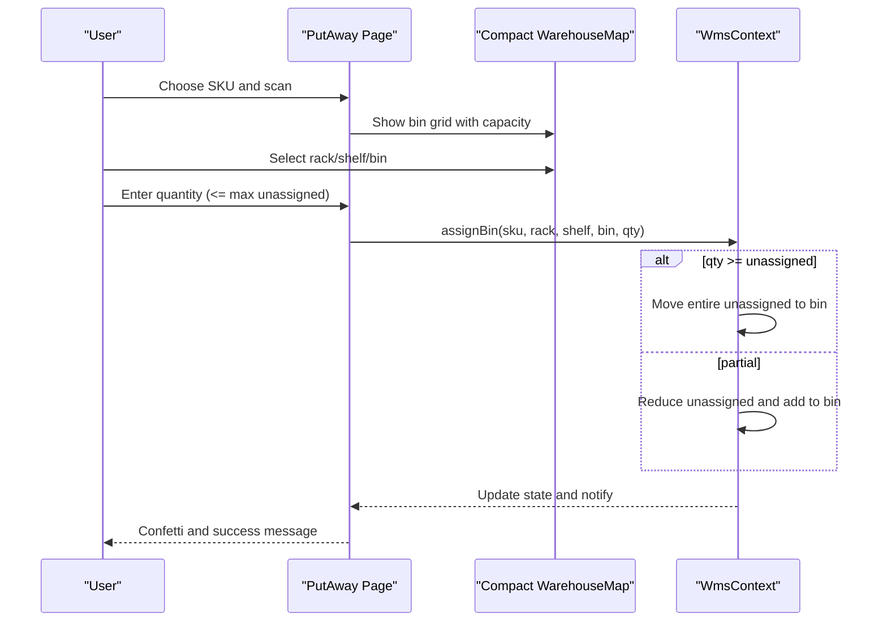

**Diagram sources**
- [PutAway.tsx:171-196](file://Frontend/src/pages/PutAway/PutAway.tsx#L171-L196)
- [WmsContext.tsx:160-194](file://Frontend/src/context/WmsContext.tsx#L160-L194)

**Section sources**
- [PutAway.tsx:171-196](file://Frontend/src/pages/PutAway/PutAway.tsx#L171-L196)
- [WmsContext.tsx:160-194](file://Frontend/src/context/WmsContext.tsx#L160-L194)

### Filtering and Search Capabilities
- Facility map search:
  - Filters located stock by SKU, product title, or rack identifier
  - Updates filtered list and highlights matching entries
- Ledger and movement search:
  - Filters stock ledger by SKU or product title
  - Supports quick navigation to relevant rows

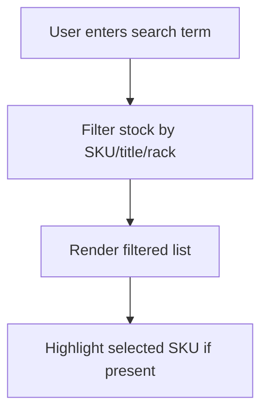

**Diagram sources**
- [WarehouseMap.tsx:46-52](file://Frontend/src/pages/WarehouseMap.tsx#L46-L52)
- [StockMovement.tsx:51-54](file://Frontend/src/pages/StockMovement.tsx#L51-L54)

**Section sources**
- [WarehouseMap.tsx:46-52](file://Frontend/src/pages/WarehouseMap.tsx#L46-L52)
- [StockMovement.tsx:51-54](file://Frontend/src/pages/StockMovement.tsx#L51-L54)

### Integration with Put-Away Operations
- Put-away workflow:
  - Task cards summarize progress per SKU
  - Scanner validates incoming items
  - Stepper guides through steps
  - Confirmation form captures quantity and location
- Data flow:
  - Tasks computed from products and stock
  - Bin selection updates selected location
  - Confirmation triggers assignBin via context

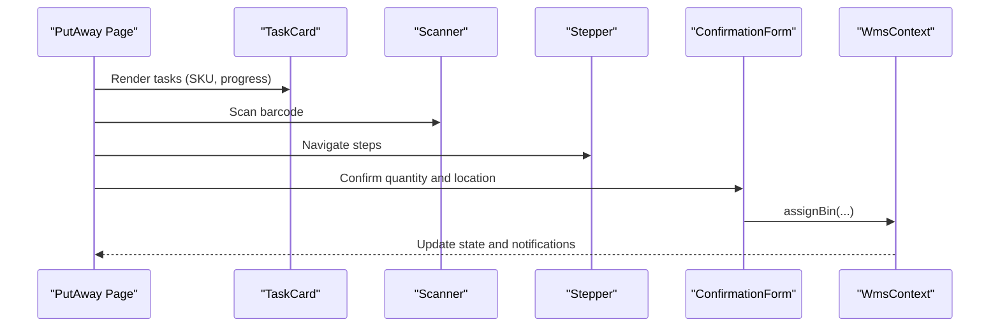

**Diagram sources**
- [PutAway.tsx:65-74](file://Frontend/src/pages/PutAway/PutAway.tsx#L65-L74)
- [TaskCard.tsx:52-142](file://Frontend/src/pages/PutAway/components/TaskCard.tsx#L52-L142)
- [Scanner.tsx:54-117](file://Frontend/src/pages/PutAway/components/Scanner.tsx#L54-L117)
- [Stepper.tsx:28-92](file://Frontend/src/pages/PutAway/components/Stepper.tsx#L28-L92)
- [ConfirmationForm.tsx:36-140](file://Frontend/src/pages/PutAway/components/ConfirmationForm.tsx#L36-L140)
- [WmsContext.tsx:160-194](file://Frontend/src/context/WmsContext.tsx#L160-L194)

**Section sources**
- [PutAway.tsx:65-74](file://Frontend/src/pages/PutAway/PutAway.tsx#L65-L74)
- [TaskCard.tsx:52-142](file://Frontend/src/pages/PutAway/components/TaskCard.tsx#L52-L142)
- [Scanner.tsx:54-117](file://Frontend/src/pages/PutAway/components/Scanner.tsx#L54-L117)
- [Stepper.tsx:28-92](file://Frontend/src/pages/PutAway/components/Stepper.tsx#L28-L92)
- [ConfirmationForm.tsx:36-140](file://Frontend/src/pages/PutAway/components/ConfirmationForm.tsx#L36-L140)
- [WmsContext.tsx:160-194](file://Frontend/src/context/WmsContext.tsx#L160-L194)

### Stock Checking Interface
- Purpose: Verify physical inventory against system records.
- Features:
  - Scan SKU and physical quantity
  - Compare with system quantity and compute variance
  - Provide remediation action to create stock movement adjustment
- Integration:
  - Uses shared stock and product data from context
  - Navigates to stock movement for adjustments

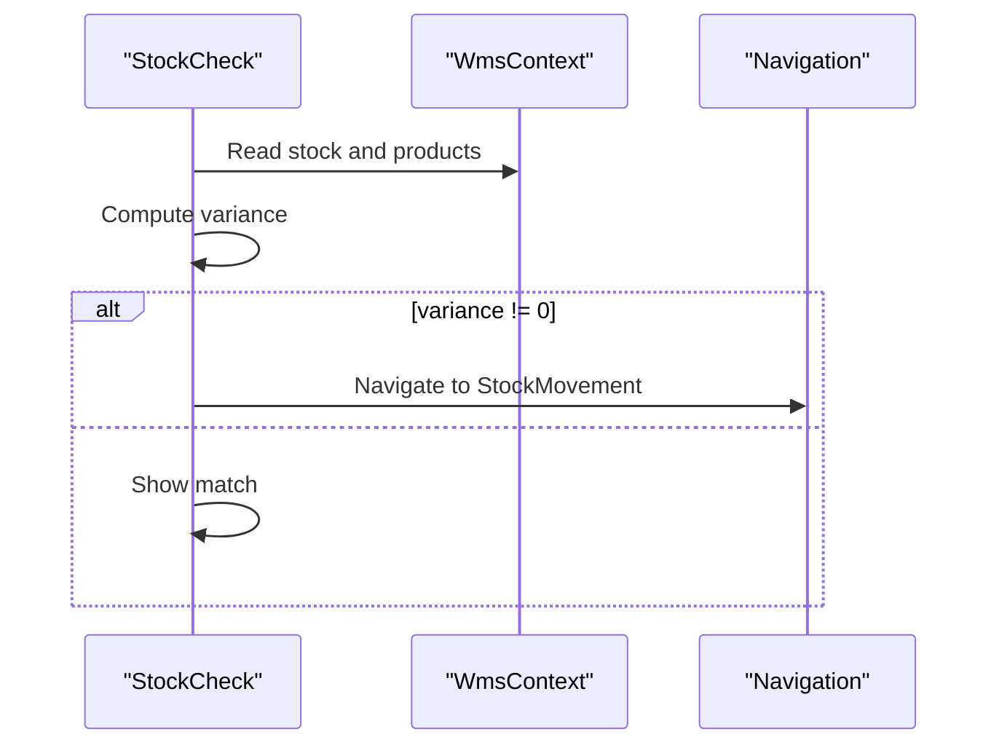

**Diagram sources**
- [StockCheck.tsx:12-281](file://Frontend/src/pages/StockCheck.tsx#L12-L281)
- [WmsContext.tsx:37-59](file://Frontend/src/context/WmsContext.tsx#L37-L59)

**Section sources**
- [StockCheck.tsx:12-281](file://Frontend/src/pages/StockCheck.tsx#L12-L281)
- [WmsContext.tsx:37-59](file://Frontend/src/context/WmsContext.tsx#L37-L59)

### Dispatch System for Outbound Allocations
- Purpose: Manage outbound orders and allocate inventory.
- Features:
  - Filter open sales invoices by number, customer, or SKU
  - Confirm dispatch to reduce inventory and finalize order lifecycle
- Integration:
  - Reads sales invoices and updates status via context
  - Uses shared stock data for allocation

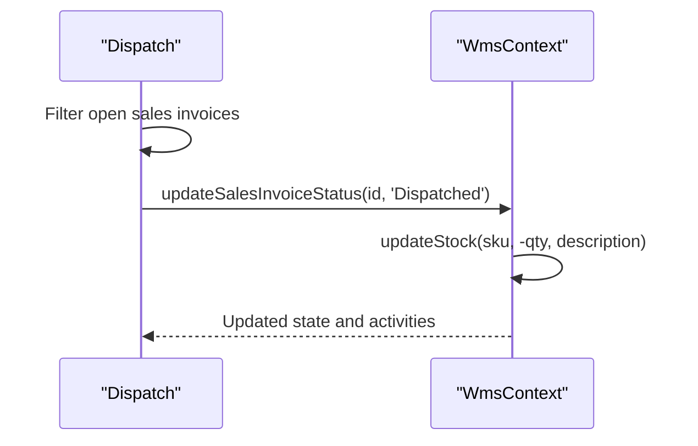

**Diagram sources**
- [Dispatch.tsx:12-293](file://Frontend/src/pages/Dispatch.tsx#L12-L293)
- [WmsContext.tsx:140-148](file://Frontend/src/context/WmsContext.tsx#L140-L148)

**Section sources**
- [Dispatch.tsx:12-293](file://Frontend/src/pages/Dispatch.tsx#L12-L293)
- [WmsContext.tsx:140-148](file://Frontend/src/context/WmsContext.tsx#L140-L148)

### Visual Indicators for Bin Status
- Occupied: bin contains stock (quantity > 0); shown with quantity badge and capacity bar
- Available: bin is empty (quantity = 0); neutral visual style
- Reserved: represented by unassigned stock; not yet allocated to a bin
- Restricted: not modeled in current UI; would require explicit restriction flags

**Section sources**
- [WarehouseMap.tsx:166-204](file://Frontend/src/pages/PutAway/components/WarehouseMap.tsx#L166-L204)
- [WmsContext.tsx:83-118](file://Frontend/src/context/WmsContext.tsx#L83-L118)

### Examples of Warehouse Layout Configurations
- Rack configuration: A–F aisles with labeled names
- Shelf configuration: Four levels per rack (S1–S4)
- Bin configuration: Five bins per shelf (B1–B5)
- Capacity configuration: Maximum bin capacity set to 100 units

**Section sources**
- [WarehouseMap.tsx:15-22](file://Frontend/src/pages/WarehouseMap.tsx#L15-L22)
- [PutAway.tsx:42-45](file://Frontend/src/pages/PutAway/PutAway.tsx#L42-L45)

### Capacity Planning Strategies
- Utilization thresholds:
  - Keep bins ≤50% for high-turnover items to minimize picking distance
  - Allow up to 80% for bulk items with lower velocity
- Rotation policies:
  - FIFO/LIFO placement within bins to manage expiry and obsolescence
- Dynamic reassignment:
  - Move partially filled bins to optimize accessibility and reduce travel time

[No sources needed since this section provides general guidance]

### Optimization Techniques for Storage Efficiency and Retrieval Speed
- Slotting strategies:
  - Place fast-moving SKUs in easily accessible locations (middle shelves)
  - Group complementary items to reduce traversal
- Capacity-aware routing:
  - Prefer bins under 50% utilization for immediate pick-face availability
- Batch operations:
  - Consolidate small quantities into fewer bins to improve picker ergonomics

[No sources needed since this section provides general guidance]

## Dependency Analysis
The mapping system depends on:
- WmsContext for reactive stock and product data
- Mock data for initial state and development
- Sidebar navigation for linking to warehouse map and operations

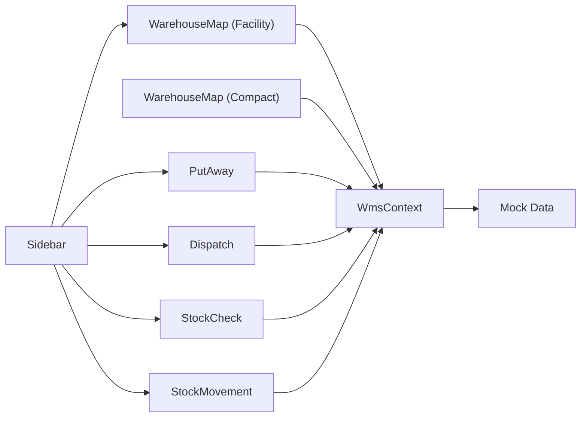

**Diagram sources**
- [WarehouseMap.tsx:24-296](file://Frontend/src/pages/WarehouseMap.tsx#L24-L296)
- [WarehouseMap.tsx:47-216](file://Frontend/src/pages/PutAway/components/WarehouseMap.tsx#L47-L216)
- [PutAway.tsx:47-423](file://Frontend/src/pages/PutAway/PutAway.tsx#L47-L423)
- [WmsContext.tsx:28-224](file://Frontend/src/context/WmsContext.tsx#L28-L224)
- [mockData.ts:24-33](file://Frontend/src/services/mockData.ts#L24-L33)
- [Sidebar.tsx:91-113](file://Frontend/src/components/organisms/Navigation/Sidebar/Sidebar.tsx#L91-L113)

**Section sources**
- [WmsContext.tsx:28-224](file://Frontend/src/context/WmsContext.tsx#L28-L224)
- [mockData.ts:24-33](file://Frontend/src/services/mockData.ts#L24-L33)
- [Sidebar.tsx:91-113](file://Frontend/src/components/organisms/Navigation/Sidebar/Sidebar.tsx#L91-L113)

## Performance Considerations
- Rendering optimization:
  - Memoized components (e.g., WarehouseMap) prevent unnecessary re-renders
  - Use of useMemo for derived lists (located stock, enriched stock, filtered stock)
- Data locality:
  - Centralized state reduces prop drilling and improves responsiveness
- Large datasets:
  - Consider pagination or virtualization for very large stock sets
  - Debounce search inputs to avoid frequent recomputation

[No sources needed since this section provides general guidance]

## Troubleshooting Guide
- Bin selection does not reflect capacity:
  - Verify stock data includes correct rack/shelf/bin and quantities
  - Ensure maxCapacity prop is set appropriately for the bin configuration
- Assigning fails or does nothing:
  - Confirm SKU has unassigned stock; assignBin only operates on unassigned entries
  - Check quantity input is within available unassigned bounds
- Search yields no results:
  - Facility map filters only located stock (non-Unassigned); ensure items are assigned
  - Try clearing filters or adjusting search terms
- Dispatch not reducing inventory:
  - Ensure sales invoice status transitions to Dispatched
  - Confirm SKU and quantity match system records

**Section sources**
- [WmsContext.tsx:83-118](file://Frontend/src/context/WmsContext.tsx#L83-L118)
- [WmsContext.tsx:160-194](file://Frontend/src/context/WmsContext.tsx#L160-L194)
- [WarehouseMap.tsx:46-52](file://Frontend/src/pages/WarehouseMap.tsx#L46-L52)
- [Dispatch.tsx:17-22](file://Frontend/src/pages/Dispatch.tsx#L17-L22)

## Conclusion
PlusGrow WMS provides a robust warehouse mapping system with interactive visualization, capacity-aware bin selection, and seamless integration across put-away, dispatch, stock checking, and stock movement. The modular component architecture and centralized state management enable efficient operations and scalability for future enhancements.

[No sources needed since this section summarizes without analyzing specific files]

## Appendices
- Navigation links to warehouse map and operations are defined in the sidebar component.

**Section sources**
- [Sidebar.tsx:91-113](file://Frontend/src/components/organisms/Navigation/Sidebar/Sidebar.tsx#L91-L113)