# Warehouse Operations

<cite>
**Referenced Files in This Document**
- [PutAway.tsx](file://Frontend/src/pages/PutAway/PutAway.tsx)
- [Outward.tsx](file://Frontend/src/pages/Outward.tsx)
- [Inward.tsx](file://Frontend/src/pages/Inward.tsx)
- [StockMovement.tsx](file://Frontend/src/pages/StockMovement.tsx)
- [WarehouseMap.tsx](file://Frontend/src/pages/WarehouseMap.tsx)
- [WmsContext.tsx](file://Frontend/src/context/WmsContext.tsx)
- [mockApi.ts](file://Frontend/src/services/mockApi.ts)
- [mockData.ts](file://Frontend/src/services/mockData.ts)
- [Scanner.tsx](file://Frontend/src/pages/PutAway/components/Scanner.tsx)
- [WarehouseMap.tsx](file://Frontend/src/pages/PutAway/components/WarehouseMap.tsx)
- [ConfirmationForm.tsx](file://Frontend/src/pages/PutAway/components/ConfirmationForm.tsx)
- [TaskCard.tsx](file://Frontend/src/pages/PutAway/components/TaskCard.tsx)
- [Stepper.tsx](file://Frontend/src/pages/PutAway/components/Stepper.tsx)
- [Card.tsx](file://Frontend/src/components/atoms/Card/Card.tsx)
- [Button.tsx](file://Frontend/src/components/atoms/Button/Button.tsx)
- [DataTable.tsx](file://Frontend/src/components/molecules/DataTable/DataTable.tsx)
- [tableHelpers.tsx](file://Frontend/src/components/molecules/DataTable/tableHelpers.tsx)
- [tokens.css](file://Frontend/src/styles/tokens.css)
- [utils.ts](file://Frontend/src/lib/utils.ts)
- [DashboardLayout.tsx](file://Frontend/src/components/templates/DashboardLayout/DashboardLayout.tsx)
- [App.tsx](file://Frontend/src/App.tsx)
- [index.ts](file://Frontend/src/types/index.ts)
- [Program.cs](file://Backend/PlusgrowWms.Api/Program.cs)
- [ProductsController.cs](file://Backend/PlusgrowWms.Api/Controllers/ProductsController.cs)
- [Product.cs](file://Backend/PlusgrowWms.Api/Models/Product.cs)
</cite>

## Update Summary
**Changes Made**
- Enhanced PutAway operations with improved UI components including advanced scanner integration, better bin selection visualization, and enhanced confirmation workflow
- Improved scanner component with visual feedback states, scanning animations, and error handling
- Enhanced warehouse mapping system with capacity indicators, selection overlays, and improved rack/shelf visualization
- Better task management with enhanced progress tracking and status indicators
- Advanced visual feedback system with confetti celebrations and toast notifications
- Improved bin allocation algorithms with better capacity awareness and validation

## Table of Contents
1. [Introduction](#introduction)
2. [Project Structure](#project-structure)
3. [Core Components](#core-components)
4. [Architecture Overview](#architecture-overview)
5. [Detailed Component Analysis](#detailed-component-analysis)
6. [Pro Max Edition Styling System](#pro-max-edition-styling-system)
7. [Dependency Analysis](#dependency-analysis)
8. [Performance Considerations](#performance-considerations)
9. [Troubleshooting Guide](#troubleshooting-guide)
10. [Conclusion](#conclusion)
11. [Appendices](#appendices)

## Introduction
This document explains the PlusGrow WMS warehouse operations workflows with a focus on:
- Put-away operations: enhanced barcode scanning integration, improved bin allocation algorithms, and advanced task management with visual feedback
- **Enhanced Outward logistics**: Pro Max Edition styling with glassmorphism effects, advanced KPI dashboards, and streamlined order processing
- **Enhanced Inward processing**: Professional design system with brand-consistent theming, improved invoice management, and real-time synchronization
- **Revolutionary Stock Movement**: Dual-panel layout with adjustment form and live ledger, enhanced visual feedback, intuitive workflow, and comprehensive audit trail
- **Enhanced Warehouse mapping**: 3D-like visualization with capacity management, improved location availability tracking, and advanced selection overlays
- Step-by-step workflows, user interaction patterns, and best practices
- Integration with mock data and API services for demonstration
- Common operational scenarios, error handling, performance considerations, automation, reporting, and external integrations

## Project Structure
The system comprises:
- Frontend (React + TypeScript): UI pages for put-away, stock movement, and warehouse mapping; shared context and mock services
- Backend (.NET): API scaffolding with JWT authentication, Swagger, and controllers for product data

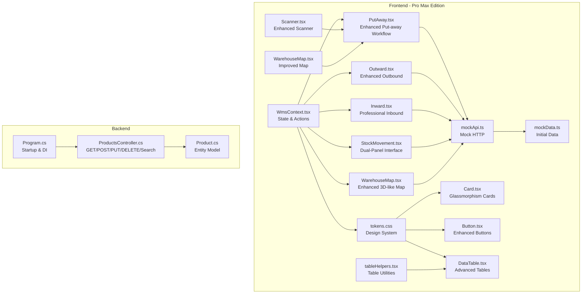

**Diagram sources**
- [WmsContext.tsx:1-234](file://Frontend/src/context/WmsContext.tsx#L1-L234)
- [PutAway.tsx:1-462](file://Frontend/src/pages/PutAway/PutAway.tsx#L1-L462)
- [Outward.tsx:1-263](file://Frontend/src/pages/Outward.tsx#L1-L263)
- [Inward.tsx:1-249](file://Frontend/src/pages/Inward.tsx#L1-L249)
- [StockMovement.tsx:1-275](file://Frontend/src/pages/StockMovement.tsx#L1-L275)
- [WarehouseMap.tsx:1-299](file://Frontend/src/pages/WarehouseMap.tsx#L1-L299)
- [mockApi.ts:1-32](file://Frontend/src/services/mockApi.ts#L1-L32)
- [mockData.ts:1-39](file://Frontend/src/services/mockData.ts#L1-L39)
- [tokens.css:1-483](file://Frontend/src/styles/tokens.css#L1-L483)
- [Card.tsx:1-218](file://Frontend/src/components/atoms/Card/Card.tsx#L1-L218)
- [Button.tsx:1-142](file://Frontend/src/components/atoms/Button/Button.tsx#L1-L142)
- [DataTable.tsx:1-236](file://Frontend/src/components/molecules/DataTable/DataTable.tsx#L1-L236)
- [Scanner.tsx:1-118](file://Frontend/src/pages/PutAway/components/Scanner.tsx#L1-L118)
- [WarehouseMap.tsx:1-217](file://Frontend/src/pages/PutAway/components/WarehouseMap.tsx#L1-L217)
- [tableHelpers.tsx:1-92](file://Frontend/src/components/molecules/DataTable/tableHelpers.tsx#L1-L92)
- [Program.cs:1-107](file://Backend/PlusgrowWms.Api/Program.cs#L1-L107)
- [ProductsController.cs:1-117](file://Backend/PlusgrowWms.Api/Controllers/ProductsController.cs#L1-L117)
- [Product.cs:1-65](file://Backend/PlusgrowWms.Api/Models/Product.cs#L1-L65)

**Section sources**
- [PutAway.tsx:1-462](file://Frontend/src/pages/PutAway/PutAway.tsx#L1-L462)
- [Outward.tsx:1-263](file://Frontend/src/pages/Outward.tsx#L1-L263)
- [Inward.tsx:1-249](file://Frontend/src/pages/Inward.tsx#L1-L249)
- [StockMovement.tsx:1-275](file://Frontend/src/pages/StockMovement.tsx#L1-L275)
- [WarehouseMap.tsx:1-299](file://Frontend/src/pages/WarehouseMap.tsx#L1-L299)
- [WmsContext.tsx:1-234](file://Frontend/src/context/WmsContext.tsx#L1-L234)
- [mockApi.ts:1-32](file://Frontend/src/services/mockApi.ts#L1-L32)
- [mockData.ts:1-39](file://Frontend/src/services/mockData.ts#L1-L39)
- [tokens.css:1-483](file://Frontend/src/styles/tokens.css#L1-L483)
- [Card.tsx:1-218](file://Frontend/src/components/atoms/Card/Card.tsx#L1-L218)
- [Button.tsx:1-142](file://Frontend/src/components/atoms/Button/Button.tsx#L1-L142)
- [DataTable.tsx:1-236](file://Frontend/src/components/molecules/DataTable/DataTable.tsx#L1-L236)
- [Program.cs:1-107](file://Backend/PlusgrowWms.Api/Program.cs#L1-L107)
- [ProductsController.cs:1-117](file://Backend/PlusgrowWms.Api/Controllers/ProductsController.cs#L1-L117)
- [Product.cs:1-65](file://Backend/PlusgrowWms.Api/Models/Product.cs#L1-L65)

## Core Components
- **Enhanced Put-away page**: Orchestrates a 4-step workflow with improved UI components: select task, enhanced barcode scanning, choose location with capacity indicators, confirm assignment with visual feedback
- **Enhanced Outward page**: Professional glassmorphism design with KPI dashboard, order synchronization, and status tracking
- **Enhanced Inward page**: Brand-consistent theming with invoice management, real-time ERP synchronization, and completion tracking
- **Revolutionary Stock Movement**: Dual-panel layout with adjustment form and live ledger, enhanced visual feedback, comprehensive audit trail, and intuitive workflow
- **Enhanced Warehouse map page**: Provides a searchable, rack-focused visualization of assigned inventory with improved capacity management and selection overlays
- WMS context manages state, actions, and mock API integration
- Mock services supply initial datasets and simulate network latency

Key responsibilities:
- **Enhanced Put-away**: Compute tasks with improved progress tracking, manage enhanced scanner state with visual feedback, allocate bins with capacity awareness, update stock with validation, emit activity logs with detailed descriptions
- **Enhanced Outward**: Pull sales orders from ERP, track order lifecycle, display KPI metrics, manage dispatch workflow
- **Enhanced Inward**: Synchronize purchase invoices, track put-away progress, manage supplier relationships, monitor completion rates
- **Stock Movement**: Execute manual adjustments with visual feedback, maintain live ledger, prevent negative stock, provide audit trail
- **Enhanced Warehouse map**: Filter and highlight inventory, visualize capacity per bin with color-coded indicators, support selection overlay with detailed location information
- Context: expose CRUD-like actions for stock and invoices, maintain activities timeline

**Section sources**
- [PutAway.tsx:47-203](file://Frontend/src/pages/PutAway/PutAway.tsx#L47-L203)
- [Outward.tsx:15-56](file://Frontend/src/pages/Outward.tsx#L15-L56)
- [Inward.tsx:14-55](file://Frontend/src/pages/Inward.tsx#L14-L55)
- [StockMovement.tsx:13-50](file://Frontend/src/pages/StockMovement.tsx#L13-L50)
- [WarehouseMap.tsx:24-59](file://Frontend/src/pages/WarehouseMap.tsx#L24-L59)
- [WmsContext.tsx:28-225](file://Frontend/src/context/WmsContext.tsx#L28-L225)
- [mockApi.ts:6-31](file://Frontend/src/services/mockApi.ts#L6-L31)
- [mockData.ts:3-38](file://Frontend/src/services/mockData.ts#L3-L38)

## Architecture Overview
The frontend uses a centralized context to manage state and actions. Pages consume the context to render UI and mutate data. Enhanced UI components provide better user feedback and visual indicators. Mock services provide initial datasets and simulate asynchronous operations. The backend exposes a product controller with standard CRUD and search endpoints.

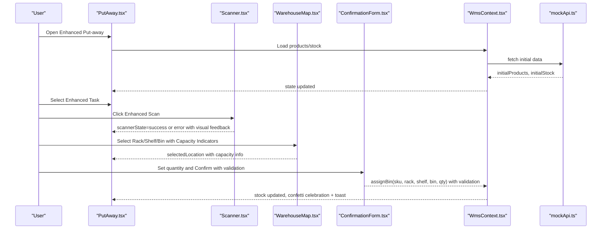

**Diagram sources**
- [PutAway.tsx:132-196](file://Frontend/src/pages/PutAway/PutAway.tsx#L132-L196)
- [Scanner.tsx:54-117](file://Frontend/src/pages/PutAway/components/Scanner.tsx#L54-L117)
- [WarehouseMap.tsx:47-216](file://Frontend/src/pages/PutAway/components/WarehouseMap.tsx#L47-L216)
- [ConfirmationForm.tsx:36-140](file://Frontend/src/pages/PutAway/components/ConfirmationForm.tsx#L36-L140)
- [WmsContext.tsx:160-194](file://Frontend/src/context/WmsContext.tsx#L160-L194)
- [mockApi.ts:7-26](file://Frontend/src/services/mockApi.ts#L7-L26)

**Section sources**
- [PutAway.tsx:1-462](file://Frontend/src/pages/PutAway/PutAway.tsx#L1-L462)
- [WmsContext.tsx:1-234](file://Frontend/src/context/WmsContext.tsx#L1-L234)
- [mockApi.ts:1-32](file://Frontend/src/services/mockApi.ts#L1-L32)

## Detailed Component Analysis

### Enhanced Put-away Workflow
The enhanced put-away page computes tasks from products and stock, tracks scanner state with improved visual feedback, and executes bin assignments with advanced UI components and enhanced user feedback.

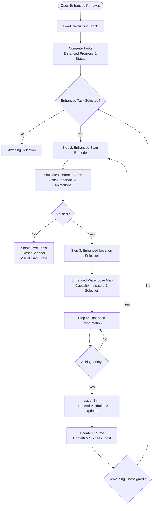

**Diagram sources**
- [PutAway.tsx:65-129](file://Frontend/src/pages/PutAway/PutAway.tsx#L65-L129)
- [PutAway.tsx:139-202](file://Frontend/src/pages/PutAway/PutAway.tsx#L139-L202)
- [WmsContext.tsx:160-194](file://Frontend/src/context/WmsContext.tsx#L160-L194)

Key enhancements:
- **Enhanced Task computation**: Aggregates per SKU totals and progress with improved status determination
- **Advanced Scanner component**: With visual feedback states (idle, scanning, success, error), scanning animations, and error handling
- **Improved bin selection**: Capacity-aware rendering with color-coded indicators (0-50%, 51-80%, 81%+), selection highlighting, and quantity badges
- **Enhanced Confirmation**: Validates quantity against unassigned amount with better error handling and visual feedback
- **Professional glassmorphism design**: Brand-consistent styling with improved typography and spacing
- **Visual celebration system**: Confetti animations with brand colors for successful operations
- **Enhanced progress tracking**: Overall pipeline progress with gradient indicators and status badges

**Section sources**
- [PutAway.tsx:65-129](file://Frontend/src/pages/PutAway/PutAway.tsx#L65-L129)
- [PutAway.tsx:139-202](file://Frontend/src/pages/PutAway/PutAway.tsx#L139-L202)
- [Scanner.tsx:19-52](file://Frontend/src/pages/PutAway/components/Scanner.tsx#L19-L52)
- [WarehouseMap.tsx:39-45](file://Frontend/src/pages/PutAway/components/WarehouseMap.tsx#L39-L45)
- [ConfirmationForm.tsx:36-140](file://Frontend/src/pages/PutAway/components/ConfirmationForm.tsx#L36-L140)
- [TaskCard.tsx:28-50](file://Frontend/src/pages/PutAway/components/TaskCard.tsx#L28-L50)
- [Stepper.tsx:16-21](file://Frontend/src/pages/PutAway/components/Stepper.tsx#L16-L21)

### Enhanced Scanner Component
The scanner component provides an enhanced barcode scanning interface with comprehensive visual feedback states and improved user interaction.

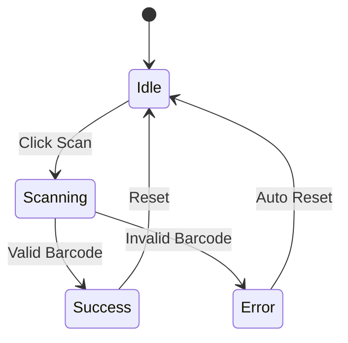

**Diagram sources**
- [Scanner.tsx:19-52](file://Frontend/src/pages/PutAway/components/Scanner.tsx#L19-L52)

Key features:
- **State-based styling**: Border colors, background colors, and icon colors change based on state
- **Visual animations**: Pulse animation during scanning, bounce animation for success, and error states
- **Progress indicator**: Animated scanning line overlay during barcode processing
- **Enhanced feedback**: Success state with checkmark icon, error state with alert icon, and scanning state with spinner
- **Interactive elements**: Hover effects and disabled states during scanning

**Section sources**
- [Scanner.tsx:19-52](file://Frontend/src/pages/PutAway/components/Scanner.tsx#L19-L52)

### Enhanced Warehouse Map Component
The warehouse map component provides an improved visualization of assigned inventory with capacity indicators and selection overlays.

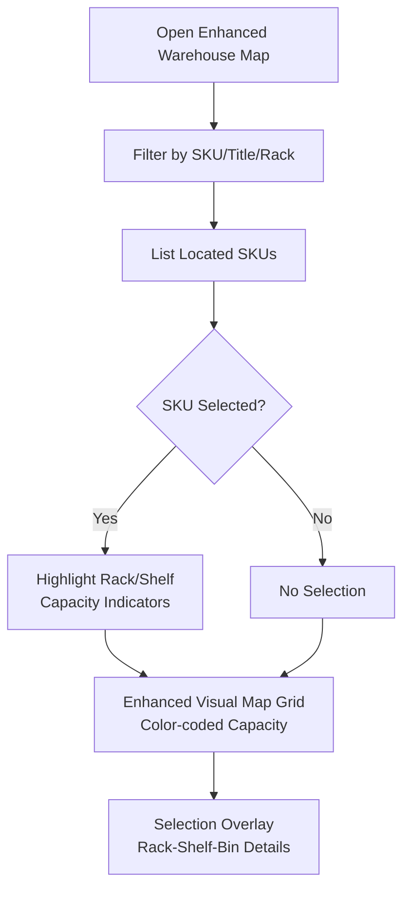

**Diagram sources**
- [WarehouseMap.tsx:30-59](file://Frontend/src/pages/WarehouseMap.tsx#L30-L59)
- [WarehouseMap.tsx:114-169](file://Frontend/src/pages/WarehouseMap.tsx#L114-L169)
- [WarehouseMap.tsx:197-267](file://Frontend/src/pages/WarehouseMap.tsx#L197-L267)
- [WarehouseMap.tsx:271-289](file://Frontend/src/pages/WarehouseMap.tsx#L271-L289)

Key improvements:
- **Enhanced rack selector**: Active rack highlighting with brand color styling
- **Improved shelf selector**: Active shelf indication with badge and hover effects
- **Advanced bin visualization**: Capacity indicators with gradient bars (0-50% success, 51-80% warning, 81%+ danger), quantity badges, and selection highlighting
- **Selection overlay**: Detailed location information with professional typography and color coding
- **Capacity awareness**: Color-coded indicators based on percentage utilization (0-100%)

**Section sources**
- [WarehouseMap.tsx:24-59](file://Frontend/src/pages/WarehouseMap.tsx#L24-L59)
- [WarehouseMap.tsx:114-169](file://Frontend/src/pages/WarehouseMap.tsx#L114-L169)
- [WarehouseMap.tsx:197-267](file://Frontend/src/pages/WarehouseMap.tsx#L197-L267)
- [WarehouseMap.tsx:271-289](file://Frontend/src/pages/WarehouseMap.tsx#L271-L289)

### Enhanced Confirmation Form
The confirmation form provides an enhanced final step for put-away operations with improved validation and user feedback.

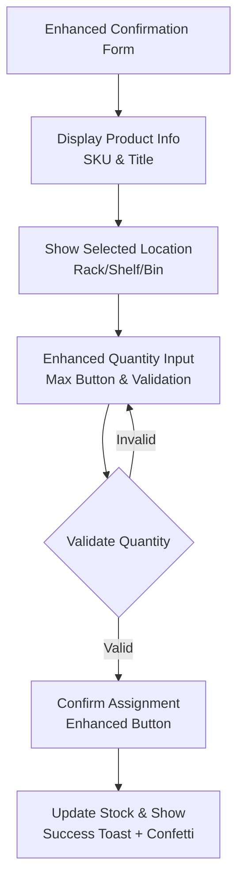

**Diagram sources**
- [ConfirmationForm.tsx:47-139](file://Frontend/src/pages/PutAway/components/ConfirmationForm.tsx#L47-L139)

Key features:
- **Product information card**: SKU and title display with brand styling
- **Location display**: Clear rack/shelf/bin information with directional indicators
- **Enhanced quantity input**: Number input with min/max validation and max button shortcut
- **Validation feedback**: Real-time validation with disabled confirm button when invalid
- **Action buttons**: Rescan option and primary confirm button with success styling

**Section sources**
- [ConfirmationForm.tsx:47-139](file://Frontend/src/pages/PutAway/components/ConfirmationForm.tsx#L47-L139)

### Enhanced Task Card Component
The task card component provides an improved display of inward items/tasks with enhanced status indicators and progress visualization.

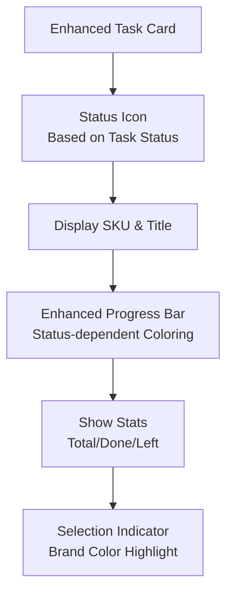

**Diagram sources**
- [TaskCard.tsx:52-141](file://Frontend/src/pages/PutAway/components/TaskCard.tsx#L52-L141)

Key improvements:
- **Status-based styling**: Different color schemes for Pending, Active, and Complete statuses
- **Enhanced progress visualization**: Status-dependent progress bar coloring (brand for Active, success for Complete)
- **Improved stats display**: Clear breakdown of total, done, and remaining quantities
- **Selection highlighting**: Brand-colored selection indicator for active tasks
- **Hover effects**: Enhanced hover states with elevation and translation

**Section sources**
- [TaskCard.tsx:52-141](file://Frontend/src/pages/PutAway/components/TaskCard.tsx#L52-L141)

### Enhanced Stepper Component
The stepper component provides an improved workflow step indicator with enhanced visual feedback.

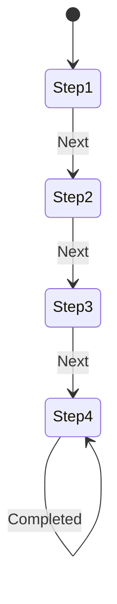

**Diagram sources**
- [Stepper.tsx:28-91](file://Frontend/src/pages/PutAway/components/Stepper.tsx#L28-L91)

Key features:
- **Progress line**: Background and fill indicators showing workflow completion
- **Step circles**: Status-dependent styling (completed, current, pending)
- **Enhanced current state**: Larger, scaled circle with brand color and shadow
- **Icon progression**: Checkmark for completed steps, appropriate icons for pending steps
- **Smooth transitions**: Duration-based transitions for state changes

**Section sources**
- [Stepper.tsx:28-91](file://Frontend/src/pages/PutAway/components/Stepper.tsx#L28-L91)

### Enhanced Outward Logistics Center
The Outward page features a comprehensive Pro Max Edition redesign with glassmorphism effects, advanced KPI dashboards, and streamlined order processing.

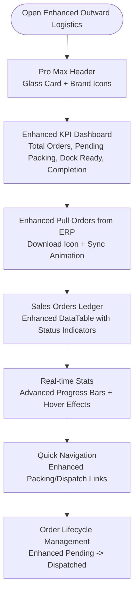

**Diagram sources**
- [Outward.tsx:135-260](file://Frontend/src/pages/Outward.tsx#L135-L260)
- [Outward.tsx:167-222](file://Frontend/src/pages/Outward.tsx#L167-L222)
- [Outward.tsx:225-258](file://Frontend/src/pages/Outward.tsx#L225-L258)

Key enhancements:
- **Glassmorphism Header**: Modern frosted glass effect with brand-consistent styling
- **Advanced KPI Dashboard**: Four-panel metrics with hover animations and enhanced progress indicators
- **Real-time Order Sync**: Animated pull button with ERP integration simulation
- **Enhanced DataTable**: Status badges with color-coded indicators and animated progress bars
- **Interactive Elements**: Hover effects, transitions, and responsive design

**Section sources**
- [Outward.tsx:15-56](file://Frontend/src/pages/Outward.tsx#L15-L56)
- [Outward.tsx:135-260](file://Frontend/src/pages/Outward.tsx#L135-L260)
- [Outward.tsx:167-222](file://Frontend/src/pages/Outward.tsx#L167-L222)
- [Outward.tsx:225-258](file://Frontend/src/pages/Outward.tsx#L225-L258)

### Professional Inward Processing Center
The Inward page showcases a complete redesign with brand-consistent theming, improved invoice management, and real-time synchronization capabilities.

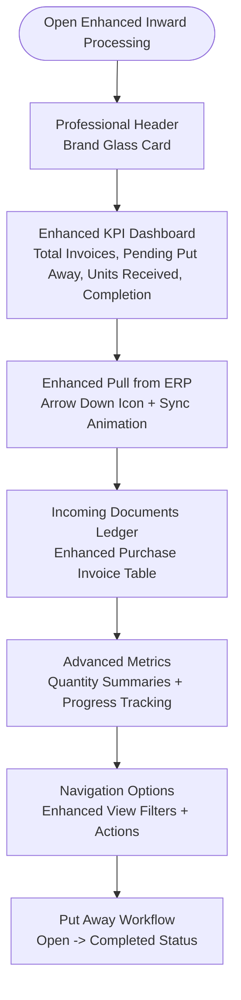

**Diagram sources**
- [Inward.tsx:135-245](file://Frontend/src/pages/Inward.tsx#L135-L245)
- [Inward.tsx:167-208](file://Frontend/src/pages/Inward.tsx#L167-L208)
- [Inward.tsx:210-244](file://Frontend/src/pages/Inward.tsx#L210-L244)

Key improvements:
- **Brand Consistent Design**: Unified color scheme with brand-specific styling
- **Enhanced KPI Metrics**: Comprehensive dashboard with meaningful business indicators
- **Real-time Synchronization**: Animated pull button with ERP communication simulation
- **Professional DataTable**: Enhanced column styling with supplier information and status tracking
- **Responsive Layout**: Optimized for different screen sizes with grid-based design

**Section sources**
- [Inward.tsx:14-55](file://Frontend/src/pages/Inward.tsx#L14-L55)
- [Inward.tsx:135-245](file://Frontend/src/pages/Inward.tsx#L135-L245)
- [Inward.tsx:167-208](file://Frontend/src/pages/Inward.tsx#L167-L208)
- [Inward.tsx:210-244](file://Frontend/src/pages/Inward.tsx#L210-L244)

### Revolutionary Stock Movement Operations
The Stock Movement page features a revolutionary dual-panel layout with an adjustment form on the left and live ledger on the right, providing an intuitive workflow for inventory management with comprehensive visual feedback and enhanced data handling.

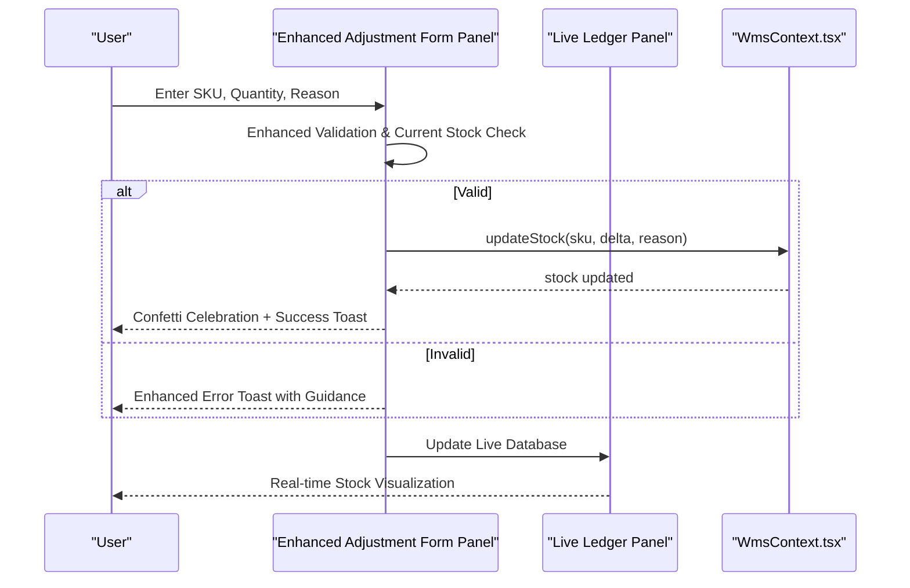

**Diagram sources**
- [StockMovement.tsx:20-50](file://Frontend/src/pages/StockMovement.tsx#L20-L50)
- [StockMovement.tsx:105-272](file://Frontend/src/pages/StockMovement.tsx#L105-L272)
- [StockMovement.tsx:237-269](file://Frontend/src/pages/StockMovement.tsx#L237-L269)

Key innovations:
- **Dual-Panel Layout**: Left panel for adjustments, right panel for live database with enhanced visual design
- **Enhanced Form Design**: Professional styling with visual feedback for positive/negative adjustments, animated icons, and improved accessibility
- **Advanced Validation**: Comprehensive field validation with real-time error prevention and user guidance
- **Visual Celebration System**: Confetti animations for successful operations with color-coded feedback based on adjustment type
- **Live Ledger**: Real-time stock visualization with enhanced capacity indicators, color-coded quantity badges, and improved filtering
- **Professional Typography**: Consistent font hierarchy with brand-appropriate sizing and weights throughout the interface
- **Comprehensive Audit Trail**: Enhanced activity logging with detailed descriptions and timestamp tracking

**Section sources**
- [StockMovement.tsx:13-50](file://Frontend/src/pages/StockMovement.tsx#L13-L50)
- [StockMovement.tsx:105-272](file://Frontend/src/pages/StockMovement.tsx#L105-L272)
- [StockMovement.tsx:237-269](file://Frontend/src/pages/StockMovement.tsx#L237-L269)

### Backend API Integration (Demonstration)
The backend provides a product controller with CRUD and search endpoints. JWT authentication and Swagger are configured in the startup.

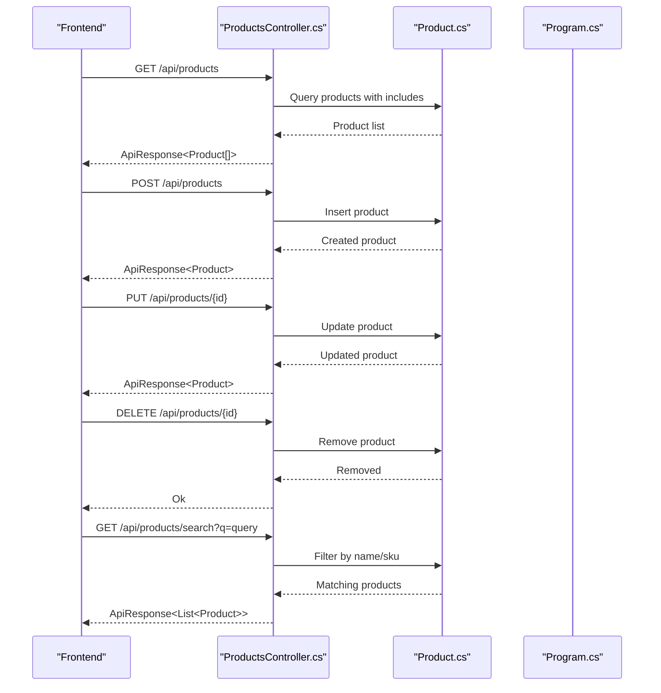

**Diagram sources**
- [ProductsController.cs:20-113](file://Backend/PlusgrowWms.Api/Controllers/ProductsController.cs#L20-L113)
- [Product.cs:6-65](file://Backend/PlusgrowWms.Api/Models/Product.cs#L6-L65)
- [Program.cs:25-102](file://Backend/PlusgrowWms.Api/Program.cs#L25-L102)

**Section sources**
- [ProductsController.cs:1-117](file://Backend/PlusgrowWms.Api/Controllers/ProductsController.cs#L1-L117)
- [Product.cs:1-65](file://Backend/PlusgrowWms.Api/Models/Product.cs#L1-L65)
- [Program.cs:1-107](file://Backend/PlusgrowWms.Api/Program.cs#L1-L107)

## Pro Max Edition Styling System

The PlusGrow WMS Pro Max Edition introduces a comprehensive design system with advanced styling capabilities:

### Design Tokens and Color Palette
- **Brand Colors**: Comprehensive ocean/teal color palette from 50 to 950 for consistent branding
- **Semantic Colors**: Success (green), Warning (amber), Danger (red), Info (ocean/teal) palettes
- **Neutral Colors**: 0-950 scale for backgrounds, borders, and text hierarchy
- **Typography**: Inter for sans-serif, Poppins for headings, Space Grotesk for accents

### Advanced Card Variants
- **Glass Cards**: Frosted glass effect with backdrop blur and semi-transparent backgrounds
- **Elevated Cards**: Floating elevation with enhanced shadows and hover effects
- **Interactive Cards**: Hover animations with scaling and elevation changes
- **Outlined Cards**: Clean borders with subtle shadows for minimalist design

### Enhanced Button System
- **Gradient Buttons**: Primary and success buttons with gradient backgrounds
- **Size Variations**: XS to XL sizes with consistent spacing and proportions
- **State Handling**: Loading states with spinner animations and disabled states
- **Icon Integration**: Left and right icon positioning with consistent spacing

### Advanced Typography System
- **Font Families**: System-friendly font stacks with fallbacks
- **Font Sizes**: 4px base scale from XS to 4XL for consistent hierarchy
- **Font Weights**: Normal, Medium, Semibold, Bold, Extrabold for emphasis
- **Line Heights**: Optimized line heights for readability across scales

### Animation and Motion System
- **Duration Scale**: Instant to slower durations for different interaction types
- **Easing Functions**: Linear, in, out, in-out, bounce, and spring easing
- **Keyframe Animations**: Fade, slide, scale, spin, pulse, and bounce animations
- **Transition Effects**: Smooth transitions for hover states and property changes

**Section sources**
- [tokens.css:1-483](file://Frontend/src/styles/tokens.css#L1-L483)
- [Card.tsx:10-67](file://Frontend/src/components/atoms/Card/Card.tsx#L10-L67)
- [Button.tsx:10-46](file://Frontend/src/components/atoms/Button/Button.tsx#L10-L46)
- [utils.ts:1-7](file://Frontend/src/lib/utils.ts#L1-L7)

## Dependency Analysis
Frontend dependencies:
- WmsContext depends on mockApi and types
- **Enhanced Outward page**: Uses glass cards, brand buttons, and advanced DataTable with custom styling
- **Enhanced Inward page**: Implements brand-consistent theming with professional card layouts
- **Revolutionary Stock Movement**: Features dual-panel layout with enhanced form styling, live ledger, and comprehensive data handling
- **Enhanced Put-away page**: Composes Scanner, WarehouseMap, ConfirmationForm, TaskCard, Stepper with enhanced UI components
- Stock movement page depends on context actions and types with improved error handling
- **Enhanced Warehouse map page**: Depends on context and types with enhanced visual feedback

Backend dependencies:
- ProductsController depends on DbContext and Product model
- Program configures services, JWT, Swagger, and CORS

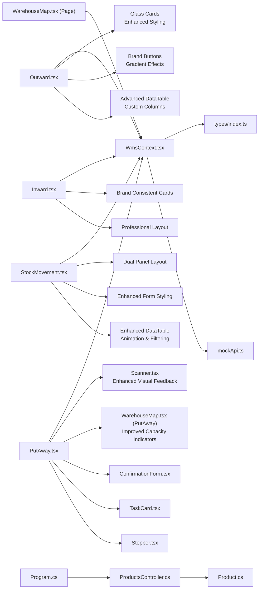

**Diagram sources**
- [WmsContext.tsx:1-234](file://Frontend/src/context/WmsContext.tsx#L1-L234)
- [Outward.tsx:1-263](file://Frontend/src/pages/Outward.tsx#L1-L263)
- [Inward.tsx:1-249](file://Frontend/src/pages/Inward.tsx#L1-L249)
- [StockMovement.tsx:1-275](file://Frontend/src/pages/StockMovement.tsx#L1-L275)
- [PutAway.tsx:16-24](file://Frontend/src/pages/PutAway/PutAway.tsx#L16-L24)
- [Card.tsx:10-67](file://Frontend/src/components/atoms/Card/Card.tsx#L10-L67)
- [Button.tsx:10-46](file://Frontend/src/components/atoms/Button/Button.tsx#L10-L46)
- [DataTable.tsx:1-236](file://Frontend/src/components/molecules/DataTable/DataTable.tsx#L1-L236)
- [Scanner.tsx:1-118](file://Frontend/src/pages/PutAway/components/Scanner.tsx#L1-L118)
- [WarehouseMap.tsx:1-217](file://Frontend/src/pages/PutAway/components/WarehouseMap.tsx#L1-L217)
- [ProductsController.cs:13-18](file://Backend/PlusgrowWms.Api/Controllers/ProductsController.cs#L13-L18)
- [Product.cs:6-65](file://Backend/PlusgrowWms.Api/Models/Product.cs#L6-L65)
- [Program.cs:25-102](file://Backend/PlusgrowWms.Api/Program.cs#L25-L102)

**Section sources**
- [Outward.tsx:1-263](file://Frontend/src/pages/Outward.tsx#L1-L263)
- [Inward.tsx:1-249](file://Frontend/src/pages/Inward.tsx#L1-L249)
- [StockMovement.tsx:1-275](file://Frontend/src/pages/StockMovement.tsx#L1-L275)
- [PutAway.tsx:16-24](file://Frontend/src/pages/PutAway/PutAway.tsx#L16-L24)
- [WmsContext.tsx:1-234](file://Frontend/src/context/WmsContext.tsx#L1-L234)
- [ProductsController.cs:13-18](file://Backend/PlusgrowWms.Api/Controllers/ProductsController.cs#L13-L18)
- [Program.cs:25-102](file://Backend/PlusgrowWms.Api/Program.cs#L25-L102)

## Performance Considerations
- **Enhanced Put-away task computation**: Uses memoization to avoid re-computation on unrelated state changes
- **Enhanced Outward page**: Optimized rendering with virtualized tables and efficient state updates
- **Professional Inward page**: Efficient data filtering with debounced search and optimized KPI calculations
- **Revolutionary Stock Movement**: Dual-panel layout with lazy loading, efficient form validation, and enhanced DataTable performance
- **Enhanced Stock movement filtering**: Client-side filtering; for large datasets, consider pagination or server-side filtering
- **Enhanced Warehouse map**: Renders compact grid with optimized capacity calculations and minimal re-renders
- **Advanced animations**: CSS-based animations for better performance than JavaScript animations
- **Glassmorphism effects**: Optimized backdrop blur and transparency for smooth rendering
- **Enhanced DataTable**: Optimized table rendering with virtualization and efficient row updates
- **Enhanced Scanner component**: Optimized state management with efficient visual feedback updates
- **Enhanced Warehouse Map**: Efficient capacity calculations with memoization and optimized rendering
- Mock API introduces artificial delays; in production, replace with real HTTP calls and optimize caching
- Context updates are batched via React state; ensure components subscribe only to necessary slices

## Troubleshooting Guide
Common issues and resolutions:
- **Enhanced Put-away barcode verification fails**: Retry scanning; ensure simulated success rate threshold is met
- **Invalid quantity in enhanced confirmation**: Adjust quantity to be within unassigned bounds with improved validation
- **Negative stock after adjustment**: The system prevents reductions below zero; verify current stock before adjusting
- **Enhanced Outward page**: Glass card rendering issues: check browser compatibility with backdrop-filter
- **Professional Inward page**: Brand styling conflicts: verify CSS specificity and order of style application
- **Revolutionary Stock Movement**: Dual-panel layout problems: ensure proper responsive breakpoints and grid configuration
- **Enhanced DataTable**: Performance issues with large datasets: implement pagination or virtualization
- **Enhanced Warehouse map**: Unexpected capacity display: check bin aggregation logic and max capacity parameter
- **Enhanced Scanner**: Visual feedback not updating: verify state management and animation triggers
- **Enhanced Confirmation form**: Validation not working: check prop passing and state updates
- Backend API not reachable: verify CORS policy allows frontend origin and authentication headers are present

**Section sources**
- [PutAway.tsx:143-151](file://Frontend/src/pages/PutAway/PutAway.tsx#L143-L151)
- [PutAway.tsx:165-169](file://Frontend/src/pages/PutAway/PutAway.tsx#L165-L169)
- [StockMovement.tsx:29-32](file://Frontend/src/pages/StockMovement.tsx#L29-L32)
- [WarehouseMap.tsx:39-45](file://Frontend/src/pages/PutAway/components/WarehouseMap.tsx#L39-L45)
- [Program.cs:75-83](file://Backend/PlusgrowWms.Api/Program.cs#L75-L83)

## Conclusion
PlusGrow WMS Pro Max Edition provides a comprehensive and professionally designed set of warehouse operations:
- **Enhanced Put-away operations**: Advanced UI components with improved scanner integration, better bin allocation algorithms, and enhanced visual feedback system
- **Enhanced Outward logistics**: Professional glassmorphism design with advanced KPI dashboards and streamlined order processing
- **Professional Inward processing**: Brand-consistent theming with improved invoice management and real-time synchronization
- **Revolutionary Stock Movement**: Dual-panel layout with intuitive workflow, enhanced visual feedback, comprehensive audit trail, and improved data handling
- **Enhanced Warehouse mapping**: 3D-like visualization with capacity management, improved location availability tracking, and advanced selection overlays
- Advanced design system with comprehensive styling capabilities and performance optimizations
- Mock services enable rapid iteration; backend scaffolding supports future integration
Adopt the recommended best practices and performance tips to scale operations effectively with the new Pro Max Edition styling system and enhanced operational capabilities.

## Appendices

### Step-by-Step Workflows

- **Enhanced Put-away**
  1. Select a pending task from the enhanced directory with improved status indicators
  2. Scan the product barcode with enhanced visual feedback and scanning animations
  3. Choose a target rack/shelf/bin on the improved warehouse map with capacity indicators
  4. Confirm quantity and finalize assignment with visual celebration and enhanced validation

- **Enhanced Outward logistics**
  1. Pull sales orders from ERP system with enhanced synchronization
  2. Monitor KPI dashboard for order status with advanced metrics
  3. Track order lifecycle from pending to dispatched with enhanced progress
  4. Navigate to packing and dispatch workflows with improved interface

- **Professional Inward processing**
  1. Synchronize purchase invoices from ERP with enhanced real-time updates
  2. Monitor put-away progress and completion rates with improved tracking
  3. Track supplier relationships and delivery status with enhanced visibility
  4. Manage inventory receipt and storage with improved workflow

- **Revolutionary Stock Movement**
  1. Enter SKU and quantity delta in the enhanced adjustment form with validation
  2. Select reason category from dropdown with comprehensive options
  3. Execute movement with visual feedback and confetti celebration
  4. Monitor live ledger for real-time updates with enhanced filtering

- **Enhanced Warehouse mapping**
  1. Search by SKU, title, or rack with improved filtering
  2. Select an item to highlight its location with enhanced visualization
  3. Navigate racks and shelves to locate inventory with improved capacity indicators

**Section sources**
- [PutAway.tsx:132-196](file://Frontend/src/pages/PutAway/PutAway.tsx#L132-L196)
- [Outward.tsx:22-56](file://Frontend/src/pages/Outward.tsx#L22-L56)
- [Inward.tsx:19-55](file://Frontend/src/pages/Inward.tsx#L19-L55)
- [StockMovement.tsx:20-50](file://Frontend/src/pages/StockMovement.tsx#L20-L50)
- [WarehouseMap.tsx:114-169](file://Frontend/src/pages/WarehouseMap.tsx#L114-L169)

### User Interaction Patterns
- **Enhanced Put-away page**: Progressive disclosure with improved stepper, enhanced visual feedback, and immediate success celebrations
- **Enhanced Outward page**: Glass header with animated pull button, interactive KPI cards with hover effects
- **Professional Inward page**: Brand-consistent navigation, professional card layouts with status indicators
- **Revolutionary Stock Movement**: Dual-panel interface with immediate visual feedback, animated confetti celebrations, enhanced form validation
- **Enhanced Scanner**: State-based visual feedback with scanning animations and error handling
- **Enhanced Warehouse Map**: Capacity-aware bin selection with color-coded indicators and selection overlays
- **Enhanced Task Cards**: Status-based styling with improved progress visualization and selection indicators

**Section sources**
- [Outward.tsx:135-260](file://Frontend/src/pages/Outward.tsx#L135-L260)
- [Inward.tsx:135-245](file://Frontend/src/pages/Inward.tsx#L135-L245)
- [StockMovement.tsx:105-272](file://Frontend/src/pages/StockMovement.tsx#L105-L272)
- [Stepper.tsx:28-92](file://Frontend/src/pages/PutAway/components/Stepper.tsx#L28-L92)
- [ConfirmationForm.tsx:88-114](file://Frontend/src/pages/PutAway/components/ConfirmationForm.tsx#L88-L114)
- [WarehouseMap.tsx:166-205](file://Frontend/src/pages/PutAway/components/WarehouseMap.tsx#L166-L205)
- [Scanner.tsx:54-117](file://Frontend/src/pages/PutAway/components/Scanner.tsx#L54-L117)

### Operational Best Practices
- **Enhanced Put-away page**: Monitor enhanced progress tracking, use improved scanner with reliable verification, leverage capacity indicators for optimal bin allocation
- **Enhanced Outward page**: Monitor KPI dashboards regularly, use pull button for real-time order synchronization
- **Professional Inward page**: Track completion rates, monitor supplier performance, maintain ERP connectivity
- **Revolutionary Stock Movement**: Use reason categories consistently for auditability, verify stock levels before adjustments, leverage live ledger for real-time monitoring
- **Enhanced Warehouse map**: Use capacity indicators to optimize bin utilization, leverage selection overlays for precise location identification
- Always verify barcode matches before proceeding with enhanced scanner
- Prefer partial allocations to preserve unassigned stock with improved validation
- Use reason categories consistently for auditability
- Keep bin capacity visible with enhanced indicators; avoid over-allocation
- Refresh data regularly to synchronize with upstream systems
- Utilize enhanced visual feedback to validate critical operations

**Section sources**
- [Outward.tsx:130-133](file://Frontend/src/pages/Outward.tsx#L130-L133)
- [Inward.tsx:128-133](file://Frontend/src/pages/Inward.tsx#L128-L133)
- [StockMovement.tsx:17-50](file://Frontend/src/pages/StockMovement.tsx#L17-L50)
- [PutAway.tsx:171-177](file://Frontend/src/pages/PutAway/PutAway.tsx#L171-L177)
- [StockMovement.tsx:146-160](file://Frontend/src/pages/StockMovement.tsx#L146-L160)
- [WarehouseMap.tsx:39-45](file://Frontend/src/pages/PutAway/components/WarehouseMap.tsx#L39-L45)

### Integration with Mock Data and API Services
- Initial datasets: products, customers, purchase/sales invoices, stock, activities
- Mock API endpoints: getProducts, getCustomers, getPurchaseInvoices, getSalesInvoices, getStock, getActivities
- Context loads all resources concurrently and exposes actions to mutate state
- **Enhanced Put-away page**: Simulates enhanced scanner with visual feedback and improved validation
- **Enhanced Outward page**: Simulates ERP synchronization with animated pull button
- **Professional Inward page**: Demonstrates real-time invoice synchronization
- **Revolutionary Stock Movement**: Provides immediate feedback for manual adjustments with enhanced validation
- **Enhanced DataTable**: Supports advanced filtering, sorting, and pagination for large datasets

**Section sources**
- [mockData.ts:3-38](file://Frontend/src/services/mockData.ts#L3-L38)
- [mockApi.ts:7-31](file://Frontend/src/services/mockApi.ts#L7-L31)
- [WmsContext.tsx:37-71](file://Frontend/src/context/WmsContext.tsx#L37-L71)
- [PutAway.tsx:139-152](file://Frontend/src/pages/PutAway/PutAway.tsx#L139-L152)
- [Outward.tsx:22-56](file://Frontend/src/pages/Outward.tsx#L22-L56)
- [Inward.tsx:19-55](file://Frontend/src/pages/Inward.tsx#L19-L55)
- [StockMovement.tsx:20-50](file://Frontend/src/pages/StockMovement.tsx#L20-L50)
- [DataTable.tsx:1-236](file://Frontend/src/components/molecules/DataTable/DataTable.tsx#L1-L236)

### Reporting and Automation
- Activities timeline: automatically records events for audit trails with enhanced descriptions
- Live ledger: real-time visibility into stock distribution with improved filtering and search
- **Enhanced Outward page**: KPI dashboards for order tracking and completion metrics
- **Professional Inward page**: Progress tracking and supplier performance analytics
- **Revolutionary Stock Movement**: Comprehensive audit trail integration with reason categories and detailed logging
- **Enhanced Put-away page**: Enhanced activity logging with detailed descriptions and timestamp tracking
- Automation hooks: extend context actions to integrate with external systems (e.g., ERP sync)
- **Enhanced DataTable**: Supports export functionality and advanced reporting capabilities

**Section sources**
- [WmsContext.tsx:73-81](file://Frontend/src/context/WmsContext.tsx#L73-L81)
- [StockMovement.tsx:72-75](file://Frontend/src/pages/StockMovement.tsx#L72-L75)
- [Outward.tsx:129-133](file://Frontend/src/pages/Outward.tsx#L129-L133)
- [Inward.tsx:128-133](file://Frontend/src/pages/Inward.tsx#L128-L133)
- [PutAway.tsx:196-197](file://Frontend/src/pages/PutAway/PutAway.tsx#L196-L197)
- [DataTable.tsx:1-236](file://Frontend/src/components/molecules/DataTable/DataTable.tsx#L1-L236)