# PlusGrow WMS Frontend SOP and User Guide

> Application: PlusGrow Warehouse Management System (WMS) frontend  
> Frontend path: `Frontend/`  
> Local URL: `http://localhost:3000`  
> Backend API expected by frontend: `http://localhost:5179/api` or `VITE_API_URL` from `.env.local`

## 1. Purpose

This SOP explains how to start the PlusGrow WMS website and how an end user can use the main warehouse workflows: login, dashboard, master data, inward receiving, put-away, outward order creation, picking and packing, dispatch, stock check, stock movement, warehouse map, and profile management.

## 2. Project Analysis Summary

The frontend is a Vite + React + TypeScript application using Mantine UI, React Router, React Query, Axios, Recharts, SignalR, and custom WMS components.

### Main routes

| Module | URL | Purpose |
|---|---|---|
| Login | `/login` | Operator sign-in |
| Register | `/register` | Request/create operator credentials |
| Dashboard | `/` | WMS overview, KPIs, live activity |
| Importers | `/importers` | Importer master data |
| Manufacturers | `/manufacturers` | Manufacturer master data |
| Commodities | `/commodities` | Commodity master data |
| Bin Master | `/bins` | Bin definitions |
| Location Master | `/locations` | Warehouse location setup |
| Products | `/mpd` | Product master data, upload, pricing, SKU details |
| Printer Config | `/sticker-printer-config` | Sticker printer setup |
| Purchase Invoices | `/inward` | Inward PO invoice entries and sticker workflow |
| Put Away | `/putaway` | Allocate received stock to warehouse locations |
| Sales Invoice | `/outward` | Create outbound/customer orders |
| Picking & Packing | `/packing` | Pick and pack outbound orders |
| Dispatch | `/dispatch` | Dispatch packed orders |
| Stock Check | `/stock-check` | SKU scan/search and inventory lookup |
| Stock Movement | `/stock-movement` | Review stock movement history |
| Warehouse Map | `/warehouse-map` | Visual location/stock map |
| My Profile | `/profile` | User profile and password management |

## 3. How to Run the Project

### 3.1 Prerequisites

- Node.js installed.
- Backend API running if you want live data and login from database.
- Optional `.env.local` file in `Frontend/`.

### 3.2 Environment configuration

Create `Frontend/.env.local` if needed:

```env
VITE_API_URL=http://localhost:5179/api
VITE_SUPERADMIN_USER=superadmin
VITE_SUPERADMIN_PASS=Super@Admin@2024
```

If `.env.local` is missing, the frontend defaults to:

```text
http://localhost:5179/api
```

### 3.3 Install and start

From the repository root:

```bash
cd Frontend
npm install
npm run dev
```

Open:

```text
http://localhost:3000
```

### 3.4 Build and validate

```bash
cd Frontend
npm run lint
npm run build
```

Validation performed during this SOP creation:

```text
npm run lint -> passed
npm run dev  -> Vite started successfully on http://localhost:3000
```


## 4. Sidebar Menu Sequence

The sidebar is organized in the operational order an operator normally follows. Expand each group to view its submenu items.

1. **Overview** -> Dashboard.
2. **Master Data** -> Importers, Manufacturers, Commodities, Bin Master, Location Master, Products, Printer Config.
3. **Inward Operations** -> Purchase Invoices, Put Away.
4. **Outward Operations** -> Sales Invoice, Picking & Packing, Dispatch.
5. **Inventory** -> Stock Check, Stock Movement, Warehouse Map.
6. **Account** -> My Profile.

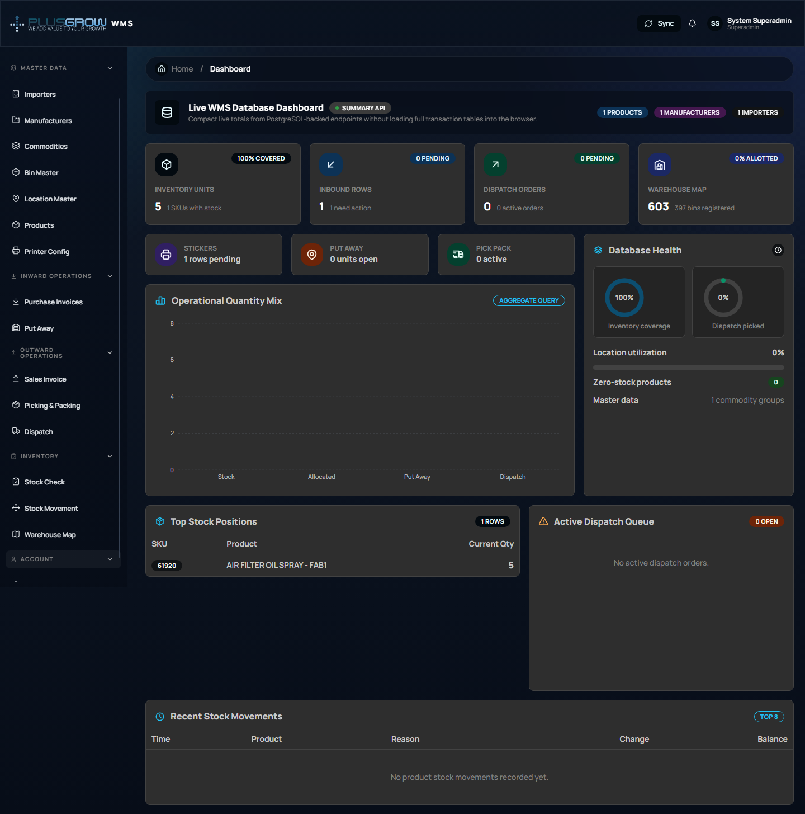
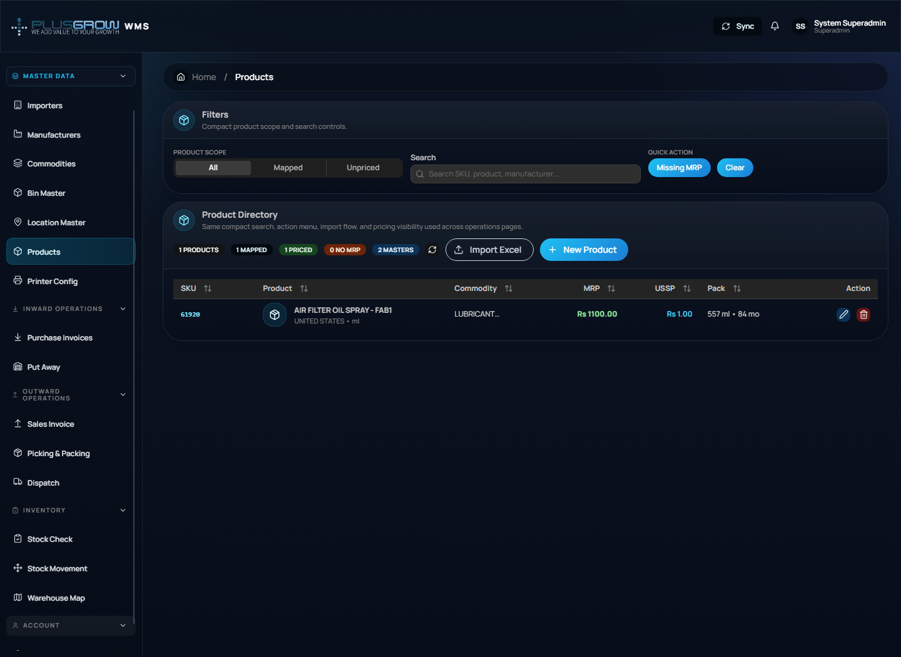
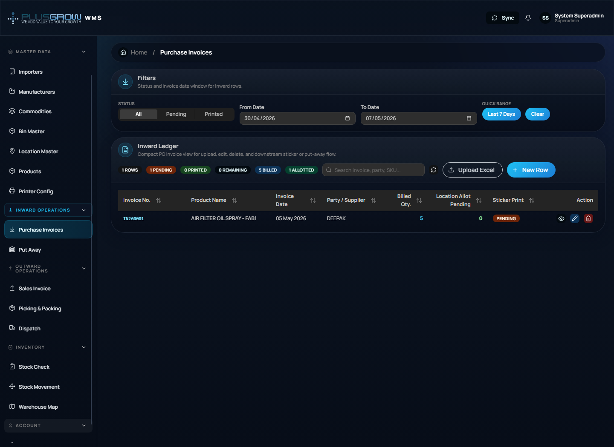
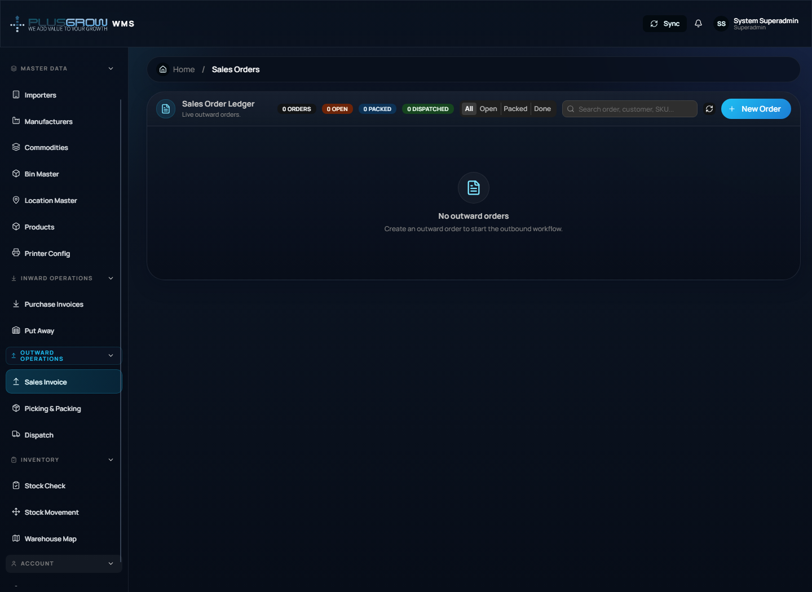
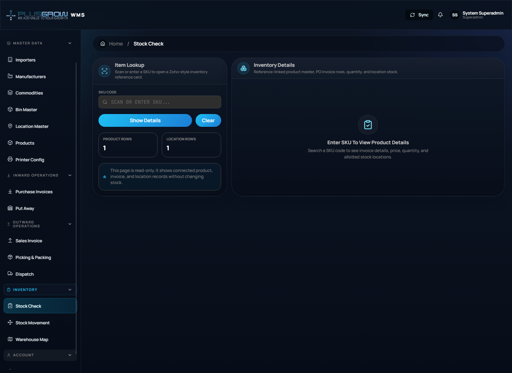
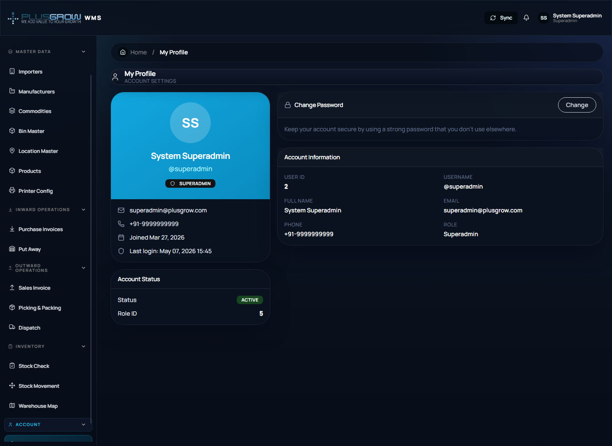

## 5. Login and Access

1. Open `http://localhost:3000/login`.
2. Enter your operator username and password.
3. Click **Sign In**.
4. On successful login, the system opens the dashboard.

Demo credentials shown in the UI:

```text
Username: admin
Password: admin123
```

> Note: Login requires the backend API to be running. If the backend is stopped, authentication and live data calls will fail.


## 6. User Registration / Credential Request

1. On the login screen, click **Request credentials**.
2. Fill the registration form.
3. Submit the request.
4. After successful registration, return to login and sign in.


## 7. Dashboard Usage

The dashboard is the command center for warehouse operations.

Use it to:

- Review inventory units and SKU coverage.
- See inbound purchase invoice status.
- Monitor dispatch order status.
- Check warehouse utilization and stock positions.
- Navigate quickly to stock check, inward, outward, and warehouse map modules.

Steps:

1. Login to the application.
2. Open **Overview > Dashboard** from the sidebar.
3. Review cards, charts, dispatch queue, and recent movements.
4. Click any metric card to open the related workflow.


## 8. Master Data SOP

Master data must be configured before warehouse transactions. Maintain these pages carefully because inward, put-away, outward, stock check, and reporting depend on them.

### 8.1 Importers

Use **Master Data > Importers** to maintain importer/vendor party details.

Steps:
1. Open **Importers** from the sidebar.
2. Use the search field to check whether the importer already exists.
3. Click **Add Importer**.
4. Enter importer name, address, phone, and email. Name is mandatory.
5. Save and verify the record appears in the table.
6. Use edit to correct contact details and delete only when the importer is no longer used by operational records.

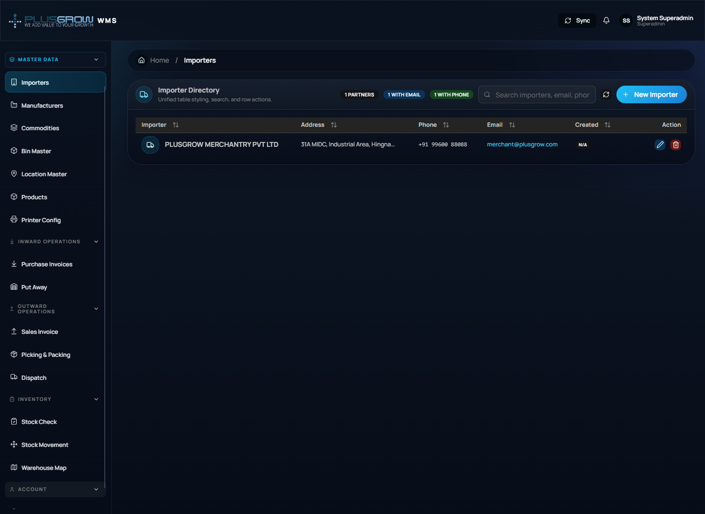

### 8.2 Manufacturers

Use **Master Data > Manufacturers** to maintain product manufacturers.

Steps:
1. Open **Manufacturers**.
2. Search existing manufacturers before adding a duplicate.
3. Click **Add Manufacturer**.
4. Enter manufacturer name, address, phone, email, and related details shown on the form.
5. Save the record and confirm it is available for product setup.
6. Edit when address/contact data changes.

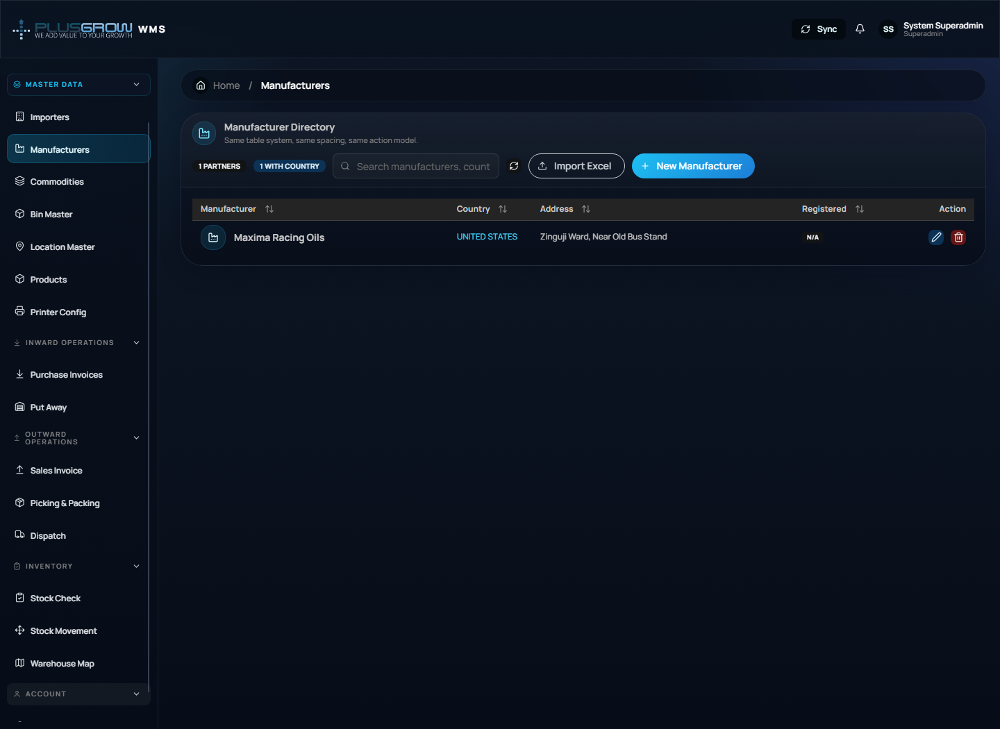

### 8.3 Commodities

Use **Master Data > Commodities** to define product categories used for product grouping and reporting.

Steps:
1. Open **Commodities**.
2. Search for the commodity/category name.
3. Click **Add Commodity** if it is missing.
4. Enter the commodity name and description where applicable.
5. Save and verify it can be selected on the product master.

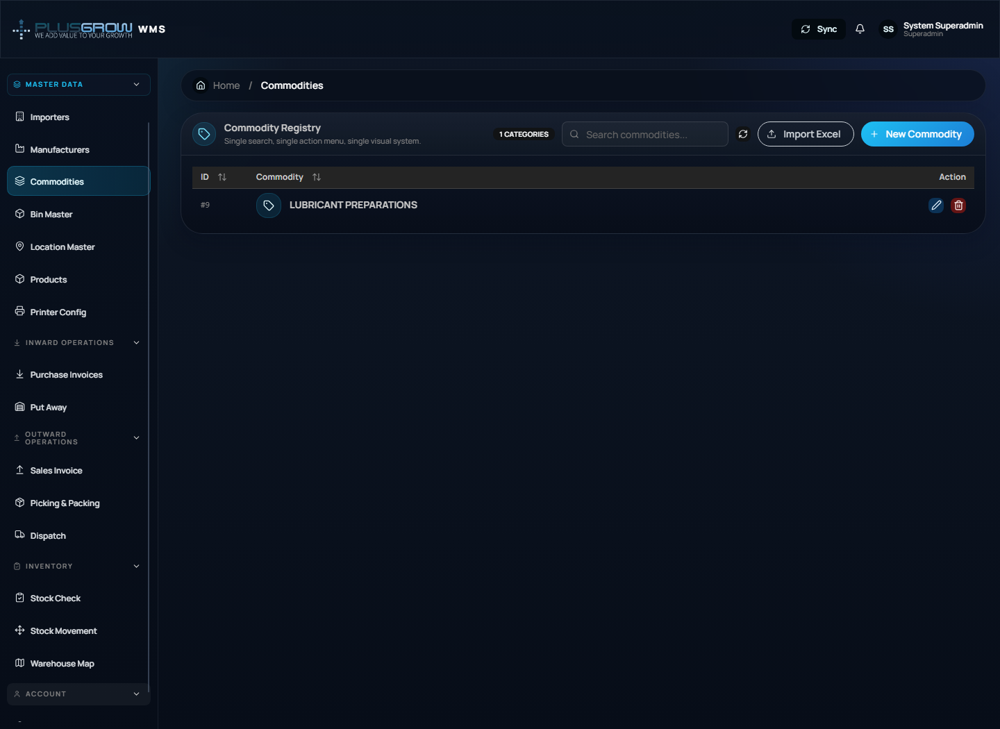

### 8.4 Bin Master

Use **Master Data > Bin Master** to define physical bin codes. Bins identify storage positions used during put-away and stock lookup.

Steps:
1. Open **Bin Master**.
2. Review existing bin codes and use search to avoid duplicates.
3. Click **Add Bin**.
4. Enter the bin code/name and any capacity or description fields available on the form.
5. Save the bin.
6. Keep bin naming consistent with the warehouse layout.

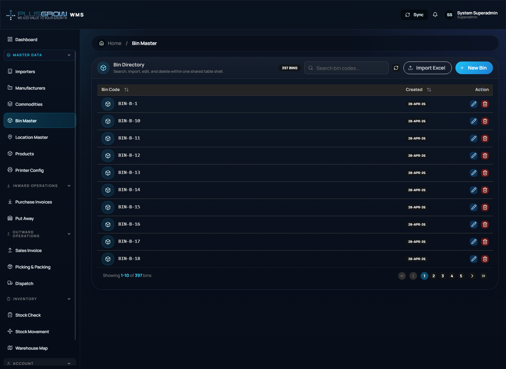

### 8.5 Location Master

Use **Master Data > Location Master** to maintain warehouse location records. Locations are later used in Put Away, Stock Check, and Warehouse Map.

Steps:
1. Open **Location Master**.
2. Search for the required warehouse location.
3. Click **Add Location**.
4. Enter location code/name, linked bin or area details, and capacity/status fields shown by the form.
5. Save and verify the location is active.
6. Update inactive/full/damaged locations before operators use them.

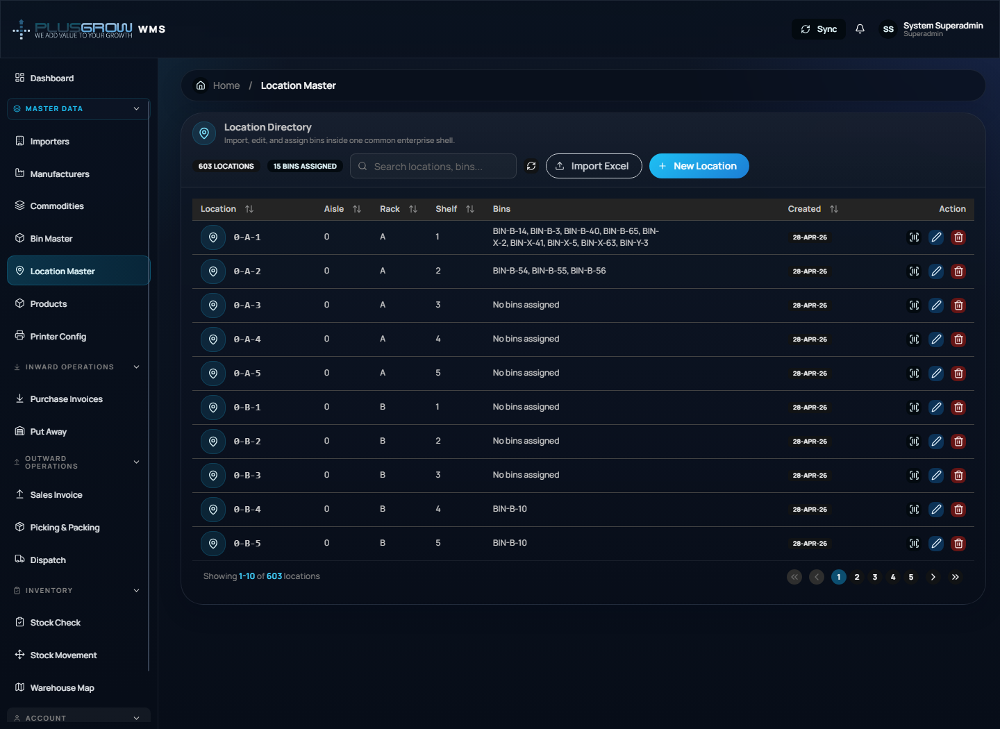

### 8.6 Products / MPD

Use **Master Data > Products** to manage SKU/product master data.

Main actions:
- Add, edit, delete, search, and filter products.
- Upload a product sheet and download the template.
- Maintain SKU, product name, commodity, manufacturer, country of origin, net quantity, unit type, USSP, MRP, best-before months, and pricing/status fields.

Recommended product setup order:
1. Add commodities and manufacturers first.
2. Open **Products**.
3. Search SKU to avoid duplicate creation.
4. Add manually or upload from Excel.
5. Verify pricing and mandatory fields.
6. Confirm the SKU appears in inward invoice product selection.


### 8.7 Printer Config

Use **Master Data > Printer Config** before printing inward stickers/labels.

Steps:
1. Open **Printer Config**.
2. Add or update printer name, paper/label size, margins, DPI, barcode/QR settings, and active status as available.
3. Save the configuration.
4. Print a test label from the inward/sticker workflow.
5. Keep only the current production printer active to avoid wrong label output.

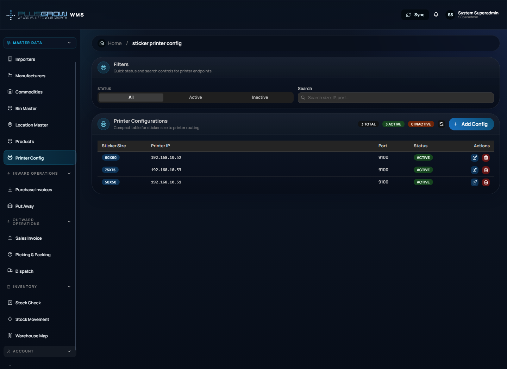

## 9. Inward Operations SOP

Inward operations handle receiving goods, creating purchase invoice rows, and printing stickers.

### 9.1 Purchase Invoices

Use **Inward Operations > Purchase Invoices**.

Main actions:

- Add purchase invoice row.
- Select invoice date, party name, product, and billed quantity.
- Search/filter invoice rows.
- Filter by pending/printed status.
- Print stickers.
- Edit/delete invoice rows when allowed.

Steps:

1. Open **Purchase Invoices**.
2. Click **Add** or **New Invoice**.
3. Select product and enter billed quantity.
4. Save the invoice row.
5. Print stickers if labels are required.
6. Confirm printed rows before put-away.


### 9.2 Put Away

Use **Inward Operations > Put Away** to move received stock into warehouse locations.

Steps:

1. Open **Put Away**.
2. Select or search SKU/invoice rows pending put-away.
3. Assign quantity to bin/location.
4. Save the allocation.
5. Verify that stock appears in Stock Check and Warehouse Map.


## 10. Outward Operations SOP

Outward operations handle customer order creation, picking, packing, and dispatch.

### 10.1 Sales Invoice / Outward Order

Use **Outward Operations > Sales Invoice**.

Main actions:

- Create outbound order.
- Enter order date, customer name, product, quantity, and notes.
- Filter by status: Open, Picking, Packed, Dispatched.
- Search customer/order/product records.

Steps:

1. Open **Sales Invoice**.
2. Click **Add Order**.
3. Select product and enter quantity.
4. Save the order.
5. Order starts as **Open** and proceeds through picking, packing, and dispatch.


### 10.2 Picking & Packing

Use **Outward Operations > Picking & Packing**.

Steps:

1. Open **Picking & Packing**.
2. Select an open/picking order.
3. Pick available stock from warehouse locations.
4. Confirm picked quantity.
5. Pack the order.
6. Verify the status changes to **Packed**.


### 10.3 Dispatch

Use **Outward Operations > Dispatch**.

Steps:

1. Open **Dispatch**.
2. Review packed orders pending dispatch.
3. Confirm dispatch details.
4. Mark order as dispatched.
5. Verify status is **Dispatched**.


## 11. Inventory SOP

### 11.1 Stock Check

Use **Inventory > Stock Check** to scan or search a SKU and view inventory details.

Steps:

1. Open **Stock Check**.
2. Enter or scan SKU.
3. Review product details, PO quantity, location stock, pricing, and related records.
4. Use links to jump to product master, inward records, or warehouse location data.


### 11.2 Stock Movement

Use **Inventory > Stock Movement** to audit movement history.

Typical use:

1. Open **Stock Movement**.
2. Search/filter by SKU, movement type, or date if available.
3. Review inward, put-away, picking, packing, and dispatch movement records.
4. Use movement history for audit, discrepancy checking, and transaction traceability.

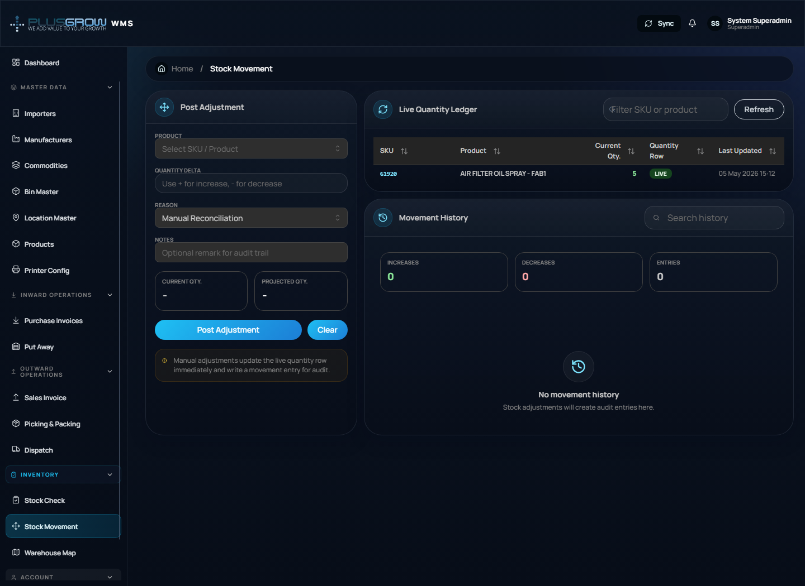

### 11.3 Warehouse Map

Use **Inventory > Warehouse Map** for a visual overview of warehouse locations and stock placement.

Steps:

1. Open **Warehouse Map**.
2. Review occupied and available locations.
3. Search or inspect SKU/location details.
4. Use it during put-away and stock audits.


## 12. Profile and Account SOP

Use **Account > My Profile**.

Main actions:

- View logged-in user details.
- Review role information.
- Change password where enabled.
- Logout from the header profile menu.

Steps:

1. Open **My Profile** from the sidebar or header avatar menu.
2. Review profile details.
3. Use password change form if required.
4. Click logout when finished.


## 13. Recommended Daily Operating Sequence

Follow this sequence for normal warehouse execution:

1. Login.
2. Check dashboard alerts and KPIs.
3. Verify master data if new products/importers/manufacturers are needed.
4. Create inward purchase invoices.
5. Print stickers.
6. Put away received quantity into locations.
7. Use stock check to verify available inventory.
8. Create outward/customer order.
9. Pick and pack order.
10. Dispatch packed order.
11. Review stock movement and dashboard for final verification.

## 14. Troubleshooting

| Problem | Possible reason | Solution |
|---|---|---|
| Cannot login | Backend API is not running or credentials are wrong | Start backend API and verify username/password |
| Dashboard shows load errors | API unavailable or database has no data | Check `VITE_API_URL`, backend server, and database |
| Product dropdown is empty | Product master data not configured | Add products in **Products** master |
| Put-away has no rows | No inward pending rows or stickers/receiving not completed | Add inward invoice and complete required previous step |
| Dispatch has no rows | No packed order available | Complete outward order, picking, and packing first |
| Sticker printing fails | Printer config missing | Configure **Printer Config** |
| Page redirects to login | Token expired or user not authenticated | Login again |

## 15. Screenshots Captured

Screenshots are stored in:

```text
Frontend/docs/screenshots/
```

Captured screens:

- Sidebar sequence: `sidebar-overview.png`, `sidebar-master-data.png`, `sidebar-inward-operations.png`, `sidebar-outward-operations.png`, `sidebar-inventory.png`, `sidebar-account.png`
- Auth and overview: `login.png`, `register.png`, `dashboard.png`
- Master data: `importers.png`, `manufacturers.png`, `commodities.png`, `bins.png`, `locations.png`, `masters-products.png`, `sticker-printer-config.png`
- Inward: `inward.png`, `putaway.png`
- Outward: `outward.png`, `packing.png`, `dispatch.png`
- Inventory and account: `stock-check.png`, `stock-movement.png`, `warehouse-map.png`, `profile.png`
